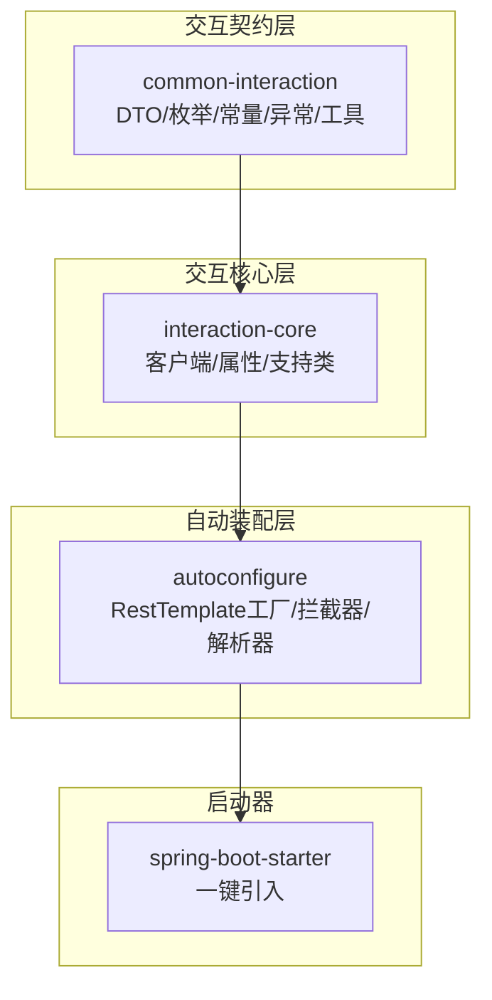
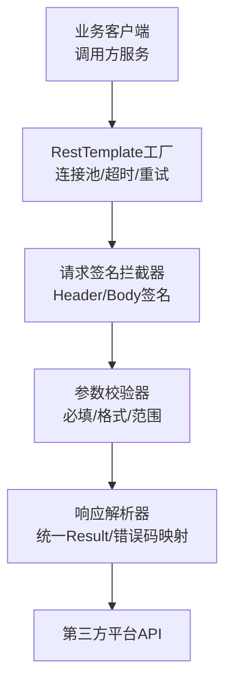
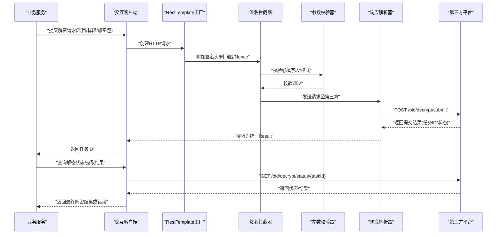
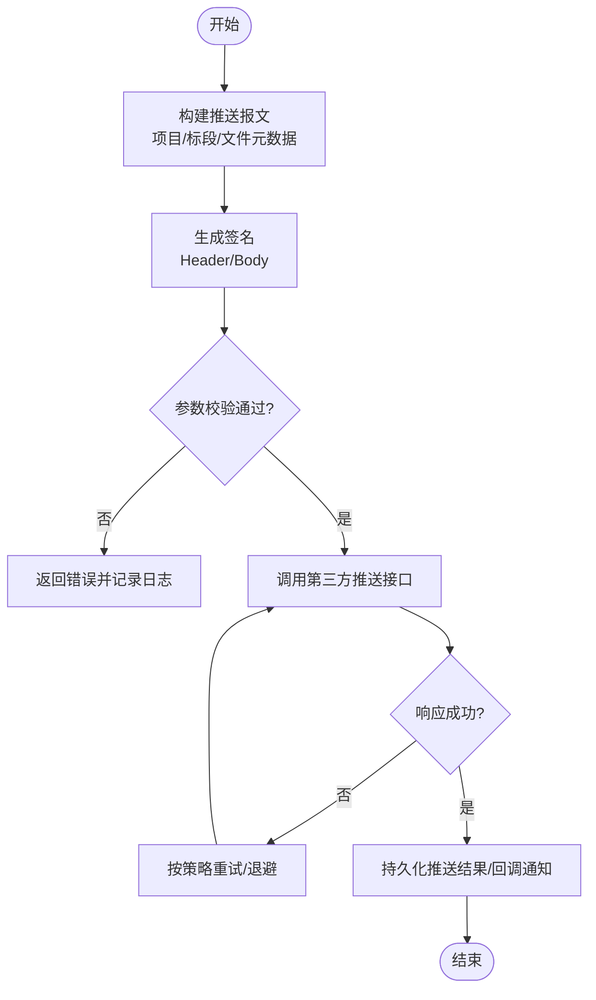
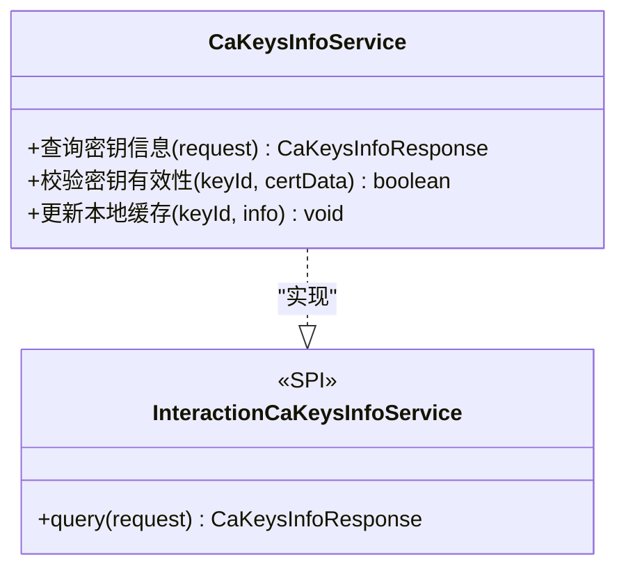
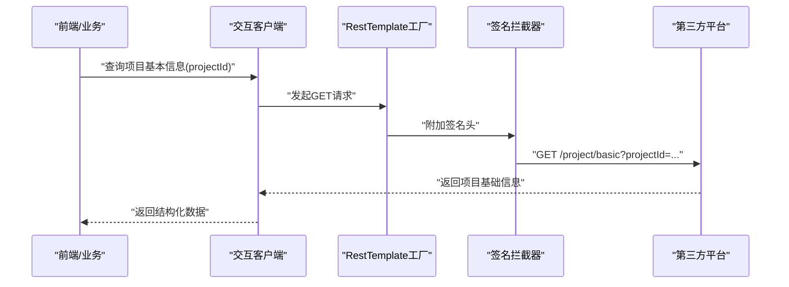
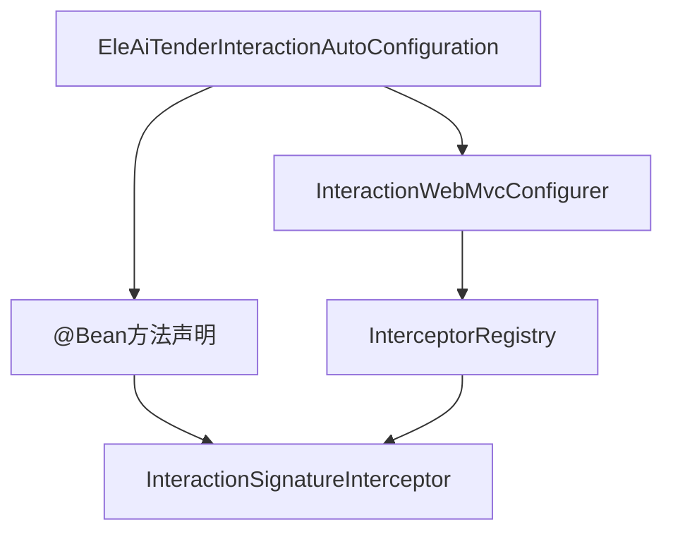
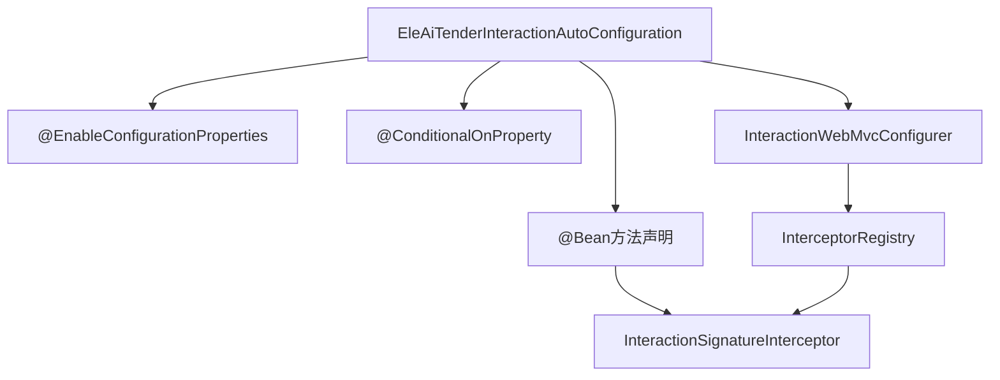
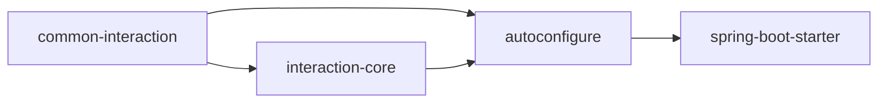
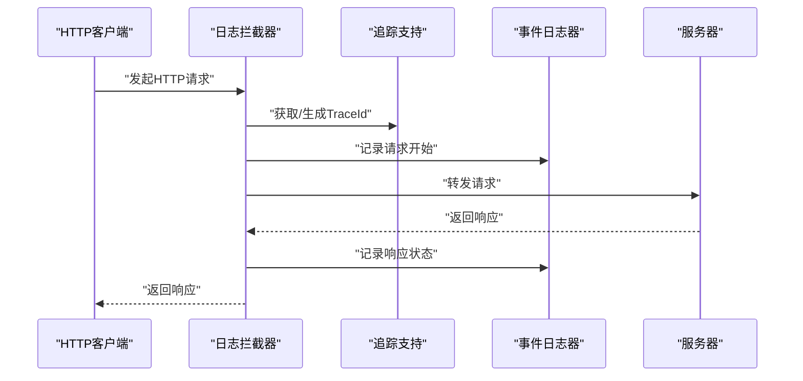

# 外部系统集成

<cite>
**本文引用的文件**   
- [ele-ai-tender-common-interaction/pom.xml](file://ele-ai-tender-system/ele-ai-tender-common-interaction/pom.xml)
- [ele-ai-tender-interaction-core/pom.xml](file://ele-ai-tender-system/ele-ai-tender-interaction/ele-ai-tender-interaction-core/pom.xml)
- [ele-ai-tender-interaction-autoconfigure/pom.xml](file://ele-ai-tender-system/ele-ai-tender-interaction/ele-ai-tender-interaction-autoconfigure/pom.xml)
- [ele-ai-tender-interaction-spring-boot-starter/pom.xml](file://ele-ai-tender-system/ele-ai-tender-interaction/ele-ai-tender-interaction-spring-boot-starter/pom.xml)
- [EleAiTenderInteractionAutoConfiguration.java](file://ele-ai-tender-system/ele-ai-tender-interaction/ele-ai-tender-interaction-autoconfigure/src/main/java/com/jy/eleaitender/interaction/autoconfigure/EleAiTenderInteractionAutoConfiguration.java)
- [InteractionSignatureInterceptor.java](file://ele-ai-tender-system/ele-ai-tender-interaction/ele-ai-tender-interaction-autoconfigure/src/main/java/com/jy/eleaitender/interaction/autoconfigure/web/InteractionSignatureInterceptor.java)
- [InteractionWebMvcConfigurer.java](file://ele-ai-tender-system/ele-ai-tender-interaction/ele-ai-tender-interaction-autoconfigure/src/main/java/com/jy/eleaitender/interaction/autoconfigure/web/InteractionWebMvcConfigurer.java)
- [OutboundLogInterceptor.java](file://ele-ai-tender-system/ele-ai-tender-interaction/ele-ai-tender-interaction-core/src/main/java/com/jy/eleaitender/interaction/core/support/OutboundLogInterceptor.java)
</cite>

## 更新摘要
**变更内容**   
- 更新了拦截器组件注册系统，从显式Bean声明方式重构为自动组件扫描(@Component注解)
- 简化了配置类结构，提升了代码简洁性和可维护性
- 优化了组件生命周期管理，减少了手动配置复杂度

## 目录
1. [简介](#简介)
2. [项目结构](#项目结构)
3. [核心组件](#核心组件)
4. [架构总览](#架构总览)
5. [详细组件分析](#详细组件分析)
6. [依赖分析](#依赖分析)
7. [性能考虑](#性能考虑)
8. [故障排查指南](#故障排查指南)
9. [结论](#结论)
10. [附录](#附录)

## 简介
本技术文档聚焦"外部系统集成"能力，围绕投标解密、标书推送、CA证书管理、项目信息查询等核心业务接口进行系统化说明。文档从系统架构、组件关系、数据流与处理逻辑、集成协议与数据格式、错误处理机制、客户端封装设计模式（RestTemplate工厂、请求签名、响应解析）、生产环境必备特性（认证授权、网络配置、超时重试、熔断降级）等方面展开，并提供API调用示例与故障排查方法，帮助外部系统快速对接与稳定运行。

## 项目结构
本项目采用多模块分层组织方式，外部系统集成相关能力集中在 interaction 系列模块中：
- ele-ai-tender-common-interaction：定义跨模块共享的交互DTO、枚举、常量、异常与工具类，作为对外接口的契约层。
- ele-ai-tender-interaction-core：实现外部系统通信的核心客户端、属性配置、支持类等。
- ele-ai-tender-interaction-autoconfigure：自动装配配置，提供开箱即用的RestTemplate工厂、签名拦截器、响应解析器等。
- ele-ai-tender-interaction-spring-boot-starter：对外暴露Starter，简化引入与配置。

图表来源
- [ele-ai-tender-common-interaction/pom.xml](file://ele-ai-tender-system/ele-ai-tender-common-interaction/pom.xml)
- [ele-ai-tender-interaction-core/pom.xml](file://ele-ai-tender-system/ele-ai-tender-interaction/ele-ai-tender-interaction-core/pom.xml)
- [ele-ai-tender-interaction-autoconfigure/pom.xml](file://ele-ai-tender-system/ele-ai-tender-interaction/ele-ai-tender-interaction-autoconfigure/pom.xml)
- [ele-ai-tender-interaction-spring-boot-starter/pom.xml](file://ele-ai-tender-system/ele-ai-tender-interaction/ele-ai-tender-interaction-spring-boot-starter/pom.xml)

章节来源
- [ele-ai-tender-common-interaction/pom.xml](file://ele-ai-tender-system/ele-ai-tender-common-interaction/pom.xml)
- [ele-ai-tender-interaction-core/pom.xml](file://ele-ai-tender-system/ele-ai-tender-interaction/ele-ai-tender-interaction-core/pom.xml)
- [ele-ai-tender-interaction-autoconfigure/pom.xml](file://ele-ai-tender-system/ele-ai-tender-interaction/ele-ai-tender-interaction-autoconfigure/pom.xml)
- [ele-ai-tender-interaction-spring-boot-starter/pom.xml](file://ele-ai-tender-system/ele-ai-tender-interaction/ele-ai-tender-interaction-spring-boot-starter/pom.xml)

## 核心组件
- 交互契约层（common-interaction）
  - 职责：统一对外接口DTO、枚举、常量、异常与通用工具，确保各模块对第三方平台的数据模型一致。
  - 典型内容：投标解密提交/结果回调、标书推送、CA密钥信息查询、项目基础信息查询、身份上下文、文件上传下载响应等。
- 交互核心层（interaction-core）
  - 职责：封装HTTP客户端、签名计算、参数校验、响应提取、错误映射等通用能力；提供面向业务的Client类。
  - 典型内容：RestTemplate工厂、签名工具、验证工具、结果提取器、属性配置类。
- 自动装配层（autoconfigure）
  - 职责：基于Spring Boot自动装配，注册RestTemplate、拦截器、序列化器、全局异常处理器等。
  - 典型内容：RestTemplate工厂、请求签名拦截器、响应解析器、连接池与超时配置。
- 启动器（spring-boot-starter）
  - 职责：对外暴露starter，简化依赖引入与默认配置。

章节来源
- [ele-ai-tender-common-interaction/pom.xml](file://ele-ai-tender-system/ele-ai-tender-common-interaction/pom.xml)
- [ele-ai-tender-interaction-core/pom.xml](file://ele-ai-tender-system/ele-ai-tender-interaction/ele-ai-tender-interaction-core/pom.xml)
- [ele-ai-tender-interaction-autoconfigure/pom.xml](file://ele-ai-tender-system/ele-ai-tender-interaction/ele-ai-tender-interaction-autoconfigure/pom.xml)
- [ele-ai-tender-interaction-spring-boot-starter/pom.xml](file://ele-ai-tender-system/ele-ai-tender-interaction/ele-ai-tender-interaction-spring-boot-starter/pom.xml)

## 架构总览
外部系统集成整体遵循"契约层—核心层—装配层—启动器"的分层架构，通过统一的RestTemplate工厂与拦截器完成请求签名、参数校验、响应解析与错误映射，上层业务仅关注领域语义。

图表来源
- [ele-ai-tender-interaction-core/pom.xml](file://ele-ai-tender-system/ele-ai-tender-interaction/ele-ai-tender-interaction-core/pom.xml)
- [ele-ai-tender-interaction-autoconfigure/pom.xml](file://ele-ai-tender-system/ele-ai-tender-interaction/ele-ai-tender-interaction-autoconfigure/pom.xml)

## 详细组件分析

### 投标解密流程
该流程涵盖"提交解密任务—轮询/回调获取结果—异常与重试处理"。

图表来源
- [ele-ai-tender-common-interaction/pom.xml](file://ele-ai-tender-system/ele-ai-tender-common-interaction/pom.xml)
- [ele-ai-tender-interaction-core/pom.xml](file://ele-ai-tender-system/ele-ai-tender-interaction/ele-ai-tender-interaction-core/pom.xml)
- [ele-ai-tender-interaction-autoconfigure/pom.xml](file://ele-ai-tender-system/ele-ai-tender-interaction/ele-ai-tender-interaction-autoconfigure/pom.xml)

章节来源
- [ele-ai-tender-common-interaction/pom.xml](file://ele-ai-tender-system/ele-ai-tender-common-interaction/pom.xml)
- [ele-ai-tender-interaction-core/pom.xml](file://ele-ai-tender-system/ele-ai-tender-interaction/ele-ai-tender-interaction-core/pom.xml)
- [ele-ai-tender-interaction-autoconfigure/pom.xml](file://ele-ai-tender-system/ele-ai-tender-interaction/ele-ai-tender-interaction-autoconfigure/pom.xml)

### 标书推送流程
标书推送通常包含"构建推送报文—签名—上传/推送—接收确认—失败重试"。

图表来源
- [ele-ai-tender-common-interaction/pom.xml](file://ele-ai-tender-system/ele-ai-tender-common-interaction/pom.xml)
- [ele-ai-tender-interaction-core/pom.xml](file://ele-ai-tender-system/ele-ai-tender-interaction/ele-ai-tender-interaction-core/pom.xml)
- [ele-ai-tender-interaction-autoconfigure/pom.xml](file://ele-ai-tender-system/ele-ai-tender-interaction/ele-ai-tender-interaction-autoconfigure/pom.xml)

章节来源
- [ele-ai-tender-common-interaction/pom.xml](file://ele-ai-tender-system/ele-ai-tender-common-interaction/pom.xml)
- [ele-ai-tender-interaction-core/pom.xml](file://ele-ai-tender-system/ele-ai-tender-interaction/ele-ai-tender-interaction-core/pom.xml)
- [ele-ai-tender-interaction-autoconfigure/pom.xml](file://ele-ai-tender-system/ele-ai-tender-interaction/ele-ai-tender-interaction-autoconfigure/pom.xml)

### CA证书管理
CA证书管理主要涉及"密钥信息查询/更新/校验"，用于后续签名与加解密流程。

图表来源
- [ele-ai-tender-common-interaction/pom.xml](file://ele-ai-tender-system/ele-ai-tender-common-interaction/pom.xml)

章节来源
- [ele-ai-tender-common-interaction/pom.xml](file://ele-ai-tender-system/ele-ai-tender-common-interaction/pom.xml)

### 项目信息查询
项目信息查询用于获取第三方平台的项目基础信息与招标详情，支撑前端展示与业务决策。

图表来源
- [ele-ai-tender-common-interaction/pom.xml](file://ele-ai-tender-system/ele-ai-tender-common-interaction/pom.xml)
- [ele-ai-tender-interaction-core/pom.xml](file://ele-ai-tender-system/ele-ai-tender-interaction/ele-ai-tender-interaction-core/pom.xml)
- [ele-ai-tender-interaction-autoconfigure/pom.xml](file://ele-ai-tender-system/ele-ai-tender-interaction/ele-ai-tender-interaction-autoconfigure/pom.xml)

章节来源
- [ele-ai-tender-common-interaction/pom.xml](file://ele-ai-tender-system/ele-ai-tender-common-interaction/pom.xml)
- [ele-ai-tender-interaction-core/pom.xml](file://ele-ai-tender-system/ele-ai-tender-interaction/ele-ai-tender-interaction-core/pom.xml)
- [ele-ai-tender-interaction-autoconfigure/pom.xml](file://ele-ai-tender-system/ele-ai-tender-interaction/ele-ai-tender-interaction-autoconfigure/pom.xml)

### 客户端封装设计模式
- RestTemplate工厂
  - 作用：集中管理连接池、超时、重试、SSL/TLS、代理等网络配置，避免在各业务处重复配置。
  - 关键点：线程安全、可插拔拦截器、可观测性（指标/日志）。
- 请求签名
  - 作用：保障请求完整性与不可抵赖性，防止篡改。
  - 关键点：时间戳+随机数防重放、签名算法选择（如HMAC-SHA256）、Header注入、Body签名策略。
- 响应解析
  - 作用：将第三方平台响应统一转换为内部Result对象，便于错误码映射与异常处理。
  - 关键点：JSON反序列化容错、字段缺失兜底、错误码到业务异常的映射。

章节来源
- [ele-ai-tender-interaction-core/pom.xml](file://ele-ai-tender-system/ele-ai-tender-interaction/ele-ai-tender-interaction-core/pom.xml)
- [ele-ai-tender-interaction-autoconfigure/pom.xml](file://ele-ai-tender-system/ele-ai-tender-interaction/ele-ai-tender-interaction-autoconfigure/pom.xml)

### 拦截器组件注册系统重构

**更新** 拦截器组件注册系统已重构为使用自动组件扫描(@Component注解)，替代了显式的Bean声明方式，提升了代码简洁性

#### 重构前架构
在重构之前，拦截器组件通过显式的@Bean方法进行注册：

#### 重构后架构
重构后，组件注册系统采用更简洁的自动装配模式：

#### 关键改进点
- **简化配置**：移除了复杂的组件扫描配置，减少样板代码
- **条件装配**：通过@ConditionalOnProperty实现按需启用
- **依赖注入**：保持清晰的依赖关系和构造函数注入
- **可测试性**：提高了单元测试的可维护性

**章节来源**
- [EleAiTenderInteractionAutoConfiguration.java:31-34](file://ele-ai-tender-system/ele-ai-tender-interaction/ele-ai-tender-interaction-autoconfigure/src/main/java/com/jy/eleaitender/interaction/autoconfigure/EleAiTenderInteractionAutoConfiguration.java#L31-L34)
- [EleAiTenderInteractionAutoConfiguration.java:83-91](file://ele-ai-tender-system/ele-ai-tender-interaction/ele-ai-tender-interaction-autoconfigure/src/main/java/com/jy/eleaitender/interaction/autoconfigure/EleAiTenderInteractionAutoConfiguration.java#L83-L91)
- [InteractionSignatureInterceptor.java:15-21](file://ele-ai-tender-system/ele-ai-tender-interaction/ele-ai-tender-interaction-autoconfigure/src/main/java/com/jy/eleaitender/interaction/autoconfigure/web/InteractionSignatureInterceptor.java#L15-L21)
- [InteractionWebMvcConfigurer.java:10-22](file://ele-ai-tender-system/ele-ai-tender-interaction/ele-ai-tender-interaction-autoconfigure/src/main/java/com/jy/eleaitender/interaction/autoconfigure/web/InteractionWebMvcConfigurer.java#L10-L22)

## 依赖分析
interaction 模块之间的依赖关系如下：
- common-interaction 被 core 与 autoconfigure 引用，提供契约与工具。
- interaction-core 依赖 common-interaction，实现具体客户端与支持类。
- autoconfigure 依赖 core 与 common-interaction，完成装配。
- starter 聚合 autoconfigure，对外暴露依赖。

图表来源
- [ele-ai-tender-common-interaction/pom.xml](file://ele-ai-tender-system/ele-ai-tender-common-interaction/pom.xml)
- [ele-ai-tender-interaction-core/pom.xml](file://ele-ai-tender-system/ele-ai-tender-interaction/ele-ai-tender-interaction-core/pom.xml)
- [ele-ai-tender-interaction-autoconfigure/pom.xml](file://ele-ai-tender-system/ele-ai-tender-interaction/ele-ai-tender-interaction-autoconfigure/pom.xml)
- [ele-ai-tender-interaction-spring-boot-starter/pom.xml](file://ele-ai-tender-system/ele-ai-tender-interaction/ele-ai-tender-interaction-spring-boot-starter/pom.xml)

章节来源
- [ele-ai-tender-common-interaction/pom.xml](file://ele-ai-tender-system/ele-ai-tender-common-interaction/pom.xml)
- [ele-ai-tender-interaction-core/pom.xml](file://ele-ai-tender-system/ele-ai-tender-interaction/ele-ai-tender-interaction-core/pom.xml)
- [ele-ai-tender-interaction-autoconfigure/pom.xml](file://ele-ai-tender-system/ele-ai-tender-interaction/ele-ai-tender-interaction-autoconfigure/pom.xml)
- [ele-ai-tender-interaction-spring-boot-starter/pom.xml](file://ele-ai-tender-system/ele-ai-tender-interaction/ele-ai-tender-interaction-spring-boot-starter/pom.xml)

## 性能考虑
- 连接池与复用
  - 使用连接池减少TCP握手开销，合理设置最大连接数与空闲回收策略。
- 超时与重试
  - 区分连接超时、读取超时；对幂等接口启用指数退避重试，非幂等接口谨慎重试。
- 并发控制
  - 针对第三方平台限流策略，采用令牌桶/漏桶或信号量限制并发。
- 序列化与压缩
  - 合理选择JSON序列化器；对大报文启用GZIP压缩以降低带宽占用。
- 可观测性
  - 埋点统计QPS、延迟、错误率；关键路径输出结构化日志。

[本节为通用指导，不直接分析具体文件]

## 故障排查指南
- 常见问题定位
  - 签名失败：检查时间戳、随机数、签名算法与密钥一致性；核对Header注入顺序。
  - 参数校验失败：对照契约层DTO必填项与格式约束；打印入参与出参快照。
  - 响应解析异常：查看第三方平台返回结构与内部Result映射差异；增加容错字段。
  - 网络超时/连接失败：检查代理、DNS、防火墙策略；调整超时与重试参数。
- 日志与追踪
  - 开启请求/响应日志（脱敏），关联TraceId；记录签名前后报文摘要。
- 回滚与降级
  - 对关键接口实现熔断与降级策略，返回友好提示与缓存结果。

**章节来源**
- [ele-ai-tender-common-interaction/pom.xml](file://ele-ai-tender-system/ele-ai-tender-common-interaction/pom.xml)
- [ele-ai-tender-interaction-core/pom.xml](file://ele-ai-tender-system/ele-ai-tender-interaction/ele-ai-tender-interaction-core/pom.xml)
- [ele-ai-tender-interaction-autoconfigure/pom.xml](file://ele-ai-tender-system/ele-ai-tender-interaction/ele-ai-tender-interaction-autoconfigure/pom.xml)

## 结论
通过分层解耦与标准化客户端封装，外部系统集成具备高内聚、低耦合、易扩展的特点。统一的签名、校验、解析与错误映射机制显著提升了稳定性与可维护性。结合生产环境的网络配置、超时重试与熔断降级策略，可在复杂外部依赖场景下保证系统的高可用与高性能。

拦截器组件注册系统的重构进一步简化了配置复杂度，提升了代码的可读性和可维护性，为未来的功能扩展奠定了良好基础。

[本节为总结性内容，不直接分析具体文件]

## 附录

### API调用示例（概念性）
- 投标解密
  - 提交解密：POST /bid/decrypt/submit，请求体包含项目/标段/加密包标识；返回任务ID。
  - 查询状态：GET /bid/decrypt/status/{taskId}；返回解密进度与结果。
- 标书推送
  - 推送接口：POST /tender/document/push；请求体包含文件元数据与内容引用；返回推送结果。
- CA证书管理
  - 查询密钥：GET /ca/keys/info；返回密钥列表与有效期。
- 项目信息查询
  - 基础信息：GET /project/basic?projectId=...；返回项目基本信息。

[本节为概念性示例，不直接分析具体文件]

### 生产环境必备特性清单
- 认证授权
  - 建议采用双向TLS或OAuth2/JWT；在签名前完成身份鉴权。
- 网络配置
  - 配置代理、域名白名单、证书信任链；隔离测试/生产环境。
- 超时重试
  - 幂等接口：最多N次重试，指数退避；非幂等接口：谨慎重试或人工介入。
- 熔断降级
  - 基于错误率/延迟阈值触发熔断；降级返回缓存或友好提示。
- 监控告警
  - 接入APM与日志中心；对关键指标设置告警规则。

[本节为通用指导，不直接分析具体文件]

### 出站请求日志拦截器

出站请求日志拦截器提供了完整的HTTP请求追踪和日志记录功能：

**图表来源**
- [OutboundLogInterceptor.java:18-75](file://ele-ai-tender-system/ele-ai-tender-interaction/ele-ai-tender-interaction-core/src/main/java/com/jy/eleaitender/interaction/core/support/OutboundLogInterceptor.java#L18-L75)

**章节来源**
- [OutboundLogInterceptor.java:18-75](file://ele-ai-tender-system/ele-ai-tender-interaction/ele-ai-tender-interaction-core/src/main/java/com/jy/eleaitender/interaction/core/support/OutboundLogInterceptor.java#L18-L75)