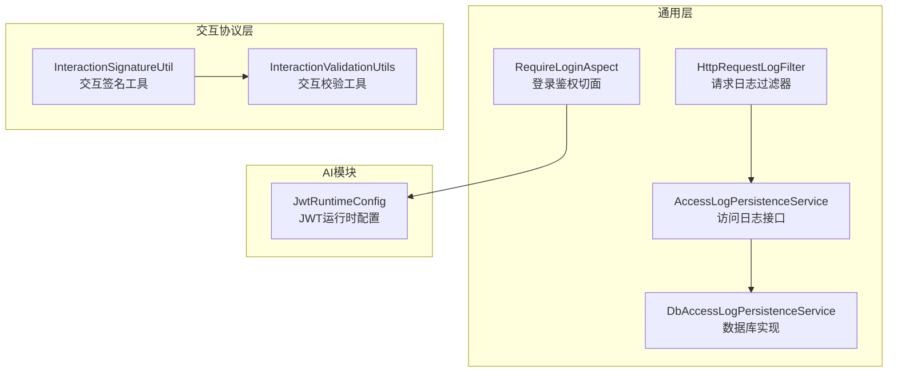
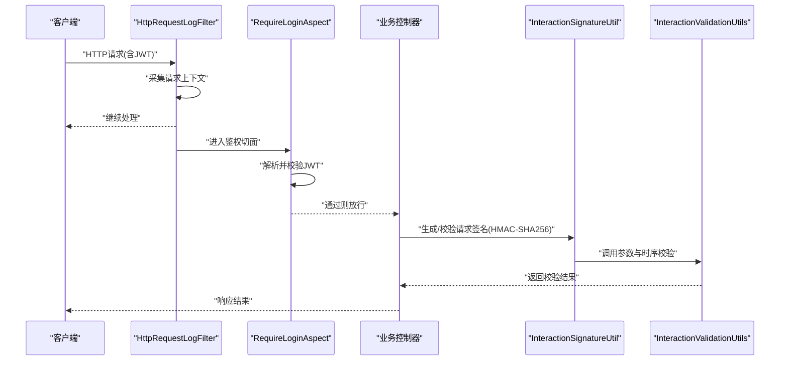
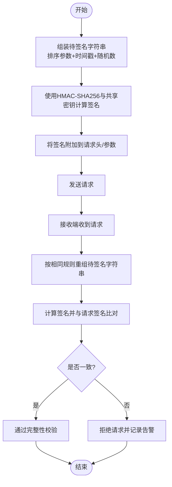
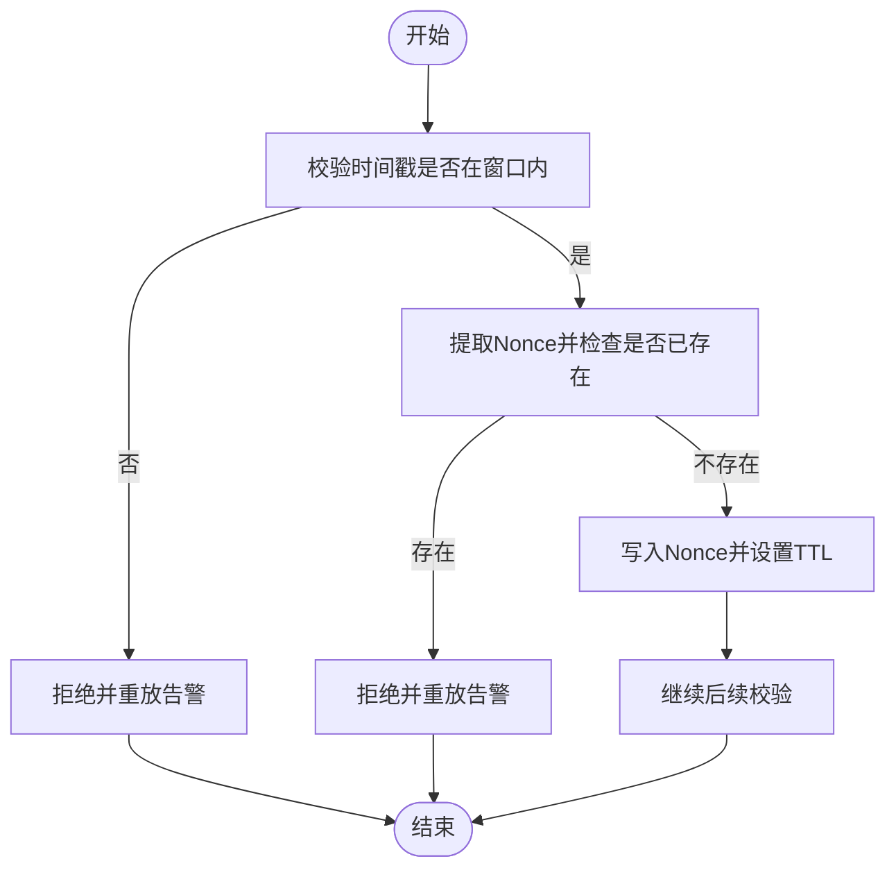
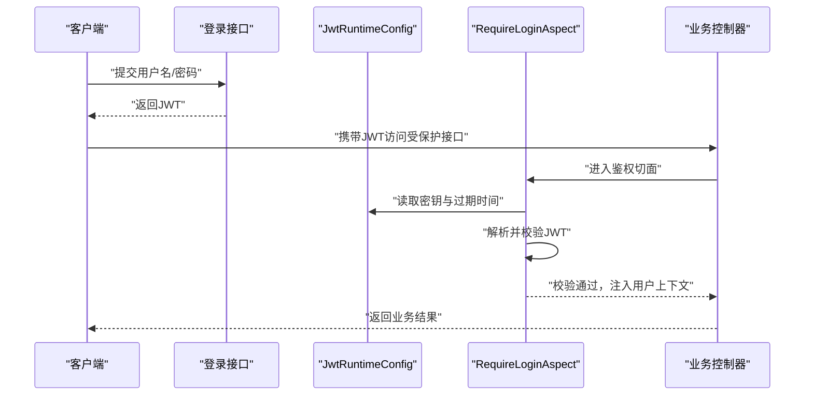
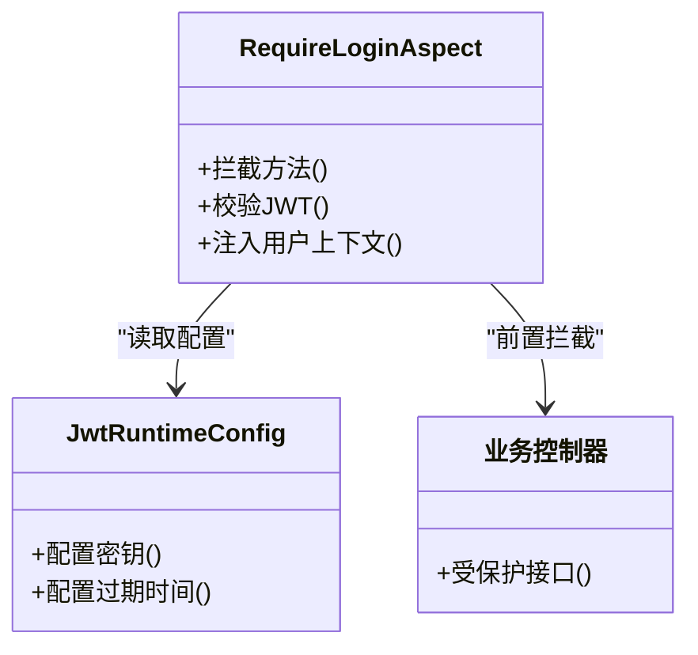
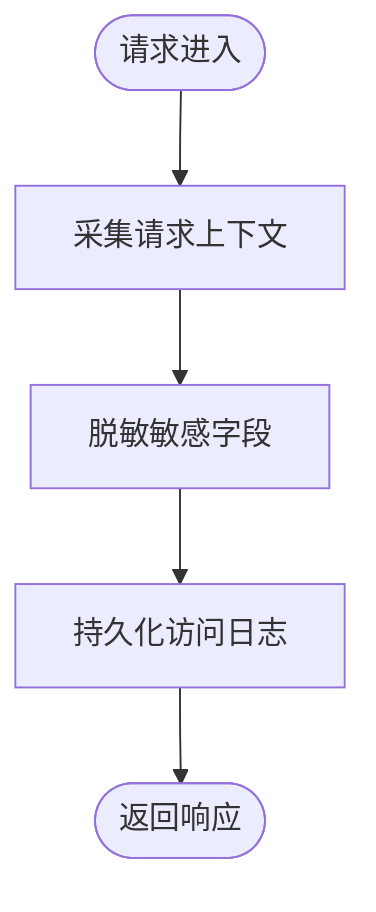
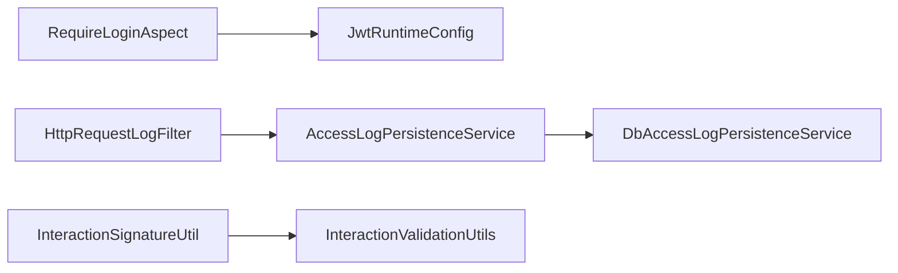

# 安全机制

<cite>
**本文引用的文件**   
- [CLAUDE.md](file://CLAUDE.md)
- [CODE_CONVENTIONS.md](file://docs/rules/CODE_CONVENTIONS.md)
- [系统架构设计文档.md](file://docs/guides/系统架构设计文档.md)
- [JwtRuntimeConfig.java](file://ele-ai-tender-system/ele-ai-tender-ai/src/main/java/com/jy\eleaitender\ai\config\JwtRuntimeConfig.java)
- [RequireLoginAspect.java](file://ele-ai-tender-system/ele-ai-tender-common/src/main/java/com/jy\eleaitender\common\aspect\RequireLoginAspect.java)
- [InteractionSignatureUtil.java](file://ele-ai-tender-system/ele-ai-tender-common-interaction/src/main/java/com/jy\eleaitender\common\interaction\util\InteractionSignatureUtil.java)
- [InteractionValidationUtils.java](file://ele-ai-tender-system/ele-ai-tender-common-interaction/src/main/java/com/jy\eleaitender\common\interaction\util\InteractionValidationUtils.java)
- [HttpRequestLogFilter.java](file://ele-ai-tender-system/ele-ai-tender-common/src/main/java/com/jy\eleaitender\common\logging\HttpRequestLogFilter.java)
- [AccessLogPersistenceService.java](file://ele-ai-tender-system/ele-ai-tender-common/src/main/java/com/jy\eleaitender\common\logging\AccessLogPersistenceService.java)
- [DbAccessLogPersistenceService.java](file://ele-ai-tender-system/ele-ai-tender-common/src/main/java/com/jy\eleaitender\common\logging\DbAccessLogPersistenceService.java)
</cite>

## 目录
1. [简介](#简介)
2. [项目结构](#项目结构)
3. [核心组件](#核心组件)
4. [架构总览](#架构总览)
5. [详细组件分析](#详细组件分析)
6. [依赖关系分析](#依赖关系分析)
7. [性能与安全调优](#性能与安全调优)
8. [故障排查指南](#故障排查指南)
9. [结论](#结论)
10. [附录](#附录)

## 简介
本文件聚焦交互服务的安全机制，围绕请求签名验证、数字签名生成与校验、JWT令牌验证、身份认证与权限控制拦截器、敏感信息加密传输、数据完整性保护、防重放攻击等主题进行系统化说明。同时提供企业级安全特性（日志脱敏、审计追踪）的配置建议、安全测试方法与渗透测试建议，帮助读者在工程实践中落地可操作的安全方案。

## 项目结构
本项目采用多模块分层架构，安全相关能力主要分布在以下位置：
- 通用安全与工具：签名、JWT、登录鉴权注解与切面、访问日志过滤与持久化
- 交互协议层：对外交互的签名与校验工具、参数校验工具
- 运行时配置：JWT密钥与过期时间等运行时注入

图表来源
- [RequireLoginAspect.java](file://ele-ai-tender-system/ele-ai-tender-common/src/main/java/com/jy\eleaitender\common\aspect\RequireLoginAspect.java)
- [HttpRequestLogFilter.java](file://ele-ai-tender-system/ele-ai-tender-common/src/main/java/com/jy\eleaitender\common\logging\HttpRequestLogFilter.java)
- [AccessLogPersistenceService.java](file://ele-ai-tender-system/ele-ai-tender-common/src/main/java/com/jy\eleaitender\common\logging\AccessLogPersistenceService.java)
- [DbAccessLogPersistenceService.java](file://ele-ai-tender-system/ele-ai-tender-common/src/main/java/com/jy\eleaitender\common\logging\DbAccessLogPersistenceService.java)
- [InteractionSignatureUtil.java](file://ele-ai-tender-system/ele-ai-tender-common-interaction/src/main/java/com/jy\eleaitender\common\interaction\util\InteractionSignatureUtil.java)
- [InteractionValidationUtils.java](file://ele-ai-tender-system/ele-ai-tender-common-interaction/src/main/java/com/jy\eleaitender\common\interaction\util\InteractionValidationUtils.java)
- [JwtRuntimeConfig.java](file://ele-ai-tender-system/ele-ai-tender-ai/src/main/java/com/jy\eleaitender\ai\config\JwtRuntimeConfig.java)

章节来源
- [系统架构设计文档.md](file://docs/guides/系统架构设计文档.md)

## 核心组件
- 登录鉴权切面：通过注解驱动的方式对需要登录的接口进行统一拦截与校验，结合JWT完成身份识别与上下文构建。
- 交互签名工具：为外部交互场景提供基于HMAC-SHA256的请求签名生成与校验能力，保障请求完整性与来源可信。
- 交互校验工具：对交互请求的关键字段与时序参数进行一致性校验，辅助防重放与参数合法性检查。
- JWT运行时配置：在服务启动时集中配置JWT密钥、有效期等关键参数，确保跨模块一致使用。
- 访问日志过滤器与持久化：在请求进入阶段采集必要上下文并持久化，支撑审计与问题定位；配合脱敏策略避免敏感信息泄露。

章节来源
- [CODE_CONVENTIONS.md](file://docs/rules/CODE_CONVENTIONS.md)
- [CLAUDE.md](file://CLAUDE.md)
- [JwtRuntimeConfig.java](file://ele-ai-tender-system/ele-ai-tender-ai/src/main/java/com/jy\eleaitender\ai\config\JwtRuntimeConfig.java)
- [RequireLoginAspect.java](file://ele-ai-tender-system/ele-ai-tender-common/src/main/java/com/jy\eleaitender\common\aspect\RequireLoginAspect.java)
- [InteractionSignatureUtil.java](file://ele-ai-tender-system/ele-ai-tender-common-interaction/src/main/java/com/jy\eleaitender\common\interaction\util\InteractionSignatureUtil.java)
- [InteractionValidationUtils.java](file://ele-ai-tender-system/ele-ai-tender-common-interaction/src/main/java/com/jy\eleaitender\common\interaction\util\InteractionValidationUtils.java)
- [HttpRequestLogFilter.java](file://ele-ai-tender-system/ele-ai-tender-common/src/main/java/com/jy\eleaitender\common\logging\HttpRequestLogFilter.java)
- [AccessLogPersistenceService.java](file://ele-ai-tender-system/ele-ai-tender-common/src/main/java/com/jy\eleaitender\common\logging\AccessLogPersistenceService.java)
- [DbAccessLogPersistenceService.java](file://ele-ai-tender-system/ele-ai-tender-common/src/main/java/com/jy\eleaitender\common\logging\DbAccessLogPersistenceService.java)

## 架构总览
下图展示了从客户端到服务端的核心安全链路：前端携带JWT发起请求，网关或入口过滤器记录访问日志，鉴权切面校验JWT与权限，业务控制器处理请求；对于外部交互场景，额外引入签名与校验流程以保障完整性与防重放。

图表来源
- [HttpRequestLogFilter.java](file://ele-ai-tender-system/ele-ai-tender-common/src/main/java/com/jy\eleaitender\common\logging\HttpRequestLogFilter.java)
- [RequireLoginAspect.java](file://ele-ai-tender-system/ele-ai-tender-common/src/main/java/com/jy\eleaitender\common\aspect\RequireLoginAspect.java)
- [InteractionSignatureUtil.java](file://ele-ai-tender-system/ele-ai-tender-common-interaction/src/main/java/com/jy\eleaitender\common\interaction\util\InteractionSignatureUtil.java)
- [InteractionValidationUtils.java](file://ele-ai-tender-system/ele-ai-tender-common-interaction/src/main/java/com/jy\eleaitender\common\interaction\util\InteractionValidationUtils.java)

## 详细组件分析

### 请求签名与数字签名（HMAC-SHA256）
- 目标：保证请求体与关键字段的完整性，防止篡改；确认调用方身份。
- 算法选择：HMAC-SHA256，具备高效性与广泛支持性。
- 输入要素：待签名字符串（通常包含时间戳、随机数、业务参数等）、共享密钥。
- 输出：十六进制或Base64编码的签名值，随请求头或参数传递。
- 校验流程：接收端按相同规则重组待签名字符串，计算签名并与请求中的签名比对。

图表来源
- [InteractionSignatureUtil.java](file://ele-ai-tender-system/ele-ai-tender-common-interaction/src/main/java/com/jy\eleaitender\common\interaction\util\InteractionSignatureUtil.java)
- [CODE_CONVENTIONS.md](file://docs/rules/CODE_CONVENTIONS.md)
- [CLAUDE.md](file://CLAUDE.md)

章节来源
- [CODE_CONVENTIONS.md](file://docs/rules/CODE_CONVENTIONS.md)
- [CLAUDE.md](file://CLAUDE.md)
- [InteractionSignatureUtil.java](file://ele-ai-tender-system/ele-ai-tender-common-interaction/src/main/java/com/jy\eleaitender\common\interaction\util\InteractionSignatureUtil.java)

### 防重放攻击策略
- 时间窗口：请求携带时间戳，服务端校验是否在允许的时间窗口内。
- 随机数（Nonce）：每次请求携带唯一随机数，服务端缓存已使用的Nonce并在窗口期内去重。
- 组合校验：时间戳+Nonce+签名三者共同作用，提升抗重放能力。
- 存储与清理：使用高性能键值存储（如Redis）维护Nonce集合，设置TTL自动清理。

图表来源
- [InteractionValidationUtils.java](file://ele-ai-tender-system/ele-ai-tender-common-interaction/src/main/java/com/jy\eleaitender\common\interaction\util\InteractionValidationUtils.java)

章节来源
- [InteractionValidationUtils.java](file://ele-ai-tender-system/ele-ai-tender-common-interaction/src/main/java/com/jy\eleaitender\common\interaction\util\InteractionValidationUtils.java)

### JWT令牌验证与身份认证
- 生命周期：登录成功后颁发JWT，客户端在后续请求中携带；服务端解析并校验签名与过期时间。
- 运行时配置：服务启动时集中配置密钥与过期时间，确保跨模块一致。
- 切面拦截：通过注解驱动的切面对需要登录的接口进行统一校验，失败则快速返回未授权。
- 上下文构建：校验通过后，将用户身份信息注入到请求上下文，供业务层使用。

图表来源
- [JwtRuntimeConfig.java](file://ele-ai-tender-system/ele-ai-tender-ai/src/main/java/com/jy\eleaitender\ai\config\JwtRuntimeConfig.java)
- [RequireLoginAspect.java](file://ele-ai-tender-system/ele-ai-tender-common/src/main/java/com/jy\eleaitender\common\aspect\RequireLoginAspect.java)

章节来源
- [CODE_CONVENTIONS.md](file://docs/rules/CODE_CONVENTIONS.md)
- [JwtRuntimeConfig.java](file://ele-ai-tender-system/ele-ai-tender-ai/src/main/java/com/jy\eleaitender\ai\config\JwtRuntimeConfig.java)
- [RequireLoginAspect.java](file://ele-ai-tender-system/ele-ai-tender-common/src/main/java/com/jy\eleaitender\common\aspect\RequireLoginAspect.java)

### 权限控制（注解与切面）
- 注解驱动：在需要权限控制的接口上添加相应注解，由切面统一拦截。
- 最小权限原则：仅授予必要的资源访问权限，结合数据范围控制减少越权风险。
- 统一异常处理：权限不足时返回标准化错误码，便于前端提示与审计记录。

图表来源
- [RequireLoginAspect.java](file://ele-ai-tender-system/ele-ai-tender-common/src/main/java/com/jy\eleaitender\common\aspect\RequireLoginAspect.java)
- [JwtRuntimeConfig.java](file://ele-ai-tender-system/ele-ai-tender-ai/src/main/java/com/jy\eleaitender\ai\config\JwtRuntimeConfig.java)

章节来源
- [CODE_CONVENTIONS.md](file://docs/rules/CODE_CONVENTIONS.md)

### 敏感信息加密传输与数据完整性保护
- 传输加密：建议使用HTTPS端到端加密，避免中间人窃听与篡改。
- 请求签名：对关键参数与时间戳进行HMAC-SHA256签名，确保完整性与来源可信。
- 字符集规范：显式指定UTF-8，避免编码不一致导致的签名校验失败。
- 敏感字段：对密码等敏感信息进行哈希存储（如BCrypt），不在日志中明文输出。

章节来源
- [CLAUDE.md](file://CLAUDE.md)
- [CODE_CONVENTIONS.md](file://docs/rules/CODE_CONVENTIONS.md)

### 日志脱敏与审计追踪
- 请求日志：在过滤器中采集请求上下文，包括URI、参数摘要、耗时、状态码等。
- 持久化：通过抽象接口与具体实现分离，支持多种后端（如数据库）。
- 脱敏策略：对手机号、身份证、银行卡号等敏感字段进行掩码处理，避免泄露。
- 审计追踪：结合用户ID、会话ID与操作类型，形成可追溯的审计链。

图表来源
- [HttpRequestLogFilter.java](file://ele-ai-tender-system/ele-ai-tender-common/src/main/java/com/jy\eleaitender\common\logging\HttpRequestLogFilter.java)
- [AccessLogPersistenceService.java](file://ele-ai-tender-system/ele-ai-tender-common/src/main/java/com/jy\eleaitender\common\logging\AccessLogPersistenceService.java)
- [DbAccessLogPersistenceService.java](file://ele-ai-tender-system/ele-ai-tender-common/src/main/java/com/jy\eleaitender\common\logging\DbAccessLogPersistenceService.java)

章节来源
- [HttpRequestLogFilter.java](file://ele-ai-tender-system/ele-ai-tender-common/src/main/java/com/jy\eleaitender\common\logging\HttpRequestLogFilter.java)
- [AccessLogPersistenceService.java](file://ele-ai-tender-system/ele-ai-tender-common/src/main/java/com/jy\eleaitender\common\logging\AccessLogPersistenceService.java)
- [DbAccessLogPersistenceService.java](file://ele-ai-tender-system/ele-ai-tender-common/src/main/java/com/jy\eleaitender\common\logging\DbAccessLogPersistenceService.java)

## 依赖关系分析
- 低耦合高内聚：鉴权切面与JWT配置解耦，便于替换实现与调整策略。
- 外部依赖：交互签名与校验工具独立于业务逻辑，可在不同服务间复用。
- 日志抽象：访问日志持久化通过接口抽象，支持扩展新的存储后端。

图表来源
- [RequireLoginAspect.java](file://ele-ai-tender-system/ele-ai-tender-common/src/main/java/com/jy\eleaitender\common\aspect\RequireLoginAspect.java)
- [JwtRuntimeConfig.java](file://ele-ai-tender-system/ele-ai-tender-ai/src/main/java/com/jy\eleaitender\ai\config\JwtRuntimeConfig.java)
- [HttpRequestLogFilter.java](file://ele-ai-tender-system/ele-ai-tender-common/src/main/java/com/jy\eleaitender\common\logging\HttpRequestLogFilter.java)
- [AccessLogPersistenceService.java](file://ele-ai-tender-system/ele-ai-tender-common/src/main/java/com/jy\eleaitender\common\logging\AccessLogPersistenceService.java)
- [DbAccessLogPersistenceService.java](file://ele-ai-tender-system/ele-ai-tender-common/src/main/java/com/jy\eleaitender\common\logging\DbAccessLogPersistenceService.java)
- [InteractionSignatureUtil.java](file://ele-ai-tender-system/ele-ai-tender-common-interaction/src/main/java/com/jy\eleaitender\common\interaction\util\InteractionSignatureUtil.java)
- [InteractionValidationUtils.java](file://ele-ai-tender-system/ele-ai-tender-common-interaction/src/main/java/com/jy\eleaitender\common\interaction\util\InteractionValidationUtils.java)

章节来源
- [系统架构设计文档.md](file://docs/guides/系统架构设计文档.md)

## 性能与安全调优
- 签名算法：优先选择HMAC-SHA256，兼顾性能与安全性；避免使用弱哈希。
- 时间窗口与TTL：合理设置时间窗口与Nonce TTL，平衡安全性与可用性。
- 并发与锁：在高并发场景下，使用分布式锁或原子操作保证Nonce去重的正确性。
- 日志采样：对高频接口启用日志采样，降低I/O压力，保留关键路径全量日志。
- 密钥轮换：定期轮换共享密钥与JWT密钥，缩短泄露影响面。

[本节为通用指导，不直接分析具体文件]

## 故障排查指南
- 签名不一致：检查待签名字符串组装顺序、字符集是否为UTF-8、共享密钥是否一致。
- 重放告警：确认时间戳是否超出窗口、Nonce是否重复、TTL是否过短导致误判。
- JWT校验失败：核对密钥配置、过期时间、客户端携带的Token格式是否正确。
- 日志缺失：检查过滤器是否生效、持久化实现是否正常、权限是否允许写入。

章节来源
- [CODE_CONVENTIONS.md](file://docs/rules/CODE_CONVENTIONS.md)
- [CLAUDE.md](file://CLAUDE.md)
- [HttpRequestLogFilter.java](file://ele-ai-tender-system/ele-ai-tender-common/src/main/java/com/jy\eleaitender\common\logging\HttpRequestLogFilter.java)

## 结论
本项目在交互服务中构建了较为完整的安全体系：以JWT为核心的身份认证与权限控制、以HMAC-SHA256为基础的请求签名与完整性保护、以时间戳与Nonce为主的防重放策略，以及覆盖日志脱敏与审计追踪的企业级能力。通过合理的配置与调优，可在保障安全的同时维持良好的性能与可用性。

[本节为总结性内容，不直接分析具体文件]

## 附录
- 安全配置清单
  - 密钥管理：集中配置JWT与共享密钥，禁止硬编码，使用环境变量或密钥管理服务。
  - 签名算法：统一使用HMAC-SHA256，明确字符集UTF-8。
  - 安全参数：时间窗口、Nonce TTL、JWT过期时间根据业务场景调优。
- 安全测试方法
  - 单元测试：覆盖签名生成与校验、JWT解析与过期、防重放逻辑。
  - 集成测试：模拟外部调用，验证端到端签名与校验流程。
  - 回归测试：变更密钥或参数后，确保既有客户端兼容。
- 渗透测试建议
  - 重放攻击：构造重复请求与时间戳偏移，验证防护有效性。
  - 签名绕过：尝试篡改参数与头部，验证完整性校验。
  - 越权访问：使用不同角色与数据范围，验证权限控制。
  - 日志脱敏：检查敏感字段是否被掩码，避免泄露。

[本节为通用指导，不直接分析具体文件]