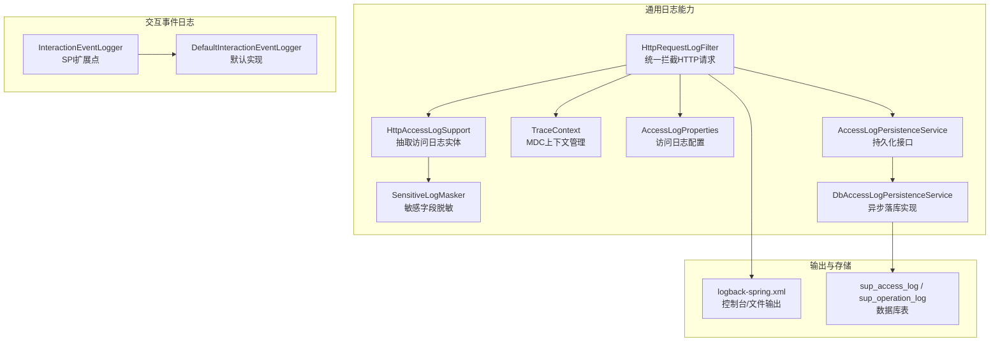
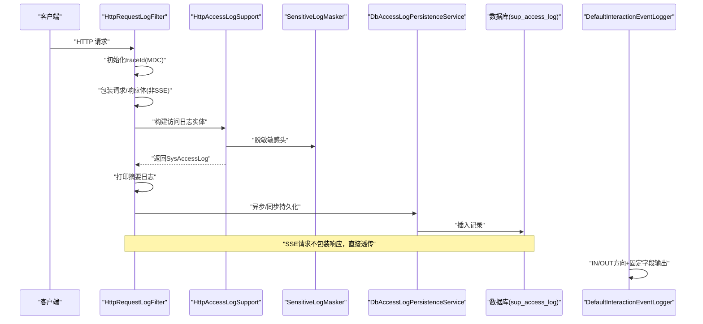
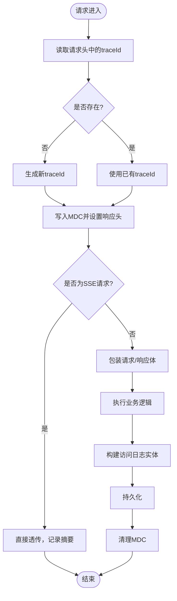
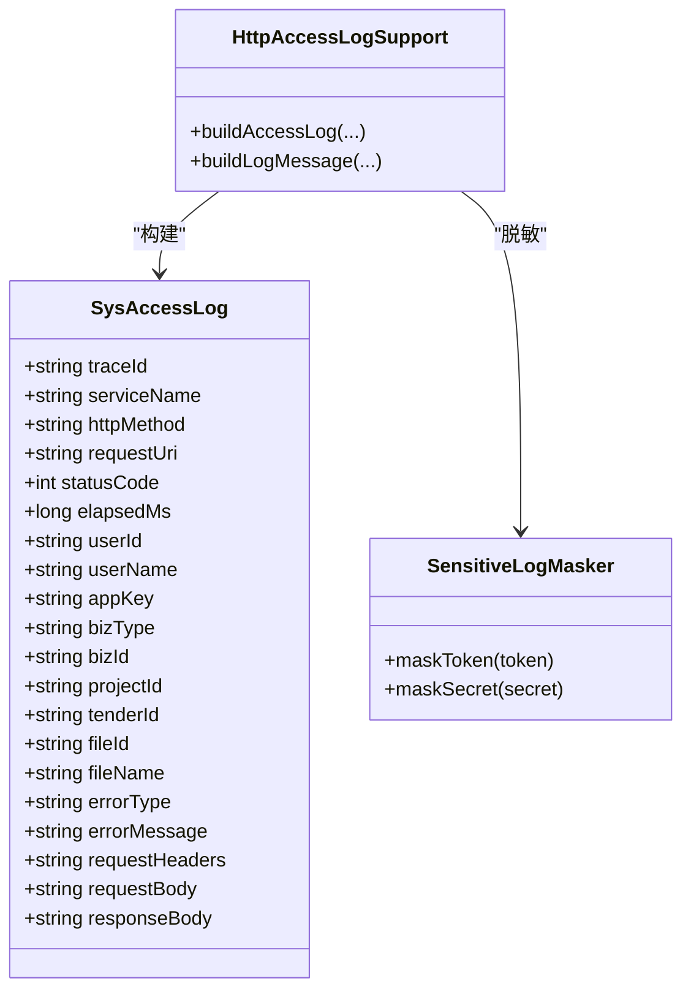
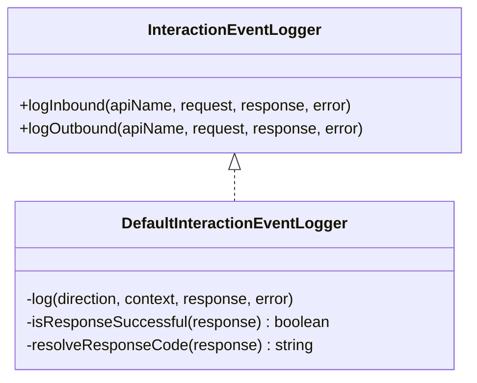
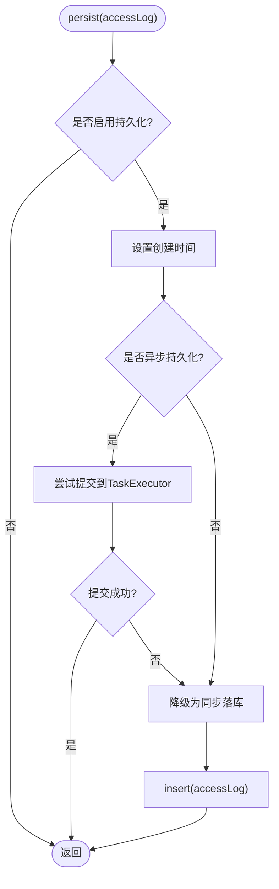
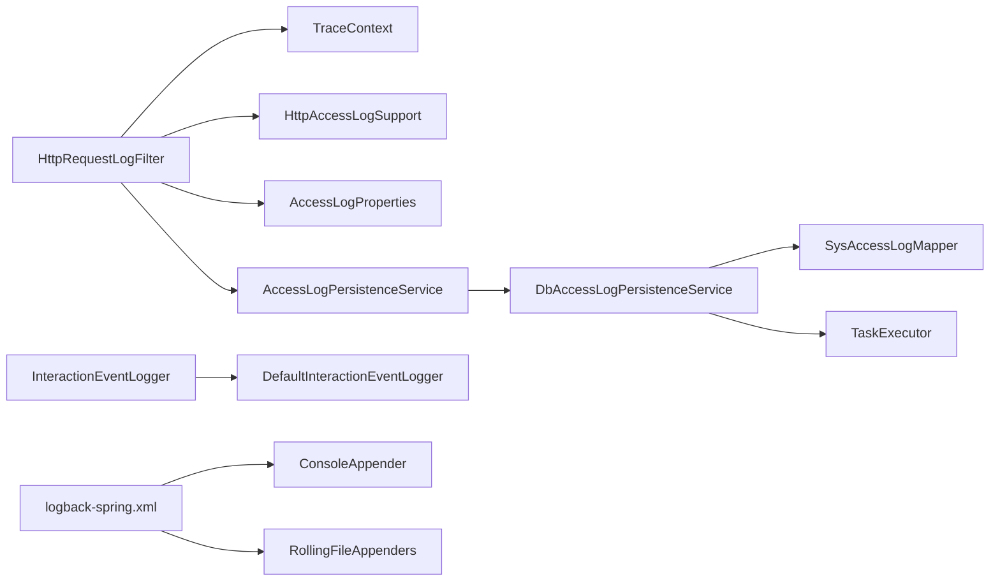

# 日志监控

<cite>
**本文引用的文件**   
- [TraceContext.java](file://ele-ai-tender-system/ele-ai-tender-common/src/main/java/com/jy/eleaitender/common/logging/TraceContext.java)
- [HttpRequestLogFilter.java](file://ele-ai-tender-system/ele-ai-tender-common/src/main/java/com/jy/eleaitender/common/logging/HttpRequestLogFilter.java)
- [HttpAccessLogSupport.java](file://ele-ai-tender-system/ele-ai-tender-common/src/main/java/com/jy/eleaitender/common/logging/HttpAccessLogSupport.java)
- [SensitiveLogMasker.java](file://ele-ai-tender-system/ele-ai-tender-common/src/main/java/com/jy/eleaitender/common/logging/SensitiveLogMasker.java)
- [AccessLogProperties.java](file://ele-ai-tender-system/ele-ai-tender-common/src/main/java/com/jy/eleaitender/common/logging/AccessLogProperties.java)
- [AccessLogPersistenceService.java](file://ele-ai-tender-system/ele-ai-tender-common/src/main/java/com/jy/eleaitender/common/logging/AccessLogPersistenceService.java)
- [DbAccessLogPersistenceService.java](file://ele-ai-tender-system/ele-ai-tender-common/src/main/java/com/jy/eleaitender/common/logging/DbAccessLogPersistenceService.java)
- [InteractionEventLogger.java](file://ele-ai-tender-system/ele-ai-tender-common-interaction/src/main/java/com/jy/eleaitender/common/interaction/spi/InteractionEventLogger.java)
- [DefaultInteractionEventLogger.java](file://ele-ai-tender-system/ele-ai-tender-interaction/ele-ai-tender-interaction-autoconfigure/src/main/java/com/jy/eleaitender/interaction/autoconfigure/logging/DefaultInteractionEventLogger.java)
- [logback-spring.xml（support）](file://ele-ai-tender-system/ele-ai-tender-support/src/main/resources/logback-spring.xml)
- [init.sql（支持库表）](file://ele-ai-tender-system/ele-ai-tender-support/sql/init.sql)
</cite>

## 目录
1. [简介](#简介)
2. [项目结构](#项目结构)
3. [核心组件](#核心组件)
4. [架构总览](#架构总览)
5. [详细组件分析](#详细组件分析)
6. [依赖关系分析](#依赖关系分析)
7. [性能与容量规划](#性能与容量规划)
8. [故障排查指南](#故障排查指南)
9. [结论](#结论)
10. [附录：配置与查询最佳实践](#附录配置与查询最佳实践)

## 简介
本技术文档聚焦“交互服务”的日志监控能力，覆盖分布式链路追踪、跨服务调用跟踪、请求/响应/错误结构化日志、敏感信息脱敏、性能指标采集、持久化策略与存储模型、以及日志分析与告警实践。目标是帮助读者快速理解并高效使用现有日志体系进行问题定位与性能优化。

## 项目结构
本项目在通用模块中提供统一的日志基础设施，并在交互子系统中提供面向业务交互事件的扩展点与默认实现；同时通过 Spring Boot Starter 的方式在各服务中启用过滤器与持久化能力。

图表来源
- [HttpRequestLogFilter.java:41-106](file://ele-ai-tender-system/ele-ai-tender-common/src/main/java/com/jy/eleaitender/common/logging/HttpRequestLogFilter.java#L41-L106)
- [HttpAccessLogSupport.java:37-92](file://ele-ai-tender-system/ele-ai-tender-common/src/main/java/com/jy/eleaitender/common/logging/HttpAccessLogSupport.java#L37-L92)
- [TraceContext.java:16-28](file://ele-ai-tender-system/ele-ai-tender-common/src/main/java/com/jy/eleaitender/common/logging/TraceContext.java#L16-L28)
- [SensitiveLogMasker.java:15-33](file://ele-ai-tender-system/ele-ai-tender-common/src/main/java/com/jy/eleaitender/common/logging/SensitiveLogMasker.java#L15-L33)
- [AccessLogProperties.java:10-22](file://ele-ai-tender-system/ele-ai-tender-common/src/main/java/com/jy/eleaitender/common/logging/AccessLogProperties.java#L10-L22)
- [AccessLogPersistenceService.java:8-11](file://ele-ai-tender-system/ele-ai-tender-common/src/main/java/com/jy/eleaitender/common/logging/AccessLogPersistenceService.java#L8-L11)
- [DbAccessLogPersistenceService.java:28-63](file://ele-ai-tender-system/ele-ai-tender-common/src/main/java/com/jy/eleaitender/common/logging/DbAccessLogPersistenceService.java#L28-L63)
- [InteractionEventLogger.java:6-11](file://ele-ai-tender-system/ele-ai-tender-common-interaction/src/main/java/com/jy/eleaitender/common/interaction/spi/InteractionEventLogger.java#L6-L11)
- [DefaultInteractionEventLogger.java:18-87](file://ele-ai-tender-system/ele-ai-tender-interaction/ele-ai-tender-interaction-autoconfigure/src/main/java/com/jy/eleaitender/interaction/autoconfigure/logging/DefaultInteractionEventLogger.java#L18-L87)
- [logback-spring.xml（support）:1-88](file://ele-ai-tender-system/ele-ai-tender-support/src/main/resources/logback-spring.xml#L1-L88)
- [init.sql（支持库表）:218-238](file://ele-ai-tender-system/ele-ai-tender-support/sql/init.sql#L218-L238)

章节来源
- [HttpRequestLogFilter.java:41-106](file://ele-ai-tender-system/ele-ai-tender-common/src/main/java/com/jy/eleaitender/common/logging/HttpRequestLogFilter.java#L41-L106)
- [HttpAccessLogSupport.java:37-92](file://ele-ai-tender-system/ele-ai-tender-common/src/main/java/com/jy/eleaitender/common/logging/HttpAccessLogSupport.java#L37-L92)
- [TraceContext.java:16-28](file://ele-ai-tender-system/ele-ai-tender-common/src/main/java/com/jy/eleaitender/common/logging/TraceContext.java#L16-L28)
- [SensitiveLogMasker.java:15-33](file://ele-ai-tender-system/ele-ai-tender-common/src/main/java/com/jy/eleaitender/common/logging/SensitiveLogMasker.java#L15-L33)
- [AccessLogProperties.java:10-22](file://ele-ai-tender-system/ele-ai-tender-common/src/main/java/com/jy/eleaitender/common/logging/AccessLogProperties.java#L10-L22)
- [AccessLogPersistenceService.java:8-11](file://ele-ai-tender-system/ele-ai-tender-common/src/main/java/com/jy/eleaitender/common/logging/AccessLogPersistenceService.java#L8-L11)
- [DbAccessLogPersistenceService.java:28-63](file://ele-ai-tender-system/ele-ai-tender-common/src/main/java/com/jy/eleaitender/common/logging/DbAccessLogPersistenceService.java#L28-L63)
- [InteractionEventLogger.java:6-11](file://ele-ai-tender-system/ele-ai-tender-common-interaction/src/main/java/com/jy/eleaitender/common/interaction/spi/InteractionEventLogger.java#L6-L11)
- [DefaultInteractionEventLogger.java:18-87](file://ele-ai-tender-system/ele-ai-tender-interaction/ele-ai-tender-interaction-autoconfigure/src/main/java/com/jy/eleaitender/interaction/autoconfigure/logging/DefaultInteractionEventLogger.java#L18-L87)
- [logback-spring.xml（support）:1-88](file://ele-ai-tender-system/ele-ai-tender-support/src/main/resources/logback-spring.xml#L1-L88)
- [init.sql（支持库表）:218-238](file://ele-ai-tender-system/ele-ai-tender-support/sql/init.sql#L218-L238)

## 核心组件
- 链路追踪上下文 TraceContext：基于 MDC 维护 traceId，支持从上游传递或自动生成，并在处理完成后清理。
- HTTP 访问日志过滤器 HttpRequestLogFilter：统一拦截请求，注入 traceId，包装请求/响应体以安全采集，记录耗时与状态，SSE 流式请求特殊处理避免丢失事件。
- 访问日志构建器 HttpAccessLogSupport：从请求/响应中提取关键字段，解析认证上下文与业务键，提取并限制正文长度，对二进制与 multipart 做占位处理，并对敏感头进行脱敏。
- 敏感信息脱敏 SensitiveLogMasker：对 Token 与签名等敏感信息进行前缀/后缀保留的掩码处理。
- 访问日志配置 AccessLogProperties：控制是否开启、是否持久化、是否异步持久化、正文与错误消息最大长度等。
- 访问日志持久化 AccessLogPersistenceService 与 DbAccessLogPersistenceService：定义持久化接口，默认实现支持异步落库并在线程池不可用时降级为同步写入。
- 交互事件日志 SPI InteractionEventLogger 与默认实现 DefaultInteractionEventLogger：面向入站/出站交互事件，按固定字段输出结构化日志，便于检索与统计。
- 日志输出 logback-spring.xml：控制台与分级文件输出，按大小与时间滚动，便于归档与分析。
- 存储模型 init.sql：包含操作日志与系统访问日志表结构，供持久化落地。

章节来源
- [TraceContext.java:16-28](file://ele-ai-tender-system/ele-ai-tender-common/src/main/java/com/jy/eleaitender/common/logging/TraceContext.java#L16-L28)
- [HttpRequestLogFilter.java:41-106](file://ele-ai-tender-system/ele-ai-tender-common/src/main/java/com/jy/eleaitender/common/logging/HttpRequestLogFilter.java#L41-L106)
- [HttpAccessLogSupport.java:37-92](file://ele-ai-tender-system/ele-ai-tender-common/src/main/java/com/jy/eleaitender/common/logging/HttpAccessLogSupport.java#L37-L92)
- [SensitiveLogMasker.java:15-33](file://ele-ai-tender-system/ele-ai-tender-common/src/main/java/com/jy/eleaitender/common/logging/SensitiveLogMasker.java#L15-L33)
- [AccessLogProperties.java:10-22](file://ele-ai-tender-system/ele-ai-tender-common/src/main/java/com/jy/eleaitender/common/logging/AccessLogProperties.java#L10-L22)
- [AccessLogPersistenceService.java:8-11](file://ele-ai-tender-system/ele-ai-tender-common/src/main/java/com/jy/eleaitender/common/logging/AccessLogPersistenceService.java#L8-L11)
- [DbAccessLogPersistenceService.java:28-63](file://ele-ai-tender-system/ele-ai-tender-common/src/main/java/com/jy/eleaitender/common/logging/DbAccessLogPersistenceService.java#L28-L63)
- [InteractionEventLogger.java:6-11](file://ele-ai-tender-system/ele-ai-tender-common-interaction/src/main/java/com/jy/eleaitender/common/interaction/spi/InteractionEventLogger.java#L6-L11)
- [DefaultInteractionEventLogger.java:18-87](file://ele-ai-tender-system/ele-ai-tender-interaction/ele-ai-tender-interaction-autoconfigure/src/main/java/com/jy/eleaitender/interaction/autoconfigure/logging/DefaultInteractionEventLogger.java#L18-L87)
- [logback-spring.xml（support）:1-88](file://ele-ai-tender-system/ele-ai-tender-support/src/main/resources/logback-spring.xml#L1-L88)
- [init.sql（支持库表）:218-238](file://ele-ai-tender-system/ele-ai-tender-support/sql/init.sql#L218-L238)

## 架构总览
下图展示了从请求进入、链路追踪、日志采集、脱敏、到持久化的完整流程，以及交互事件日志的独立通道。

图表来源
- [HttpRequestLogFilter.java:41-106](file://ele-ai-tender-system/ele-ai-tender-common/src/main/java/com/jy/eleaitender/common/logging/HttpRequestLogFilter.java#L41-L106)
- [HttpAccessLogSupport.java:37-92](file://ele-ai-tender-system/ele-ai-tender-common/src/main/java/com/jy/eleaitender/common/logging/HttpAccessLogSupport.java#L37-L92)
- [SensitiveLogMasker.java:15-33](file://ele-ai-tender-system/ele-ai-tender-common/src/main/java/com/jy/eleaitender/common/logging/SensitiveLogMasker.java#L15-L33)
- [DbAccessLogPersistenceService.java:28-63](file://ele-ai-tender-system/ele-ai-tender-common/src/main/java/com/jy/eleaitender/common/logging/DbAccessLogPersistenceService.java#L28-L63)
- [DefaultInteractionEventLogger.java:18-87](file://ele-ai-tender-system/ele-ai-tender-interaction/ele-ai-tender-interaction-autoconfigure/src/main/java/com/jy/eleaitender/interaction/autoconfigure/logging/DefaultInteractionEventLogger.java#L18-L87)

## 详细组件分析

### 分布式链路追踪与上下文传播
- 入口注入：过滤器从请求头读取 traceId，若缺失则生成新 ID，写入 MDC 并回写到响应头，确保下游可感知。
- 上下文清理：请求结束后清理 MDC，避免线程复用导致污染。
- SSE 特殊处理：对于流式请求不包装响应体，仅记录方法与耗时，避免异步事件丢失。

图表来源
- [HttpRequestLogFilter.java:41-106](file://ele-ai-tender-system/ele-ai-tender-common/src/main/java/com/jy/eleaitender/common/logging/HttpRequestLogFilter.java#L41-L106)
- [TraceContext.java:16-28](file://ele-ai-tender-system/ele-ai-tender-common/src/main/java/com/jy/eleaitender/common/logging/TraceContext.java#L16-L28)

章节来源
- [HttpRequestLogFilter.java:41-106](file://ele-ai-tender-system/ele-ai-tender-common/src/main/java/com/jy/eleaitender/common/logging/HttpRequestLogFilter.java#L41-L106)
- [TraceContext.java:16-28](file://ele-ai-tender-system/ele-ai-tender-common/src/main/java/com/jy/eleaitender/common/logging/TraceContext.java#L16-L28)

### 请求/响应/错误结构化日志
- 请求摘要：方法、URI、状态码、耗时、用户与企业信息、应用标识、业务键、文件键等。
- 正文采集：仅文本类型采集并限制长度；multipart 与二进制采用占位符，防止日志膨胀与泄露。
- 错误信息：捕获异常类型与消息，并进行长度限制。
- 认证上下文：解析 JWT，区分外部与内部 token，填充用户与企业维度字段。
- 业务上下文：优先从 query 参数提取，再兜底 JSON body；路径尾段数字作为 fileId 补充。

图表来源
- [HttpAccessLogSupport.java:37-92](file://ele-ai-tender-system/ele-ai-tender-common/src/main/java/com/jy/eleaitender/common/logging/HttpAccessLogSupport.java#L37-L92)
- [SensitiveLogMasker.java:15-33](file://ele-ai-tender-system/ele-ai-tender-common/src/main/java/com/jy/eleaitender/common/logging/SensitiveLogMasker.java#L15-L33)

章节来源
- [HttpAccessLogSupport.java:37-92](file://ele-ai-tender-system/ele-ai-tender-common/src/main/java/com/jy/eleaitender/common/logging/HttpAccessLogSupport.java#L37-L92)
- [SensitiveLogMasker.java:15-33](file://ele-ai-tender-system/ele-ai-tender-common/src/main/java/com/jy/eleaitender/common/logging/SensitiveLogMasker.java#L15-L33)

### 交互事件日志（入站/出站）
- 扩展点：InteractionEventLogger 定义入站与出站日志方法。
- 默认实现：DefaultInteractionEventLogger 按固定字段输出，包含方向、traceId、API名、成功标志、响应码、业务键、文件键、用户与企业信息、应用标识、请求/响应类型、错误类型与消息。
- 适用场景：电子标系统与外部业务系统的对接日志，便于按方向与业务键检索。

图表来源
- [InteractionEventLogger.java:6-11](file://ele-ai-tender-system/ele-ai-tender-common-interaction/src/main/java/com/jy/eleaitender/common/interaction/spi/InteractionEventLogger.java#L6-L11)
- [DefaultInteractionEventLogger.java:18-87](file://ele-ai-tender-system/ele-ai-tender-interaction/ele-ai-tender-interaction-autoconfigure/src/main/java/com/jy/eleaitender/interaction/autoconfigure/logging/DefaultInteractionEventLogger.java#L18-L87)

章节来源
- [InteractionEventLogger.java:6-11](file://ele-ai-tender-system/ele-ai-tender-common-interaction/src/main/java/com/jy/eleaitender/common/interaction/spi/InteractionEventLogger.java#L6-L11)
- [DefaultInteractionEventLogger.java:18-87](file://ele-ai-tender-system/ele-ai-tender-interaction/ele-ai-tender-interaction-autoconfigure/src/main/java/com/jy/eleaitender/interaction/autoconfigure/logging/DefaultInteractionEventLogger.java#L18-L87)

### 日志脱敏与敏感信息过滤
- 脱敏范围：Authorization 头（Token）、X-Signature 头（签名）。
- 脱敏策略：保留前后若干字符，中间用占位符替换；过短值整体替换为占位符。
- 集成位置：访问日志摘要与请求头集合构建时均调用脱敏工具。

章节来源
- [SensitiveLogMasker.java:15-33](file://ele-ai-tender-system/ele-ai-tender-common/src/main/java/com/jy/eleaitender/common/logging/SensitiveLogMasker.java#L15-L33)
- [HttpAccessLogSupport.java:119-127](file://ele-ai-tender-system/ele-ai-tender-common/src/main/java/com/jy/eleaitender/common/logging/HttpAccessLogSupport.java#L119-L127)

### 性能指标收集
- 关键指标：elapsedMs（请求耗时）、statusCode（状态码）、successFlag（成功标志）。
- 采集时机：过滤器 finally 块中计算耗时并写入访问日志实体。
- 输出方式：控制台摘要日志与持久化记录双通道。

章节来源
- [HttpRequestLogFilter.java:86-105](file://ele-ai-tender-system/ele-ai-tender-common/src/main/java/com/jy/eleaitender/common/logging/HttpRequestLogFilter.java#L86-L105)
- [HttpAccessLogSupport.java:74-92](file://ele-ai-tender-system/ele-ai-tender-common/src/main/java/com/jy/eleaitender/common/logging/HttpAccessLogSupport.java#L74-L92)

### 持久化与存储策略
- 持久化接口：AccessLogPersistenceService 定义 persist 方法。
- 默认实现：DbAccessLogPersistenceService 优先异步落库，线程池不可用时自动降级为同步写入，保证不丢日志。
- 存储模型：sup_access_log（系统访问日志）与 sup_operation_log（操作日志）表结构已定义，包含用户、方法、参数、IP、执行时长、创建时间等字段。

图表来源
- [DbAccessLogPersistenceService.java:28-63](file://ele-ai-tender-system/ele-ai-tender-common/src/main/java/com/jy/eleaitender/common/logging/DbAccessLogPersistenceService.java#L28-L63)
- [AccessLogPersistenceService.java:8-11](file://ele-ai-tender-system/ele-ai-tender-common/src/main/java/com/jy/eleaitender/common/logging/AccessLogPersistenceService.java#L8-L11)
- [init.sql（支持库表）:218-238](file://ele-ai-tender-system/ele-ai-tender-support/sql/init.sql#L218-L238)

章节来源
- [DbAccessLogPersistenceService.java:28-63](file://ele-ai-tender-system/ele-ai-tender-common/src/main/java/com/jy/eleaitender/common/logging/DbAccessLogPersistenceService.java#L28-L63)
- [AccessLogPersistenceService.java:8-11](file://ele-ai-tender-system/ele-ai-tender-common/src/main/java/com/jy/eleaitender/common/logging/AccessLogPersistenceService.java#L8-L11)
- [init.sql（支持库表）:218-238](file://ele-ai-tender-system/ele-ai-tender-support/sql/init.sql#L218-L238)

## 依赖关系分析
- 过滤器依赖：TraceContext（MDC）、HttpAccessLogSupport（日志构建）、AccessLogProperties（配置）、AccessLogPersistenceService（持久化）。
- 持久化实现依赖：TaskExecutor（异步任务）、SysAccessLogMapper（数据访问）。
- 交互事件日志：InteractionEventLogger 被业务侧调用，默认实现负责格式化输出。
- 日志输出：logback-spring.xml 控制控制台与分级文件输出，按时间与大小滚动。

图表来源
- [HttpRequestLogFilter.java:41-106](file://ele-ai-tender-system/ele-ai-tender-common/src/main/java/com/jy/eleaitender/common/logging/HttpRequestLogFilter.java#L41-L106)
- [DbAccessLogPersistenceService.java:28-63](file://ele-ai-tender-system/ele-ai-tender-common/src/main/java/com/jy/eleaitender/common/logging/DbAccessLogPersistenceService.java#L28-L63)
- [logback-spring.xml（support）:1-88](file://ele-ai-tender-system/ele-ai-tender-support/src/main/resources/logback-spring.xml#L1-L88)

章节来源
- [HttpRequestLogFilter.java:41-106](file://ele-ai-tender-system/ele-ai-tender-common/src/main/java/com/jy/eleaitender/common/logging/HttpRequestLogFilter.java#L41-L106)
- [DbAccessLogPersistenceService.java:28-63](file://ele-ai-tender-system/ele-ai-tender-common/src/main/java/com/jy/eleaitender/common/logging/DbAccessLogPersistenceService.java#L28-L63)
- [logback-spring.xml（support）:1-88](file://ele-ai-tender-system/ele-ai-tender-support/src/main/resources/logback-spring.xml#L1-L88)

## 性能与容量规划
- 正文采集限制：通过 AccessLogProperties.bodyMaxLength 控制请求/响应正文最大长度，避免大体积日志影响 IO 与存储。
- 异步持久化：默认开启异步落库，降低主链路延迟；线程池不可用时自动降级同步，保障可靠性。
- 日志滚动：按天与大小滚动，单文件上限与历史保留天数可按环境调整，平衡检索效率与磁盘占用。
- SSE 流式请求：不包装响应体，减少内存与拷贝开销，仅记录摘要日志。

章节来源
- [AccessLogProperties.java:10-22](file://ele-ai-tender-system/ele-ai-tender-common/src/main/java/com/jy/eleaitender/common/logging/AccessLogProperties.java#L10-L22)
- [DbAccessLogPersistenceService.java:28-63](file://ele-ai-tender-system/ele-ai-tender-common/src/main/java/com/jy/eleaitender/common/logging/DbAccessLogPersistenceService.java#L28-L63)
- [logback-spring.xml（support）:20-66](file://ele-ai-tender-system/ele-ai-tender-support/src/main/resources/logback-spring.xml#L20-L66)
- [HttpRequestLogFilter.java:54-72](file://ele-ai-tender-system/ele-ai-tender-common/src/main/java/com/jy/eleaitender/common/logging/HttpRequestLogFilter.java#L54-L72)

## 故障排查指南
- 无法获取 traceId：检查上游是否传递 traceId 头；确认过滤器是否正确写入响应头；查看 MDC 是否在 finally 中清理。
- 日志未持久化：确认 AccessLogProperties.persistEnabled 与 asyncPersist 配置；观察异步提交失败降级日志；检查 TaskExecutor 可用性与数据库连接。
- 正文为空或被省略：multipart 与二进制内容会被占位；JSON 解析失败会降级为空 map；检查 Content-Type 与编码设置。
- 敏感信息泄露：确认 Authorization 与 X-Signature 是否经脱敏；核对 buildRequestHeaders 与摘要日志输出。
- SSE 日志不完整：SSE 请求不包装响应体，仅记录摘要；如需更详细信息，可在业务层追加自定义日志。

章节来源
- [HttpRequestLogFilter.java:41-106](file://ele-ai-tender-system/ele-ai-tender-common/src/main/java/com/jy/eleaitender/common/logging/HttpRequestLogFilter.java#L41-L106)
- [HttpAccessLogSupport.java:215-241](file://ele-ai-tender-system/ele-ai-tender-common/src/main/java/com/jy/eleaitender/common/logging/HttpAccessLogSupport.java#L215-L241)
- [SensitiveLogMasker.java:15-33](file://ele-ai-tender-system/ele-ai-tender-common/src/main/java/com/jy/eleaitender/common/logging/SensitiveLogMasker.java#L15-L33)
- [DbAccessLogPersistenceService.java:42-63](file://ele-ai-tender-system/ele-ai-tender-common/src/main/java/com/jy/eleaitender/common/logging/DbAccessLogPersistenceService.java#L42-L63)

## 结论
该日志监控体系通过统一的过滤器与支撑类实现了端到端的链路追踪、结构化日志采集、敏感信息脱敏与高性能持久化。交互事件日志提供了面向业务对接的可观测性。结合合理的配置与存储策略，可有效支撑问题诊断与性能优化。

## 附录：配置与查询最佳实践
- 日志级别配置
  - 根级别建议 info，按需对特定包提升 debug 级别用于排障。
  - 控制台与分级文件输出分离，便于实时观察与离线分析。
- 输出格式定制
  - 保持固定字段顺序，便于日志平台解析与检索。
  - 对正文与错误消息设置合理上限，避免日志爆炸。
- 存储策略选择
  - 生产环境推荐异步持久化，配合合适的线程池规模。
  - 日志滚动策略按天与大小组合，保留周期根据合规要求设定。
- 监控告警配置
  - 基于 successFlag=0 或状态码≥400 的错误率阈值告警。
  - 基于 elapsedMs 的慢请求阈值告警（如 P95/P99）。
  - 基于错误类型聚合的异常热点告警。
- 性能瓶颈定位
  - 通过 traceId 串联多服务日志，定位慢步骤。
  - 关注正文采集与 JSON 解析开销，必要时关闭非必要正文采集。
- 问题诊断方法
  - 使用 traceId 检索全链路日志。
  - 结合 userId、bizType、bizId、projectId、tenderId、fileId 等多维字段缩小范围。
  - 对比入站与出站交互事件日志，定位跨服务问题。
- 日志查询与分析
  - 优先按 traceId 与时间窗口检索。
  - 使用业务键与文件键进行聚合分析。
  - 对错误日志进行趋势分析与根因归类。

章节来源
- [logback-spring.xml（support）:1-88](file://ele-ai-tender-system/ele-ai-tender-support/src/main/resources/logback-spring.xml#L1-L88)
- [AccessLogProperties.java:10-22](file://ele-ai-tender-system/ele-ai-tender-common/src/main/java/com/jy/eleaitender/common/logging/AccessLogProperties.java#L10-L22)
- [DefaultInteractionEventLogger.java:18-87](file://ele-ai-tender-system/ele-ai-tender-interaction/ele-ai-tender-interaction-autoconfigure/src/main/java/com/jy/eleaitender/interaction/autoconfigure/logging/DefaultInteractionEventLogger.java#L18-L87)
- [init.sql（支持库表）:218-238](file://ele-ai-tender-system/ele-ai-tender-support/sql/init.sql#L218-L238)