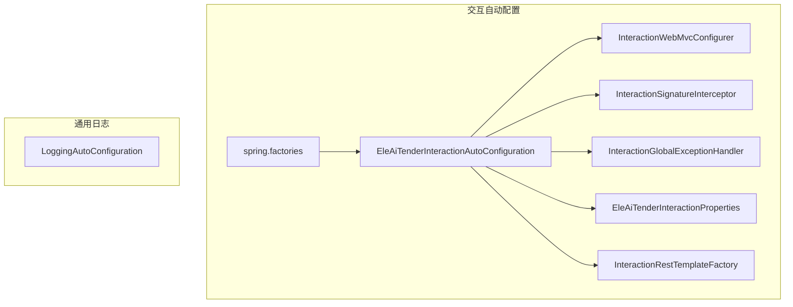
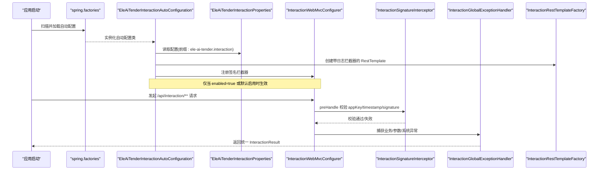
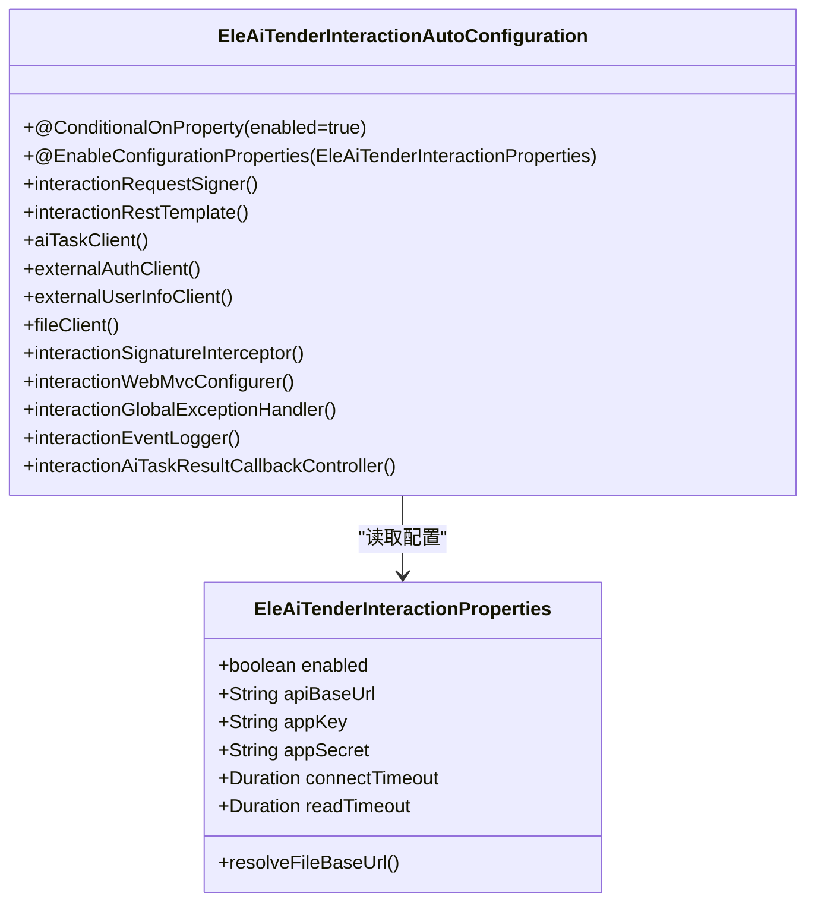
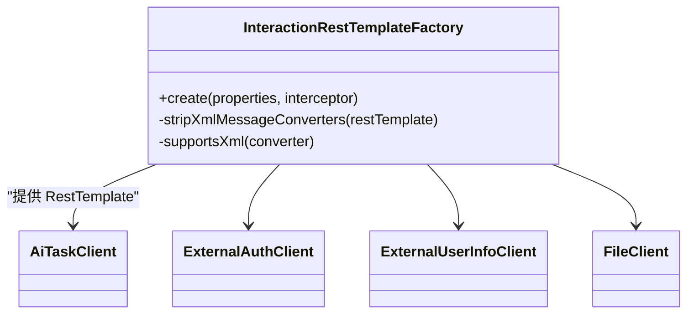
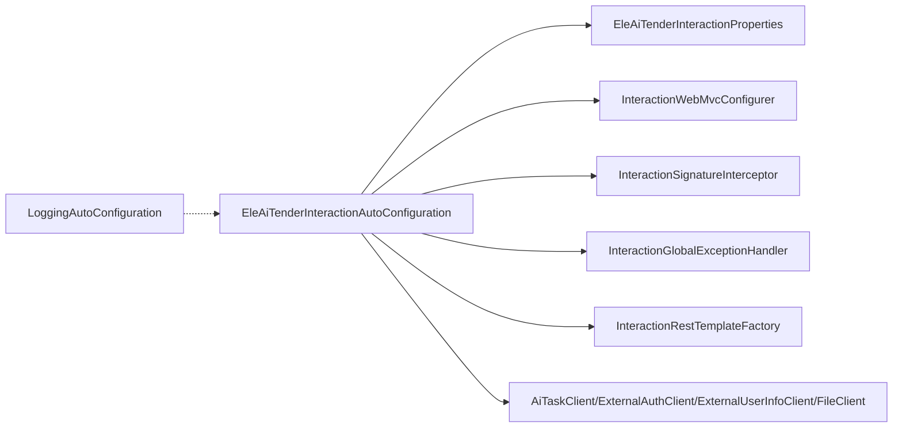

# 自动配置框架

<cite>
**本文引用的文件**   
- [spring.factories](file://ele-ai-tender-system/ele-ai-tender-interaction/ele-ai-tender-interaction-autoconfigure/src/main/resources/META-INF/spring.factories)
- [EleAiTenderInteractionAutoConfiguration.java](file://ele-ai-tender-system/ele-ai-tender-interaction/ele-ai-tender-interaction-autoconfigure/src/main/java/com/jy/eleaitender/interaction/autoconfigure/EleAiTenderInteractionAutoConfiguration.java)
- [InteractionWebMvcConfigurer.java](file://ele-ai-tender-system/ele-ai-tender-interaction/ele-ai-tender-interaction-autoconfigure/src/main/java/com/jy/eleaitender/interaction/autoconfigure/web/InteractionWebMvcConfigurer.java)
- [InteractionSignatureInterceptor.java](file://ele-ai-tender-system/ele-ai-tender-interaction/ele-ai-tender-interaction-autoconfigure/src/main/java/com/jy/eleaitender/interaction/autoconfigure/web/InteractionSignatureInterceptor.java)
- [InteractionGlobalExceptionHandler.java](file://ele-ai-tender-system/ele-ai-tender-interaction/ele-ai-tender-interaction-autoconfigure/src/main/java/com/jy/eleaitender/interaction/autoconfigure/handler/InteractionGlobalExceptionHandler.java)
- [EleAiTenderInteractionProperties.java](file://ele-ai-tender-system/ele-ai-tender-interaction/ele-ai-tender-interaction-core/src/main/java/com/jy/eleaitender/interaction/core/properties/EleAiTenderInteractionProperties.java)
- [InteractionRestTemplateFactory.java](file://ele-ai-tender-system/ele-ai-tender-interaction/ele-ai-tender-interaction-core/src/main/java/com/jy/eleaitender/interaction/core/support/InteractionRestTemplateFactory.java)
- [LoggingAutoConfiguration.java](file://ele-ai-tender-system/ele-ai-tender-common/src/main/java/com/jy/eleaitender/common/logging/LoggingAutoConfiguration.java)
</cite>

## 目录
1. [简介](#简介)
2. [项目结构](#项目结构)
3. [核心组件](#核心组件)
4. [架构总览](#架构总览)
5. [详细组件分析](#详细组件分析)
6. [依赖关系分析](#依赖关系分析)
7. [性能考虑](#性能考虑)
8. [故障排查指南](#故障排查指南)
9. [结论](#结论)
10. [附录](#附录)

## 简介
本技术文档围绕交互服务的自动配置框架，系统阐述 Spring Boot 自动配置的启动机制、条件装配与属性绑定；深入说明 WebMvcConfigurer 的自定义配置、拦截器注册与异常处理器集成；解释 Starter 包的设计模式（依赖管理、默认配置、可选组件）；并提供自定义 Starter 开发指南、调试方法与性能优化建议。文档以“电子标交互”模块为实践载体，结合仓库中实际源码进行剖析。

## 项目结构
本项目采用多模块组织方式，自动配置相关代码集中在 interaction 子模块：
- ele-ai-tender-interaction-autoconfigure：自动配置与 Web 层装配（包含 spring.factories、自动配置类、MVC 配置、全局异常处理等）
- ele-ai-tender-interaction-core：核心能力（属性定义、客户端封装、签名工具、RestTemplate 工厂等）
- ele-ai-tender-common：通用日志与基础能力（包含通用日志自动配置）

图表来源
- [spring.factories:1-3](file://ele-ai-tender-system/ele-ai-tender-interaction/ele-ai-tender-interaction-autoconfigure/src/main/resources/META-INF/spring.factories#L1-L3)
- [EleAiTenderInteractionAutoConfiguration.java:1-115](file://ele-ai-tender-system/ele-ai-tender-interaction/ele-ai-tender-interaction-autoconfigure/src/main/java/com/jy/eleaitender/interaction/autoconfigure/EleAiTenderInteractionAutoConfiguration.java#L1-L115)
- [InteractionWebMvcConfigurer.java:1-24](file://ele-ai-tender-system/ele-ai-tender-interaction/ele-ai-tender-interaction-autoconfigure/src/main/java/com/jy/eleaitender/interaction/autoconfigure/web/InteractionWebMvcConfigurer.java#L1-L24)
- [InteractionSignatureInterceptor.java:1-56](file://ele-ai-tender-system/ele-ai-tender-interaction/ele-ai-tender-interaction-autoconfigure/src/main/java/com/jy/eleaitender/interaction/autoconfigure/web/InteractionSignatureInterceptor.java#L1-L56)
- [InteractionGlobalExceptionHandler.java:1-70](file://ele-ai-tender-system/ele-ai-tender-interaction/ele-ai-tender-interaction-autoconfigure/src/main/java/com/jy/eleaitender/interaction/autoconfigure/handler/InteractionGlobalExceptionHandler.java#L1-L70)
- [EleAiTenderInteractionProperties.java:1-45](file://ele-ai-tender-system/ele-ai-tender-interaction/ele-ai-tender-interaction-core/src/main/java/com/jy/eleaitender/interaction/core/properties/EleAiTenderInteractionProperties.java#L1-L45)
- [InteractionRestTemplateFactory.java:30-53](file://ele-ai-tender-system/ele-ai-tender-interaction/ele-ai-tender-interaction-core/src/main/java/com/jy/eleaitender/interaction/core/support/InteractionRestTemplateFactory.java#L30-L53)
- [LoggingAutoConfiguration.java:1-31](file://ele-ai-tender-system/ele-ai-tender-common/src/main/java/com/jy/eleaitender/common/logging/LoggingAutoConfiguration.java#L1-L31)

章节来源
- [spring.factories:1-3](file://ele-ai-tender-system/ele-ai-tender-interaction/ele-ai-tender-interaction-autoconfigure/src/main/resources/META-INF/spring.factories#L1-L3)
- [EleAiTenderInteractionAutoConfiguration.java:1-115](file://ele-ai-tender-system/ele-ai-tender-interaction/ele-ai-tender-interaction-autoconfigure/src/main/java/com/jy/eleaitender/interaction/autoconfigure/EleAiTenderInteractionAutoConfiguration.java#L1-L115)

## 核心组件
- 自动配置入口：通过 spring.factories 声明自动配置类，由 Spring Boot 在应用启动时加载。
- 条件装配：使用 @ConditionalOnProperty 控制是否启用；@ConditionalOnMissingBean/@ConditionalOnBean 控制 Bean 的创建策略。
- 属性绑定：通过 @EnableConfigurationProperties 与 @ConfigurationProperties 将配置项映射到 Java 对象。
- MVC 扩展：实现 WebMvcConfigurer 注册统一签名校验拦截器，覆盖指定路径。
- 全局异常处理：基于 @RestControllerAdvice 对交互接口返回统一结果结构。
- 出站 HTTP 客户端：提供 RestTemplate 工厂，剥离 XML 转换器，注入日志拦截器，确保协议一致性。

章节来源
- [EleAiTenderInteractionAutoConfiguration.java:31-114](file://ele-ai-tender-system/ele-ai-tender-interaction/ele-ai-tender-interaction-autoconfigure/src/main/java/com/jy/eleaitender/interaction/autoconfigure/EleAiTenderInteractionAutoConfiguration.java#L31-L114)
- [EleAiTenderInteractionProperties.java:11-45](file://ele-ai-tender-system/ele-ai-tender-interaction/ele-ai-tender-interaction-core/src/main/java/com/jy/eleaitender/interaction/core/properties/EleAiTenderInteractionProperties.java#L11-L45)
- [InteractionWebMvcConfigurer.java:10-23](file://ele-ai-tender-system/ele-ai-tender-interaction/ele-ai-tender-interaction-autoconfigure/src/main/java/com/jy/eleaitender/interaction/autoconfigure/web/InteractionWebMvcConfigurer.java#L10-L23)
- [InteractionSignatureInterceptor.java:15-55](file://ele-ai-tender-system/ele-ai-tender-interaction/ele-ai-tender-interaction-autoconfigure/src/main/java/com/jy/eleaitender/interaction/autoconfigure/web/InteractionSignatureInterceptor.java#L15-L55)
- [InteractionGlobalExceptionHandler.java:21-69](file://ele-ai-tender-system/ele-ai-tender-interaction/ele-ai-tender-interaction-autoconfigure/src/main/java/com/jy/eleaitender/interaction/autoconfigure/handler/InteractionGlobalExceptionHandler.java#L21-L69)
- [InteractionRestTemplateFactory.java:30-53](file://ele-ai-tender-system/ele-ai-tender-interaction/ele-ai-tender-interaction-core/src/main/java/com/jy/eleaitender/interaction/core/support/InteractionRestTemplateFactory.java#L30-L53)

## 架构总览
下图展示了自动配置从启动到请求处理的完整链路，包括条件装配、属性绑定、MVC 拦截器与全局异常处理。

图表来源
- [spring.factories:1-3](file://ele-ai-tender-system/ele-ai-tender-interaction/ele-ai-tender-interaction-autoconfigure/src/main/resources/META-INF/spring.factories#L1-L3)
- [EleAiTenderInteractionAutoConfiguration.java:31-114](file://ele-ai-tender-system/ele-ai-tender-interaction/ele-ai-tender-interaction-autoconfigure/src/main/java/com/jy/eleaitender/interaction/autoconfigure/EleAiTenderInteractionAutoConfiguration.java#L31-L114)
- [EleAiTenderInteractionProperties.java:11-45](file://ele-ai-tender-system/ele-ai-tender-interaction/ele-ai-tender-interaction-core/src/main/java/com/jy/eleaitender/interaction/core/properties/EleAiTenderInteractionProperties.java#L11-L45)
- [InteractionWebMvcConfigurer.java:10-23](file://ele-ai-tender-system/ele-ai-tender-interaction/ele-ai-tender-interaction-autoconfigure/src/main/java/com/jy/eleaitender/interaction/autoconfigure/web/InteractionWebMvcConfigurer.java#L10-L23)
- [InteractionSignatureInterceptor.java:26-46](file://ele-ai-tender-system/ele-ai-tender-interaction/ele-ai-tender-interaction-autoconfigure/src/main/java/com/jy/eleaitender/interaction/autoconfigure/web/InteractionSignatureInterceptor.java#L26-L46)
- [InteractionGlobalExceptionHandler.java:27-60](file://ele-ai-tender-system/ele-ai-tender-interaction/ele-ai-tender-interaction-autoconfigure/src/main/java/com/jy/eleaitender/interaction/autoconfigure/handler/InteractionGlobalExceptionHandler.java#L27-L60)
- [InteractionRestTemplateFactory.java:30-53](file://ele-ai-tender-system/ele-ai-tender-interaction/ele-ai-tender-interaction-core/src/main/java/com/jy/eleaitender/interaction/core/support/InteractionRestTemplateFactory.java#L30-L53)

## 详细组件分析

### 自动配置类与条件装配
- 自动配置入口：通过 spring.factories 注册自动配置类，Spring Boot 启动时加载。
- 条件开关：@ConditionalOnProperty(prefix = "ele-ai-tender.interaction", name = "enabled", havingValue = "true", matchIfMissing = true) 控制整体启用。
- Bean 装配策略：大量使用 @ConditionalOnMissingBean 保证可被宿主覆盖；@ConditionalOnBean 用于按需装配回调控制器。
- 属性绑定：@EnableConfigurationProperties 启用 EleAiTenderInteractionProperties，所有 REST 客户端与拦截器均依赖该配置。

图表来源
- [EleAiTenderInteractionAutoConfiguration.java:31-114](file://ele-ai-tender-system/ele-ai-tender-interaction/ele-ai-tender-interaction-autoconfigure/src/main/java/com/jy/eleaitender/interaction/autoconfigure/EleAiTenderInteractionAutoConfiguration.java#L31-L114)
- [EleAiTenderInteractionProperties.java:11-45](file://ele-ai-tender-system/ele-ai-tender-interaction/ele-ai-tender-interaction-core/src/main/java/com/jy/eleaitender/interaction/core/properties/EleAiTenderInteractionProperties.java#L11-L45)

章节来源
- [EleAiTenderInteractionAutoConfiguration.java:31-114](file://ele-ai-tender-system/ele-ai-tender-interaction/ele-ai-tender-interaction-autoconfigure/src/main/java/com/jy/eleaitender/interaction/autoconfigure/EleAiTenderInteractionAutoConfiguration.java#L31-L114)
- [spring.factories:1-3](file://ele-ai-tender-system/ele-ai-tender-interaction/ele-ai-tender-interaction-autoconfigure/src/main/resources/META-INF/spring.factories#L1-L3)

### WebMvcConfigurer 自定义配置与拦截器注册
- 自定义配置类实现 WebMvcConfigurer，集中注册签名校验拦截器，匹配交互 API 基础路径。
- 拦截器在 preHandle 阶段完成请求头完整性检查、时间戳解析与签名验证，失败抛出统一异常。

图表来源
- [InteractionWebMvcConfigurer.java:18-22](file://ele-ai-tender-system/ele-ai-tender-interaction/ele-ai-tender-interaction-autoconfigure/src/main/java/com/jy/eleaitender/interaction/autoconfigure/web/InteractionWebMvcConfigurer.java#L18-L22)

章节来源
- [InteractionWebMvcConfigurer.java:10-23](file://ele-ai-tender-system/ele-ai-tender-interaction/ele-ai-tender-interaction-autoconfigure/src/main/java/com/jy/eleaitender/interaction/autoconfigure/web/InteractionWebMvcConfigurer.java#L10-L23)

### 签名校验拦截器流程
- 前置校验：读取 appKey、timestamp、signature 三个请求头，缺失则抛参错异常。
- 时间戳解析：非数字格式抛参错异常。
- 签名验证：比对 appKey 与配置一致且调用签名工具验签成功才放行。

图表来源
- [InteractionSignatureInterceptor.java:26-46](file://ele-ai-tender-system/ele-ai-tender-interaction/ele-ai-tender-interaction-autoconfigure/src/main/java/com/jy/eleaitender/interaction/autoconfigure/web/InteractionSignatureInterceptor.java#L26-L46)

章节来源
- [InteractionSignatureInterceptor.java:15-55](file://ele-ai-tender-system/ele-ai-tender-interaction/ele-ai-tender-interaction-autoconfigure/src/main/java/com/jy/eleaitender/interaction/autoconfigure/web/InteractionSignatureInterceptor.java#L15-L55)

### 全局异常处理器集成
- 针对交互接口范围（basePackageClasses）统一捕获：
  - 业务异常：记录错误日志并返回统一失败结果
  - 参数校验异常：拼接字段错误信息并返回
  - 绑定异常：同上
  - 未处理异常：包装为统一消息返回

图表来源
- [InteractionGlobalExceptionHandler.java:27-60](file://ele-ai-tender-system/ele-ai-tender-interaction/ele-ai-tender-interaction-autoconfigure/src/main/java/com/jy/eleaitender/interaction/autoconfigure/handler/InteractionGlobalExceptionHandler.java#L27-L60)

章节来源
- [InteractionGlobalExceptionHandler.java:21-69](file://ele-ai-tender-system/ele-ai-tender-interaction/ele-ai-tender-interaction-autoconfigure/src/main/java/com/jy/eleaitender/interaction/autoconfigure/handler/InteractionGlobalExceptionHandler.java#L21-L69)

### 出站 HTTP 客户端与协议约束
- RestTemplate 工厂：
  - 注入 OutboundLogInterceptor 实现出站日志
  - 剥离 XML 转换器，避免宿主环境引入 XML 序列化导致协议不一致
- 各 Client（AI 任务、认证、用户信息、文件）均复用同一 RestTemplate 与签名器，保证行为一致。

图表来源
- [InteractionRestTemplateFactory.java:30-53](file://ele-ai-tender-system/ele-ai-tender-interaction/ele-ai-tender-interaction-core/src/main/java/com/jy/eleaitender/interaction/core/support/InteractionRestTemplateFactory.java#L30-L53)
- [EleAiTenderInteractionAutoConfiguration.java:44-81](file://ele-ai-tender-system/ele-ai-tender-interaction/ele-ai-tender-interaction-autoconfigure/src/main/java/com/jy/eleaitender/interaction/autoconfigure/EleAiTenderInteractionAutoConfiguration.java#L44-L81)

章节来源
- [InteractionRestTemplateFactory.java:30-53](file://ele-ai-tender-system/ele-ai-tender-interaction/ele-ai-tender-interaction-core/src/main/java/com/jy/eleaitender/interaction/core/support/InteractionRestTemplateFactory.java#L30-L53)
- [EleAiTenderInteractionAutoConfiguration.java:44-81](file://ele-ai-tender-system/ele-ai-tender-interaction/ele-ai-tender-interaction-autoconfigure/src/main/java/com/jy/eleaitender/interaction/autoconfigure/EleAiTenderInteractionAutoConfiguration.java#L44-L81)

### 属性绑定与默认值
- 配置前缀：ele-ai-tender.interaction
- 关键属性：enabled、apiBaseUrl、appKey、appSecret、tokenPath、userInfoPath、fileBaseUrl、各类路径、connectTimeout、readTimeout
- 默认行为：enabled 默认启用；fileBaseUrl 为空时回退到 apiBaseUrl

章节来源
- [EleAiTenderInteractionProperties.java:11-45](file://ele-ai-tender-system/ele-ai-tender-interaction/ele-ai-tender-interaction-core/src/main/java/com/jy/eleaitender/interaction/core/properties/EleAiTenderInteractionProperties.java#L11-L45)

### Starter 包设计模式与实践
- 依赖管理：autoconfigure 模块依赖 spring-boot-autoconfigure 与 servlet-api（provided），core 模块提供核心能力与属性定义。
- 默认配置：通过自动配置类提供默认 Bean，支持 @ConditionalOnMissingBean 覆盖。
- 可选组件：如回调控制器仅在存在特定 SPI 实现时才装配（@ConditionalOnBean）。
- 资源文件：spring.factories 声明自动配置类，便于宿主直接引入 starter 即生效。

章节来源
- [spring.factories:1-3](file://ele-ai-tender-system/ele-ai-tender-interaction/ele-ai-tender-interaction-autoconfigure/src/main/resources/META-INF/spring.factories#L1-L3)
- [EleAiTenderInteractionAutoConfiguration.java:107-113](file://ele-ai-tender-system/ele-ai-tender-interaction/ele-ai-tender-interaction-autoconfigure/src/main/java/com/jy/eleaitender/interaction/autoconfigure/EleAiTenderInteractionAutoConfiguration.java#L107-L113)

### 自定义 Starter 开发指南
- 配置类编写
  - 使用 @Configuration(proxyBeanMethods = false) 提升性能
  - 使用 @EnableConfigurationProperties 启用属性绑定
  - 使用 @ConditionalOnProperty 控制启用开关
  - 使用 @ConditionalOnMissingBean/@ConditionalOnBean 控制 Bean 装配策略
- 资源文件组织
  - 在 META-INF/spring.factories 中声明自动配置类
  - 如需兼容新版 Spring Boot，可在 META-INF/spring/org.springframework.boot.autoconfigure.AutoConfiguration.imports 中声明（当前仓库使用 spring.factories）
- 版本兼容性处理
  - 保持对外 API 稳定，内部实现通过条件装配与属性覆盖演进
  - 剥离易受宿主影响的组件（如 XML 转换器），降低冲突风险
- 最佳实践
  - 提供最小可用默认配置，允许宿主通过同名 Bean 覆盖
  - 将可插拔能力抽象为 SPI，按需装配控制器或服务
  - 为网络与 I/O 操作设置合理的超时与重试策略

章节来源
- [EleAiTenderInteractionAutoConfiguration.java:31-114](file://ele-ai-tender-system/ele-ai-tender-interaction/ele-ai-tender-interaction-autoconfigure/src/main/java/com/jy/eleaitender/interaction/autoconfigure/EleAiTenderInteractionAutoConfiguration.java#L31-L114)
- [spring.factories:1-3](file://ele-ai-tender-system/ele-ai-tender-interaction/ele-ai-tender-interaction-autoconfigure/src/main/resources/META-INF/spring.factories#L1-L3)
- [InteractionRestTemplateFactory.java:30-53](file://ele-ai-tender-system/ele-ai-tender-interaction/ele-ai-tender-interaction-core/src/main/java/com/jy/eleaitender/interaction/core/support/InteractionRestTemplateFactory.java#L30-L53)

## 依赖关系分析
- 自动配置类依赖属性类、MVC 配置、拦截器、全局异常处理器、RestTemplate 工厂与各 Client。
- 通用日志自动配置独立于交互模块，但可与交互模块协同工作，提供统一的访问日志能力。

图表来源
- [EleAiTenderInteractionAutoConfiguration.java:31-114](file://ele-ai-tender-system/ele-ai-tender-interaction/ele-ai-tender-interaction-autoconfigure/src/main/java/com/jy/eleaitender/interaction/autoconfigure/EleAiTenderInteractionAutoConfiguration.java#L31-L114)
- [LoggingAutoConfiguration.java:1-31](file://ele-ai-tender-system/ele-ai-tender-common/src/main/java/com/jy/eleaitender/common/logging/LoggingAutoConfiguration.java#L1-L31)

章节来源
- [EleAiTenderInteractionAutoConfiguration.java:31-114](file://ele-ai-tender-system/ele-ai-tender-interaction/ele-ai-tender-interaction-autoconfigure/src/main/java/com/jy/eleaitender/interaction/autoconfigure/EleAiTenderInteractionAutoConfiguration.java#L31-L114)
- [LoggingAutoConfiguration.java:1-31](file://ele-ai-tender-system/ele-ai-tender-common/src/main/java/com/jy/eleaitender/common/logging/LoggingAutoConfiguration.java#L1-L31)

## 性能考虑
- 自动配置类使用 proxyBeanMethods=false，减少 CGLIB 代理开销。
- 剥离 XML 转换器，避免不必要的序列化/反序列化开销与潜在冲突。
- 合理设置连接与读取超时，避免阻塞线程池与连接池耗尽。
- 使用 ObjectProvider.getIfAvailable 懒加载可选 Bean，减少不必要初始化。
- 日志输出应控制级别与采样率，避免高并发下 IO 成为瓶颈。

[本节为通用性能建议，不直接分析具体文件]

## 故障排查指南
- 自动配置未生效
  - 检查 spring.factories 是否正确声明自动配置类
  - 确认条件装配开关（enabled）与属性前缀是否正确
- 签名校验失败
  - 核对 appKey/appSecret 是否与配置一致
  - 检查请求头是否包含 appKey、timestamp、signature，且时间戳格式正确
- 参数校验/绑定异常
  - 查看全局异常处理器返回的统一消息，定位字段错误
- 出站请求异常
  - 检查 RestTemplate 工厂是否剥离了 XML 转换器
  - 核对超时配置与目标服务可达性
- 日志问题
  - 确认通用日志自动配置已启用，必要时调整日志级别与输出目标

章节来源
- [spring.factories:1-3](file://ele-ai-tender-system/ele-ai-tender-interaction/ele-ai-tender-interaction-autoconfigure/src/main/resources/META-INF/spring.factories#L1-L3)
- [EleAiTenderInteractionAutoConfiguration.java:31-114](file://ele-ai-tender-system/ele-ai-tender-interaction/ele-ai-tender-interaction-autoconfigure/src/main/java/com/jy/eleaitender/interaction/autoconfigure/EleAiTenderInteractionAutoConfiguration.java#L31-L114)
- [InteractionSignatureInterceptor.java:26-46](file://ele-ai-tender-system/ele-ai-tender-interaction/ele-ai-tender-interaction-autoconfigure/src/main/java/com/jy/eleaitender/interaction/autoconfigure/web/InteractionSignatureInterceptor.java#L26-L46)
- [InteractionGlobalExceptionHandler.java:27-60](file://ele-ai-tender-system/ele-ai-tender-interaction/ele-ai-tender-interaction-autoconfigure/src/main/java/com/jy/eleaitender/interaction/autoconfigure/handler/InteractionGlobalExceptionHandler.java#L27-L60)
- [InteractionRestTemplateFactory.java:30-53](file://ele-ai-tender-system/ele-ai-tender-interaction/ele-ai-tender-interaction-core/src/main/java/com/jy/eleaitender/interaction/core/support/InteractionRestTemplateFactory.java#L30-L53)
- [LoggingAutoConfiguration.java:1-31](file://ele-ai-tender-system/ele-ai-tender-common/src/main/java/com/jy/eleaitender/common/logging/LoggingAutoConfiguration.java#L1-L31)

## 结论
本框架通过标准的 Spring Boot 自动配置机制，实现了“开箱即用”的交互能力：条件装配、属性绑定、MVC 拦截器与全局异常处理一体化；同时以 Starter 模式封装依赖与默认配置，提供可扩展的 SPI 与可覆盖的 Bean 策略。配合严格的协议约束与日志能力，既保证了稳定性，也兼顾了可维护性与可观测性。

[本节为总结性内容，不直接分析具体文件]

## 附录
- 自动配置调试技巧
  - 开启 Spring Boot 自动配置报告，观察条件装配命中情况
  - 使用 @ConditionalOnProperty 的 matchIfMissing 控制默认行为
  - 通过同名 Bean 覆盖默认实现，快速验证替换效果
- 版本兼容性
  - 若迁移至较新 Spring Boot 版本，可同时提供 AutoConfiguration.imports 与 spring.factories，确保兼容
  - 保持对外 API 稳定，内部实现通过条件装配渐进式演进

[本节为补充说明，不直接分析具体文件]