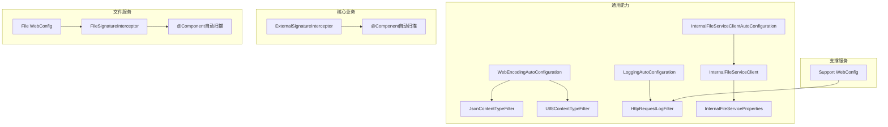
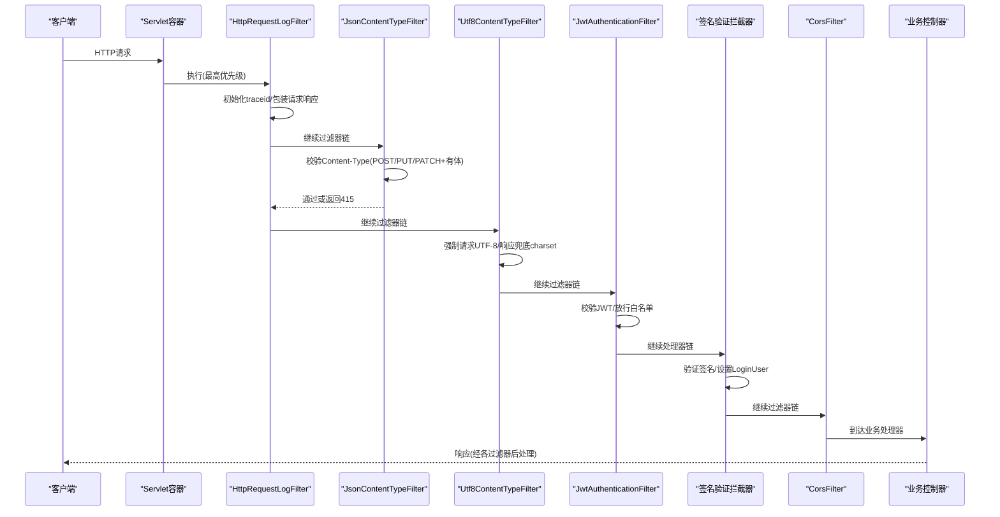
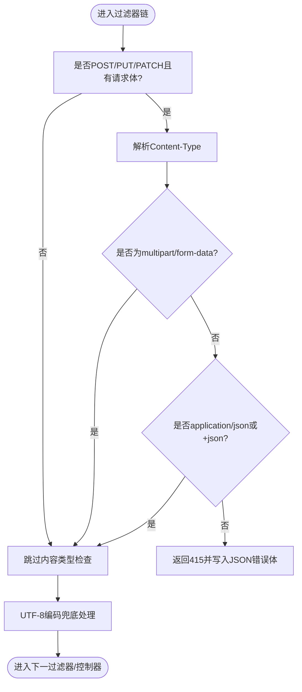
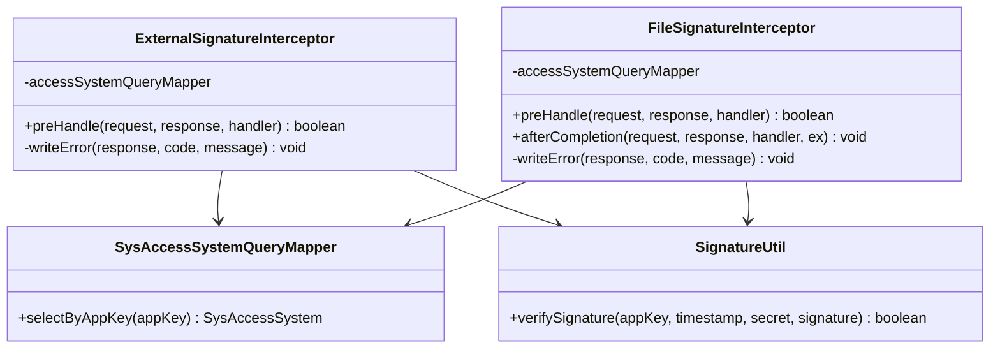
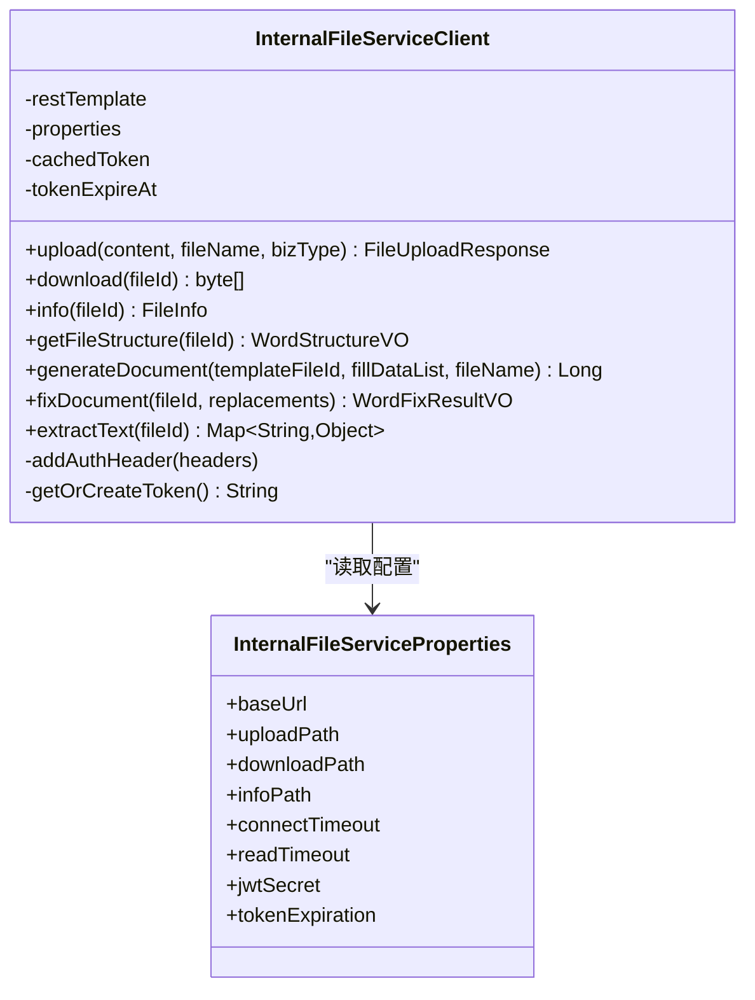
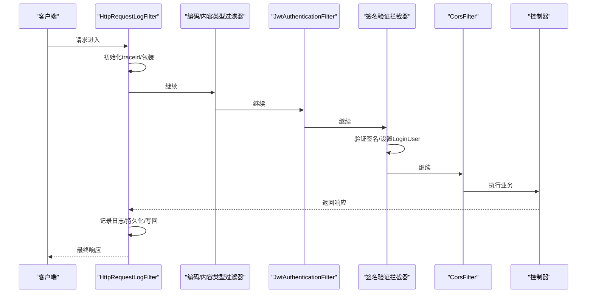
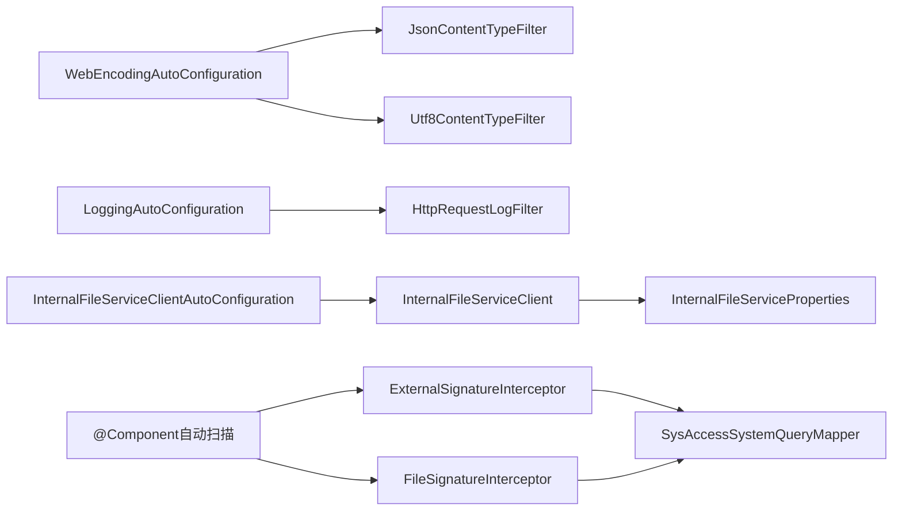

# Web过滤器与拦截器

<cite>
**本文引用的文件**   
- [JsonContentTypeFilter.java](file://ele-ai-tender-system/ele-ai-tender-common/src/main/java/com/jy/eleaitender/common/web/JsonContentTypeFilter.java)
- [Utf8ContentTypeFilter.java](file://ele-ai-tender-system/ele-ai-tender-common/src/main/java/com/jy/eleaitender/common/web/Utf8ContentTypeFilter.java)
- [WebEncodingAutoConfiguration.java](file://ele-ai-tender-system/ele-ai-tender-common/src/main/java/com/jy/eleaitender/common/web/WebEncodingAutoConfiguration.java)
- [InternalFileServiceClient.java](file://ele-ai-tender-system/ele-ai-tender-common/src/main/java/com/jy/eleaitender/common/client/InternalFileServiceClient.java)
- [InternalFileServiceProperties.java](file://ele-ai-tender-system/ele-ai-tender-common/src/main/java/com/jy/eleaitender/common/client/InternalFileServiceProperties.java)
- [InternalFileServiceClientAutoConfiguration.java](file://ele-ai-tender-system/ele-ai-tender-common/src/main/java/com/jy/eleaitender/common/client/InternalFileServiceClientAutoConfiguration.java)
- [HttpRequestLogFilter.java](file://ele-ai-tender-system/ele-ai-tender-common/src/main/java/com/jy/eleaitender/common/logging/HttpRequestLogFilter.java)
- [LoggingAutoConfiguration.java](file://ele-ai-tender-system/ele-ai-tender-common/src/main/java/com/jy/eleaitender/common/logging/LoggingAutoConfiguration.java)
- [WebConfig.java](file://ele-ai-tender-system/ele-ai-tender-support/src/main/java/com/jy/eleaitender/support/config/WebConfig.java)
- [ExternalSignatureInterceptor.java](file://ele-ai-tender-system/ele-ai-tender-core\src\main\java\com\jy\eleaitender\core\config\ExternalSignatureInterceptor.java)
- [FileSignatureInterceptor.java](file://ele-ai-tender-system/ele-ai-tender-file\src\main\java\com\jy\eleaitender\file\config\FileSignatureInterceptor.java)
- [WebConfig.java](file://ele-ai-tender-system/ele-ai-tender-file\src\main\java\com\jy\eleaitender\file\config\WebConfig.java)
</cite>

## 更新摘要
**变更内容**   
- 新增业务拦截器章节，详细说明ExternalSignatureInterceptor和FileSignatureInterceptor的实现机制
- 更新拦截器注册方式，从手动@Bean注册改为Spring自动组件扫描(@Component注解)
- 补充签名验证拦截器的执行顺序和认证流程说明
- 完善Web层横切功能的完整架构图

## 目录
1. [简介](#简介)
2. [项目结构](#项目结构)
3. [核心组件](#核心组件)
4. [架构总览](#架构总览)
5. [详细组件分析](#详细组件分析)
6. [依赖关系分析](#依赖关系分析)
7. [性能考虑](#性能考虑)
8. [故障排查指南](#故障排查指南)
9. [结论](#结论)
10. [附录](#附录)

## 简介
本技术文档聚焦于Web层的横切能力实现，围绕以下主题展开：
- 字符集与内容类型统一处理：Utf8ContentTypeFilter、JsonContentTypeFilter
- 自动装配与注册：WebEncodingAutoConfiguration
- 内部服务客户端封装：InternalFileServiceClient（含认证头注入、超时配置）
- 请求日志与追踪：HttpRequestLogFilter、LoggingAutoConfiguration
- 跨域与安全头：CorsFilter、JwtAuthenticationFilter
- **业务签名验证拦截器：ExternalSignatureInterceptor、FileSignatureInterceptor（基于@Component自动扫描）**
- 过滤器链顺序、错误处理策略、扩展点规范与集成指南

## 项目结构
本项目在通用模块中提供Web层横切能力，并在各业务模块中进行具体集成。关键位置如下：
- 通用Web编码与内容类型过滤：common/web
- 通用访问日志过滤：common/logging
- 内部文件服务客户端：common/client
- 支撑服务Web配置（安全、跨域、默认内容协商）：support/config
- **核心业务签名拦截器：core/config**
- **文件服务签名拦截器：file/config**

**图表来源**
- [WebEncodingAutoConfiguration.java:1-42](file://ele-ai-tender-system/ele-ai-tender-common/src/main/java/com/jy/eleaitender/common/web/WebEncodingAutoConfiguration.java#L1-L42)
- [JsonContentTypeFilter.java:1-91](file://ele-ai-tender-system/ele-ai-tender-common/src/main/java/com/jy/eleaitender/common/web/JsonContentTypeFilter.java#L1-L91)
- [Utf8ContentTypeFilter.java:1-95](file://ele-ai-tender-system/ele-ai-tender-common/src/main/java/com/jy/eleaitender/common/web/Utf8ContentTypeFilter.java#L1-L95)
- [LoggingAutoConfiguration.java:1-82](file://ele-ai-tender-system/ele-ai-tender-common/src/main/java/com/jy/eleaitender/common/logging/LoggingAutoConfiguration.java#L1-L82)
- [HttpRequestLogFilter.java:1-137](file://ele-ai-tender-system/ele-ai-tender-common/src/main/java/com/jy/eleaitender/common/logging/HttpRequestLogFilter.java#L1-L137)
- [InternalFileServiceClientAutoConfiguration.java:1-38](file://ele-ai-tender-system/ele-ai-tender-common/src/main/java/com/jy/eleaitender/common/client/InternalFileServiceClientAutoConfiguration.java#L1-L38)
- [InternalFileServiceClient.java:1-362](file://ele-ai-tender-system/ele-ai-tender-common/src/main/java/com/jy/eleaitender/common/client/InternalFileServiceClient.java#L1-L362)
- [InternalFileServiceProperties.java:1-39](file://ele-ai-tender-system/ele-ai-tender-common/src/main/java/com/jy/eleaitender/common/client/InternalFileServiceProperties.java#L1-L39)
- [ExternalSignatureInterceptor.java:19-92](file://ele-ai-tender-system/ele-ai-tender-core\src\main\java\com\jy\eleaitender\core\config\ExternalSignatureInterceptor.java#L19-L92)
- [FileSignatureInterceptor.java:26-123](file://ele-ai-tender-system/ele-ai-tender-file\src\main\java\com\jy\eleaitender\file\config\FileSignatureInterceptor.java#L26-L123)
- [WebConfig.java:1-60](file://ele-ai-tender-system/ele-ai-tender-file\src\main\java\com\jy\eleaitender\file\config\WebConfig.java#L1-L60)

**章节来源**
- [WebEncodingAutoConfiguration.java:1-42](file://ele-ai-tender-system/ele-ai-tender-common/src/main/java/com/jy/eleaitender/common/web/WebEncodingAutoConfiguration.java#L1-L42)
- [LoggingAutoConfiguration.java:1-82](file://ele-ai-tender-system/ele-ai-tender-common/src/main/java/com/jy/eleaitender/common/logging/LoggingAutoConfiguration.java#L1-L82)
- [WebConfig.java:1-62](file://ele-ai-tender-system/ele-ai-tender-support/src/main/java/com/jy/eleaitender/support/config/WebConfig.java#L1-L62)

## 核心组件
- JsonContentTypeFilter：对POST/PUT/PATCH且带体的请求进行Content-Type校验，仅允许application/json及其兼容类型，以及multipart/form-data（用于上传）。不满足时直接返回415并输出JSON错误体。
- Utf8ContentTypeFilter：强制请求编码为UTF-8；响应阶段对文本类媒体类型兜底设置charset=UTF-8，避免乱码。
- WebEncodingAutoConfiguration：以最高优先级注册上述两个过滤器，确保在业务逻辑之前生效。
- HttpRequestLogFilter：统一采集请求/响应体、耗时、traceId，支持SSE流式场景特殊处理，并可持久化访问日志。
- LoggingAutoConfiguration：按需启用日志过滤器与异步持久化线程池，并提供可插拔的持久化服务。
- InternalFileServiceClient：面向内部文件服务的HTTP客户端，封装上传、下载、元数据、文档结构与修复等接口，统一注入服务间调用Token。
- InternalFileServiceProperties：集中管理文件服务URL、路径、超时、JWT密钥与Token过期时间等配置。
- **ExternalSignatureInterceptor：核心业务外部系统签名验证拦截器，使用@Component自动扫描注册，验证X-App-Key、X-Timestamp、X-Signature请求头。**
- **FileSignatureInterceptor：文件服务签名验证拦截器，使用@Component自动扫描注册，支持条件触发（有签名头验签，无签名头放行由JWT处理）。**
- WebConfig（支撑服务）：注册JwtAuthenticationFilter、全局CORS、默认内容协商为JSON。
- WebConfig（文件服务）：注册文件服务专用的JWT过滤器和签名拦截器映射。

**章节来源**
- [JsonContentTypeFilter.java:1-91](file://ele-ai-tender-system/ele-ai-tender-common/src/main/java/com/jy/eleaitender/common/web/JsonContentTypeFilter.java#L1-L91)
- [Utf8ContentTypeFilter.java:1-95](file://ele-ai-tender-system/ele-ai-tender-common/src/main/java/com/jy/eleaitender/common/web/Utf8ContentTypeFilter.java#L1-L95)
- [WebEncodingAutoConfiguration.java:1-42](file://ele-ai-tender-system/ele-ai-tender-common/src/main/java/com/jy/eleaitender/common/web/WebEncodingAutoConfiguration.java#L1-L42)
- [HttpRequestLogFilter.java:1-137](file://ele-ai-tender-system/ele-ai-tender-common/src/main/java/com/jy/eleaitender/common/logging/HttpRequestLogFilter.java#L1-L137)
- [LoggingAutoConfiguration.java:1-82](file://ele-ai-tender-system/ele-ai-tender-common/src/main/java/com/jy/eleaitender/common/logging/LoggingAutoConfiguration.java#L1-L82)
- [InternalFileServiceClient.java:1-362](file://ele-ai-tender-system/ele-ai-tender-common/src/main/java/com/jy/eleaitender/common/client/InternalFileServiceClient.java#L1-L362)
- [InternalFileServiceProperties.java:1-39](file://ele-ai-tender-system/ele-ai-tender-common/src/main/java/com/jy/eleaitender/common/client/InternalFileServiceProperties.java#L1-L39)
- [ExternalSignatureInterceptor.java:19-92](file://ele-ai-tender-system/ele-ai-tender-core\src\main\java\com\jy\eleaitender\core\config\ExternalSignatureInterceptor.java#L19-L92)
- [FileSignatureInterceptor.java:26-123](file://ele-ai-tender-system/ele-ai-tender-file\src\main\java\com\jy\eleaitender\file\config\FileSignatureInterceptor.java#L26-L123)
- [WebConfig.java:1-62](file://ele-ai-tender-system/ele-ai-tender-support/src/main/java/com/jy/eleaitender/support/config/WebConfig.java#L1-L62)

## 架构总览
下图展示了从请求进入容器到控制器处理的典型链路，包含内容类型校验、编码兜底、日志采集、鉴权、签名验证与跨域等横切能力。

**图表来源**
- [LoggingAutoConfiguration.java:29-53](file://ele-ai-tender-system/ele-ai-tender-common/src/main/java/com/jy/eleaitender/common/logging/LoggingAutoConfiguration.java#L29-L53)
- [WebEncodingAutoConfiguration.java:19-40](file://ele-ai-tender-system/ele-ai-tender-common/src/main/java/com/jy/eleaitender/common/web/WebEncodingAutoConfiguration.java#L19-L40)
- [ExternalSignatureInterceptor.java:30-75](file://ele-ai-tender-system/ele-ai-tender-core\src\main\java\com\jy\eleaitender\core\config\ExternalSignatureInterceptor.java#L30-L75)
- [FileSignatureInterceptor.java:37-98](file://ele-ai-tender-system/ele-ai-tender-file\src\main\java\com\jy\eleaitender\file\config\FileSignatureInterceptor.java#L37-L98)
- [WebConfig.java:25-55](file://ele-ai-tender-system/ele-ai-tender-support/src/main/java/com/jy/eleaitender/support/config/WebConfig.java#L25-L55)

## 详细组件分析

### 字符集与内容类型过滤器
- 设计要点
  - 高优先级注册，确保在业务逻辑前完成基础约束。
  - JsonContentTypeFilter对方法+体大小+Transfer-Encoding综合判断是否检查Content-Type。
  - Utf8ContentTypeFilter对文本类响应兜底追加charset，避免浏览器解析异常。
- 过滤器链顺序
  - 日志过滤器：最高优先级
  - JSON内容类型过滤器：次高
  - UTF-8编码过滤器：再次之
  - 鉴权过滤器：由应用侧注册，通常紧随其后
  - 跨域过滤器：由应用侧注册，顺序取决于Bean定义
- 错误处理
  - 不支持的Content-Type直接返回415与JSON错误体，避免进入后续流程。

**图表来源**
- [JsonContentTypeFilter.java:40-89](file://ele-ai-tender-system/ele-ai-tender-common/src/main/java/com/jy/eleaitender/common/web/JsonContentTypeFilter.java#L40-L89)
- [Utf8ContentTypeFilter.java:26-84](file://ele-ai-tender-system/ele-ai-tender-common/src/main/java/com/jy/eleaitender/common/web/Utf8ContentTypeFilter.java#L26-L84)

**章节来源**
- [JsonContentTypeFilter.java:1-91](file://ele-ai-tender-system/ele-ai-tender-common/src/main/java/com/jy/eleaitender/common/web/JsonContentTypeFilter.java#L1-L91)
- [Utf8ContentTypeFilter.java:1-95](file://ele-ai-tender-system/ele-ai-tender-common/src/main/java/com/jy/eleaitender/common/web/Utf8ContentTypeFilter.java#L1-L95)
- [WebEncodingAutoConfiguration.java:19-40](file://ele-ai-tender-system/ele-ai-tender-common/src/main/java/com/jy/eleaitender/common/web/WebEncodingAutoConfiguration.java#L19-L40)

### 业务签名验证拦截器
- **ExternalSignatureInterceptor（核心业务）**
  - 使用@Component注解，通过Spring自动组件扫描注册
  - 强制验证X-App-Key、X-Timestamp、X-Signature三个请求头
  - 查询接入系统信息，验证状态和有效期
  - 使用SignatureUtil.verifySignature进行签名验证
  - 验证失败直接返回400/401错误响应

- **FileSignatureInterceptor（文件服务）**
  - 使用@Component注解，通过Spring自动组件扫描注册
  - 条件触发模式：无签名头时放行由JWT处理，有签名头时进行验签
  - 验签通过后设置LoginUser，使@RequireLogin注解通过
  - 支持内部调用方(JWT)和外部调用方(签名)两种认证方式
  - afterCompletion中清理签名认证设置的LoginUser，避免影响JWT认证

- **拦截器注册方式变更**
  - 旧方式：在WebConfig中使用@Bean手动注册拦截器实例
  - 新方式：使用@Component注解，Spring自动扫描并注册
  - 优势：简化配置，减少样板代码，提高可维护性

**图表来源**
- [ExternalSignatureInterceptor.java:21-92](file://ele-ai-tender-system/ele-ai-tender-core\src\main\java\com\jy\eleaitender\core\config\ExternalSignatureInterceptor.java#L21-L92)
- [FileSignatureInterceptor.java:28-123](file://ele-ai-tender-system/ele-ai-tender-file\src\main\java\com\jy\eleaitender\file\config\FileSignatureInterceptor.java#L28-L123)

**章节来源**
- [ExternalSignatureInterceptor.java:19-92](file://ele-ai-tender-system/ele-ai-tender-core\src\main\java\com\jy\eleaitender\core\config\ExternalSignatureInterceptor.java#L19-L92)
- [FileSignatureInterceptor.java:26-123](file://ele-ai-tender-system/ele-ai-tender-file\src\main\java\com\jy\eleaitender\file\config\FileSignatureInterceptor.java#L26-L123)
- [WebConfig.java:55-60](file://ele-ai-tender-system/ele-ai-tender-file\src\main\java\com\jy\eleaitender\file\config\WebConfig.java#L55-L60)

### 内部文件服务客户端
- 职责边界
  - 封装对文件服务的HTTP调用：上传、下载、信息获取、文档结构提取、文档生成与修复。
  - 统一注入服务间调用Token（Bearer），基于配置的JWT密钥与过期时间缓存Token。
  - 使用RestTemplate发起请求，暴露统一的业务方法。
- 配置项
  - internal.file-service.base-url：文件服务基础地址
  - internal.file-service.uploadPath/downloadPath/infoPath：接口路径
  - internal.file-service.connectTimeout/readTimeout：连接与读取超时
  - internal.file-service.jwtSecret/tokenExpiration：服务间调用Token相关
- 微服务通信机制说明
  - 当前实现采用直连方式（RestTemplate + baseUrl），未内置服务发现、负载均衡与熔断降级。
  - 如需引入这些能力，可在上层替换为OpenFeign/Resilience4j或Spring Cloud LoadBalancer，并保持InternalFileServiceClient对外接口不变。

**图表来源**
- [InternalFileServiceClient.java:26-266](file://ele-ai-tender-system/ele-ai-tender-common/src/main/java/com/jy/eleaitender/common/client/InternalFileServiceClient.java#L26-L266)
- [InternalFileServiceProperties.java:11-38](file://ele-ai-tender-system/ele-ai-tender-common/src/main/java/com/jy/eleaitender/common/client/InternalFileServiceProperties.java#L11-L38)

**章节来源**
- [InternalFileServiceClient.java:1-362](file://ele-ai-tender-system/ele-ai-tender-common/src/main/java/com/jy/eleaitender/common/client/InternalFileServiceClient.java#L1-L362)
- [InternalFileServiceProperties.java:1-39](file://ele-ai-tender-system/ele-ai-tender-common/src/main/java/com/jy/eleaitender/common/client/InternalFileServiceProperties.java#L1-L39)
- [InternalFileServiceClientAutoConfiguration.java:1-38](file://ele-ai-tender-system/ele-ai-tender-common/src/main/java/com/jy/eleaitender/common/client/InternalFileServiceClientAutoConfiguration.java#L1-L38)

### 请求预处理、响应后处理与跨域、安全头
- 请求预处理
  - 日志过滤器：初始化traceId、包装请求/响应以便读取体，SSE场景特殊处理避免事件丢失。
  - 内容类型与编码过滤器：前置校验与兜底，保证后续处理稳定。
  - **签名验证拦截器：验证外部系统身份，设置登录用户上下文。**
- 响应后处理
  - 日志过滤器：计算耗时、构建访问日志、可选持久化、写回响应体。
  - UTF-8过滤器：确保文本类响应携带charset=UTF-8。
  - **签名拦截器：清理临时设置的LoginUser，避免影响后续处理。**
- 跨域与安全头
  - 支撑服务注册全局CorsFilter，允许所有来源与方法，便于前后端联调。
  - 注册JwtAuthenticationFilter，对/api/*路径进行鉴权，并配置白名单路径与令牌类型集合。
  - **文件服务注册专用JWT过滤器，支持内部和服务间调用。**

**图表来源**
- [HttpRequestLogFilter.java:41-106](file://ele-ai-tender-system/ele-ai-tender-common/src/main/java/com/jy/eleaitender/common/logging/HttpRequestLogFilter.java#L41-L106)
- [WebEncodingAutoConfiguration.java:19-40](file://ele-ai-tender-system/ele-ai-tender-common/src/main/java/com/jy/eleaitender/common/web/WebEncodingAutoConfiguration.java#L19-L40)
- [ExternalSignatureInterceptor.java:30-75](file://ele-ai-tender-system/ele-ai-tender-core\src\main\java\com\jy\eleaitender\core\config\ExternalSignatureInterceptor.java#L30-L75)
- [FileSignatureInterceptor.java:37-98](file://ele-ai-tender-system/ele-ai-tender-file\src\main\java\com\jy\eleaitender\file\config\FileSignatureInterceptor.java#L37-L98)
- [WebConfig.java:25-55](file://ele-ai-tender-system/ele-ai-tender-support/src/main/java/com/jy/eleaitender/support/config/WebConfig.java#L25-L55)

**章节来源**
- [HttpRequestLogFilter.java:1-137](file://ele-ai-tender-system/ele-ai-tender-common/src/main/java/com/jy/eleaitender/common/logging/HttpRequestLogFilter.java#L1-L137)
- [LoggingAutoConfiguration.java:1-82](file://ele-ai-tender-system/ele-ai-tender-common/src/main/java/com/jy/eleaitender/common/logging/LoggingAutoConfiguration.java#L1-L82)
- [WebConfig.java:1-62](file://ele-ai-tender-system/ele-ai-tender-support/src/main/java/com/jy/eleaitender/support/config/WebConfig.java#L1-L62)

## 依赖关系分析
- 自动装配与条件装配
  - WebEncodingAutoConfiguration：无条件注册两个过滤器，按序设置优先级。
  - LoggingAutoConfiguration：根据AccessLogProperties开关启用日志过滤器与持久化服务，提供单线程异步任务执行器。
  - InternalFileServiceClientAutoConfiguration：仅在配置了internal.file-service.base-url时启用，创建RestTemplate并注入给客户端。
  - **业务拦截器：通过@Component注解自动扫描注册，无需手动@Bean配置。**
- 组件耦合
  - InternalFileServiceClient强依赖RestTemplate与配置属性，弱依赖Jackson ObjectMapper（用于解析响应）。
  - 过滤器之间通过FilterRegistrationBean的order控制顺序，彼此无直接依赖。
  - **签名拦截器依赖SysAccessSystemQueryMapper和SignatureUtil，通过构造器注入。**

**图表来源**
- [WebEncodingAutoConfiguration.java:19-40](file://ele-ai-tender-system/ele-ai-tender-common/src/main/java/com/jy/eleaitender/common/web/WebEncodingAutoConfiguration.java#L19-L40)
- [LoggingAutoConfiguration.java:29-53](file://ele-ai-tender-system/ele-ai-tender-common/src/main/java/com/jy/eleaitender/common/logging/LoggingAutoConfiguration.java#L29-L53)
- [InternalFileServiceClientAutoConfiguration.java:24-37](file://ele-ai-tender-system/ele-ai-tender-common/src/main/java/com/jy/eleaitender/common/client/InternalFileServiceClientAutoConfiguration.java#L24-L37)
- [ExternalSignatureInterceptor.java:21-28](file://ele-ai-tender-system/ele-ai-tender-core\src\main\java\com\jy\eleaitender\core\config\ExternalSignatureInterceptor.java#L21-L28)
- [FileSignatureInterceptor.java:28-35](file://ele-ai-tender-system/ele-ai-tender-file\src\main\java\com\jy\eleaitender\file\config\FileSignatureInterceptor.java#L28-L35)

**章节来源**
- [WebEncodingAutoConfiguration.java:1-42](file://ele-ai-tender-system/ele-ai-tender-common/src/main/java/com/jy/eleaitender/common/web/WebEncodingAutoConfiguration.java#L1-L42)
- [LoggingAutoConfiguration.java:1-82](file://ele-ai-tender-system/ele-ai-tender-common/src/main/java/com/jy/eleaitender/common/logging/LoggingAutoConfiguration.java#L1-L82)
- [InternalFileServiceClientAutoConfiguration.java:1-38](file://ele-ai-tender-system/ele-ai-tender-common/src/main/java/com/jy/eleaitender/common/client/InternalFileServiceClientAutoConfiguration.java#L1-L38)

## 性能考虑
- 过滤器顺序与开销
  - 日志过滤器位于最前，会包装请求/响应体，可能带来额外内存占用。建议在非生产环境关闭或限制采样。
  - SSE请求不走响应体包装，避免阻塞流式事件。
  - **签名验证拦截器增加数据库查询和签名计算开销，建议合理配置缓存策略。**
- 超时与重试
  - 内部文件服务客户端可通过connectTimeout/readTimeout控制网络行为；建议结合上层重试/熔断策略（如引入Resilience4j）。
  - **签名验证涉及数据库查询，需关注查询性能和超时配置。**
- 序列化成本
  - 日志过滤器使用ObjectMapper序列化请求/响应体，注意大对象带来的GC压力，必要时裁剪字段或禁用敏感信息。

## 故障排查指南
- 415 Unsupported Media Type
  - 现象：POST/PUT/PATCH请求被拒绝，返回JSON错误体。
  - 排查：确认Content-Type是否为application/json或multipart/form-data；检查请求体是否存在。
  - 参考实现：内容类型校验逻辑。
- 中文乱码
  - 现象：响应中文显示异常。
  - 排查：确认Utf8ContentTypeFilter已生效；检查响应Content-Type是否包含charset=UTF-8。
- 访问日志缺失或不持久化
  - 现象：控制台有日志但数据库无记录。
  - 排查：确认AccessLogProperties.enabled/persist-enabled开关；检查SysAccessLogMapper是否可用；查看异步写入线程是否启动。
- 内部文件服务调用失败
  - 现象：上传/下载/生成文档等接口报错。
  - 排查：核对internal.file-service.base-url与路径；检查jwtSecret与tokenExpiration；观察RestTemplate超时与异常堆栈。
- **签名验证失败**
  - 现象：外部系统调用返回401或400错误。
  - 排查：检查X-App-Key、X-Timestamp、X-Signature请求头是否正确；验证appKey对应的系统状态和有效期；确认签名算法和密钥配置。
  - **组件注册问题**：确认拦截器类是否添加@Component注解；检查包扫描路径是否正确。

**章节来源**
- [JsonContentTypeFilter.java:83-89](file://ele-ai-tender-system/ele-ai-tender-common/src/main/java/com/jy/eleaitender/common/web/JsonContentTypeFilter.java#L83-L89)
- [Utf8ContentTypeFilter.java:42-69](file://ele-ai-tender-system/ele-ai-tender-common/src/main/java/com/jy/eleaitender/common/web/Utf8ContentTypeFilter.java#L42-L69)
- [LoggingAutoConfiguration.java:66-80](file://ele-ai-tender-system/ele-ai-tender-common/src/main/java/com/jy/eleaitender/common/logging/LoggingAutoConfiguration.java#L66-L80)
- [InternalFileServiceClient.java:52-124](file://ele-ai-tender-system/ele-ai-tender-common/src/main/java/com/jy/eleaitender/common/client/InternalFileServiceClient.java#L52-L124)
- [ExternalSignatureInterceptor.java:36-72](file://ele-ai-tender-system/ele-ai-tender-core\src\main\java\com\jy\eleaitender\core\config\ExternalSignatureInterceptor.java#L36-L72)
- [FileSignatureInterceptor.java:44-87](file://ele-ai-tender-system/ele-ai-tender-file\src\main\java\com\jy\eleaitender\file\config\FileSignatureInterceptor.java#L44-L87)

## 结论
- 通过高优先级的内容类型与编码过滤器，系统在前置阶段即完成基础约束，降低后续处理复杂度。
- 日志过滤器提供统一的traceId与访问日志能力，并对SSE场景做了适配。
- 内部文件服务客户端封装了常用操作与服务间认证，便于复用与扩展。
- **业务签名验证拦截器通过@Component自动扫描注册，简化了配置管理，提高了可维护性。**
- **文件服务支持双认证模式（JWT和签名），满足不同调用方的需求。**
- 支撑服务提供了鉴权与跨域的基础能力，可按需调整白名单与策略。

## 附录

### 过滤器链执行顺序与扩展点
- 顺序约定
  - 日志过滤器：最高优先级
  - JSON内容类型过滤器：次高
  - UTF-8编码过滤器：再次之
  - 鉴权过滤器：由应用侧注册，建议紧随编码/内容类型之后
  - **签名验证拦截器：在鉴权过滤器之后，业务控制器之前**
  - 跨域过滤器：由应用侧注册，通常靠近入口
- 扩展建议
  - 新增过滤器：通过FilterRegistrationBean注册并设置order，遵循"先校验、再鉴权、后业务"的原则。
  - **新增拦截器：使用@Component注解自动注册，在WebConfig中配置路径映射。**
  - 自定义内容类型：若需支持新的媒体类型，应在JsonContentTypeFilter中扩展白名单逻辑。
  - 自定义鉴权：在JwtAuthenticationFilter基础上增加注解或路径规则，保持最小权限原则。

**章节来源**
- [WebEncodingAutoConfiguration.java:19-40](file://ele-ai-tender-system/ele-ai-tender-common/src/main/java/com/jy/eleaitender/common/web/WebEncodingAutoConfiguration.java#L19-L40)
- [LoggingAutoConfiguration.java:29-53](file://ele-ai-tender-system/ele-ai-tender-common/src/main/java/com/jy/eleaitender/common/logging/LoggingAutoConfiguration.java#L29-L53)
- [WebConfig.java:25-55](file://ele-ai-tender-system/ele-ai-tender-support/src/main/java/com/jy/eleaitender/support/config/WebConfig.java#L25-L55)
- [WebConfig.java:55-60](file://ele-ai-tender-system/ele-ai-tender-file\src\main\java\com\jy\eleaitender\file\config\WebConfig.java#L55-L60)

### 内部文件服务客户端集成指南
- 启用条件
  - 配置internal.file-service.base-url后，自动装配将创建RestTemplate与客户端实例。
- 基本用法
  - 注入InternalFileServiceClient，调用upload/download/info等方法。
- 安全与稳定性
  - 合理设置connectTimeout/readTimeout，避免长尾请求拖垮线程池。
  - 未来可引入服务发现与熔断降级，保持对外接口不变。

**章节来源**
- [InternalFileServiceClientAutoConfiguration.java:18-37](file://ele-ai-tender-system/ele-ai-tender-common/src/main/java/com/jy/eleaitender/common/client/InternalFileServiceClientAutoConfiguration.java#L18-L37)
- [InternalFileServiceClient.java:39-76](file://ele-ai-tender-system/ele-ai-tender-common/src/main/java/com/jy/eleaitender/common/client/InternalFileServiceClient.java#L39-L76)
- [InternalFileServiceProperties.java:11-38](file://ele-ai-tender-system/ele-ai-tender-common/src/main/java/com/jy/eleaitender/common/client/InternalFileServiceProperties.java#L11-L38)

### 业务拦截器开发规范
- 组件注册
  - 使用@Component注解标记拦截器类，确保Spring自动扫描注册。
  - 通过构造器注入依赖，避免使用@Autowired字段注入。
- 路径映射
  - 在对应模块的WebConfig中通过addInterceptors方法配置拦截路径。
  - 合理使用路径匹配模式，精确控制拦截范围。
- 认证流程
  - 验证请求参数完整性，及时返回错误响应。
  - 设置LoginUser上下文，使@RequireLogin注解生效。
  - 在afterCompletion中清理临时设置的上下文信息。

**章节来源**
- [ExternalSignatureInterceptor.java:21-28](file://ele-ai-tender-system/ele-ai-tender-core\src\main\java\com\jy\eleaitender\core\config\ExternalSignatureInterceptor.java#L21-L28)
- [FileSignatureInterceptor.java:28-35](file://ele-ai-tender-system/ele-ai-tender-file\src\main\java\com\jy\eleaitender\file\config\FileSignatureInterceptor.java#L28-L35)
- [WebConfig.java:55-60](file://ele-ai-tender-system/ele-ai-tender-file\src\main\java\com\jy\eleaitender\file\config\WebConfig.java#L55-L60)