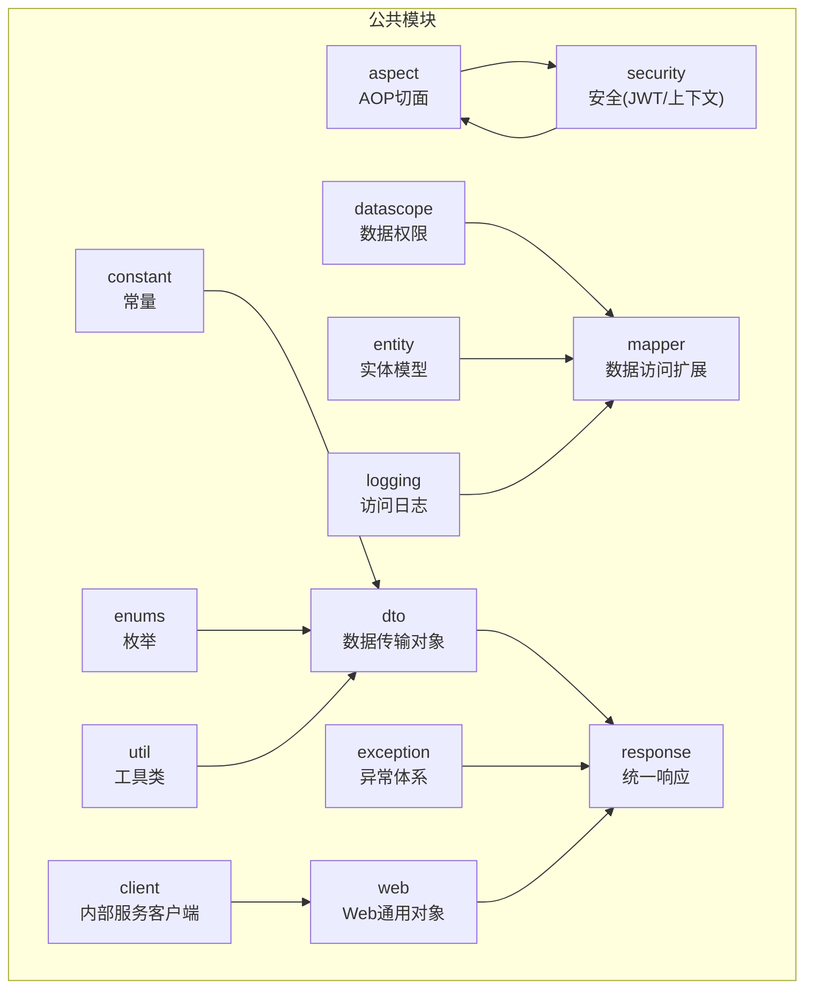
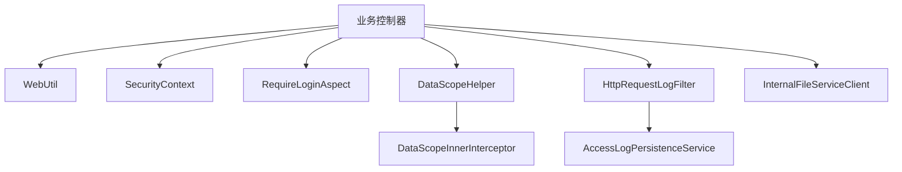
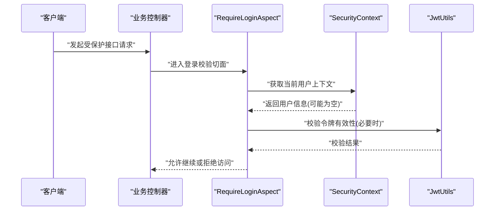
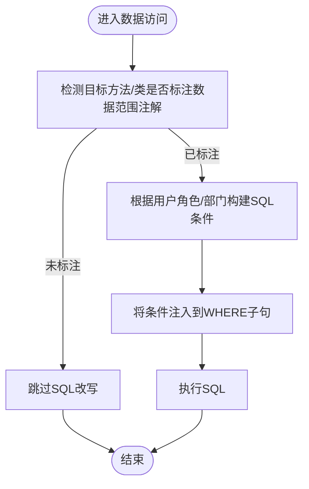
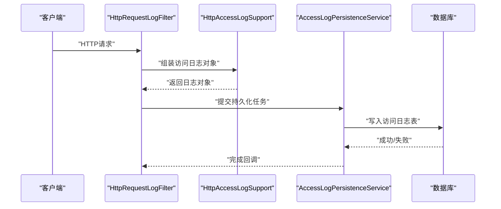
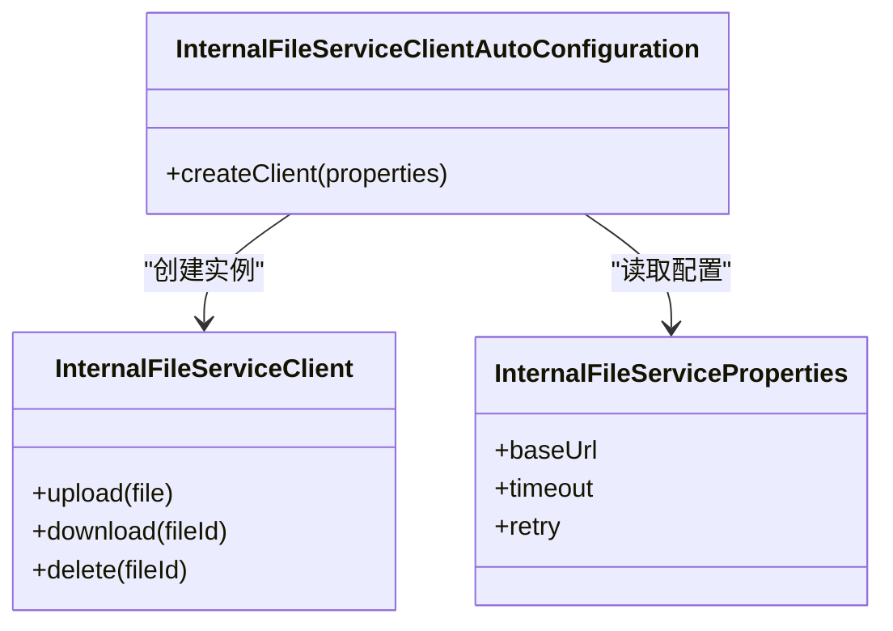
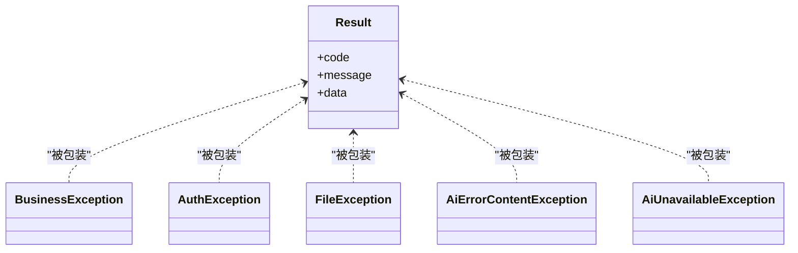
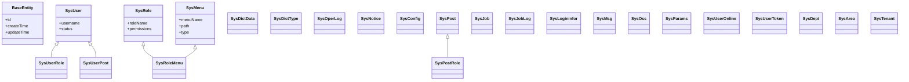
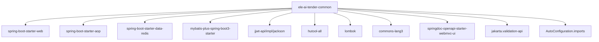

# 公共模块 (ele-ai-tender-common)

<cite>
**本文引用的文件**   
- [pom.xml](file://ele-ai-tender-system/ele-ai-tender-common/pom.xml)
- [RequireLoginAspect.java](file://ele-ai-tender-system/ele-ai-tender-common/src/main/java/com/jy/eleaitender/common/aspect/RequireLoginAspect.java)
- [InternalFileServiceClient.java](file://ele-ai-tender-system/ele-ai-tender-common/src/main/java/com/jy/eleaitender/common/client/InternalFileServiceClient.java)
- [InternalFileServiceClientAutoConfiguration.java](file://ele-ai-tender-system/ele-ai-tender-common/src/main/java/com/jy/eleaitender/common/client/InternalFileServiceClientAutoConfiguration.java)
- [InternalFileServiceProperties.java](file://ele-ai-tender-system/ele-ai-tender-common/src/main/java/com/jy/eleaitender/common/client/InternalFileServiceProperties.java)
- [CommonConstant.java](file://ele-ai-tender-system/ele-ai-tender-common/src/main/java/com/jy/eleaitender/common/constant/CommonConstant.java)
- [FileConstants.java](file://ele-ai-tender-system/ele-ai-tender-common/src/main/java/com/jy/eleaitender/common/constant/FileConstants.java)
- [RedisKeyConstant.java](file://ele-ai-tender-system/ele-ai-tender-common/src/main/java/com/jy/eleaitender/common/constant/RedisKeyConstant.java)
- [DataScope.java](file://ele-ai-tender-system/ele-ai-tender-common/src/main/java/com/jy/eleaitender/common/datascope/DataScope.java)
- [DataScopeHelper.java](file://ele-ai-tender-system/ele-ai-tender-common/src/main/java/com/jy/eleaitender/common/datascope/DataScopeHelper.java)
- [DataScopeInnerInterceptor.java](file://ele-ai-tender-system/ele-ai-tender-common/src/main/java/com/jy/eleaitender/common/datascope/DataScopeInnerInterceptor.java)
- [DataScopeTable.java](file://ele-ai-tender-system/ele-ai-tender-common/src/main/java/com/jy/eleaitender/common/datascope/DataScopeTable.java)
- [ColumnDef.java](file://ele-ai-tender-system/ele-ai-tender-common/src/main/java/com/jy/eleaitender/common/dto/ColumnDef.java)
- [FillData.java](file://ele-ai-tender-system/ele-ai-tender-common/src/main/java/com/jy/eleaitender/common/dto/FillData.java)
- [FillType.java](file://ele-ai-tender-system/ele-ai-tender-common/src/main/java/com/jy/eleaitender/common/dto/FillType.java)
- [FixReplacement.java](file://ele-ai-tender-system/ele-ai-tender-common/src/main/java/com/jy/eleaitender/common/dto/FixReplacement.java)
- [ImageData.java](file://ele-ai-tender-system/ele-ai-tender-common/src/main/java/com/jy/eleaitender/common/dto/ImageData.java)
- [LocationRefVO.java](file://ele-ai-tender-system/ele-ai-tender-common/src/main/java/com/jy/eleaitender/common/dto/LocationRefVO.java)
- [MergeRule.java](file://ele-ai-tender-system/ele-ai-tender-common/src/main/java/com/jy/eleaitender/common/dto/MergeRule.java)
- [MergeStrategy.java](file://ele-ai-tender-system/ele-ai-tender-common/src/main/java/com/jy/eleaitender/common/dto/MergeStrategy.java)
- [ReviewConfig.java](file://ele-ai-tender-system/ele-ai-tender-common/src/main/java/com/jy/eleaitender/common/dto/ReviewConfig.java)
- [ReviewTypeConfig.java](file://ele-ai-tender-system/ele-ai-tender-common/src/main/java/com/jy/eleaitender/common/dto/ReviewTypeConfig.java)
- [TableData.java](file://ele-ai-tender-system/ele-ai-tender-common/src/main/java/com/jy/eleaitender/common/dto/TableData.java)
- [TemplateReviewItemConfig.java](file://ele-ai-tender-system/ele-ai-tender-common/src/main/java/com/jy/eleaitender/common/dto/TemplateReviewItemConfig.java)
- [AiTaskStatus.java](file://ele-ai-tender-system/ele-ai-tender-common/src/main/java/com/jy/eleaitender/common/enums/AiTaskStatus.java)
- [AiTaskType.java](file://ele-ai-tender-system/ele-ai-tender-common/src/main/java/com/jy/eleaitender/common/enums/AiTaskType.java)
- [AiUsageScenario.java](file://ele-ai-tender-system/ele-ai-tender-common/src/main/java/com/jy/eleaitender/common/enums/AiUsageScenario.java)
- [BidDocumentUploadStatus.java](file://ele-ai-tender-system/ele-ai-tender-common/src/main/java/com/jy/eleaitender/common/enums/BidDocumentUploadStatus.java)
- [CallbackStatus.java](file://ele-ai-tender-system/ele-ai-tender-common/src/main/java/com/jy/eleaitender/common/enums/CallbackStatus.java)
- [DecryptArtifactStatus.java](file://ele-ai-tender-system/ele-ai-tender-common/src/main/java/com/jy/eleaitender/common/enums/DecryptArtifactStatus.java)
- [DecryptRequestStatus.java](file://ele-ai-tender-system/ele-ai-tender-common/src/main/java/com/jy/eleaitender/common/enums/DecryptRequestStatus.java)
- [DetectionType.java](file://ele-ai-tender-system/ele-ai-tender-common/src/main/java/com/jy/eleaitender/common/enums/DetectionType.java)
- [FeedbackScene.java](file://ele-ai-tender-system/ele-ai-tender-common/src/main/java/com/jy/eleaitender/common/enums/FeedbackScene.java)
- [FeedbackType.java](file://ele-ai-tender-system/ele-ai-tender-common/src/main/java/com/jy/eleaitender/common/enums/FeedbackType.java)
- [FileCategory.java](file://ele-ai-tender-system/ele-ai-tender-common/src/main/java/com/jy/eleaitender/common/enums/FileCategory.java)
- [MatchMode.java](file://ele-ai-tender-system/ele-ai-tender-common/src/main/java/com/jy/eleaitender/common/enums/MatchMode.java)
- [MenuType.java](file://ele-ai-tender-system/ele-ai-tender-common/src/main/java/com/jy/eleaitender/common/enums/MenuType.java)
- [MessageBizType.java](file://ele-ai-tender-system/ele-ai-tender-common/src/main/java/com/jy/eleaitender/common/enums/MessageBizType.java)
- [MessageType.java](file://ele-ai-tender-system/ele-ai-tender-common/src/main/java/com/jy/eleaitender/common/enums/MessageType.java)
- [ModelType.java](file://ele-ai-tender-system/ele-ai-tender-common/src/main/java/com/jy/eleaitender/common/enums/ModelType.java)
- [ParamGroup.java](file://ele-ai-tender-system/ele-ai-tender-common/src/main/java/com/jy/eleaitender/common/enums/ParamGroup.java)
- [ParamType.java](file://ele-ai-tender-system/ele-ai-tender-common/src/main/java/com/jy/eleaitender/common/enums/ParamType.java)
- [ProjectCategory.java](file://ele-ai-tender-system/ele-ai-tender-common/src/main/java/com/jy/eleaitender/common/enums/ProjectCategory.java)
- [ProjectPhase.java](file://ele-ai-tender-system/ele-ai-tender-common/src/main/java/com/jy/eleaitender/common/enums/ProjectPhase.java)
- [ProjectStatus.java](file://ele-ai-tender-system/ele-ai-tender-common/src/main/java/com/jy/eleaitender/common/enums/ProjectStatus.java)
- [ProjectType.java](file://ele-ai-tender-system/ele-ai-tender-common/src/main/java/com/jy/eleaitender/common/enums/ProjectType.java)
- [RequirementSource.java](file://ele-ai-tender-system/ele-ai-tender-common/src/main/java/com/jy/eleaitender/common/enums/RequirementSource.java)
- [RequirementSourceType.java](file://ele-ai-tender-system/ele-ai-tender-common/src/main/java/com/jy/eleaitender/common/enums/RequirementSourceType.java)
- [ResponseCode.java](file://ele-ai-tender-system/ele-ai-tender-common/src/main/java/com/jy/eleaitender/common/enums/ResponseCode.java)
- [ReviewMethod.java](file://ele-ai-tender-system/ele-ai-tender-common/src/main/java/com/jy/eleaitender/common/enums/ReviewMethod.java)
- [ReviewType.java](file://ele-ai-tender-system/ele-ai-tender-common/src/main/java/com/jy/eleaitender/common/enums/ReviewType.java)
- [ScoreMode.java](file://ele-ai-tender-system/ele-ai-tender-common/src/main/java/com/jy/eleaitender/common/enums/ScoreMode.java)
- [SubjectivityType.java](file://ele-ai-tender-system/ele-ai-tender-common/src/main/java/com/jy/eleaitender/common/enums/SubjectivityType.java)
- [TenderDocumentScopeType.java](file://ele-ai-tender-system/ele-ai-tender-common/src/main/java/com/jy/eleaitender/common/enums/TenderDocumentScopeType.java)
- [UserStatus.java](file://ele-ai-tender-system/ele-ai-tender-common/src/main/java/com/jy/eleaitender/common/enums/UserStatus.java)
- [VersionStatus.java](file://ele-ai-tender-system/ele-ai-tender-common/src/main/java/com/jy/eleaitender/common/enums/VersionStatus.java)
- [AiErrorContentException.java](file://ele-ai-tender-system/ele-ai-tender-common/src/main/java/com/jy/eleaitender/common/exception/AiErrorContentException.java)
- [AiUnavailableException.java](file://ele-ai-tender-system/ele-ai-tender-common/src/main/java/com/jy/eleaitender/common/exception/AiUnavailableException.java)
- [AuthException.java](file://ele-ai-tender-system/ele-ai-tender-common/src/main/java/com/jy/eleaitender/common/exception/AuthException.java)
- [BusinessException.java](file://ele-ai-tender-system/ele-ai-tender-common/src/main/java/com/jy/eleaitender/common/exception/BusinessException.java)
- [FileException.java](file://ele-ai-tender-system/ele-ai-tender-common/src/main/java/com/jy/eleaitender/common/exception/FileException.java)
- [AccessLogPersistenceService.java](file://ele-ai-tender-system/ele-ai-tender-common/src/main/java/com/jy/eleaitender/common/logging/AccessLogPersistenceService.java)
- [AccessLogProperties.java](file://ele-ai-tender-system/ele-ai-tender-common/src/main/java/com/jy/eleaitender/common/logging/AccessLogProperties.java)
- [DbAccessLogPersistenceService.java](file://ele-ai-tender-system/ele-ai-tender-common/src/main/java/com/jy/eleaitender/common/logging/DbAccessLogPersistenceService.java)
- [HttpAccessLogSupport.java](file://ele-ai-tender-system/ele-ai-tender-common/src/main/java/com/jy/eleaitender/common/logging/HttpAccessLogSupport.java)
- [HttpRequestLogFilter.java](file://ele-ai-tender-system/ele-ai-tender-common/src/main/java/com/jy/eleaitender/common/logging/HttpRequestLogFilter.java)
- [BaseEntity.java](file://ele-ai-tender-system/ele-ai-tender-common/src/main/java/com/jy/eleaitender/common/entity/base/BaseEntity.java)
- [SysUser.java](file://ele-ai-tender-system/ele-ai-tender-common/src/main/java/com/jy/eleaitender/common/entity/core/SysUser.java)
- [SysRole.java](file://ele-ai-tender-system/ele-ai-tender-common/src/main/java/com/jy/eleaitender/common/entity/core/SysRole.java)
- [SysMenu.java](file://ele-ai-tender-system/ele-ai-tender-common/src/main/java/com/jy/eleaitender/common/entity/core/SysMenu.java)
- [SysUserRole.java](file://ele-ai-tender-system/ele-ai-tender-common/src/main/java/com/jy/eleaitender/common/entity/core/SysUserRole.java)
- [SysRoleMenu.java](file://ele-ai-tender-system/ele-ai-tender-common/src/main/java/com/jy/eleaitender/common/entity/core/SysRoleMenu.java)
- [SysDictData.java](file://ele-ai-tender-system/ele-ai-tender-common/src/main/java/com/jy/eleaitender/common/entity/support/SysDictData.java)
- [SysDictType.java](file://ele-ai-tender-system/ele-ai-tender-common/src/main/java/com/jy/eleaitender/common/entity/support/SysDictType.java)
- [SysOperLog.java](file://ele-ai-tender-system/ele-ai-tender-common/src/main/java/com/jy/eleaitender/common/entity/support/SysOperLog.java)
- [SysNotice.java](file://ele-ai-tender-system/ele-ai-tender-common/src/main/java/com/jy/eleaitender/common/entity/support/SysNotice.java)
- [SysConfig.java](file://ele-ai-tender-system/ele-ai-tender-common/src/main/java/com/jy/eleaitender/common/entity/support/SysConfig.java)
- [SysPost.java](file://ele-ai-tender-system/ele-ai-tender-common/src/main/java/com/jy/eleaitender/common/entity/support/SysPost.java)
- [SysJob.java](file://ele-ai-tender-system/ele-ai-tender-common/src/main/java/com/jy/eleaitender/common/entity/support/SysJob.java)
- [SysJobLog.java](file://ele-ai-tender-system/ele-ai-tender-common/src/main/java/com/jy/eleaitender/common/entity/support/SysJobLog.java)
- [SysLogininfor.java](file://ele-ai-tender-system/ele-ai-tender-common/src/main/java/com/jy/eleaitender/common/entity/support/SysLogininfor.java)
- [SysMsg.java](file://ele-ai-tender-system/ele-ai-tender-common/src/main/java/com/jy/eleaitender/common/entity/support/SysMsg.java)
- [SysOss.java](file://ele-ai-tender-system/ele-ai-tender-common/src/main/java/com/jy/eleaitender/common/entity/support/SysOss.java)
- [SysParams.java](file://ele-ai-tender-system/ele-ai-tender-common/src/main/java/com/jy/eleaitender/common/entity/support/SysParams.java)
- [SysPostRole.java](file://ele-ai-tender-system/ele-ai-tender-common/src/main/java/com/jy/eleaitender/common/entity/support/SysPostRole.java)
- [SysUserPost.java](file://ele-ai-tender-system/ele-ai-tender/common/entity/support/SysUserPost.java)
- [SysUserOnline.java](file://ele-ai-tender-system/ele-ai-tender-common/src/main/java/com/jy/eleaitender/common/entity/support/SysUserOnline.java)
- [SysUserToken.java](file://ele-ai-tender-system/ele-ai-tender-common/src/main/java/com/jy/eleaitender/common/entity/support/SysUserToken.java)
- [SysDept.java](file://ele-ai-tender-system/ele-ai-tender-common/src/main/java/com/jy/eleaitender/common/entity/support/SysDept.java)
- [SysArea.java](file://ele-ai-tender-system/ele-ai-tender-common/src/main/java/com/jy/eleaitender/common/entity/support/SysArea.java)
- [SysTenant.java](file://ele-ai-tender-system/ele-ai-tender-common/src/main/java/com/jy/eleaitender/common/entity/support/SysTenant.java)
- [Result.java](file://ele-ai-tender-system/ele-ai-tender-common/src/main/java/com/jy/eleaitender/common/response/Result.java)
- [JwtUtils.java](file://ele-ai-tender-system/ele-ai-tender-common/src/main/java/com/jy/eleaitender/common/security/JwtUtils.java)
- [SecurityContext.java](file://ele-ai-tender-system/ele-ai-tender-common/src/main/java/com/jy/eleaitender/common/security/SecurityContext.java)
- [WebUtil.java](file://ele-ai-tender-system/ele-ai-tender-common/src/main/java/com/jy/eleaitender/common/web/WebUtil.java)
- [CommaSeparatedFieldSql.java](file://ele-ai-tender-system/ele-ai-tender-common/src/main/java/com/jy/eleaitender/common/util/CommaSeparatedFieldSql.java)
- [EncryptUtil.java](file://ele-ai-tender-system/ele-ai-tender-common/src/main/java/com/jy/eleaitender/common/util/EncryptUtil.java)
- [FileUtil.java](file://ele-ai-tender-system/ele-ai-tender-common/src/main/java/com/jy/eleaitender/common/util/FileUtil.java)
- [JsonUtil.java](file://ele-ai-tender-system/ele-ai-tender-common/src/main/java/com/jy/eleaitender/common/util/JsonUtil.java)
- [DateUtil.java](file://ele-ai-tender-system/ele-ai-tender-common/src/main/java/com/jy/eleaitender/common/util/DateUtil.java)
- [BeanCopyUtil.java](file://ele-ai-tender-system/ele-ai-tender-common/src/main/java/com/jy/eleaitender/common/util/BeanCopyUtil.java)
- [PageQuery.java](file://ele-ai-tender-system/ele-ai-tender-common/src/main/java/com/jy/eleaitender/common/web/PageQuery.java)
- [org.springframework.boot.autoconfigure.AutoConfiguration.imports](file://ele-ai-tender-system/ele-ai-tender-common/src/main/resources/META-INF/spring/org.springframework.boot.autoconfigure.AutoConfiguration.imports)
</cite>

## 目录
1. [简介](#简介)
2. [项目结构](#项目结构)
3. [核心组件](#核心组件)
4. [架构总览](#架构总览)
5. [详细组件分析](#详细组件分析)
6. [依赖分析](#依赖分析)
7. [性能考虑](#性能考虑)
8. [故障排查指南](#故障排查指南)
9. [结论](#结论)
10. [附录](#附录)

## 简介
本技术文档聚焦于公共模块 ele-ai-tender-common，该模块为基于 Spring Boot 的通用基础设施封装，提供安全认证（JWT）、数据访问（MyBatis Plus）、异常处理、日志记录、工具类、实体与枚举、DTO 响应封装等基础能力。同时包含 AOP 切面在权限控制与操作日志中的应用、Redis 键常量、内部文件服务客户端自动装配、以及可扩展的 SPI 设计。本文旨在帮助开发者快速理解并正确使用该模块，并提供扩展点说明与最佳实践建议。

## 项目结构
公共模块采用分层组织方式，按职责划分包：
- aspect：AOP 切面（如登录校验）
- client：内部服务客户端及自动装配
- constant：常量定义（通用、文件、Redis 键）
- datascope：数据权限范围（注解、拦截器、辅助方法）
- dto：通用数据传输对象（含 AI、请求、响应等子包）
- entity：领域实体（base、core、support 等）
- enums：业务枚举
- exception：统一异常体系
- logging：访问日志采集与持久化
- mapper：通用 Mapper 基类或扩展
- response：统一响应封装
- security：安全相关（JWT、上下文）
- util：通用工具类
- web：Web 层通用对象（分页查询等）

[此图为概念性结构示意，不直接映射具体源码文件]

## 核心组件
- 安全认证与安全上下文
  - JWT 工具与上下文持有当前用户信息，配合 AOP 实现登录态校验与鉴权前置检查。
- 数据访问与数据权限
  - 基于 MyBatis Plus 的实体与 Mapper 扩展；通过 DataScope 注解与 InnerInterceptor 实现 SQL 级数据权限过滤。
- 统一异常与响应
  - 自定义业务异常与全局响应封装，便于跨模块一致的错误码与返回结构。
- 访问日志
  - 通过 Filter 收集 HTTP 访问日志，支持数据库持久化策略，便于审计与问题定位。
- 内部文件服务客户端
  - 提供自动装配的内部文件服务调用客户端，简化跨服务文件上传下载流程。
- 通用工具与常量
  - JSON、加密解密、日期、Bean 拷贝、逗号分隔字段 SQL 片段生成等工具；常量集中管理。

章节来源
- [pom.xml:1-97](file://ele-ai-tender-system/ele-ai-tender-common/pom.xml#L1-L97)

## 架构总览
下图展示公共模块在系统内的关键交互关系：应用控制器通过 WebUtil 获取请求上下文，SecurityContext 持有当前用户，RequireLoginAspect 进行登录校验；业务逻辑使用 DataScope 注解触发数据权限过滤；访问日志由 HttpRequestLogFilter 捕获并交由 AccessLogPersistenceService 持久化；内部文件服务通过 InternalFileServiceClient 调用。

图表来源
- [RequireLoginAspect.java](file://ele-ai-tender-system/ele-ai-tender-common/src/main/java/com/jy/eleaitender/common/aspect/RequireLoginAspect.java)
- [SecurityContext.java](file://ele-ai-tender-system/ele-ai-tender-common/src/main/java/com/jy/eleaitender/common/security/SecurityContext.java)
- [DataScopeHelper.java](file://ele-ai-tender-system/ele-ai-tender-common/src/main/java/com/jy/eleaitender/common/datascope/DataScopeHelper.java)
- [DataScopeInnerInterceptor.java](file://ele-ai-tender-system/ele-ai-tender-common/src/main/java/com/jy/eleaitender/common/datascope/DataScopeInnerInterceptor.java)
- [HttpRequestLogFilter.java](file://ele-ai-tender-system/ele-ai-tender-common/src/main/java/com/jy/eleaitender/common/logging/HttpRequestLogFilter.java)
- [AccessLogPersistenceService.java](file://ele-ai-tender-system/ele-ai-tender-common/src/main/java/com/jy/eleaitender/common/logging/AccessLogPersistenceService.java)
- [InternalFileServiceClient.java](file://ele-ai-tender-system/ele-ai-tender-common/src/main/java/com/jy/eleaitender/common/client/InternalFileServiceClient.java)

## 详细组件分析

### 安全认证与上下文（JWT + SecurityContext）
- 功能要点
  - 提供 JWT 工具用于令牌签发、解析与校验。
  - 维护当前用户上下文，供切面与业务逻辑读取。
  - 结合 AOP 实现登录态前置校验。
- 关键类与方法
  - JwtUtils：令牌生成、解析、过期判断等。
  - SecurityContext：线程内保存当前用户标识与角色信息。
  - RequireLoginAspect：对标注了登录要求的接口进行前置校验。
- 典型调用序列

图表来源
- [RequireLoginAspect.java](file://ele-ai-tender-system/ele-ai-tender-common/src/main/java/com/jy/eleaitender/common/aspect/RequireLoginAspect.java)
- [SecurityContext.java](file://ele-ai-tender-system/ele-ai-tender-common/src/main/java/com/jy/eleaitender/common/security/SecurityContext.java)
- [JwtUtils.java](file://ele-ai-tender-system/ele-ai-tender-common/src/main/java/com/jy/eleaitender/common/security/JwtUtils.java)

章节来源
- [RequireLoginAspect.java](file://ele-ai-tender-system/ele-ai-tender-common/src/main/java/com/jy/eleaitender/common/aspect/RequireLoginAspect.java)
- [SecurityContext.java](file://ele-ai-tender-system/ele-ai-tender-common/src/main/java/com/jy/eleaitender/common/security/SecurityContext.java)
- [JwtUtils.java](file://ele-ai-tender-system/ele-ai-tender-common/src/main/java/com/jy/eleaitender/common/security/JwtUtils.java)

### 数据权限（DataScope）
- 功能要点
  - 通过注解声明数据范围，结合 MyBatis Plus 拦截器动态拼接 SQL 条件，实现行级数据隔离。
  - 提供表级配置与辅助方法，简化权限规则注入。
- 关键类与方法
  - DataScope：数据范围注解。
  - DataScopeTable：表级数据范围配置。
  - DataScopeHelper：权限规则构建与上下文管理。
  - DataScopeInnerInterceptor：MyBatis Plus 拦截器，负责 SQL 改写。
- 流程图（SQL 改写过程）

图表来源
- [DataScope.java](file://ele-ai-tender-system/ele-ai-tender-common/src/main/java/com/jy/eleaitender/common/datascope/DataScope.java)
- [DataScopeTable.java](file://ele-ai-tender-system/ele-ai-tender-common/src/main/java/com/jy/eleaitender/common/datascope/DataScopeTable.java)
- [DataScopeHelper.java](file://ele-ai-tender-system/ele-ai-tender-common/src/main/java/com/jy/eleaitender/common/datascope/DataScopeHelper.java)
- [DataScopeInnerInterceptor.java](file://ele-ai-tender-system/ele-ai-tender-common/src/main/java/com/jy/eleaitender/common/datascope/DataScopeInnerInterceptor.java)

章节来源
- [DataScope.java](file://ele-ai-tender-system/ele-ai-tender-common/src/main/java/com/jy/eleaitender/common/datascope/DataScope.java)
- [DataScopeTable.java](file://ele-ai-tender-system/ele-ai-tender-common/src/main/java/com/jy/eleaitender/common/datascope/DataScopeTable.java)
- [DataScopeHelper.java](file://ele-ai-tender-system/ele-ai-tender-common/src/main/java/com/jy/eleaitender/common/datascope/DataScopeHelper.java)
- [DataScopeInnerInterceptor.java](file://ele-ai-tender-system/ele-ai-tender-common/src/main/java/com/jy/eleaitender/common/datascope/DataScopeInnerInterceptor.java)

### 访问日志（HTTP 访问日志）
- 功能要点
  - 通过过滤器收集请求与响应元数据，支持异步持久化至数据库。
  - 提供可插拔的持久化策略接口。
- 关键类与方法
  - HttpRequestLogFilter：拦截 HTTP 请求，提取关键信息。
  - HttpAccessLogSupport：日志组装与脱敏辅助。
  - AccessLogPersistenceService：持久化策略接口。
  - DbAccessLogPersistenceService：数据库实现。
- 调用序列

图表来源
- [HttpRequestLogFilter.java](file://ele-ai-tender-system/ele-ai-tender-common/src/main/java/com/jy/eleaitender/common/logging/HttpRequestLogFilter.java)
- [HttpAccessLogSupport.java](file://ele-ai-tender-system/ele-ai-tender-common/src/main/java/com/jy/eleaitender/common/logging/HttpAccessLogSupport.java)
- [AccessLogPersistenceService.java](file://ele-ai-tender-system/ele-ai-tender-common/src/main/java/com/jy/eleaitender/common/logging/AccessLogPersistenceService.java)
- [DbAccessLogPersistenceService.java](file://ele-ai-tender-system/ele-ai-tender-common/src/main/java/com/jy/eleaitender/common/logging/DbAccessLogPersistenceService.java)

章节来源
- [HttpRequestLogFilter.java](file://ele-ai-tender-system/ele-ai-tender-common/src/main/java/com/jy/eleaitender/common/logging/HttpRequestLogFilter.java)
- [HttpAccessLogSupport.java](file://ele-ai-tender-system/ele-ai-tender-common/src/main/java/com/jy/eleaitender/common/logging/HttpAccessLogSupport.java)
- [AccessLogPersistenceService.java](file://ele-ai-tender-system/ele-ai-tender-common/src/main/java/com/jy/eleaitender/common/logging/AccessLogPersistenceService.java)
- [DbAccessLogPersistenceService.java](file://ele-ai-tender-system/ele-ai-tender-common/src/main/java/com/jy/eleaitender/common/logging/DbAccessLogPersistenceService.java)

### 内部文件服务客户端（自动装配）
- 功能要点
  - 提供统一的内部文件服务调用客户端，支持上传、下载、删除等操作。
  - 通过 Spring Boot 自动装配加载配置，减少样板代码。
- 关键类与方法
  - InternalFileServiceClient：文件服务客户端。
  - InternalFileServiceClientAutoConfiguration：自动装配配置。
  - InternalFileServiceProperties：客户端配置属性。
- 类图

图表来源
- [InternalFileServiceClient.java](file://ele-ai-tender-system/ele-ai-tender-common/src/main/java/com/jy/eleaitender/common/client/InternalFileServiceClient.java)
- [InternalFileServiceClientAutoConfiguration.java](file://ele-ai-tender-system/ele-ai-tender-common/src/main/java/com/jy/eleaitender/common/client/InternalFileServiceClientAutoConfiguration.java)
- [InternalFileServiceProperties.java](file://ele-ai-tender-system/ele-ai-tender-common/src/main/java/com/jy/eleaitender/common/client/InternalFileServiceProperties.java)

章节来源
- [InternalFileServiceClient.java](file://ele-ai-tender-system/ele-ai-tender-common/src/main/java/com/jy/eleaitender/common/client/InternalFileServiceClient.java)
- [InternalFileServiceClientAutoConfiguration.java](file://ele-ai-tender-system/ele-ai-tender-common/src/main/java/com/jy/eleaitender/common/client/InternalFileServiceClientAutoConfiguration.java)
- [InternalFileServiceProperties.java](file://ele-ai-tender-system/ele-ai-tender-common/src/main/java/com/jy/eleaitender/common/client/InternalFileServiceProperties.java)

### 统一响应与异常体系
- 功能要点
  - Result 统一响应封装，包含状态码、消息与数据体。
  - 自定义异常类型覆盖业务、认证、文件、AI 等场景，便于全局处理。
- 关键类与方法
  - Result：统一响应对象。
  - BusinessException：业务异常。
  - AuthException：认证异常。
  - FileException：文件异常。
  - AiErrorContentException / AiUnavailableException：AI 相关异常。
- 类图

图表来源
- [Result.java](file://ele-ai-tender-system/ele-ai-tender-common/src/main/java/com/jy/eleaitender/common/response/Result.java)
- [BusinessException.java](file://ele-ai-tender-system/ele-ai-tender-common/src/main/java/com/jy/eleaitender/common/exception/BusinessException.java)
- [AuthException.java](file://ele-ai-tender-system/ele-ai-tender-common/src/main/java/com/jy/eleaitender/common/exception/AuthException.java)
- [FileException.java](file://ele-ai-tender-system/ele-ai-tender-common/src/main/java/com/jy/eleaitender/common/exception/FileException.java)
- [AiErrorContentException.java](file://ele-ai-tender-system/ele-ai-tender-common/src/main/java/com/jy/eleaitender/common/exception/AiErrorContentException.java)
- [AiUnavailableException.java](file://ele-ai-tender-system/ele-ai-tender-common/src/main/java/com/jy/eleaitender/common/exception/AiUnavailableException.java)

章节来源
- [Result.java](file://ele-ai-tender-system/ele-ai-tender-common/src/main/java/com/jy/eleaitender/common/response/Result.java)
- [BusinessException.java](file://ele-ai-tender-system/ele-ai-tender-common/src/main/java/com/jy/eleaitender/common/exception/BusinessException.java)
- [AuthException.java](file://ele-ai-tender-system/ele-ai-tender-common/src/main/java/com/jy/eleaitender/common/exception/AuthException.java)
- [FileException.java](file://ele-ai-tender-system/ele-ai-tender-common/src/main/java/com/jy/eleaitender/common/exception/FileException.java)
- [AiErrorContentException.java](file://ele-ai-tender-system/ele-ai-tender-common/src/main/java/com/jy/eleaitender/common/exception/AiErrorContentException.java)
- [AiUnavailableException.java](file://ele-ai-tender-system/ele-ai-tender-common/src/main/java/com/jy/eleaitender/common/exception/AiUnavailableException.java)

### 实体与枚举（核心与支撑）
- 实体设计
  - base：基础实体（如 BaseEntity）。
  - core：核心实体（用户、角色、菜单、关联表）。
  - support：支撑实体（字典、公告、配置、岗位、定时任务、登录信息、消息、OSS、参数、部门、区域、租户等）。
- 枚举定义
  - 涵盖 AI 任务、反馈、文件分类、匹配模式、菜单类型、消息类型、模型类型、参数分组/类型、项目分类/阶段/状态/类型、需求来源、评分模式、主观性类型、招标文档范围、用户状态、版本状态等。
- 类图（部分核心实体）

图表来源
- [BaseEntity.java](file://ele-ai-tender-system/ele-ai-tender-common/src/main/java/com/jy/eleaitender/common/entity/base/BaseEntity.java)
- [SysUser.java](file://ele-ai-tender-system/ele-ai-tender-common/src/main/java/com/jy/eleaitender/common/entity/core/SysUser.java)
- [SysRole.java](file://ele-ai-tender-system/ele-ai-tender-common/src/main/java/com/jy/eleaitender/common/entity/core/SysRole.java)
- [SysMenu.java](file://ele-ai-tender-system/ele-ai-tender-common/src/main/java/com/jy/eleaitender/common/entity/core/SysMenu.java)
- [SysUserRole.java](file://ele-ai-tender-system/ele-ai-tender-common/src/main/java/com/jy/eleaitender/common/entity/core/SysUserRole.java)
- [SysRoleMenu.java](file://ele-ai-tender-system/ele-ai-tender-common/src/main/java/com/jy/eleaitender/common/entity/core/SysRoleMenu.java)
- [SysDictData.java](file://ele-ai-tender-system/ele-ai-tender-common/src/main/java/com/jy/eleaitender/common/entity/support/SysDictData.java)
- [SysDictType.java](file://ele-ai-tender-system/ele-ai-tender-common/src/main/java/com/jy/eleaitender/common/entity/support/SysDictType.java)
- [SysOperLog.java](file://ele-ai-tender-system/ele-ai-tender-common/src/main/java/com/jy/eleaitender/common/entity/support/SysOperLog.java)
- [SysNotice.java](file://ele-ai-tender-system/ele-ai-tender-common/src/main/java/com/jy/eleaitender/common/entity/support/SysNotice.java)
- [SysConfig.java](file://ele-ai-tender-system/ele-ai-tender-common/src/main/java/com/jy/eleaitender/common/entity/support/SysConfig.java)
- [SysPost.java](file://ele-ai-tender-system/ele-ai-tender-common/src/main/java/com/jy/eleaitender/common/entity/support/SysPost.java)
- [SysJob.java](file://ele-ai-tender-system/ele-ai-tender-common/src/main/java/com/jy/eleaitender/common/entity/support/SysJob.java)
- [SysJobLog.java](file://ele-ai-tender-system/ele-ai-tender-common/src/main/java/com/jy/eleaitender/common/entity/support/SysJobLog.java)
- [SysLogininfor.java](file://ele-ai-tender-system/ele-ai-tender-common/src/main/java/com/jy/eleaitender/common/entity/support/SysLogininfor.java)
- [SysMsg.java](file://ele-ai-tender-system/ele-ai-tender-common/src/main/java/com/jy/eleaitender/common/entity/support/SysMsg.java)
- [SysOss.java](file://ele-ai-tender-system/ele-ai-tender-common/src/main/java/com/jy/eleaitender/common/entity/support/SysOss.java)
- [SysParams.java](file://ele-ai-tender-system/ele-ai-tender-common/src/main/java/com/jy/eleaitender/common/entity/support/SysParams.java)
- [SysPostRole.java](file://ele-ai-tender-system/ele-ai-tender-common/src/main/java/com/jy/eleaitender/common/entity/support/SysPostRole.java)
- [SysUserPost.java](file://ele-ai-tender-system/ele-ai-tender/common/entity/support/SysUserPost.java)
- [SysUserOnline.java](file://ele-ai-tender-system/ele-ai-tender-common/src/main/java/com/jy/eleaitender/common/entity/support/SysUserOnline.java)
- [SysUserToken.java](file://ele-ai-tender-system/ele-ai-tender-common/src/main/java/com/jy/eleaitender/common/entity/support/SysUserToken.java)
- [SysDept.java](file://ele-ai-tender-system/ele-ai-tender-common/src/main/java/com/jy/eleaitender/common/entity/support/SysDept.java)
- [SysArea.java](file://ele-ai-tender-system/ele-ai-tender-common/src/main/java/com/jy/eleaitender/common/entity/support/SysArea.java)
- [SysTenant.java](file://ele-ai-tender-system/ele-ai-tender-common/src/main/java/com/jy/eleaitender/common/entity/support/SysTenant.java)

章节来源
- [BaseEntity.java](file://ele-ai-tender-system/ele-ai-tender-common/src/main/java/com/jy/eleaitender/common/entity/base/BaseEntity.java)
- [SysUser.java](file://ele-ai-tender-system/ele-ai-tender-common/src/main/java/com/jy/eleaitender/common/entity/core/SysUser.java)
- [SysRole.java](file://ele-ai-tender-system/ele-ai-tender-common/src/main/java/com/jy/eleaitender/common/entity/core/SysRole.java)
- [SysMenu.java](file://ele-ai-tender-system/ele-ai-tender-common/src/main/java/com/jy/eleaitender/common/entity/core/SysMenu.java)
- [SysUserRole.java](file://ele-ai-tender-system/ele-ai-tender-common/src/main/java/com/jy/eleaitender/common/entity/core/SysUserRole.java)
- [SysRoleMenu.java](file://ele-ai-tender-system/ele-ai-tender-common/src/main/java/com/jy/eleaitender/common/entity/core/SysRoleMenu.java)
- [SysDictData.java](file://ele-ai-tender-system/ele-ai-tender-common/src/main/java/com/jy/eleaitender/common/entity/support/SysDictData.java)
- [SysDictType.java](file://ele-ai-tender-system/ele-ai-tender-common/src/main/java/com/jy/eleaitender/common/entity/support/SysDictType.java)
- [SysOperLog.java](file://ele-ai-tender-system/ele-ai-tender-common/src/main/java/com/jy/eleaitender/common/entity/support/SysOperLog.java)
- [SysNotice.java](file://ele-ai-tender-system/ele-ai-tender-common/src/main/java/com/jy/eleaitender/common/entity/support/SysNotice.java)
- [SysConfig.java](file://ele-ai-tender-system/ele-ai-tender-common/src/main/java/com/jy/eleaitender/common/entity/support/SysConfig.java)
- [SysPost.java](file://ele-ai-tender-system/ele-ai-tender-common/src/main/java/com/jy/eleaitender/common/entity/support/SysPost.java)
- [SysJob.java](file://ele-ai-tender-system/ele-ai-tender-common/src/main/java/com/jy/eleaitender/common/entity/support/SysJob.java)
- [SysJobLog.java](file://ele-ai-tender-system/ele-ai-tender-common/src/main/java/com/jy/eleaitender/common/entity/support/SysJobLog.java)
- [SysLogininfor.java](file://ele-ai-tender-system/ele-ai-tender-common/src/main/java/com/jy/eleaitender/common/entity/support/SysLogininfor.java)
- [SysMsg.java](file://ele-ai-tender-system/ele-ai-tender-common/src/main/java/com/jy/eleaitender/common/entity/support/SysMsg.java)
- [SysOss.java](file://ele-ai-tender-system/ele-ai-tender-common/src/main/java/com/jy/eleaitender/common/entity/support/SysOss.java)
- [SysParams.java](file://ele-ai-tender-system/ele-ai-tender-common/src/main/java/com/jy/eleaitender/common/entity/support/SysParams.java)
- [SysPostRole.java](file://ele-ai-tender-system/ele-ai-tender-common/src/main/java/com/jy/eleaitender/common/entity/support/SysPostRole.java)
- [SysUserPost.java](file://ele-ai-tender-system/ele-ai-tender/common/entity/support/SysUserPost.java)
- [SysUserOnline.java](file://ele-ai-tender-system/ele-ai-tender-common/src/main/java/com/jy/eleaitender/common/entity/support/SysUserOnline.java)
- [SysUserToken.java](file://ele-ai-tender-system/ele-ai-tender-common/src/main/java/com/jy/eleaitender/common/entity/support/SysUserToken.java)
- [SysDept.java](file://ele-ai-tender-system/ele-ai-tender-common/src/main/java/com/jy/eleaitender/common/entity/support/SysDept.java)
- [SysArea.java](file://ele-ai-tender-system/ele-ai-tender-common/src/main/java/com/jy/eleaitender/common/entity/support/SysArea.java)
- [SysTenant.java](file://ele-ai-tender-system/ele-ai-tender-common/src/main/java/com/jy/eleaitender/common/entity/support/SysTenant.java)

### DTO 与配置对象
- 通用 DTO
  - ColumnDef、TableData、LocationRefVO、ImageDada、FixReplacement、FillData/FillType、MergeRule/MergeStrategy、ReviewConfig/ReviewTypeConfig、TemplateReviewItemConfig 等，用于模板渲染、表格数据、图片引用、合并策略与评审配置。
- 使用建议
  - 在模板与文档生成场景中，优先使用这些 DTO 传递结构化数据，避免散落的原始字段。
  - 对于评审配置，建议使用 ReviewConfig 聚合各评审维度配置，提升可读性与可维护性。

章节来源
- [ColumnDef.java](file://ele-ai-tender-system/ele-ai-tender-common/src/main/java/com/jy/eleaitender/common/dto/ColumnDef.java)
- [TableData.java](file://ele-ai-tender-system/ele-ai-tender-common/src/main/java/com/jy/eleaitender/common/dto/TableData.java)
- [LocationRefVO.java](file://ele-ai-tender-system/ele-ai-tender-common/src/main/java/com/jy/eleaitender/common/dto/LocationRefVO.java)
- [ImageData.java](file://ele-ai-tender-system/ele-ai-tender-common/src/main/java/com/jy/eleaitender/common/dto/ImageData.java)
- [FixReplacement.java](file://ele-ai-tender-system/ele-ai-tender-common/src/main/java/com/jy/eleaitender/common/dto/FixReplacement.java)
- [FillData.java](file://ele-ai-tender-system/ele-ai-tender-common/src/main/java/com/jy/eleaitender/common/dto/FillData.java)
- [FillType.java](file://ele-ai-tender-system/ele-ai-tender-common/src/main/java/com/jy/eleaitender/common/dto/FillType.java)
- [MergeRule.java](file://ele-ai-tender-system/ele-ai-tender-common/src/main/java/com/jy/eleaitender/common/dto/MergeRule.java)
- [MergeStrategy.java](file://ele-ai-tender-system/ele-ai-tender-common/src/main/java/com/jy/eleaitender/common/dto/MergeStrategy.java)
- [ReviewConfig.java](file://ele-ai-tender-system/ele-ai-tender-common/src/main/java/com/jy/eleaitender/common/dto/ReviewConfig.java)
- [ReviewTypeConfig.java](file://ele-ai-tender-system/ele-ai-tender-common/src/main/java/com/jy/eleaitender/common/dto/ReviewTypeConfig.java)
- [TemplateReviewItemConfig.java](file://ele-ai-tender-system/ele-ai-tender-common/src/main/java/com/jy/eleaitender/common/dto/TemplateReviewItemConfig.java)

### 常量与工具类
- 常量
  - CommonConstant：通用常量。
  - FileConstants：文件相关常量。
  - RedisKeyConstant：Redis 键命名规范。
- 工具类
  - CommaSeparatedFieldSql：逗号分隔字段转 SQL IN 片段。
  - EncryptUtil：加密解密工具。
  - FileUtil：文件处理工具。
  - JsonUtil：JSON 序列化/反序列化。
  - DateUtil：日期时间工具。
  - BeanCopyUtil：Bean 拷贝工具。
- 使用建议
  - 统一使用常量避免魔法值。
  - 敏感数据一律通过 EncryptUtil 处理。
  - 跨服务调用时，尽量复用 JsonUtil 保证一致性。

章节来源
- [CommonConstant.java](file://ele-ai-tender-system/ele-ai-tender-common/src/main/java/com/jy/eleaitender/common/constant/CommonConstant.java)
- [FileConstants.java](file://ele-ai-tender-system/ele-ai-tender-common/src/main/java/com/jy/eleaitender/common/constant/FileConstants.java)
- [RedisKeyConstant.java](file://ele-ai-tender-system/ele-ai-tender-common/src/main/java/com/jy/eleaitender/common/constant/RedisKeyConstant.java)
- [CommaSeparatedFieldSql.java](file://ele-ai-tender-system/ele-ai-tender-common/src/main/java/com/jy/eleaitender/common/util/CommaSeparatedFieldSql.java)
- [EncryptUtil.java](file://ele-ai-tender-system/ele-ai-tender-common/src/main/java/com/jy/eleaitender/common/util/EncryptUtil.java)
- [FileUtil.java](file://ele-ai-tender-system/ele-ai-tender-common/src/main/java/com/jy/eleaitender/common/util/FileUtil.java)
- [JsonUtil.java](file://ele-ai-tender-system/ele-ai-tender-common/src/main/java/com/jy/eleaitender/common/util/JsonUtil.java)
- [DateUtil.java](file://ele-ai-tender-system/ele-ai-tender-common/src/main/java/com/jy/eleaitender/common/util/DateUtil.java)
- [BeanCopyUtil.java](file://ele-ai-tender-system/ele-ai-tender-common/src/main/java/com/jy/eleaitender/common/util/BeanCopyUtil.java)

### Web 层通用对象
- PageQuery：分页查询参数封装，便于统一分页入口。
- WebUtil：Web 上下文工具，简化从请求中获取常用信息。

章节来源
- [PageQuery.java](file://ele-ai-tender-system/ele-ai-tender-common/src/main/java/com/jy/eleaitender/common/web/PageQuery.java)
- [WebUtil.java](file://ele-ai-tender-system/ele-ai-tender-common/src/main/java/com/jy/eleaitender/common/web/WebUtil.java)

## 依赖分析
- 外部依赖
  - Spring Boot Web、AOP、Redis Starter（provided 作用域，由宿主应用引入）。
  - MyBatis Plus Spring Boot3 Starter。
  - JWT（jjwt-api/impl/jackson）。
  - Hutool、Lombok、Apache Commons Lang3。
  - SpringDoc OpenAPI、Jakarta Validation。
- 自动装配
  - 通过 AutoConfiguration.imports 注册自动装配类，使内部文件服务客户端可按需启用。

图表来源
- [pom.xml:1-97](file://ele-ai-tender-system/ele-ai-tender-common/pom.xml#L1-L97)
- [org.springframework.boot.autoconfigure.AutoConfiguration.imports](file://ele-ai-tender-system/ele-ai-tender-common/src/main/resources/META-INF/spring/org.springframework.boot.autoconfigure.AutoConfiguration.imports)

章节来源
- [pom.xml:1-97](file://ele-ai-tender-system/ele-ai-tender-common/pom.xml#L1-L97)
- [org.springframework.boot.autoconfigure.AutoConfiguration.imports](file://ele-ai-tender-system/ele-ai-tender-common/src/main/resources/META-INF/spring/org.springframework.boot.autoconfigure.AutoConfiguration.imports)

## 性能考虑
- 访问日志持久化
  - 建议异步落库，避免阻塞主链路；合理设置批量大小与重试策略。
- 数据权限 SQL 改写
  - 复杂权限条件可能导致 SQL 变慢，建议在热点表上建立合适的索引，并限制数据范围粒度。
- JWT 校验
  - 避免频繁解析大 payload；必要时结合缓存减少重复计算。
- 内部文件服务客户端
  - 合理设置超时与重试次数，避免雪崩；使用连接池与压缩传输降低网络开销。

[本节为通用指导，无需源码引用]

## 故障排查指南
- 登录校验失败
  - 检查 SecurityContext 是否正确填充；确认 RequireLoginAspect 是否生效；验证 JWT 密钥与有效期。
- 数据权限无效
  - 确认 DataScope 注解是否标注在正确位置；检查 DataScopeInnerInterceptor 是否注册；核对用户角色/部门上下文。
- 访问日志缺失
  - 检查 HttpRequestLogFilter 是否启用；确认 AccessLogPersistenceService 实现可用；查看数据库写入日志。
- 内部文件服务调用失败
  - 检查 InternalFileServiceProperties 配置；确认服务地址可达；查看客户端重试与错误码。

章节来源
- [RequireLoginAspect.java](file://ele-ai-tender-system/ele-ai-tender-common/src/main/java/com/jy/eleaitender/common/aspect/RequireLoginAspect.java)
- [SecurityContext.java](file://ele-ai-tender-system/ele-ai-tender-common/src/main/java/com/jy/eleaitender/common/security/SecurityContext.java)
- [DataScopeHelper.java](file://ele-ai-tender-system/ele-ai-tender-common/src/main/java/com/jy/eleaitender/common/datascope/DataScopeHelper.java)
- [DataScopeInnerInterceptor.java](file://ele-ai-tender-system/ele-ai-tender-common/src/main/java/com/jy/eleaitender/common/datascope/DataScopeInnerInterceptor.java)
- [HttpRequestLogFilter.java](file://ele-ai-tender-system/ele-ai-tender-common/src/main/java/com/jy/eleaitender/common/logging/HttpRequestLogFilter.java)
- [AccessLogPersistenceService.java](file://ele-ai-tender-system/ele-ai-tender-common/src/main/java/com/jy/eleaitender/common/logging/AccessLogPersistenceService.java)
- [InternalFileServiceClient.java](file://ele-ai-tender-system/ele-ai-tender-common/src/main/java/com/jy/eleaitender/common/client/InternalFileServiceClient.java)
- [InternalFileServiceProperties.java](file://ele-ai-tender-system/ele-ai-tender-common/src/main/java/com/jy/eleaitender/common/client/InternalFileServiceProperties.java)

## 结论
公共模块提供了完善的基础设施封装，涵盖安全、数据访问、异常、日志、工具与通用对象等关键能力。通过 AOP、拦截器与自动装配机制，模块具备良好的扩展性与可维护性。建议在各业务模块中遵循统一约定，合理使用常量、DTO 与工具类，以提升整体质量与开发效率。

[本节为总结，无需源码引用]

## 附录
- 扩展点说明
  - 访问日志持久化：实现 AccessLogPersistenceService 以替换默认数据库实现。
  - 数据权限规则：扩展 DataScopeHelper 以支持更复杂的权限策略。
  - 内部文件服务客户端：通过 InternalFileServiceClientAutoConfiguration 自定义客户端行为。
- 最佳实践
  - 统一异常与响应：抛出自定义异常并由全局处理器转换为 Result。
  - 安全上下文：在需要处通过 SecurityContext 获取当前用户，避免自行解析请求头。
  - 常量与枚举：集中管理，避免散落字符串与数字。
  - 工具类：优先使用模块提供的工具，保持风格一致。

[本节为补充说明，无需源码引用]