# 安全认证与授权

<cite>
**本文引用的文件**   
- [JwtAuthenticationFilter.java](file://ele-ai-tender-system/ele-ai-tender-common/src/main/java/com/jy/eleaitender/common/security/JwtAuthenticationFilter.java)
- [SecurityContextHolder.java](file://ele-ai-tender-system/ele-ai-tender-common/src/main/java/com/jy/eleaitender/common/security/SecurityContextHolder.java)
- [LoginUser.java](file://ele-ai-tender-system/ele-ai-tender-common/src/main/java/com/jy/eleaitender/common/security/LoginUser.java)
- [RequireLogin.java](file://ele-ai-tender-system/ele-ai-tender-common/src/main/java/com/jy/eleaitender/common/security/annotation/RequireLogin.java)
- [RequireLoginAspect.java](file://ele-ai-tender-system/ele-ai-tender-common/src/main/java/com/jy/eleaitender/common/aspect/RequireLoginAspect.java)
- [ExternalSignatureInterceptor.java](file://ele-ai-tender-system/ele-ai-tender-core/src/main/java/com/jy/eleaitender/core/config/ExternalSignatureInterceptor.java)
- [FileSignatureInterceptor.java](file://ele-ai-tender-system/ele-ai-tender-file/src/main/java/com/jy/eleaitender/file/config/FileSignatureInterceptor.java)
- [WebConfig.java（file）](file://ele-ai-tender-system/ele-ai-tender-file/src/main/java/com/jy/eleaitender/file/config/WebConfig.java)
- [WebConfig.java（support）](file://ele-ai-tender-system/ele-ai-tender-support/src/main/java/com/jy/eleaitender/support/config/WebConfig.java)
- [RequestParamJwtAuthenticationFilter.java](file://ele-ai-tender-system/ele-ai-tender-file/src/main/java/com/jy/eleaitender/file/security/RequestParamJwtAuthenticationFilter.java)
- [JwtRuntimeConfig.java（file）](file://ele-ai-tender-system/ele-ai-tender-file/src/main/java/com/jy/eleaitender/file/config/JwtRuntimeConfig.java)
- [JwtUtil.java](file://ele-ai-tender-system/ele-ai-tender-common/src/main/java/com/jy/eleaitender/common/util/JwtUtil.java)
- [RsaKeyUtil.java](file://ele-ai-tender-system/ele-ai-tender-common/src/main/java/com/jy/eleaitender/common/util/RsaKeyUtil.java)
- [AuthController.java](file://ele-ai-tender-system/ele-ai-tender-support/src/main/java/com/jy/eleaitender/support/controller/AuthController.java)
- [ExternalAuthController.java](file://ele-ai-tender-system/ele-ai-tender-support/src/main/java/com/jy/eleaitender/support/controller/ExternalAuthController.java)
- [CommonConstant.java](file://ele-ai-tender-system/ele-ai-tender-common/src/main/java/com/jy/eleaitender/common/constant/CommonConstant.java)
- [MetaObjectHandlerImpl.java（AI服务）](file://ele-ai-tender-system/ele-ai-tender-ai/src/main/java/com/jy/eleaitender/ai/handler/MetaObjectHandlerImpl.java)
- [MetaObjectHandlerImpl.java（核心服务）](file://ele-ai-tender-system/ele-ai-tender-core/src/main/java/com/jy/eleaitender/core/handler/MetaObjectHandlerImpl.java)
- [MyBatisPlusConfig.java（文件服务）](file://ele-ai-tender-system/ele-ai-tender-file/src/main/java/com/jy/eleaitender/file/config/MyBatisPlusConfig.java)
- [MetaObjectHandlerImpl.java（支撑服务）](file://ele-ai-tender-system/ele-ai-tender-support/src/main/java/com/jy/eleaitender/support/handler/MetaObjectHandlerImpl.java)
- [OperationLogAspect.java](file://ele-ai-tender-system/ele-ai-tender-support/src/main/java/com/jy/eleaitender/support/aspect/OperationLogAspect.java)
</cite>

## 更新摘要
**变更内容**   
- **重要更新**：增强了JWT令牌结构，新增systemId字段支持多租户场景
- **重要更新**：改进了外部令牌生成，增加了externalUserId和externalUserName字段
- **重要更新**：统一了用户名字段从userName到username的标准化处理
- **重要更新**：增强了认证过滤器逻辑，改进了外部令牌验证和从Redis缓存加载角色
- **重要更新**：新增了getSystemId()方法用于获取系统标识，支持多租户数据隔离

## 目录
1. [简介](#简介)
2. [项目结构](#项目结构)
3. [核心组件](#核心组件)
4. [架构总览](#架构总览)
5. [详细组件分析](#详细组件分析)
6. [依赖关系分析](#依赖关系分析)
7. [性能与安全考量](#性能与安全考量)
8. [故障排查指南](#故障排查指南)
9. [结论](#结论)
10. [附录：配置与最佳实践](#附录配置与最佳实践)

## 简介
本技术文档聚焦于安全认证与授权模块，围绕基于JWT的无状态认证机制展开，系统阐述以下关键点：
- JwtAuthenticationFilter过滤器的工作原理、请求路径白名单与Token来源解析
- SecurityContextHolder上下文管理与会话信息封装（LoginUser）
- RequireLogin注解与AOP切面拦截机制
- Token生成、验证、刷新流程及用户会话管理策略
- 权限控制策略（角色/权限缓存、数据隔离）
- 密码加密传输与存储、RSA密钥轮换等安全最佳实践
- **重要更新**：增强了多租户支持，通过systemId字段实现系统级数据隔离
- **重要更新**：改进了外部系统集成，支持更丰富的外部用户信息传递
- **重要更新**：统一了用户标识处理，确保跨模块的用户名一致性
- 安全配置示例与常见问题解决方案

## 项目结构
安全相关代码主要分布在通用模块与支撑服务中：
- 通用能力：过滤器、上下文、注解、AOP、JWT工具、RSA工具
- 支撑服务：认证控制器与服务实现、Web配置注册过滤器
- 其他服务：AI与文件服务各自注册过滤器实例，支持不同Token来源策略
- **重要更新**：所有服务的MetaObjectHandler实现已统一使用getUsername()方法获取用户标识
- **重要更新**：增强了多租户支持，通过systemId字段实现系统级数据隔离
- **更新**：外部API签名验证拦截器和文件服务签名验证拦截器现通过@Component注解自动注册

```mermaid
graph TB
subgraph "通用安全能力"
F["JwtAuthenticationFilter<br/>过滤器"]
Ctx["SecurityContextHolder<br/>线程上下文"]
User["LoginUser<br/>用户信息封装"]
Aop["RequireLoginAspect<br/>AOP切面"]
Anno["RequireLogin<br/>注解"]
Jwt["JwtUtil<br/>JWT工具"]
Rsa["RsaKeyUtil<br/>RSA工具"]
end
subgraph "多令牌类型支持"
ExtType["EXTERNAL令牌<br/>外部系统访问"]
IntType["INTERNAL令牌<br/>内部用户访问"]
SvcType["SERVICE令牌<br/>服务间调用"]
end
subgraph "多租户支持增强"
SysId["systemId字段<br/>系统标识"]
MultiTenant["多租户数据隔离<br/>系统级权限控制"]
end
subgraph "外部集成增强"
ExtUserInfo["externalUserId<br/>externalUserName"]
EnterpriseInfo["企业信息系统ID"]
end
subgraph "签名验证拦截器组件化"
ExtSig["ExternalSignatureInterceptor<br/>@Component自动注册"]
FileSig["FileSignatureInterceptor<br/>@Component自动注册"]
JsonEsc["escapeJson方法<br/>JSON转义防护"]
end
subgraph "统一用户标识处理"
AIHandler["AI服务MetaObjectHandler<br/>使用getUsername()"]
CoreHandler["核心服务MetaObjectHandler<br/>使用getUsername()"]
FileHandler["文件服务MetaObjectHandler<br/>使用getUsername()"]
SupportHandler["支撑服务MetaObjectHandler<br/>使用getUsername()"]
OpLogAspect["操作日志切面<br/>统一用户标识"]
end
subgraph "支撑服务"
AC["AuthController<br/>认证接口"]
EAC["ExternalAuthController<br/>外部认证接口"]
Ws["WebConfig(support)<br/>注册过滤器"]
end
subgraph "其他服务"
Wa["WebConfig(ai)<br/>注册过滤器"]
Wf["WebConfig(file)<br/>注册过滤器+支持EXTERNAL令牌"]
end
F --> Ctx
F --> User
F --> Jwt
F --> Rsa
F --> ExtType
F --> IntType
F --> SvcType
F --> SysId
F --> ExtUserInfo
Aop --> Ctx
AC --> Rsa
EAC --> Jwt
Ws --> F
Wa --> F
Wf --> FileSig
Wf --> ExtType
ExtSig --> JsonEsc
FileSig --> JsonEsc
FileSig --> Ctx
AIHandler --> Ctx
CoreHandler --> Ctx
FileHandler --> Ctx
SupportHandler --> Ctx
OpLogAspect --> Ctx
```

**图表来源**
- [WebConfig.java（file）:23-30](file://ele-ai-tender-system/ele-ai-tender-file/src/main/java/com/jy/eleaitender/file/config/WebConfig.java#L23-L30)
- [JwtAuthenticationFilter.java:48-51](file://ele-ai-tender-system/ele-ai-tender-common/src/main/java/com/jy/eleaitender/common/security/JwtAuthenticationFilter.java#L48-L51)
- [CommonConstant.java:28-38](file://ele-ai-tender-system/ele-ai-tender-common/src/main/java/com/jy/eleaitender/common/constant/CommonConstant.java#L28-L38)
- [MetaObjectHandlerImpl.java（AI服务）:17-18](file://ele-ai-tender-system/ele-ai-tender-ai/src/main/java/com/jy/eleaitender/ai/handler/MetaObjectHandlerImpl.java#L17-L18)
- [MetaObjectHandlerImpl.java（核心服务）:17-18](file://ele-ai-tender-system/ele-ai-tender-core/src/main/java/com/jy/eleaitender/core/handler/MetaObjectHandlerImpl.java#L17-L18)
- [MyBatisPlusConfig.java（文件服务）:33-34](file://ele-ai-tender-system/ele-ai-tender-file/src/main/java/com/jy/eleaitender/file/config/MyBatisPlusConfig.java#L33-L34)
- [MetaObjectHandlerImpl.java（支撑服务）:20-21](file://ele-ai-tender-system/ele-ai-tender-support/src/main/java/com/jy/eleaitender/support/handler/MetaObjectHandlerImpl.java#L20-L21)

## 核心组件
- JwtAuthenticationFilter：统一鉴权入口，负责从请求中提取Token、校验签名、按类型进行Redis一致性校验，并将登录用户信息写入线程上下文。**已更新**：完整支持EXTERNAL令牌类型的完整验证流程，新增systemId字段处理和增强的外部令牌验证逻辑。
- SecurityContextHolder：基于ThreadLocal的用户上下文容器，提供便捷方法获取当前用户ID、用户名、真实姓名、是否管理员等。**重要更新**：新增了getSystemId()方法用于获取系统标识，统一使用getUsername()方法作为标准用户标识获取方式。
- LoginUser：承载当前登录主体信息，包括内部用户、外部系统用户、服务间调用等不同场景的字段。**重要更新**：新增了systemId字段支持多租户场景，增强了externalUserId和externalUserName字段。
- RequireLogin注解与RequireLoginAspect：声明式强制登录检查，未登录直接拒绝访问。
- JwtUtil：JWT签发、解析、校验、过期判断等工具；支持内部用户、外部系统、服务间调用三类Token。**重要更新**：增强了外部令牌生成，支持systemId、externalUserId、externalUserName等新字段。
- RsaKeyUtil：RSA公钥/私钥对管理与轮换，用于前端明文敏感信息（如密码）加密传输，后端解密后使用BCrypt等算法存储。
- **更新**：ExternalSignatureInterceptor：外部API签名验证拦截器，通过@Component注解自动注册，提供X-App-Key/X-Timestamp/X-Signature签名验证机制。
- **更新**：FileSignatureInterceptor：文件服务签名验证拦截器，通过@Component注解自动注册，条件触发验签并设置LoginUser，支持JWT和签名认证混合模式。
- **新增**：RequestParamJwtAuthenticationFilter：文件服务专用的请求参数Token提取过滤器，继承自JwtAuthenticationFilter。
- **新增**：escapeJson方法：统一的JSON转义处理，防止JSON注入攻击。
- **重要更新**：所有MetaObjectHandler实现已统一使用getUsername()方法，确保用户标识一致性。

**章节来源**
- [JwtAuthenticationFilter.java:1-175](file://ele-ai-tender-system/ele-ai-tender-common/src/main/java/com/jy/eleaitender/common/security/JwtAuthenticationFilter.java#L1-L175)
- [SecurityContextHolder.java:1-46](file://ele-ai-tender-system/ele-ai-tender-common/src/main/java/com/jy/eleaitender/common/security/SecurityContextHolder.java#L1-L46)
- [LoginUser.java:1-40](file://ele-ai-tender-system/ele-ai-tender-common/src/main/java/com/jy/eleaitender/common/security/LoginUser.java#L1-L40)
- [RequireLogin.java:1-14](file://ele-ai-tender-system/ele-ai-tender-common/src/main/java/com/jy/eleaitender/common/security/annotation/RequireLogin.java#L1-L14)
- [RequireLoginAspect.java:1-23](file://ele-ai-tender-system/ele-ai-tender-common/src/main/java/com/jy/eleaitender/common/aspect/RequireLoginAspect.java#L1-L23)
- [JwtUtil.java:1-323](file://ele-ai-tender-system/ele-ai-tender-common/src/main/java/com/jy/eleaitender/common/util/JwtUtil.java#L1-L323)
- [RsaKeyUtil.java:1-95](file://ele-ai-tender-system/ele-ai-tender-common/src/main/java/com/jy/eleaitender/common/util/RsaKeyUtil.java#L1-L95)
- [ExternalSignatureInterceptor.java:1-95](file://ele-ai-tender-system/ele-ai-tender-core/src/main/java/com/jy/eleaitender/core/config/ExternalSignatureInterceptor.java#L1-L95)
- [FileSignatureInterceptor.java:1-126](file://ele-ai-tender-system/ele-ai-tender-file/src/main/java/com/jy/eleaitender/file/config/FileSignatureInterceptor.java#L1-L126)
- [RequestParamJwtAuthenticationFilter.java:1-32](file://ele-ai-tender-system/ele-ai-tender-file/src/main/java/com/jy/eleaitender/file/security/RequestParamJwtAuthenticationFilter.java#L1-L32)

## 架构总览
下图展示了从HTTP请求进入，到过滤器校验、上下文填充、业务方法执行、以及登出清理的整体流程，包括组件化的签名验证拦截器、增强的EXTERNAL令牌支持和多租户系统标识处理。

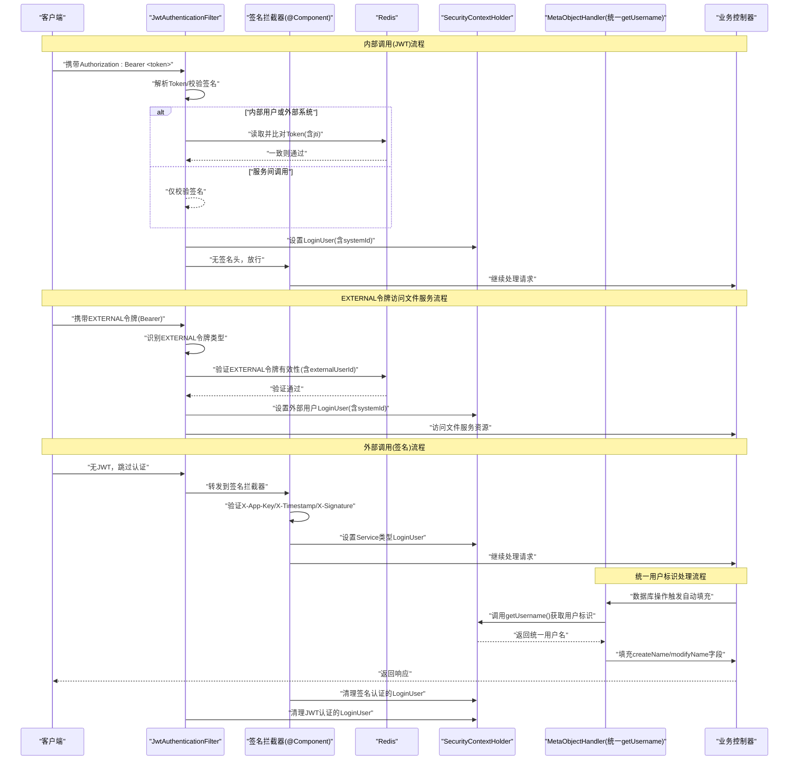

**图表来源**
- [JwtAuthenticationFilter.java:36-58](file://ele-ai-tender-system/ele-ai-tender-common/src/main/java/com/jy/eleaitender/common/security/JwtAuthenticationFilter.java#L36-L58)
- [JwtAuthenticationFilter.java:84-98](file://ele-ai-tender-system/ele-ai-tender-common/src/main/java/com/jy/eleaitender/common/security/JwtAuthenticationFilter.java#L84-L98)
- [WebConfig.java（file）:23-30](file://ele-ai-tender-system/ele-ai-tender-file/src/main/java/com/jy/eleaitender/file/config/WebConfig.java#L23-L30)
- [FileSignatureInterceptor.java:36-96](file://ele-ai-tender-system/ele-ai-tender-file/src/main/java/com/jy/eleaitender/file/config/FileSignatureInterceptor.java#L36-L96)
- [MetaObjectHandlerImpl.java（AI服务）:17-18](file://ele-ai-tender-system/ele-ai-tender-ai/src/main/java/com/jy/eleaitender/ai/handler/MetaObjectHandlerImpl.java#L17-L18)
- [MetaObjectHandlerImpl.java（支撑服务）:20-21](file://ele-ai-tender-system/ele-ai-tender-support/src/main/java/com/jy/eleaitender/support/handler/MetaObjectHandlerImpl.java#L20-L21)

## 详细组件分析

### JwtAuthenticationFilter 过滤器
- 功能要点
  - 排除路径跳过鉴权（可配置前缀列表）
  - 从请求头Authorization提取Bearer Token，或扩展为从请求参数提取（见文件服务变体）
  - 校验JWT签名有效性，按类型进行Redis一致性校验
  - 构建LoginUser并写入SecurityContextHolder，请求结束后清理
  - **重要更新**：完整支持EXTERNAL令牌类型的验证流程，包括jti会话键和兼容旧键，新增systemId字段处理
- 关键行为
  - 内部用户：根据userId在Redis中比对Token
  - 外部系统：根据appKey+userId+jti（兼容旧键）在Redis中比对Token，支持externalUserId和externalUserName
  - 服务间调用：仅校验签名，不查Redis
  - 角色加载：内部用户从Redis角色集合加载，便于数据隔离判断管理员
  - **重要更新**：EXTERNAL令牌类型支持，允许外部系统直接使用Bearer令牌访问受保护资源，包含完整的systemId和企业信息
  - **重要更新**：增强了外部令牌验证逻辑，支持更完善的Redis会话管理和角色加载

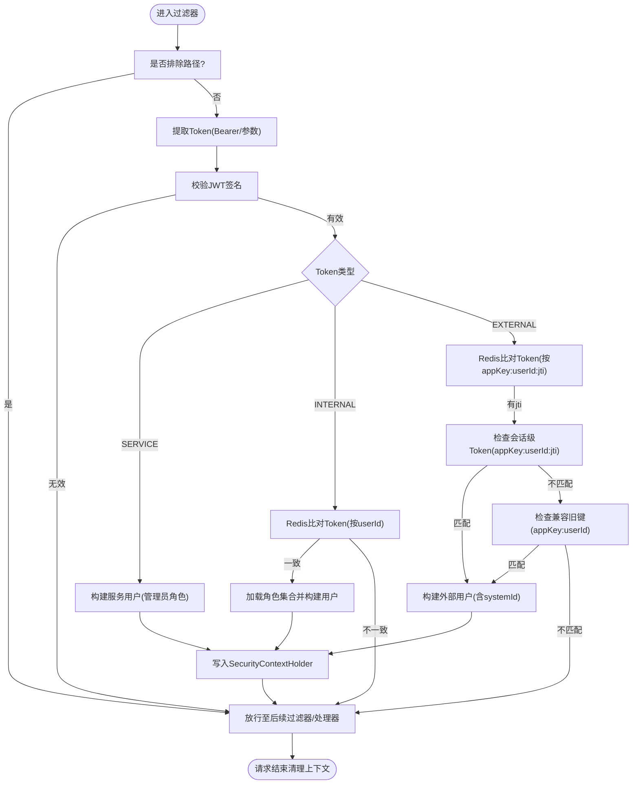

**图表来源**
- [JwtAuthenticationFilter.java:36-166](file://ele-ai-tender-system/ele-ai-tender-common/src/main/java/com/jy/eleaitender/common/security/JwtAuthenticationFilter.java#L36-L166)
- [JwtAuthenticationFilter.java:84-98](file://ele-ai-tender-system/ele-ai-tender-common/src/main/java/com/jy/eleaitender/common/security/JwtAuthenticationFilter.java#L84-L98)

**章节来源**
- [JwtAuthenticationFilter.java:36-166](file://ele-ai-tender-system/ele-ai-tender-common/src/main/java/com/jy/eleaitender/common/security/JwtAuthenticationFilter.java#L36-L166)

### SecurityContextHolder 与 LoginUser
- SecurityContextHolder
  - 基于ThreadLocal保存当前请求的登录主体
  - 提供便捷方法：getUserId/getUsername/getRealName/isAdmin/clear
  - **重要更新**：新增了getSystemId()方法用于获取系统标识，支持多租户数据隔离
  - **重要更新**：getUsername()方法成为标准的用户标识获取方式，确保跨模块一致性
- LoginUser
  - 统一承载内部用户、外部系统用户、服务间调用用户信息
  - 包含角色、权限、企业信息等字段，供业务层与数据隔离使用
  - **重要更新**：新增了systemId字段支持多租户场景
  - **重要更新**：增强了externalUserId和externalUserName字段，提供更完整的外部用户信息

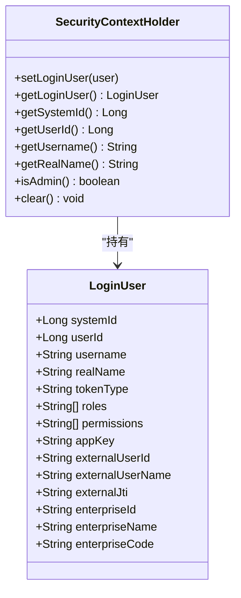

**图表来源**
- [SecurityContextHolder.java:1-46](file://ele-ai-tender-system/ele-ai-tender-common/src/main/java/com/jy/eleaitender/common/security/SecurityContextHolder.java#L1-L46)
- [LoginUser.java:1-40](file://ele-ai-tender-system/ele-ai-tender-common/src/main/java/com/jy/eleaitender/common/security/LoginUser.java#L1-L40)

**章节来源**
- [SecurityContextHolder.java:1-46](file://ele-ai-tender-system/ele-ai-tender-common/src/main/java/com/jy/eleaitender/common/security/SecurityContextHolder.java#L1-L46)
- [LoginUser.java:1-40](file://ele-ai-tender-system/ele-ai-tender-common/src/main/java/com/jy/eleaitender/common/security/LoginUser.java#L1-L40)

### RequireLogin 注解与 AOP 切面
- 注解定义：作用于方法或类级别，标记需要登录才能访问
- 切面实现：在目标方法执行前检查SecurityContextHolder中是否存在LoginUser，不存在则抛出未授权异常

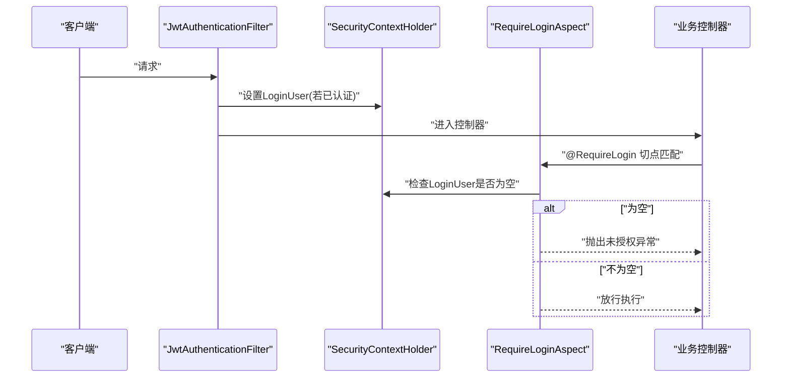

**图表来源**
- [RequireLogin.java:1-14](file://ele-ai-tender-system/ele-ai-tender-common/src/main/java/com/jy/eleaitender/common/security/annotation/RequireLogin.java#L1-L14)
- [RequireLoginAspect.java:15-21](file://ele-ai-tender-system/ele-ai-tender-common/src/main/java/com/jy/eleaitender/common/aspect/RequireLoginAspect.java#L15-L21)
- [SecurityContextHolder.java:10-21](file://ele-ai-tender-system/ele-ai-tender-common/src/main/java/com/jy/eleaitender/common/security/SecurityContextHolder.java#L10-L21)

**章节来源**
- [RequireLogin.java:1-14](file://ele-ai-tender-system/ele-ai-tender-common/src/main/java/com/jy/eleaitender/common/security/annotation/RequireLogin.java#L1-L14)
- [RequireLoginAspect.java:15-21](file://ele-ai-tender-system/ele-ai-tender-common/src/main/java/com/jy/eleaitender/common/aspect/RequireLoginAspect.java#L15-L21)

### 多租户系统标识支持（重要更新）
- **重要更新**：新增了systemId字段支持多租户场景
- SecurityContextHolder新增了getSystemId()方法用于获取系统标识
- LoginUser实体新增了systemId字段，支持系统级数据隔离
- JwtAuthenticationFilter在处理EXTERNAL令牌时会自动设置systemId
- 支持基于系统的权限控制和数据隔离策略
- 为多租户架构提供了基础的安全支持

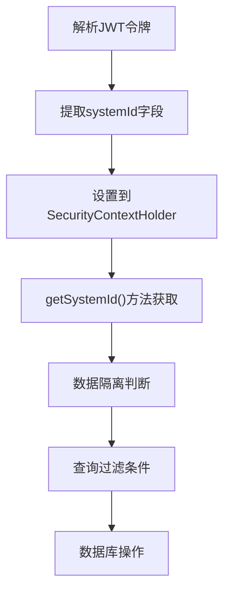

**图表来源**
- [SecurityContextHolder.java:17-21](file://ele-ai-tender-system/ele-ai-tender-common/src/main/java/com/jy/eleaitender/common/security/SecurityContextHolder.java#L17-L21)
- [LoginUser.java:12-13](file://ele-ai-tender-system/ele-ai-tender-common/src/main/java/com/jy/eleaitender/common/security/LoginUser.java#L12-L13)
- [JwtAuthenticationFilter.java:135-136](file://ele-ai-tender-system/ele-ai-tender-common/src/main/java/com/jy/eleaitender/common/security/JwtAuthenticationFilter.java#L135-L136)

**章节来源**
- [SecurityContextHolder.java:17-21](file://ele-ai-tender-system/ele-ai-tender-common/src/main/java/com/jy/eleaitender/common/security/SecurityContextHolder.java#L17-L21)
- [LoginUser.java:12-13](file://ele-ai-tender-system/ele-ai-tender-common/src/main/java/com/jy/eleaitender/common/security/LoginUser.java#L12-L13)
- [JwtAuthenticationFilter.java:135-136](file://ele-ai-tender-system/ele-ai-tender-common/src/main/java/com/jy/eleaitender/common/security/JwtAuthenticationFilter.java#L135-L136)

### 统一用户标识处理（重要更新）
- **重要更新**：所有MetaObjectHandler实现已统一使用getUsername()方法
- AI服务MetaObjectHandlerImpl：使用SecurityContextHolder.getUsername()获取用户名
- 核心服务MetaObjectHandlerImpl：使用SecurityContextHolder.getUsername()获取用户名  
- 文件服务MyBatisPlusConfig：使用SecurityContextHolder.getUsername()获取用户名
- 支撑服务MetaObjectHandlerImpl：使用SecurityContextHolder.getUsername()获取用户名
- 操作日志切面：统一使用getUsername()记录操作者信息
- 确保了跨模块用户标识的一致性和可追溯性
- **重要更新**：实现了从userName到username的标准化处理

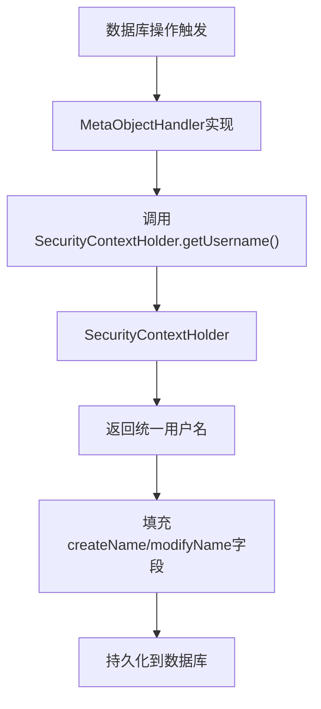

**图表来源**
- [MetaObjectHandlerImpl.java（AI服务）:17-18](file://ele-ai-tender-system/ele-ai-tender-ai/src/main/java/com/jy/eleaitender/ai/handler/MetaObjectHandlerImpl.java#L17-L18)
- [MetaObjectHandlerImpl.java（核心服务）:17-18](file://ele-ai-tender-system/ele-ai-tender-core/src/main/java/com/jy/eleaitender/core/handler/MetaObjectHandlerImpl.java#L17-L18)
- [MyBatisPlusConfig.java（文件服务）:33-34](file://ele-ai-tender-system/ele-ai-tender-file/src/main/java/com/jy/eleaitender/file/config/MyBatisPlusConfig.java#L33-L34)
- [MetaObjectHandlerImpl.java（支撑服务）:20-21](file://ele-ai-tender-system/ele-ai-tender-support/src/main/java/com/jy/eleaitender/support/handler/MetaObjectHandlerImpl.java#L20-L21)

**章节来源**
- [MetaObjectHandlerImpl.java（AI服务）:17-18](file://ele-ai-tender-system/ele-ai-tender-ai/src/main/java/com/jy/eleaitender/ai/handler/MetaObjectHandlerImpl.java#L17-L18)
- [MetaObjectHandlerImpl.java（核心服务）:17-18](file://ele-ai-tender-system/ele-ai-tender-core/src/main/java/com/jy/eleaitender/core/handler/MetaObjectHandlerImpl.java#L17-L18)
- [MyBatisPlusConfig.java（文件服务）:33-34](file://ele-ai-tender-system/ele-ai-tender-file/src/main/java/com/jy/eleaitender/file/config/MyBatisPlusConfig.java#L33-L34)
- [MetaObjectHandlerImpl.java（支撑服务）:20-21](file://ele-ai-tender-system/ele-ai-tender-support/src/main/java/com/jy/eleaitender/support/handler/MetaObjectHandlerImpl.java#L20-L21)

### 外部令牌生成增强（重要更新）
- **重要更新**：增强了外部令牌生成，支持更多字段
- JwtUtil.generateExternalToken方法新增了systemId参数
- 支持externalUserId和externalUserName字段传递
- 保留了原有的userName字段以保持向后兼容
- 增强了企业信息的传递能力
- 支持更完善的外部系统集成场景

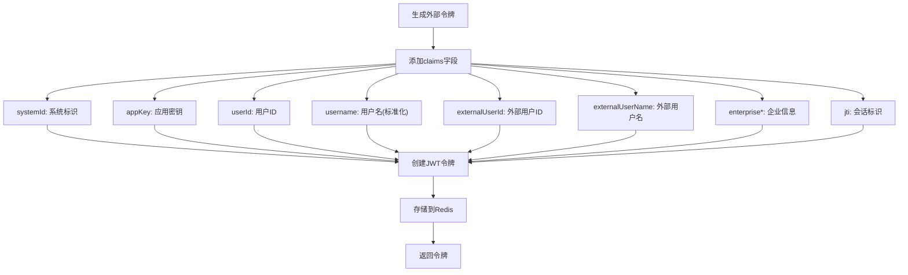

**图表来源**
- [JwtUtil.java:180-201](file://ele-ai-tender-system/ele-ai-tender-common/src/main/java/com/jy/eleaitender/common/util/JwtUtil.java#L180-L201)

**章节来源**
- [JwtUtil.java:180-201](file://ele-ai-tender-system/ele-ai-tender-common/src/main/java/com/jy/eleaitender/common/util/JwtUtil.java#L180-L201)

### 文件服务多令牌类型支持（重要更新）
- **重要更新**：文件服务Web配置现已支持EXTERNAL令牌类型
- 文件服务JwtAuthenticationFilter配置接受三种令牌类型：EXTERNAL、INTERNAL、SERVICE
- 外部系统可以直接使用Bearer令牌访问文件服务资源，无需额外的签名验证
- 提供了更灵活的外部系统集成方案，支持多种认证方式并存
- **重要更新**：增强了EXTERNAL令牌的验证逻辑，支持systemId和外部用户信息

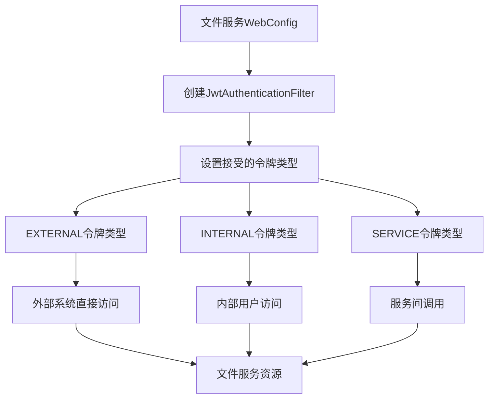

**图表来源**
- [WebConfig.java（file）:23-30](file://ele-ai-tender-system/ele-ai-tender-file/src/main/java/com/jy/eleaitender/file/config/WebConfig.java#L23-L30)
- [CommonConstant.java:28-38](file://ele-ai-tender-system/ele-ai-tender-common/src/main/java/com/jy/eleaitender/common/constant/CommonConstant.java#L28-L38)

**章节来源**
- [WebConfig.java（file）:23-30](file://ele-ai-tender-system/ele-ai-tender-file/src/main/java/com/jy/eleaitender/file/config/WebConfig.java#L23-L30)
- [CommonConstant.java:28-38](file://ele-ai-tender-system/ele-ai-tender-common/src/main/java/com/jy/eleaitender/common/constant/CommonConstant.java#L28-L38)

### 签名验证拦截器（组件化注册）
- **更新**：ExternalSignatureInterceptor：外部API签名验证拦截器
  - 通过@Component注解自动注册，无需手动配置
  - 拦截 /api/external/ai-tasks/** 路径
  - 验证 X-App-Key/X-Timestamp/X-Signature 三个请求头
  - 校验接入系统状态、有效期和签名
  - **新增**：escapeJson方法防止JSON注入攻击
  
- **更新**：FileSignatureInterceptor：文件服务签名验证拦截器
  - 通过@Component注解自动注册，在WebConfig中通过addInterceptors方法注册路径
  - 条件触发：有签名头时验签并设置LoginUser，无签名头时放行由JWT处理
  - 支持JWT和签名认证混合模式
  - **新增**：智能会话清理逻辑，仅清除签名认证设置的LoginUser
  - **新增**：escapeJson方法防止JSON注入攻击

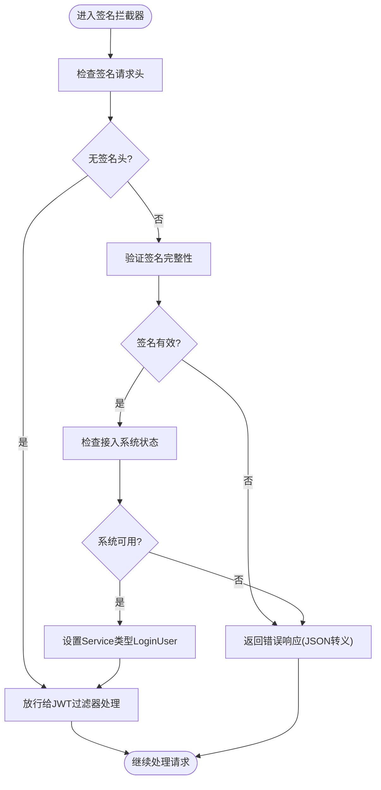

**图表来源**
- [ExternalSignatureInterceptor.java:21-73](file://ele-ai-tender-system/ele-ai-tender-core/src/main/java/com/jy/eleaitender/core/config/ExternalSignatureInterceptor.java#L21-L73)
- [FileSignatureInterceptor.java:28-96](file://ele-ai-tender-system/ele-ai-tender-file/src/main/java/com/jy/eleaitender/file/config/FileSignatureInterceptor.java#L28-L96)

**章节来源**
- [ExternalSignatureInterceptor.java:21-73](file://ele-ai-tender-system/ele-ai-tender-core/src/main/java/com/jy/eleaitender/core/config/ExternalSignatureInterceptor.java#L21-L73)
- [FileSignatureInterceptor.java:28-96](file://ele-ai-tender-system/ele-ai-tender-file/src/main/java/com/jy/eleaitender/file/config/FileSignatureInterceptor.java#L28-L96)

### RequestParamJwtAuthenticationFilter 专用过滤器
- **新增**：文件服务专用的请求参数Token提取过滤器
- 继承自JwtAuthenticationFilter，重写getTokenFromRequest方法
- 从请求参数中提取Token而非请求头，避免影响全局Bearer语义
- 适用于特定的文件下载或预览场景

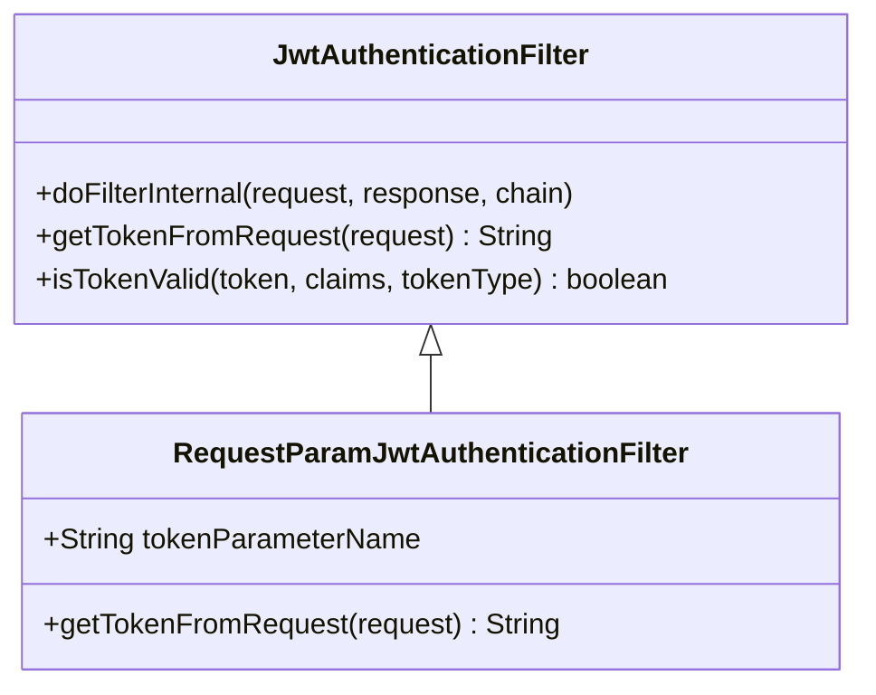

**图表来源**
- [RequestParamJwtAuthenticationFilter.java:14-31](file://ele-ai-tender-system/ele-ai-tender-file/src/main/java/com/jy/eleaitender/file/security/RequestParamJwtAuthenticationFilter.java#L14-L31)

**章节来源**
- [RequestParamJwtAuthenticationFilter.java:14-31](file://ele-ai-tender-system/ele-ai-tender-file/src/main/java/com/jy/eleaitender/file/security/RequestParamJwtAuthenticationFilter.java#L14-L31)

### JSON转义安全增强（新增）
- escapeJson方法：统一的JSON字符串转义处理
  - 防止JSON注入攻击
  - 转义特殊字符：反斜杠、双引号、换行符、回车符
  - 应用于所有错误响应的消息字段
  - 提升系统安全性，避免恶意输入导致的JSON格式破坏

```mermaid
flowchart TD
Input["原始消息文本"] --> Escape["escapeJson处理"]
Escape --> ReplaceBackslash["替换反斜杠 \\\\"]
ReplaceBackslash --> ReplaceQuote["替换双引号 \\\""]
ReplaceQuote --> ReplaceNewline["替换换行符 \\n"]
ReplaceNewline --> ReplaceCarriage["替换回车符 \\r"]
ReplaceCarriage --> Output["安全的JSON字符串"]
```

**图表来源**
- [ExternalSignatureInterceptor.java:88-93](file://ele-ai-tender-system/ele-ai-tender-core/src/main/java/com/jy/eleaitender/core/config/ExternalSignatureInterceptor.java#L88-L93)
- [FileSignatureInterceptor.java:119-124](file://ele-ai-tender-system/ele-ai-tender-file/src/main/java/com/jy/eleaitender/file/config/FileSignatureInterceptor.java#L119-L124)

**章节来源**
- [ExternalSignatureInterceptor.java:88-93](file://ele-ai-tender-system/ele-ai-tender-core/src/main/java/com/jy/eleaitender/core/config/ExternalSignatureInterceptor.java#L88-L93)
- [FileSignatureInterceptor.java:119-124](file://ele-ai-tender-system/ele-ai-tender-file/src/main/java/com/jy/eleaitender/file/config/FileSignatureInterceptor.java#L119-L124)

### JWT 工具与 Token 生命周期
- 生成
  - 内部用户Token：包含userId、username、type=internal
  - 外部系统Token：包含systemId、appKey、userId、username、externalUserId、externalUserName、enterprise*、type=external，并附带jti
  - 服务间调用Token：type=service，serviceName作为身份标识
- 校验
  - 统一签名校验；内部/外部需与Redis中存储的Token一致；服务间仅校验签名
  - **重要更新**：EXTERNAL令牌类型支持完整的Redis一致性校验，包括jti会话键和兼容旧键，支持systemId和外部用户信息
- 过期与刷新
  - 提供"即将过期"判断工具，可用于前端主动刷新或后端自动续期策略
- 配置
  - 运行时密钥与过期时间可通过配置注入，默认值提供兜底
  - **新增**：文件服务独立的JWT运行时配置，确保与签发服务使用同一套密钥

```mermaid
flowchart TD
Gen["生成Token(JWT)"] --> Store["写入Redis(内部/外部)"]
Store --> Use["请求携带Token"]
Use --> Verify["过滤器校验签名+Redis一致性"]
Verify --> |通过| BuildUser["构建LoginUser并放入上下文"]
Verify --> |失败| Deny["拒绝访问"]
Use --> Refresh["检测即将过期(可选刷新)"]
Refresh --> Reissue["重新签发并更新Redis"]
Note: EXTERNAL令牌支持jti会话键、systemId和外部用户信息
```

**图表来源**
- [JwtUtil.java:79-189](file://ele-ai-tender-system/ele-ai-tender-common/src/main/java/com/jy/eleaitender/common/util/JwtUtil.java#L79-L189)
- [JwtUtil.java:273-309](file://ele-ai-tender-system/ele-ai-tender-common/src/main/java/com/jy/eleaitender/common/util/JwtUtil.java#L273-L309)
- [JwtAuthenticationFilter.java:72-101](file://ele-ai-tender-system/ele-ai-tender-common/src/main/java/com/jy/eleaitender/common/security/JwtAuthenticationFilter.java#L72-L101)
- [JwtRuntimeConfig.java（file）:16-24](file://ele-ai-tender-system/ele-ai-tender-file/src/main/java/com/jy/eleaitender/file/config/JwtRuntimeConfig.java#L16-L24)

**章节来源**
- [JwtUtil.java:79-189](file://ele-ai-tender-system/ele-ai-tender-common/src/main/java/com/jy/eleaitender/common/util/JwtUtil.java#L79-L189)
- [JwtUtil.java:273-309](file://ele-ai-tender-system/ele-ai-tender-common/src/main/java/com/jy/eleaitender/common/util/JwtUtil.java#L273-L309)
- [JwtAuthenticationFilter.java:72-101](file://ele-ai-tender-system/ele-ai-tender-common/src/main/java/com/jy/eleaitender/common/security/JwtAuthenticationFilter.java#L72-L101)
- [JwtRuntimeConfig.java（file）:16-24](file://ele-ai-tender-system/ele-ai-tender-file/src/main/java/com/jy/eleaitender/file/config/JwtRuntimeConfig.java#L16-L24)

### 认证流程与用户会话管理
- 登录
  - 前端获取RSA公钥，使用公钥加密密码后提交
  - 后端解密密码，校验用户状态，生成Token并写入Redis，同时缓存权限与角色
- 登出
  - 删除Redis中的Token、权限、角色缓存
- 外部系统Token
  - 校验接入系统状态与有效期，签发外部Token并写入Redis（支持带jti的会话级键）
  - **重要更新**：外部令牌现在包含systemId、externalUserId、externalUserName等丰富信息
- **重要更新**：混合认证模式
  - 文件服务支持JWT和签名认证混合模式
  - 内部调用使用JWT，外部调用可使用签名验证或直接使用EXTERNAL令牌
  - 智能会话清理，避免冲突
  - 拦截器通过@Component注解自动注册，提高可维护性

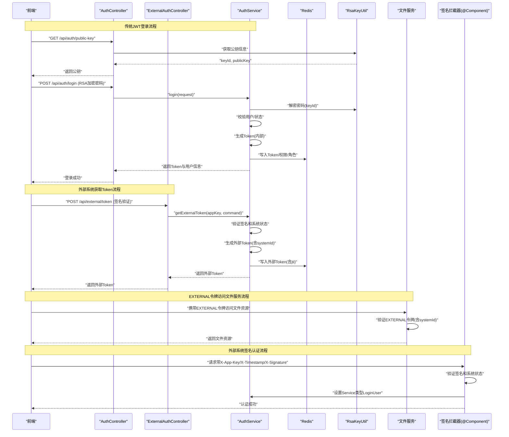

**图表来源**
- [AuthController.java:48-91](file://ele-ai-tender-system/ele-ai-tender-support/src/main/java/com/jy/eleaitender/support/controller/AuthController.java#L48-L91)
- [ExternalAuthController.java:42-73](file://ele-ai-tender-system/ele-ai-tender-support/src/main/java/com/jy/eleaitender/support/controller/ExternalAuthController.java#L42-L73)
- [FileSignatureInterceptor.java:87-96](file://ele-ai-tender-system/ele-ai-tender-file/src/main/java/com/jy/eleaitender/file/config/FileSignatureInterceptor.java#L87-L96)
- [WebConfig.java（file）:23-30](file://ele-ai-tender-system/ele-ai-tender-file/src/main/java/com/jy/eleaitender/file/config/WebConfig.java#L23-L30)

**章节来源**
- [AuthController.java:48-91](file://ele-ai-tender-system/ele-ai-tender-support/src/main/java/com/jy/eleaitender/support/controller/AuthController.java#L48-L91)
- [ExternalAuthController.java:42-73](file://ele-ai-tender-system/ele-ai-tender-support/src/main/java/com/jy/eleaitender/support/controller/ExternalAuthController.java#L42-L73)
- [FileSignatureInterceptor.java:87-96](file://ele-ai-tender-system/ele-ai-tender-file/src/main/java/com/jy/eleaitender/file/config/FileSignatureInterceptor.java#L87-L96)

### 权限控制策略
- 角色与权限缓存
  - 登录成功后将用户权限与角色写入Redis，并在过滤器中按需加载角色集合
- 数据隔离
  - 过滤器将服务间调用视为管理员，不受数据隔离限制；内部用户根据角色判断是否管理员
  - **重要更新**：EXTERNAL令牌用户具有完整的外部用户信息，包括企业名称、企业编码等，支持systemId进行系统级数据隔离
- 声明式鉴权
  - 使用@RequireLogin确保受保护接口必须登录
- **更新**：签名认证权限控制
  - 签名认证的用户被设置为Service类型，拥有管理员权限
  - 适用于外部系统集成场景
  - 拦截器通过组件化注册，简化配置管理

**章节来源**
- [JwtAuthenticationFilter.java:103-136](file://ele-ai-tender-system/ele-ai-tender-common/src/main/java/com/jy/eleaitender/common/security/JwtAuthenticationFilter.java#L103-L136)
- [FileSignatureInterceptor.java:87-93](file://ele-ai-tender-system/ele-ai-tender-file/src/main/java/com/jy/eleaitender/file/config/FileSignatureInterceptor.java#L87-93)
- [RequireLoginAspect.java:15-21](file://ele-ai-tender-system/ele-ai-tender-common/src/main/java/com/jy/eleaitender/common/aspect/RequireLoginAspect.java#L15-L21)

### 密码加密存储与RSA密钥管理
- 传输加密
  - 前端通过RSA公钥加密敏感信息（如密码），后端使用对应私钥解密
- 存储加密
  - 后端使用密码工具对明文进行不可逆编码后存储
- 密钥轮换
  - 启动时生成新的RSA密钥对，支持定时轮换；解密时校验keyId，避免使用过期密钥

**章节来源**
- [AuthController.java:48-52](file://ele-ai-tender-system/ele-ai-tender-support/src/main/java/com/jy/eleaitender/support/controller/AuthController.java#L48-L52)

### 会话清理逻辑改进（新增）
- FileSignatureInterceptor.afterCompletion方法
  - 智能识别签名认证设置的LoginUser
  - 仅清除签名认证相关的上下文，不影响JWT认证
  - 通过request.getAttribute("signatureAuthenticated")标记区分认证方式
- 避免上下文污染
  - 防止签名认证和JWT认证之间的相互影响
  - 提高系统的稳定性和可靠性

**章节来源**
- [FileSignatureInterceptor.java:98-104](file://ele-ai-tender-system/ele-ai-tender-file/src/main/java/com/jy/eleaitender/file/config/FileSignatureInterceptor.java#L98-L104)

## 依赖关系分析
- 过滤器依赖
  - JwtAuthenticationFilter依赖JwtUtil进行签名校验，依赖Redis进行Token一致性校验，依赖SecurityContextHolder写入上下文
  - **重要更新**：文件服务过滤器现在支持完整的EXTERNAL令牌类型验证，包含systemId和外部用户信息
- 控制器与服务
  - AuthController暴露认证相关API，涉及Redis缓存与RSA解密
  - **新增**：ExternalAuthController提供外部系统认证接口，支持外部令牌生成
- Web配置
  - support与ai模块均注册JwtAuthenticationFilter，覆盖/api/*路径；file模块提供混合认证模式和多令牌类型支持
  - **重要更新**：文件服务Web配置明确支持EXTERNAL、INTERNAL、SERVICE三种令牌类型
- **更新**：签名拦截器依赖
  - ExternalSignatureInterceptor和FileSignatureInterceptor通过@Component注解自动注册
  - FileSignatureInterceptor在WebConfig中通过addInterceptors方法注册路径
  - 都使用统一的escapeJson方法进行安全处理
- **重要更新**：MetaObjectHandler依赖
  - 所有MetaObjectHandler实现统一依赖SecurityContextHolder.getUsername()方法
  - 确保用户标识在各模块间的一致性

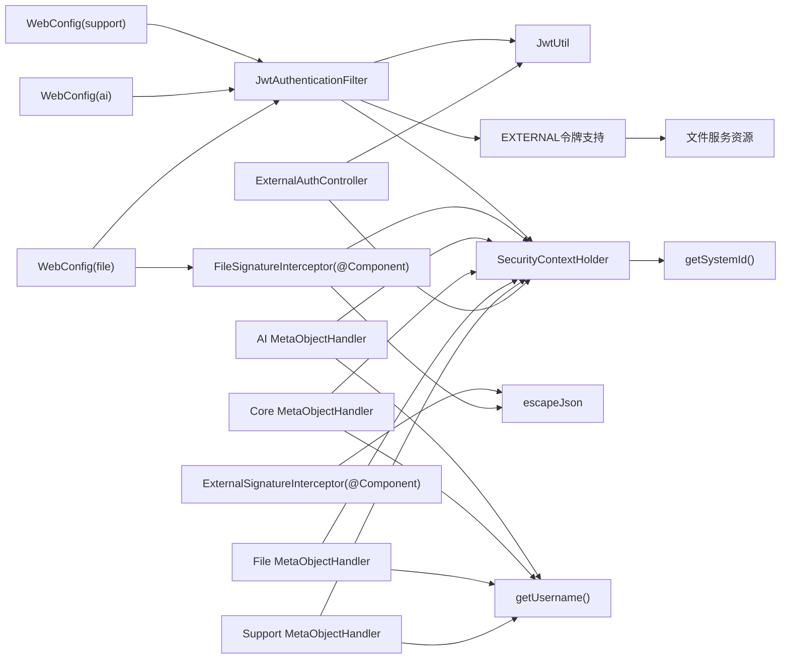

**图表来源**
- [WebConfig.java（file）:23-30](file://ele-ai-tender-system/ele-ai-tender-file/src/main/java/com/jy/eleaitender/file/config/WebConfig.java#L23-L30)
- [ExternalSignatureInterceptor.java:21](file://ele-ai-tender-system/ele-ai-tender-core/src/main/java/com/jy/eleaitender/core/config/ExternalSignatureInterceptor.java#L21)
- [FileSignatureInterceptor.java:28](file://ele-ai-tender-system/ele-ai-tender-file/src/main/java/com/jy/eleaitender/file/config/FileSignatureInterceptor.java#L28)
- [MetaObjectHandlerImpl.java（AI服务）:17-18](file://ele-ai-tender-system/ele-ai-tender-ai/src/main/java/com/jy/eleaitender/ai/handler/MetaObjectHandlerImpl.java#L17-L18)
- [MetaObjectHandlerImpl.java（核心服务）:17-18](file://ele-ai-tender-system/ele-ai-tender-core/src/main/java/com/jy/eleaitender/core/handler/MetaObjectHandlerImpl.java#L17-L18)
- [MyBatisPlusConfig.java（文件服务）:33-34](file://ele-ai-tender-system/ele-ai-tender-file/src/main/java/com/jy/eleaitender/file/config/MyBatisPlusConfig.java#L33-L34)
- [MetaObjectHandlerImpl.java（支撑服务）:20-21](file://ele-ai-tender-system/ele-ai-tender-support/src/main/java/com/jy/eleaitender/support/handler/MetaObjectHandlerImpl.java#L20-L21)
- [ExternalAuthController.java:42-73](file://ele-ai-tender-system/ele-ai-tender-support/src/main/java/com/jy/eleaitender/support/controller/ExternalAuthController.java#L42-L73)

**章节来源**
- [WebConfig.java（file）:23-30](file://ele-ai-tender-system/ele-ai-tender-file/src/main/java/com/jy/eleaitender/file/config/WebConfig.java#L23-L30)
- [ExternalSignatureInterceptor.java:21](file://ele-ai-tender-system/ele-ai-tender-core/src/main/java/com/jy/eleaitender/core/config/ExternalSignatureInterceptor.java#L21)
- [FileSignatureInterceptor.java:28](file://ele-ai-tender-system/ele-ai-tender-file/src/main/java/com/jy/eleaitender/file/config/FileSignatureInterceptor.java#L28)
- [MetaObjectHandlerImpl.java（AI服务）:17-18](file://ele-ai-tender-system/ele-ai-tender-ai/src/main/java/com/jy/eleaitender/ai/handler/MetaObjectHandlerImpl.java#L17-L18)
- [MetaObjectHandlerImpl.java（核心服务）:17-18](file://ele-ai-tender-system/ele-ai-tender-core/src/main/java/com/jy/eleaitender/core/handler/MetaObjectHandlerImpl.java#L17-L18)
- [MyBatisPlusConfig.java（文件服务）:33-34](file://ele-ai-tender-system/ele-ai-tender-file/src/main/java/com/jy/eleaitender/file/config/MyBatisPlusConfig.java#L33-L34)
- [MetaObjectHandlerImpl.java（支撑服务）:20-21](file://ele-ai-tender-system/ele-ai-tender-support/src/main/java/com/jy/eleaitender/support/handler/MetaObjectHandlerImpl.java#L20-L21)
- [ExternalAuthController.java:42-73](file://ele-ai-tender-system/ele-ai-tender-support/src/main/java/com/jy/eleaitender/support/controller/ExternalAuthController.java#L42-L73)

## 性能与安全考量
- 性能
  - 过滤器仅在必要时访问Redis，且角色/权限缓存减少重复查询
  - 服务间调用Token跳过Redis校验，降低跨服务调用开销
  - 签名拦截器快速失败，减少不必要的数据库查询
  - **更新**：组件化注册减少了配置复杂度，提高了启动效率
  - **重要更新**：EXTERNAL令牌类型支持高效的Redis会话验证，支持jti键优化
  - **重要更新**：统一的用户标识获取方法减少了方法调用的复杂性
  - **重要更新**：systemId字段支持高效的多租户数据隔离
- 安全
  - 所有敏感传输采用RSA公钥加密，后端解密后再做不可逆编码存储
  - Token与Redis一致性校验防止重放与篡改
  - 外部系统Token支持jti会话级键，增强会话管理能力
  - **重要更新**：EXTERNAL令牌类型提供完整的企业信息和安全上下文，支持systemId进行系统级隔离
  - **新增**：JSON转义防止注入攻击，提升错误响应安全性
  - **新增**：智能会话清理避免上下文污染
  - **重要更新**：统一的用户标识方法增强了审计追踪的一致性
  - **重要更新**：systemId字段支持多租户环境下的数据安全隔离
  - 建议启用HTTPS、最小化Token载荷、定期轮换密钥

## 故障排查指南
- 常见错误
  - 未携带或非法Token：过滤器无法解析或签名校验失败
  - Token不一致：Redis中存储的Token与请求不一致（可能被登出或刷新）
  - RSA解密失败：keyId不匹配或公钥版本不一致，需前端重新获取公钥
  - 未登录访问：未加@RequireLogin或过滤器未正确设置上下文
  - **重要更新**：EXTERNAL令牌访问失败：检查文件服务过滤器是否正确配置接受EXTERNAL令牌类型，确认systemId字段是否正确传递
  - **新增**：签名验证失败：检查X-App-Key/X-Timestamp/X-Signature请求头是否正确
  - **新增**：JSON转义问题：检查错误响应消息是否包含特殊字符
  - **更新**：拦截器未生效：检查@Component注解是否正确添加，包扫描路径是否包含拦截器所在包
  - **重要更新**：用户标识不一致：检查各模块是否统一使用getUsername()方法
  - **重要更新**：多租户数据隔离问题：检查systemId字段是否正确设置和传递
- 定位步骤
  - 检查过滤器是否命中/api/*路径，排除路径是否正确
  - 核对Redis中Token键是否存在且与请求一致
  - 确认RSA公钥获取与前端加密流程一致
  - 查看日志中关于角色加载、Redis访问、RSA解密的警告/错误
  - **重要更新**：检查文件服务Web配置中的令牌类型设置，确保包含EXTERNAL类型
  - **新增**：检查签名拦截器的接入系统状态和有效期配置
  - **新增**：验证JSON转义方法的正确性，确保特殊字符被正确转义
  - **更新**：确认拦截器组件已被Spring容器正确扫描和注册
  - **重要更新**：检查所有MetaObjectHandler实现是否统一使用getUsername()方法
  - **重要更新**：检查systemId字段在多租户环境下的正确性

**章节来源**
- [JwtAuthenticationFilter.java:60-101](file://ele-ai-tender-system/ele-ai-tender-common/src/main/java/com/jy/eleaitender/common/security/JwtAuthenticationFilter.java#L60-L101)
- [WebConfig.java（file）:23-30](file://ele-ai-tender-system/ele-ai-tender-file/src/main/java/com/jy/eleaitender/file/config/WebConfig.java#L23-L30)
- [ExternalSignatureInterceptor.java:47-70](file://ele-ai-tender-system/ele-ai-tender-core/src/main/java/com/jy/eleaitender/core/config/ExternalSignatureInterceptor.java#L47-L70)
- [FileSignatureInterceptor.java:62-85](file://ele-ai-tender-system/ele-ai-tender-file/src/main/java/com/jy/eleaitender/file/config/FileSignatureInterceptor.java#L62-85)
- [MetaObjectHandlerImpl.java（AI服务）:17-18](file://ele-ai-tender-system/ele-ai-tender-ai/src/main/java/com/jy/eleaitender/ai/handler/MetaObjectHandlerImpl.java#L17-L18)
- [MetaObjectHandlerImpl.java（支撑服务）:20-21](file://ele-ai-tender-system/ele-ai-tender-support/src/main/java/com/jy/eleaitender/support/handler/MetaObjectHandlerImpl.java#L20-L21)

## 结论
本模块以JWT为核心，结合Redis实现无状态但可控的认证体系，并通过AOP与注解简化鉴权开发。RSA公钥加密传输与密钥轮换保障敏感数据安全，角色与权限缓存提升性能与可扩展性。**重要更新**：系统现已支持多租户场景，通过systemId字段实现系统级数据隔离，大大增强了系统的扩展性和安全性。**重要更新**：外部令牌生成得到了显著增强，支持systemId、externalUserId、externalUserName等丰富字段，为外部系统集成提供了更强大的支持。**重要更新**：统一了用户标识处理，将所有MetaObjectHandler实现和操作日志切面统一使用getUsername()方法，确保了跨模块的用户标识一致性。**更新的组件化注册方式使ExternalSignatureInterceptor和FileSignatureInterceptor通过@Component注解自动注册，简化了配置管理，提高了代码的可维护性**。新增的签名验证拦截器提供了灵活的外部系统集成方案，JSON转义安全增强提升了系统的整体安全性，智能会话清理逻辑避免了上下文污染问题。**最重要的更新是增强了多租户支持和外部系统集成能力，通过systemId字段和增强的外部令牌结构，为系统的企业级应用奠定了坚实的基础**。建议在部署中严格配置密钥、开启HTTPS、完善监控与审计，持续优化用户体验与安全基线。

## 附录：配置与最佳实践
- 过滤器注册
  - 在support与ai模块中注册JwtAuthenticationFilter，覆盖/api/*路径
  - 如需从请求参数获取Token，可使用RequestParamJwtAuthenticationFilter变体
  - **重要更新**：在file模块中，JwtAuthenticationFilter已配置接受EXTERNAL、INTERNAL、SERVICE三种令牌类型
  - **更新**：在file模块中，FileSignatureInterceptor通过@Component注解自动注册，在WebConfig中通过addInterceptors方法注册路径
  - **更新**：ExternalSignatureInterceptor通过@Component注解自动注册，无需额外配置
- 安全配置建议
  - 使用强随机密钥，长度满足HMAC-SHA要求
  - 合理设置Token过期时间，配合前端刷新策略
  - 对外部系统Token启用jti会话键，便于细粒度撤销
  - 定期轮换RSA密钥，前端每次登录或敏感操作前获取最新公钥
  - **重要更新**：确保文件服务Web配置中包含EXTERNAL令牌类型支持
  - **重要更新**：在多租户环境中正确配置systemId字段的数据隔离策略
  - **更新**：确保拦截器所在包被Spring Boot自动扫描
  - **新增**：配置接入系统的状态管理和有效期控制
  - **新增**：确保所有错误响应都使用escapeJson方法进行安全处理
  - **重要更新**：确保所有MetaObjectHandler实现统一使用getUsername()方法获取用户标识
- 常见问题解决
  - 跨域问题：确保CORS配置允许必要来源与方法
  - 权限缺失：检查登录时是否正确缓存权限与角色
  - 登出不生效：确认登出接口是否被@RequireLogin保护且Redis键正确删除
  - **重要更新**：EXTERNAL令牌访问失败：检查文件服务过滤器配置和令牌类型设置，确认systemId字段正确传递
  - **重要更新**：多租户数据隔离问题：检查systemId字段在各模块间的正确性
  - **更新**：拦截器未生效：检查@Component注解和包扫描配置
  - **新增**：签名验证失败：检查接入系统配置和签名算法一致性
  - **新增**：会话污染问题：确认afterCompletion方法正确清理上下文
  - **重要更新**：用户标识不一致：检查各模块MetaObjectHandler实现是否统一使用getUsername()方法

**章节来源**
- [WebConfig.java（file）:23-30](file://ele-ai-tender-system/ele-ai-tender-file/src/main/java/com/jy/eleaitender/file/config/WebConfig.java#L23-L30)
- [ExternalSignatureInterceptor.java:21](file://ele-ai-tender-system/ele-ai-tender-core/src/main/java/com/jy/eleaitender/core/config/ExternalSignatureInterceptor.java#L21)
- [FileSignatureInterceptor.java:28](file://ele-ai-tender-system/ele-ai-tender-file/src/main/java/com/jy/eleaitender/file/config/FileSignatureInterceptor.java#L28)
- [FileSignatureInterceptor.java:98-104](file://ele-ai-tender-system/ele-ai-tender-file/src/main/java/com/jy/eleaitender/file/config/FileSignatureInterceptor.java#L98-L104)
- [ExternalSignatureInterceptor.java:88-93](file://ele-ai-tender-system/ele-ai-tender-core/src/main/java/com/jy/eleaitender/core/config/ExternalSignatureInterceptor.java#L88-L93)
- [MetaObjectHandlerImpl.java（AI服务）:17-18](file://ele-ai-tender-system/ele-ai-tender-ai/src/main/java/com/jy/eleaitender/ai/handler/MetaObjectHandlerImpl.java#L17-L18)
- [MetaObjectHandlerImpl.java（支撑服务）:20-21](file://ele-ai-tender-system/ele-ai-tender-support/src/main/java/com/jy/eleaitender/support/handler/MetaObjectHandlerImpl.java#L20-L21)