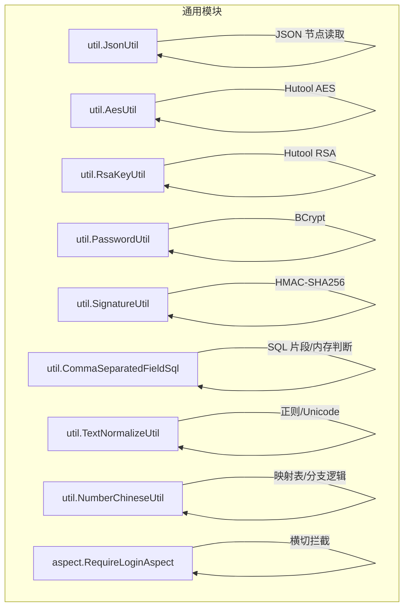
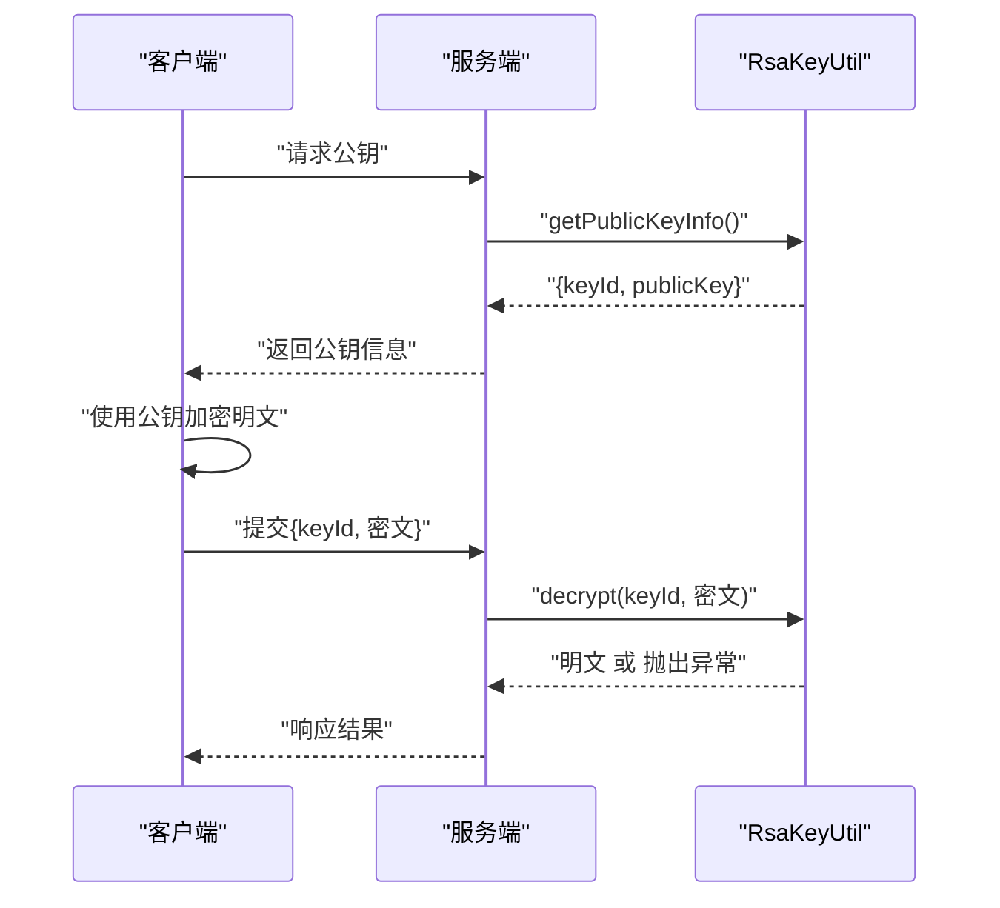
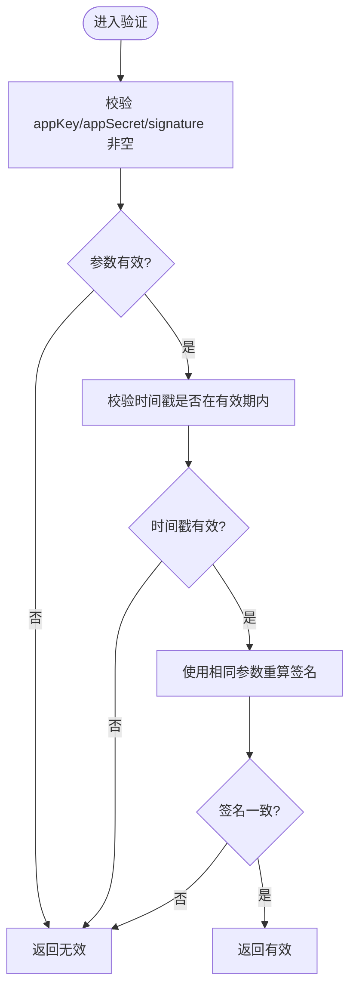
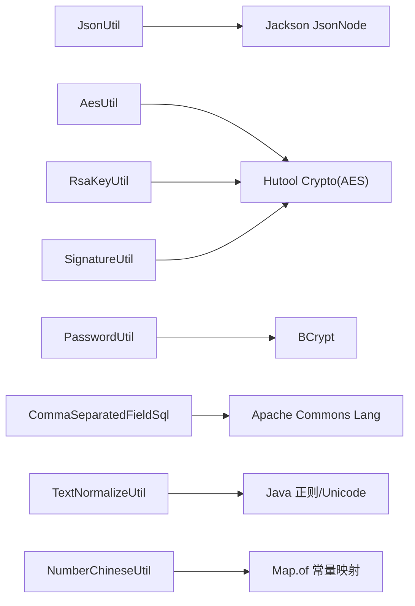

# 工具类与辅助函数

<cite>
**本文引用的文件**   
- [JsonUtil.java](file://ele-ai-tender-system/ele-ai-tender-common/src/main/java/com/jy/eleaitender/common/util/JsonUtil.java)
- [AesUtil.java](file://ele-ai-tender-system/ele-ai-tender-common/src/main/java/com/jy/eleaitender/common/util/AesUtil.java)
- [RsaKeyUtil.java](file://ele-ai-tender-system/ele-ai-tender-common/src/main/java/com/jy/eleaitender/common/util/RsaKeyUtil.java)
- [PasswordUtil.java](file://ele-ai-tender-system/ele-ai-tender-common/src/main/java/com/jy/eleaitender/common/util/PasswordUtil.java)
- [SignatureUtil.java](file://ele-ai-tender-system/ele-ai-tender-common/src/main/java/com/jy/eleaitender/common/util/SignatureUtil.java)
- [CommaSeparatedFieldSql.java](file://ele-ai-tender-system/ele-ai-tender-common/src/main/java/com/jy/eleaitender/common/util/CommaSeparatedFieldSql.java)
- [TextNormalizeUtil.java](file://ele-ai-tender-system/ele-ai-tender-common/src/main/java/com/jy/eleaitender/common/util/TextNormalizeUtil.java)
- [NumberChineseUtil.java](file://ele-ai-tender-system/ele-ai-tender-common/src/main/java/com/jy/eleaitender/common/util/NumberChineseUtil.java)
- [RequireLoginAspect.java](file://ele-ai-tender-system/ele-ai-tender-common/src/main/java/com/jy/eleaitender/common/aspect/RequireLoginAspect.java)
- [CommaSeparatedFieldSqlTest.java](file://ele-ai-tender-system/ele-ai-tender-common/src/test/java/com/jy/eleaitender/common/util/CommaSeparatedFieldSqlTest.java)
</cite>

## 目录
1. [简介](#简介)
2. [项目结构](#项目结构)
3. [核心组件](#核心组件)
4. [架构总览](#架构总览)
5. [详细组件分析](#详细组件分析)
6. [依赖分析](#依赖分析)
7. [性能考虑](#性能考虑)
8. [故障排查指南](#故障排查指南)
9. [结论](#结论)
10. [附录：使用示例与扩展指南](#附录使用示例与扩展指南)

## 简介
本文件聚焦于后端通用模块中的工具类与辅助函数，覆盖以下能力：
- JSON 解析与字段安全读取（JsonUtil）
- 对称加密与脱敏（AesUtil）
- RSA 密钥管理与密码解密（RsaKeyUtil）
- 密码哈希与校验、随机密码生成（PasswordUtil）
- 请求签名与时间戳校验（SignatureUtil）
- 逗号分隔字段 SQL 匹配与内存判断（CommaSeparatedFieldSql）
- 文本规范化与空白字符识别（TextNormalizeUtil）
- 数字与中文互转（NumberChineseUtil）
- AOP 登录检查切面（RequireLoginAspect）

文档同时给出线程安全性说明、性能建议、测试要点以及扩展开发指南。

## 项目结构
工具类集中于通用模块的 util 包中，面向多服务复用；AOP 切面位于 common 模块的 aspect 包，提供横切关注点能力。

图表来源
- [JsonUtil.java:1-54](file://ele-ai-tender-system/ele-ai-tender-common/src/main/java/com/jy/eleaitender/common/util/JsonUtil.java#L1-L54)
- [AesUtil.java:1-107](file://ele-ai-tender-system/ele-ai-tender-common/src/main/java/com/jy/eleaitender/common/util/AesUtil.java#L1-L107)
- [RsaKeyUtil.java:1-96](file://ele-ai-tender-system/ele-ai-tender-common/src/main/java/com/jy/eleaitender/common/util/RsaKeyUtil.java#L1-L96)
- [PasswordUtil.java:1-62](file://ele-ai-tender-system/ele-ai-tender-common/src/main/java/com/jy/eleaitender/common/util/PasswordUtil.java#L1-L62)
- [SignatureUtil.java:1-116](file://ele-ai-tender-system/ele-ai-tender-common/src/main/java/com/jy/eleaitender/common/util/SignatureUtil.java#L1-L116)
- [CommaSeparatedFieldSql.java:1-33](file://ele-ai-tender-system/ele-ai-tender-common/src/main/java/com/jy/eleaitender/common/util/CommaSeparatedFieldSql.java#L1-L33)
- [TextNormalizeUtil.java:1-28](file://ele-ai-tender-system/ele-ai-tender-common/src/main/java/com/jy/eleaitender/common/util/TextNormalizeUtil.java#L1-L28)
- [NumberChineseUtil.java:1-73](file://ele-ai-tender-system/ele-ai-tender-common/src/main/java/com/jy/eleaitender/common/util/NumberChineseUtil.java#L1-L73)
- [RequireLoginAspect.java](file://ele-ai-tender-system/ele-ai-tender-common/src/main/java/com/jy/eleaitender/common/aspect/RequireLoginAspect.java)

章节来源
- [JsonUtil.java:1-54](file://ele-ai-tender-system/ele-ai-tender-common/src/main/java/com/jy/eleaitender/common/util/JsonUtil.java#L1-L54)
- [AesUtil.java:1-107](file://ele-ai-tender-system/ele-ai-tender-common/src/main/java/com/jy/eleaitender/common/util/AesUtil.java#L1-L107)
- [RsaKeyUtil.java:1-96](file://ele-ai-tender-system/ele-ai-tender-common/src/main/java/com/jy/eleaitender/common/util/RsaKeyUtil.java#L1-L96)
- [PasswordUtil.java:1-62](file://ele-ai-tender-system/ele-ai-tender-common/src/main/java/com/jy/eleaitender/common/util/PasswordUtil.java#L1-L62)
- [SignatureUtil.java:1-116](file://ele-ai-tender-system/ele-ai-tender-common/src/main/java/com/jy/eleaitender/common/util/SignatureUtil.java#L1-L116)
- [CommaSeparatedFieldSql.java:1-33](file://ele-ai-tender-system/ele-ai-tender-common/src/main/java/com/jy/eleaitender/common/util/CommaSeparatedFieldSql.java#L1-L33)
- [TextNormalizeUtil.java:1-28](file://ele-ai-tender-system/ele-ai-tender-common/src/main/java/com/jy/eleaitender/common/util/TextNormalizeUtil.java#L1-L28)
- [NumberChineseUtil.java:1-73](file://ele-ai-tender-system/ele-ai-tender-common/src/main/java/com/jy/eleaitender/common/util/NumberChineseUtil.java#L1-L73)
- [RequireLoginAspect.java](file://ele-ai-tender-system/ele-ai-tender-common/src/main/java/com/jy/eleaitender/common/aspect/RequireLoginAspect.java)

## 核心组件
本节概述各工具类的职责边界与典型用法场景，便于快速定位与选型。

- JsonUtil：对 Jackson 的 JsonNode 进行安全取值，支持默认值与类型转换，避免空指针与类型异常。
- AesUtil：基于 Hutool 的 AES-CBC 对称加解密，支持环境变量覆盖密钥与 IV，并提供脱敏方法。
- RsaKeyUtil：管理当前 RSA 密钥对，支持轮换、公钥导出与私钥解密，对外暴露 keyId 用于客户端选择对应私钥。
- PasswordUtil：基于 BCrypt 的密码哈希与校验，以及随机密码生成。
- SignatureUtil：基于 HMAC-SHA256 的请求签名与时间戳有效性校验，提供 AppKey/AppSecret 生成器。
- CommaSeparatedFieldSql：为“逗号分隔字典码”字段提供 SQL LIKE 片段与内存匹配方法。
- TextNormalizeUtil：移除各类空白字符（含不间断空格、全角空格），并判断空白字符。
- NumberChineseUtil：限定范围内的阿拉伯数字与中文数字互转。
- RequireLoginAspect：AOP 切面，统一处理登录态检查等横切关注点。

章节来源
- [JsonUtil.java:1-54](file://ele-ai-tender-system/ele-ai-tender-common/src/main/java/com/jy/eleaitender/common/util/JsonUtil.java#L1-L54)
- [AesUtil.java:1-107](file://ele-ai-tender-system/ele-ai-tender-common/src/main/java/com/jy/eleaitender/common/util/AesUtil.java#L1-L107)
- [RsaKeyUtil.java:1-96](file://ele-ai-tender-system/ele-ai-tender-common/src/main/java/com/jy/eleaitender/common/util/RsaKeyUtil.java#L1-L96)
- [PasswordUtil.java:1-62](file://ele-ai-tender-system/ele-ai-tender-common/src/main/java/com/jy/eleaitender/common/util/PasswordUtil.java#L1-L62)
- [SignatureUtil.java:1-116](file://ele-ai-tender-system/ele-ai-tender-common/src/main/java/com/jy/eleaitender/common/util/SignatureUtil.java#L1-L116)
- [CommaSeparatedFieldSql.java:1-33](file://ele-ai-tender-system/ele-ai-tender-common/src/main/java/com/jy/eleaitender/common/util/CommaSeparatedFieldSql.java#L1-L33)
- [TextNormalizeUtil.java:1-28](file://ele-ai-tender-system/ele-ai-tender-common/src/main/java/com/jy/eleaitender/common/util/TextNormalizeUtil.java#L1-L28)
- [NumberChineseUtil.java:1-73](file://ele-ai-tender-system/ele-ai-tender-common/src/main/java/com/jy/eleaitender/common/util/NumberChineseUtil.java#L1-L73)
- [RequireLoginAspect.java](file://ele-ai-tender-system/ele-ai-tender-common/src/main/java/com/jy/eleaitender/common/aspect/RequireLoginAspect.java)

## 架构总览
下图展示工具类在系统内的角色与交互关系，强调其无状态或弱状态特性，以及与外部库的依赖。

```mermaid
classDiagram
class JsonUtil {
+getText(node, field) String
+getText(node, field, default) String
+getInt(node, field, default) int
+getDecimal(node, field) BigDecimal
+getBooleanAsInt(node, field, default) int
}
class AesUtil {
+encrypt(plaintext) String
+decrypt(ciphertext) String
+mask(plaintext) String
}
class RsaKeyUtil {
+rotate() void
+getPublicKeyInfo() PublicKeyInfo
+decrypt(keyId, encryptedBase64) String
+decryptPassword(keyId, encryptedPassword) String
}
class PasswordUtil {
+encode(password) String
+matches(raw, encoded) boolean
+generateRandomPassword(length) String
+generateRandomPassword() String
}
class SignatureUtil {
+generateSignature(appKey, timestamp, appSecret) String
+verifySignature(...) boolean
+isTimestampValid(timestamp) boolean
+generateAppKey() String
+generateAppSecret() String
}
class CommaSeparatedFieldSql {
+contains(columnName) String
+containsValue(fieldValue, expectedValue) boolean
}
class TextNormalizeUtil {
+normalize(text) String
+isWhitespaceChar(c) boolean
}
class NumberChineseUtil {
+toChineseNumber(number) String
+toArabicNumber(chineseNumber) int
}
class RequireLoginAspect
```

图表来源
- [JsonUtil.java:1-54](file://ele-ai-tender-system/ele-ai-tender-common/src/main/java/com/jy/eleaitender/common/util/JsonUtil.java#L1-L54)
- [AesUtil.java:1-107](file://ele-ai-tender-system/ele-ai-tender-common/src/main/java/com/jy/eleaitender/common/util/AesUtil.java#L1-L107)
- [RsaKeyUtil.java:1-96](file://ele-ai-tender-system/ele-ai-tender-common/src/main/java/com/jy/eleaitender/common/util/RsaKeyUtil.java#L1-L96)
- [PasswordUtil.java:1-62](file://ele-ai-tender-system/ele-ai-tender-common/src/main/java/com/jy/eleaitender/common/util/PasswordUtil.java#L1-L62)
- [SignatureUtil.java:1-116](file://ele-ai-tender-system/ele-ai-tender-common/src/main/java/com/jy/eleaitender/common/util/SignatureUtil.java#L1-L116)
- [CommaSeparatedFieldSql.java:1-33](file://ele-ai-tender-system/ele-ai-tender-common/src/main/java/com/jy/eleaitender/common/util/CommaSeparatedFieldSql.java#L1-L33)
- [TextNormalizeUtil.java:1-28](file://ele-ai-tender-system/ele-ai-tender-common/src/main/java/com/jy/eleaitender/common/util/TextNormalizeUtil.java#L1-L28)
- [NumberChineseUtil.java:1-73](file://ele-ai-tender-system/ele-ai-tender-common/src/main/java/com/jy/eleaitender/common/util/NumberChineseUtil.java#L1-L73)
- [RequireLoginAspect.java](file://ele-ai-tender-system/ele-ai-tender-common/src/main/java/com/jy/eleaitender/common/aspect/RequireLoginAspect.java)

## 详细组件分析

### JsonUtil：JSON 安全取值
- 设计要点
  - 针对 JsonNode 的字段访问封装，统一判空与类型检查，返回默认值，避免业务层重复样板代码。
  - 提供布尔到整型的安全转换，兼容 AI 返回异构字段类型。
- 复杂度与性能
  - 单次字段访问 O(1)，整体开销极低。
- 线程安全性
  - 纯静态工具方法，无共享可变状态，线程安全。
- 错误处理
  - 通过默认值规避异常，适合上游数据不稳定场景。
- 使用建议
  - 优先使用带默认值的重载，确保下游逻辑健壮。

章节来源
- [JsonUtil.java:1-54](file://ele-ai-tender-system/ele-ai-tender-common/src/main/java/com/jy/eleaitender/common/util/JsonUtil.java#L1-L54)

### AesUtil：对称加密与脱敏
- 设计要点
  - 基于 Hutool AES CBC PKCS5Padding，IV 与 Key 均为 16 字节，密文 Base64 编码。
  - 支持通过环境变量 APP_AES_KEY、APP_AES_IV 覆盖默认密钥与 IV。
  - 提供 mask 脱敏方法，便于日志输出。
- 复杂度与性能
  - 加解密为 CPU 密集型操作，单次耗时微秒级，但应避免在大对象上频繁调用。
- 线程安全性
  - 内部持有单例 AES 实例，采用双重检查锁初始化，线程安全。
- 错误处理
  - 加解密失败抛出业务异常，便于上层统一捕获与提示。
- 使用建议
  - 生产环境务必配置独立密钥与 IV，避免使用默认值。
  - 仅对必要敏感字段进行加解密，减少性能损耗。

章节来源
- [AesUtil.java:1-107](file://ele-ai-tender-system/ele-ai-tender-common/src/main/java/com/jy/eleaitender/common/util/AesUtil.java#L1-L107)

### RsaKeyUtil：RSA 密钥管理与解密
- 设计要点
  - 启动时生成一对 RSA 密钥，并通过 AtomicReference 原子替换，支持定时轮换。
  - 对外暴露 keyId 与公钥，客户端用公钥加密后携带 keyId 提交，服务端按 keyId 选择私钥解密。
- 复杂度与性能
  - 密钥生成与加解密为 CPU 密集操作，应控制频率；keyId 比较为 O(1)。
- 线程安全性
  - 使用 AtomicReference 保证并发安全；rotate 会原子切换当前密钥对。
- 错误处理
  - keyId 不匹配抛安全异常；外层提供 decryptPassword 包装为业务异常。
- 使用建议
  - 前端应在每次登录或关键操作前重新获取公钥，避免密钥轮换导致解密失败。
  - 可结合定时任务定期 rotate，降低长期密钥泄露风险。

图表来源
- [RsaKeyUtil.java:1-96](file://ele-ai-tender-system/ele-ai-tender-common/src/main/java/com/jy/eleaitender/common/util/RsaKeyUtil.java#L1-L96)

章节来源
- [RsaKeyUtil.java:1-96](file://ele-ai-tender-system/ele-ai-tender-common/src/main/java/com/jy/eleaitender/common/util/RsaKeyUtil.java#L1-L96)

### PasswordUtil：密码哈希与校验
- 设计要点
  - 基于 BCrypt 实现密码哈希与校验，内置盐值，抗彩虹表攻击。
  - 提供随机密码生成，便于初始化和重置流程。
- 复杂度与性能
  - BCrypt 计算成本较高，属于 CPU 密集操作，需合理设置工作因子并在必要时异步化。
- 线程安全性
  - 无共享可变状态，线程安全。
- 错误处理
  - 输入为空直接返回 false，避免误判。
- 使用建议
  - 存储端只保存 BCrypt 哈希；校验时传入明文与存储哈希。
  - 随机密码生成后应通过安全通道下发，并强制用户首次登录修改。

章节来源
- [PasswordUtil.java:1-62](file://ele-ai-tender-system/ele-ai-tender-common/src/main/java/com/jy/eleaitender/common/util/PasswordUtil.java#L1-L62)

### SignatureUtil：请求签名与时间戳校验
- 设计要点
  - 签名内容 = appKey + timestamp，算法为 HMAC-SHA256，结果大写十六进制。
  - 提供默认 5 分钟有效期校验，也支持自定义有效期。
  - 提供 AppKey/AppSecret 生成器，便于应用接入。
- 复杂度与性能
  - 签名计算为轻量 CPU 操作，O(n) 与消息长度线性相关。
- 线程安全性
  - 无共享可变状态，线程安全。
- 错误处理
  - 参数为空直接判定无效；时间戳偏差过大视为过期。
- 使用建议
  - 客户端与服务端时钟同步至关重要；建议在网关层集中校验。
  - 将签名与时间戳放入请求头，避免 URL 污染。

图表来源
- [SignatureUtil.java:1-116](file://ele-ai-tender-system/ele-ai-tender-common/src/main/java/com/jy/eleaitender/common/util/SignatureUtil.java#L1-L116)

章节来源
- [SignatureUtil.java:1-116](file://ele-ai-tender-system/ele-ai-tender-common/src/main/java/com/jy/eleaitender/common/util/SignatureUtil.java#L1-L116)

### CommaSeparatedFieldSql：逗号分隔字段 SQL 与内存匹配
- 设计要点
  - contains 生成 SQL LIKE 片段，通过拼接前后逗号避免部分匹配误判。
  - containsValue 提供内存匹配，忽略多余空格，精确匹配单个元素。
- 复杂度与性能
  - SQL 片段由数据库执行；内存匹配为 O(k)，k 为逗号分隔项数量。
- 线程安全性
  - 纯静态工具方法，线程安全。
- 错误处理
  - 空值或空白字符串直接返回 false，避免 NPE。
- 使用建议
  - 仅在少量枚举值时使用该模式；大量集合建议使用关联表。

章节来源
- [CommaSeparatedFieldSql.java:1-33](file://ele-ai-tender-system/ele-ai-tender-common/src/main/java/com/jy/eleaitender/common/util/CommaSeparatedFieldSql.java#L1-L33)

### TextNormalizeUtil：文本规范化
- 设计要点
  - normalize 移除所有空白字符，包括不间断空格与全角空格。
  - isWhitespaceChar 显式处理 Unicode 特殊空白字符。
- 复杂度与性能
  - 正则替换为 O(n)，n 为文本长度。
- 线程安全性
  - 无共享可变状态，线程安全。
- 使用建议
  - 模糊匹配前统一规范化，提升召回率。

章节来源
- [TextNormalizeUtil.java:1-28](file://ele-ai-tender-system/ele-ai-tender-common/src/main/java/com/jy/eleaitender/common/util/TextNormalizeUtil.java#L1-L28)

### NumberChineseUtil：数字与中文互转
- 设计要点
  - toChineseNumber 支持 0~99 范围，包含十位与个位的中文表达。
  - toArabicNumber 支持“十”及个位组合，严格校验输入格式。
- 复杂度与性能
  - 常量查找与简单算术，O(1)。
- 线程安全性
  - 无共享可变状态，线程安全。
- 错误处理
  - 越界或非法输入抛出参数异常，便于快速定位问题。
- 使用建议
  - 限制使用范围，超出范围应扩展或拒绝输入。

章节来源
- [NumberChineseUtil.java:1-73](file://ele-ai-tender-system/ele-ai-tender-common/src/main/java/com/jy/eleaitender/common/util/NumberChineseUtil.java#L1-L73)

### RequireLoginAspect：登录检查切面
- 设计要点
  - 作为横切关注点，统一拦截需要登录态的方法，进行会话/令牌校验。
  - 可与权限注解配合，形成“登录+鉴权”的统一入口。
- 适用场景
  - 控制器方法前置校验、统一异常处理、审计日志埋点等。
- 扩展建议
  - 可通过白名单排除公开接口；支持按注解粒度精细化控制。

章节来源
- [RequireLoginAspect.java](file://ele-ai-tender-system/ele-ai-tender-common/src/main/java/com/jy/eleaitender/common/aspect/RequireLoginAspect.java)

## 依赖分析
- 外部依赖
  - Hutool：AES、RSA、HMAC、ID 生成、随机数等。
  - Jackson：JsonNode 解析。
  - Apache Commons Lang：StringUtils 工具。
  - BCrypt：密码哈希。
- 耦合与内聚
  - 工具类之间低耦合，各自专注单一职责；AOP 切面与业务解耦，通过注解驱动。
- 潜在循环依赖
  - 工具类无相互引用，不存在循环依赖风险。

图表来源
- [JsonUtil.java:1-54](file://ele-ai-tender-system/ele-ai-tender-common/src/main/java/com/jy/eleaitender/common/util/JsonUtil.java#L1-L54)
- [AesUtil.java:1-107](file://ele-ai-tender-system/ele-ai-tender-common/src/main/java/com/jy/eleaitender/common/util/AesUtil.java#L1-L107)
- [RsaKeyUtil.java:1-96](file://ele-ai-tender-system/ele-ai-tender-common/src/main/java/com/jy/eleaitender/common/util/RsaKeyUtil.java#L1-L96)
- [PasswordUtil.java:1-62](file://ele-ai-tender-system/ele-ai-tender-common/src/main/java/com/jy/eleaitender/common/util/PasswordUtil.java#L1-L62)
- [SignatureUtil.java:1-116](file://ele-ai-tender-system/ele-ai-tender-common/src/main/java/com/jy/eleaitender/common/util/SignatureUtil.java#L1-L116)
- [CommaSeparatedFieldSql.java:1-33](file://ele-ai-tender-system/ele-ai-tender-common/src/main/java/com/jy/eleaitender/common/util/CommaSeparatedFieldSql.java#L1-L33)
- [TextNormalizeUtil.java:1-28](file://ele-ai-tender-system/ele-ai-tender-common/src/main/java/com/jy/eleaitender/common/util/TextNormalizeUtil.java#L1-L28)
- [NumberChineseUtil.java:1-73](file://ele-ai-tender-system/ele-ai-tender-common/src/main/java/com/jy/eleaitender/common/util/NumberChineseUtil.java#L1-L73)

章节来源
- [JsonUtil.java:1-54](file://ele-ai-tender-system/ele-ai-tender-common/src/main/java/com/jy/eleaitender/common/util/JsonUtil.java#L1-L54)
- [AesUtil.java:1-107](file://ele-ai-tender-system/ele-ai-tender-common/src/main/java/com/jy/eleaitender/common/util/AesUtil.java#L1-L107)
- [RsaKeyUtil.java:1-96](file://ele-ai-tender-system/ele-ai-tender-common/src/main/java/com/jy/eleaitender/common/util/RsaKeyUtil.java#L1-L96)
- [PasswordUtil.java:1-62](file://ele-ai-tender-system/ele-ai-tender-common/src/main/java/com/jy/eleaitender/common/util/PasswordUtil.java#L1-L62)
- [SignatureUtil.java:1-116](file://ele-ai-tender-system/ele-ai-tender-common/src/main/java/com/jy/eleaitender/common/util/SignatureUtil.java#L1-L116)
- [CommaSeparatedFieldSql.java:1-33](file://ele-ai-tender-system/ele-ai-tender-common/src/main/java/com/jy/eleaitender/common/util/CommaSeparatedFieldSql.java#L1-L33)
- [TextNormalizeUtil.java:1-28](file://ele-ai-tender-system/ele-ai-tender-common/src/main/java/com/jy/eleaitender/common/util/TextNormalizeUtil.java#L1-L28)
- [NumberChineseUtil.java:1-73](file://ele-ai-tender-system/ele-ai-tender-common/src/main/java/com/jy/eleaitender/common/util/NumberChineseUtil.java#L1-L73)

## 性能考虑
- 加解密与哈希
  - AES/RSA/BCrypt 均为 CPU 密集操作，建议批量处理时合并 IO，避免热点路径频繁调用。
  - RSA 解密仅在登录/改密等低频路径使用；高频场景优先考虑对称加密或缓存策略。
- 正则与字符串处理
  - 文本规范化与 SQL 片段拼接在大数据量下可能成为瓶颈，建议在上层做预处理与索引优化。
- 线程安全与并发
  - 工具类多为无状态静态方法，天然线程安全；AesUtil 的单例初始化已做双重检查锁保护。
- 资源与配置
  - 密钥与 IV 应从环境变量或配置中心注入，避免硬编码；定期轮换 RSA 密钥对以降低泄露风险。

## 故障排查指南
- 加解密失败
  - 检查环境变量 APP_AES_KEY/APP_AES_IV 是否为 16 字节且一致；确认密文是否经过 Base64 编码。
  - 查看日志中业务异常堆栈，定位具体失败阶段。
- RSA 解密失败
  - 确认客户端使用的 keyId 与服务端当前 keyId 一致；若不一致，请重新获取公钥。
  - 检查密文是否为 Base64 编码，避免二次编码导致解码失败。
- 签名校验失败
  - 核对客户端与服务端时间差是否在允许范围内；检查 appKey/appSecret 是否正确。
  - 确认签名算法与大小写规则一致。
- 逗号分隔匹配异常
  - 检查字段是否存在多余空格；使用 containsValue 进行内存比对以定位问题。
- 文本规范化差异
  - 确认输入包含不间断空格或全角空格；使用 normalize 后再比较。

章节来源
- [AesUtil.java:1-107](file://ele-ai-tender-system/ele-ai-tender-common/src/main/java/com/jy/eleaitender/common/util/AesUtil.java#L1-L107)
- [RsaKeyUtil.java:1-96](file://ele-ai-tender-system/ele-ai-tender-common/src/main/java/com/jy/eleaitender/common/util/RsaKeyUtil.java#L1-L96)
- [SignatureUtil.java:1-116](file://ele-ai-tender-system/ele-ai-tender-common/src/main/java/com/jy/eleaitender/common/util/SignatureUtil.java#L1-L116)
- [CommaSeparatedFieldSql.java:1-33](file://ele-ai-tender-system/ele-ai-tender-common/src/main/java/com/jy/eleaitender/common/util/CommaSeparatedFieldSql.java#L1-L33)
- [TextNormalizeUtil.java:1-28](file://ele-ai-tender-system/ele-ai-tender-common/src/main/java/com/jy/eleaitender/common/util/TextNormalizeUtil.java#L1-L28)

## 结论
上述工具类覆盖了 JSON 解析、对称与非对称加密、密码安全、请求签名、文本与数字处理、SQL 片段生成以及登录态横切校验等核心能力。它们具备高内聚、低耦合、线程安全与易扩展的特点，适合作为跨模块复用的基础能力。在生产环境中，应重点关注密钥管理、时间同步与性能调优，并结合单元测试保障正确性。

## 附录：使用示例与扩展指南
- 使用示例（路径指引）
  - JSON 安全取值：[JsonUtil.java:1-54](file://ele-ai-tender-system/ele-ai-tender-common/src/main/java/com/jy/eleaitender/common/util/JsonUtil.java#L1-L54)
  - AES 加解密与脱敏：[AesUtil.java:1-107](file://ele-ai-tender-system/ele-ai-tender-common/src/main/java/com/jy/eleaitender/common/util/AesUtil.java#L1-L107)
  - RSA 公钥获取与密码解密：[RsaKeyUtil.java:1-96](file://ele-ai-tender-system/ele-ai-tender-common/src/main/java/com/jy/eleaitender/common/util/RsaKeyUtil.java#L1-L96)
  - 密码哈希与校验：[PasswordUtil.java:1-62](file://ele-ai-tender-system/ele-ai-tender-common/src/main/java/com/jy/eleaitender/common/util/PasswordUtil.java#L1-L62)
  - 请求签名与校验：[SignatureUtil.java:1-116](file://ele-ai-tender-system/ele-ai-tender-common/src/main/java/com/jy/eleaitender/common/util/SignatureUtil.java#L1-L116)
  - 逗号分隔字段 SQL 片段与内存匹配：[CommaSeparatedFieldSql.java:1-33](file://ele-ai-tender-system/ele-ai-tender-common/src/main/java/com/jy/eleaitender/common/util/CommaSeparatedFieldSql.java#L1-L33)
  - 文本规范化与空白判断：[TextNormalizeUtil.java:1-28](file://ele-ai-tender-system/ele-ai-tender-common/src/main/java/com/jy/eleaitender/common/util/TextNormalizeUtil.java#L1-L28)
  - 数字与中文互转：[NumberChineseUtil.java:1-73](file://ele-ai-tender-system/ele-ai-tender-common/src/main/java/com/jy/eleaitender/common/util/NumberChineseUtil.java#L1-L73)
  - 登录检查切面：[RequireLoginAspect.java](file://ele-ai-tender-system/ele-ai-tender-common/src/main/java/com/jy/eleaitender/common/aspect/RequireLoginAspect.java)

- 单元测试参考
  - 逗号分隔字段匹配测试用例：[CommaSeparatedFieldSqlTest.java](file://ele-ai-tender-system/ele-ai-tender-common/src/test/java/com/jy/eleaitender/common/util/CommaSeparatedFieldSqlTest.java)

- 扩展开发指南
  - 新增工具类遵循无状态、幂等原则；如需持有状态，使用线程安全容器（如 AtomicReference）。
  - 对外暴露最小 API，隐藏实现细节；对异常进行统一包装，便于上层处理。
  - 对涉及密钥、随机数的功能，提供配置化与可替换实现，便于测试与灰度。
  - 为复杂逻辑补充单元测试，覆盖边界条件与异常路径。