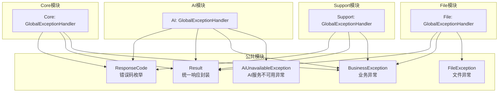
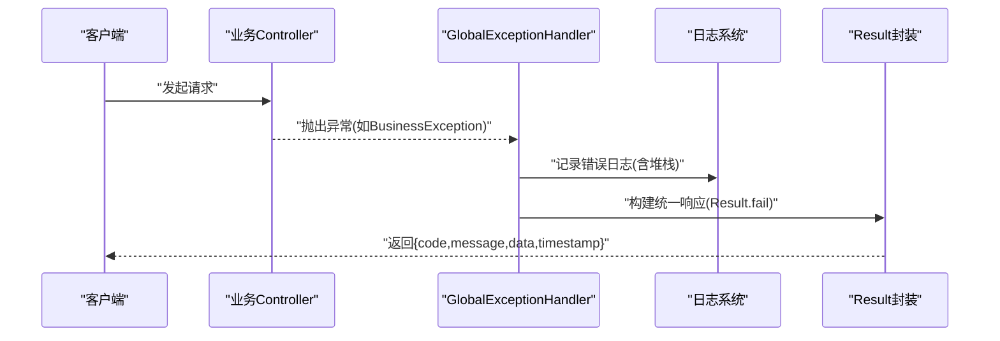
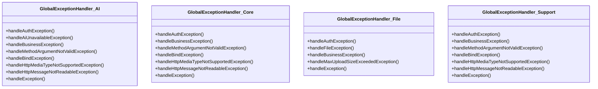
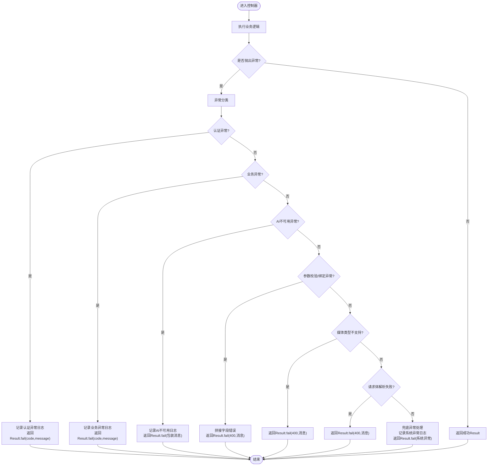
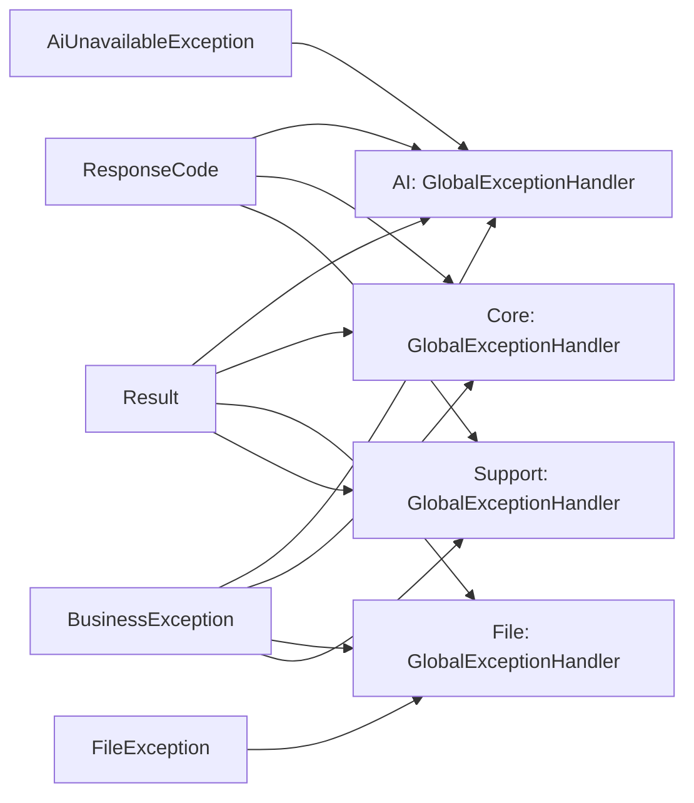

# 异常处理与错误管理

<cite>
**本文引用的文件**   
- [BusinessException.java](file://ele-ai-tender-system/ele-ai-tender-common/src/main/java/com/jy/eleaitender/common/exception/BusinessException.java)
- [AiUnavailableException.java](file://ele-ai-tender-system/ele-ai-tender-common/src/main/java/com/jy/eleaitender/common/exception/AiUnavailableException.java)
- [FileException.java](file://ele-ai-tender-system/ele-ai-tender-common/src/main/java/com/jy/eleaitender/common/exception/FileException.java)
- [ResponseCode.java](file://ele-ai-tender-system/ele-ai-tender-common/src/main/java/com/jy/eleaitender/common/enums/ResponseCode.java)
- [Result.java](file://ele-ai-tender-system/ele-ai-tender-common/src/main/java/com/jy/eleaitender/common/response/Result.java)
- [GlobalExceptionHandler.java（AI模块）](file://ele-ai-tender-system/ele-ai-tender-ai/src/main/java/com/jy/eleaitender/ai/handler/GlobalExceptionHandler.java)
- [GlobalExceptionHandler.java（Core模块）](file://ele-ai-tender-system/ele-ai-tender-core/src/main/java/com/jy/eleaitender/core/handler/GlobalExceptionHandler.java)
- [GlobalExceptionHandler.java（File模块）](file://ele-ai-tender-system/ele-ai-tender-file/src/main/java/com/jy/eleaitender/file/handler/GlobalExceptionHandler.java)
- [GlobalExceptionHandler.java（Support模块）](file://ele-ai-tender-system/ele-ai-tender-support/src/main/java/com/jy/eleaitender/support/handler/GlobalExceptionHandler.java)
</cite>

## 目录
1. [简介](#简介)
2. [项目结构](#项目结构)
3. [核心组件](#核心组件)
4. [架构总览](#架构总览)
5. [详细组件分析](#详细组件分析)
6. [依赖关系分析](#依赖关系分析)
7. [性能考量](#性能考量)
8. [故障排查指南](#故障排查指南)
9. [结论](#结论)
10. [附录](#附录)

## 简介
本文件聚焦于后端各微服务模块的异常处理与错误管理体系，围绕全局异常处理器、异常分类体系、错误码规范、统一响应封装、HTTP状态码映射、日志记录策略、调试信息输出、堆栈追踪、监控集成思路以及国际化支持等主题展开。目标是帮助开发者快速理解并正确实现一致的异常处理方案，提升可观测性与可维护性。

## 项目结构
本项目采用多模块架构，每个服务模块均包含独立的全局异常处理器，以适配各自业务域的特殊异常类型；通用能力集中在公共模块中，包括统一响应体、错误码枚举与自定义异常基类。

图表来源
- [GlobalExceptionHandler.java（AI模块）:1-102](file://ele-ai-tender-system/ele-ai-tender-ai/src/main/java/com/jy/eleaitender/ai/handler/GlobalExceptionHandler.java#L1-L102)
- [GlobalExceptionHandler.java（Core模块）:1-92](file://ele-ai-tender-system/ele-ai-tender-core/src/main/java/com/jy/eleaitender/core/handler/GlobalExceptionHandler.java#L1-L92)
- [GlobalExceptionHandler.java（File模块）:1-64](file://ele-ai-tender-system/ele-ai-tender-file/src/main/java/com/jy/eleaitender/file/handler/GlobalExceptionHandler.java#L1-L64)
- [GlobalExceptionHandler.java（Support模块）:1-95](file://ele-ai-tender-system/ele-ai-tender-support/src/main/java/com/jy/eleaitender/support/handler/GlobalExceptionHandler.java#L1-L95)
- [ResponseCode.java:1-168](file://ele-ai-tender-system/ele-ai-tender-common/src/main/java/com/jy/eleaitender/common/enums/ResponseCode.java#L1-L168)
- [Result.java:1-105](file://ele-ai-tender-system/ele-ai-tender-common/src/main/java/com/jy/eleaitender/common/response/Result.java#L1-L105)
- [BusinessException.java:1-51](file://ele-ai-tender-system/ele-ai-tender-common/src/main/java/com/jy/eleaitender/common/exception/BusinessException.java#L1-L51)
- [AiUnavailableException.java:1-32](file://ele-ai-tender-system/ele-ai-tender-common/src/main/java/com/jy/eleaitender/common/exception/AiUnavailableException.java#L1-L32)
- [FileException.java:1-36](file://ele-ai-tender-system/ele-ai-tender-common/src/main/java/com/jy/eleaitender/common/exception/FileException.java#L1-L36)

章节来源
- [GlobalExceptionHandler.java（AI模块）:1-102](file://ele-ai-tender-system/ele-ai-tender-ai/src/main/java/com/jy/eleaitender/ai/handler/GlobalExceptionHandler.java#L1-L102)
- [GlobalExceptionHandler.java（Core模块）:1-92](file://ele-ai-tender-system/ele-ai-tender-core/src/main/java/com/jy/eleaitender/core/handler/GlobalExceptionHandler.java#L1-L92)
- [GlobalExceptionHandler.java（File模块）:1-64](file://ele-ai-tender-system/ele-ai-tender-file/src/main/java/com/jy/eleaitender/file/handler/GlobalExceptionHandler.java#L1-L64)
- [GlobalExceptionHandler.java（Support模块）:1-95](file://ele-ai-tender-system/ele-ai-tender-support/src/main/java/com/jy/eleaitender/support/handler/GlobalExceptionHandler.java#L1-L95)
- [ResponseCode.java:1-168](file://ele-ai-tender-system/ele-ai-tender-common/src/main/java/com/jy/eleaitender/common/enums/ResponseCode.java#L1-L168)
- [Result.java:1-105](file://ele-ai-tender-system/ele-ai-tender-common/src/main/java/com/jy/eleaitender/common/response/Result.java#L1-L105)
- [BusinessException.java:1-51](file://ele-ai-tender-system/ele-ai-tender-common/src/main/java/com/jy/eleaitender/common/exception/BusinessException.java#L1-L51)
- [AiUnavailableException.java:1-32](file://ele-ai-tender-system/ele-ai-tender-common/src/main/java/com/jy/eleaitender/common/exception/AiUnavailableException.java#L1-L32)
- [FileException.java:1-36](file://ele-ai-tender-system/ele-ai-tender-common/src/main/java/com/jy/eleaitender/common/exception/FileException.java#L1-L36)

## 核心组件
- 统一响应封装 Result：提供成功/失败构造器与便捷方法，统一返回 code、message、data、timestamp 字段，便于前端一致化处理。
- 错误码枚举 ResponseCode：集中定义系统级错误码与消息，覆盖通用、用户、权限、文件、AI任务、模板、检测、模型配置、消息、文档集成等域。
- 自定义异常族：
  - BusinessException：通用业务异常，支持携带错误码与原始异常原因。
  - AiUnavailableException：AI服务不可用异常，用于所有模型路由不可用的场景。
  - FileException：文件相关异常，默认使用文件上传失败错误码。

章节来源
- [Result.java:1-105](file://ele-ai-tender-system/ele-ai-tender-common/src/main/java/com/jy/eleaitender/common/response/Result.java#L1-L105)
- [ResponseCode.java:1-168](file://ele-ai-tender-system/ele-ai-tender-common/src/main/java/com/jy/eleaitender/common/enums/ResponseCode.java#L1-L168)
- [BusinessException.java:1-51](file://ele-ai-tender-system/ele-ai-tender-common/src/main/java/com/jy/eleaitender/common/exception/BusinessException.java#L1-L51)
- [AiUnavailableException.java:1-32](file://ele-ai-tender-system/ele-ai-tender-common/src/main/java/com/jy/eleaitender/common/exception/AiUnavailableException.java#L1-L32)
- [FileException.java:1-36](file://ele-ai-tender-system/ele-ai-tender-common/src/main/java/com/jy/eleaitender/common/exception/FileException.java#L1-L36)

## 架构总览
全局异常处理器在各模块中以 @RestControllerAdvice 形式注册，捕获控制器层抛出的异常，将其转换为统一的 Result 响应。不同模块根据业务特点扩展特定异常类型的处理逻辑。

图表来源
- [GlobalExceptionHandler.java（AI模块）:1-102](file://ele-ai-tender-system/ele-ai-tender-ai/src/main/java/com/jy/eleaitender/ai/handler/GlobalExceptionHandler.java#L1-L102)
- [GlobalExceptionHandler.java（Core模块）:1-92](file://ele-ai-tender-system/ele-ai-tender-core/src/main/java/com/jy/eleaitender/core/handler/GlobalExceptionHandler.java#L1-L92)
- [GlobalExceptionHandler.java（File模块）:1-64](file://ele-ai-tender-system/ele-ai-tender-file/src/main/java/com/jy/eleaitender/file/handler/GlobalExceptionHandler.java#L1-L64)
- [GlobalExceptionHandler.java（Support模块）:1-95](file://ele-ai-tender-system/ele-ai-tender-support/src/main/java/com/jy/eleaitender/support/handler/GlobalExceptionHandler.java#L1-L95)
- [Result.java:1-105](file://ele-ai-tender-system/ele-ai-tender-common/src/main/java/com/jy/eleaitender/common/response/Result.java#L1-L105)

## 详细组件分析

### 全局异常处理器（按模块）
- AI模块处理器
  - 处理认证异常、AI服务不可用异常、业务异常、参数校验/绑定异常、媒体类型不支持、请求体解析失败、兜底异常。
  - 对 AI 不可用异常进行专门包装，提示“AI服务暂时不可用”。
- Core模块处理器
  - 处理认证异常、业务异常、参数校验/绑定异常、媒体类型不支持、请求体解析失败、兜底异常。
  - 兜底异常统一返回固定提示语。
- File模块处理器
  - 处理认证异常、文件异常、业务异常、文件大小超限异常、兜底异常。
  - 针对 MaxUploadSizeExceededException 直接返回对应错误码与消息。
- Support模块处理器
  - 处理认证异常、业务异常、参数校验/绑定异常、媒体类型不支持、请求体解析失败、兜底异常。
  - 部分分支使用硬编码错误码，建议统一为 ResponseCode。

图表来源
- [GlobalExceptionHandler.java（AI模块）:1-102](file://ele-ai-tender-system/ele-ai-tender-ai/src/main/java/com/jy/eleaitender/ai/handler/GlobalExceptionHandler.java#L1-L102)
- [GlobalExceptionHandler.java（Core模块）:1-92](file://ele-ai-tender-system/ele-ai-tender-core/src/main/java/com/jy/eleaitender/core/handler/GlobalExceptionHandler.java#L1-L92)
- [GlobalExceptionHandler.java（File模块）:1-64](file://ele-ai-tender-system/ele-ai-tender-file/src/main/java/com/jy/eleaitender/file/handler/GlobalExceptionHandler.java#L1-L64)
- [GlobalExceptionHandler.java（Support模块）:1-95](file://ele-ai-tender-system/ele-ai-tender-support/src/main/java/com/jy/eleaitender/support/handler/GlobalExceptionHandler.java#L1-L95)

章节来源
- [GlobalExceptionHandler.java（AI模块）:1-102](file://ele-ai-tender-system/ele-ai-tender-ai/src/main/java/com/jy/eleaitender/ai/handler/GlobalExceptionHandler.java#L1-L102)
- [GlobalExceptionHandler.java（Core模块）:1-92](file://ele-ai-tender-system/ele-ai-tender-core/src/main/java/com/jy/eleaitender/core/handler/GlobalExceptionHandler.java#L1-L92)
- [GlobalExceptionHandler.java（File模块）:1-64](file://ele-ai-tender-system/ele-ai-tender-file/src/main/java/com/jy/eleaitender/file/handler/GlobalExceptionHandler.java#L1-L64)
- [GlobalExceptionHandler.java（Support模块）:1-95](file://ele-ai-tender-system/ele-ai-tender-support/src/main/java/com/jy/eleaitender/support/handler/GlobalExceptionHandler.java#L1-L95)

### 异常分类体系与错误码规范
- 异常分类
  - 认证异常：未授权、Token过期/无效等。
  - 业务异常：领域规则违反或流程状态不合法。
  - 资源异常：文件不存在、类型不允许、大小超限等。
  - 外部服务异常：AI服务不可用、第三方调用失败等。
  - 系统异常：未捕获的运行时异常、框架异常等。
- 错误码规范
  - 通用：200成功、500失败、400参数错误、401未授权、403无权限、404资源不存在、405方法不允许。
  - 用户：1001-1006。
  - 短信验证码：1011-1013。
  - 角色权限：2001-2005。
  - 接入系统：3001-3006。
  - 版本管理：4001-4004。
  - 文件：5001-5005。
  - 加解密：7001-7013。
  - AI编制系统：项目8001-8009、需求8011-8019、模板8021-8029、评审项8031-8039、版本快照/对比8041-8042、知识库8051-8059、检测8061-8069、模型配置8071-8079、系统参数9001-9009、政策文件9011-9019、AI任务8081-8084、反馈8091-8093、消息9021、模型路由9031、文档集成9041-9044。
- 使用建议
  - 优先通过 ResponseCode 枚举获取 code 与 message，避免硬编码。
  - 在业务异常中携带 cause，便于定位根因。

章节来源
- [ResponseCode.java:1-168](file://ele-ai-tender-system/ele-ai-tender-common/src/main/java/com/jy/eleaitender/common/enums/ResponseCode.java#L1-L168)
- [BusinessException.java:1-51](file://ele-ai-tender-system/ele-ai-tender-common/src/main/java/com/jy/eleaitender/common/exception/BusinessException.java#L1-L51)
- [AiUnavailableException.java:1-32](file://ele-ai-tender-system/ele-ai-tender-common/src/main/java/com/jy/eleaitender/common/exception/AiUnavailableException.java#L1-L32)
- [FileException.java:1-36](file://ele-ai-tender-system/ele-ai-tender-common/src/main/java/com/jy/eleaitender/common/exception/FileException.java#L1-L36)

### 统一响应格式 Result 封装
- 字段说明
  - code：业务错误码（来自 ResponseCode）。
  - message：面向用户的可读消息。
  - data：业务数据。
  - timestamp：响应时间戳。
- 常用构造方式
  - 成功：success()/success(data)/success(message, data)。
  - 失败：fail(message)/fail(code, message)/fail(ResponseCode)/fail(ResponseCode, message)。
- 设计要点
  - 统一返回结构，简化前端错误处理。
  - isSuccess() 判断是否成功，便于上层逻辑分支。

章节来源
- [Result.java:1-105](file://ele-ai-tender-system/ele-ai-tender-common/src/main/java/com/jy/eleaitender/common/response/Result.java#L1-L105)

### HTTP状态码映射与日志记录策略
- HTTP状态码
  - 当前实现将多数异常映射到 HTTP 200，并在 body 中通过 code 表达业务结果。
  - 优点：前端无需区分HTTP状态码，统一按 code 处理。
  - 风险：不利于网关/代理层的统计与告警，建议对认证/鉴权/参数错误等使用真实HTTP状态码。
- 日志记录
  - 所有异常路径均记录 error 级别日志，包含异常消息与堆栈。
  - 关键异常（认证、业务、AI不可用、文件、参数校验/绑定、媒体类型、请求体解析）均有明确前缀，便于检索。
- 调试信息输出
  - 兜底异常处理器会尝试提取异常消息或类名作为简要描述，避免空消息。
  - 建议在后续版本引入结构化日志（traceId、userId、requestId），增强链路追踪。

章节来源
- [GlobalExceptionHandler.java（AI模块）:1-102](file://ele-ai-tender-system/ele-ai-tender-ai/src/main/java/com/jy/eleaitender/ai/handler/GlobalExceptionHandler.java#L1-L102)
- [GlobalExceptionHandler.java（Core模块）:1-92](file://ele-ai-tender-system/ele-ai-tender-core/src/main/java/com/jy/eleaitender/core/handler/GlobalExceptionHandler.java#L1-L92)
- [GlobalExceptionHandler.java（File模块）:1-64](file://ele-ai-tender-system/ele-ai-tender-file/src/main/java/com/jy/eleaitender/file/handler/GlobalExceptionHandler.java#L1-L64)
- [GlobalExceptionHandler.java（Support模块）:1-95](file://ele-ai-tender-system/ele-ai-tender-support/src/main/java/com/jy/eleaitender/support/handler/GlobalExceptionHandler.java#L1-L95)

### 异常处理流程图（以AI模块为例）

图表来源
- [GlobalExceptionHandler.java（AI模块）:1-102](file://ele-ai-tender-system/ele-ai-tender-ai/src/main/java/com/jy/eleaitender/ai/handler/GlobalExceptionHandler.java#L1-L102)

## 依赖关系分析
- 模块内耦合
  - 各模块的 GlobalExceptionHandler 仅依赖公共模块的 Result、ResponseCode 与自定义异常，保持低耦合。
- 跨模块差异
  - AI模块新增 AiUnavailableException 处理。
  - File模块新增 FileException 与 MaxUploadSizeExceededException 处理。
  - Support模块存在硬编码错误码（400），建议统一为 ResponseCode.PARAM_ERROR。
- 潜在问题
  - 多处使用 HTTP 200 承载业务错误，可能影响网关/监控统计。
  - 部分处理器对未处理异常的兜底消息不一致，建议收敛。

图表来源
- [GlobalExceptionHandler.java（AI模块）:1-102](file://ele-ai-tender-system/ele-ai-tender-ai/src/main/java/com/jy/eleaitender/ai/handler/GlobalExceptionHandler.java#L1-L102)
- [GlobalExceptionHandler.java（Core模块）:1-92](file://ele-ai-tender-system/ele-ai-tender-core/src/main/java/com/jy/eleaitender/core/handler/GlobalExceptionHandler.java#L1-L92)
- [GlobalExceptionHandler.java（File模块）:1-64](file://ele-ai-tender-system/ele-ai-tender-file/src/main/java/com/jy/eleaitender/file/handler/GlobalExceptionHandler.java#L1-L64)
- [GlobalExceptionHandler.java（Support模块）:1-95](file://ele-ai-tender-system/ele-ai-tender-support/src/main/java/com/jy/eleaitender/support/handler/GlobalExceptionHandler.java#L1-L95)
- [ResponseCode.java:1-168](file://ele-ai-tender-system/ele-ai-tender-common/src/main/java/com/jy/eleaitender/common/enums/ResponseCode.java#L1-L168)
- [Result.java:1-105](file://ele-ai-tender-system/ele-ai-tender-common/src/main/java/com/jy/eleaitender/common/response/Result.java#L1-L105)
- [BusinessException.java:1-51](file://ele-ai-tender-system/ele-ai-tender-common/src/main/java/com/jy/eleaitender/common/exception/BusinessException.java#L1-L51)
- [AiUnavailableException.java:1-32](file://ele-ai-tender-system/ele-ai-tender-common/src/main/java/com/jy/eleaitender/common/exception/AiUnavailableException.java#L1-L32)
- [FileException.java:1-36](file://ele-ai-tender-system/ele-ai-tender-common/src/main/java/com/jy/eleaitender/common/exception/FileException.java#L1-L36)

## 性能考量
- 异常路径通常属于非主流程，但频繁触发会影响吞吐与延迟。建议：
  - 减少不必要的异常抛出，尽量前置校验。
  - 对高频异常进行分类与聚合统计，结合监控平台设置阈值告警。
  - 避免在异常处理中进行重型计算或阻塞IO。
- 日志级别控制
  - 生产环境建议对参数校验类异常降级为 warn，降低日志量。
  - 对关键异常（认证、AI不可用、文件上传失败）保持 error 级别。

## 故障排查指南
- 快速定位
  - 通过日志关键字“认证异常”“业务异常”“AI服务不可用”“文件异常”“参数校验失败”“参数绑定失败”“媒体类型不支持”“请求体解析失败”“系统异常”筛选。
  - 关注 Result.code 与 message，结合 ResponseCode 枚举定位具体错误。
- 常见场景
  - 参数校验失败：检查请求体结构与注解约束，确认字段错误拼接信息。
  - 文件上传失败：核对文件大小限制与类型白名单，查看 MaxUploadSizeExceededException 日志。
  - AI服务不可用：检查模型路由配置与连通性测试接口，确认重试与降级策略。
- 堆栈追踪
  - 所有异常处理器均记录完整堆栈，便于定位根因。
  - 建议在业务异常构造时传入 cause，保留底层异常链。
- 监控集成建议
  - 基于错误码维度建立指标面板（如 PARAM_ERROR、FILE_UPLOAD_ERROR、AI_UNAVAILABLE）。
  - 结合 traceId 关联请求链路，提升跨服务排障效率。

章节来源
- [GlobalExceptionHandler.java（AI模块）:1-102](file://ele-ai-tender-system/ele-ai-tender-ai/src/main/java/com/jy/eleaitender/ai/handler/GlobalExceptionHandler.java#L1-L102)
- [GlobalExceptionHandler.java（Core模块）:1-92](file://ele-ai-tender-system/ele-ai-tender-core/src/main/java/com/jy/eleaitender/core/handler/GlobalExceptionHandler.java#L1-L92)
- [GlobalExceptionHandler.java（File模块）:1-64](file://ele-ai-tender-system/ele-ai-tender-file/src/main/java/com/jy/eleaitender/file/handler/GlobalExceptionHandler.java#L1-L64)
- [GlobalExceptionHandler.java（Support模块）:1-95](file://ele-ai-tender-system/ele-ai-tender-support/src/main/java/com/jy/eleaitender/support/handler/GlobalExceptionHandler.java#L1-L95)
- [ResponseCode.java:1-168](file://ele-ai-tender-system/ele-ai-tender-common/src/main/java/com/jy/eleaitender/common/enums/ResponseCode.java#L1-L168)

## 结论
本项目已建立起较为完善的异常处理与错误管理体系：统一响应封装、集中错误码枚举、模块化全局异常处理器、清晰的异常分类与日志策略。为进一步优化，建议：
- 统一 HTTP 状态码映射，对认证/鉴权/参数错误使用真实状态码。
- 收敛兜底异常消息，消除模块间差异。
- 全面使用 ResponseCode 替代硬编码错误码。
- 引入结构化日志与链路追踪，完善监控与告警。

## 附录
- 开发规范建议
  - 优先抛出带错误码的业务异常，避免吞掉异常或返回裸字符串。
  - 在异常消息中提供对用户友好的提示，同时在日志中记录技术细节。
  - 对外部依赖失败，使用专用异常类型（如 AiUnavailableException、FileException），便于分层处理。
- 国际化错误消息支持（建议）
  - 将 message 抽取至 i18n 资源文件，根据 Accept-Language 动态选择语言。
  - 在 Result 构造时传入 i18n key，由全局拦截器或处理器解析为本地化消息。
  - 对于技术性错误（如堆栈、内部详情），仅在服务端日志中输出，不在响应体暴露。