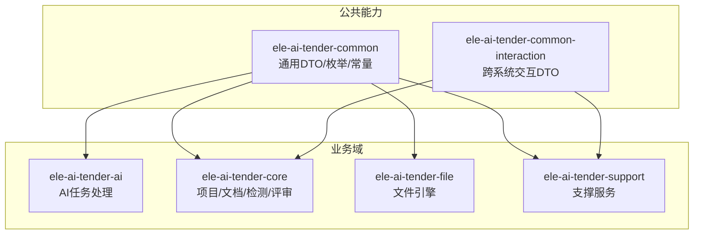
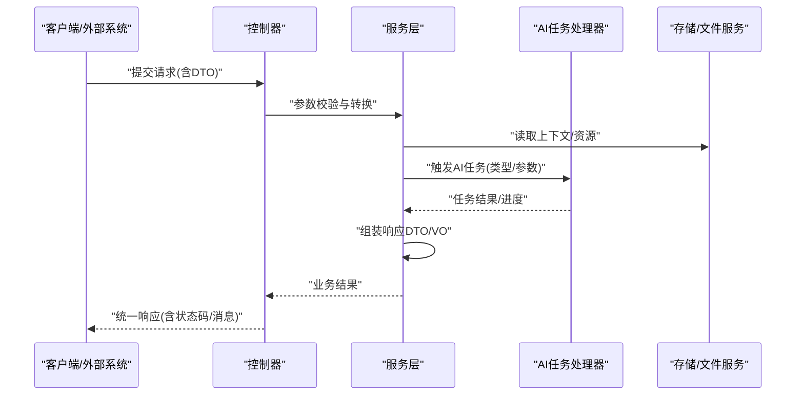
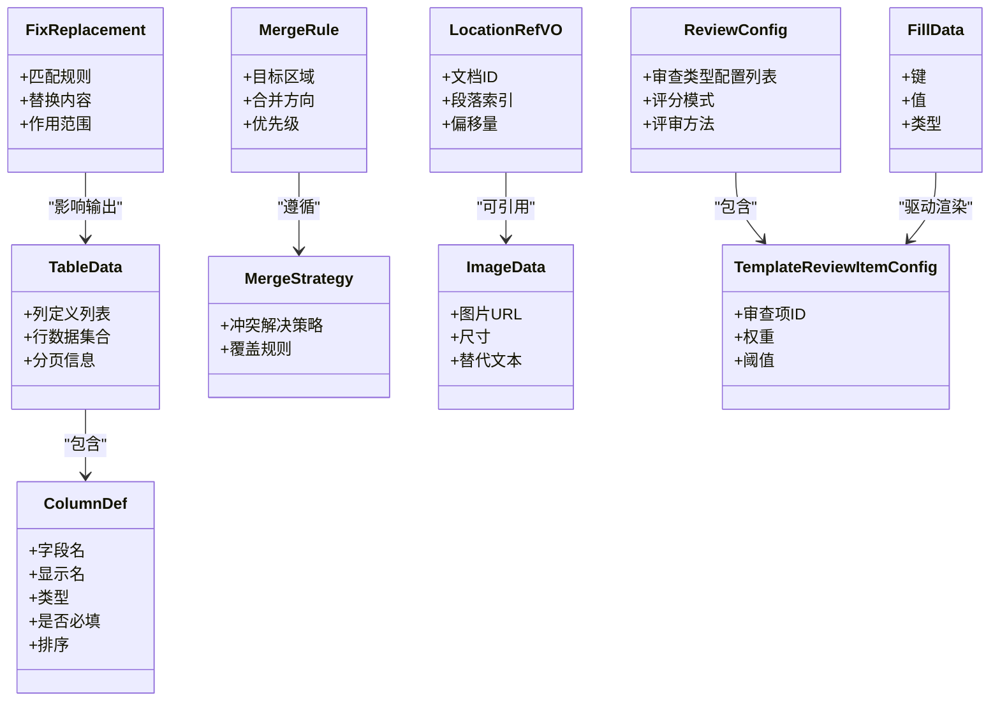
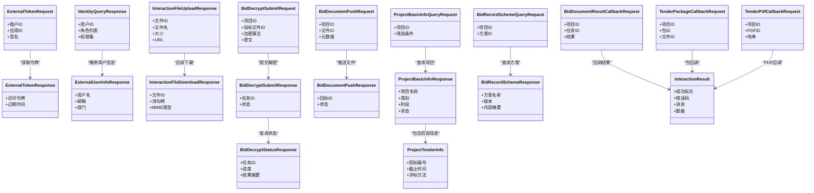
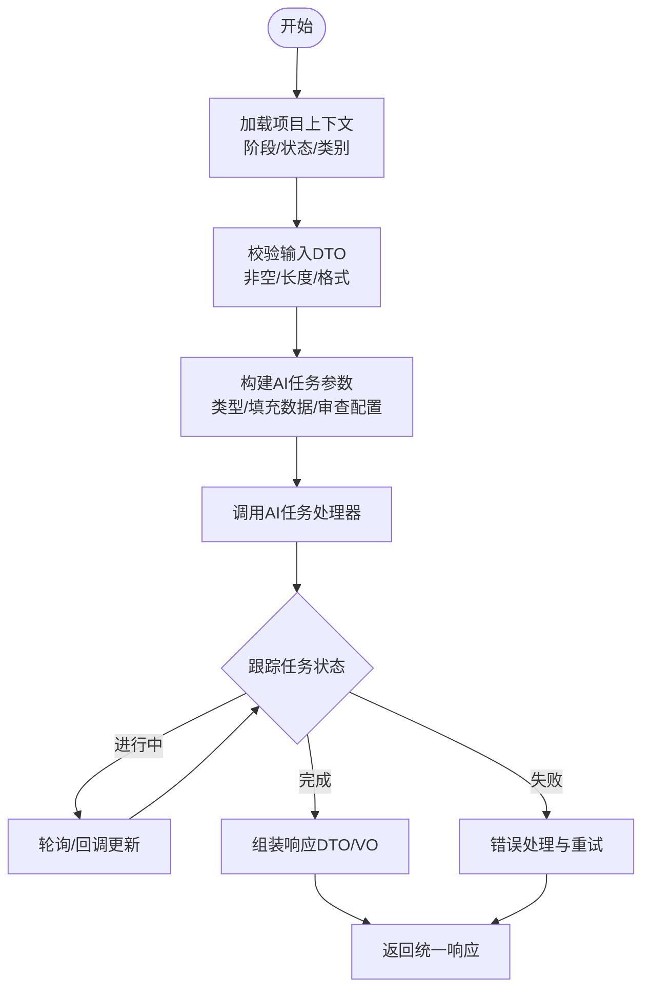
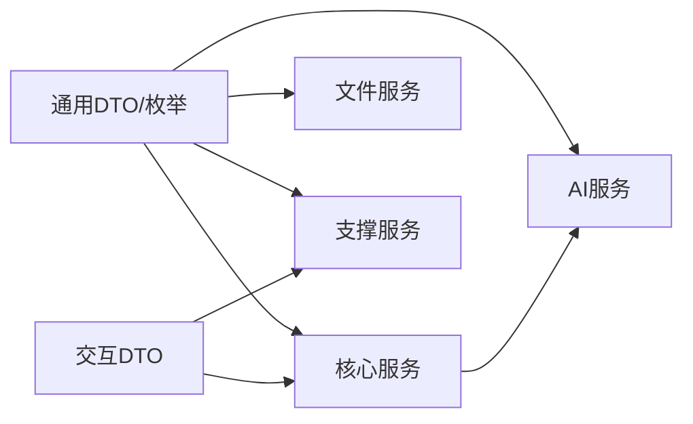

# 数据传输对象与模型

<cite>
**本文引用的文件**   
- [AI任务处理器.java](file://ele-ai-tender-system/ele-ai-tender-ai/src/main/java/com/jy/eleaitender/ai/processor/AiTaskProcessor.java)
- [项目服务接口.java](file://ele-ai-tender-system/ele-ai-tender-core/src/main/java/com/jy/eleaitender/core/service/IProjectService.java)
- [检测服务实现.java](file://ele-ai-tender-system/ele-ai-tender-core/src/main/java/com/jy/eleaitender/core/service/impl/DetectionServiceImpl.java)
- [通用常量.java](file://ele-ai-tender-system/ele-ai-tender-common/src/main/java/com/jy/eleaitender/common/constant/CommonConstant.java)
- [枚举：项目阶段.java](file://ele-ai-tender-system/ele-ai-tender-common/src/main/java/com/jy/eleaitender/common/enums/ProjectPhase.java)
- [枚举：项目状态.java](file://ele-ai-tender-system/ele-ai-tender-common/src/main/java/com/jy/eleaitender/common/enums/ProjectStatus.java)
- [枚举：AI任务类型.java](file://ele-ai-tender-system/ele-ai-tender-common/src/main/java/com/jy/eleaitender/common/enums/AiTaskType.java)
- [枚举：AI任务状态.java](file://ele-ai-tender-system/ele-ai-tender-common/src/main/java/com/jy/eleaitender/common/enums/AiTaskStatus.java)
- [枚举：需求来源.java](file://ele-ai-tender-system/ele-ai-tender-common/src/main/java/com/jy/eleaitender/common/enums/RequirementSource.java)
- [枚举：评审方法.java](file://ele-ai-tender-system/ele-ai-tender-common/src/main/java/com/jy/eleaitender/common/enums/ReviewMethod.java)
- [枚举：响应码.java](file://ele-ai-tender-system/ele-ai-tender-common/src/main/java/com/jy/eleaitender/common/enums/ResponseCode.java)
- [DTO：列定义.java](file://ele-ai-tender-system/ele-ai-tender-common/src/main/java/com/jy/eleaitender/common/dto/ColumnDef.java)
- [DTO：合并规则.java](file://ele-ai-tender-system/ele-ai-tender-common/src/main/java/com/jy/eleaitender/common/dto/MergeRule.java)
- [DTO：合并策略.java](file://ele-ai-tender-system/ele-ai-tender-common/src/main/java/com/jy/eleaitender/common/dto/MergeStrategy.java)
- [DTO：审查配置.java](file://ele-ai-tender-system/ele-ai-tender-common/src/main/java/com/jy/eleaitender/common/dto/ReviewConfig.java)
- [DTO：表格数据.java](file://ele-ai-tender-system/ele-ai-tender-common/src/main/java/com/jy/eleaitender/common/dto/TableData.java)
- [DTO：位置引用VO.java](file://ele-ai-tender-system/ele-ai-tender-common/src/main/java/com/jy/eleaitender/common/dto/LocationRefVO.java)
- [DTO：图片数据.java](file://ele-ai-tender-system/ele-ai-tender-common/src/main/java/com/jy/eleaitender/common/dto/ImageData.java)
- [DTO：修复替换项.java](file://ele-ai-tender-system/ele-ai-tender-common/src/main/java/com/jy/eleaitender/common/dto/FixReplacement.java)
- [DTO：填充数据.java](file://ele-ai-tender-system/ele-ai-tender-common/src/main/java/com/jy/eleaitender/common/dto/FillData.java)
- [DTO：填充类型.java](file://ele-ai-tender-system/ele-ai-tender-common/src/main/java/com/jy/eleaitender/common/dto/FillType.java)
- [DTO：模板审查项配置.java](file://ele-ai-tender-system/ele-ai-tender-common/src/main/java/com/jy/eleaitender/common/dto/TemplateReviewItemConfig.java)
- [DTO：审查类型配置.java](file://ele-ai-tender-system/ele-ai-tender-common/src/main/java/com/jy/eleaitender/common/dto/ReviewTypeConfig.java)
- [DTO：交互结果.java](file://ele-ai-tender-system/ele-ai-tender-common-interaction/src/main/java/com/jy/eleaitender/common/interaction/dto/InteractionResult.java)
- [DTO：外部用户信息响应.java](file://ele-ai-tender-system/ele-ai-tender-common-interaction/src/main/java/com/jy/eleaitender/common/interaction/dto/ExternalUserInfoResponse.java)
- [DTO：投标书解密提交请求.java](file://ele-ai-tender-system/ele-ai-tender-common-interaction/src/main/java/com/jy/eleaitender/common/interaction/dto/BidDecryptSubmitRequest.java)
- [DTO：投标书解密提交响应.java](file://ele-ai-tender-system/ele-ai-tender-common-interaction/src/main/java/com/jy/eleaitender/common/interaction/dto/BidDecryptSubmitResponse.java)
- [DTO：投标书解密结果回调请求.java](file://ele-ai-tender-system/ele-ai-tender-common-interaction/src/main/java/com/jy/eleaitender/common/interaction/dto/BidDocumentResultCallbackRequest.java)
- [DTO：投标书推送请求.java](file://ele-ai-tender-system/ele-ai-tender-common-interaction/src/main/java/com/jy/eleaitender/common/interaction/dto/BidDocumentPushRequest.java)
- [DTO：投标书推送响应.java](file://ele-ai-tender-system/ele-ai-tender-common-interaction/src/main/java/com/jy/eleaitender/common/interaction/dto/BidDocumentPushResponse.java)
- [DTO：投标书解密状态响应.java](file://ele-ai-tender-system/ele-ai-tender-common-interaction/src/main/java/com/jy/eleaitender/common/interaction/dto/BidDecryptStatusResponse.java)
- [DTO：CA密钥信息查询请求.java](file://ele-ai-tender-system/ele-ai-tender-common-interaction/src/main/java/com/jy/eleaitender/common/interaction/dto/CaKeysInfoQueryRequest.java)
- [DTO：CA密钥信息查询响应.java](file://ele-ai-tender-system/ele-ai-tender-common-interaction/src/main/java/com/jy/eleaitender/common/interaction/dto/CaKeysInfoResponse.java)
- [DTO：信封加入请求.java](file://ele-ai-tender-system/ele-ai-tender-common-interaction/src/main/java/com/jy/eleaitender/common/interaction/dto/EnvelopeJoinRequest.java)
- [DTO：信封加入响应.java](file://ele-ai-tender-system/ele-ai-tender-common-interaction/src/main/java/com/jy/eleaitender/common/interaction/dto/EnvelopeJoinResponse.java)
- [DTO：外部令牌请求.java](file://ele-ai-tender-system/ele-ai-tender-common-interaction/src/main/java/com/jy/eleaitender/common/interaction/dto/ExternalTokenRequest.java)
- [DTO：外部令牌响应.java](file://ele-ai-tender-system/ele-ai-tender-common-interaction/src/main/java/com/jy/eleaitender/common/interaction/dto/ExternalTokenResponse.java)
- [DTO：外部用户信息响应.java](file://ele-ai-tender-system/ele-ai-tender-common-interaction/src/main/java/com/jy/eleaitender/common/interaction/dto/ExternalUserInfoResponse.java)
- [DTO：身份查询响应.java](file://ele-ai-tender-system/ele-ai-tender-common-interaction/src/main/java/com/jy/eleaitender/common/interaction/dto/IdentityQueryResponse.java)
- [DTO：项目基本信息查询请求.java](file://ele-ai-tender-system/ele-ai-tender-common-interaction/src/main/java/com/jy/eleaitender/common/interaction/dto/ProjectBasicInfoQueryRequest.java)
- [DTO：项目基本信息响应.java](file://ele-ai-tender-system/ele-ai-tender-common-interaction/src/main/java/com/jy/eleaitender/common/interaction/dto/ProjectBasicInfoResponse.java)
- [DTO：项目招投信息.java](file://ele-ai-tender-system/ele-ai-tender-common-interaction/src/main/java/com/jy/eleaitender/common/interaction/dto/ProjectTenderInfo.java)
- [DTO：投标包回调请求.java](file://ele-ai-tender-system/ele-ai-tender-common-interaction/src/main/java/com/jy/eleaitender/common/interaction/dto/TenderPackageCallbackRequest.java)
- [DTO：投标PDF回调请求.java](file://ele-ai-tender-system/ele-ai-tender-common-interaction/src/main/java/com/jy/eleaitender/common/interaction/dto/TenderPdfCallbackRequest.java)
- [DTO：交互文件下载响应.java](file://ele-ai-tender-system/ele-ai-tender-common-interaction/src/main/java/com/jy/eleaitender/common/interaction/dto/InteractionFileDownloadResponse.java)
- [DTO：交互文件上传响应.java](file://ele-ai-tender-system/ele-ai-tender-common-interaction/src/main/java/com/jy/eleaitender/common/interaction/dto/InteractionFileUploadResponse.java)
- [DTO：交互文件信息响应.java](file://ele-ai-tender-system/ele-ai-tender-common-interaction/src/main/java/com/jy/eleaitender/common/interaction/dto/InteractionFileInfoResponse.java)
- [DTO：投标记录方案查询请求.java](file://ele-ai-tender-system/ele-ai-tender-common-interaction/src/main/java/com/jy/eleaitender/common/interaction/dto/BidRecordSchemeQueryRequest.java)
- [DTO：投标记录方案响应.java](file://ele-ai-tender-system/ele-ai-tender-common-interaction/src/main/java/com/jy/eleaitender/common/interaction/dto/BidRecordSchemeResponse.java)
- [DTO：投标书解密结果回调请求.java](file://ele-ai-tender-system/ele-ai-tender-common-interaction/src/main/java/com/jy/eleaitender/common/interaction/dto/BidDecryptResultCallbackRequest.java)
</cite>

## 目录
1. [简介](#简介)
2. [项目结构](#项目结构)
3. [核心组件](#核心组件)
4. [架构总览](#架构总览)
5. [详细组件分析](#详细组件分析)
6. [依赖分析](#依赖分析)
7. [性能考虑](#性能考虑)
8. [故障排查指南](#故障排查指南)
9. [结论](#结论)
10. [附录](#附录)

## 简介
本技术文档聚焦于数据传输对象（DTO）与领域模型的设计与实践，围绕分层架构中的数据流转展开，涵盖请求对象、响应对象、视图对象（VO）的职责划分；详细说明项目、文档、AI任务、用户等核心实体的字段定义、关联关系与约束规则；解释枚举类型在状态管理、类型标识与业务规则编码中的设计原则与使用场景；并给出数据验证注解、序列化配置与版本兼容性的最佳实践与扩展指南。

## 项目结构
系统采用多模块分层架构，核心领域模型与通用DTO位于公共模块，业务域服务分别封装在AI、核心、文件与支持等子系统中。DTO按职责划分为：
- Request：面向入参校验与边界控制
- Response：面向出参聚合与脱敏
- VO：面向展示层的数据裁剪与格式化
- 领域实体：持久化与领域语义承载

图表来源
- [AI任务处理器.java:1-200](file://ele-ai-tender-system/ele-ai-tender-ai/src/main/java/com/jy/eleaitender/ai/processor/AiTaskProcessor.java#L1-L200)
- [项目服务接口.java:1-200](file://ele-ai-tender-system/ele-ai-tender-core/src/main/java/com/jy/eleaitender/core/service/IProjectService.java#L1-L200)
- [检测服务实现.java:1-200](file://ele-ai-tender-system/ele-ai-tender-core/src/main/java/com/jy/eleaitender/core/service/impl/DetectionServiceImpl.java#L1-L200)

章节来源
- [AI任务处理器.java:1-200](file://ele-ai-tender-system/ele-ai-tender-ai/src/main/java/com/jy/eleaitender/ai/processor/AiTaskProcessor.java#L1-L200)
- [项目服务接口.java:1-200](file://ele-ai-tender-system/ele-ai-tender-core/src/main/java/com/jy/eleaitender/core/service/IProjectService.java#L1-L200)
- [检测服务实现.java:1-200](file://ele-ai-tender-system/ele-ai-tender-core/src/main/java/com/jy/eleaitender/core/service/impl/DetectionServiceImpl.java#L1-L200)

## 核心组件
本节从DTO与模型视角梳理关键组件及其职责：
- 通用DTO族：用于跨层/跨模块传输，包含列定义、合并规则、表格数据、位置引用、图片数据、填充数据等
- 交互DTO族：面向外部系统对接，统一包装请求/响应、文件上传/下载、令牌与身份、投标相关流程
- 领域模型与枚举：项目、文档、AI任务、用户等核心实体的字段与约束，以及状态机与类型标识的枚举集合

章节来源
- [通用常量.java:1-200](file://ele-ai-tender-system/ele-ai-tender-common/src/main/java/com/jy/eleaitender/common/constant/CommonConstant.java#L1-L200)
- [枚举：项目阶段.java:1-200](file://ele-ai-tender-system/ele-ai-tender-common/src/main/java/com/jy/eleaitender/common/enums/ProjectPhase.java#L1-L200)
- [枚举：项目状态.java:1-200](file://ele-ai-tender-system/ele-ai-tender-common/src/main/java/com/jy/eleaitender/common/enums/ProjectStatus.java#L1-L200)
- [枚举：AI任务类型.java:1-200](file://ele-ai-tender-system/ele-ai-tender-common/src/main/java/com/jy/eleaitender/common/enums/AiTaskType.java#L1-L200)
- [枚举：AI任务状态.java:1-200](file://ele-ai-tender-system/ele-ai-tender-common/src/main/java/com/jy/eleaitender/common/enums/AiTaskStatus.java#L1-L200)
- [枚举：需求来源.java:1-200](file://ele-ai-tender-system/ele-ai-tender-common/src/main/java/com/jy/eleaitender/common/enums/RequirementSource.java#L1-L200)
- [枚举：评审方法.java:1-200](file://ele-ai-tender-system/ele-ai-tender-common/src/main/java/com/jy/eleaitender/common/enums/ReviewMethod.java#L1-L200)
- [枚举：响应码.java:1-200](file://ele-ai-tender-system/ele-ai-tender-common/src/main/java/com/jy/eleaitender/common/enums/ResponseCode.java#L1-L200)

## 架构总览
下图展示了典型的数据流转路径：前端或外部系统发起请求，经控制器接收后进入服务层，服务层组合领域模型与DTO进行业务编排，必要时调用AI任务处理器完成生成/检测，最终将结果封装为统一的响应对象返回。

图表来源
- [AI任务处理器.java:1-200](file://ele-ai-tender-system/ele-ai-tender-ai/src/main/java/com/jy/eleaitender/ai/processor/AiTaskProcessor.java#L1-L200)
- [项目服务接口.java:1-200](file://ele-ai-tender-system/ele-ai-tender-core/src/main/java/com/jy/eleaitender/core/service/IProjectService.java#L1-L200)
- [检测服务实现.java:1-200](file://ele-ai-tender-system/ele-ai-tender-core/src/main/java/com/jy/eleaitender/core/service/impl/DetectionServiceImpl.java#L1-L200)

## 详细组件分析

### 通用DTO族设计与职责
- 列定义与表格数据：用于动态表头与行数据的结构化表达，便于渲染与导出
- 合并规则与策略：描述单元格/段落级合并逻辑，驱动文档生成阶段的布局计算
- 位置引用与图片数据：在文档中定位插入点与媒体资源，支持富文本与版式还原
- 填充数据与类型：模板变量占位与数据类型标记，保障模板渲染一致性
- 模板审查项配置与审查配置：定义审查维度、评分模式与方法，驱动评审流程
- 修复替换项：用于自动化修正与内容替换，提升文档质量

图表来源
- [DTO：列定义.java:1-200](file://ele-ai-tender-system/ele-ai-tender-common/src/main/java/com/jy/eleaitender/common/dto/ColumnDef.java#L1-L200)
- [DTO：表格数据.java:1-200](file://ele-ai-tender-system/ele-ai-tender-common/src/main/java/com/jy/eleaitender/common/dto/TableData.java#L1-L200)
- [DTO：合并规则.java:1-200](file://ele-ai-tender-system/ele-ai-tender-common/src/main/java/com/jy/eleaitender/common/dto/MergeRule.java#L1-L200)
- [DTO：合并策略.java:1-200](file://ele-ai-tender-system/ele-ai-tender-common/src/main/java/com/jy/eleaitender/common/dto/MergeStrategy.java#L1-L200)
- [DTO：位置引用VO.java:1-200](file://ele-ai-tender-system/ele-ai-tender-common/src/main/java/com/jy/eleaitender/common/dto/LocationRefVO.java#L1-L200)
- [DTO：图片数据.java:1-200](file://ele-ai-tender-system/ele-ai-tender-common/src/main/java/com/jy/eleaitender/common/dto/ImageData.java#L1-L200)
- [DTO：填充数据.java:1-200](file://ele-ai-tender-system/ele-ai-tender-common/src/main/java/com/jy/eleaitender/common/dto/FillData.java#L1-L200)
- [DTO：模板审查项配置.java:1-200](file://ele-ai-tender-system/ele-ai-tender-common/src/main/java/com/jy/eleaitender/common/dto/TemplateReviewItemConfig.java#L1-L200)
- [DTO：审查配置.java:1-200](file://ele-ai-tender-system/ele-ai-tender-common/src/main/java/com/jy/eleaitender/common/dto/ReviewConfig.java#L1-L200)
- [DTO：修复替换项.java:1-200](file://ele-ai-tender-system/ele-ai-tender-common/src/main/java/com/jy/eleaitender/common/dto/FixReplacement.java#L1-L200)

章节来源
- [DTO：列定义.java:1-200](file://ele-ai-tender-system/ele-ai-tender-common/src/main/java/com/jy/eleaitender/common/dto/ColumnDef.java#L1-L200)
- [DTO：表格数据.java:1-200](file://ele-ai-tender-system/ele-ai-tender-common/src/main/java/com/jy/eleaitender/common/dto/TableData.java#L1-L200)
- [DTO：合并规则.java:1-200](file://ele-ai-tender-system/ele-ai-tender-common/src/main/java/com/jy/eleaitender/common/dto/MergeRule.java#L1-L200)
- [DTO：合并策略.java:1-200](file://ele-ai-tender-system/ele-ai-tender-common/src/main/java/com/jy/eleaitender/common/dto/MergeStrategy.java#L1-L200)
- [DTO：位置引用VO.java:1-200](file://ele-ai-tender-system/ele-ai-tender-common/src/main/java/com/jy/eleaitender/common/dto/LocationRefVO.java#L1-L200)
- [DTO：图片数据.java:1-200](file://ele-ai-tender-system/ele-ai-tender-common/src/main/java/com/jy/eleaitender/common/dto/ImageData.java#L1-L200)
- [DTO：填充数据.java:1-200](file://ele-ai-tender-system/ele-ai-tender-common/src/main/java/com/jy/eleaitender/common/dto/FillData.java#L1-L200)
- [DTO：模板审查项配置.java:1-200](file://ele-ai-tender-system/ele-ai-tender-common/src/main/java/com/jy/eleaitender/common/dto/TemplateReviewItemConfig.java#L1-L200)
- [DTO：审查配置.java:1-200](file://ele-ai-tender-system/ele-ai-tender-common/src/main/java/com/jy/eleaitender/common/dto/ReviewConfig.java#L1-L200)
- [DTO：修复替换项.java:1-200](file://ele-ai-tender-system/ele-ai-tender-common/src/main/java/com/jy/eleaitender/common/dto/FixReplacement.java#L1-L200)

### 交互DTO族与跨系统数据契约
交互DTO族定义了与外部系统的稳定契约，包括：
- 认证与身份：外部令牌、身份查询与用户信息
- 文件交互：上传、下载与文件信息
- 投标流程：解密提交/状态/结果回调、推送与包/PDF回调
- 基础信息：项目基本信息与招投信息、记录方案

图表来源
- [DTO：外部令牌请求.java:1-200](file://ele-ai-tender-system/ele-ai-tender-common-interaction/src/main/java/com/jy/eleaitender/common/interaction/dto/ExternalTokenRequest.java#L1-L200)
- [DTO：外部令牌响应.java:1-200](file://ele-ai-tender-system/ele-ai-tender-common-interaction/src/main/java/com/jy/eleaitender/common/interaction/dto/ExternalTokenResponse.java#L1-L200)
- [DTO：身份查询响应.java:1-200](file://ele-ai-tender-system/ele-ai-tender-common-interaction/src/main/java/com/jy/eleaitender/common/interaction/dto/IdentityQueryResponse.java#L1-L200)
- [DTO：外部用户信息响应.java:1-200](file://ele-ai-tender-system/ele-ai-tender-common-interaction/src/main/java/com/jy/eleaitender/common/interaction/dto/ExternalUserInfoResponse.java#L1-L200)
- [DTO：交互文件上传响应.java:1-200](file://ele-ai-tender-system/ele-ai-tender-common-interaction/src/main/java/com/jy/eleaitender/common/interaction/dto/InteractionFileUploadResponse.java#L1-L200)
- [DTO：交互文件下载响应.java:1-200](file://ele-ai-tender-system/ele-ai-tender-common-interaction/src/main/java/com/jy/eleaitender/common/interaction/dto/InteractionFileDownloadResponse.java#L1-L200)
- [DTO：投标书解密提交请求.java:1-200](file://ele-ai-tender-system/ele-ai-tender-common-interaction/src/main/java/com/jy/eleaitender/common/interaction/dto/BidDecryptSubmitRequest.java#L1-L200)
- [DTO：投标书解密提交响应.java:1-200](file://ele-ai-tender-system/ele-ai-tender-common-interaction/src/main/java/com/jy/eleaitender/common/interaction/dto/BidDecryptSubmitResponse.java#L1-L200)
- [DTO：投标书解密状态响应.java:1-200](file://ele-ai-tender-system/ele-ai-tender-common-interaction/src/main/java/com/jy/eleaitender/common/interaction/dto/BidDecryptStatusResponse.java#L1-L200)
- [DTO：投标书解密结果回调请求.java:1-200](file://ele-ai-tender-system/ele-ai-tender-common-interaction/src/main/java/com/jy/eleaitender/common/interaction/dto/BidDocumentResultCallbackRequest.java#L1-L200)
- [DTO：投标书推送请求.java:1-200](file://ele-ai-tender-system/ele-ai-tender-common-interaction/src/main/java/com/jy/eleaitender/common/interaction/dto/BidDocumentPushRequest.java#L1-L200)
- [DTO：投标书推送响应.java:1-200](file://ele-ai-tender-system/ele-ai-tender-common-interaction/src/main/java/com/jy/eleaitender/common/interaction/dto/BidDocumentPushResponse.java#L1-L200)
- [DTO：投标包回调请求.java:1-200](file://ele-ai-tender-system/ele-ai-tender-common-interaction/src/main/java/com/jy/eleaitender/common/interaction/dto/TenderPackageCallbackRequest.java#L1-L200)
- [DTO：投标PDF回调请求.java:1-200](file://ele-ai-tender-system/ele-ai-tender-common-interaction/src/main/java/com/jy/eleaitender/common/interaction/dto/TenderPdfCallbackRequest.java#L1-L200)
- [DTO：项目基本信息查询请求.java:1-200](file://ele-ai-tender-system/ele-ai-tender-common-interaction/src/main/java/com/jy/eleaitender/common/interaction/dto/ProjectBasicInfoQueryRequest.java#L1-L200)
- [DTO：项目基本信息响应.java:1-200](file://ele-ai-tender-system/ele-ai-tender-common-interaction/src/main/java/com/jy/eleaitender/common/interaction/dto/ProjectBasicInfoResponse.java#L1-L200)
- [DTO：项目招投信息.java:1-200](file://ele-ai-tender-system/ele-ai-tender-common-interaction/src/main/java/com/jy/eleaitender/common/interaction/dto/ProjectTenderInfo.java#L1-L200)
- [DTO：投标记录方案查询请求.java:1-200](file://ele-ai-tender-system/ele-ai-tender-common-interaction/src/main/java/com/jy/eleaitender/common/interaction/dto/BidRecordSchemeQueryRequest.java#L1-L200)
- [DTO：投标记录方案响应.java:1-200](file://ele-ai-tender-system/ele-ai-tender-common-interaction/src/main/java/com/jy/eleaitender/common/interaction/dto/BidRecordSchemeResponse.java#L1-L200)
- [DTO：交互结果.java:1-200](file://ele-ai-tender-system/ele-ai-tender-common-interaction/src/main/java/com/jy/eleaitender/common/interaction/dto/InteractionResult.java#L1-L200)

章节来源
- [DTO：外部令牌请求.java:1-200](file://ele-ai-tender-system/ele-ai-tender-common-interaction/src/main/java/com/jy/eleaitender/common/interaction/dto/ExternalTokenRequest.java#L1-L200)
- [DTO：外部令牌响应.java:1-200](file://ele-ai-tender-system/ele-ai-tender-common-interaction/src/main/java/com/jy/eleaitender/common/interaction/dto/ExternalTokenResponse.java#L1-L200)
- [DTO：身份查询响应.java:1-200](file://ele-ai-tender-system/ele-ai-tender-common-interaction/src/main/java/com/jy/eleaitender/common/interaction/dto/IdentityQueryResponse.java#L1-L200)
- [DTO：外部用户信息响应.java:1-200](file://ele-ai-tender-system/ele-ai-tender-common-interaction/src/main/java/com/jy/eleaitender/common/interaction/dto/ExternalUserInfoResponse.java#L1-L200)
- [DTO：交互文件上传响应.java:1-200](file://ele-ai-tender-system/ele-ai-tender-common-interaction/src/main/java/com/jy/eleaitender/common/interaction/dto/InteractionFileUploadResponse.java#L1-L200)
- [DTO：交互文件下载响应.java:1-200](file://ele-ai-tender-system/ele-ai-tender-common-interaction/src/main/java/com/jy/eleaitender/common/interaction/dto/InteractionFileDownloadResponse.java#L1-L200)
- [DTO：投标书解密提交请求.java:1-200](file://ele-ai-tender-system/ele-ai-tender-common-interaction/src/main/java/com/jy/eleaitender/common/interaction/dto/BidDecryptSubmitRequest.java#L1-L200)
- [DTO：投标书解密提交响应.java:1-200](file://ele-ai-tender-system/ele-ai-tender-common-interaction/src/main/java/com/jy/eleaitender/common/interaction/dto/BidDecryptSubmitResponse.java#L1-L200)
- [DTO：投标书解密状态响应.java:1-200](file://ele-ai-tender-system/ele-ai-tender-common-interaction/src/main/java/com/jy/eleaitender/common/interaction/dto/BidDecryptStatusResponse.java#L1-L200)
- [DTO：投标书解密结果回调请求.java:1-200](file://ele-ai-tender-system/ele-ai-tender-common-interaction/src/main/java/com/jy/eleaitender/common/interaction/dto/BidDocumentResultCallbackRequest.java#L1-L200)
- [DTO：投标书推送请求.java:1-200](file://ele-ai-tender-system/ele-ai-tender-common-interaction/src/main/java/com/jy/eleaitender/common/interaction/dto/BidDocumentPushRequest.java#L1-L200)
- [DTO：投标书推送响应.java:1-200](file://ele-ai-tender-system/ele-ai-tender-common-interaction/src/main/java/com/jy/eleaitender/common/interaction/dto/BidDocumentPushResponse.java#L1-L200)
- [DTO：投标包回调请求.java:1-200](file://ele-ai-tender-system/ele-ai-tender-common-interaction/src/main/java/com/jy/eleaitender/common/interaction/dto/TenderPackageCallbackRequest.java#L1-L200)
- [DTO：投标PDF回调请求.java:1-200](file://ele-ai-tender-system/ele-ai-tender-common-interaction/src/main/java/com/jy/eleaitender/common/interaction/dto/TenderPdfCallbackRequest.java#L1-L200)
- [DTO：项目基本信息查询请求.java:1-200](file://ele-ai-tender-system/ele-ai-tender-common-interaction/src/main/java/com/jy/eleaitender/common/interaction/dto/ProjectBasicInfoQueryRequest.java#L1-L200)
- [DTO：项目基本信息响应.java:1-200](file://ele-ai-tender-system/ele-ai-tender-common-interaction/src/main/java/com/jy/eleaitender/common/interaction/dto/ProjectBasicInfoResponse.java#L1-L200)
- [DTO：项目招投信息.java:1-200](file://ele-ai-tender-system/ele-ai-tender-common-interaction/src/main/java/com/jy/eleaitender/common/interaction/dto/ProjectTenderInfo.java#L1-L200)
- [DTO：投标记录方案查询请求.java:1-200](file://ele-ai-tender-system/ele-ai-tender-common-interaction/src/main/java/com/jy/eleaitender/common/interaction/dto/BidRecordSchemeQueryRequest.java#L1-L200)
- [DTO：投标记录方案响应.java:1-200](file://ele-ai-tender-system/ele-ai-tender-common-interaction/src/main/java/com/jy/eleaitender/common/interaction/dto/BidRecordSchemeResponse.java#L1-L200)
- [DTO：交互结果.java:1-200](file://ele-ai-tender-system/ele-ai-tender-common-interaction/src/main/java/com/jy/eleaitender/common/interaction/dto/InteractionResult.java#L1-L200)

### 领域模型与枚举：项目、文档、AI任务、用户
- 项目：通过阶段与状态枚举驱动生命周期，结合项目类别与类型进行差异化处理
- 文档：与位置引用、图片数据、合并规则协同，支撑富文本与版式生成
- AI任务：以任务类型与状态枚举为核心，配合填充数据与审查配置驱动生成与评审
- 用户：在交互层通过身份与用户信息响应体现权限与上下文

图表来源
- [枚举：项目阶段.java:1-200](file://ele-ai-tender-system/ele-ai-tender-common/src/main/java/com/jy/eleaitender/common/enums/ProjectPhase.java#L1-L200)
- [枚举：项目状态.java:1-200](file://ele-ai-tender-system/ele-ai-tender-common/src/main/java/com/jy/eleaitender/common/enums/ProjectStatus.java#L1-L200)
- [枚举：AI任务类型.java:1-200](file://ele-ai-tender-system/ele-ai-tender-common/src/main/java/com/jy/eleaitender/common/enums/AiTaskType.java#L1-L200)
- [枚举：AI任务状态.java:1-200](file://ele-ai-tender-system/ele-ai-tender-common/src/main/java/com/jy/eleaitender/common/enums/AiTaskStatus.java#L1-L200)
- [DTO：填充数据.java:1-200](file://ele-ai-tender-system/ele-ai-tender-common/src/main/java/com/jy/eleaitender/common/dto/FillData.java#L1-L200)
- [DTO：审查配置.java:1-200](file://ele-ai-tender-system/ele-ai-tender-common/src/main/java/com/jy/eleaitender/common/dto/ReviewConfig.java#L1-L200)
- [AI任务处理器.java:1-200](file://ele-ai-tender-system/ele-ai-tender-ai/src/main/java/com/jy/eleaitender/ai/processor/AiTaskProcessor.java#L1-L200)

章节来源
- [枚举：项目阶段.java:1-200](file://ele-ai-tender-system/ele-ai-tender-common/src/main/java/com/jy/eleaitender/common/enums/ProjectPhase.java#L1-L200)
- [枚举：项目状态.java:1-200](file://ele-ai-tender-system/ele-ai-tender-common/src/main/java/com/jy/eleaitender/common/enums/ProjectStatus.java#L1-L200)
- [枚举：AI任务类型.java:1-200](file://ele-ai-tender-system/ele-ai-tender-common/src/main/java/com/jy/eleaitender/common/enums/AiTaskType.java#L1-L200)
- [枚举：AI任务状态.java:1-200](file://ele-ai-tender-system/ele-ai-tender-common/src/main/java/com/jy/eleaitender/common/enums/AiTaskStatus.java#L1-L200)
- [DTO：填充数据.java:1-200](file://ele-ai-tender-system/ele-ai-tender-common/src/main/java/com/jy/eleaitender/common/dto/FillData.java#L1-L200)
- [DTO：审查配置.java:1-200](file://ele-ai-tender-system/ele-ai-tender-common/src/main/java/com/jy/eleaitender/common/dto/ReviewConfig.java#L1-L200)
- [AI任务处理器.java:1-200](file://ele-ai-tender-system/ele-ai-tender-ai/src/main/java/com/jy/eleaitender/ai/processor/AiTaskProcessor.java#L1-L200)

### 数据验证注解与序列化配置建议
- 验证注解：在Request DTO上标注非空、长度、格式等约束，确保边界安全与快速失败
- 序列化：对敏感字段进行忽略或脱敏，统一日期/金额/枚举的序列化策略
- 版本兼容：通过可选字段与默认值保证向后兼容，避免破坏性变更

章节来源
- [通用常量.java:1-200](file://ele-ai-tender-system/ele-ai-tender-common/src/main/java/com/jy/eleaitender/common/constant/CommonConstant.java#L1-L200)
- [枚举：响应码.java:1-200](file://ele-ai-tender-system/ele-ai-tender-common/src/main/java/com/jy/eleaitender/common/enums/ResponseCode.java#L1-L200)

### 版本兼容性处理与扩展指南
- 新增字段优先采用可选与默认值策略
- 废弃字段保留但标记弃用，提供迁移脚本与说明
- 对外部交互DTO增加版本号字段，服务端根据版本路由不同解析逻辑

章节来源
- [DTO：交互结果.java:1-200](file://ele-ai-tender-system/ele-ai-tender-common-interaction/src/main/java/com/jy/eleaitender/common/interaction/dto/InteractionResult.java#L1-L200)
- [DTO：项目基本信息响应.java:1-200](file://ele-ai-tender-system/ele-ai-tender-common-interaction/src/main/java/com/jy/eleaitender/common/interaction/dto/ProjectBasicInfoResponse.java#L1-L200)

## 依赖分析
各模块间通过DTO与枚举形成松耦合契约，服务层依赖公共DTO与枚举，AI任务处理器依赖填充数据与审查配置，外部系统通过交互DTO与内部服务通信。

图表来源
- [项目服务接口.java:1-200](file://ele-ai-tender-system/ele-ai-tender-core/src/main/java/com/jy/eleaitender/core/service/IProjectService.java#L1-L200)
- [检测服务实现.java:1-200](file://ele-ai-tender-system/ele-ai-tender-core/src/main/java/com/jy/eleaitender/core/service/impl/DetectionServiceImpl.java#L1-L200)
- [AI任务处理器.java:1-200](file://ele-ai-tender-system/ele-ai-tender-ai/src/main/java/com/jy/eleaitender/ai/processor/AiTaskProcessor.java#L1-L200)

章节来源
- [项目服务接口.java:1-200](file://ele-ai-tender-system/ele-ai-tender-core/src/main/java/com/jy/eleaitender/core/service/IProjectService.java#L1-L200)
- [检测服务实现.java:1-200](file://ele-ai-tender-system/ele-ai-tender-core/src/main/java/com/jy/eleaitender/core/service/impl/DetectionServiceImpl.java#L1-L200)
- [AI任务处理器.java:1-200](file://ele-ai-tender-system/ele-ai-tender-ai/src/main/java/com/jy/eleaitender/ai/processor/AiTaskProcessor.java#L1-L200)

## 性能考虑
- 批量处理：对表格数据与合并规则进行批量化处理，减少往返次数
- 懒加载：大对象（如图片数据、文件信息）按需加载，避免一次性序列化开销
- 缓存：对静态枚举与字典类DTO进行缓存，降低重复解析成本
- 异步：AI任务采用异步与回调机制，避免阻塞主线程

[本节为通用指导，不直接分析具体文件]

## 故障排查指南
- 统一响应码：通过响应码枚举快速定位错误类型
- 日志与追踪：在交互DTO中携带唯一标识，便于链路追踪
- 重试与降级：对AI任务与外部调用设置重试策略与降级路径

章节来源
- [枚举：响应码.java:1-200](file://ele-ai-tender-system/ele-ai-tender-common/src/main/java/com/jy/eleaitender/common/enums/ResponseCode.java#L1-L200)
- [DTO：交互结果.java:1-200](file://ele-ai-tender-system/ele-ai-tender-common-interaction/src/main/java/com/jy/eleaitender/common/interaction/dto/InteractionResult.java#L1-L200)

## 结论
通过清晰的DTO分层与稳定的枚举契约，系统在跨层与跨模块协作中实现了高内聚低耦合。建议在后续迭代中持续完善验证与序列化规范，强化版本兼容策略，并结合性能优化手段提升整体吞吐与稳定性。

[本节为总结性内容，不直接分析具体文件]

## 附录
- 最佳实践清单
  - 明确Request/Response/VO职责边界
  - 使用枚举表达状态与类型，避免魔法值
  - 在DTO上标注验证注解，统一序列化策略
  - 引入版本号与弃用标记，平滑演进
- 扩展指南
  - 新增业务域时复用通用DTO族与交互DTO族
  - 通过审查配置与合并策略扩展文档生成能力
  - 借助AI任务处理器接入新的生成/检测能力

[本节为概念性内容，不直接分析具体文件]