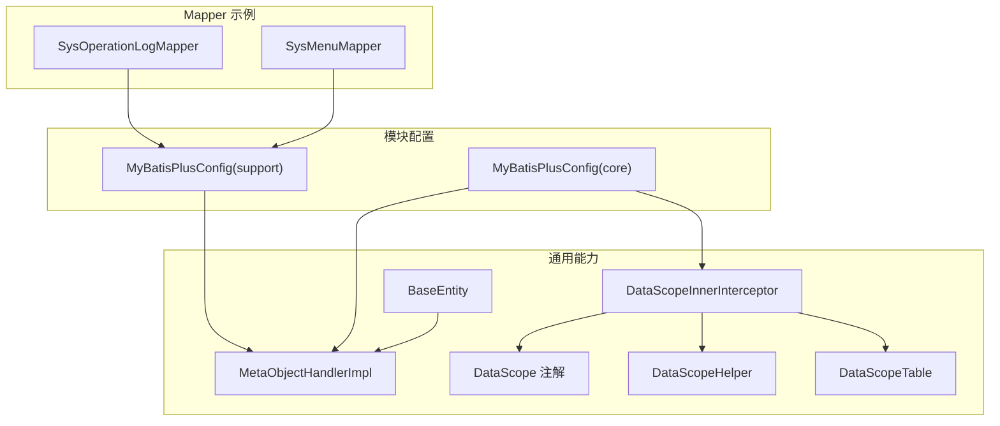
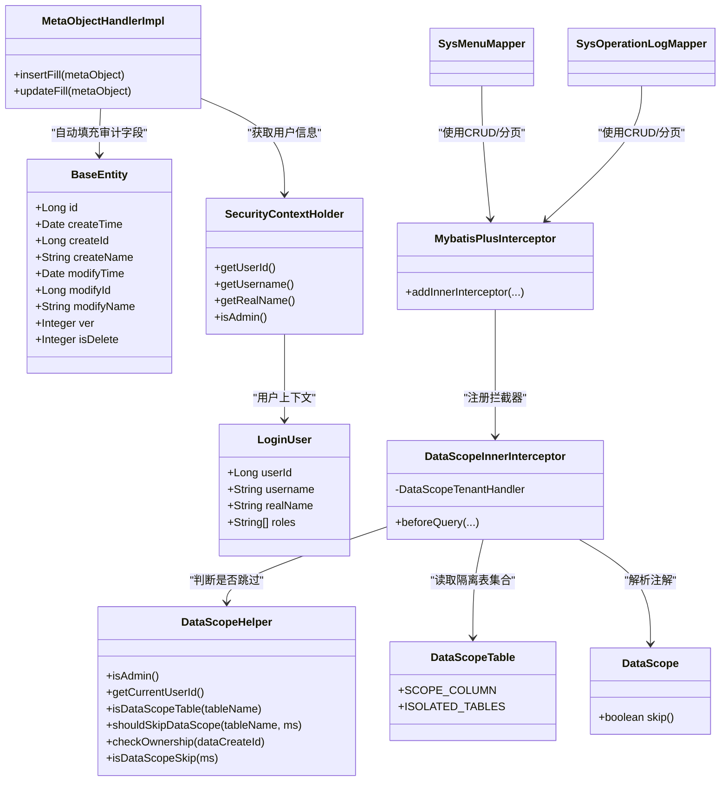
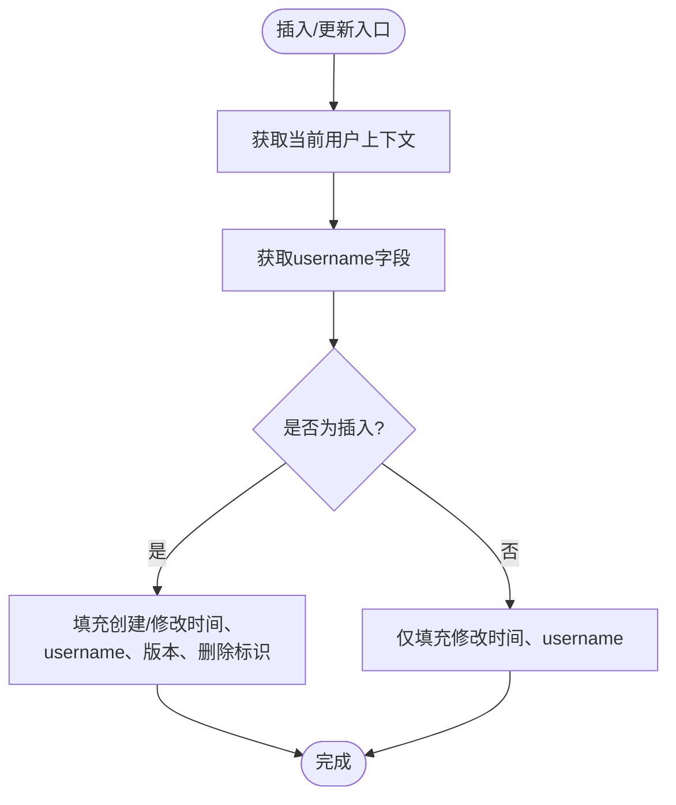
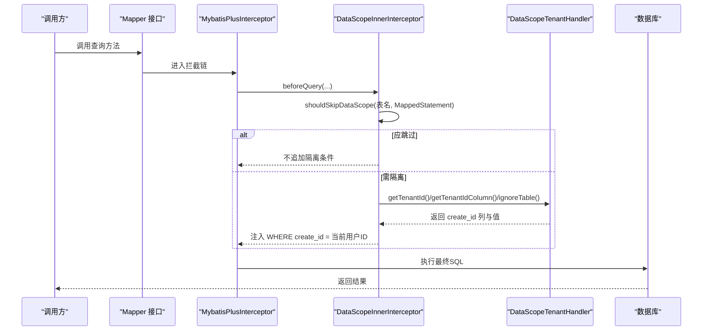
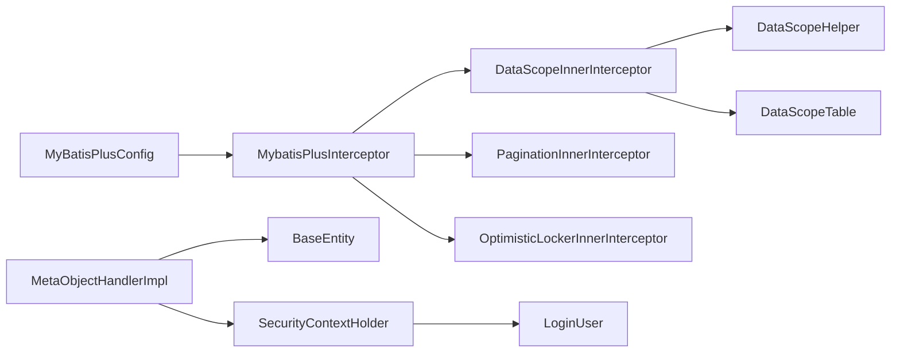

# 数据访问层封装

<cite>
**本文引用的文件**   
- [BaseEntity.java](file://ele-ai-tender-system/ele-ai-tender-common/src/main/java/com/jy/eleaitender/common/entity/base/BaseEntity.java)
- [MetaObjectHandlerImpl.java（support）](file://ele-ai-tender-system/ele-ai-tender-support/src/main/java/com/jy/eleaitender/support/handler/MetaObjectHandlerImpl.java)
- [MetaObjectHandlerImpl.java（ai）](file://ele-ai-tender-system/ele-ai-tender-ai/src/main/java/com/jy/eleaitender/ai/handler/MetaObjectHandlerImpl.java)
- [LoginUser.java](file://ele-ai-tender-system/ele-ai-tender-common/src/main/java/com/jy/eleaitender/common/security/LoginUser.java)
- [SecurityContextHolder.java](file://ele-ai-tender-system/ele-ai-tender-common/src/main/java/com/jy/eleaitender/common/security/SecurityContextHolder.java)
- [DataScope.java](file://ele-ai-tender-system/ele-ai-tender-common/src/main/java/com/jy/eleaitender/common/datascope/DataScope.java)
- [DataScopeHelper.java](file://ele-ai-tender-system/ele-ai-tender-common/src/main/java/com/jy/eleaitender/common/datascope/DataScopeHelper.java)
- [DataScopeTable.java](file://ele-ai-tender-system/ele-ai-tender-common/src/main/java/com/jy/eleaitender/common/datascope/DataScopeTable.java)
- [DataScopeInnerInterceptor.java](file://ele-ai-tender-system/ele-ai-tender-common/src/main/java/com/jy/eleaitender/common/datascope/DataScopeInnerInterceptor.java)
- [MyBatisPlusConfig.java（core）](file://ele-ai-tender-system/ele-ai-tender-core/src/main/java/com/jy/eleaitender/core/config/MyBatisPlusConfig.java)
- [MyBatisPlusConfig.java（support）](file://ele-ai-tender-system/ele-ai-tender-support/src/main/java/com/jy/eleaitender/support/config/MyBatisPlusConfig.java)
- [SysMenuMapper.java](file://ele-ai-tender-system/ele-ai-tender-support/src/main/java/com/jy/eleaitender/support/mapper/SysMenuMapper.java)
- [SysOperationLogMapper.java](file://ele-ai-tender-system/ele-ai-tender-support/src/main/java/com/jy/eleaitender/support/mapper/SysOperationLogMapper.java)
</cite>

## 更新摘要
**变更内容**   
- 更新了自动填充处理器实现，统一使用username作为创建者和更新者标识
- 改进了数据库操作的审计追踪能力，确保createName和modifyName字段准确记录用户名
- 增强了用户上下文获取逻辑，支持更完善的审计信息收集

## 目录
1. [简介](#简介)
2. [项目结构](#项目结构)
3. [核心组件](#核心组件)
4. [架构总览](#架构总览)
5. [详细组件分析](#详细组件分析)
6. [依赖关系分析](#依赖关系分析)
7. [性能与优化建议](#性能与优化建议)
8. [故障排查指南](#故障排查指南)
9. [结论](#结论)
10. [附录：扩展与自定义指南](#附录扩展与自定义指南)

## 简介
本技术文档聚焦于数据访问层的通用封装，围绕基于 MyBatis Plus 的抽象设计展开，涵盖以下关键主题：
- 基础实体类 BaseEntity 的设计与自动填充机制
- 分页查询与乐观锁插件配置
- DataScope 数据权限控制：注解、拦截器原理与多租户式隔离策略
- Mapper 接口设计规范、通用 CRUD 与复杂查询构建模式
- 数据库连接池与事务管理要点
- 性能优化建议与扩展点

## 项目结构
数据访问相关能力主要分布在 common 模块（通用能力）与各业务模块的配置与处理器中。核心文件包括：
- 通用实体与自动填充：BaseEntity、MetaObjectHandlerImpl
- 数据权限：DataScope 注解、DataScopeHelper、DataScopeTable、DataScopeInnerInterceptor
- 各模块 MP 配置：MyBatisPlusConfig（core/support 等）
- Mapper 示例：SysMenuMapper、SysOperationLogMapper

图表来源
- [BaseEntity.java:1-74](file://ele-ai-tender-system/ele-ai-tender-common/src/main/java/com/jy/eleaitender/common/entity/base/BaseEntity.java#L1-L74)
- [MetaObjectHandlerImpl.java（support）:1-44](file://ele-ai-tender-system/ele-ai-tender-support/src/main/java/com/jy/eleaitender/support/handler/MetaObjectHandlerImpl.java#L1-L44)
- [MetaObjectHandlerImpl.java（ai）:1-44](file://ele-ai-tender-system/ele-ai-tender-ai/src/main/java/com/jy/eleaitender/ai/handler/MetaObjectHandlerImpl.java#L1-L44)
- [DataScope.java:1-22](file://ele-ai-tender-system/ele-ai-tender-common/src/main/java/com/jy/eleaitender/common/datascope/DataScope.java#L1-L22)
- [DataScopeHelper.java:1-128](file://ele-ai-tender-system/ele-ai-tender-common/src/main/java/com/jy/eleaitender/common/datascope/DataScopeHelper.java#L1-L128)
- [DataScopeTable.java:1-31](file://ele-ai-tender-system/ele-ai-tender-common/src/main/java/com/jy/eleaitender/common/datascope/DataScopeTable.java#L1-L31)
- [DataScopeInnerInterceptor.java:1-78](file://ele-ai-tender-system/ele-ai-tender-common/src/main/java/com/jy/eleaitender/common/datascope/DataScopeInnerInterceptor.java#L1-L78)
- [MyBatisPlusConfig.java（core）:1-23](file://ele-ai-tender-system/ele-ai-tender-core/src/main/java/com/jy/eleaitender/core/config/MyBatisPlusConfig.java#L1-L23)
- [MyBatisPlusConfig.java（support）:1-29](file://ele-ai-tender-system/ele-ai-tender-support/src/main/java/com/jy/eleaitender/support/config/MyBatisPlusConfig.java#L1-L29)
- [SysMenuMapper.java:1-32](file://ele-ai-tender-system/ele-ai-tender-support/src/main/java/com/jy/eleaitender/support/mapper/SysMenuMapper.java#L1-L32)
- [SysOperationLogMapper.java:1-12](file://ele-ai-tender-system/ele-ai-tender-support/src/main/java/com/jy/eleaitender/support/mapper/SysOperationLogMapper.java#L1-L12)

章节来源
- [BaseEntity.java:1-74](file://ele-ai-tender-system/ele-ai-tender-common/src/main/java/com/jy/eleaitender/common/entity/base/BaseEntity.java#L1-L74)
- [MetaObjectHandlerImpl.java（support）:1-44](file://ele-ai-tender-system/ele-ai-tender-support/src/main/java/com/jy/eleaitender/support/handler/MetaObjectHandlerImpl.java#L1-L44)
- [MetaObjectHandlerImpl.java（ai）:1-44](file://ele-ai-tender-system/ele-ai-tender-ai/src/main/java/com/jy/eleaitender/ai/handler/MetaObjectHandlerImpl.java#L1-L44)
- [DataScope.java:1-22](file://ele-ai-tender-system/ele-ai-tender-common/src/main/java/com/jy/eleaitender/common/datascope/DataScope.java#L1-L22)
- [DataScopeHelper.java:1-128](file://ele-ai-tender-system/ele-ai-tender-common/src/main/java/com/jy/eleaitender/common/datascope/DataScopeHelper.java#L1-L128)
- [DataScopeTable.java:1-31](file://ele-ai-tender-system/ele-ai-tender-common/src/main/java/com/jy/eleaitender/common/datascope/DataScopeTable.java#L1-L31)
- [DataScopeInnerInterceptor.java:1-78](file://ele-ai-tender-system/ele-ai-tender-common/src/main/java/com/jy/eleaitender/common/datascope/DataScopeInnerInterceptor.java#L1-L78)
- [MyBatisPlusConfig.java（core）:1-23](file://ele-ai-tender-system/ele-ai-tender-core/src/main/java/com/jy/eleaitender/core/config/MyBatisPlusConfig.java#L1-L23)
- [MyBatisPlusConfig.java（support）:1-29](file://ele-ai-tender-system/ele-ai-tender-support/src/main/java/com/jy/eleaitender/support/config/MyBatisPlusConfig.java#L1-L29)
- [SysMenuMapper.java:1-32](file://ele-ai-tender-system/ele-ai-tender-support/src/main/java/com/jy/eleaitender/support/mapper/SysMenuMapper.java#L1-L32)
- [SysOperationLogMapper.java:1-12](file://ele-ai-tender-system/ele-ai-tender-support/src/main/java/com/jy/eleaitender/support/mapper/SysOperationLogMapper.java#L1-L12)

## 核心组件
- 基础实体 BaseEntity：统一主键、审计字段、乐观锁与逻辑删除标记，配合自动填充实现"零侵入"的元数据维护。
- 自动填充 MetaObjectHandlerImpl：在插入/更新时自动写入创建/修改时间、操作人、版本与删除标识，统一使用username作为创建者和更新者标识。
- 数据权限 DataScope：通过注解与拦截器组合，对指定表按 create_id 进行行级隔离；支持管理员与无上下文场景跳过。
- 拦截器 DataScopeInnerInterceptor：复用 TenantLineInnerInterceptor 的 SQL 改写能力，在解析阶段注入过滤条件。
- 配置 MyBatisPlusConfig：注册分页、乐观锁与数据隔离拦截器，确保执行顺序正确。

章节来源
- [BaseEntity.java:1-74](file://ele-ai-tender-system/ele-ai-tender-common/src/main/java/com/jy/eleaitender/common/entity/base/BaseEntity.java#L1-L74)
- [MetaObjectHandlerImpl.java（support）:1-44](file://ele-ai-tender-system/ele-ai-tender-support/src/main/java/com/jy/eleaitender/support/handler/MetaObjectHandlerImpl.java#L1-L44)
- [MetaObjectHandlerImpl.java（ai）:1-44](file://ele-ai-tender-system/ele-ai-tender-ai/src/main/java/com/jy/eleaitender/ai/handler/MetaObjectHandlerImpl.java#L1-L44)
- [DataScope.java:1-22](file://ele-ai-tender-system/ele-ai-tender-common/src/main/java/com/jy/eleaitender/common/datascope/DataScope.java#L1-L22)
- [DataScopeHelper.java:1-128](file://ele-ai-tender-system/ele-ai-tender-common/src/main/java/com/jy/eleaitender/common/datascope/DataScopeHelper.java#L1-L128)
- [DataScopeTable.java:1-31](file://ele-ai-tender-system/ele-ai-tender-common/src/main/java/com/jy/eleaitender/common/datascope/DataScopeTable.java#L1-L31)
- [DataScopeInnerInterceptor.java:1-78](file://ele-ai-tender-system/ele-ai-tender-common/src/main/java/com/jy/eleaitender/common/datascope/DataScopeInnerInterceptor.java#L1-L78)
- [MyBatisPlusConfig.java（core）:1-23](file://ele-ai-tender-system/ele-ai-tender-core/src/main/java/com/jy/eleaitender/core/config/MyBatisPlusConfig.java#L1-L23)

## 架构总览
下图展示了数据访问层的关键组件及其交互关系：实体与自动填充、数据权限拦截器、MP 插件链以及 Mapper 的使用方式。

图表来源
- [BaseEntity.java:1-74](file://ele-ai-tender-system/ele-ai-tender-common/src/main/java/com/jy/eleaitender/common/entity/base/BaseEntity.java#L1-L74)
- [MetaObjectHandlerImpl.java（support）:1-44](file://ele-ai-tender-system/ele-ai-tender-support/src/main/java/com/jy/eleaitender/support/handler/MetaObjectHandlerImpl.java#L1-L44)
- [MetaObjectHandlerImpl.java（ai）:1-44](file://ele-ai-tender-system/ele-ai-tender-ai/src/main/java/com/jy/eleaitender/ai/handler/MetaObjectHandlerImpl.java#L1-L44)
- [LoginUser.java:1-39](file://ele-ai-tender-system/ele-ai-tender-common/src/main/java/com/jy/eleaitender/common/security/LoginUser.java#L1-L39)
- [SecurityContextHolder.java:1-42](file://ele-ai-tender-system/ele-ai-tender-common/src/main/java/com/jy/eleaitender/common/security/SecurityContextHolder.java#L1-L42)
- [DataScope.java:1-22](file://ele-ai-tender-system/ele-ai-tender-common/src/main/java/com/jy/eleaitender/common/datascope/DataScope.java#L1-L22)
- [DataScopeHelper.java:1-128](file://ele-ai-tender-system/ele-ai-tender-common/src/main/java/com/jy/eleaitender/common/datascope/DataScopeHelper.java#L1-L128)
- [DataScopeTable.java:1-31](file://ele-ai-tender-system/ele-ai-tender-common/src/main/java/com/jy/eleaitender/common/datascope/DataScopeTable.java#L1-L31)
- [DataScopeInnerInterceptor.java:1-78](file://ele-ai-tender-system/ele-ai-tender-common/src/main/java/com/jy/eleaitender/common/datascope/DataScopeInnerInterceptor.java#L1-L78)
- [SysMenuMapper.java:1-32](file://ele-ai-tender-system/ele-ai-tender-support/src/main/java/com/jy/eleaitender/support/mapper/SysMenuMapper.java#L1-L32)
- [SysOperationLogMapper.java:1-12](file://ele-ai-tender-system/ele-ai-tender-support/src/main/java/com/jy/eleaitender/support/mapper/SysOperationLogMapper.java#L1-L12)

## 详细组件分析

### 基础实体与自动填充
- BaseEntity 提供统一的 ID、审计字段、乐观锁与逻辑删除标记，结合 @TableField(fill=...) 与 @Version/@TableLogic 完成声明式行为。
- MetaObjectHandlerImpl 在 insert/update 时自动填充时间与操作人信息，**已更新为统一使用username作为创建者和更新者标识**，缺失用户上下文时使用默认值，保证后台任务可稳定运行。

**更新** 自动填充处理器现在统一从SecurityContextHolder.getUsername()获取用户名，并设置到createName和modifyName字段，提升了审计追踪的准确性。

图表来源
- [BaseEntity.java:1-74](file://ele-ai-tender-system/ele-ai-tender-common/src/main/java/com/jy/eleaitender/common/entity/base/BaseEntity.java#L1-L74)
- [MetaObjectHandlerImpl.java（support）:1-44](file://ele-ai-tender-system/ele-ai-tender-support/src/main/java/com/jy/eleaitender/support/handler/MetaObjectHandlerImpl.java#L1-L44)
- [MetaObjectHandlerImpl.java（ai）:1-44](file://ele-ai-tender-system/ele-ai-tender-ai/src/main/java/com/jy/eleaitender/ai/handler/MetaObjectHandlerImpl.java#L1-L44)
- [SecurityContextHolder.java:1-42](file://ele-ai-tender-system/ele-ai-tender-common/src/main/java/com/jy/eleaitender/common/security/SecurityContextHolder.java#L1-L42)
- [LoginUser.java:1-39](file://ele-ai-tender-system/ele-ai-tender-common/src/main/java/com/jy/eleaitender/common/security/LoginUser.java#L1-L39)

章节来源
- [BaseEntity.java:1-74](file://ele-ai-tender-system/ele-ai-tender-common/src/main/java/com/jy/eleaitender/common/entity/base/BaseEntity.java#L1-L74)
- [MetaObjectHandlerImpl.java（support）:1-44](file://ele-ai-tender-system/ele-ai-tender-support/src/main/java/com/jy/eleaitender/support/handler/MetaObjectHandlerImpl.java#L1-L44)
- [MetaObjectHandlerImpl.java（ai）:1-44](file://ele-ai-tender-system/ele-ai-tender-ai/src/main/java/com/jy/eleaitender/ai/handler/MetaObjectHandlerImpl.java#L1-L44)
- [SecurityContextHolder.java:1-42](file://ele-ai-tender-system/ele-ai-tender-common/src/main/java/com/jy/eleaitender/common/security/SecurityContextHolder.java#L1-L42)
- [LoginUser.java:1-39](file://ele-ai-tender-system/ele-ai-tender-common/src/main/java/com/jy/eleaitender/common/security/LoginUser.java#L1-L39)

### 数据权限控制（DataScope）
- 注解 DataScope：用于方法或类级别声明是否跳过数据隔离，适用于统计、跨用户匹配等全量数据场景。
- 拦截器 DataScopeInnerInterceptor：继承 TenantLineInnerInterceptor，在 beforeQuery 前检查是否需要跳过；在 SQL 解析阶段通过 TenantLineHandler 为隔离表追加 create_id = 当前用户ID 的条件。
- 工具 DataScopeHelper：提供管理员判断、用户上下文获取、表隔离判定、MappedStatement 注解解析等方法。
- 表清单 DataScopeTable：集中声明需要按 create_id 隔离的表名集合与隔离列名。

图表来源
- [DataScopeInnerInterceptor.java:1-78](file://ele-ai-tender-system/ele-ai-tender-common/src/main/java/com/jy/eleaitender/common/datascope/DataScopeInnerInterceptor.java#L1-L78)
- [DataScopeHelper.java:1-128](file://ele-ai-tender-system/ele-ai-tender-common/src/main/java/com/jy/eleaitender/common/datascope/DataScopeHelper.java#L1-L128)
- [DataScopeTable.java:1-31](file://ele-ai-tender-system/ele-ai-tender-common/src/main/java/com/jy/eleaitender/common/datascope/DataScopeTable.java#L1-L31)
- [DataScope.java:1-22](file://ele-ai-tender-system/ele-ai-tender-common/src/main/java/com/jy/eleaitender/common/datascope/DataScope.java#L1-L22)

章节来源
- [DataScope.java:1-22](file://ele-ai-tender-system/ele-ai-tender-common/src/main/java/com/jy/eleaitender/common/datascope/DataScope.java#L1-L22)
- [DataScopeHelper.java:1-128](file://ele-ai-tender-system/ele-ai-tender-common/src/main/java/com/jy/eleaitender/common/datascope/DataScopeHelper.java#L1-L128)
- [DataScopeTable.java:1-31](file://ele-ai-tender-system/ele-ai-tender-common/src/main/java/com/jy/eleaitender/common/datascope/DataScopeTable.java#L1-L31)
- [DataScopeInnerInterceptor.java:1-78](file://ele-ai-tender-system/ele-ai-tender-common/src/main/java/com/jy/eleaitender/common/datascope/DataScopeInnerInterceptor.java#L1-L78)

### 分页与乐观锁
- 分页：通过 PaginationInnerInterceptor 启用，针对 MySQL 类型进行分页 SQL 改写。
- 乐观锁：通过 OptimisticLockerInnerInterceptor 启用，配合实体的 @Version 字段实现并发控制。
- 插件顺序：数据隔离拦截器需在分页之前注册，以确保先注入隔离条件再计算分页。

章节来源
- [MyBatisPlusConfig.java（core）:1-23](file://ele-ai-tender-system/ele-ai-tender-core/src/main/java/com/jy/eleaitender/core/config/MyBatisPlusConfig.java#L1-L23)
- [MyBatisPlusConfig.java（support）:1-29](file://ele-ai-tender-system/ele-ai-tender-support/src/main/java/com/jy/eleaitender/support/config/MyBatisPlusConfig.java#L1-L29)
- [BaseEntity.java:1-74](file://ele-ai-tender-system/ele-ai-tender-common/src/main/java/com/jy/eleaitender/common/entity/base/BaseEntity.java#L1-L74)

### Mapper 接口设计规范与复杂查询
- 规范：
  - 继承 BaseMapper<T> 获得通用 CRUD 能力。
  - 复杂查询优先使用 Wrapper 构建；必要时以 @Select 编写原生 SQL。
  - 涉及权限控制的查询方法可按需标注 @DataScope(skip=true)。
- 示例：
  - 简单 CRUD：SysOperationLogMapper 直接继承 BaseMapper。
  - 复杂查询：SysMenuMapper 使用 @Select 拼接多表关联与状态过滤。

章节来源
- [SysOperationLogMapper.java:1-12](file://ele-ai-tender-system/ele-ai-tender-support/src/main/java/com/jy/eleaitender/support/mapper/SysOperationLogMapper.java#L1-L12)
- [SysMenuMapper.java:1-32](file://ele-ai-tender-system/ele-ai-tender-support/src/main/java/com/jy/eleaitender/support/mapper/SysMenuMapper.java#L1-L32)

## 依赖关系分析
- 模块内依赖：
  - core/support 模块的 MyBatisPlusConfig 负责注册分页、乐观锁与数据隔离拦截器。
  - DataScopeInnerInterceptor 依赖 DataScopeHelper 与 DataScopeTable 完成运行时决策。
  - MetaObjectHandlerImpl 依赖安全上下文填充审计字段，**现已统一使用username字段**。
- 外部依赖：
  - MyBatis-Plus 插件体系（Pagination/OptimisticLocker/TenantLine）。
  - JSqlParser 表达式构造（在拦截器内部使用）。

图表来源
- [MyBatisPlusConfig.java（core）:1-23](file://ele-ai-tender-system/ele-ai-tender-core/src/main/java/com/jy/eleaitender/core/config/MyBatisPlusConfig.java#L1-L23)
- [DataScopeInnerInterceptor.java:1-78](file://ele-ai-tender-system/ele-ai-tender-common/src/main/java/com/jy/eleaitender/common/datascope/DataScopeInnerInterceptor.java#L1-L78)
- [DataScopeHelper.java:1-128](file://ele-ai-tender-system/ele-ai-tender-common/src/main/java/com/jy/eleaitender/common/datascope/DataScopeHelper.java#L1-L128)
- [DataScopeTable.java:1-31](file://ele-ai-tender-system/ele-ai-tender-common/src/main/java/com/jy/eleaitender/common/datascope/DataScopeTable.java#L1-L31)
- [MetaObjectHandlerImpl.java（support）:1-44](file://ele-ai-tender-system/ele-ai-tender-support/src/main/java/com/jy/eleaitender/support/handler/MetaObjectHandlerImpl.java#L1-L44)
- [MetaObjectHandlerImpl.java（ai）:1-44](file://ele-ai-tender-system/ele-ai-tender-ai/src/main/java/com/jy/eleaitender/ai/handler/MetaObjectHandlerImpl.java#L1-L44)
- [BaseEntity.java:1-74](file://ele-ai-tender-system/ele-ai-tender-common/src/main/java/com/jy/eleaitender/common/entity/base/BaseEntity.java#L1-L74)
- [SecurityContextHolder.java:1-42](file://ele-ai-tender-system/ele-ai-tender-common/src/main/java/com/jy/eleaitender/common/security/SecurityContextHolder.java#L1-L42)
- [LoginUser.java:1-39](file://ele-ai-tender-system/ele-ai-tender-common/src/main/java/com/jy/eleaitender/common/security/LoginUser.java#L1-L39)

## 性能与优化建议
- 插件顺序：数据隔离拦截器必须在分页拦截器之前注册，避免分页计算后再注入过滤条件导致错误结果。
- 索引建议：为隔离列 create_id 建立合适索引，提升按用户维度过滤的性能。
- 批量操作：尽量使用批量插入/更新减少往返开销；注意乐观锁在批量场景下的语义。
- 复杂查询：优先使用 Wrapper 构建条件，避免手写 SQL 带来的维护成本；确需手写 SQL 时注意参数化与 N+1 问题。
- 线程池与调度：后台任务若无用户上下文，将跳过数据隔离，但需确保不会误写敏感数据。
- **审计性能**：username字段的获取通过ThreadLocal缓存，避免了重复的用户信息查询开销。

[本节为通用指导，无需源码引用]

## 故障排查指南
- 现象：后台调度器 UPDATE 静默失败
  - 原因：无用户上下文时若未跳过隔离，可能生成 create_id IS NULL 条件导致无影响行数。
  - 处理：确认 DataScopeInnerInterceptor.ignoreTable() 在无用户上下文时已跳过；或在必要处使用 @DataScope(skip=true)。
- 现象：管理员无法看到其他用户数据
  - 原因：管理员判断或上下文加载异常。
  - 处理：检查 SecurityContextHolder 的实现与上下文传播链路。
- 现象：分页结果不正确
  - 原因：插件顺序错误或隔离条件未生效。
  - 处理：核对 MyBatisPlusConfig 中拦截器注册顺序，确保数据隔离在分页之前。
- **新现象：审计字段显示system而非实际用户名**
  - 原因：用户上下文中的username字段为空或未正确设置。
  - 处理：检查登录流程中LoginUser对象的username字段是否正确赋值，确认SecurityContextHolder.setLoginUser()调用时机。

章节来源
- [DataScopeInnerInterceptor.java:1-78](file://ele-ai-tender-system/ele-ai-tender-common/src/main/java/com/jy/eleaitender/common/datascope/DataScopeInnerInterceptor.java#L1-L78)
- [DataScopeHelper.java:1-128](file://ele-ai-tender-system/ele-ai-tender-common/src/main/java/com/jy/eleaitender/common/datascope/DataScopeHelper.java#L1-L128)
- [MyBatisPlusConfig.java（core）:1-23](file://ele-ai-tender-system/ele-ai-tender-core/src/main/java/com/jy/eleaitender/core/config/MyBatisPlusConfig.java#L1-L23)
- [SecurityContextHolder.java:1-42](file://ele-ai-tender-system/ele-ai-tender-common/src/main/java/com/jy/eleaitender/common/security/SecurityContextHolder.java#L1-L42)
- [LoginUser.java:1-39](file://ele-ai-tender-system/ele-ai-tender-common/src/main/java/com/jy/eleaitender/common/security/LoginUser.java#L1-L39)

## 结论
本项目在数据访问层通过 BaseEntity 与自动填充实现了统一的审计与并发控制；**最新改进统一使用username作为创建者和更新者标识，显著提升了审计追踪的准确性和一致性**。借助 DataScope 注解与拦截器，完成了基于 create_id 的行级数据隔离，并兼容管理员与无上下文场景；通过 MyBatis-Plus 插件链提供了分页与乐观锁能力。整体设计清晰、可扩展性强，适合在多租户与多角色场景下演进。

[本节为总结性内容，无需源码引用]

## 附录：扩展与自定义指南
- 新增隔离表：在 DataScopeTable.ISOLATED_TABLES 中添加表名，并确保表包含 create_id 列。
- 新增自动填充字段：在 BaseEntity 增加字段并标注 fill 策略，同时在 MetaObjectHandlerImpl 中补充填充逻辑。
- **自定义用户名获取逻辑**：如需使用不同的用户名字段，可修改 MetaObjectHandlerImpl 中的 SecurityContextHolder.getUsername() 调用逻辑。
- 自定义权限策略：扩展 DataScopeHelper 的判断逻辑，或在拦截器中增加新的跳过条件。
- 复杂查询模板：封装常用 QueryWrapper 构建器，统一排序、分页与过滤条件。
- 事务管理：在 Service 层使用 @Transactional 控制边界；注意长事务与隔离级别选择。
- 连接池配置：根据实际负载调整连接池大小、超时与回收策略，并结合慢查询日志定位瓶颈。
- **审计字段扩展**：如需添加更多审计信息，可在 LoginUser 中扩展字段并在 MetaObjectHandlerImpl 中相应处理。

[本节为通用指导，无需源码引用]