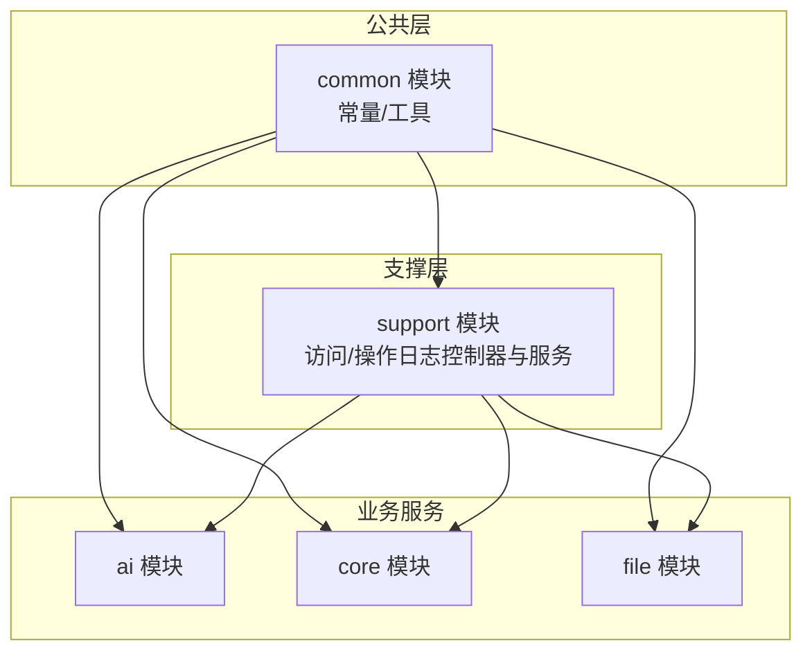
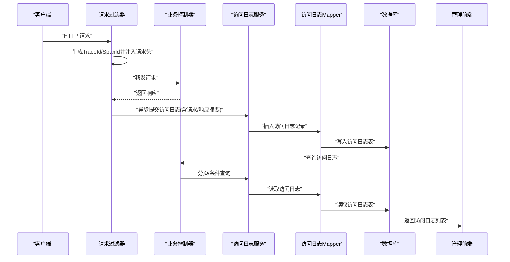
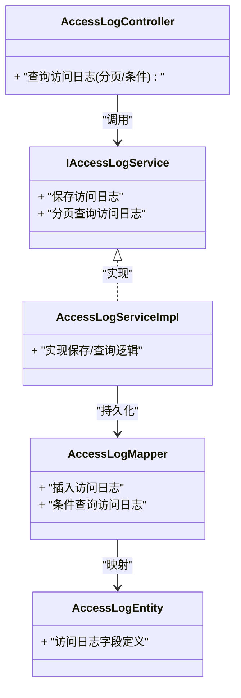
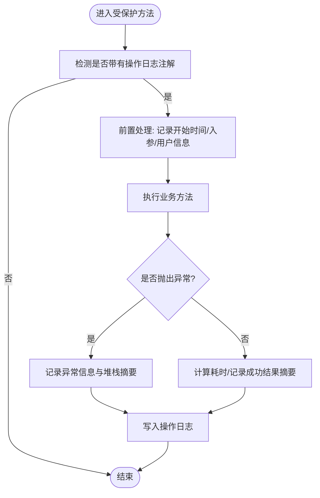
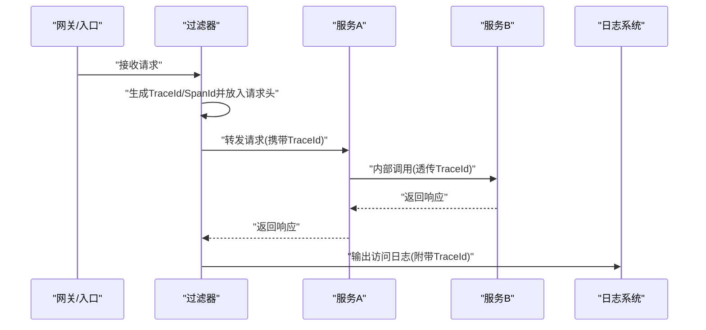
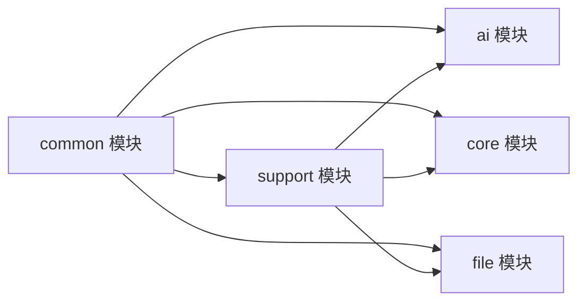

# 日志记录与链路追踪

<cite>
**本文引用的文件**   
- [ele-ai-tender-common/pom.xml](file://ele-ai-tender-system/ele-ai-tender-common/pom.xml)
- [ele-ai-tender-core/src/main/resources/logback-spring.xml](file://ele-ai-tender-system/ele-ai-tender-core/src/main/resources/logback-spring.xml)
- [ele-ai-tender-core/src/main/resources/logging-spring.xml](file://ele-ai-tender-system/ele-ai-tender-core/src/main/resources/logging-spring.xml)
- [ele-ai-tender-ai/src/main/resources/logback-spring.xml](file://ele-ai-tender-system/ele-ai-tender-ai/src/main/resources/logback-spring.xml)
- [ele-ai-tender-ai/src/main/resources/logging-spring.xml](file://ele-ai-tender-system/ele-ai-tender-ai/src/main/resources/logging-spring.xml)
- [ele-ai-tender-file/src/main/resources/logback-spring.xml](file://ele-ai-tender-system/ele-ai-tender-file/src/main/resources/logback-spring.xml)
- [ele-ai-tender-file/src/main/resources/logging-spring.xml](file://ele-ai-tender-system/ele-ai-tender-file/src/main/resources/logging-spring.xml)
- [ele-ai-tender-support/src/main/resources/logback-spring.xml](file://ele-ai-tender-system/ele-ai-tender-support/src/main/resources/logback-spring.xml)
- [ele-ai-tender-support/src/main/resources/logging-spring.xml](file://ele-ai-tender-system/ele-ai-tender-support/src/main/resources/logging-spring.xml)
- [ele-ai-tender-support/src/main/java/com/jy/eleaitender/support/controller/AccessLogController.java](file://ele-ai-tender-system/ele-ai-tender-support/src/main/java/com/jy/eleaitender/support/controller/AccessLogController.java)
- [ele-ai-tender-support/src/main/java/com/jy/eleaitender/support/controller/OperationLogController.java](file://ele-ai-tender-system/ele-ai-tender-support/src/main/java/com/jy/eleaitender/support/controller/OperationLogController.java)
- [ele-ai-tender-support/src/main/java/com/jy/eleaitender/support/service/IAccessLogService.java](file://ele-ai-tender-system/ele-ai-tender-support/src/main/java/com/jy/eleaitender/support/service/IAccessLogService.java)
- [ele-ai-tender-support/src/main/java/com/jy/eleaitender/support/service/impl/AccessLogServiceImpl.java](file://ele-ai-tender-system/ele-ai-tender-support/src/main/java/com/jy/eleaitender/support/service/impl/AccessLogServiceImpl.java)
- [ele-ai-tender-support/src/main/java/com/jy/eleaitender/support/mapper/AccessLogMapper.java](file://ele-ai-tender-system/ele-ai-tender-support/src/main/java/com/jy/eleaitender/support/mapper/AccessLogMapper.java)
- [ele-ai-tender-support/src/main/java/com/jy/eleaitender/support/entity/AccessLogEntity.java](file://ele-ai-tender-system/ele-ai-tender-support/src/main/java/com/jy/eleaitender/support/entity/AccessLogEntity.java)
- [ele-ai-tender-support/src/main/java/com/jy/eleaitender/support/entity/OperationLogEntity.java](file://ele-ai-tender-system/ele-ai-tender-support/src/main/java/com/jy/eleaitender/support/entity/OperationLogEntity.java)
- [ele-ai-tender-support/src/main/java/com/jy/eleaitender/support/aspect/OperationLogAspect.java](file://ele-ai-tender-system/ele-ai-tender-support/src/main/java/com/jy/eleaitender/support/aspect/OperationLogAspect.java)
- [ele-ai-tender-support/src/main/java/com/jy/eleaitender/support/security/annotation/RequireLogin.java](file://ele-ai-tender-system/ele-ai-tender-support/src/main/java/com/jy/eleaitender/support/security/annotation/RequireLogin.java)
- [ele-ai-tender-common/src/main/java/com/jy/eleaitender/common/constant/CommonConstant.java](file://ele-ai-tender-system/ele-ai-tender-common/src/main/java/com/jy/eleaitender/common/constant/CommonConstant.java)
- [ele-ai-tender-common/src/main/java/com/jy/eleaitender/common/util/JsonUtil.java](file://ele-ai-tender-system/ele-ai-tender-common/src/main/java/com/jy/eleaitender/common/util/JsonUtil.java)
- [ele-ai-tender-support/sql/init.sql](file://ele-ai-tender-system/ele-ai-tender-support/sql/init.sql)
</cite>

## 目录
1. [简介](#简介)
2. [项目结构](#项目结构)
3. [核心组件](#核心组件)
4. [架构总览](#架构总览)
5. [详细组件分析](#详细组件分析)
6. [依赖关系分析](#依赖关系分析)
7. [性能考虑](#性能考虑)
8. [故障排查指南](#故障排查指南)
9. [结论](#结论)
10. [附录](#附录)

## 简介
本技术文档围绕“日志记录与链路追踪”主题，结合仓库中多模块的日志配置、访问日志与操作日志能力，系统性说明以下要点：
- 分布式链路追踪上下文传递方案（基于请求头透传）
- 常量定义与通用工具在日志中的使用
- 访问日志过滤器与服务持久化流程
- 操作日志注解与AOP切面采集
- 敏感信息脱敏策略
- 日志级别管理、异步写入与轮转配置
- ELK集成、查询分析与告警通知建议
- 日志规范与故障诊断最佳实践

## 项目结构
本项目采用多模块微服务架构，日志相关能力分布在如下位置：
- 公共能力：常量、JSON工具等位于 common 模块
- 业务支撑：访问日志、操作日志实体、Mapper、Service、Controller、AOP 切面位于 support 模块
- 各业务服务：AI、Core、File 等模块各自包含 logback-spring.xml 与 logging-spring.xml 用于日志输出与级别控制

[本节为概览性描述，不直接分析具体文件]

## 核心组件
- 常量与通用工具
  - 常量定义：统一键名、字段名、默认值等，便于跨模块一致地记录与解析日志。
  - JSON工具：提供序列化/反序列化能力，用于结构化记录请求/响应体或上下文数据。
- 访问日志
  - 控制器：对外暴露访问日志查询接口，供前端展示与检索。
  - 服务与持久化：封装访问日志的入库逻辑，支持分页与条件查询。
  - 实体与映射：定义访问日志表结构与MyBatis映射。
- 操作日志
  - 注解：通过自定义注解标记需要记录的操作点。
  - AOP切面：拦截注解方法，提取入参、出参、耗时、异常等信息并落库。
- 安全与鉴权
  - 登录校验注解：配合全局处理，确保访问日志能关联到用户身份。

章节来源
- [ele-ai-tender-common/src/main/java/com/jy/eleaitender/common/constant/CommonConstant.java](file://ele-ai-tender-system/ele-ai-tender-common/src/main/java/com/jy/eleaitender/common/constant/CommonConstant.java)
- [ele-ai-tender-common/src/main/java/com/jy/eleaitender/common/util/JsonUtil.java](file://ele-ai-tender-system/ele-ai-tender-common/src/main/java/com/jy/eleaitender/common/util/JsonUtil.java)
- [ele-ai-tender-support/src/main/java/com/jy/eleaitender/support/controller/AccessLogController.java](file://ele-ai-tender-system/ele-ai-tender-support/src/main/java/com/jy/eleaitender/support/controller/AccessLogController.java)
- [ele-ai-tender-support/src/main/java/com/jy/eleaitender/support/controller/OperationLogController.java](file://ele-ai-tender-system/ele-ai-tender-support/src/main/java/com/jy/eleaitender/support/controller/OperationLogController.java)
- [ele-ai-tender-support/src/main/java/com/jy/eleaitender/support/service/IAccessLogService.java](file://ele-ai-tender-system/ele-ai-tender-support/src/main/java/com/jy/eleaitender/support/service/IAccessLogService.java)
- [ele-ai-tender-support/src/main/java/com/jy/eleaitender/support/service/impl/AccessLogServiceImpl.java](file://ele-ai-tender-system/ele-ai-tender-support/src/main/java/com/jy/eleaitender/support/service/impl/AccessLogServiceImpl.java)
- [ele-ai-tender-support/src/main/java/com/jy/eleaitender/support/mapper/AccessLogMapper.java](file://ele-ai-tender-system/ele-ai-tender-support/src/main/java/com/jy/eleaitender/support/mapper/AccessLogMapper.java)
- [ele-ai-tender-support/src/main/java/com/jy/eleaitender/support/entity/AccessLogEntity.java](file://ele-ai-tender-system/ele-ai-tender-support/src/main/java/com/jy/eleaitender/support/entity/AccessLogEntity.java)
- [ele-ai-tender-support/src/main/java/com/jy/eleaitender/support/entity/OperationLogEntity.java](file://ele-ai-tender-system/ele-ai-tender-support/src/main/java/com/jy/eleaitender/support/entity/OperationLogEntity.java)
- [ele-ai-tender-support/src/main/java/com/jy/eleaitender/support/aspect/OperationLogAspect.java](file://ele-ai-tender-system/ele-ai-tender-support/src/main/java/com/jy/eleaitender/support/aspect/OperationLogAspect.java)
- [ele-ai-tender-support/src/main/java/com/jy/eleaitender/support/security/annotation/RequireLogin.java](file://ele-ai-tender-system/ele-ai-tender-support/src/main/java/com/jy/eleaitender/support/security/annotation/RequireLogin.java)

## 架构总览
下图展示了访问日志从请求进入、过滤收集、服务持久化到查询展示的端到端流程；同时标注了操作日志通过注解+AOP采集的关键路径。

图表来源
- [ele-ai-tender-support/src/main/java/com/jy/eleaitender/support/controller/AccessLogController.java](file://ele-ai-tender-system/ele-ai-tender-support/src/main/java/com/jy/eleaitender/support/controller/AccessLogController.java)
- [ele-ai-tender-support/src/main/java/com/jy/eleaitender/support/service/IAccessLogService.java](file://ele-ai-tender-system/ele-ai-tender-support/src/main/java/com/jy/eleaitender/support/service/IAccessLogService.java)
- [ele-ai-tender-support/src/main/java/com/jy/eleaitender/support/service/impl/AccessLogServiceImpl.java](file://ele-ai-tender-system/ele-ai-tender-support/src/main/java/com/jy/eleaitender/support/service/impl/AccessLogServiceImpl.java)
- [ele-ai-tender-support/src/main/java/com/jy/eleaitender/support/mapper/AccessLogMapper.java](file://ele-ai-tender-system/ele-ai-tender-support/src/main/java/com/jy/eleaitender/support/mapper/AccessLogMapper.java)
- [ele-ai-tender-support/src/main/java/com/jy/eleaitender/support/entity/AccessLogEntity.java](file://ele-ai-tender-system/ele-ai-tender-support/src/main/java/com/jy/eleaitender/support/entity/AccessLogEntity.java)

章节来源
- [ele-ai-tender-support/src/main/java/com/jy/eleaitender/support/controller/AccessLogController.java](file://ele-ai-tender-system/ele-ai-tender-support/src/main/java/com/jy/eleaitender/support/controller/AccessLogController.java)
- [ele-ai-tender-support/src/main/java/com/jy/eleaitender/support/service/impl/AccessLogServiceImpl.java](file://ele-ai-tender-system/ele-ai-tender-support/src/main/java/com/jy/eleaitender/support/service/impl/AccessLogServiceImpl.java)
- [ele-ai-tender-support/src/main/java/com/jy/eleaitender/support/mapper/AccessLogMapper.java](file://ele-ai-tender-system/ele-ai-tender-support/src/main/java/com/jy/eleaitender/support/mapper/AccessLogMapper.java)
- [ele-ai-tender-support/src/main/java/com/jy/eleaitender/support/entity/AccessLogEntity.java](file://ele-ai-tender-system/ele-ai-tender-support/src/main/java/com/jy/eleaitender/support/entity/AccessLogEntity.java)

## 详细组件分析

### 访问日志组件
- 职责
  - 捕获HTTP请求/响应关键信息（如URL、方法、状态码、耗时、客户端IP、用户标识等）。
  - 将访问日志持久化至数据库，并提供查询接口。
- 关键类与方法
  - 控制器：提供访问日志的分页与条件查询API。
  - 服务接口与实现：封装访问日志的保存与查询逻辑。
  - 实体与Mapper：定义访问日志表字段与SQL映射。
- 数据流
  - 请求进入 -> 过滤器收集 -> 服务持久化 -> 控制器查询 -> 前端展示。

图表来源
- [ele-ai-tender-support/src/main/java/com/jy/eleaitender/support/controller/AccessLogController.java](file://ele-ai-tender-system/ele-ai-tender-support/src/main/java/com/jy/eleaitender/support/controller/AccessLogController.java)
- [ele-ai-tender-support/src/main/java/com/jy/eleaitender/support/service/IAccessLogService.java](file://ele-ai-tender-system/ele-ai-tender-support/src/main/java/com/jy/eleaitender/support/service/IAccessLogService.java)
- [ele-ai-tender-support/src/main/java/com/jy/eleaitender/support/service/impl/AccessLogServiceImpl.java](file://ele-ai-tender-system/ele-ai-tender-support/src/main/java/com/jy/eleaitender/support/service/impl/AccessLogServiceImpl.java)
- [ele-ai-tender-support/src/main/java/com/jy/eleaitender/support/mapper/AccessLogMapper.java](file://ele-ai-tender-system/ele-ai-tender-support/src/main/java/com/jy/eleaitender/support/mapper/AccessLogMapper.java)
- [ele-ai-tender-support/src/main/java/com/jy/eleaitender/support/entity/AccessLogEntity.java](file://ele-ai-tender-system/ele-ai-tender-support/src/main/java/com/jy/eleaitender/support/entity/AccessLogEntity.java)

章节来源
- [ele-ai-tender-support/src/main/java/com/jy/eleaitender/support/controller/AccessLogController.java](file://ele-ai-tender-system/ele-ai-tender-support/src/main/java/com/jy/eleaitender/support/controller/AccessLogController.java)
- [ele-ai-tender-support/src/main/java/com/jy/eleaitender/support/service/impl/AccessLogServiceImpl.java](file://ele-ai-tender-system/ele-ai-tender-support/src/main/java/com/jy/eleaitender/support/service/impl/AccessLogServiceImpl.java)
- [ele-ai-tender-support/src/main/java/com/jy/eleaitender/support/mapper/AccessLogMapper.java](file://ele-ai-tender-system/ele-ai-tender-support/src/main/java/com/jy/eleaitender/support/mapper/AccessLogMapper.java)
- [ele-ai-tender-support/src/main/java/com/jy/eleaitender/support/entity/AccessLogEntity.java](file://ele-ai-tender-system/ele-ai-tender-support/src/main/java/com/jy/eleaitender/support/entity/AccessLogEntity.java)

### 操作日志组件
- 职责
  - 通过注解标记业务方法，自动采集操作行为（如操作人、模块、动作、参数、结果、耗时、异常等），并持久化。
- 关键类与方法
  - 注解：RequireLogin 作为示例的安全注解，可配合AOP进行权限与审计增强。
  - 切面：OperationLogAspect 负责拦截带注解的方法，组装操作日志对象并落库。
  - 实体：OperationLogEntity 定义操作日志表结构。
- 流程
  - 方法被注解标记 -> AOP拦截 -> 提取上下文与参数 -> 执行目标方法 -> 捕获异常与耗时 -> 写入操作日志。

图表来源
- [ele-ai-tender-support/src/main/java/com/jy/eleaitender/support/aspect/OperationLogAspect.java](file://ele-ai-tender-system/ele-ai-tender-support/src/main/java/com/jy/eleaitender/support/aspect/OperationLogAspect.java)
- [ele-ai-tender-support/src/main/java/com/jy/eleaitender/support/entity/OperationLogEntity.java](file://ele-ai-tender-system/ele-ai-tender-support/src/main/java/com/jy/eleaitender/support/entity/OperationLogEntity.java)
- [ele-ai-tender-support/src/main/java/com/jy/eleaitender/support/security/annotation/RequireLogin.java](file://ele-ai-tender-system/ele-ai-tender-support/src/main/java/com/jy/eleaitender/support/security/annotation/RequireLogin.java)

章节来源
- [ele-ai-tender-support/src/main/java/com/jy/eleaitender/support/aspect/OperationLogAspect.java](file://ele-ai-tender-system/ele-ai-tender-support/src/main/java/com/jy/eleaitender/support/aspect/OperationLogAspect.java)
- [ele-ai-tender-support/src/main/java/com/jy/eleaitender/support/entity/OperationLogEntity.java](file://ele-ai-tender-system/ele-ai-tender-support/src/main/java/com/jy/eleaitender/support/entity/OperationLogEntity.java)
- [ele-ai-tender-support/src/main/java/com/jy/eleaitender/support/security/annotation/RequireLogin.java](file://ele-ai-tender-system/ele-ai-tender-support/src/main/java/com/jy/eleaitender/support/security/annotation/RequireLogin.java)

### 链路追踪上下文传递
- 设计思路
  - 在请求入口处生成唯一TraceId与可选SpanId，并将其注入请求头，随后续服务调用透传。
  - 在日志输出时附加TraceId，以便跨服务聚合与问题定位。
- 关键点
  - 过滤器：负责生成/透传TraceId，并在请求结束时记录访问日志。
  - 常量：定义统一的请求头键名，避免硬编码导致不一致。
  - 工具：使用JSON工具对复杂数据进行序列化，便于存储与分析。

[本节为概念性流程图，未直接映射具体源码文件]

### 敏感信息脱敏处理
- 原则
  - 对手机号、身份证、银行卡、密码等敏感字段进行掩码或哈希处理后再落库。
- 实现建议
  - 在过滤器或服务层对请求/响应体进行脱敏。
  - 借助JSON工具进行字段级替换或格式化。
  - 提供可配置的脱敏规则，按环境切换开关。

[本节为通用指导，不直接分析具体文件]

## 依赖关系分析
- 模块内依赖
  - support 模块依赖 common 模块提供的常量与工具。
  - 各业务服务（ai/core/file）依赖 support 模块提供的访问/操作日志能力。
- 外部依赖
  - MyBatis：用于访问日志与操作日志的持久化。
  - Logback/Spring Logging：用于控制台/文件输出与级别控制。

图表来源
- [ele-ai-tender-common/pom.xml](file://ele-ai-tender-system/ele-ai-tender-common/pom.xml)

章节来源
- [ele-ai-tender-common/pom.xml](file://ele-ai-tender-system/ele-ai-tender-common/pom.xml)

## 性能考虑
- 日志级别管理
  - 通过 logback-spring.xml 与 logging-spring.xml 控制不同模块的日志级别，生产环境建议降低DEBUG级别，仅保留INFO及以上。
- 异步写入
  - 访问日志建议在过滤器中异步提交，避免阻塞主线程；可使用线程池或消息队列缓冲。
- 日志轮转
  - 配置按天/大小轮转，限制单文件大小与保留天数，避免磁盘爆满。
- 采样与限流
  - 高并发场景下可对访问日志进行采样，或对慢请求全量记录、快请求抽样记录。
- 索引优化
  - 为访问日志与操作日志表建立合适索引（如时间、用户ID、TraceId、URL等），提升查询性能。

章节来源
- [ele-ai-tender-core/src/main/resources/logback-spring.xml](file://ele-ai-tender-system/ele-ai-tender-core/src/main/resources/logback-spring.xml)
- [ele-ai-tender-core/src/main/resources/logging-spring.xml](file://ele-ai-tender-system/ele-ai-tender-core/src/main/resources/logging-spring.xml)
- [ele-ai-tender-ai/src/main/resources/logback-spring.xml](file://ele-ai-tender-system/ele-ai-tender-ai/src/main/resources/logback-spring.xml)
- [ele-ai-tender-ai/src/main/resources/logging-spring.xml](file://ele-ai-tender-system/ele-ai-tender-ai/src/main/resources/logging-spring.xml)
- [ele-ai-tender-file/src/main/resources/logback-spring.xml](file://ele-ai-tender-system/ele-ai-tender-file/src/main/resources/logback-spring.xml)
- [ele-ai-tender-file/src/main/resources/logging-spring.xml](file://ele-ai-tender-system/ele-ai-tender-file/src/main/resources/logging-spring.xml)
- [ele-ai-tender-support/src/main/resources/logback-spring.xml](file://ele-ai-tender-system/ele-ai-tender-support/src/main/resources/logback-spring.xml)
- [ele-ai-tender-support/src/main/resources/logging-spring.xml](file://ele-ai-tender-system/ele-ai-tender-support/src/main/resources/logging-spring.xml)

## 故障排查指南
- 快速定位
  - 使用TraceId在ELK中聚合同一请求的全链路日志，快速定位失败节点。
  - 通过访问日志的时间戳、状态码、耗时筛选异常请求。
- 常见问题
  - TraceId丢失：检查过滤器是否正确注入/透传请求头。
  - 日志缺失：确认异步写入是否成功，检查线程池/队列是否饱和。
  - 性能抖动：评估日志级别与采样策略，必要时降级非关键日志。
- 数据一致性
  - 访问日志与操作日志应包含一致的TraceId与用户信息，便于交叉验证。
- 告警与通知
  - 针对错误率、慢请求比例、日志写入失败等指标设置阈值告警，及时通知运维与研发。

[本节为通用指导，不直接分析具体文件]

## 结论
通过统一的常量与工具、完善的访问/操作日志体系、以及合理的日志级别与异步策略，本项目实现了可观测性强、易排障的日志与链路追踪能力。建议在生产环境中持续优化采样与轮转策略，并结合ELK构建完整的日志分析平台与告警体系。

[本节为总结性内容，不直接分析具体文件]

## 附录
- 数据库初始化
  - 访问日志与操作日志表结构可在 support 模块的初始化脚本中查看。
- 参考文件
  - 访问日志实体与Mapper：[AccessLogEntity](file://ele-ai-tender-system/ele-ai-tender-support/src/main/java/com/jy/eleaitender/support/entity/AccessLogEntity.java)、[AccessLogMapper](file://ele-ai-tender-system/ele-ai-tender-support/src/main/java/com/jy/eleaitender/support/mapper/AccessLogMapper.java)
  - 操作日志实体：[OperationLogEntity](file://ele-ai-tender-system/ele-ai-tender-support/src/main/java/com/jy/eleaitender/support/entity/OperationLogEntity.java)
  - 初始化脚本：[init.sql](file://ele-ai-tender-system/ele-ai-tender-support/sql/init.sql)

章节来源
- [ele-ai-tender-support/src/main/java/com/jy/eleaitender/support/entity/AccessLogEntity.java](file://ele-ai-tender-system/ele-ai-tender-support/src/main/java/com/jy/eleaitender/support/entity/AccessLogEntity.java)
- [ele-ai-tender-support/src/main/java/com/jy/eleaitender/support/mapper/AccessLogMapper.java](file://ele-ai-tender-system/ele-ai-tender-support/src/main/java/com/jy/eleaitender/support/mapper/AccessLogMapper.java)
- [ele-ai-tender-support/src/main/java/com/jy/eleaitender/support/entity/OperationLogEntity.java](file://ele-ai-tender-system/ele-ai-tender-support/src/main/java/com/jy/eleaitender/support/entity/OperationLogEntity.java)
- [ele-ai-tender-support/sql/init.sql](file://ele-ai-tender-system/ele-ai-tender-support/sql/init.sql)