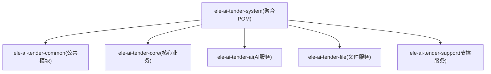
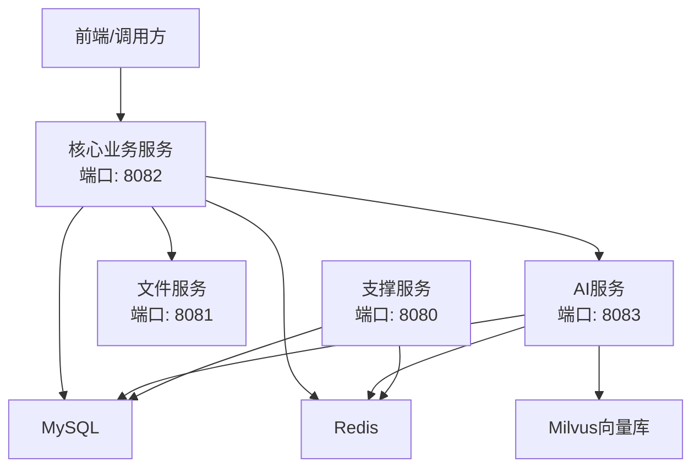
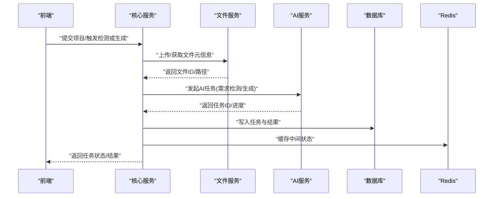
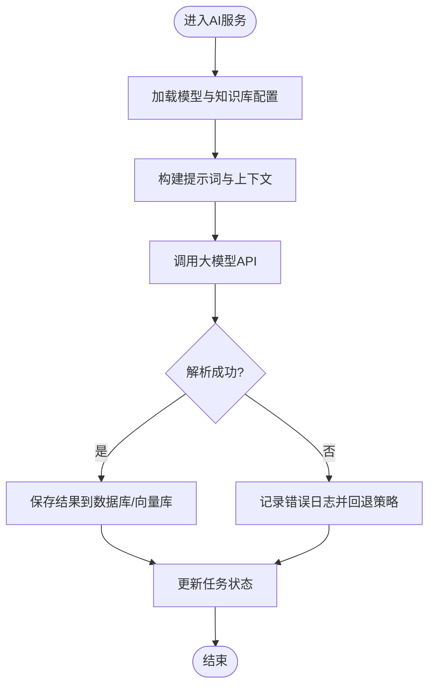
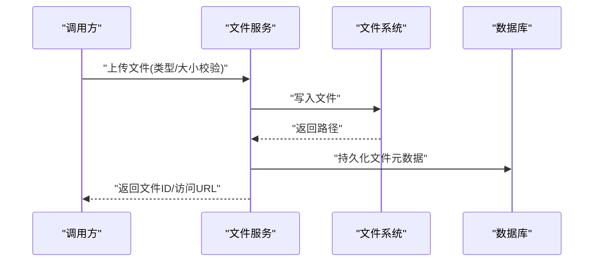
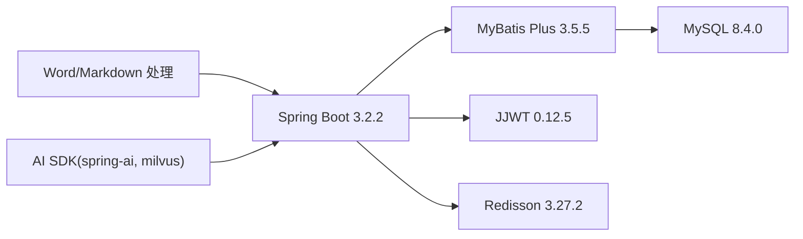

# 后端服务

<cite>
**本文引用的文件**   
- [ele-ai-tender-system/pom.xml](file://ele-ai-tender-system/pom.xml)
- [ele-ai-tender-core/src/main/java/com/jy/eleaitender/core/CoreApplication.java](file://ele-ai-tender-core/src/main/java/com/jy/eleaitender/core/CoreApplication.java)
- [ele-ai-tender-ai/src/main/java/com/jy/eleaitender/ai/AiApplication.java](file://ele-ai-tender-ai/src/main/java/com/jy/eleaitender/ai/AiApplication.java)
- [ele-ai-tender-file/src/main/java/com/jy/eleaitender/file/FileApplication.java](file://ele-ai-tender-file/src/main/java/com/jy/eleaitender/file/FileApplication.java)
- [ele-ai-tender-support/src/main/java/com/jy/eleaitender/support/SupportApplication.java](file://ele-ai-tender-support/src/main/java/com/jy/eleaitender/support/SupportApplication.java)
- [ele-ai-tender-core/src/main/resources/application.yml](file://ele-ai-tender-core/src/main/resources/application.yml)
- [ele-ai-tender-ai/src/main/resources/application.yml](file://ele-ai-tender-ai/src/main/resources/application.yml)
- [ele-ai-tender-file/src/main/resources/application.yml](file://ele-ai-tender-file/src/main/resources/application.yml)
- [ele-ai-tender-support/src/main/resources/application.yml](file://ele-ai-tender-support/src/main/resources/application.yml)
- [ele-ai-tender-common/src/main/java/com/jy/eleaitender/common/exception/BusinessException.java](file://ele-ai-tender-common/src/main/java/com/jy/eleaitender/common/exception/BusinessException.java)
- [ele-ai-tender-ai/src/main/java/com/jy/eleaitender/ai/handler/GlobalExceptionHandler.java](file://ele-ai-tender-ai/src/main/java/com/jy/eleaitender/ai/handler/GlobalExceptionHandler.java)
- [ele-ai-tender-core/src/main/java/com/jy/eleaitender/core/handler/GlobalExceptionHandler.java](file://ele-ai-tender-core/src/main/java/com/jy/eleaitender/core/handler/GlobalExceptionHandler.java)
- [ele-ai-tender-file/src/main/java/com/jy/eleaitender/file/handler/GlobalExceptionHandler.java](file://ele-ai-tender-file/src/main/java/com/jy/eleaitender/file/handler/GlobalExceptionHandler.java)
- [ele-ai-tender-support/src/main/java/com/jy/eleaitender/support/handler/GlobalExceptionHandler.java](file://ele-ai-tender-support/src/main/java/com/jy/eleaitender/support/handler/GlobalExceptionHandler.java)
</cite>

## 目录
1. [简介](#简介)
2. [项目结构](#项目结构)
3. [核心组件](#核心组件)
4. [架构总览](#架构总览)
5. [详细组件分析](#详细组件分析)
6. [依赖分析](#依赖分析)
7. [性能考虑](#性能考虑)
8. [故障排查指南](#故障排查指南)
9. [结论](#结论)
10. [附录](#附录)

## 简介
本文件为“招标文件AI编制系统”的后端服务文档，聚焦基于 Spring Boot 3.2.2 + Java 21 的微服务实现。系统采用多模块 Maven 工程，按职责拆分为：
- 公共模块 ele-ai-tender-common：封装通用异常、常量、DTO、安全与日志等基础设施能力
- 核心业务服务 ele-ai-tender-core：项目管理、阶段流程、检测与生成编排、定时任务等
- AI处理服务 ele-ai-tender-ai：模型路由、提示词模板、任务处理器、知识检索与对话接口
- 文件处理服务 ele-ai-tender-file：文档上传、解析、转换与修复
- 支撑服务 ele-ai-tender-support：用户、角色、菜单、参数、短信、统计等系统管理能力

各服务均提供启动类、配置管理、全局异常处理与日志记录，并通过内部文件服务客户端进行跨服务通信。

## 项目结构
整体为多模块聚合工程，顶层 POM 统一管理版本与依赖，子模块包含各自启动类与资源配置。

图表来源
- [ele-ai-tender-system/pom.xml:15-23](file://ele-ai-tender-system/pom.xml#L15-L23)

章节来源
- [ele-ai-tender-system/pom.xml:1-260](file://ele-ai-tender-system/pom.xml#L1-L260)

## 核心组件
- 启动类
  - 核心业务服务：启用调度、扫描核心与公共包、扫描 MyBatis Mapper
  - AI服务：排除特定自动配置、启用调度、扫描AI与公共包
  - 文件服务：基础启动与Mapper扫描
  - 支撑服务：启用调度、扫描支撑与公共包
- 配置管理
  - 统一通过 application.yml 暴露端口、数据源、Redis、MyBatis Plus、JWT、内部文件服务地址等
  - 支持本地覆盖配置文件导入
- 异常处理
  - 公共业务异常 BusinessException 携带响应码
  - 各服务提供 GlobalExceptionHandler 统一捕获并返回标准结果
- 日志记录
  - 统一日志格式包含 traceId，便于链路追踪
  - 各服务可独立设置日志级别

章节来源
- [ele-ai-tender-core/src/main/java/com/jy/eleaitender/core/CoreApplication.java:1-24](file://ele-ai-tender-core/src/main/java/com/jy/eleaitender/core/CoreApplication.java#L1-L24)
- [ele-ai-tender-ai/src/main/java/com/jy/eleaitender/ai/AiApplication.java:1-26](file://ele-ai-tender-ai/src/main/java/com/jy/eleaitender/ai/AiApplication.java#L1-L26)
- [ele-ai-tender-file/src/main/java/com/jy/eleaitender/file/FileApplication.java:1-18](file://ele-ai-tender-file/src/main/java/com/jy/eleaitender/file/FileApplication.java#L1-L18)
- [ele-ai-tender-support/src/main/java/com/jy/eleaitender/support/SupportApplication.java:1-21](file://ele-ai-tender-support/src/main/java/com/jy/eleaitender/support/SupportApplication.java#L1-L21)
- [ele-ai-tender-core/src/main/resources/application.yml:1-59](file://ele-ai-tender-core/src/main/resources/application.yml#L1-L59)
- [ele-ai-tender-ai/src/main/resources/application.yml:1-72](file://ele-ai-tender-ai/src/main/resources/application.yml#L1-L72)
- [ele-ai-tender-file/src/main/resources/application.yml:1-63](file://ele-ai-tender-file/src/main/resources/application.yml#L1-L63)
- [ele-ai-tender-support/src/main/resources/application.yml:1-68](file://ele-ai-tender-support/src/main/resources/application.yml#L1-L68)
- [ele-ai-tender-common/src/main/java/com/jy/eleaitender/common/exception/BusinessException.java:1-51](file://ele-ai-tender-common/src/main/java/com/jy/eleaitender/common/exception/BusinessException.java#L1-L51)
- [ele-ai-tender-ai/src/main/java/com/jy/eleaitender/ai/handler/GlobalExceptionHandler.java](file://ele-ai-tender-ai/src/main/java/com/jy/eleaitender/ai/handler/GlobalExceptionHandler.java)
- [ele-ai-tender-core/src/main/java/com/jy/eleaitender/core/handler/GlobalExceptionHandler.java](file://ele-ai-tender-core/src/main/java/com/jy/eleaitender/core/handler/GlobalExceptionHandler.java)
- [ele-ai-tender-file/src/main/java/com/jy/eleaitender/file/handler/GlobalExceptionHandler.java](file://ele-ai-tender-file/src/main/java/com/jy/eleaitender/file/handler/GlobalExceptionHandler.java)
- [ele-ai-tender-support/src/main/java/com/jy/eleaitender/support/handler/GlobalExceptionHandler.java](file://ele-ai-tender-support/src/main/java/com/jy/eleaitender/support/handler/GlobalExceptionHandler.java)

## 架构总览
微服务间通过 HTTP 调用协作，核心服务作为编排中心，协调 AI 与文件服务完成需求检测、内容生成与文档组装。支撑服务提供系统管理与外部集成能力。

图表来源
- [ele-ai-tender-core/src/main/resources/application.yml:1-59](file://ele-ai-tender-core/src/main/resources/application.yml#L1-L59)
- [ele-ai-tender-ai/src/main/resources/application.yml:1-72](file://ele-ai-tender-ai/src/main/resources/application.yml#L1-L72)
- [ele-ai-tender-file/src/main/resources/application.yml:1-63](file://ele-ai-tender-file/src/main/resources/application.yml#L1-L63)
- [ele-ai-tender-support/src/main/resources/application.yml:1-68](file://ele-ai-tender-support/src/main/resources/application.yml#L1-L68)

## 详细组件分析

### 公共模块（ele-ai-tender-common）
- 定位：为所有服务提供通用能力，包括异常体系、常量、DTO、安全注解、访问日志、数据权限、工具类等
- 关键能力
  - 业务异常：BusinessException 携带响应码，便于统一处理
  - 访问日志：HTTP请求入站过滤与持久化支持
  - 数据权限：注解+拦截器实现行级数据范围控制
  - 内部文件服务客户端：为其他服务提供对文件服务的便捷调用
- 使用方式：被 core、ai、support 等模块通过依赖引入

章节来源
- [ele-ai-tender-common/src/main/java/com/jy/eleaitender/common/exception/BusinessException.java:1-51](file://ele-ai-tender-common/src/main/java/com/jy/eleaitender/common/exception/BusinessException.java#L1-L51)

### 核心业务服务（ele-ai-tender-core）
- 启动类：启用调度、扫描核心与公共包、扫描 MyBatis Mapper
- 配置要点
  - 端口：默认 8082
  - 数据源与 Redis：通过环境变量注入
  - MyBatis Plus：逻辑删除、表前缀、驼峰映射
  - JWT：密钥与过期时间
  - 内部文件服务：base-url 与 jwt-secret
  - 日志：traceId 输出
- 典型流程：接收前端请求，编排 AI 与文件服务，落库与缓存

图表来源
- [ele-ai-tender-core/src/main/java/com/jy/eleaitender/core/CoreApplication.java:1-24](file://ele-ai-tender-core/src/main/java/com/jy/eleaitender/core/CoreApplication.java#L1-L24)
- [ele-ai-tender-core/src/main/resources/application.yml:1-59](file://ele-ai-tender-core/src/main/resources/application.yml#L1-L59)

章节来源
- [ele-ai-tender-core/src/main/java/com/jy/eleaitender/core/CoreApplication.java:1-24](file://ele-ai-tender-core/src/main/java/com/jy/eleaitender/core/CoreApplication.java#L1-L24)
- [ele-ai-tender-core/src/main/resources/application.yml:1-59](file://ele-ai-tender-core/src/main/resources/application.yml#L1-L59)
- [ele-ai-tender-core/src/main/java/com/jy/eleaitender/core/handler/GlobalExceptionHandler.java](file://ele-ai-tender-core/src/main/java/com/jy/eleaitender/core/handler/GlobalExceptionHandler.java)

### AI处理服务（ele-ai-tender-ai）
- 启动类：排除特定自动配置、启用调度、扫描AI与公共包
- 配置要点
  - 端口：默认 8083
  - 数据源与 Redis：通过环境变量注入
  - MyBatis Plus：逻辑删除、表前缀、驼峰映射
  - Milvus：向量库连接参数
  - JWT：密钥与过期时间
  - 内部文件服务：base-url 与 jwt-secret
  - 日志：traceId 输出
- 典型流程：接收任务，选择模型、构建提示词、执行推理、记录调用日志、更新任务状态

图表来源
- [ele-ai-tender-ai/src/main/java/com/jy/eleaitender/ai/AiApplication.java:1-26](file://ele-ai-tender-ai/src/main/java/com/jy/eleaitender/ai/AiApplication.java#L1-L26)
- [ele-ai-tender-ai/src/main/resources/application.yml:1-72](file://ele-ai-tender-ai/src/main/resources/application.yml#L1-L72)

章节来源
- [ele-ai-tender-ai/src/main/java/com/jy/eleaitender/ai/AiApplication.java:1-26](file://ele-ai-tender-ai/src/main/java/com/jy/eleaitender/ai/AiApplication.java#L1-L26)
- [ele-ai-tender-ai/src/main/resources/application.yml:1-72](file://ele-ai-tender-ai/src/main/resources/application.yml#L1-L72)
- [ele-ai-tender-ai/src/main/java/com/jy/eleaitender/ai/handler/GlobalExceptionHandler.java](file://ele-ai-tender-ai/src/main/java/com/jy/eleaitender/ai/handler/GlobalExceptionHandler.java)

### 文件处理服务（ele-ai-tender-file）
- 启动类：基础启动与Mapper扫描
- 配置要点
  - 端口：默认 8081
  - 数据源与 Redis：通过环境变量注入
  - MyBatis Plus：逻辑删除、表前缀、驼峰映射
  - 文件存储：基础路径、允许类型、最大大小
  - JWT：密钥与过期时间
  - 日志：traceId 输出
- 典型流程：接收上传、校验类型与大小、落盘、入库元数据、提供下载与预览

图表来源
- [ele-ai-tender-file/src/main/java/com/jy/eleaitender/file/FileApplication.java:1-18](file://ele-ai-tender-file/src/main/java/com/jy/eleaitender/file/FileApplication.java#L1-L18)
- [ele-ai-tender-file/src/main/resources/application.yml:1-63](file://ele-ai-tender-file/src/main/resources/application.yml#L1-L63)

章节来源
- [ele-ai-tender-file/src/main/java/com/jy/eleaitender/file/FileApplication.java:1-18](file://ele-ai-tender-file/src/main/java/com/jy/eleaitender/file/FileApplication.java#L1-L18)
- [ele-ai-tender-file/src/main/resources/application.yml:1-63](file://ele-ai-tender-file/src/main/resources/application.yml#L1-L63)
- [ele-ai-tender-file/src/main/java/com/jy/eleaitender/file/handler/GlobalExceptionHandler.java](file://ele-ai-tender-file/src/main/java/com/jy/eleaitender/file/handler/GlobalExceptionHandler.java)

### 支撑服务（ele-ai-tender-support）
- 启动类：启用调度、扫描支撑与公共包
- 配置要点
  - 端口：默认 8080
  - 数据源与 Redis：通过环境变量注入
  - MyBatis Plus：逻辑删除、表前缀、驼峰映射
  - JWT：密钥与过期时间
  - 内部文件服务：base-url 与 jwt-secret
  - 短信网关：用户名、密码、扩展字段、URL、是否正式环境
  - 日志：traceId 输出
- 典型流程：用户认证、权限控制、系统参数管理、短信发送、统计汇总

章节来源
- [ele-ai-tender-support/src/main/java/com/jy/eleaitender/support/SupportApplication.java:1-21](file://ele-ai-tender-support/src/main/java/com/jy/eleaitender/support/SupportApplication.java#L1-L21)
- [ele-ai-tender-support/src/main/resources/application.yml:1-68](file://ele-ai-tender-support/src/main/resources/application.yml#L1-L68)
- [ele-ai-tender-support/src/main/java/com/jy/eleaitender/support/handler/GlobalExceptionHandler.java](file://ele-ai-tender-support/src/main/java/com/jy/eleaitender/support/handler/GlobalExceptionHandler.java)

## 依赖分析
- 技术栈与版本由顶层 POM 统一管理，确保各服务一致性与可维护性
- 关键依赖
  - Spring Boot 3.2.2 + JDK 21
  - MyBatis Plus 3.5.5（适配 Spring Boot 3）
  - JJWT 0.12.5（JWT API/实现/Jackson）
  - Hutool、Apache Commons、Lombok
  - SpringDoc OpenAPI 2.3.0
  - Redisson 3.27.2（分布式锁）
  - MySQL 8.4.0
  - Word/Markdown 处理：poi-tl、poi-ooxml-full、flexmark-all、jsoup
  - AI 相关：spring-ai、milvus-sdk

图表来源
- [ele-ai-tender-system/pom.xml:25-66](file://ele-ai-tender-system/pom.xml#L25-L66)
- [ele-ai-tender-system/pom.xml:68-223](file://ele-ai-tender-system/pom.xml#L68-L223)

章节来源
- [ele-ai-tender-system/pom.xml:1-260](file://ele-ai-tender-system/pom.xml#L1-L260)

## 性能考虑
- 线程池与并发
  - AI 服务提供动态线程池与用户并发管理器，避免大模型调用阻塞主线程
- 异步与定时
  - 核心与支撑服务启用 @EnableScheduling，用于任务同步与清理
- 缓存与限流
  - 结合 Redis 缓存热点数据；必要时引入 Redisson 分布式锁保护临界区
- I/O 优化
  - 文件服务限制最大文件大小与类型白名单，减少无效上传
- 数据库
  - 合理索引与分页查询；逻辑删除字段统一配置，避免全表扫描

[本节为通用指导，不直接分析具体文件]

## 故障排查指南
- 统一异常
  - 业务异常：BusinessException 携带响应码，便于快速定位问题
  - 全局异常处理器：各服务提供 GlobalExceptionHandler，统一捕获并返回标准结果
- 日志与追踪
  - 日志格式包含 traceId，建议配合网关或过滤器透传
  - 根据服务包名调整日志级别，便于定位问题
- 常见问题
  - 端口冲突：检查 application.yml 的 server.port
  - 数据库连接失败：核对 SPRING_DATASOURCE_* 环境变量
  - Redis 不可用：核对 SPRING_DATA_REDIS_* 环境变量
  - 文件上传失败：检查 FILE_STORAGE_BASE_PATH 与 allowed-types/max-size
  - AI 调用失败：检查 DEEPSEEK_API_KEY/DEEPSEEK_BASE_URL 与 Milvus 配置
  - 内部文件服务不可达：核对 INTERNAL_FILE_SERVICE_URL 与 APP_JWT_SECRET

章节来源
- [ele-ai-tender-common/src/main/java/com/jy/eleaitender/common/exception/BusinessException.java:1-51](file://ele-ai-tender-common/src/main/java/com/jy/eleaitender/common/exception/BusinessException.java#L1-L51)
- [ele-ai-tender-ai/src/main/java/com/jy/eleaitender/ai/handler/GlobalExceptionHandler.java](file://ele-ai-tender-ai/src/main/java/com/jy/eleaitender/ai/handler/GlobalExceptionHandler.java)
- [ele-ai-tender-core/src/main/java/com/jy/eleaitender/core/handler/GlobalExceptionHandler.java](file://ele-ai-tender-core/src/main/java/com/jy/eleaitender/core/handler/GlobalExceptionHandler.java)
- [ele-ai-tender-file/src/main/java/com/jy/eleaitender/file/handler/GlobalExceptionHandler.java](file://ele-ai-tender-file/src/main/java/com/jy/eleaitender/file/handler/GlobalExceptionHandler.java)
- [ele-ai-tender-support/src/main/java/com/jy/eleaitender/support/handler/GlobalExceptionHandler.java](file://ele-ai-tender-support/src/main/java/com/jy/eleaitender/support/handler/GlobalExceptionHandler.java)
- [ele-ai-tender-core/src/main/resources/application.yml:1-59](file://ele-ai-tender-core/src/main/resources/application.yml#L1-L59)
- [ele-ai-tender-ai/src/main/resources/application.yml:1-72](file://ele-ai-tender-ai/src/main/resources/application.yml#L1-L72)
- [ele-ai-tender-file/src/main/resources/application.yml:1-63](file://ele-ai-tender-file/src/main/resources/application.yml#L1-L63)
- [ele-ai-tender-support/src/main/resources/application.yml:1-68](file://ele-ai-tender-support/src/main/resources/application.yml#L1-L68)

## 结论
本项目以 Spring Boot 3.2.2 + Java 21 为基础，采用清晰的多模块分层与微服务拆分，公共模块沉淀通用能力，核心服务负责编排，AI 与文件服务专注领域能力，支撑服务提供系统管理。通过统一的配置、异常与日志机制，提升了可维护性与可观测性。后续可在监控告警、链路追踪、灰度发布等方面进一步增强。

[本节为总结性内容，不直接分析具体文件]

## 附录
- 服务端口参考
  - 支撑服务：8080
  - 文件服务：8081
  - 核心业务服务：8082
  - AI服务：8083
- 关键配置项
  - 数据源：SPRING_DATASOURCE_URL / USERNAME / PASSWORD
  - Redis：SPRING_DATA_REDIS_HOST / PORT / DATABASE / PASSWORD
  - JWT：APP_JWT_SECRET / APP_JWT_EXPIRATION / APP_JWT_EXTERNAL_EXPIRATION
  - 内部文件服务：INTERNAL_FILE_SERVICE_URL / APP_JWT_SECRET
  - 文件存储：FILE_STORAGE_BASE_PATH / allowed-types / max-size
  - AI：DEEPSEEK_API_KEY / DEEPSEEK_BASE_URL / MILVUS_*

章节来源
- [ele-ai-tender-core/src/main/resources/application.yml:1-59](file://ele-ai-tender-core/src/main/resources/application.yml#L1-L59)
- [ele-ai-tender-ai/src/main/resources/application.yml:1-72](file://ele-ai-tender-ai/src/main/resources/application.yml#L1-L72)
- [ele-ai-tender-file/src/main/resources/application.yml:1-63](file://ele-ai-tender-file/src/main/resources/application.yml#L1-L63)
- [ele-ai-tender-support/src/main/resources/application.yml:1-68](file://ele-ai-tender-support/src/main/resources/application.yml#L1-L68)