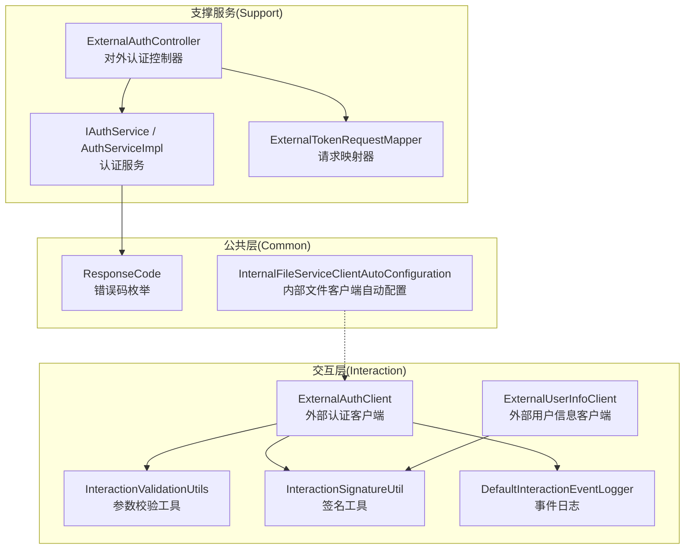
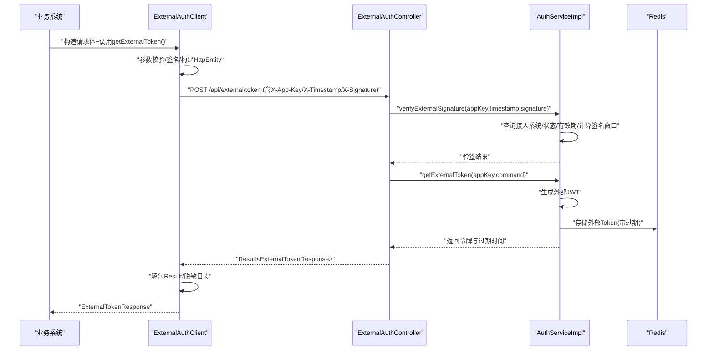
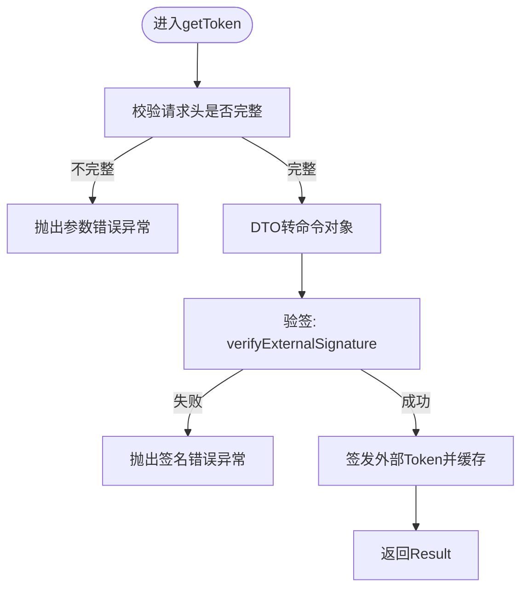
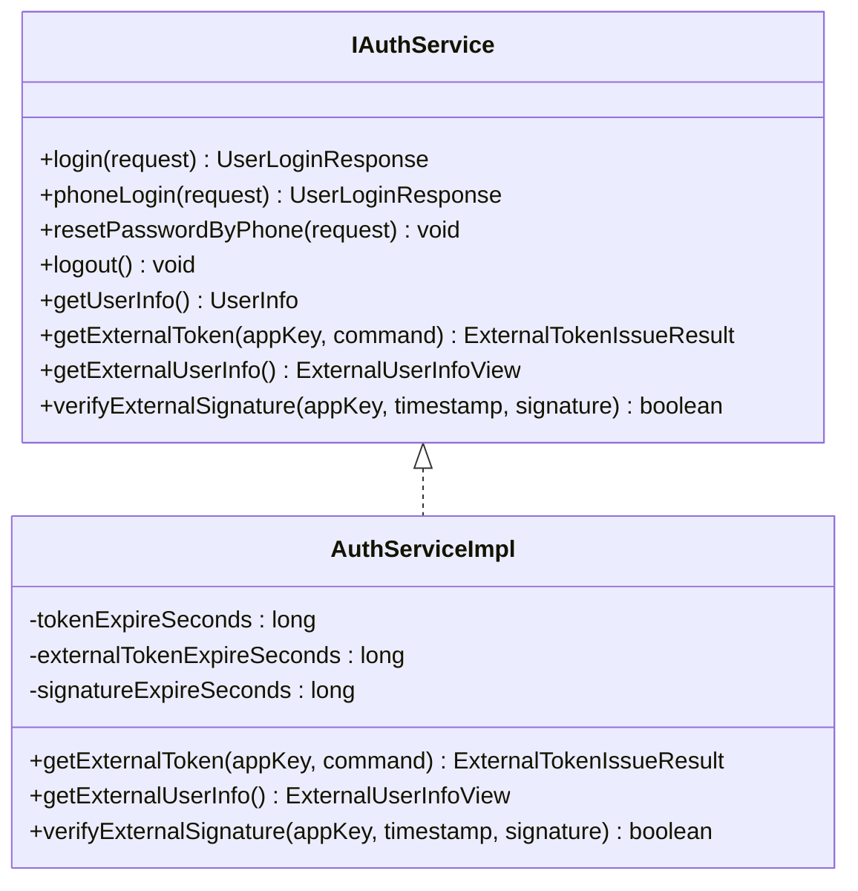
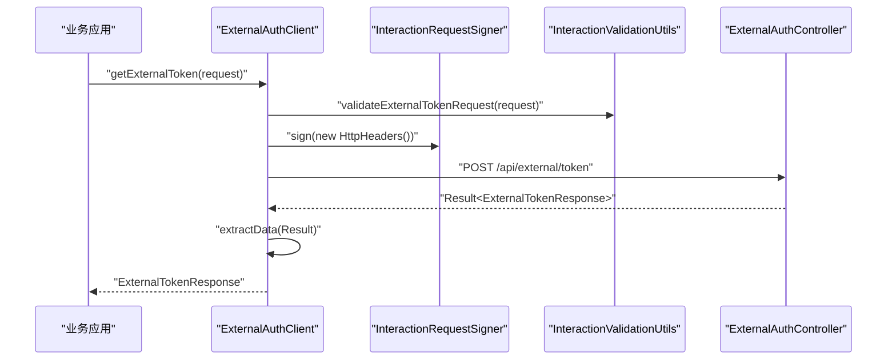
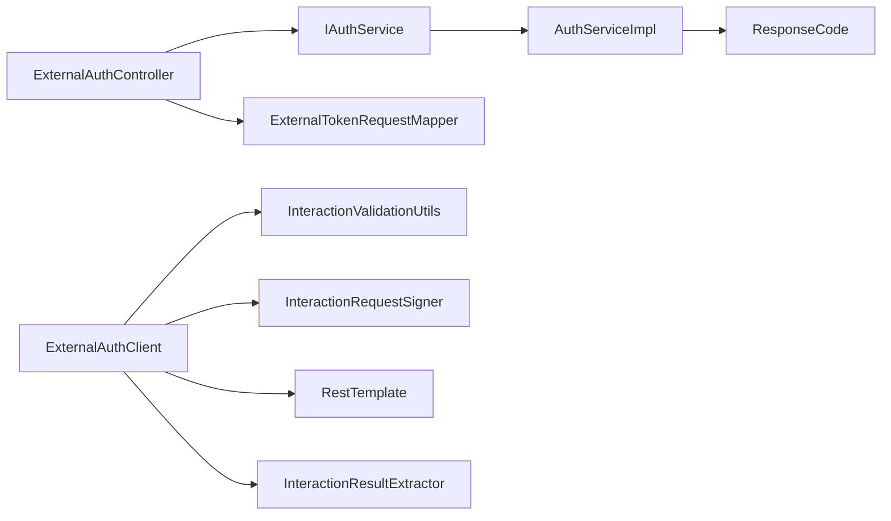

# 外部系统集成

<cite>
**本文引用的文件**   
- [ExternalAuthController.java](file://ele-ai-tender-system/ele-ai-tender-support/src/main/java/com/jy/eleaitender/support/controller/ExternalAuthController.java)
- [IAuthService.java](file://ele-ai-tender-system/ele-ai-tender-support/src/main/java/com/jy/eleaitender/support/service/IAuthService.java)
- [AuthServiceImpl.java](file://ele-ai-tender-system/ele-ai-tender-support/src/main/java/com/jy/eleaitender/support/service/impl/AuthServiceImpl.java)
- [ExternalTokenRequestMapper.java](file://ele-ai-tender-system/ele-ai-tender-support/src/main/java/com/jy/eleaitender/support/converter/ExternalTokenRequestMapper.java)
- [ExternalAuthClient.java](file://ele-ai-tender-system/ele-ai-tender-interaction/ele-ai-tender-interaction-core/src/main/java/com/jy/eleaitender/interaction/core/client/ExternalAuthClient.java)
- [ExternalUserInfoClient.java](file://ele-ai-tender-system/ele-ai-tender-interaction/ele-ai-tender-interaction-core/src/main/java/com/jy/eleaitender/interaction/core/client/ExternalUserInfoClient.java)
- [InteractionSignatureUtil.java](file://ele-ai-tender-system/ele-ai-tender-common-interaction/src/main/java/com/jy/eleaitender/common/interaction/util/InteractionSignatureUtil.java)
- [InteractionValidationUtils.java](file://ele-ai-tender-system/ele-ai-tender-common-interaction/src/main/java/com/jy/eleaitender/common/interaction/util/InteractionValidationUtils.java)
- [DefaultInteractionEventLogger.java](file://ele-ai-tender-system/ele-ai-tender-interaction/ele-ai-tender-interaction-autoconfigure/src/main/java/com/jy/eleaitender/interaction/autoconfigure/logging/DefaultInteractionEventLogger.java)
- [InternalFileServiceClientAutoConfiguration.java](file://ele-ai-tender-system/ele-ai-tender-common/src/main/java/com/jy/eleaitender/common/client/InternalFileServiceClientAutoConfiguration.java)
- [ResponseCode.java](file://ele-ai-tender-system/ele-ai-tender-common/src/main/java/com/jy/eleaitender/common/enums/ResponseCode.java)
</cite>

## 目录
1. [简介](#简介)
2. [项目结构](#项目结构)
3. [核心组件](#核心组件)
4. [架构总览](#架构总览)
5. [详细组件分析](#详细组件分析)
6. [依赖关系分析](#依赖关系分析)
7. [性能与可靠性](#性能与可靠性)
8. [故障排查指南](#故障排查指南)
9. [结论](#结论)
10. [附录](#附录)

## 简介
本技术文档聚焦“外部系统集成模块”，围绕第三方平台对接、API网关集成、身份认证互通等核心能力展开，详细说明外部令牌管理、接口签名验证、请求响应转换等技术实现，并给出服务发现、负载均衡、熔断降级、限流控制、错误码映射、超时重试等微服务集成模式的指导方案。文档以代码为依据，提供可视化架构图与流程图，帮助读者快速理解与落地实施。

## 项目结构
外部系统集成涉及支撑服务（Support）暴露对外认证接口，交互层（Interaction）提供客户端封装与通用工具，公共层（Common）定义统一响应与错误码。关键目录与职责如下：
- Support 服务：对外提供 /api/external/token、/api/external/userinfo 等接口，负责接入系统鉴权、外部令牌签发与用户信息返回。
- Interaction 客户端：为业务系统调用电子标系统提供签名、参数校验、结果解包、日志脱敏等能力。
- Common 工具与常量：提供签名算法、参数校验、错误码枚举、内部服务客户端自动配置等。

图示来源
- [ExternalAuthController.java:1-108](file://ele-ai-tender-system/ele-ai-tender-support/src/main/java/com/jy/eleaitender/support/controller/ExternalAuthController.java#L1-L108)
- [IAuthService.java:1-77](file://ele-ai-tender-system/ele-ai-tender-support/src/main/java/com/jy/eleaitender/support/service/IAuthService.java#L1-L77)
- [AuthServiceImpl.java:1-406](file://ele-ai-tender-system/ele-ai-tender-support/src/main/java/com/jy/eleaitender/support/service/impl/AuthServiceImpl.java#L1-L406)
- [ExternalTokenRequestMapper.java:1-42](file://ele-ai-tender-system/ele-ai-tender-support/src/main/java/com/jy/eleaitender/support/converter/ExternalTokenRequestMapper.java#L1-L42)
- [ExternalAuthClient.java:1-69](file://ele-ai-tender-system/ele-ai-tender-interaction/ele-ai-tender-interaction-core/src/main/java/com/jy/eleaitender/interaction/core/client/ExternalAuthClient.java#L1-L69)
- [ExternalUserInfoClient.java:30-53](file://ele-ai-tender-system/ele-ai-tender-interaction/ele-ai-tender-interaction-core/src/main/java/com/jy/eleaitender/interaction/core/client/ExternalUserInfoClient.java#L30-L53)
- [InteractionValidationUtils.java:1-59](file://ele-ai-tender-system/ele-ai-tender-common-interaction/src/main/java/com/jy/eleaitender/common/interaction/util/InteractionValidationUtils.java#L1-L59)
- [InteractionSignatureUtil.java:1-61](file://ele-ai-tender-system/ele-ai-tender-common-interaction/src/main/java/com/jy/eleaitender/common/interaction/util/InteractionSignatureUtil.java#L1-L61)
- [DefaultInteractionEventLogger.java:84-121](file://ele-ai-tender-system/ele-ai-tender-interaction/ele-ai-tender-interaction-autoconfigure/src/main/java/com/jy/eleaitender/interaction/autoconfigure/logging/DefaultInteractionEventLogger.java#L84-L121)
- [InternalFileServiceClientAutoConfiguration.java:1-38](file://ele-ai-tender-system/ele-ai-tender-common/src/main/java/com/jy/eleaitender/common/client/InternalFileServiceClientAutoConfiguration.java#L1-L38)
- [ResponseCode.java:39-167](file://ele-ai-tender-system/ele-ai-tender-common/src/main/java/com/jy/eleaitender/common/enums/ResponseCode.java#L39-L167)

章节来源
- [ExternalAuthController.java:1-108](file://ele-ai-tender-system/ele-ai-tender-support/src/main/java/com/jy/eleaitender/support/controller/ExternalAuthController.java#L1-L108)
- [ExternalAuthClient.java:1-69](file://ele-ai-tender-system/ele-ai-tender-interaction/ele-ai-tender-interaction-core/src/main/java/com/jy/eleaitender/interaction/core/client/ExternalAuthClient.java#L1-L69)
- [InteractionValidationUtils.java:1-59](file://ele-ai-tender-system/ele-ai-tender-common-interaction/src/main/java/com/jy/eleaitender/common/interaction/util/InteractionValidationUtils.java#L1-L59)
- [InteractionSignatureUtil.java:1-61](file://ele-ai-tender-system/ele-ai-tender-common-interaction/src/main/java/com/jy/eleaitender/common/interaction/util/InteractionSignatureUtil.java#L1-L61)
- [InternalFileServiceClientAutoConfiguration.java:1-38](file://ele-ai-tender-system/ele-ai-tender-common/src/main/java/com/jy/eleaitender/common/client/InternalFileServiceClientAutoConfiguration.java#L1-L38)
- [ResponseCode.java:39-167](file://ele-ai-tender-system/ele-ai-tender-common/src/main/java/com/jy/eleaitender/common/enums/ResponseCode.java#L39-L167)

## 核心组件
- 外部认证控制器：提供外部系统换取 Token、验签辅助、获取当前外部用户信息等接口；在入参不完整时快速失败，避免进入认证逻辑。
- 认证服务：完成接入系统查询、状态与有效期检查、外部令牌生成与缓存、外部用户上下文读取、签名验证。
- 外部认证客户端：对电子标系统发起外部 Token 请求，自动添加签名头、统一解包 Result<T>、记录脱敏日志。
- 外部用户信息客户端：透传 Authorization 头，获取当前外部用户信息。
- 签名与校验工具：HMAC-SHA256 签名生成与校验、时间戳有效性检查；请求体必填字段校验。
- 错误码与响应：统一的 ResponseCode 枚举，涵盖接入系统相关错误码。
- 内部服务客户端自动配置：基于 RestTemplateBuilder 设置连接与读取超时，便于扩展至其他内部服务调用。

章节来源
- [ExternalAuthController.java:1-108](file://ele-ai-tender-system/ele-ai-tender-support/src/main/java/com/jy/eleaitender/support/controller/ExternalAuthController.java#L1-L108)
- [IAuthService.java:1-77](file://ele-ai-tender-system/ele-ai-tender-support/src/main/java/com/jy/eleaitender/support/service/IAuthService.java#L1-L77)
- [AuthServiceImpl.java:321-362](file://ele-ai-tender-system/ele-ai-tender-support/src/main/java/com/jy/eleaitender/support/service/impl/AuthServiceImpl.java#L321-L362)
- [ExternalAuthClient.java:44-67](file://ele-ai-tender-system/ele-ai-tender-interaction/ele-ai-tender-interaction-core/src/main/java/com/jy/eleaitender/interaction/core/client/ExternalAuthClient.java#L44-L67)
- [ExternalUserInfoClient.java:42-53](file://ele-ai-tender-system/ele-ai-tender-interaction/ele-ai-tender-interaction-core/src/main/java/com/jy/eleaitender/interaction/core/client/ExternalUserInfoClient.java#L42-L53)
- [InteractionSignatureUtil.java:18-36](file://ele-ai-tender-system/ele-ai-tender-common-interaction/src/main/java/com/jy/eleaitender/common/interaction/util/InteractionSignatureUtil.java#L18-L36)
- [InteractionValidationUtils.java:23-30](file://ele-ai-tender-system/ele-ai-tender-common-interaction/src/main/java/com/jy/eleaitender/common/interaction/util/InteractionValidationUtils.java#L23-L30)
- [ResponseCode.java:39-46](file://ele-ai-tender-system/ele-ai-tender-common/src/main/java/com/jy/eleaitender/common/enums/ResponseCode.java#L39-L46)
- [InternalFileServiceClientAutoConfiguration.java:24-37](file://ele-ai-tender-system/ele-ai-tender-common/src/main/java/com/jy/eleaitender/common/client/InternalFileServiceClientAutoConfiguration.java#L24-L37)

## 架构总览
外部系统集成采用“支撑服务 + 交互客户端”的双端模式：
- 支撑服务侧：接收外部系统的带签名请求，校验签名与接入系统状态，签发外部令牌并缓存，提供外部用户信息查询。
- 交互客户端侧：为业务系统封装 HTTP 调用，自动注入签名头、统一解包 Result<T>、记录脱敏日志，屏蔽底层细节。

图示来源
- [ExternalAuthClient.java:44-67](file://ele-ai-tender-system/ele-ai-tender-interaction/ele-ai-tender-interaction-core/src/main/java/com/jy/eleaitender/interaction/core/client/ExternalAuthClient.java#L44-L67)
- [ExternalAuthController.java:39-74](file://ele-ai-tender-system/ele-ai-tender-support/src/main/java/com/jy/eleaitender/support/controller/ExternalAuthController.java#L39-L74)
- [AuthServiceImpl.java:321-362](file://ele-ai-tender-system/ele-ai-tender-support/src/main/java/com/jy/eleaitender/support/service/impl/AuthServiceImpl.java#L321-L362)

## 详细组件分析

### 外部认证控制器（对外入口）
- 职责：接收外部系统通过 appKey/appSecret 签名换取外部 Token 的请求；提供验签辅助接口；在已登录外部上下文中返回当前外部用户信息。
- 关键点：
  - 入参完整性校验优先于验签，避免无效请求进入认证逻辑。
  - 将外部请求 DTO 转换为内部命令对象，交由服务层处理。
  - 使用统一 Result 包装返回。

图示来源
- [ExternalAuthController.java:44-74](file://ele-ai-tender-system/ele-ai-tender-support/src/main/java/com/jy/eleaitender/support/controller/ExternalAuthController.java#L44-L74)
- [ExternalTokenRequestMapper.java:16-34](file://ele-ai-tender-system/ele-ai-tender-support/src/main/java/com/jy/eleaitender/support/converter/ExternalTokenRequestMapper.java#L16-L34)
- [AuthServiceImpl.java:382-404](file://ele-ai-tender-system/ele-ai-tender-support/src/main/java/com/jy/eleaitender/support/service/impl/AuthServiceImpl.java#L382-L404)

章节来源
- [ExternalAuthController.java:1-108](file://ele-ai-tender-system/ele-ai-tender-support/src/main/java/com/jy/eleaitender/support/controller/ExternalAuthController.java#L1-L108)
- [ExternalTokenRequestMapper.java:1-42](file://ele-ai-tender-system/ele-ai-tender-support/src/main/java/com/jy/eleaitender/support/converter/ExternalTokenRequestMapper.java#L1-L42)

### 认证服务（令牌签发与验签）
- 职责：
  - 根据 appKey 查询接入系统，校验状态与有效期。
  - 生成外部 JWT 并写入 Redis，键名包含 appKey、userId 及可选 jti。
  - 从安全上下文提取外部用户信息。
  - 验签：结合接入系统密钥与签名窗口进行 HMAC-SHA256 校验。
- 关键点：
  - 外部 Token 过期时间可配置，默认一周。
  - 签名窗口可配置，默认 300 秒。
  - 错误码覆盖接入系统不存在、禁用、过期、签名错误等场景。

图示来源
- [IAuthService.java:14-76](file://ele-ai-tender-system/ele-ai-tender-support/src/main/java/com/jy/eleaitender/support/service/IAuthService.java#L14-L76)
- [AuthServiceImpl.java:321-362](file://ele-ai-tender-system/ele-ai-tender-support/src/main/java/com/jy/eleaitender/support/service/impl/AuthServiceImpl.java#L321-L362)
- [AuthServiceImpl.java:365-379](file://ele-ai-tender-system/ele-ai-tender-support/src/main/java/com/jy/eleaitender/support/service/impl/AuthServiceImpl.java#L365-L379)
- [AuthServiceImpl.java:382-404](file://ele-ai-tender-system/ele-ai-tender-support/src/main/java/com/jy/eleaitender/support/service/impl/AuthServiceImpl.java#L382-L404)

章节来源
- [IAuthService.java:1-77](file://ele-ai-tender-system/ele-ai-tender-support/src/main/java/com/jy/eleaitender/support/service/IAuthService.java#L1-L77)
- [AuthServiceImpl.java:1-406](file://ele-ai-tender-system/ele-ai-tender-support/src/main/java/com/jy/eleaitender/support/service/impl/AuthServiceImpl.java#L1-L406)
- [ResponseCode.java:39-46](file://ele-ai-tender-system/ele-ai-tender-common/src/main/java/com/jy/eleaitender/common/enums/ResponseCode.java#L39-L46)

### 外部认证客户端（调用方封装）
- 职责：为业务系统封装对电子标系统的外部 Token 请求，自动注入签名头、统一解包 Result<T>、输出脱敏日志。
- 关键点：
  - 使用 InteractionValidationUtils 进行请求体必填校验。
  - 使用 InteractionRequestSigner 注入 X-App-Key/X-Timestamp/X-Signature 等头。
  - 使用 InteractionResultExtractor 解包 Result<T>，仅向上抛业务异常或返回数据。
  - 日志中 token 脱敏，traceId 透传。

图示来源
- [ExternalAuthClient.java:44-67](file://ele-ai-tender-system/ele-ai-tender-interaction/ele-ai-tender-interaction-core/src/main/java/com/jy/eleaitender/interaction/core/client/ExternalAuthClient.java#L44-L67)
- [InteractionValidationUtils.java:23-30](file://ele-ai-tender-system/ele-ai-tender-common-interaction/src/main/java/com/jy/eleaitender/common/interaction/util/InteractionValidationUtils.java#L23-L30)

章节来源
- [ExternalAuthClient.java:1-69](file://ele-ai-tender-system/ele-ai-tender-interaction/ele-ai-tender-interaction-core/src/main/java/com/jy/eleaitender/interaction/core/client/ExternalAuthClient.java#L1-L69)
- [InteractionValidationUtils.java:1-59](file://ele-ai-tender-system/ele-ai-tender-common-interaction/src/main/java/com/jy/eleaitender/common/interaction/util/InteractionValidationUtils.java#L1-L59)

### 外部用户信息客户端（透传授权）
- 职责：携带 Authorization 头调用 /external/userinfo，获取当前外部用户信息。
- 关键点：
  - 复用签名工具注入必要头。
  - 统一解包 Result<T>，向上抛业务异常或返回数据。

章节来源
- [ExternalUserInfoClient.java:42-53](file://ele-ai-tender-system/ele-ai-tender-interaction/ele-ai-tender-interaction-core/src/main/java/com/jy/eleaitender/interaction/core/client/ExternalUserInfoClient.java#L42-L53)

### 签名与校验工具
- 签名算法：HmacSHA256，内容拼接 appKey+timestamp，结果大写十六进制。
- 时间戳校验：默认 5 分钟窗口（工具类内固定），服务端支持可配置窗口。
- 参数校验：对外部 Token 请求的必填字段进行非空校验。

章节来源
- [InteractionSignatureUtil.java:18-36](file://ele-ai-tender-system/ele-ai-tender-common-interaction/src/main/java/com/jy/eleaitender/common/interaction/util/InteractionSignatureUtil.java#L18-L36)
- [InteractionValidationUtils.java:23-30](file://ele-ai-tender-system/ele-ai-tender-common-interaction/src/main/java/com/jy/eleaitender/common/interaction/util/InteractionValidationUtils.java#L23-L30)

### 错误码与响应
- 接入系统相关错误码：包括不存在、禁用、过期、签名错误、时间戳过期、AppKey 不存在等。
- 统一响应：Result<T> 由客户端统一解包，上层只关注真实数据或异常。

章节来源
- [ResponseCode.java:39-46](file://ele-ai-tender-system/ele-ai-tender-common/src/main/java/com/jy/eleaitender/common/enums/ResponseCode.java#L39-L46)

### 内部服务客户端自动配置（参考）
- 基于 RestTemplateBuilder 设置连接与读取超时，作为内部服务调用的通用模板，可借鉴到外部系统调用配置。

章节来源
- [InternalFileServiceClientAutoConfiguration.java:24-37](file://ele-ai-tender-system/ele-ai-tender-common/src/main/java/com/jy/eleaitender/common/client/InternalFileServiceClientAutoConfiguration.java#L24-L37)

## 依赖关系分析
- 控制器依赖服务接口与请求映射器，服务实现依赖数据库访问与安全上下文。
- 客户端依赖签名器、属性配置、RestTemplate 与结果解包工具。
- 工具类无外部框架耦合，提供纯函数式签名与校验能力。
- 错误码集中管理，便于跨模块一致化。

图示来源
- [ExternalAuthController.java:33-37](file://ele-ai-tender-system/ele-ai-tender-support/src/main/java/com/jy/eleaitender/support/controller/ExternalAuthController.java#L33-L37)
- [ExternalAuthClient.java:29-38](file://ele-ai-tender-system/ele-ai-tender-interaction/ele-ai-tender-interaction-core/src/main/java/com/jy/eleaitender/interaction/core/client/ExternalAuthClient.java#L29-L38)
- [ResponseCode.java:39-46](file://ele-ai-tender-system/ele-ai-tender-common/src/main/java/com/jy/eleaitender/common/enums/ResponseCode.java#L39-L46)

## 性能与可靠性
- 超时与重试
  - 建议为外部系统调用配置合理的连接与读取超时，参考内部文件客户端自动配置中的 RestTemplateBuilder 用法。
  - 对于幂等接口（如 Token 获取），可在客户端增加指数退避重试策略，限制最大重试次数与总耗时。
- 限流与熔断
  - 在网关层或客户端侧对 /api/external/token 做限流，防止恶意刷取。
  - 引入熔断器（如 Resilience4j）保护下游不稳定服务，快速失败与降级返回友好提示。
- 缓存与去重
  - 外部 Token 已在 Redis 中按 appKey:userId:jti 维度缓存，避免重复签发与提升校验效率。
  - 可考虑对频繁查询的接入系统元数据进行本地缓存，降低 DB 压力。
- 日志与追踪
  - 使用 traceId 贯穿调用链，对外敏感信息（token）脱敏，便于问题定位与合规审计。
- 资源隔离
  - 针对外部系统调用使用独立线程池与连接池，避免影响核心业务。

[本节为通用指导，不直接分析具体文件]

## 故障排查指南
- 常见错误码
  - 接入系统不存在/禁用/过期：检查接入系统配置与有效期。
  - 签名错误或时间戳过期：核对 appSecret、时间同步与签名窗口。
- 验签调试
  - 使用 /api/external/verify 接口进行最小化验签测试，确认 appKey/appSecret 与时间戳正确。
- 客户端问题
  - 检查签名头是否正确注入，Result 是否被正确解包，日志中 token 是否脱敏。
- 超时与网络
  - 调整 RestTemplate 超时配置，观察网络抖动与重试行为。

章节来源
- [ExternalAuthController.java:76-88](file://ele-ai-tender-system/ele-ai-tender-support/src/main/java/com/jy/eleaitender/support/controller/ExternalAuthController.java#L76-L88)
- [ResponseCode.java:39-46](file://ele-ai-tender-system/ele-ai-tender-common/src/main/java/com/jy/eleaitender/common/enums/ResponseCode.java#L39-L46)
- [DefaultInteractionEventLogger.java:84-121](file://ele-ai-tender-system/ele-ai-tender-interaction/ele-ai-tender-interaction-autoconfigure/src/main/java/com/jy/eleaitender/interaction/autoconfigure/logging/DefaultInteractionEventLogger.java#L84-L121)

## 结论
本模块通过“支撑服务 + 交互客户端”的清晰分层，实现了外部系统的安全接入与令牌互通。签名校验、参数校验、结果解包与日志脱敏等能力集中在工具与客户端层，提升了可维护性与一致性。建议在网关与客户端侧补充限流、熔断与重试策略，并结合 traceId 与脱敏日志完善可观测性，以满足生产环境的稳定性与安全性要求。

[本节为总结，不直接分析具体文件]

## 附录
- 接口清单（示例）
  - POST /api/external/token：外部系统换取 Token
  - GET /api/external/verify：验签辅助
  - GET /api/external/userinfo：获取当前外部用户信息
- 关键配置项（建议）
  - 外部系统基础地址与路径：用于客户端组装 URL
  - 签名窗口与外部 Token 过期时间：平衡安全与可用性
  - RestTemplate 连接与读取超时：保障稳定性

[本节为概念性说明，不直接分析具体文件]