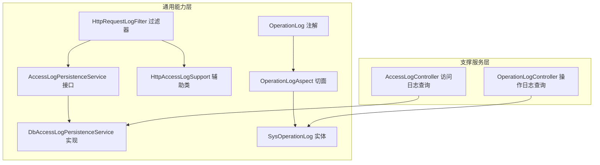
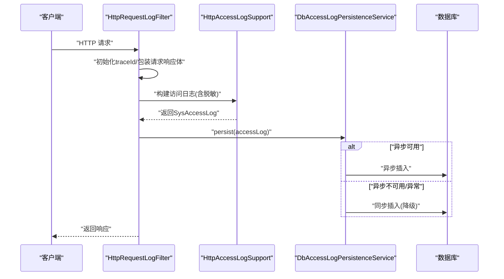
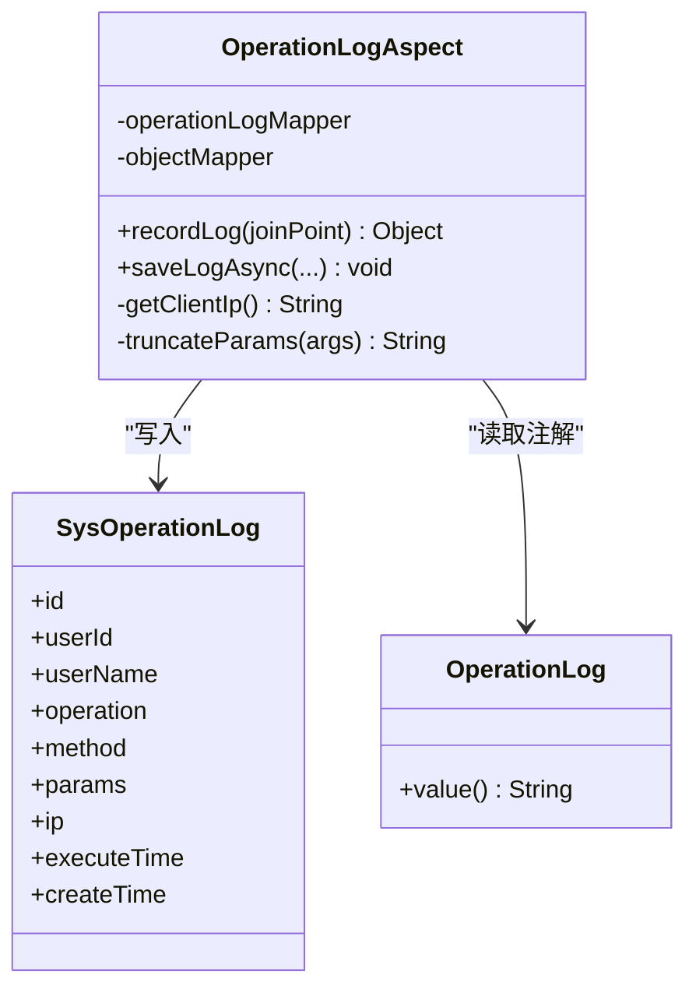
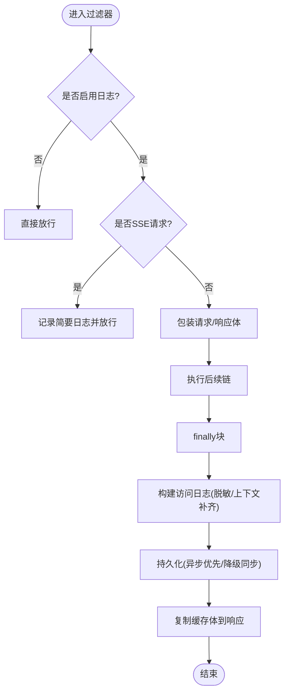
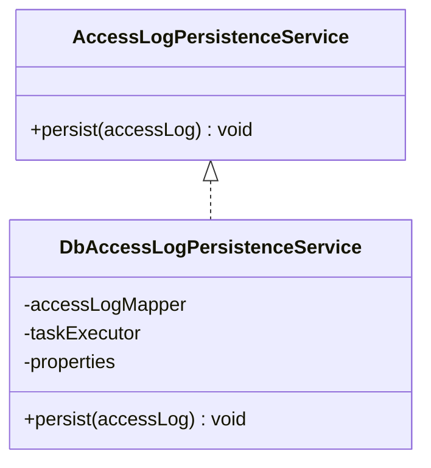
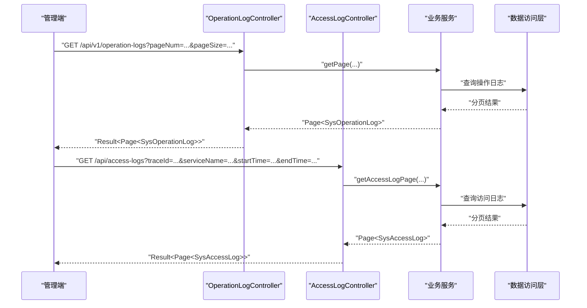
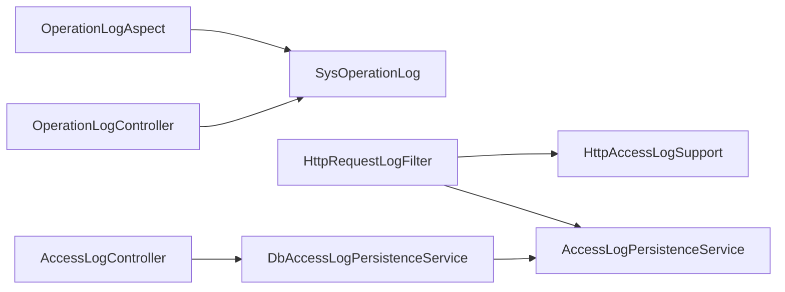

# 操作审计日志

<cite>
**本文引用的文件**   
- [OperationLog.java](file://ele-ai-tender-system/ele-ai-tender-common/src/main/java/com/jy/eleaitender/common/logging/OperationLog.java)
- [OperationLogAspect.java](file://ele-ai-tender-system/ele-ai-tender-support/src/main/java/com/jy/eleaitender/support/aspect/OperationLogAspect.java)
- [SysOperationLog.java](file://ele-ai-tender-system/ele-ai-tender-common/src/main/java/com/jy/eleaitender/common/entity/support/SysOperationLog.java)
- [OperationLogController.java](file://ele-ai-tender-system/ele-ai-tender-support/src/main/java/com/jy/eleaitender/support/controller/OperationLogController.java)
- [HttpRequestLogFilter.java](file://ele-ai-tender-system/ele-ai-tender-common/src/main/java/com/jy/eleaitender/common/logging/HttpRequestLogFilter.java)
- [HttpAccessLogSupport.java](file://ele-ai-tender-system/ele-ai-tender-common/src/main/java/com/jy/eleaitender/common/logging/HttpAccessLogSupport.java)
- [AccessLogPersistenceService.java](file://ele-ai-tender-system/ele-ai-tender-common/src/main/java/com/jy/eleaitender/common/logging/AccessLogPersistenceService.java)
- [DbAccessLogPersistenceService.java](file://ele-ai-tender-system/ele-ai-tender-common/src/main/java/com/jy/eleaitender/common/logging/DbAccessLogPersistenceService.java)
- [AccessLogController.java](file://ele-ai-tender-system/ele-ai-tender-support/src/main/java/com/jy/eleaitender/support/controller/AccessLogController.java)
</cite>

## 目录
1. [简介](#简介)
2. [项目结构](#项目结构)
3. [核心组件](#核心组件)
4. [架构总览](#架构总览)
5. [详细组件分析](#详细组件分析)
6. [依赖关系分析](#依赖关系分析)
7. [性能与存储优化](#性能与存储优化)
8. [故障排查指南](#故障排查指南)
9. [结论](#结论)
10. [附录：规范与合规建议](#附录规范与合规建议)

## 简介
本技术文档聚焦“操作审计日志”模块，覆盖以下关键能力：
- 操作日志记录：基于注解的AOP切面拦截、异步落库、参数脱敏与长度限制。
- 访问日志收集：通用HTTP过滤器采集请求/响应摘要、上下文补齐（用户、业务键、文件ID）、敏感头脱敏。
- 高级特性：分页查询接口、按多维度筛选、SSE流式请求兼容、异常路径记录。
- 运维要点：异步写入与降级策略、线程池配置、日志归档清理思路、安全保护与合规要求。

## 项目结构
该模块由“通用能力层”和“支撑服务层”共同组成：
- 通用能力层提供注解、切面、过滤器、持久化抽象与实现、辅助工具等。
- 支撑服务层提供控制器与数据访问，对外暴露查询与管理能力。

图表来源
- [OperationLog.java:1-21](file://ele-ai-tender-system/ele-ai-tender-common/src/main/java/com/jy/eleaitender/common/logging/OperationLog.java#L1-L21)
- [OperationLogAspect.java:1-146](file://ele-ai-tender-system/ele-ai-tender-support/src/main/java/com/jy/eleaitender/support/aspect/OperationLogAspect.java#L1-L146)
- [SysOperationLog.java:1-50](file://ele-ai-tender-system/ele-ai-tender-common/src/main/java/com/jy/eleaitender/common/entity/support/SysOperationLog.java#L1-L50)
- [HttpRequestLogFilter.java:1-137](file://ele-ai-tender-system/ele-ai-tender-common/src/main/java/com/jy/eleaitender/common/logging/HttpRequestLogFilter.java#L1-L137)
- [HttpAccessLogSupport.java:1-376](file://ele-ai-tender-system/ele-ai-tender-common/src/main/java/com/jy/eleaitender/common/logging/HttpAccessLogSupport.java#L1-L376)
- [AccessLogPersistenceService.java:1-12](file://ele-ai-tender-system/ele-ai-tender-common/src/main/java/com/jy/eleaitender/common/logging/AccessLogPersistenceService.java#L1-L12)
- [DbAccessLogPersistenceService.java:1-65](file://ele-ai-tender-system/ele-ai-tender-common/src/main/java/com/jy/eleaitender/common/logging/DbAccessLogPersistenceService.java#L1-L65)
- [OperationLogController.java:1-35](file://ele-ai-tender-system/ele-ai-tender-support/src/main/java/com/jy/eleaitender/support/controller/OperationLogController.java#L1-L35)
- [AccessLogController.java:1-64](file://ele-ai-tender-system/ele-ai-tender-support/src/main/java/com/jy/eleaitender/support/controller/AccessLogController.java#L1-L64)

章节来源
- [OperationLog.java:1-21](file://ele-ai-tender-system/ele-ai-tender-common/src/main/java/com/jy/eleaitender/common/logging/OperationLog.java#L1-L21)
- [OperationLogAspect.java:1-146](file://ele-ai-tender-system/ele-ai-tender-support/src/main/java/com/jy/eleaitender/support/aspect/OperationLogAspect.java#L1-L146)
- [HttpRequestLogFilter.java:1-137](file://ele-ai-tender-system/ele-ai-tender-common/src/main/java/com/jy/eleaitender/common/logging/HttpRequestLogFilter.java#L1-L137)
- [HttpAccessLogSupport.java:1-376](file://ele-ai-tender-system/ele-ai-tender-common/src/main/java/com/jy/eleaitender/common/logging/HttpAccessLogSupport.java#L1-L376)
- [AccessLogPersistenceService.java:1-12](file://ele-ai-tender-system/ele-ai-tender-common/src/main/java/com/jy/eleaitender/common/logging/AccessLogPersistenceService.java#L1-L12)
- [DbAccessLogPersistenceService.java:1-65](file://ele-ai-tender-system/ele-ai-tender-common/src/main/java/com/jy/eleaitender/common/logging/DbAccessLogPersistenceService.java#L1-L65)
- [OperationLogController.java:1-35](file://ele-ai-tender-system/ele-ai-tender-support/src/main/java/com/jy/eleaitender/support/controller/OperationLogController.java#L1-L35)
- [AccessLogController.java:1-64](file://ele-ai-tender-system/ele-ai-tender-support/src/main/java/com/jy/eleaitender/support/controller/AccessLogController.java#L1-L64)

## 核心组件
- 操作日志注解与切面
  - 注解用于声明需要记录的操作语义；切面在方法执行前后采集上下文、参数、耗时并异步落库。
- HTTP访问日志过滤器与辅助类
  - 过滤器统一包装请求/响应体，提取URL、状态码、耗时、错误信息，解析认证与业务上下文，并对敏感头进行脱敏。
- 访问日志持久化服务
  - 提供异步优先、失败降级的持久化策略，避免丢日志。
- 查询控制器
  - 提供操作日志与访问日志的分页查询接口，支持多维度筛选。

章节来源
- [OperationLog.java:1-21](file://ele-ai-tender-system/ele-ai-tender-common/src/main/java/com/jy/eleaitender/common/logging/OperationLog.java#L1-L21)
- [OperationLogAspect.java:1-146](file://ele-ai-tender-system/ele-ai-tender-support/src/main/java/com/jy/eleaitender/support/aspect/OperationLogAspect.java#L1-L146)
- [HttpRequestLogFilter.java:1-137](file://ele-ai-tender-system/ele-ai-tender-common/src/main/java/com/jy/eleaitender/common/logging/HttpRequestLogFilter.java#L1-L137)
- [HttpAccessLogSupport.java:1-376](file://ele-ai-tender-system/ele-ai-tender-common/src/main/java/com/jy/eleaitender/common/logging/HttpAccessLogSupport.java#L1-L376)
- [AccessLogPersistenceService.java:1-12](file://ele-ai-tender-system/ele-ai-tender-common/src/main/java/com/jy/eleaitender/common/logging/AccessLogPersistenceService.java#L1-L12)
- [DbAccessLogPersistenceService.java:1-65](file://ele-ai-tender-system/ele-ai-tender-common/src/main/java/com/jy/eleaitender/common/logging/DbAccessLogPersistenceService.java#L1-L65)
- [OperationLogController.java:1-35](file://ele-ai-tender-system/ele-ai-tender-support/src/main/java/com/jy/eleaitender/support/controller/OperationLogController.java#L1-L35)
- [AccessLogController.java:1-64](file://ele-ai-tender-system/ele-ai-tender-support/src/main/java/com/jy/eleaitender/support/controller/AccessLogController.java#L1-L64)

## 架构总览
整体采用“注解+AOP+过滤器+持久化服务”的分层设计：
- 操作日志：通过注解标记目标方法，切面统一采集并异步落库。
- 访问日志：通过过滤器统一采集HTTP出入参摘要，结合辅助类完成上下文补齐与脱敏，再交由持久化服务异步落库。
- 查询管理：支撑服务层提供分页查询接口，供管理端使用。

图表来源
- [HttpRequestLogFilter.java:41-106](file://ele-ai-tender-system/ele-ai-tender-common/src/main/java/com/jy/eleaitender/common/logging/HttpRequestLogFilter.java#L41-L106)
- [HttpAccessLogSupport.java:34-92](file://ele-ai-tender-system/ele-ai-tender-common/src/main/java/com/jy/eleaitender/common/logging/HttpAccessLogSupport.java#L34-L92)
- [DbAccessLogPersistenceService.java:28-63](file://ele-ai-tender-system/ele-ai-tender-common/src/main/java/com/jy/eleaitender/common/logging/DbAccessLogPersistenceService.java#L28-L63)

## 详细组件分析

### 操作日志：注解与AOP切面
- 注解定义
  - 用于标注方法级操作描述，便于切面识别与记录。
- 切面逻辑
  - 在主线程中采集用户上下文、方法签名、操作描述、入参、IP、耗时。
  - 成功或异常路径均记录日志，确保可追溯。
  - 参数序列化时过滤Servlet/Web对象，限制最大长度，避免日志膨胀。
  - 使用异步方法落库，降低对主流程的影响。

图表来源
- [OperationLog.java:1-21](file://ele-ai-tender-system/ele-ai-tender-common/src/main/java/com/jy/eleaitender/common/logging/OperationLog.java#L1-L21)
- [OperationLogAspect.java:39-86](file://ele-ai-tender-system/ele-ai-tender-support/src/main/java/com/jy/eleaitender/support/aspect/OperationLogAspect.java#L39-L86)
- [SysOperationLog.java:1-50](file://ele-ai-tender-system/ele-ai-tender-common/src/main/java/com/jy/eleaitender/common/entity/support/SysOperationLog.java#L1-L50)

章节来源
- [OperationLog.java:1-21](file://ele-ai-tender-system/ele-ai-tender-common/src/main/java/com/jy/eleaitender/common/logging/OperationLog.java#L1-L21)
- [OperationLogAspect.java:39-146](file://ele-ai-tender-system/ele-ai-tender-support/src/main/java/com/jy/eleaitender/support/aspect/OperationLogAspect.java#L39-L146)
- [SysOperationLog.java:1-50](file://ele-ai-tender-system/ele-ai-tender-common/src/main/java/com/jy/eleaitender/common/entity/support/SysOperationLog.java#L1-L50)

### 访问日志：过滤器与辅助类
- 过滤器职责
  - 统一拦截HTTP请求，生成traceId，包装请求/响应体以便多次读取。
  - 针对SSE流式请求不包装响应，避免事件丢失。
  - 在finally块中构建访问日志并持久化，最后将缓存体写回客户端。
- 辅助类职责
  - 抽取请求URI、方法、状态码、耗时、错误类型/消息。
  - 从Header与Body中提取认证与业务上下文（用户、企业、项目、标包、文件）。
  - 对敏感头（如Authorization、X-Signature）进行脱敏处理。
  - 对二进制/多部分请求体与响应体做占位处理，文本内容按配置截断。

图表来源
- [HttpRequestLogFilter.java:41-106](file://ele-ai-tender-system/ele-ai-tender-common/src/main/java/com/jy/eleaitender/common/logging/HttpRequestLogFilter.java#L41-L106)
- [HttpAccessLogSupport.java:34-92](file://ele-ai-tender-system/ele-ai-tender-common/src/main/java/com/jy/eleaitender/common/logging/HttpAccessLogSupport.java#L34-L92)
- [DbAccessLogPersistenceService.java:28-63](file://ele-ai-tender-system/ele-ai-tender-common/src/main/java/com/jy/eleaitender/common/logging/DbAccessLogPersistenceService.java#L28-L63)

章节来源
- [HttpRequestLogFilter.java:1-137](file://ele-ai-tender-system/ele-ai-tender-common/src/main/java/com/jy/eleaitender/common/logging/HttpRequestLogFilter.java#L1-L137)
- [HttpAccessLogSupport.java:1-376](file://ele-ai-tender-system/ele-ai-tender-common/src/main/java/com/jy/eleaitender/common/logging/HttpAccessLogSupport.java#L1-L376)

### 访问日志持久化服务
- 设计要点
  - 默认异步落库，若线程池不可用则自动降级为同步，保证不丢日志。
  - 根据配置开关决定是否持久化，避免不必要的IO开销。
  - 落库异常仅记录警告日志，不影响主流程。

图表来源
- [AccessLogPersistenceService.java:1-12](file://ele-ai-tender-system/ele-ai-tender-common/src/main/java/com/jy/eleaitender/common/logging/AccessLogPersistenceService.java#L1-L12)
- [DbAccessLogPersistenceService.java:1-65](file://ele-ai-tender-system/ele-ai-tender-common/src/main/java/com/jy/eleaitender/common/logging/DbAccessLogPersistenceService.java#L1-L65)

章节来源
- [AccessLogPersistenceService.java:1-12](file://ele-ai-tender-system/ele-ai-tender-common/src/main/java/com/jy/eleaitender/common/logging/AccessLogPersistenceService.java#L1-L12)
- [DbAccessLogPersistenceService.java:1-65](file://ele-ai-tender-system/ele-ai-tender-common/src/main/java/com/jy/eleaitender/common/logging/DbAccessLogPersistenceService.java#L1-L65)

### 查询与管理接口
- 操作日志查询
  - 提供分页查询，支持用户名、操作描述等条件筛选。
- 访问日志查询
  - 提供分页查询，支持traceId、服务名、状态码、业务键、项目/标包、时间范围等多维度筛选。

图表来源
- [OperationLogController.java:24-33](file://ele-ai-tender-system/ele-ai-tender-support/src/main/java/com/jy/eleaitender/support/controller/OperationLogController.java#L24-L33)
- [AccessLogController.java:31-62](file://ele-ai-tender-system/ele-ai-tender-support/src/main/java/com/jy/eleaitender/support/controller/AccessLogController.java#L31-L62)

章节来源
- [OperationLogController.java:1-35](file://ele-ai-tender-system/ele-ai-tender-support/src/main/java/com/jy/eleaitender/support/controller/OperationLogController.java#L1-L35)
- [AccessLogController.java:1-64](file://ele-ai-tender-system/ele-ai-tender-support/src/main/java/com/jy/eleaitender/support/controller/AccessLogController.java#L1-L64)

## 依赖关系分析
- 组件耦合
  - 切面依赖实体与对象映射器，负责构造并写入操作日志。
  - 过滤器依赖辅助类与持久化服务，负责构建访问日志并持久化。
  - 控制器依赖服务与数据访问层，提供查询能力。
- 外部依赖
  - JSON序列化、JWT解析、Spring Web包装器、MyBatis Plus分页插件等。

图表来源
- [OperationLogAspect.java:1-146](file://ele-ai-tender-system/ele-ai-tender-support/src/main/java/com/jy/eleaitender/support/aspect/OperationLogAspect.java#L1-L146)
- [SysOperationLog.java:1-50](file://ele-ai-tender-system/ele-ai-tender-common/src/main/java/com/jy/eleaitender/common/entity/support/SysOperationLog.java#L1-L50)
- [HttpRequestLogFilter.java:1-137](file://ele-ai-tender-system/ele-ai-tender-common/src/main/java/com/jy/eleaitender/common/logging/HttpRequestLogFilter.java#L1-L137)
- [HttpAccessLogSupport.java:1-376](file://ele-ai-tender-system/ele-ai-tender-common/src/main/java/com/jy/eleaitender/common/logging/HttpAccessLogSupport.java#L1-L376)
- [AccessLogPersistenceService.java:1-12](file://ele-ai-tender-system/ele-ai-tender-common/src/main/java/com/jy/eleaitender/common/logging/AccessLogPersistenceService.java#L1-L12)
- [DbAccessLogPersistenceService.java:1-65](file://ele-ai-tender-system/ele-ai-tender-common/src/main/java/com/jy/eleaitender/common/logging/DbAccessLogPersistenceService.java#L1-L65)
- [OperationLogController.java:1-35](file://ele-ai-tender-system/ele-ai-tender-support/src/main/java/com/jy/eleaitender/support/controller/OperationLogController.java#L1-L35)
- [AccessLogController.java:1-64](file://ele-ai-tender-system/ele-ai-tender-support/src/main/java/com/jy/eleaitender/support/controller/AccessLogController.java#L1-L64)

## 性能与存储优化
- 异步写入与降级
  - 访问日志默认异步落库，线程池不可用时自动降级同步，保障可用性。
- 参数与正文控制
  - 操作日志参数序列化时过滤Web对象并限制长度；访问日志对二进制/多部分正文打占位符，文本内容按配置截断。
- 敏感信息脱敏
  - 对Authorization、X-Signature等敏感头进行脱敏后再落库或输出。
- SSE兼容
  - 对SSE请求不包装响应体，避免异步事件丢失，减少内存占用。
- 索引与查询优化
  - 建议在数据库层对常用查询字段建立索引（如traceId、serviceName、statusCode、bizType、projectId、tenderId、createTime），以提升分页与筛选性能。
- 归档与清理
  - 建议结合定时任务或外部归档系统，按时间窗口滚动归档历史日志，定期清理过期数据，控制存储空间增长。

[本节为通用指导，无需列出具体文件来源]

## 故障排查指南
- 日志未记录
  - 检查过滤器是否启用、是否被其他过滤器短路；确认持久化服务是否开启；查看异步线程池是否可用。
- 参数为空或过长
  - 检查参数序列化过滤规则与长度限制；确认入参是否为Web对象导致被过滤。
- 敏感信息泄露
  - 确认敏感头是否在辅助类中被脱敏；检查控制台打印与落库路径是否一致。
- SSE请求无响应体
  - 确认过滤器对SSE请求走特殊分支，不包装响应体；检查下游是否正确设置Content-Type。
- 查询缓慢
  - 检查分页参数与筛选条件；评估数据库索引是否完善；必要时拆分大表或引入只读副本。

章节来源
- [HttpRequestLogFilter.java:41-106](file://ele-ai-tender-system/ele-ai-tender-common/src/main/java/com/jy/eleaitender/common/logging/HttpRequestLogFilter.java#L41-L106)
- [HttpAccessLogSupport.java:74-92](file://ele-ai-tender-system/ele-ai-tender-common/src/main/java/com/jy/eleaitender/common/logging/HttpAccessLogSupport.java#L74-L92)
- [DbAccessLogPersistenceService.java:28-63](file://ele-ai-tender-system/ele-ai-tender-common/src/main/java/com/jy/eleaitender/common/logging/DbAccessLogPersistenceService.java#L28-L63)

## 结论
该模块以注解+AOP与过滤器为核心，实现了操作日志与访问日志的统一采集、脱敏与持久化，并通过异步写入与降级策略保障高可用。配合多维查询接口，可满足日常审计与问题定位需求。在生产环境中，应重点关注异步线程池容量、日志大小控制、敏感信息脱敏与数据库索引优化，并结合归档策略控制存储成本。

[本节为总结性内容，无需列出具体文件来源]

## 附录：规范与合规建议
- 日志规范
  - 操作描述需明确业务动作与对象标识；参数尽量精简，避免包含敏感信息。
  - 访问日志统一格式输出，关键字段顺序固定，便于检索与平台对接。
- 审计合规
  - 保留必要的最小字段集，禁止明文记录密码、密钥等敏感信息。
  - 对跨域调用与外部系统交互，需在日志中体现appKey、token类型等上下文。
- 故障追溯最佳实践
  - 全链路traceId贯穿请求生命周期；在异常路径记录错误类型与消息摘要。
  - 对高频接口与大数据量接口，启用更严格的正文截断与占位策略。
- 告警与报表（扩展建议）
  - 可在持久化后增加异步事件发布，驱动告警与报表聚合（例如错误率突增、慢请求占比、敏感操作频次）。
  - 报表导出可通过后台任务批量拉取并按时间/业务维度汇总，避免在线查询压力。

[本节为概念性建议，无需列出具体文件来源]