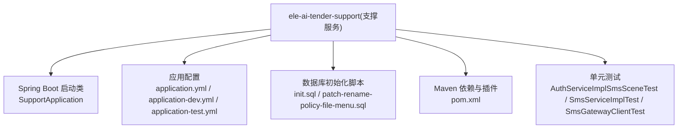
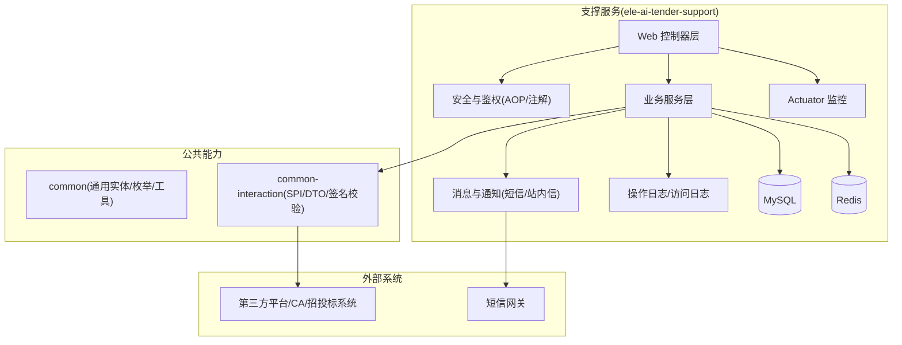
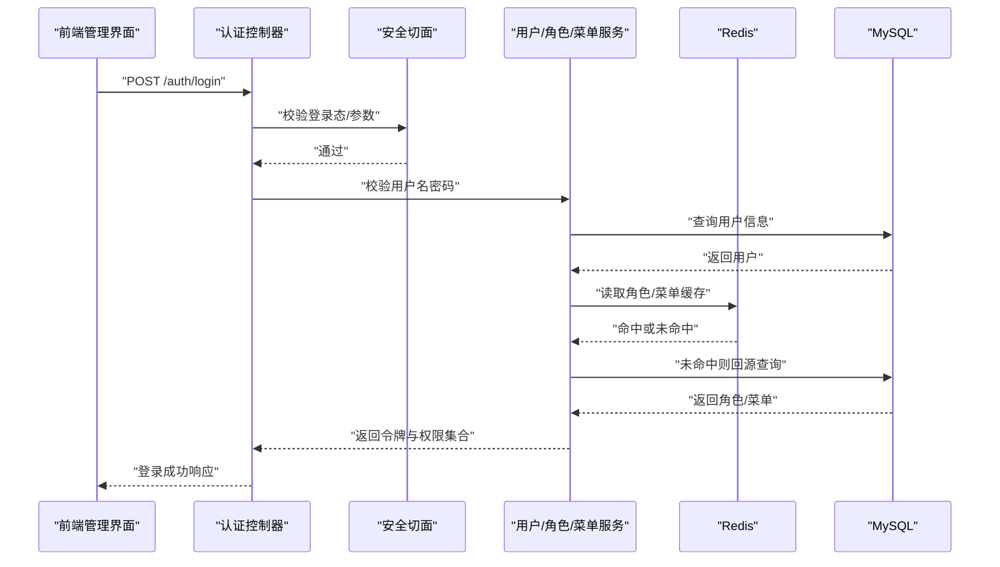
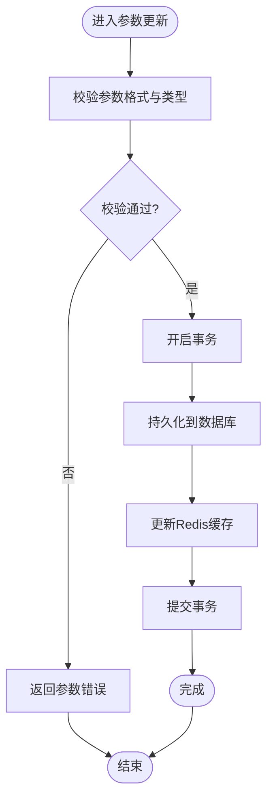
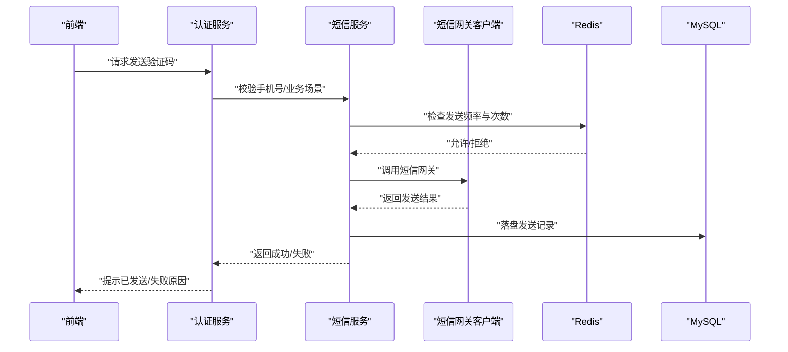
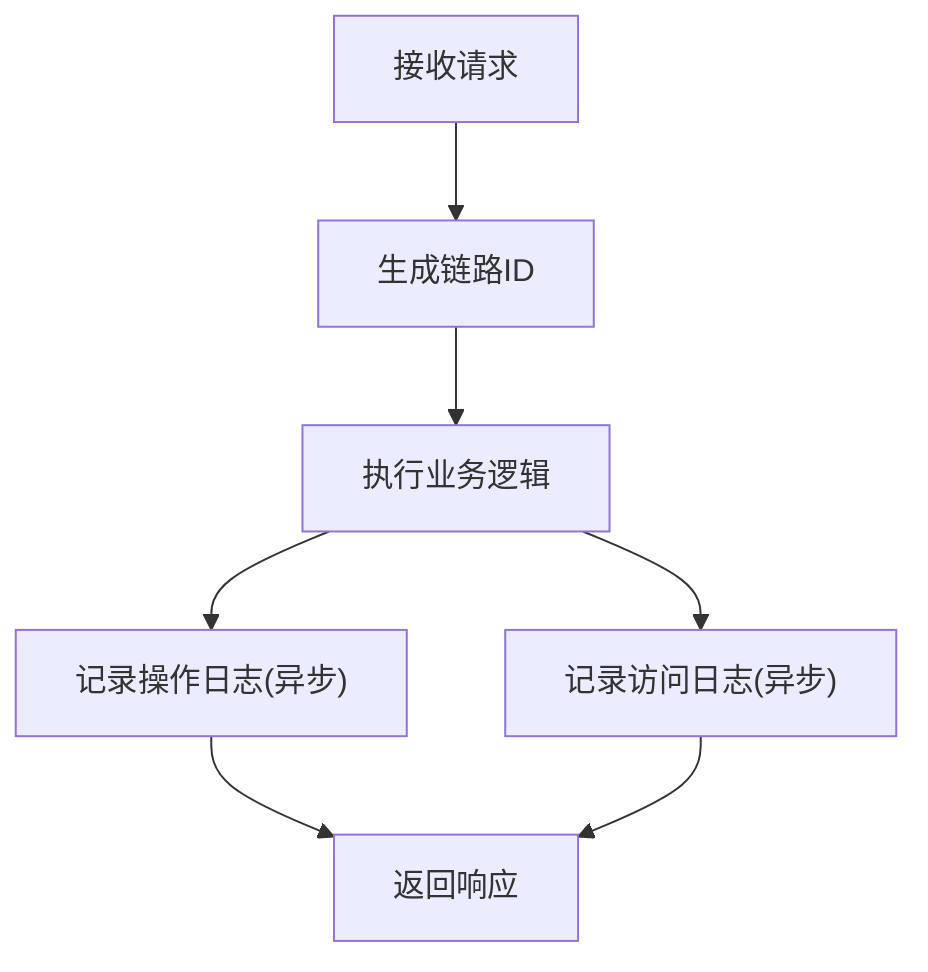
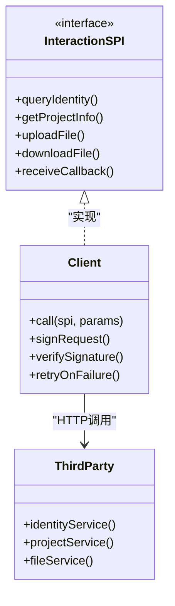
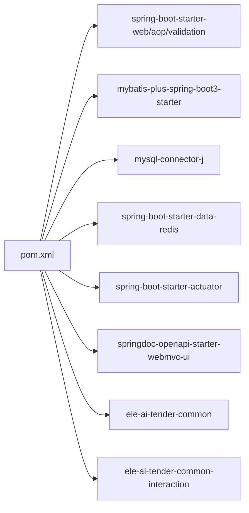

# 支撑服务 (ele-ai-tender-support)

<cite>
**本文引用的文件**   
- [pom.xml](file://ele-ai-tender-system/ele-ai-tender-support/pom.xml)
- [SupportApplication.java](file://ele-ai-tender-system/ele-ai-tender-support/src/main/java/com/jy/eleaitender/support/SupportApplication.java)
- [application.yml](file://ele-ai-tender-system/ele-ai-tender-support/src/main/resources/application.yml)
- [application-dev.yml](file://ele-ai-tender-system/ele-ai-tender-support/src/main/resources/application-dev.yml)
- [application-test.yml](file://ele-ai-tender-system/ele-ai-tender-support/src/main/resources/application-test.yml)
- [init.sql](file://ele-ai-tender-system/ele-ai-tender-support/sql/init.sql)
- [patch-rename-policy-file-menu.sql](file://ele-ai-tender-system/ele-ai-tender-support/sql/patch-rename-policy-file-menu.sql)
- [SUPPORT_SYSTEM_SPEC.md](file://docs/rules/SUPPORT_SYSTEM_SPEC.md)
- [AuthServiceImplSmsSceneTest.java](file://ele-ai-tender-system/ele-ai-tender-support/src/test/java/com/jy/eleaitender/support/service/impl/AuthServiceImplSmsSceneTest.java)
- [SmsServiceImplTest.java](file://ele-ai-tender-system/ele-ai-tender-support/src/test/java/com/jy/eleaitender/support/service/SmsServiceImplTest.java)
- [SmsGatewayClientTest.java](file://ele-ai-tender-system/ele-ai-tender-support/src/test/java/com/jy/eleaitender/support/service/SmsGatewayClientTest.java)
</cite>

## 目录
1. [简介](#简介)
2. [项目结构](#项目结构)
3. [核心组件](#核心组件)
4. [架构总览](#架构总览)
5. [详细组件分析](#详细组件分析)
6. [依赖分析](#依赖分析)
7. [性能考虑](#性能考虑)
8. [故障排查指南](#故障排查指南)
9. [结论](#结论)
10. [附录](#附录)

## 简介
本技术文档围绕“支撑服务”模块，系统性阐述其系统管理能力与扩展能力：用户权限管理、角色菜单配置、系统参数设置；短信网关集成、消息通知服务、操作日志记录；外部系统集成、第三方平台对接、API接口管理；以及系统监控、统计分析、版本管理等运维能力。同时给出配置管理、安全策略与性能监控的最佳实践建议，帮助读者快速理解并高效使用支撑服务。

## 项目结构
支撑服务采用 Spring Boot 工程组织，入口类为 SupportApplication，通过 Maven 构建打包，依赖包括 Web、AOP、Validation、MyBatis Plus、MySQL、Redis、Actuator 与 OpenAPI 等。资源文件包含多环境应用配置与数据库初始化脚本。测试覆盖短信场景与网关客户端行为验证。

图表来源
- [pom.xml:1-115](file://ele-ai-tender-system/ele-ai-tender-support/pom.xml#L1-L115)
- [SupportApplication.java](file://ele-ai-tender-system/ele-ai-tender-support/src/main/java/com/jy/eleaitender/support/SupportApplication.java)
- [application.yml](file://ele-ai-tender-system/ele-ai-tender-support/src/main/resources/application.yml)
- [application-dev.yml](file://ele-ai-tender-system/ele-ai-tender-support/src/main/resources/application-dev.yml)
- [application-test.yml](file://ele-ai-tender-system/ele-ai-tender-support/src/main/resources/application-test.yml)
- [init.sql](file://ele-ai-tender-system/ele-ai-tender-support/sql/init.sql)
- [patch-rename-policy-file-menu.sql](file://ele-ai-tender-system/ele-ai-tender-support/sql/patch-rename-policy-file-menu.sql)

章节来源
- [pom.xml:1-115](file://ele-ai-tender-system/ele-ai-tender-support/pom.xml#L1-L115)

## 核心组件
- 启动与装配
  - 启动类负责引导应用上下文，加载配置、数据源、缓存、Web 层与持久化组件。
- 配置与环境
  - 通过 application.yml 与多环境配置文件区分 dev/test 等运行环境，统一接入 Actuator 暴露健康与指标端点。
- 数据访问
  - 基于 MyBatis Plus + MySQL，提供用户、角色、菜单、参数、模板、消息、日志等基础数据的读写能力。
- 安全与鉴权
  - 结合 AOP 与注解实现登录校验、权限控制与数据范围过滤，支撑 RBAC 模型（用户-角色-菜单）。
- 消息与通知
  - 封装短信网关客户端，支持验证码发送、业务通知等场景；提供消息中心相关接口。
- 外部集成
  - 引入 common-interaction 包，定义交互 SPI 与 DTO，用于对接第三方平台（如 CA、电子招投标系统等）。
- 可观测性
  - 启用 Actuator 健康检查与指标采集；结合日志框架输出结构化日志，便于问题定位。

章节来源
- [SupportApplication.java](file://ele-ai-tender-system/ele-ai-tender-support/src/main/java/com/jy/eleaitender/support/SupportApplication.java)
- [application.yml](file://ele-ai-tender-system/ele-ai-tender-support/src/main/resources/application.yml)
- [application-dev.yml](file://ele-ai-tender-system/ele-ai-tender-support/src/main/resources/application-dev.yml)
- [application-test.yml](file://ele-ai-tender-system/ele-ai-tender-support/src/main/resources/application-test.yml)
- [SUPPORT_SYSTEM_SPEC.md](file://docs/rules/SUPPORT_SYSTEM_SPEC.md)

## 架构总览
支撑服务作为系统级能力底座，向上为核心业务模块与前端管理界面提供统一 API，向下通过数据库与缓存进行数据持久化与加速，并通过 SPI 与外部系统进行解耦集成。

图表来源
- [pom.xml:1-115](file://ele-ai-tender-system/ele-ai-tender-support/pom.xml#L1-L115)
- [SUPPORT_SYSTEM_SPEC.md](file://docs/rules/SUPPORT_SYSTEM_SPEC.md)

## 详细组件分析

### 用户权限与角色菜单
- 功能要点
  - 用户管理：创建、更新、禁用/启用、密码重置、分页查询。
  - 角色管理：角色增删改查、分配用户、数据范围控制。
  - 菜单管理：树形菜单维护、按钮权限标识、动态路由生成。
  - 鉴权流程：登录校验、Token 签发与校验、RBAC 权限判定。
- 关键实现
  - 安全切面与注解：在控制器方法上声明式鉴权，拦截未登录或无权限请求。
  - 数据范围：按组织/部门维度限制查询结果集，避免越权访问。
  - 缓存策略：将用户-角色-菜单关系缓存至 Redis，降低重复查询开销。
- 典型调用序列

图表来源
- [SUPPORT_SYSTEM_SPEC.md](file://docs/rules/SUPPORT_SYSTEM_SPEC.md)

章节来源
- [SUPPORT_SYSTEM_SPEC.md](file://docs/rules/SUPPORT_SYSTEM_SPEC.md)

### 系统参数设置
- 功能要点
  - 参数分组与类型：键值对形式存储，支持字符串、布尔、数字、JSON 等类型。
  - 热更新：变更后立即刷新缓存，业务侧按需拉取或监听变更事件。
  - 审计追踪：记录参数修改人、时间与变更内容。
- 关键实现
  - 参数服务：提供 CRUD 与批量更新接口，保证事务一致性。
  - 缓存同步：写入数据库后更新 Redis 对应键，确保读路径低延迟。
- 流程图

图表来源
- [SUPPORT_SYSTEM_SPEC.md](file://docs/rules/SUPPORT_SYSTEM_SPEC.md)

章节来源
- [SUPPORT_SYSTEM_SPEC.md](file://docs/rules/SUPPORT_SYSTEM_SPEC.md)

### 短信网关集成与消息通知
- 功能要点
  - 短信网关：封装第三方短信 SDK/HTTP 接口，支持重试、限流与失败告警。
  - 验证码：发送短信验证码、校验有效期与次数限制。
  - 消息通知：站内信与短信双通道，支持模板变量替换与发送记录。
- 关键实现
  - 网关客户端：统一抽象发送接口，屏蔽不同厂商差异。
  - 幂等与去重：基于手机号+业务码+时间窗口的去重策略，防止重复发送。
  - 异步发送：通过线程池或消息队列异步处理，提升吞吐。
- 测试覆盖
  - 验证码场景用例：覆盖正常发送、频率限制、过期校验等分支。
  - 网关客户端用例：模拟网络异常、超时、签名失败等边界条件。

图表来源
- [AuthServiceImplSmsSceneTest.java](file://ele-ai-tender-system/ele-ai-tender-support/src/test/java/com/jy/eleaitender/support/service/impl/AuthServiceImplSmsSceneTest.java)
- [SmsServiceImplTest.java](file://ele-ai-tender-system/ele-ai-tender-support/src/test/java/com/jy/eleaitender/support/service/SmsServiceImplTest.java)
- [SmsGatewayClientTest.java](file://ele-ai-tender-system/ele-ai-tender-support/src/test/java/com/jy/eleaitender/support/service/SmsGatewayClientTest.java)

章节来源
- [AuthServiceImplSmsSceneTest.java](file://ele-ai-tender-system/ele-ai-tender-support/src/test/java/com/jy/eleaitender/support/service/impl/AuthServiceImplSmsSceneTest.java)
- [SmsServiceImplTest.java](file://ele-ai-tender-system/ele-ai-tender-support/src/test/java/com/jy/eleaitender/support/service/SmsServiceImplTest.java)
- [SmsGatewayClientTest.java](file://ele-ai-tender-system/ele-ai-tender-support/src/test/java/com/jy/eleaitender/support/service/SmsGatewayClientTest.java)

### 操作日志与访问日志
- 功能要点
  - 操作日志：记录关键业务操作的主体、动作、对象、结果与耗时。
  - 访问日志：记录 HTTP 请求的入参、出参、状态码与链路 ID。
  - 审计导出：支持按时间、用户、模块筛选与导出。
- 关键实现
  - AOP 切面：在控制器或服务层埋点，自动收集上下文信息。
  - 异步落库：通过线程池异步写入，避免影响主流程性能。
  - 脱敏策略：对敏感字段进行掩码处理，保障数据安全。

图表来源
- [SUPPORT_SYSTEM_SPEC.md](file://docs/rules/SUPPORT_SYSTEM_SPEC.md)

章节来源
- [SUPPORT_SYSTEM_SPEC.md](file://docs/rules/SUPPORT_SYSTEM_SPEC.md)

### 外部系统集成与第三方平台对接
- 功能要点
  - SPI 抽象：定义身份查询、项目信息、文件上传下载、解密回调等接口。
  - 签名校验：请求签名与验签，防篡改与重放攻击。
  - 容错与重试：针对不稳定外部服务的熔断、降级与重试策略。
- 关键实现
  - 统一客户端：封装 HTTP 客户端、超时、重试、签名与序列化。
  - 回调处理：对外暴露回调接口，接收第三方推送结果并落库。
  - 配置隔离：不同第三方平台以独立配置项管理，便于切换与灰度。

图表来源
- [SUPPORT_SYSTEM_SPEC.md](file://docs/rules/SUPPORT_SYSTEM_SPEC.md)

章节来源
- [SUPPORT_SYSTEM_SPEC.md](file://docs/rules/SUPPORT_SYSTEM_SPEC.md)

### API 接口管理与文档
- 功能要点
  - 接口清单：统一的 RESTful 风格，规范路径、方法与返回体。
  - 在线文档：集成 OpenAPI/Swagger，自动生成接口文档与调试页面。
  - 版本管理：通过 URL 前缀或 Header 控制接口版本演进。
- 关键实现
  - 控制器分层：按领域划分 Controller，保持职责单一。
  - 统一响应：封装标准响应结构与错误码。
  - 文档注解：在接口与方法上添加描述与示例，提升可读性。

章节来源
- [pom.xml:1-115](file://ele-ai-tender-system/ele-ai-tender-support/pom.xml#L1-L115)

### 系统监控、统计分析与版本管理
- 功能要点
  - 健康检查：Actuator 暴露 /actuator/health 与 /actuator/info。
  - 指标采集：JVM、线程池、HTTP 请求耗时、SQL 执行耗时等。
  - 统计分析：用户活跃度、消息发送量、参数变更趋势等报表。
  - 版本管理：应用版本、依赖版本与数据库补丁版本管理。
- 关键实现
  - 指标上报：自定义 Micrometer 指标，聚合关键业务指标。
  - 定时任务：定期汇总统计数据，写入统计表供前端展示。
  - 发布说明：随版本发布附带 SQL 补丁与变更说明。

章节来源
- [pom.xml:1-115](file://ele-ai-tender-system/ele-ai-tender-support/pom.xml#L1-L115)

## 依赖分析
支撑服务依赖 Spring Boot 生态与内部通用模块，形成清晰的层次与边界。

图表来源
- [pom.xml:1-115](file://ele-ai-tender-system/ele-ai-tender-support/pom.xml#L1-L115)

章节来源
- [pom.xml:1-115](file://ele-ai-tender-system/ele-ai-tender-support/pom.xml#L1-L115)

## 性能考虑
- 缓存优先：用户-角色-菜单、系统参数等热点数据优先走 Redis，减少数据库压力。
- 连接池优化：合理配置数据库连接池大小与超时，避免连接耗尽。
- 异步处理：日志落库、消息发送等 IO 密集型操作异步化，缩短主链路时延。
- 限流与熔断：对短信网关与第三方接口实施限流与熔断，保护上游稳定性。
- 索引与分页：为高频查询字段建立索引，分页查询避免全表扫描。
- 监控告警：基于 Actuator 与日志阈值告警，及时发现性能瓶颈。

[本节为通用指导，不直接分析具体文件]

## 故障排查指南
- 登录与鉴权
  - 现象：登录失败或权限不足。
  - 排查：检查 Token 是否有效、角色-菜单绑定是否正确、Redis 缓存是否命中。
- 短信发送失败
  - 现象：验证码无法到达或频繁失败。
  - 排查：核对网关配置与签名、查看发送记录与失败原因、检查频率限制与黑名单。
- 外部接口异常
  - 现象：第三方平台回调失败或超时。
  - 排查：确认签名校验、网络连通性、重试策略与回调地址可达性。
- 监控与健康
  - 现象：服务不可用或指标异常。
  - 排查：查看 /actuator/health 与日志堆栈，关注线程池与数据库连接池状态。

章节来源
- [AuthServiceImplSmsSceneTest.java](file://ele-ai-tender-system/ele-ai-tender-support/src/test/java/com/jy/eleaitender/support/service/impl/AuthServiceImplSmsSceneTest.java)
- [SmsServiceImplTest.java](file://ele-ai-tender-system/ele-ai-tender-support/src/test/java/com/jy/eleaitender/support/service/SmsServiceImplTest.java)
- [SmsGatewayClientTest.java](file://ele-ai-tender-system/ele-ai-tender-support/src/test/java/com/jy/eleaitender/support/service/SmsGatewayClientTest.java)

## 结论
支撑服务以 RBAC 权限、系统参数、消息通知、操作日志与外部集成为核心能力，配合 Actuator 监控与 OpenAPI 文档，形成稳定可扩展的系统底座。通过合理的缓存、异步与限流策略，可在高并发场景下保持稳定与高性能。建议在上线前完善监控告警与压测报告，持续优化关键路径的性能与可靠性。

[本节为总结性内容，不直接分析具体文件]

## 附录
- 配置管理最佳实践
  - 使用多环境配置文件隔离敏感信息，生产环境通过环境变量注入。
  - 对密钥与证书进行加密存储，运行时解密。
- 安全策略
  - 强制 HTTPS、启用 CSRF 防护、严格 CORS 白名单。
  - 对敏感字段脱敏，操作日志保留必要审计信息。
- 性能监控
  - 启用 JVM 与 HTTP 指标，设置关键阈值告警。
  - 定期审查慢 SQL 与热点接口，持续优化。

[本节为通用指导，不直接分析具体文件]