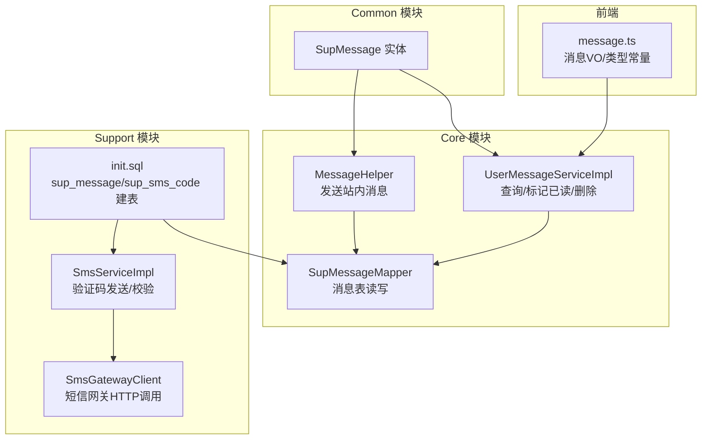
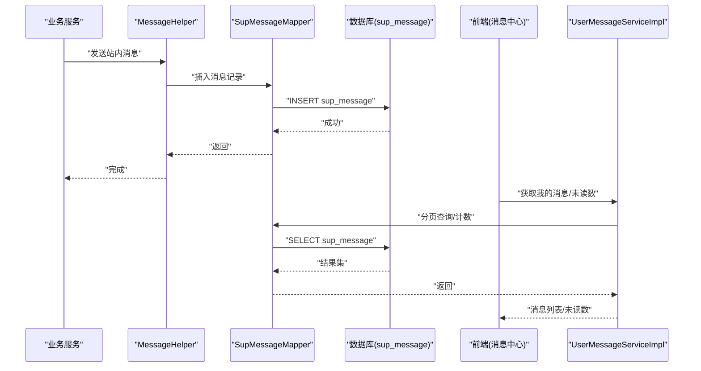
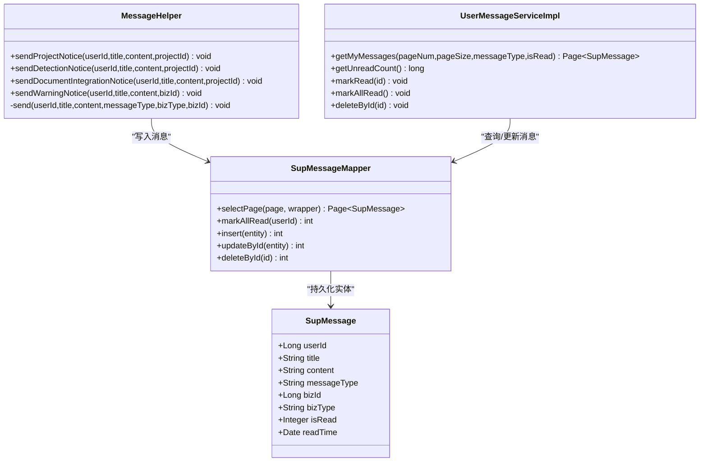
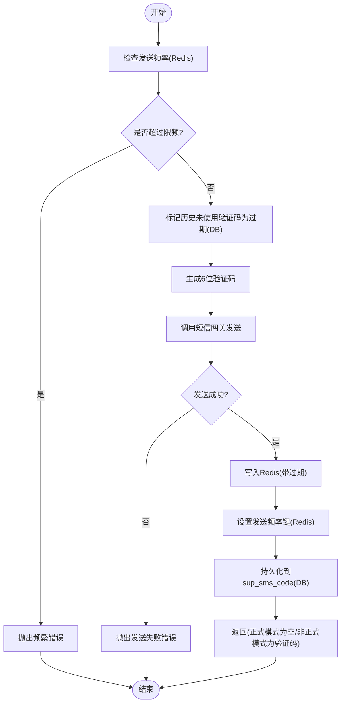
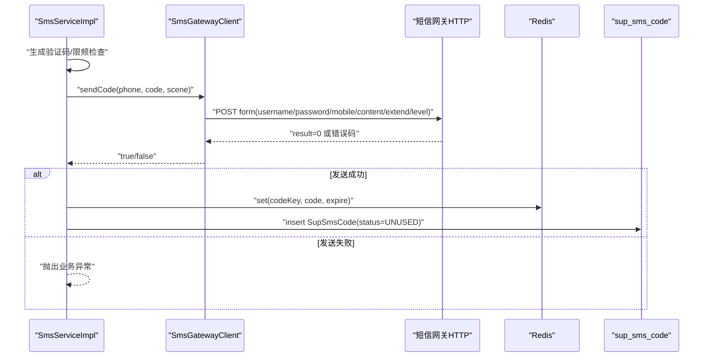
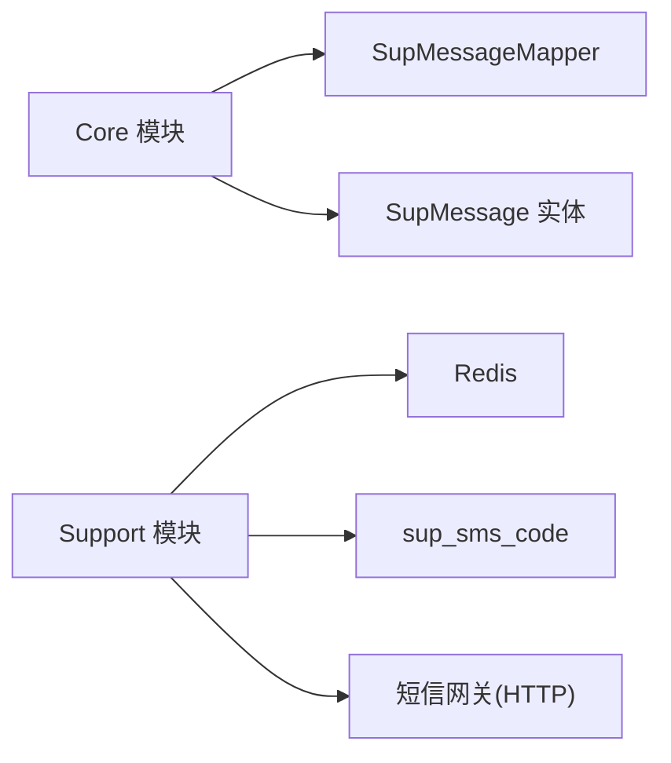
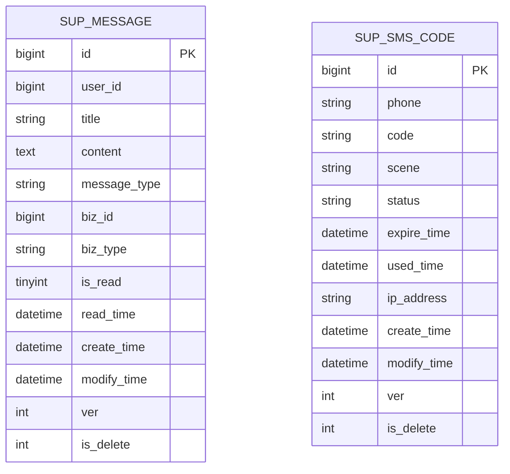

# 消息通知服务

<cite>
**本文引用的文件**   
- [SupMessage.java](file://ele-ai-tender-system/ele-ai-tender-common/src/main/java/com/jy/eleaitender/common/entity/support/SupMessage.java)
- [SupMessageMapper.java](file://ele-ai-tender-system/ele-ai-tender-core/src/main/java/com/jy/eleaitender/core/mapper/SupMessageMapper.java)
- [MessageHelper.java](file://ele-ai-tender-system/ele-ai-tender-core/src/main/java/com/jy/eleaitender/core/helper/MessageHelper.java)
- [UserMessageServiceImpl.java](file://ele-ai-tender-system/ele-ai-tender-core/src/main/java/com/jy/eleaitender/core/service/impl/UserMessageServiceImpl.java)
- [SmsServiceImpl.java](file://ele-ai-tender-system/ele-ai-tender-support/src/main/java/com/jy/eleaitender/support/service/impl/SmsServiceImpl.java)
- [ISmsService.java](file://ele-ai-tender-system/ele-ai-tender-support/src/main/java/com/jy/eleaitender/support/service/ISmsService.java)
- [SmsGatewayClient.java](file://ele-ai-tender-system/ele-ai-tender-support/src/main/java/com/jy/eleaitender/support/service/SmsGatewayClient.java)
- [init.sql](file://ele-ai-tender-system/ele-ai-tender-support/sql/init.sql)
- [message.ts](file://ele-ai-tender-frontend/src/types/message.ts)
</cite>

## 目录
1. [简介](#简介)
2. [项目结构](#项目结构)
3. [核心组件](#核心组件)
4. [架构总览](#架构总览)
5. [详细组件分析](#详细组件分析)
6. [依赖关系分析](#依赖关系分析)
7. [性能考虑](#性能考虑)
8. [故障排查指南](#故障排查指南)
9. [结论](#结论)
10. [附录](#附录)

## 简介
本技术文档聚焦于“消息通知服务”模块，覆盖站内消息、短信验证码等通知渠道的集成实现。文档从系统架构、数据流、处理逻辑、持久化与清理策略、安全传输、扩展开发、性能调优与监控告警等方面展开说明，帮助读者快速理解并高效使用该模块。

## 项目结构
消息通知相关能力分布在以下子模块：
- 通用实体定义：站内消息实体 SupMessage
- Core 模块：消息写入辅助类 MessageHelper、用户消息查询与状态管理 UserMessageServiceImpl、消息表映射 SupMessageMapper
- Support 模块：短信验证码服务 SmsServiceImpl、短信网关客户端 SmsGatewayClient、数据库初始化脚本 init.sql（包含 sup_message、sup_sms_code 等）
- 前端类型定义：message.ts（消息 VO 与类型常量）

图表来源
- [MessageHelper.java:1-68](file://ele-ai-tender-system/ele-ai-tender-core/src/main/java/com/jy/eleaitender/core/helper/MessageHelper.java#L1-L68)
- [UserMessageServiceImpl.java:1-77](file://ele-ai-tender-system/ele-ai-tender-core/src/main/java/com/jy/eleaitender/core/service/impl/UserMessageServiceImpl.java#L1-L77)
- [SupMessageMapper.java:1-21](file://ele-ai-tender-system/ele-ai-tender-core/src/main/java/com/jy/eleaitender/core/mapper/SupMessageMapper.java#L1-L21)
- [SmsServiceImpl.java:1-165](file://ele-ai-tender-system/ele-ai-tender-support/src/main/java/com/jy/eleaitender/support/service/impl/SmsServiceImpl.java#L1-L165)
- [SmsGatewayClient.java:1-128](file://ele-ai-tender-system/ele-ai-tender-support/src/main/java/com/jy/eleaitender/support/service/SmsGatewayClient.java#L1-L128)
- [init.sql:404-428](file://ele-ai-tender-system/ele-ai-tender-support/sql/init.sql#L404-L428)
- [SupMessage.java:1-44](file://ele-ai-tender-system/ele-ai-tender-common/src/main/java/com/jy/eleaitender/common/entity/support/SupMessage.java#L1-L44)
- [message.ts:1-20](file://ele-ai-tender-frontend/src/types/message.ts#L1-L20)

章节来源
- [MessageHelper.java:1-68](file://ele-ai-tender-system/ele-ai-tender-core/src/main/java/com/jy/eleaitender/core/helper/MessageHelper.java#L1-L68)
- [UserMessageServiceImpl.java:1-77](file://ele-ai-tender-system/ele-ai-tender-core/src/main/java/com/jy/eleaitender/core/service/impl/UserMessageServiceImpl.java#L1-L77)
- [SupMessageMapper.java:1-21](file://ele-ai-tender-system/ele-ai-tender-core/src/main/java/com/jy/eleaitender/core/mapper/SupMessageMapper.java#L1-L21)
- [SmsServiceImpl.java:1-165](file://ele-ai-tender-system/ele-ai-tender-support/src/main/java/com/jy/eleaitender/support/service/impl/SmsServiceImpl.java#L1-L165)
- [SmsGatewayClient.java:1-128](file://ele-ai-tender-system/ele-ai-tender-support/src/main/java/com/jy/eleaitender/support/service/SmsGatewayClient.java#L1-L128)
- [init.sql:404-428](file://ele-ai-tender-system/ele-ai-tender-support/sql/init.sql#L404-L428)
- [SupMessage.java:1-44](file://ele-ai-tender-system/ele-ai-tender-common/src/main/java/com/jy/eleaitender/common/entity/support/SupMessage.java#L1-L44)
- [message.ts:1-20](file://ele-ai-tender-frontend/src/types/message.ts#L1-L20)

## 核心组件
- 站内消息实体与持久化
  - SupMessage：定义目标用户、标题、内容、消息类型、业务ID/类型、是否已读、阅读时间等字段。
  - SupMessageMapper：提供分页查询、批量标记已读等基础操作。
- 消息写入辅助类
  - MessageHelper：封装常见场景的消息写入（项目通知、检测通知、警告通知等），统一设置消息类型与业务类型。
- 用户消息服务
  - UserMessageServiceImpl：提供我的消息列表、未读计数、单条/全部标记已读、删除等操作。
- 短信验证码服务
  - ISmsService：定义发送验证码、校验验证码接口。
  - SmsServiceImpl：实现验证码生成、频率限制、过期处理、Redis+DB双写、一次性使用等。
  - SmsGatewayClient：对接公司短信网关，支持正式/非正式模式、表单参数组装、响应解析与异常处理。
- 数据库表
  - sup_message：站内消息主表，含索引优化查询。
  - sup_sms_code：短信验证码审计表，记录手机号、验证码、场景、状态、过期时间、IP等。

章节来源
- [SupMessage.java:1-44](file://ele-ai-tender-system/ele-ai-tender-common/src/main/java/com/jy/eleaitender/common/entity/support/SupMessage.java#L1-L44)
- [SupMessageMapper.java:1-21](file://ele-ai-tender-system/ele-ai-tender-core/src/main/java/com/jy/eleaitender/core/mapper/SupMessageMapper.java#L1-L21)
- [MessageHelper.java:1-68](file://ele-ai-tender-system/ele-ai-tender-core/src/main/java/com/jy/eleaitender/core/helper/MessageHelper.java#L1-L68)
- [UserMessageServiceImpl.java:1-77](file://ele-ai-tender-system/ele-ai-tender-core/src/main/java/com/jy/eleaitender/core/service/impl/UserMessageServiceImpl.java#L1-L77)
- [ISmsService.java:1-36](file://ele-ai-tender-system/ele-ai-tender-support/src/main/java/com/jy/eleaitender/support/service/ISmsService.java#L1-L36)
- [SmsServiceImpl.java:1-165](file://ele-ai-tender-system/ele-ai-tender-support/src/main/java/com/jy/eleaitender/support/service/impl/SmsServiceImpl.java#L1-L165)
- [SmsGatewayClient.java:1-128](file://ele-ai-tender-system/ele-ai-tender-support/src/main/java/com/jy/eleaitender/support/service/SmsGatewayClient.java#L1-L128)
- [init.sql:404-428](file://ele-ai-tender-system/ele-ai-tender-support/sql/init.sql#L404-L428)

## 架构总览
消息通知服务采用“直写持久化 + 外部网关调用”的轻量架构：
- 站内消息：业务侧通过 MessageHelper 直接写入 sup_message 表；用户端通过 UserMessageServiceImpl 进行查询与状态更新。
- 短信验证码：SmsServiceImpl 负责生成验证码、限频与过期处理，先调用 SmsGatewayClient 发送短信，成功后将验证码写入 Redis（快速校验）与 DB（审计）。
- 前端通过 message.ts 中的消息 VO 与类型常量展示消息中心与未读数。

图表来源
- [MessageHelper.java:1-68](file://ele-ai-tender-system/ele-ai-tender-core/src/main/java/com/jy/eleaitender/core/helper/MessageHelper.java#L1-L68)
- [SupMessageMapper.java:1-21](file://ele-ai-tender-system/ele-ai-tender-core/src/main/java/com/jy/eleaitender/core/mapper/SupMessageMapper.java#L1-L21)
- [UserMessageServiceImpl.java:1-77](file://ele-ai-tender-system/ele-ai-tender-core/src/main/java/com/jy/eleaitender/core/service/impl/UserMessageServiceImpl.java#L1-L77)
- [init.sql:404-428](file://ele-ai-tender-system/ele-ai-tender-support/sql/init.sql#L404-L428)

## 详细组件分析

### 站内消息组件
- 功能要点
  - 消息写入：MessageHelper 根据场景设置消息类型与业务类型，统一落库。
  - 消息读取：UserMessageServiceImpl 支持按用户、类型、已读状态筛选，按创建时间倒序分页。
  - 状态管理：支持单条/批量标记已读，记录阅读时间；支持删除。
- 数据结构
  - SupMessage 包含用户ID、标题、内容、消息类型、业务ID/类型、是否已读、阅读时间等。
- 关键流程
  - 写入：业务调用 → MessageHelper.send(...) → SupMessageMapper.insert → 数据库
  - 读取：前端请求 → UserMessageServiceImpl.getMyMessages(...) → SupMessageMapper.selectPage → 数据库
  - 已读：markRead/markAllRead → SupMessageMapper.updateById/markAllRead → 数据库

图表来源
- [SupMessage.java:1-44](file://ele-ai-tender-system/ele-ai-tender-common/src/main/java/com/jy/eleaitender/common/entity/support/SupMessage.java#L1-L44)
- [SupMessageMapper.java:1-21](file://ele-ai-tender-system/ele-ai-tender-core/src/main/java/com/jy/eleaitender/core/mapper/SupMessageMapper.java#L1-L21)
- [MessageHelper.java:1-68](file://ele-ai-tender-system/ele-ai-tender-core/src/main/java/com/jy/eleaitender/core/helper/MessageHelper.java#L1-L68)
- [UserMessageServiceImpl.java:1-77](file://ele-ai-tender-system/ele-ai-tender-core/src/main/java/com/jy/eleaitender/core/service/impl/UserMessageServiceImpl.java#L1-L77)

章节来源
- [SupMessage.java:1-44](file://ele-ai-tender-system/ele-ai-tender-common/src/main/java/com/jy/eleaitender/common/entity/support/SupMessage.java#L1-L44)
- [SupMessageMapper.java:1-21](file://ele-ai-tender-system/ele-ai-tender-core/src/main/java/com/jy/eleaitender/core/mapper/SupMessageMapper.java#L1-L21)
- [MessageHelper.java:1-68](file://ele-ai-tender-system/ele-ai-tender-core/src/main/java/com/jy/eleaitender/core/helper/MessageHelper.java#L1-L68)
- [UserMessageServiceImpl.java:1-77](file://ele-ai-tender-system/ele-ai-tender-core/src/main/java/com/jy/eleaitender/core/service/impl/UserMessageServiceImpl.java#L1-L77)

### 短信验证码组件
- 功能要点
  - 发送流程：生成验证码 → 检查发送频率 → 调用短信网关 → 成功后写入 Redis 与 DB → 返回（正式模式返回空，非正式模式返回验证码用于测试）。
  - 校验流程：从 Redis 取验证码 → 比对 → 成功后删除 Redis 条目并标记 DB 为已使用。
  - 过期与限频：验证码有效期固定分钟数；同一手机号在固定秒数内不可重复发送；新发送会标记之前未使用的验证码为过期。
- 关键流程

图表来源
- [SmsServiceImpl.java:1-165](file://ele-ai-tender-system/ele-ai-tender-support/src/main/java/com/jy/eleaitender/support/service/impl/SmsServiceImpl.java#L1-L165)
- [SmsGatewayClient.java:1-128](file://ele-ai-tender-system/ele-ai-tender-support/src/main/java/com/jy/eleaitender/support/service/SmsGatewayClient.java#L1-L128)
- [init.sql:404-428](file://ele-ai-tender-system/ele-ai-tender-support/sql/init.sql#L404-L428)

- 短信网关交互时序

图表来源
- [SmsServiceImpl.java:1-165](file://ele-ai-tender-system/ele-ai-tender-support/src/main/java/com/jy/eleaitender/support/service/impl/SmsServiceImpl.java#L1-L165)
- [SmsGatewayClient.java:1-128](file://ele-ai-tender-system/ele-ai-tender-support/src/main/java/com/jy/eleaitender/support/service/SmsGatewayClient.java#L1-L128)

章节来源
- [SmsServiceImpl.java:1-165](file://ele-ai-tender-system/ele-ai-tender-support/src/main/java/com/jy/eleaitender/support/service/impl/SmsServiceImpl.java#L1-L165)
- [ISmsService.java:1-36](file://ele-ai-tender-system/ele-ai-tender-support/src/main/java/com/jy/eleaitender/support/service/ISmsService.java#L1-L36)
- [SmsGatewayClient.java:1-128](file://ele-ai-tender-system/ele-ai-tender-support/src/main/java/com/jy/eleaitender/support/service/SmsGatewayClient.java#L1-L128)
- [init.sql:404-428](file://ele-ai-tender-system/ele-ai-tender-support/sql/init.sql#L404-L428)

### 前端消息展示
- 前端类型定义 message.ts 定义了消息 VO 与消息类型常量，便于消息中心页面渲染与过滤。
- 典型用法：根据 messageType 过滤消息列表，根据 isRead 显示未读徽章。

章节来源
- [message.ts:1-20](file://ele-ai-tender-frontend/src/types/message.ts#L1-L20)

## 依赖关系分析
- 模块耦合
  - Core 模块通过 SupMessageMapper 直接访问 sup_message 表，MessageHelper 作为统一入口降低业务侧复杂度。
  - Support 模块通过 SmsServiceImpl 组合 Redis、DB 与外部网关，形成独立可复用的短信能力。
- 外部依赖
  - Redis：用于验证码快速校验与发送频率控制。
  - 短信网关：HTTP 表单调用，支持正式/非正式模式切换。
- 潜在风险
  - 当前站内消息为同步直写，无异步队列与重试机制；在高并发下可能成为热点写入点。
  - 短信发送失败时直接抛错，缺少重试与降级策略。

图表来源
- [SupMessageMapper.java:1-21](file://ele-ai-tender-system/ele-ai-tender-core/src/main/java/com/jy/eleaitender/core/mapper/SupMessageMapper.java#L1-L21)
- [SupMessage.java:1-44](file://ele-ai-tender-system/ele-ai-tender-common/src/main/java/com/jy/eleaitender/common/entity/support/SupMessage.java#L1-L44)
- [SmsServiceImpl.java:1-165](file://ele-ai-tender-system/ele-ai-tender-support/src/main/java/com/jy/eleaitender/support/service/impl/SmsServiceImpl.java#L1-L165)
- [SmsGatewayClient.java:1-128](file://ele-ai-tender-system/ele-ai-tender-support/src/main/java/com/jy/eleaitender/support/service/SmsGatewayClient.java#L1-L128)

章节来源
- [SupMessageMapper.java:1-21](file://ele-ai-tender-system/ele-ai-tender-core/src/main/java/com/jy/eleaitender/core/mapper/SupMessageMapper.java#L1-L21)
- [SupMessage.java:1-44](file://ele-ai-tender-system/ele-ai-tender-common/src/main/java/com/jy/eleaitender/common/entity/support/SupMessage.java#L1-L44)
- [SmsServiceImpl.java:1-165](file://ele-ai-tender-system/ele-ai-tender-support/src/main/java/com/jy/eleaitender/support/service/impl/SmsServiceImpl.java#L1-L165)
- [SmsGatewayClient.java:1-128](file://ele-ai-tender-system/ele-ai-tender-support/src/main/java/com/jy/eleaitender/support/service/SmsGatewayClient.java#L1-L128)

## 性能考虑
- 数据库索引
  - sup_message 表已对 user_id、message_type、is_read、create_time 建立索引，利于分页与统计查询。
- 缓存与限频
  - 短信验证码使用 Redis 做快速校验与发送频率控制，减少 DB 压力。
- 写入路径
  - 站内消息为同步直写，建议在高并发场景引入消息队列与异步批处理，提升吞吐与稳定性。
- 连接池与超时
  - 短信网关 HTTP 调用需合理配置 RestOperations 的连接池、超时与重试策略，避免雪崩。

[本节为通用指导，不直接分析具体文件]

## 故障排查指南
- 短信发送失败
  - 现象：抛出“验证码发送失败，请稍后重试”。
  - 排查要点：
    - 确认正式模式配置完整（用户名、密码、扩展字段、URL）。
    - 检查网关响应是否包含 result 字段且值为成功码。
    - 查看网络异常日志与网关返回 msg 信息。
- 验证码校验失败
  - 现象：提示验证码错误或不存在。
  - 排查要点：
    - 检查 Redis 中对应 key 是否存在且未过期。
    - 确认验证码是否为一次性使用（验证成功后会被删除）。
    - 核对场景值是否一致（默认 LOGIN）。
- 站内消息未显示
  - 现象：消息中心无消息或未读数为零。
  - 排查要点：
    - 确认消息是否成功插入 sup_message。
    - 检查查询条件（userId、messageType、isRead）是否正确。
    - 确认前端类型常量与后端枚举保持一致。

章节来源
- [SmsGatewayClient.java:1-128](file://ele-ai-tender-system/ele-ai-tender-support/src/main/java/com/jy/eleaitender/support/service/SmsGatewayClient.java#L1-L128)
- [SmsServiceImpl.java:1-165](file://ele-ai-tender-system/ele-ai-tender-support/src/main/java/com/jy/eleaitender/support/service/impl/SmsServiceImpl.java#L1-L165)
- [UserMessageServiceImpl.java:1-77](file://ele-ai-tender-system/ele-ai-tender-core/src/main/java/com/jy/eleaitender/core/service/impl/UserMessageServiceImpl.java#L1-L77)

## 结论
该消息通知服务以轻量直写为主，具备站内消息与短信验证码两大核心能力。当前实现满足基本业务需求，但在高并发与可靠性方面仍有提升空间。建议后续引入消息队列与重试机制，完善模板管理与路由规则，增强统计分析与监控告警能力，以提升整体可用性与可观测性。

[本节为总结性内容，不直接分析具体文件]

## 附录

### 数据模型概览
- sup_message：站内消息主表，包含用户、标题、内容、类型、业务关联、已读状态与时间戳等。
- sup_sms_code：短信验证码审计表，包含手机号、验证码、场景、状态、过期时间、IP 与时间戳等。

图表来源
- [init.sql:404-428](file://ele-ai-tender-system/ele-ai-tender-support/sql/init.sql#L404-L428)

### 扩展与最佳实践
- 消息模板管理
  - 建议将消息内容与格式抽取为模板，结合业务类型与场景动态渲染，提高复用性与一致性。
- 消息路由规则
  - 基于消息类型与业务类型构建路由表，支持多渠道分发（站内、短信、邮件等）。
- 异步与重试
  - 引入消息队列承载高并发写入；对第三方调用增加指数退避重试与死信队列。
- 安全传输
  - 对外部网关调用启用 HTTPS；敏感字段加密传输；对请求签名与鉴权进行加固。
- 监控告警
  - 埋点统计发送成功率、失败率、耗时；对阈值异常触发告警；保留关键链路日志以便追溯。

[本节为通用指导，不直接分析具体文件]