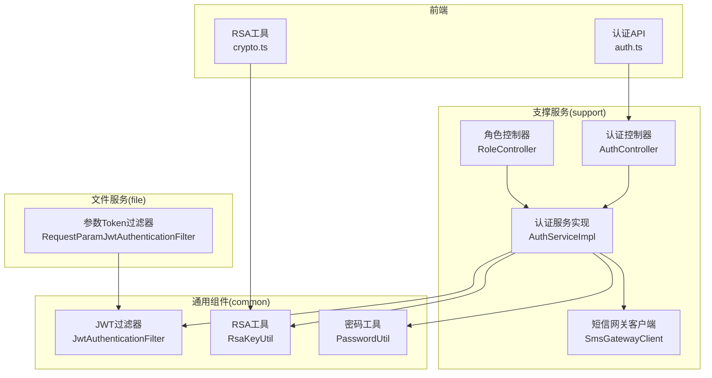
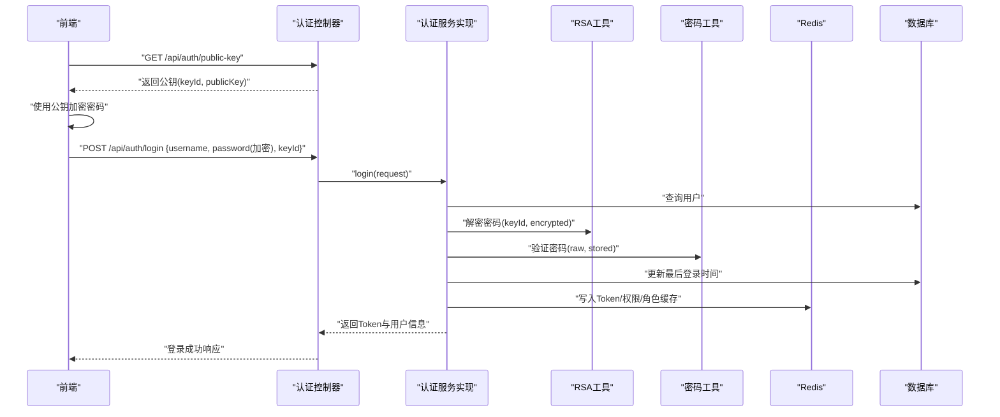
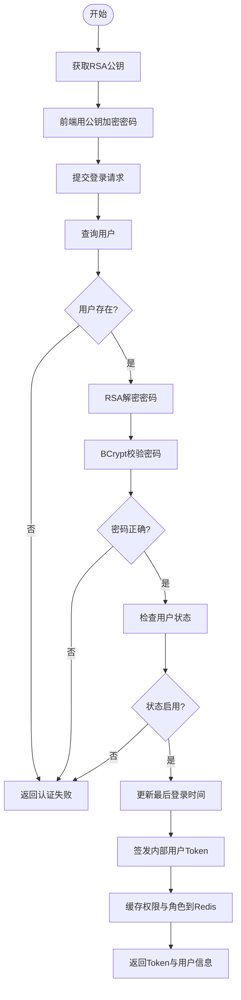
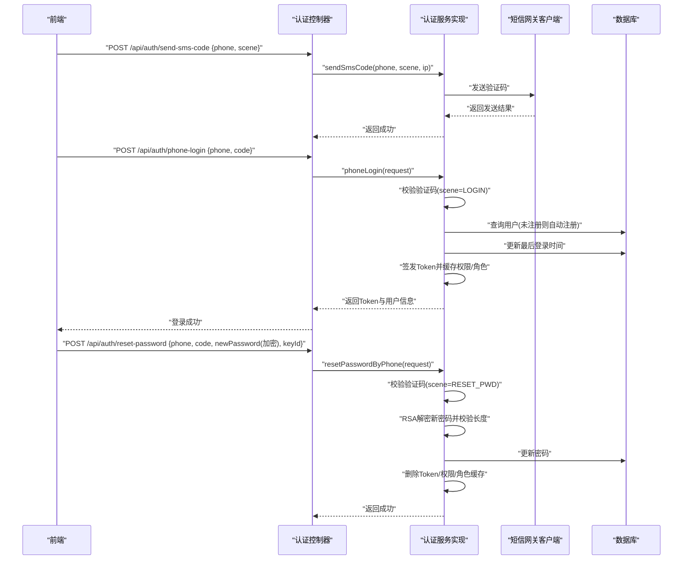
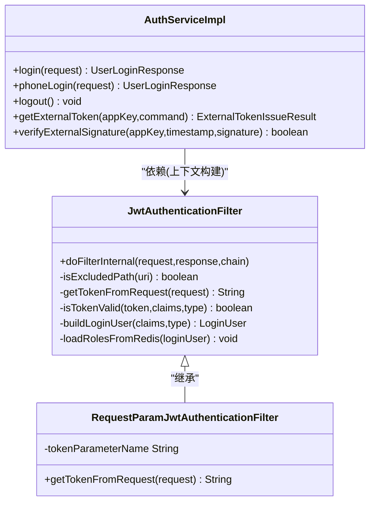
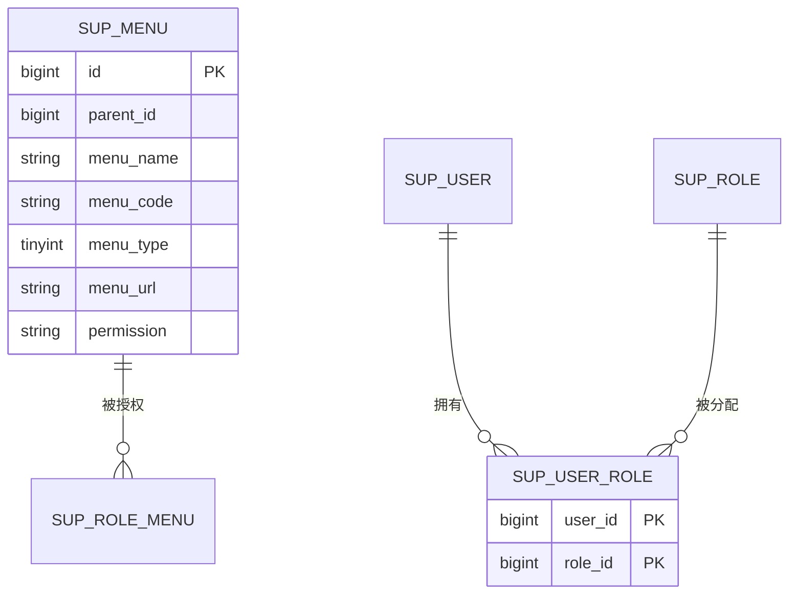
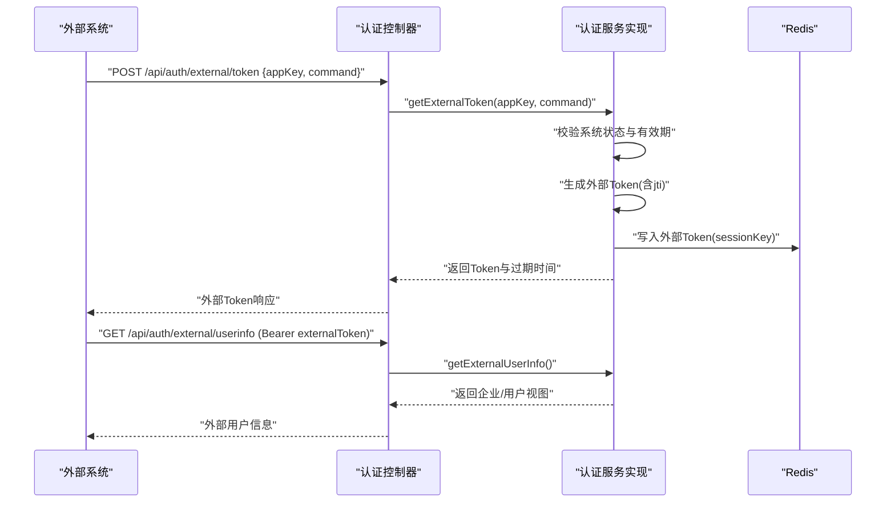
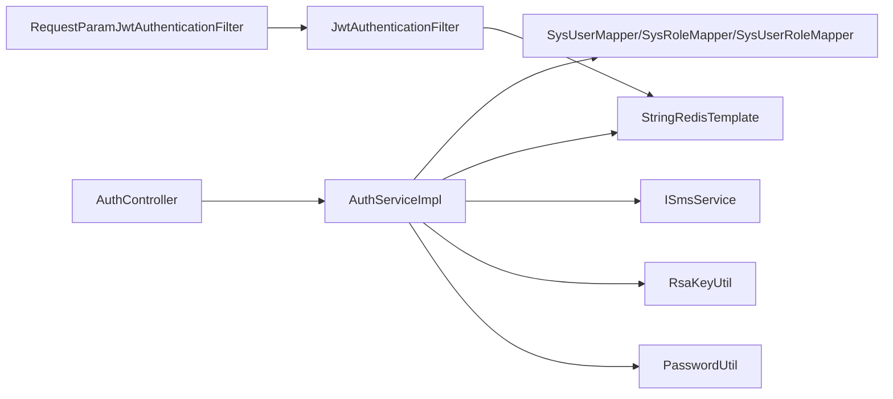

# 用户认证与权限管理

<cite>
**本文引用的文件**   
- [AuthController.java](file://ele-ai-tender-system/ele-ai-tender-support/src/main/java/com/jy/eleaitender/support/controller/AuthController.java)
- [AuthServiceImpl.java](file://ele-ai-tender-system/ele-ai-tender-support/src/main/java/com/jy/eleaitender/support/service/impl/AuthServiceImpl.java)
- [IAuthService.java](file://ele-ai-tender-system/ele-ai-tender-support/src/main/java/com/jy/eleaitender/support/service/IAuthService.java)
- [JwtAuthenticationFilter.java](file://ele-ai-tender-system/ele-ai-tender-common/src/main/java/com/jy/eleaitender/common/security/JwtAuthenticationFilter.java)
- [RequestParamJwtAuthenticationFilter.java](file://ele-ai-tender-system/ele-ai-tender-file/src/main/java/com/jy/eleaitender/file/security/RequestParamJwtAuthenticationFilter.java)
- [RsaKeyUtil.java](file://ele-ai-tender-system/ele-ai-tender-common/src/main/java/com/jy/eleaitender/common/util/RsaKeyUtil.java)
- [PasswordUtil.java](file://ele-ai-tender-system/ele-ai-tender-common/src/main/java/com/jy/eleaitender/common/util/PasswordUtil.java)
- [RoleController.java](file://ele-ai-tender-system/ele-ai-tender-support/src/main/java/com/jy/eleaitender/support/controller/RoleController.java)
- [init.sql](file://ele-ai-tender-system/ele-ai-tender-support/sql/init.sql)
- [auth.ts（支持端前端）](file://ele-ai-tender-support-frontend/src/api/auth.ts)
- [crypto.ts（支持端前端）](file://ele-ai-tender-support-frontend/src/utils/crypto.ts)
- [SmsGatewayClient.java](file://ele-ai-tender-system/ele-ai-tender-support/src/main/java/com/jy/eleaitender/support/service/SmsGatewayClient.java)
- [AuthServiceImplSmsSceneTest.java](file://ele-ai-tender-system/ele-ai-tender-support/src/test/java/com/jy/eleaitender/support/service/impl/AuthServiceImplSmsSceneTest.java)
</cite>

## 目录
1. [简介](#简介)
2. [项目结构](#项目结构)
3. [核心组件](#核心组件)
4. [架构总览](#架构总览)
5. [详细组件分析](#详细组件分析)
6. [依赖关系分析](#依赖关系分析)
7. [性能考虑](#性能考虑)
8. [故障排查指南](#故障排查指南)
9. [结论](#结论)
10. [附录](#附录)

## 简介
本技术文档聚焦于“用户认证与权限管理”模块，覆盖以下关键能力：
- 用户注册登录、密码加密存储、RSA 明文传输保护
- JWT 令牌签发、校验与会话控制（含内部用户、外部系统、服务间调用三类 Token）
- 角色权限控制、菜单权限管理、数据权限隔离
- 短信验证码登录与重置密码
- 外部系统集成认证（AppKey/AppSecret + 签名校验 + 外部 Token）
- 用户状态管理与会话控制策略
- 安全设计模式、最佳实践与常见问题解决方案

## 项目结构
认证与权限相关代码主要分布在以下位置：
- 支撑服务（support）：认证控制器、认证服务实现、短信网关客户端、角色菜单接口等
- 通用组件（common）：JWT 过滤器、RSA 工具、密码工具、常量与异常定义等
- 文件服务（file）：提供基于请求参数的 Token 提取过滤器，适配特定场景
- 前端（support-frontend）：登录、获取公钥、修改密码、获取菜单等 API 调用与 RSA 加密

图表来源
- [AuthController.java:1-129](file://ele-ai-tender-system/ele-ai-tender-support/src/main/java/com/jy/eleaitender/support/controller/AuthController.java#L1-L129)
- [AuthServiceImpl.java:1-406](file://ele-ai-tender-system/ele-ai-tender-support/src/main/java/com/jy/eleaitender/support/service/impl/AuthServiceImpl.java#L1-L406)
- [JwtAuthenticationFilter.java:1-168](file://ele-ai-tender-system/ele-ai-tender-common/src/main/java/com/jy/eleaitender/common/security/JwtAuthenticationFilter.java#L1-L168)
- [RequestParamJwtAuthenticationFilter.java:1-31](file://ele-ai-tender-system/ele-ai-tender-file/src/main/java/com/jy/eleaitender/file/security/RequestParamJwtAuthenticationFilter.java#L1-L31)
- [RsaKeyUtil.java:1-96](file://ele-ai-tender-system/ele-ai-tender-common/src/main/java/com/jy/eleaitender/common/util/RsaKeyUtil.java#L1-L96)
- [PasswordUtil.java:1-62](file://ele-ai-tender-system/ele-ai-tender-common/src/main/java/com/jy/eleaitender/common/util/PasswordUtil.java#L1-L62)
- [auth.ts（支持端前端）:1-39](file://ele-ai-tender-support-frontend/src/api/auth.ts#L1-L39)
- [crypto.ts（支持端前端）:1-24](file://ele-ai-tender-support-frontend/src/utils/crypto.ts#L1-L24)

章节来源
- [AuthController.java:1-129](file://ele-ai-tender-system/ele-ai-tender-support/src/main/java/com/jy/eleaitender/support/controller/AuthController.java#L1-L129)
- [AuthServiceImpl.java:1-406](file://ele-ai-tender-system/ele-ai-tender-support/src/main/java/com/jy/eleaitender/support/service/impl/AuthServiceImpl.java#L1-L406)
- [JwtAuthenticationFilter.java:1-168](file://ele-ai-tender-system/ele-ai-tender-common/src/main/java/com/jy/eleaitender/common/security/JwtAuthenticationFilter.java#L1-L168)
- [RequestParamJwtAuthenticationFilter.java:1-31](file://ele-ai-tender-system/ele-ai-tender-file/src/main/java/com/jy/eleaitender/file/security/RequestParamJwtAuthenticationFilter.java#L1-L31)
- [RsaKeyUtil.java:1-96](file://ele-ai-tender-system/ele-ai-tender-common/src/main/java/com/jy/eleaitender/common/util/RsaKeyUtil.java#L1-L96)
- [PasswordUtil.java:1-62](file://ele-ai-tender-system/ele-ai-tender-common/src/main/java/com/jy/eleaitender/common/util/PasswordUtil.java#L1-L62)
- [auth.ts（支持端前端）:1-39](file://ele-ai-tender-support-frontend/src/api/auth.ts#L1-L39)
- [crypto.ts（支持端前端）:1-24](file://ele-ai-tender-support-frontend/src/utils/crypto.ts#L1-L24)

## 核心组件
- 认证控制器（AuthController）
  - 暴露登录、发送短信验证码、手机验证码登录、重置密码、登出、获取当前用户信息、获取菜单、修改密码等接口
  - 使用 @RequireLogin 注解保护需要登录的接口
- 认证服务实现（AuthServiceImpl）
  - 实现用户名密码登录、手机验证码登录、短信重置密码、外部系统 Token 发放、外部用户信息查询、签名校验
  - 负责 JWT 签发、Redis 中 Token/权限/角色缓存、用户状态检查、最后登录时间更新
- JWT 过滤器（JwtAuthenticationFilter）
  - 从请求头或请求参数中提取 Token，解析并校验
  - 根据 Token 类型（内部用户、外部系统、服务间调用）进行差异化校验与上下文构建
  - 从 Redis 加载用户角色用于数据隔离判断
- RSA 工具（RsaKeyUtil）
  - 启动时生成密钥对，支持轮换；提供公钥信息与私钥解密方法
  - 通过 keyId 匹配确保前后端使用同一轮次的密钥
- 密码工具（PasswordUtil）
  - 使用 BCrypt 进行密码哈希与校验
- 角色控制器（RoleController）
  - 提供角色菜单权限查询与分配接口
- 短信网关客户端（SmsGatewayClient）
  - 封装短信发送逻辑，包含验证码模板与失败处理
- 前端认证 API（auth.ts）与 RSA 工具（crypto.ts）
  - 获取公钥、RSA 加密密码、调用登录与修改密码接口

章节来源
- [AuthController.java:1-129](file://ele-ai-tender-system/ele-ai-tender-support/src/main/java/com/jy/eleaitender/support/controller/AuthController.java#L1-L129)
- [AuthServiceImpl.java:1-406](file://ele-ai-tender-system/ele-ai-tender-support/src/main/java/com/jy/eleaitender/support/service/impl/AuthServiceImpl.java#L1-L406)
- [JwtAuthenticationFilter.java:1-168](file://ele-ai-tender-system/ele-ai-tender-common/src/main/java/com/jy/eleaitender/common/security/JwtAuthenticationFilter.java#L1-L168)
- [RsaKeyUtil.java:1-96](file://ele-ai-tender-system/ele-ai-tender-common/src/main/java/com/jy/eleaitender/common/util/RsaKeyUtil.java#L1-L96)
- [PasswordUtil.java:1-62](file://ele-ai-tender-system/ele-ai-tender-common/src/main/java/com/jy/eleaitender/common/util/PasswordUtil.java#L1-L62)
- [RoleController.java:77-97](file://ele-ai-tender-system/ele-ai-tender-support/src/main/java/com/jy/eleaitender/support/controller/RoleController.java#L77-L97)
- [SmsGatewayClient.java:97-127](file://ele-ai-tender-system/ele-ai-tender-support/src/main/java/com/jy/eleaitender/support/service/SmsGatewayClient.java#L97-L127)
- [auth.ts（支持端前端）:1-39](file://ele-ai-tender-support-frontend/src/api/auth.ts#L1-L39)
- [crypto.ts（支持端前端）:1-24](file://ele-ai-tender-support-frontend/src/utils/crypto.ts#L1-L24)

## 架构总览
整体认证与权限流程如下：
- 前端在登录前获取 RSA 公钥，使用公钥对密码进行加密后提交
- 后端控制器接收请求，服务层完成用户校验、密码比对、状态检查、Token 签发与缓存
- 后续请求由 JWT 过滤器拦截，解析 Token 并建立 SecurityContext
- 菜单与权限通过角色-菜单关联表与用户-角色关联表计算，结果缓存至 Redis
- 外部系统通过 AppKey/AppSecret 签名校验获取外部 Token，服务端按外部 Token 类型放行

图表来源
- [AuthController.java:48-59](file://ele-ai-tender-system/ele-ai-tender-support/src/main/java/com/jy/eleaitender/support/controller/AuthController.java#L48-L59)
- [AuthServiceImpl.java:94-123](file://ele-ai-tender-system/ele-ai-tender-support/src/main/java/com/jy/eleaitender/support/service/impl/AuthServiceImpl.java#L94-L123)
- [RsaKeyUtil.java:44-82](file://ele-ai-tender-system/ele-ai-tender-common/src/main/java/com/jy/eleaitender/common/util/RsaKeyUtil.java#L44-L82)
- [PasswordUtil.java:19-41](file://ele-ai-tender-system/ele-ai-tender-common/src/main/java/com/jy/eleaitender/common/util/PasswordUtil.java#L19-L41)

## 详细组件分析

### 用户注册与登录（用户名+密码）
- 前端流程
  - 获取公钥并格式化 PEM
  - 使用公钥加密密码后提交登录请求
- 后端流程
  - 控制器接收请求并委托服务层
  - 服务层查询用户、RSA 解密密码、BCrypt 校验、状态检查、更新最后登录时间
  - 签发内部用户 Token，写入 Redis，同时缓存权限与角色集合
- 安全要点
  - 传输层使用 RSA 公钥加密，避免明文密码泄露
  - 存储层使用 BCrypt 哈希，防止撞库与彩虹表攻击
  - 登录成功后刷新最后登录时间，便于审计与风控

图表来源
- [AuthController.java:54-59](file://ele-ai-tender-system/ele-ai-tender-support/src/main/java/com/jy/eleaitender/support/controller/AuthController.java#L54-L59)
- [AuthServiceImpl.java:94-123](file://ele-ai-tender-system/ele-ai-tender-support/src/main/java/com/jy/eleaitender/support/service/impl/AuthServiceImpl.java#L94-L123)
- [RsaKeyUtil.java:72-82](file://ele-ai-tender-system/ele-ai-tender-common/src/main/java/com/jy/eleaitender/common/util/RsaKeyUtil.java#L72-L82)
- [PasswordUtil.java:33-41](file://ele-ai-tender-system/ele-ai-tender-common/src/main/java/com/jy/eleaitender/common/util/PasswordUtil.java#L33-L41)

章节来源
- [AuthController.java:54-59](file://ele-ai-tender-system/ele-ai-tender-support/src/main/java/com/jy/eleaitender/support/controller/AuthController.java#L54-L59)
- [AuthServiceImpl.java:94-123](file://ele-ai-tender-system/ele-ai-tender-support/src/main/java/com/jy/eleaitender/support/service/impl/AuthServiceImpl.java#L94-L123)
- [RsaKeyUtil.java:72-82](file://ele-ai-tender-system/ele-ai-tender-common/src/main/java/com/jy/eleaitender/common/util/RsaKeyUtil.java#L72-L82)
- [PasswordUtil.java:33-41](file://ele-ai-tender-system/ele-ai-tender-common/src/main/java/com/jy/eleaitender/common/util/PasswordUtil.java#L33-L41)

### 短信验证码登录与重置密码
- 发送验证码
  - 控制器接收手机号与场景标识，服务层调用短信网关客户端发送验证码
- 手机验证码登录
  - 校验验证码场景为 LOGIN，若未注册用户则自动注册并分配默认角色
  - 检查用户状态、更新最后登录时间、签发内部用户 Token 并缓存
- 短信重置密码
  - 校验验证码场景为 RESET_PWD，RSA 解密新密码并进行长度校验
  - 更新密码后删除该用户的 Token、权限与角色缓存，强制重新登录

图表来源
- [AuthController.java:61-83](file://ele-ai-tender-system/ele-ai-tender-support/src/main/java/com/jy/eleaitender/support/controller/AuthController.java#L61-L83)
- [AuthServiceImpl.java:125-189](file://ele-ai-tender-system/ele-ai-tender-support/src/main/java/com/jy/eleaitender/support/service/impl/AuthServiceImpl.java#L125-L189)
- [SmsGatewayClient.java:97-127](file://ele-ai-tender-system/ele-ai-tender-support/src/main/java/com/jy/eleaitender/support/service/SmsGatewayClient.java#L97-L127)

章节来源
- [AuthController.java:61-83](file://ele-ai-tender-system/ele-ai-tender-support/src/main/java/com/jy/eleaitender/support/controller/AuthController.java#L61-L83)
- [AuthServiceImpl.java:125-189](file://ele-ai-tender-system/ele-ai-tender-support/src/main/java/com/jy/eleaitender/support/service/impl/AuthServiceImpl.java#L125-L189)
- [SmsGatewayClient.java:97-127](file://ele-ai-tender-system/ele-ai-tender-support/src/main/java/com/jy/eleaitender/support/service/SmsGatewayClient.java#L97-L127)
- [AuthServiceImplSmsSceneTest.java:1-41](file://ele-ai-tender-system/ele-ai-tender-support/src/test/java/com/jy/eleaitender/support/service/impl/AuthServiceImplSmsSceneTest.java#L1-L41)

### JWT 令牌认证与会话控制
- Token 类型
  - 内部用户 Token：携带 userId、username，需与 Redis 中的 Token 一致
  - 外部系统 Token：携带 appKey、userId、userName、企业信息等，支持 jti 精确匹配
  - 服务间调用 Token：仅校验签名，不查 Redis，视为管理员不受数据隔离限制
- 过滤器行为
  - 排除路径白名单跳过校验
  - 从 Authorization 头或请求参数提取 Token
  - 解析 Claims，校验 Token 有效性并构建 LoginUser 上下文
  - 从 Redis 加载用户角色集合，供数据隔离使用
- 文件服务扩展
  - RequestParamJwtAuthenticationFilter 支持从请求参数读取 Token，适配非 Bearer 语义场景

图表来源
- [JwtAuthenticationFilter.java:22-167](file://ele-ai-tender-system/ele-ai-tender-common/src/main/java/com/jy/eleaitender/common/security/JwtAuthenticationFilter.java#L22-L167)
- [RequestParamJwtAuthenticationFilter.java:14-31](file://ele-ai-tender-system/ele-ai-tender-file/src/main/java/com/jy/eleaitender/file/security/RequestParamJwtAuthenticationFilter.java#L14-L31)
- [AuthServiceImpl.java:231-275](file://ele-ai-tender-system/ele-ai-tender-support/src/main/java/com/jy/eleaitender/support/service/impl/AuthServiceImpl.java#L231-L275)

章节来源
- [JwtAuthenticationFilter.java:22-167](file://ele-ai-tender-system/ele-ai-tender-common/src/main/java/com/jy/eleaitender/common/security/JwtAuthenticationFilter.java#L22-L167)
- [RequestParamJwtAuthenticationFilter.java:14-31](file://ele-ai-tender-system/ele-ai-tender-file/src/main/java/com/jy/eleaitender/file/security/RequestParamJwtAuthenticationFilter.java#L14-L31)
- [AuthServiceImpl.java:231-275](file://ele-ai-tender-system/ele-ai-tender-support/src/main/java/com/jy/eleaitender/support/service/impl/AuthServiceImpl.java#L231-L275)

### 角色权限控制与菜单权限管理
- 数据模型
  - 用户-角色关联表：sup_user_role（user_id, role_id）
  - 菜单/权限表：sup_menu（parent_id, menu_name, menu_code, menu_type, menu_url, permission）
- 权限计算
  - 登录时加载用户权限集合与角色集合，缓存至 Redis
  - 菜单权限通过角色-菜单关联计算，返回树形菜单结构
- 管理接口
  - 角色控制器提供获取角色菜单与分配菜单权限接口

图表来源
- [init.sql:76-101](file://ele-ai-tender-system/ele-ai-tender-support/sql/init.sql#L76-L101)
- [RoleController.java:81-96](file://ele-ai-tender-system/ele-ai-tender-support/src/main/java/com/jy/eleaitender/support/controller/RoleController.java#L81-L96)

章节来源
- [init.sql:76-101](file://ele-ai-tender-system/ele-ai-tender-support/sql/init.sql#L76-L101)
- [RoleController.java:81-96](file://ele-ai-tender-system/ele-ai-tender-support/src/main/java/com/jy/eleaitender/support/controller/RoleController.java#L81-L96)

### 外部系统集成认证
- 接入系统管理
  - 通过 AppKey/AppSecret 配置接入系统，支持状态与有效期检查
- 外部 Token 发放
  - 校验签名与有效期后签发外部 Token，存入 Redis（支持 jti 精确匹配）
- 外部用户信息查询
  - 基于外部 Token 解析上下文，返回企业/用户信息视图
- 签名校验
  - 提供签名验证接口，结合时间戳窗口防重放

图表来源
- [AuthServiceImpl.java:321-379](file://ele-ai-tender-system/ele-ai-tender-support/src/main/java/com/jy/eleaitender/support/service/impl/AuthServiceImpl.java#L321-L379)
- [JwtAuthenticationFilter.java:84-98](file://ele-ai-tender-system/ele-ai-tender-common/src/main/java/com/jy/eleaitender/common/security/JwtAuthenticationFilter.java#L84-L98)

章节来源
- [AuthServiceImpl.java:321-379](file://ele-ai-tender-system/ele-ai-tender-support/src/main/java/com/jy/eleaitender/support/service/impl/AuthServiceImpl.java#L321-L379)
- [JwtAuthenticationFilter.java:84-98](file://ele-ai-tender-system/ele-ai-tender-common/src/main/java/com/jy/eleaitender/common/security/JwtAuthenticationFilter.java#L84-L98)

### 用户状态管理与会话控制
- 用户状态
  - 登录时检查用户状态，禁用用户拒绝登录
  - 支持启用/禁用用户的管理接口
- 会话控制
  - 内部用户 Token 与 Redis 绑定，登出或删除 Token 即失效
  - 外部 Token 支持 jti 精确匹配，便于单点登出
  - 重置密码后主动清理 Token、权限与角色缓存，强制重新登录

章节来源
- [AuthServiceImpl.java:110-113](file://ele-ai-tender-system/ele-ai-tender-support/src/main/java/com/jy/eleaitender/support/service/impl/AuthServiceImpl.java#L110-L113)
- [AuthServiceImpl.java:277-295](file://ele-ai-tender-system/ele-ai-tender-support/src/main/java/com/jy/eleaitender/support/service/impl/AuthServiceImpl.java#L277-L295)
- [AuthServiceImpl.java:180-189](file://ele-ai-tender-system/ele-ai-tender-support/src/main/java/com/jy/eleaitender/support/service/impl/AuthServiceImpl.java#L180-L189)

## 依赖关系分析
- 组件耦合
  - AuthController 依赖 IAuthService、IMenuService、ISmsService、IUserService
  - AuthServiceImpl 依赖 SysUserMapper、SysAccessSystemMapper、SysRoleMapper、SysUserRoleMapper、StringRedisTemplate、ISmsService
  - JwtAuthenticationFilter 依赖 Redis 与 JwtUtil，构建 LoginUser 上下文
- 外部依赖
  - Redis：Token 与权限/角色缓存
  - 短信网关：验证码发送
  - RSA/BCrypt：密码传输与存储安全

图表来源
- [AuthController.java:36-46](file://ele-ai-tender-system/ele-ai-tender-support/src/main/java/com/jy/eleaitender/support/controller/AuthController.java#L36-L46)
- [AuthServiceImpl.java:53-69](file://ele-ai-tender-system/ele-ai-tender-support/src/main/java/com/jy/eleaitender/support/service/impl/AuthServiceImpl.java#L53-L69)
- [JwtAuthenticationFilter.java:24-34](file://ele-ai-tender-system/ele-ai-tender-common/src/main/java/com/jy/eleaitender/common/security/JwtAuthenticationFilter.java#L24-L34)
- [RequestParamJwtAuthenticationFilter.java:14-24](file://ele-ai-tender-system/ele-ai-tender-file/src/main/java/com/jy/eleaitender/file/security/RequestParamJwtAuthenticationFilter.java#L14-L24)

章节来源
- [AuthController.java:36-46](file://ele-ai-tender-system/ele-ai-tender-support/src/main/java/com/jy/eleaitender/support/controller/AuthController.java#L36-L46)
- [AuthServiceImpl.java:53-69](file://ele-ai-tender-system/ele-ai-tender-support/src/main/java/com/jy/eleaitender/support/service/impl/AuthServiceImpl.java#L53-L69)
- [JwtAuthenticationFilter.java:24-34](file://ele-ai-tender-system/ele-ai-tender-common/src/main/java/com/jy/eleaitender/common/security/JwtAuthenticationFilter.java#L24-L34)
- [RequestParamJwtAuthenticationFilter.java:14-24](file://ele-ai-tender-system/ele-ai-tender-file/src/main/java/com/jy/eleaitender/file/security/RequestParamJwtAuthenticationFilter.java#L14-L24)

## 性能考虑
- Redis 缓存
  - 登录时将权限与角色集合缓存至 Redis，减少重复查询
  - 设置与 Token 一致的过期时间，避免脏读
- 过滤器优化
  - 排除路径白名单快速放行，降低不必要的 Token 解析开销
- 短信发送
  - 验证码模板与失败处理集中化，避免频繁重试导致网关限流

[本节为通用指导，无需具体文件分析]

## 故障排查指南
- RSA 解密失败
  - 现象：提示“密码解密失败，请重新获取公钥”
  - 原因：keyId 不匹配或密钥已轮换
  - 解决：前端重新获取公钥并重新加密密码
- 验证码错误或已过期
  - 现象：手机验证码登录或重置密码时报错
  - 原因：验证码校验失败或场景不匹配
  - 解决：确认场景标识（LOGIN/RESET_PWD），重新获取验证码
- 用户被禁用
  - 现象：登录失败提示用户被禁用
  - 原因：用户状态非启用
  - 解决：管理员启用用户后再试
- 外部系统访问失败
  - 现象：外部 Token 无效或签名校验失败
  - 原因：系统状态禁用、过期或签名窗口超时
  - 解决：检查接入系统配置与时间同步，重新申请 Token

章节来源
- [RsaKeyUtil.java:72-82](file://ele-ai-tender-system/ele-ai-tender-common/src/main/java/com/jy/eleaitender/common/util/RsaKeyUtil.java#L72-L82)
- [AuthServiceImpl.java:125-189](file://ele-ai-tender-system/ele-ai-tender-support/src/main/java/com/jy/eleaitender/support/service/impl/AuthServiceImpl.java#L125-L189)
- [AuthServiceImpl.java:382-404](file://ele-ai-tender-system/ele-ai-tender-support/src/main/java/com/jy/eleaitender/support/service/impl/AuthServiceImpl.java#L382-L404)

## 结论
本模块实现了完整且可扩展的用户认证与权限管理体系：
- 采用 RSA 公钥加密传输与 BCrypt 存储，保障密码安全
- 基于 JWT 的多类型 Token 机制，满足内部用户、外部系统与微服务调用场景
- 通过角色-菜单与用户-角色关联实现细粒度权限控制，并结合 Redis 缓存提升性能
- 提供短信验证码登录与重置密码，增强用户体验与安全
- 对外部系统集成提供签名校验与 Token 发放，支持企业级集成需求

[本节为总结性内容，无需具体文件分析]

## 附录
- 安全最佳实践
  - 定期轮换 RSA 密钥，前端每次登录前获取最新公钥
  - 严格校验验证码场景，避免跨场景复用
  - 外部系统接入需开启状态与有效期检查，并限制签名时间窗口
  - 重置密码后主动清理会话与权限缓存，强制重新登录
- 常见安全问题与解决方案
  - 重放攻击：外部签名校验引入时间戳窗口与唯一 jti
  - 权限越权：基于角色与权限标识的双重校验，结合数据隔离
  - 会话劫持：Token 与 Redis 绑定，登出即失效

[本节为通用指导，无需具体文件分析]