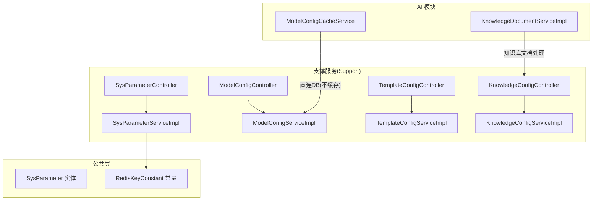
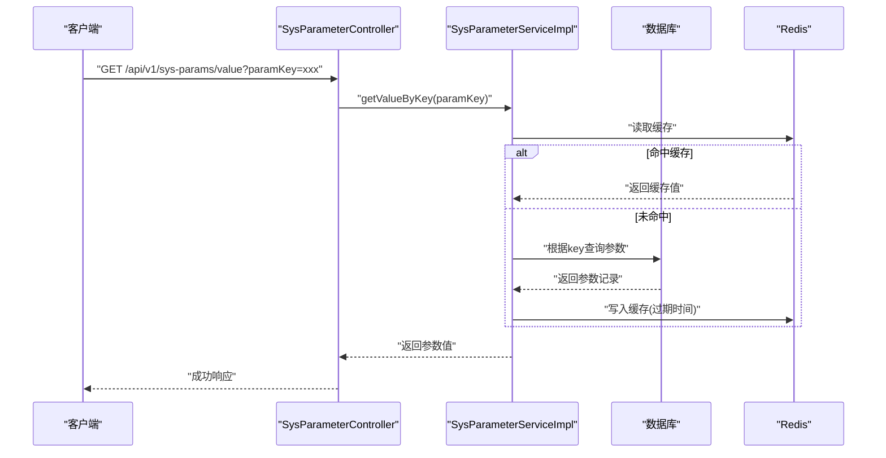
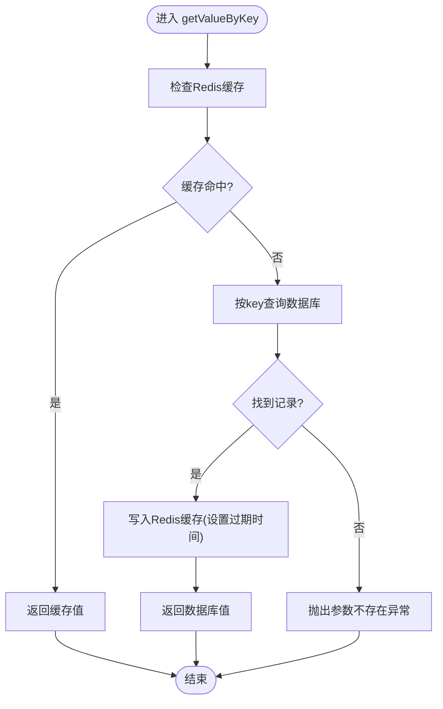
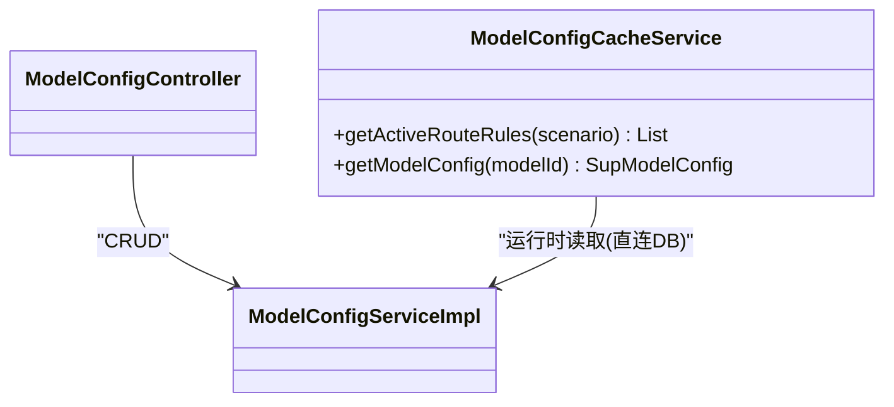
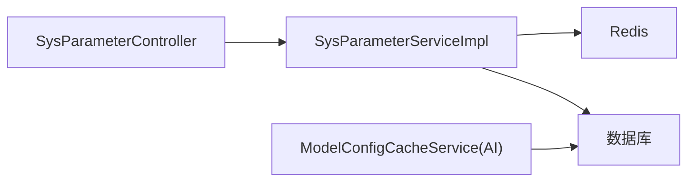

# 系统配置管理

<cite>
**本文引用的文件**   
- [SysParameter.java](file://ele-ai-tender-system/ele-ai-tender-common/src/main/java/com/jy/eleaitender/common/entity/support/SysParameter.java)
- [SysParameterController.java](file://ele-ai-tender-system/ele-ai-tender-support/src/main/java/com/jy/eleaitender/support/controller/SysParameterController.java)
- [SysParameterServiceImpl.java](file://ele-ai-tender-system/ele-ai-tender-support/src/main/java/com/jy/eleaitender/support/service/impl/SysParameterServiceImpl.java)
- [ModelConfigCacheService.java](file://ele-ai-tender-system/ele-ai-tender-ai/src/main/java/com/jy/eleaitender/ai/processor/model/ModelConfigCacheService.java)
- [ModelConfigController.java](file://ele-ai-tender-system/ele-ai-tender-support/src/main/java/com/jy/eleaitender/support/controller/ModelConfigController.java)
- [ModelConfigServiceImpl.java](file://ele-ai-tender-system/ele-ai-tender-support/src/main/java/com/jy/eleaitender/support/service/impl/ModelConfigServiceImpl.java)
- [TemplateConfigController.java](file://ele-ai-tender-system/ele-ai-tender-support/src/main/java/com/jy/eleaitender/support/controller/TemplateConfigController.java)
- [TemplateConfigServiceImpl.java](file://ele-ai-tender-system/ele-ai-tender-support/src/main/java/com/jy/eleaitender/support/service/impl/TemplateConfigServiceImpl.java)
- [KnowledgeConfigController.java](file://ele-ai-tender-system/ele-ai-tender-support/src/main/java/com/jy/eleaitender/support/controller/KnowledgeConfigController.java)
- [KnowledgeConfigServiceImpl.java](file://ele-ai-tender-system/ele-ai-tender-support/src/main/java/com/jy/eleaitender/support/service/impl/KnowledgeConfigServiceImpl.java)
- [KnowledgeDocumentServiceImpl.java](file://ele-ai-tender-system/ele-ai-tender-ai/src/main/java/com/jy/eleaitender/ai/service/impl/KnowledgeDocumentServiceImpl.java)
- [RedisKeyConstant.java](file://ele-ai-tender-system/ele-ai-tender-common/src/main/java/com/jy/eleaitender/common/constant/RedisKeyConstant.java)
</cite>

## 目录
1. [简介](#简介)
2. [项目结构](#项目结构)
3. [核心组件](#核心组件)
4. [架构总览](#架构总览)
5. [详细组件分析](#详细组件分析)
6. [依赖关系分析](#依赖关系分析)
7. [性能考虑](#性能考虑)
8. [故障排查指南](#故障排查指南)
9. [结论](#结论)
10. [附录](#附录)

## 简介
本技术文档聚焦“系统配置管理”模块，围绕以下目标展开：
- 系统参数动态配置与热更新机制
- 配置缓存策略（读多写少场景的缓存设计）
- 专项配置管理：知识库配置、AI模型配置、模板配置
- 高级特性：版本控制、审计追踪、备份恢复（概念性说明）
- 配置验证规则、迁移工具、导入导出（实现现状与建议）
- 最佳实践、性能优化建议与故障排查指南

## 项目结构
配置管理相关代码分布在多个子模块中：
- 公共实体定义：系统参数实体位于 common 模块
- 支撑服务（Support）：提供系统参数、模型配置、模板配置、知识库配置的控制器与服务实现
- AI 模块：在运行时直接读取模型配置与路由规则，保证实时生效；同时包含知识库文档处理逻辑

图表来源
- [SysParameter.java:1-39](file://ele-ai-tender-system/ele-ai-tender-common/src/main/java/com/jy/eleaitender/common/entity/support/SysParameter.java#L1-L39)
- [SysParameterController.java:1-59](file://ele-ai-tender-system/ele-ai-tender-support/src/main/java/com/jy/eleaitender/support/controller/SysParameterController.java#L1-L59)
- [SysParameterServiceImpl.java:1-93](file://ele-ai-tender-system/ele-ai-tender-support/src/main/java/com/jy/eleaitender/support/service/impl/SysParameterServiceImpl.java#L1-L93)
- [ModelConfigCacheService.java:1-60](file://ele-ai-tender-system/ele-ai-tender-ai/src/main/java/com/jy/eleaitender/ai/processor/model/ModelConfigCacheService.java#L1-L60)
- [ModelConfigController.java](file://ele-ai-tender-system/ele-ai-tender-support/src/main/java/com/jy/eleaitender/support/controller/ModelConfigController.java)
- [ModelConfigServiceImpl.java](file://ele-ai-tender-system/ele-ai-tender-support/src/main/java/com/jy/eleaitender/support/service/impl/ModelConfigServiceImpl.java)
- [TemplateConfigController.java](file://ele-ai-tender-system/ele-ai-tender-support/src/main/java/com/jy/eleaitender/support/controller/TemplateConfigController.java)
- [TemplateConfigServiceImpl.java](file://ele-ai-tender-system/ele-ai-tender-support/src/main/java/com/jy/eleaitender/support/service/impl/TemplateConfigServiceImpl.java)
- [KnowledgeConfigController.java](file://ele-ai-tender-system/ele-ai-tender-support/src/main/java/com/jy/eleaitender/support/controller/KnowledgeConfigController.java)
- [KnowledgeConfigServiceImpl.java](file://ele-ai-tender-system/ele-ai-tender-support/src/main/java/com/jy/eleaitender/support/service/impl/KnowledgeConfigServiceImpl.java)
- [KnowledgeDocumentServiceImpl.java](file://ele-ai-tender-system/ele-ai-tender-ai/src/main/java/com/jy/eleaitender/ai/service/impl/KnowledgeDocumentServiceImpl.java)
- [RedisKeyConstant.java](file://ele-ai-tender-system/ele-ai-tender-common/src/main/java/com/jy/eleaitender/common/constant/RedisKeyConstant.java)

章节来源
- [SysParameter.java:1-39](file://ele-ai-tender-system/ele-ai-tender-common/src/main/java/com/jy/eleaitender/common/entity/support/SysParameter.java#L1-L39)
- [SysParameterController.java:1-59](file://ele-ai-tender-system/ele-ai-tender-support/src/main/java/com/jy/eleaitender/support/controller/SysParameterController.java#L1-L59)
- [SysParameterServiceImpl.java:1-93](file://ele-ai-tender-system/ele-ai-tender-support/src/main/java/com/jy/eleaitender/support/service/impl/SysParameterServiceImpl.java#L1-L93)
- [ModelConfigCacheService.java:1-60](file://ele-ai-tender-system/ele-ai-tender-ai/src/main/java/com/jy/eleaitender/ai/processor/model/ModelConfigCacheService.java#L1-L60)

## 核心组件
- 系统参数（SysParameter）
  - 字段包括分组、键、值、类型、中文名、说明、排序等，用于承载可动态调整的系统级开关与参数。
  - 通过 Support 模块暴露 REST 接口进行查询与更新，支持按分组查询、按 key 获取值、批量更新与单键更新。
  - 采用 Redis 缓存加速读取，更新时删除对应缓存键，实现“近实时”热更新效果。
- AI 模型配置（SupModelConfig）
  - 由 Support 模块提供 CRUD 能力，AI 模块在运行时通过 ModelConfigCacheService 直接查库，确保配置即时生效。
- 模板配置（TemplateConfig）
  - 由 Support 模块提供配置项的管理能力，供业务生成流程使用。
- 知识库配置（KnowledgeConfig）
  - 由 Support 模块提供配置管理，AI 模块中的 KnowledgeDocumentServiceImpl 负责知识库文档的处理与索引构建。

章节来源
- [SysParameter.java:1-39](file://ele-ai-tender-system/ele-ai-tender-common/src/main/java/com/jy/eleaitender/common/entity/support/SysParameter.java#L1-L39)
- [SysParameterController.java:1-59](file://ele-ai-tender-system/ele-ai-tender-support/src/main/java/com/jy/eleaitender/support/controller/SysParameterController.java#L1-L59)
- [SysParameterServiceImpl.java:1-93](file://ele-ai-tender-system/ele-ai-tender-support/src/main/java/com/jy/eleaitender/support/service/impl/SysParameterServiceImpl.java#L1-L93)
- [ModelConfigCacheService.java:1-60](file://ele-ai-tender-system/ele-ai-tender-ai/src/main/java/com/jy/eleaitender/ai/processor/model/ModelConfigCacheService.java#L1-L60)
- [ModelConfigController.java](file://ele-ai-tender-system/ele-ai-tender-support/src/main/java/com/jy/eleaitender/support/controller/ModelConfigController.java)
- [ModelConfigServiceImpl.java](file://ele-ai-tender-system/ele-ai-tender-support/src/main/java/com/jy/eleaitender/support/service/impl/ModelConfigServiceImpl.java)
- [TemplateConfigController.java](file://ele-ai-tender-system/ele-ai-tender-support/src/main/java/com/jy/eleaitender/support/controller/TemplateConfigController.java)
- [TemplateConfigServiceImpl.java](file://ele-ai-tender-system/ele-ai-tender-support/src/main/java/com/jy/eleaitender/support/service/impl/TemplateConfigServiceImpl.java)
- [KnowledgeConfigController.java](file://ele-ai-tender-system/ele-ai-tender-support/src/main/java/com/jy/eleaitender/support/controller/KnowledgeConfigController.java)
- [KnowledgeConfigServiceImpl.java](file://ele-ai-tender-system/ele-ai-tender-support/src/main/java/com/jy/eleaitender/support/service/impl/KnowledgeConfigServiceImpl.java)
- [KnowledgeDocumentServiceImpl.java](file://ele-ai-tender-system/ele-ai-tender-ai/src/main/java/com/jy/eleaitender/ai/service/impl/KnowledgeDocumentServiceImpl.java)

## 架构总览
系统配置管理的整体交互如下：
- 前端或调用方通过 Support 模块的 Controller 访问配置管理接口
- Service 层执行业务逻辑，必要时操作数据库与缓存
- AI 模块在运行期直接读取模型配置与路由规则，避免缓存带来的延迟

图表来源
- [SysParameterController.java:1-59](file://ele-ai-tender-system/ele-ai-tender-support/src/main/java/com/jy/eleaitender/support/controller/SysParameterController.java#L1-L59)
- [SysParameterServiceImpl.java:1-93](file://ele-ai-tender-system/ele-ai-tender-support/src/main/java/com/jy/eleaitender/support/service/impl/SysParameterServiceImpl.java#L1-L93)
- [RedisKeyConstant.java](file://ele-ai-tender-system/ele-ai-tender-common/src/main/java/com/jy/eleaitender/common/constant/RedisKeyConstant.java)

## 详细组件分析

### 系统参数（SysParameter）
- 数据模型
  - 字段涵盖分组、键、值、类型、名称、说明、排序等，便于分类管理与展示。
- 接口能力
  - 按分组查询、按 key 获取值、批量更新、单键更新
- 缓存策略
  - 读取路径优先从 Redis 获取，未命中则回源数据库并回填缓存
  - 更新路径执行数据库更新后删除对应缓存键，使后续读取走新值
- 热更新机制
  - 通过“更新即删缓存”的策略，实现近实时的热更新效果
- 错误处理
  - 当参数不存在时抛出业务异常，统一返回码提示

图表来源
- [SysParameterServiceImpl.java:1-93](file://ele-ai-tender-system/ele-ai-tender-support/src/main/java/com/jy/eleaitender/support/service/impl/SysParameterServiceImpl.java#L1-L93)
- [RedisKeyConstant.java](file://ele-ai-tender-system/ele-ai-tender-common/src/main/java/com/jy/eleaitender/common/constant/RedisKeyConstant.java)

章节来源
- [SysParameter.java:1-39](file://ele-ai-tender-system/ele-ai-tender-common/src/main/java/com/jy/eleaitender/common/entity/support/SysParameter.java#L1-L39)
- [SysParameterController.java:1-59](file://ele-ai-tender-system/ele-ai-tender-support/src/main/java/com/jy/eleaitender/support/controller/SysParameterController.java#L1-L59)
- [SysParameterServiceImpl.java:1-93](file://ele-ai-tender-system/ele-ai-tender-support/src/main/java/com/jy/eleaitender/support/service/impl/SysParameterServiceImpl.java#L1-L93)

### AI 模型配置（SupModelConfig）
- 管理能力
  - Support 模块提供模型配置的增删改查接口与服务实现
- 运行时读取
  - AI 模块通过 ModelConfigCacheService 直接查询数据库，不引入本地缓存，确保配置变更立即生效
- 路由规则
  - 支持按使用场景筛选激活的路由规则，并按优先级排序

图表来源
- [ModelConfigCacheService.java:1-60](file://ele-ai-tender-system/ele-ai-tender-ai/src/main/java/com/jy/eleaitender/ai/processor/model/ModelConfigCacheService.java#L1-L60)
- [ModelConfigController.java](file://ele-ai-tender-system/ele-ai-tender-support/src/main/java/com/jy/eleaitender/support/controller/ModelConfigController.java)
- [ModelConfigServiceImpl.java](file://ele-ai-tender-system/ele-ai-tender-support/src/main/java/com/jy/eleaitender/support/service/impl/ModelConfigServiceImpl.java)

章节来源
- [ModelConfigCacheService.java:1-60](file://ele-ai-tender-system/ele-ai-tender-ai/src/main/java/com/jy/eleaitender/ai/processor/model/ModelConfigCacheService.java#L1-L60)
- [ModelConfigController.java](file://ele-ai-tender-system/ele-ai-tender-support/src/main/java/com/jy/eleaitender/support/controller/ModelConfigController.java)
- [ModelConfigServiceImpl.java](file://ele-ai-tender-system/ele-ai-tender-support/src/main/java/com/jy/eleaitender/support/service/impl/ModelConfigServiceImpl.java)

### 模板配置（TemplateConfig）
- 管理能力
  - Support 模块提供模板配置的控制器与服务实现，用于维护模板相关的配置项
- 使用方式
  - 业务生成流程按需读取模板配置，驱动内容组装与渲染

章节来源
- [TemplateConfigController.java](file://ele-ai-tender-system/ele-ai-tender-support/src/main/java/com/jy/eleaitender/support/controller/TemplateConfigController.java)
- [TemplateConfigServiceImpl.java](file://ele-ai-tender-system/ele-ai-tender-support/src/main/java/com/jy/eleaitender/support/service/impl/TemplateConfigServiceImpl.java)

### 知识库配置（KnowledgeConfig）
- 管理能力
  - Support 模块提供知识库配置的控制器与服务实现
- 文档处理
  - AI 模块中的 KnowledgeDocumentServiceImpl 负责知识库文档的解析、入库与检索准备

章节来源
- [KnowledgeConfigController.java](file://ele-ai-tender-system/ele-ai-tender-support/src/main/java/com/jy/eleaitender/support/controller/KnowledgeConfigController.java)
- [KnowledgeConfigServiceImpl.java](file://ele-ai-tender-system/ele-ai-tender-support/src/main/java/com/jy/eleaitender/support/service/impl/KnowledgeConfigServiceImpl.java)
- [KnowledgeDocumentServiceImpl.java](file://ele-ai-tender-system/ele-ai-tender-ai/src/main/java/com/jy/eleaitender/ai/service/impl/KnowledgeDocumentServiceImpl.java)

## 依赖关系分析
- 组件耦合
  - Support 模块的控制器与服务之间为典型分层依赖
  - AI 模块对模型配置的读取独立于 Support 的缓存策略，采用直连数据库的方式降低一致性风险
- 外部依赖
  - Redis 作为系统参数的缓存介质，提升读取性能
  - MyBatis Plus 作为 ORM 框架，简化数据访问

图表来源
- [SysParameterController.java:1-59](file://ele-ai-tender-system/ele-ai-tender-support/src/main/java/com/jy/eleaitender/support/controller/SysParameterController.java#L1-L59)
- [SysParameterServiceImpl.java:1-93](file://ele-ai-tender-system/ele-ai-tender-support/src/main/java/com/jy/eleaitender/support/service/impl/SysParameterServiceImpl.java#L1-L93)
- [ModelConfigCacheService.java:1-60](file://ele-ai-tender-system/ele-ai-tender-ai/src/main/java/com/jy/eleaitender/ai/processor/model/ModelConfigCacheService.java#L1-L60)

## 性能考虑
- 系统参数
  - 读多写少场景下，Redis 缓存显著降低数据库压力
  - 更新路径采用“先写库再删缓存”，避免脏读
- AI 模型配置
  - 运行时直连数据库，牺牲少量性能换取强一致性与即时生效
- 建议
  - 对热点参数可考虑增加二级缓存（如本地缓存+失效策略），但需权衡一致性
  - 合理设置缓存过期时间与预热策略，减少冷启动抖动

[本节为通用性能讨论，不涉及具体文件分析]

## 故障排查指南
- 常见问题
  - 参数未找到：当按 key 查询或更新时若记录不存在，会抛出业务异常，需确认 key 是否存在
  - 缓存不一致：更新后若仍读到旧值，检查是否成功删除缓存键以及 Redis 连接状态
  - 模型配置未生效：AI 模块直连数据库，若未生效请检查数据库记录是否已更新且未被软删除
- 定位步骤
  - 查看日志输出，确认请求链路是否到达相应 Service
  - 检查 Redis 中对应缓存键是否存在及过期时间
  - 核对数据库记录的状态字段（如是否被标记删除）

章节来源
- [SysParameterServiceImpl.java:1-93](file://ele-ai-tender-system/ele-ai-tender-support/src/main/java/com/jy/eleaitender/support/service/impl/SysParameterServiceImpl.java#L1-L93)
- [ModelConfigCacheService.java:1-60](file://ele-ai-tender-system/ele-ai-tender-ai/src/main/java/com/jy/eleaitender/ai/processor/model/ModelConfigCacheService.java#L1-L60)

## 结论
- 系统参数通过“数据库+Redis”的组合实现了高性能与近实时热更新
- AI 模型配置在运行期直连数据库，确保配置变更即时生效
- 模板与知识库配置由 Support 模块统一管理，AI 模块按需消费
- 建议在关键路径增加审计与版本化能力，完善迁移与导入导出工具链，进一步提升可运维性

[本节为总结性内容，不涉及具体文件分析]

## 附录

### 配置验证规则（建议）
- 必填校验：key、value、type 等关键字段应进行非空校验
- 类型校验：根据 paramType 对 value 进行格式校验（字符串、数字、布尔、JSON）
- 唯一性约束：同一分组内 key 应唯一
- 安全校验：敏感参数（如密钥）应加密存储并在日志中脱敏

[本节为通用规范建议，不涉及具体文件分析]

### 配置迁移工具（建议）
- 提供脚本将生产环境配置导出为结构化文件（如 JSON/YAML）
- 支持按环境差异进行变量替换与合并
- 提供幂等导入能力，避免重复导入导致的数据冲突

[本节为通用规范建议，不涉及具体文件分析]

### 配置导入导出（建议）
- 导出：按分组导出系统参数、模型配置、模板配置、知识库配置
- 导入：支持批量导入，具备冲突检测与回滚机制
- 审计：记录导入导出操作的主体、时间、范围与结果

[本节为通用规范建议，不涉及具体文件分析]

### 配置版本控制（建议）
- 每次重要变更创建新版本快照，保留历史版本
- 支持版本对比与一键回滚
- 与审计日志关联，形成完整的变更轨迹

[本节为通用规范建议，不涉及具体文件分析]

### 配置审计追踪（建议）
- 记录操作人、操作时间、操作对象、变更前后的值
- 对敏感操作（如批量更新、删除）进行二次确认与审批流
- 提供审计查询与报表导出能力

[本节为通用规范建议，不涉及具体文件分析]

### 配置备份恢复（建议）
- 定期全量备份配置数据（含元数据与附件引用）
- 支持增量备份与差异恢复
- 建立演练机制，确保恢复流程可靠可用

[本节为通用规范建议，不涉及具体文件分析]