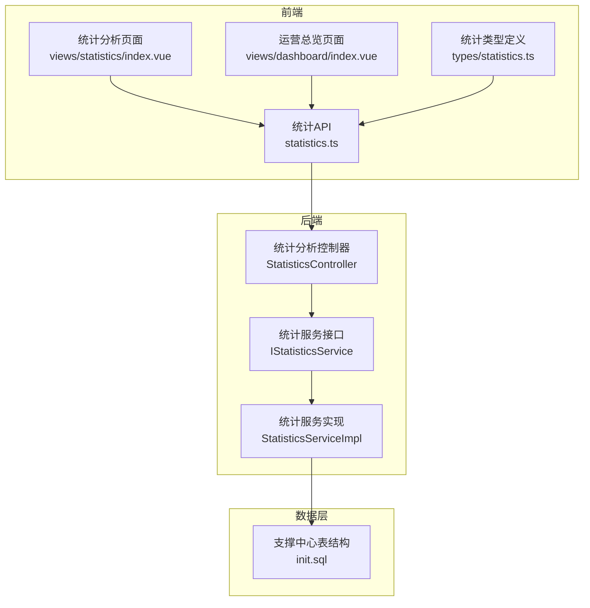
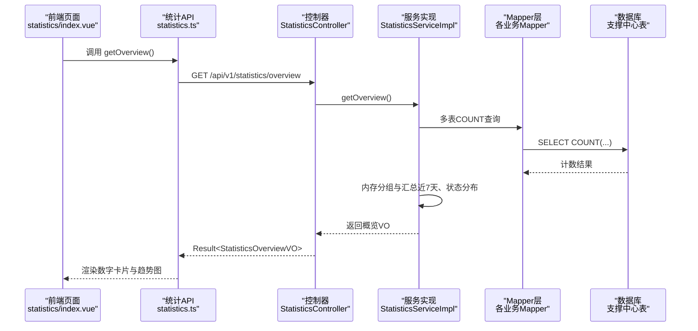
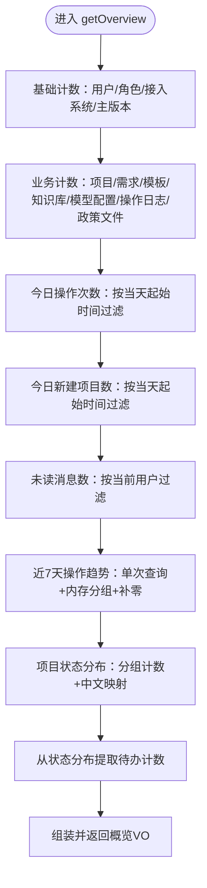
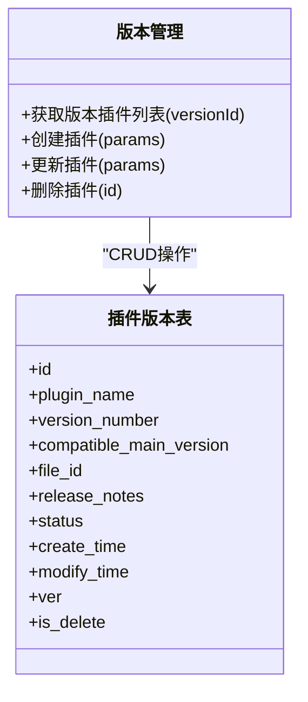
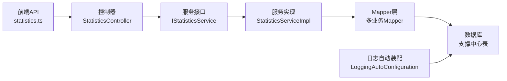

# 统计监控

<cite>
**本文引用的文件**
- [StatisticsController.java](file://ele-ai-tender-system/ele-ai-tender-support/src/main/java/com/jy/eleaitender/support/controller/StatisticsController.java)
- [IStatisticsService.java](file://ele-ai-tender-system/ele-ai-tender-support/src/main/java/com/jy/eleaitender/support/service/IStatisticsService.java)
- [StatisticsServiceImpl.java](file://ele-ai-tender-system/ele-ai-tender-support/src/main/java/com/jy/eleaitender/support/service/impl/StatisticsServiceImpl.java)
- [statistics.ts](file://ele-ai-tender-support-frontend/src/api/statistics.ts)
- [index.vue（统计分析）](file://ele-ai-tender-support-frontend/src/views/statistics/index.vue)
- [index.vue（运营总览）](file://ele-ai-tender-support-frontend/src/views/dashboard/index.vue)
- [statistics.ts（类型定义）](file://ele-ai-tender-support-frontend/src/types/statistics.ts)
- [init.sql（支撑中心表结构）](file://ele-ai-tender-system/ele-ai-tender-support/sql/init.sql)
- [LoggingAutoConfiguration.java](file://ele-ai-tender-system/ele-ai-tender-common/src/main/java/com/jy/eleaitender/common/logging/LoggingAutoConfiguration.java)
- [plugins.vue（插件管理）](file://ele-ai-tender-support-frontend/src/views/version/plugins.vue)
- [version.ts（版本与插件API）](file://ele-ai-tender-support-frontend/src/api/version.ts)
</cite>

## 目录
1. [引言](#引言)
2. [项目结构](#项目结构)
3. [核心组件](#核心组件)
4. [架构总览](#架构总览)
5. [详细组件分析](#详细组件分析)
6. [依赖关系分析](#依赖关系分析)
7. [性能考量](#性能考量)
8. [故障排查指南](#故障排查指南)
9. [结论](#结论)
10. [附录](#附录)

## 引言
本技术文档聚焦于“统计监控”模块，覆盖业务数据统计、系统性能监控、资源使用分析等核心能力。重点说明：
- 统计数据聚合与实时指标计算
- 历史数据分析与趋势展示
- 版本管理与插件管理的运维特性
- 系统健康检查与日志采集
- 监控数据可视化、告警规则配置思路与性能瓶颈定位方法
- 监控系统架构设计、数据采集策略与性能优化最佳实践

## 项目结构
统计监控相关的前后端代码分布在以下位置：
- 前端：统计概览页面、运营总览页、统计 API 调用与类型定义
- 后端：统计分析控制器与服务实现，基于支撑中心与核心业务表的 COUNT 统计
- 数据库：支撑中心初始化脚本包含操作日志、访问日志、插件版本等关键表
- 通用日志组件：访问日志自动装配与异步持久化

图表来源
- [StatisticsController.java:1-32](file://ele-ai-tender-system/ele-ai-tender-support/src/main/java/com/jy/eleaitender/support/controller/StatisticsController.java#L1-L32)
- [IStatisticsService.java:1-16](file://ele-ai-tender-system/ele-ai-tender-support/src/main/java/com/jy/eleaitender/support/service/IStatisticsService.java#L1-L16)
- [StatisticsServiceImpl.java:1-206](file://ele-ai-tender-system/ele-ai-tender-support/src/main/java/com/jy/eleaitender/support/service/impl/StatisticsServiceImpl.java#L1-L206)
- [statistics.ts:1-9](file://ele-ai-tender-support-frontend/src/api/statistics.ts#L1-L9)
- [index.vue（统计分析）:1-36](file://ele-ai-tender-support-frontend/src/views/statistics/index.vue#L1-L36)
- [index.vue（运营总览）:1-28](file://ele-ai-tender-support-frontend/src/views/dashboard/index.vue#L1-L28)
- [statistics.ts（类型定义）:1-35](file://ele-ai-tender-support-frontend/src/types/statistics.ts#L1-L35)
- [init.sql（支撑中心表结构）:190-238](file://ele-ai-tender-system/ele-ai-tender-support/sql/init.sql#L190-L238)

章节来源
- [StatisticsController.java:1-32](file://ele-ai-tender-system/ele-ai-tender-support/src/main/java/com/jy/eleaitender/support/controller/StatisticsController.java#L1-L32)
- [IStatisticsService.java:1-16](file://ele-ai-tender-system/ele-ai-tender-support/src/main/java/com/jy/eleaitender/support/service/IStatisticsService.java#L1-L16)
- [StatisticsServiceImpl.java:1-206](file://ele-ai-tender-system/ele-ai-tender-support/src/main/java/com/jy/eleaitender/support/service/impl/StatisticsServiceImpl.java#L1-L206)
- [statistics.ts:1-9](file://ele-ai-tender-support-frontend/src/api/statistics.ts#L1-L9)
- [index.vue（统计分析）:1-36](file://ele-ai-tender-support-frontend/src/views/statistics/index.vue#L1-L36)
- [index.vue（运营总览）:1-28](file://ele-ai-tender-support-frontend/src/views/dashboard/index.vue#L1-L28)
- [statistics.ts（类型定义）:1-35](file://ele-ai-tender-support-frontend/src/types/statistics.ts#L1-L35)
- [init.sql（支撑中心表结构）:190-238](file://ele-ai-tender-system/ele-ai-tender-support/sql/init.sql#L190-L238)

## 核心组件
- 统计分析控制器：提供 /api/v1/statistics/overview 接口，返回统一结果封装的概览数据。
- 统计服务接口与实现：聚合多表 COUNT 统计，包括用户、角色、接入系统、主版本、项目、需求、模板、知识库、模型配置、操作日志、政策文件等；并计算今日操作数、今日新建项目数、未读消息数、近7天操作趋势、项目状态分布及待办计数。
- 前端统计 API 与页面：通过 statisticsApi.getOverview 拉取数据，并在统计分析页面与运营总览页面进行数字卡片与趋势表格展示。
- 类型定义：统一定义 StatisticsOverview、DailyStatItem、StatusDistItem 等数据结构。
- 日志与访问记录：支撑中心包含操作日志与访问日志表，配合通用日志组件的异步持久化能力，为统计与分析提供数据基础。

章节来源
- [StatisticsController.java:1-32](file://ele-ai-tender-system/ele-ai-tender-support/src/main/java/com/jy/eleaitender/support/controller/StatisticsController.java#L1-L32)
- [IStatisticsService.java:1-16](file://ele-ai-tender-system/ele-ai-tender-support/src/main/java/com/jy/eleaitender/support/service/IStatisticsService.java#L1-L16)
- [StatisticsServiceImpl.java:1-206](file://ele-ai-tender-system/ele-ai-tender-support/src/main/java/com/jy/eleaitender/support/service/impl/StatisticsServiceImpl.java#L1-L206)
- [statistics.ts:1-9](file://ele-ai-tender-support-frontend/src/api/statistics.ts#L1-L9)
- [index.vue（统计分析）:1-36](file://ele-ai-tender-support-frontend/src/views/statistics/index.vue#L1-L36)
- [index.vue（运营总览）:1-28](file://ele-ai-tender-support-frontend/src/views/dashboard/index.vue#L1-L28)
- [statistics.ts（类型定义）:1-35](file://ele-ai-tender-support-frontend/src/types/statistics.ts#L1-L35)
- [LoggingAutoConfiguration.java:47-81](file://ele-ai-tender-system/ele-ai-tender-common/src/main/java/com/jy/eleaitender/common/logging/LoggingAutoConfiguration.java#L47-L81)
- [init.sql（支撑中心表结构）:215-238](file://ele-ai-tender-system/ele-ai-tender-support/sql/init.sql#L215-L238)

## 架构总览
统计监控采用前后端分离架构：前端通过 REST API 获取统计概览数据，后端服务聚合多表 COUNT 统计并返回结构化 VO。

图表来源
- [StatisticsController.java:1-32](file://ele-ai-tender-system/ele-ai-tender-support/src/main/java/com/jy/eleaitender/support/controller/StatisticsController.java#L1-L32)
- [StatisticsServiceImpl.java:1-206](file://ele-ai-tender-system/ele-ai-tender-support/src/main/java/com/jy/eleaitender/support/service/impl/StatisticsServiceImpl.java#L1-206)
- [statistics.ts:1-9](file://ele-ai-tender-support-frontend/src/api/statistics.ts#L1-L9)
- [index.vue（统计分析）:1-36](file://ele-ai-tender-support-frontend/src/views/statistics/index.vue#L1-L36)

## 详细组件分析

### 统计分析控制器
- 职责：暴露 /api/v1/statistics/overview 接口，统一鉴权注解，返回标准结果封装。
- 关键点：
  - 路径映射与标签注解便于文档生成与检索
  - 依赖注入统计服务接口，解耦具体实现

章节来源
- [StatisticsController.java:1-32](file://ele-ai-tender-system/ele-ai-tender-support/src/main/java/com/jy/eleaitender/support/controller/StatisticsController.java#L1-L32)

### 统计服务接口与实现
- 接口：定义 getOverview 方法，返回概览 VO。
- 实现要点：
  - 多表 COUNT 统计：用户、角色、接入系统、主版本、项目、需求、模板、知识库、模型配置、操作日志、政策文件
  - 今日指标：按当天起始时间过滤操作日志与项目创建时间
  - 未读消息：根据当前登录用户ID过滤未读消息数量
  - 近7天操作趋势：单次查询7天内操作日志的创建时间，内存按日期分组并补全缺失日期为0
  - 项目状态分布：按项目状态分组计数，映射中文名称，同时用于计算待检测、检测失败、编制中三项待办计数

图表来源
- [StatisticsServiceImpl.java:76-135](file://ele-ai-tender-system/ele-ai-tender-support/src/main/java/com/jy/eleaitender/support/service/impl/StatisticsServiceImpl.java#L76-L135)
- [StatisticsServiceImpl.java:141-174](file://ele-ai-tender-system/ele-ai-tender-support/src/main/java/com/jy/eleaitender/support/service/impl/StatisticsServiceImpl.java#L141-L174)
- [StatisticsServiceImpl.java:179-204](file://ele-ai-tender-system/ele-ai-tender-support/src/main/java/com/jy/eleaitender/support/service/impl/StatisticsServiceImpl.java#L179-L204)

章节来源
- [IStatisticsService.java:1-16](file://ele-ai-tender-system/ele-ai-tender-support/src/main/java/com/jy/eleaitender/support/service/IStatisticsService.java#L1-L16)
- [StatisticsServiceImpl.java:1-206](file://ele-ai-tender-system/ele-ai-tender-support/src/main/java/com/jy/eleaitender/support/service/impl/StatisticsServiceImpl.java#L1-L206)

### 前端统计 API 与页面
- API 层：statisticsApi.getOverview 调用 /v1/statistics/overview，返回统一 ApiResponse 包裹的数据。
- 页面层：
  - 统计分析页面：展示数字卡片与近7天操作趋势表格，支持刷新按钮触发数据拉取
  - 运营总览页面：展示核心指标卡片，支持刷新按钮触发数据拉取
- 类型定义：统一定义 StatisticsOverview、DailyStatItem、StatusDistItem 等字段，确保前后端一致性

章节来源
- [statistics.ts:1-9](file://ele-ai-tender-support-frontend/src/api/statistics.ts#L1-L9)
- [index.vue（统计分析）:1-36](file://ele-ai-tender-support-frontend/src/views/statistics/index.vue#L1-L36)
- [index.vue（运营总览）:1-28](file://ele-ai-tender-support-frontend/src/views/dashboard/index.vue#L1-L28)
- [statistics.ts（类型定义）:1-35](file://ele-ai-tender-support-frontend/src/types/statistics.ts#L1-L35)

### 版本管理与插件管理
- 前端插件管理页面：展示指定主版本的插件制品信息，支持新增、编辑、删除等操作
- 版本与插件 API：提供获取版本插件列表、创建/更新/删除插件等接口，适配主版本与插件版本关系
- 数据库表结构：插件版本表包含插件名称、版本号、适配主版本、文件ID、发布说明、状态、审计字段等

图表来源
- [plugins.vue（插件管理）:1-35](file://ele-ai-tender-support-frontend/src/views/version/plugins.vue#L1-L35)
- [version.ts（版本与插件API）:141-180](file://ele-ai-tender-support-frontend/src/api/version.ts#L141-L180)
- [init.sql（支撑中心表结构）:190-214](file://ele-ai-tender-system/ele-ai-tender-support/sql/init.sql#L190-L214)

章节来源
- [plugins.vue（插件管理）:1-35](file://ele-ai-tender-support-frontend/src/views/version/plugins.vue#L1-L35)
- [version.ts（版本与插件API）:141-180](file://ele-ai-tender-support-frontend/src/api/version.ts#L141-L180)
- [init.sql（支撑中心表结构）:190-214](file://ele-ai-tender-system/ele-ai-tender-support/sql/init.sql#L190-L214)

### 系统健康检查与日志采集
- 健康检查：在部署流水线中包含健康检查步骤，对服务启动后的可访问性进行重试与失败处理
- 日志采集：通用日志组件提供访问日志自动装配与异步持久化，支持单线程写入器与条件启用开关

章节来源
- [Jenkinsfile-core.groovy:114-131](file://Jenkinsfile-core.groovy#L114-L131)
- [Jenkinsfile-file.groovy:114-131](file://Jenkinsfile-file.groovy#L114-L131)
- [Jenkinsfile-ai.groovy:114-131](file://Jenkinsfile-ai.groovy#L114-L131)
- [Jenkinsfile-support.groovy:114-131](file://Jenkinsfile-support.groovy#L114-L131)
- [LoggingAutoConfiguration.java:47-81](file://ele-ai-tender-system/ele-ai-tender-common/src/main/java/com/jy/eleaitender/common/logging/LoggingAutoConfiguration.java#L47-L81)

## 依赖关系分析
- 控制器依赖服务接口，服务实现依赖多个 Mapper 与实体类，最终访问数据库表
- 前端 API 依赖统一请求工具与类型定义，页面组件依赖 API 进行数据渲染
- 日志组件与数据库表为统计与分析提供底层数据支撑

图表来源
- [StatisticsController.java:1-32](file://ele-ai-tender-system/ele-ai-tender-support/src/main/java/com/jy/eleaitender/support/controller/StatisticsController.java#L1-L32)
- [IStatisticsService.java:1-16](file://ele-ai-tender-system/ele-ai-tender-support/src/main/java/com/jy/eleaitender/support/service/IStatisticsService.java#L1-L16)
- [StatisticsServiceImpl.java:1-206](file://ele-ai-tender-system/ele-ai-tender-support/src/main/java/com/jy/eleaitender/support/service/impl/StatisticsServiceImpl.java#L1-L206)
- [statistics.ts:1-9](file://ele-ai-tender-support-frontend/src/api/statistics.ts#L1-L9)
- [LoggingAutoConfiguration.java:47-81](file://ele-ai-tender-system/ele-ai-tender-common/src/main/java/com/jy/eleaitender/common/logging/LoggingAutoConfiguration.java#L47-L81)
- [init.sql（支撑中心表结构）:215-238](file://ele-ai-tender-system/ele-ai-tender-support/sql/init.sql#L215-L238)

章节来源
- [StatisticsController.java:1-32](file://ele-ai-tender-system/ele-ai-tender-support/src/main/java/com/jy/eleaitender/support/controller/StatisticsController.java#L1-L32)
- [IStatisticsService.java:1-16](file://ele-ai-tender-system/ele-ai-tender-support/src/main/java/com/jy/eleaitender/support/service/IStatisticsService.java#L1-L16)
- [StatisticsServiceImpl.java:1-206](file://ele-ai-tender-system/ele-ai-tender-support/src/main/java/com/jy/eleaitender/support/service/impl/StatisticsServiceImpl.java#L1-L206)
- [statistics.ts:1-9](file://ele-ai-tender-support-frontend/src/api/statistics.ts#L1-L9)
- [LoggingAutoConfiguration.java:47-81](file://ele-ai-tender-system/ele-ai-tender-common/src/main/java/com/jy/eleaitender/common/logging/LoggingAutoConfiguration.java#L47-L81)
- [init.sql（支撑中心表结构）:215-238](file://ele-ai-tender-system/ele-ai-tender-support/sql/init.sql#L215-L238)

## 性能考量
- 减少数据库往返：近7天操作趋势采用单次查询并按日期内存分组，避免多次循环查询
- 索引优化：操作日志与访问日志表已建立常用查询字段索引，提升 COUNT 与范围查询效率
- 异步持久化：访问日志写入采用单线程任务执行器，降低主链路阻塞风险
- 分页与限流：建议对大规模统计接口增加缓存或分页策略，避免一次性加载过多数据
- 内存占用控制：大数据量场景下，考虑将部分聚合逻辑下沉至数据库侧（如 GROUP BY），减少内存压力

[本节为通用指导，不直接分析具体文件]

## 故障排查指南
- 接口无响应或超时：检查控制器到服务的依赖注入是否正常，确认服务实现中的 Mapper 是否可用
- 统计数据异常：核对数据库表结构与索引，验证日期过滤条件与分组逻辑是否正确
- 未读消息数为空：确认当前登录用户上下文是否正确设置，消息表是否存在对应记录
- 近7天趋势为空：检查操作日志表是否有近期数据，确认日期格式化与补零逻辑
- 健康检查失败：查看流水线日志中的重试与错误信息，确认服务端口与路由可达性
- 日志未持久化：检查日志自动装配的条件属性与 Mapper Bean 是否注册成功

章节来源
- [StatisticsController.java:1-32](file://ele-ai-tender-system/ele-ai-tender-support/src/main/java/com/jy/eleaitender/support/controller/StatisticsController.java#L1-L32)
- [StatisticsServiceImpl.java:76-135](file://ele-ai-tender-system/ele-ai-tender-support/src/main/java/com/jy/eleaitender/support/service/impl/StatisticsServiceImpl.java#L76-L135)
- [LoggingAutoConfiguration.java:47-81](file://ele-ai-tender-system/ele-ai-tender-common/src/main/java/com/jy/eleaitender/common/logging/LoggingAutoConfiguration.java#L47-L81)
- [Jenkinsfile-core.groovy:114-131](file://Jenkinsfile-core.groovy#L114-L131)

## 结论
统计监控模块以简洁清晰的架构实现了多维度业务数据统计与运维监控能力。通过统一的 API 与页面展示，结合数据库 COUNT 统计与内存聚合，提供了直观的系统运行态势视图。配合版本与插件管理能力、健康检查与日志采集机制，形成了完整的运维监控闭环。后续可在缓存、分片与更丰富的告警规则方面持续演进，进一步提升系统的可观测性与稳定性。

[本节为总结性内容，不直接分析具体文件]

## 附录
- 监控数据可视化建议：
  - 数字卡片：用户、角色、接入系统、主版本、项目、需求、模板、知识库、模型配置、操作日志、政策文件等总量
  - 趋势图：近7天操作次数折线或柱状图
  - 状态分布：项目状态饼图或堆叠条形图
- 告警规则配置思路：
  - 阈值告警：今日操作次数、未读消息数、检测失败数超过阈值时触发
  - 趋势告警：连续N天操作量下降或上升超出预期范围
  - 健康检查告警：服务健康检查失败达到重试上限后告警
- 性能瓶颈定位方法：
  - 慢查询分析：关注 COUNT 与范围查询的执行计划，必要时增加复合索引
  - 内存分析：观察服务实现中的分组与转换逻辑，评估大数据量下的内存占用
  - 日志分析：结合访问日志与操作日志，定位高频接口与耗时点

[本节为概念性内容，不直接分析具体文件]