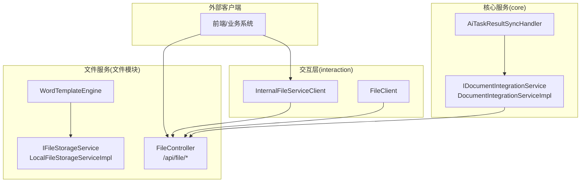
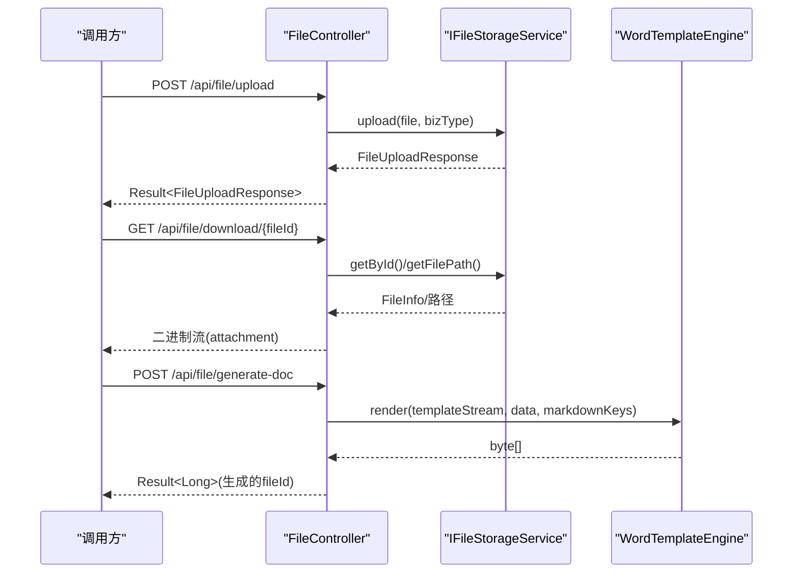
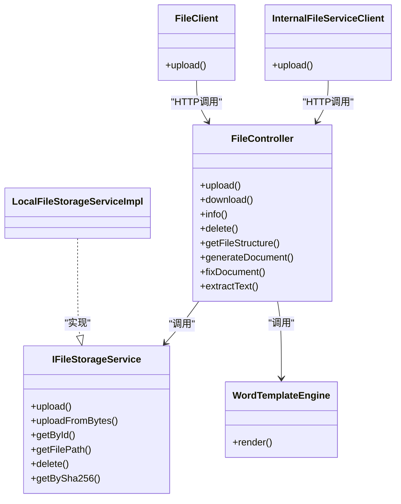

# API接口参考

<cite>
**本文引用的文件**
- [FILE_SERVICE_SPEC.md](file://docs/rules/FILE_SERVICE_SPEC.md)
- [FileController.java](file://ele-ai-tender-system/ele-ai-tender-file/src/main/java/com/jy/eleaitender/file/controller/FileController.java)
- [IFileStorageService.java](file://ele-ai-tender-system/ele-ai-tender-file/src/main/java/com/jy/eleaitender/file/service/IFileStorageService.java)
- [LocalFileStorageServiceImpl.java](file://ele-ai-tender-system/ele-ai-tender-file/src/main/java/com/jy/eleaitender/file/service/impl/LocalFileStorageServiceImpl.java)
- [WordTemplateEngine.java](file://ele-ai-tender-system/ele-ai-tender-file/src/main/java/com/jy/eleaitender/file/engine/WordTemplateEngine.java)
- [InternalFileServiceClient.java](file://ele-ai-tender-system/ele-ai-tender-common/src/main/java/com/jy/eleaitender/common/client/InternalFileServiceClient.java)
- [CORE_MODULE_SPEC.md](file://docs/rules/CORE_MODULE_SPEC.md)
- [DocumentIntegrationServiceImpl.java](file://ele-ai-tender-system/ele-ai-tender-core/src/main/java/com/jy/eleaitender/core/service/impl/DocumentIntegrationServiceImpl.java)
- [IDocumentIntegrationService.java](file://ele-ai-tender-system/ele-ai-tender-core/src/main/java/com/jy/eleaitender/core/service/IDocumentIntegrationService.java)
- [AiTaskResultSyncHandler.java](file://ele-ai-tender-system/ele-ai-tender-core/src/main/java/com/jy/eleaitender/core/scheduler/AiTaskResultSyncHandler.java)
- [FileClient.java](file://ele-ai-tender-system/ele-ai-tender-interaction/ele-ai-tender-interaction-core/src/main/java/com/jy/eleaitender/interaction/core/client/FileClient.java)
- [NamedByteArrayResource.java](file://ele-ai-tender-system/ele-ai-tender-interaction/ele-ai-tender-interaction-core/src/main/java/com/jy/eleaitender/interaction/core/support/NamedByteArrayResource.java)
- [FileException.java](file://ele-ai-tender-system/ele-ai-tender-common/src/main/java/com/jy/eleaitender/common/exception/FileException.java)
</cite>

## 目录
1. [简介](#简介)
2. [项目结构](#项目结构)
3. [核心组件](#核心组件)
4. [架构总览](#架构总览)
5. [详细组件分析](#详细组件分析)
6. [依赖关系分析](#依赖关系分析)
7. [性能与容量规划](#性能与容量规划)
8. [故障排查指南](#故障排查指南)
9. [结论](#结论)
10. [附录：API定义与示例](#附录api定义与示例)

## 简介
本文件为“文件处理服务”的完整API接口文档，覆盖RESTful端点、认证与安全、请求签名校验、错误码、调用最佳实践，以及版本兼容与迁移建议。重点说明：
- 文件上传接口的分片处理、进度回调与错误重试机制（当前实现与演进建议）
- 文档转换接口的异步处理模式与状态查询方法
- 内部服务间调用的安全约束与注意事项

## 项目结构
文件处理服务位于 ele-ai-tender-file 模块，对外暴露 /api/file 前缀的REST接口；core/support 通过 InternalFileServiceClient 进行内部调用；interaction 模块提供 FileClient 封装上传等能力。

图示来源
- [FileController.java:1-177](file://ele-ai-tender-system/ele-ai-tender-file/src/main/java/com/jy/eleaitender/file/controller/FileController.java#L1-L177)
- [IFileStorageService.java:1-65](file://ele-ai-tender-system/ele-ai-tender-file/src/main/java/com/jy/eleaitender/file/service/IFileStorageService.java#L1-L65)
- [LocalFileStorageServiceImpl.java:94-126](file://ele-ai-tender-system/ele-ai-tender-file/src/main/java/com/jy/eleaitender/file/service/impl/LocalFileStorageServiceImpl.java#L94-L126)
- [WordTemplateEngine.java:1-121](file://ele-ai-tender-system/ele-ai-tender-file/src/main/java/com/jy/eleaitender/file/engine/WordTemplateEngine.java#L1-L121)
- [InternalFileServiceClient.java:34-67](file://ele-ai-tender-system/ele-ai-tender-common/src/main/java/com/jy/eleaitender/common/client/InternalFileServiceClient.java#L34-L67)
- [FileClient.java:107-134](file://ele-ai-tender-system/ele-ai-tender-interaction/ele-ai-tender-interaction-core/src/main/java/com/jy/eleaitender/interaction/core/client/FileClient.java#L107-L134)
- [DocumentIntegrationServiceImpl.java:62-92](file://ele-ai-tender-system/ele-ai-tender-core/src/main/java/com/jy/eleaitender/core/service/impl/DocumentIntegrationServiceImpl.java#L62-L92)
- [AiTaskResultSyncHandler.java:521-556](file://ele-ai-tender-system/ele-ai-tender-core/src/main/java/com/jy/eleaitender/core/scheduler/AiTaskResultSyncHandler.java#L521-L556)

章节来源
- [FILE_SERVICE_SPEC.md:1-153](file://docs/rules/FILE_SERVICE_SPEC.md#L1-L153)

## 核心组件
- 控制器层：统一入口，负责参数校验、鉴权注解、响应包装
- 存储服务：文件持久化、秒传、路径解析、删除
- 文档引擎：模板渲染、修订标记清理、Markdown→Word、表格生成
- 内部客户端：跨服务调用文件服务，携带服务间JWT令牌
- 交互客户端：封装multipart上传，便于外部系统调用

章节来源
- [FileController.java:1-177](file://ele-ai-tender-system/ele-ai-tender-file/src/main/java/com/jy/eleaitender/file/controller/FileController.java#L1-L177)
- [IFileStorageService.java:1-65](file://ele-ai-tender-system/ele-ai-tender-file/src/main/java/com/jy/eleaitender/file/service/IFileStorageService.java#L1-L65)
- [WordTemplateEngine.java:1-121](file://ele-ai-tender-system/ele-ai-tender-file/src/main/java/com/jy/eleaitender/file/engine/WordTemplateEngine.java#L1-L121)
- [InternalFileServiceClient.java:34-67](file://ele-ai-tender-system/ele-ai-tender-common/src/main/java/com/jy/eleaitender/common/client/InternalFileServiceClient.java#L34-L67)
- [FileClient.java:107-134](file://ele-ai-tender-system/ele-ai-tender-interaction/ele-ai-tender-interaction-core/src/main/java/com/jy/eleaitender/interaction/core/client/FileClient.java#L107-L134)

## 架构总览
文件服务采用分层设计：控制器→服务→存储/引擎。核心与支撑模块通过内部客户端访问文件服务，遵循统一的错误码与响应体约定。

图示来源
- [FileController.java:50-135](file://ele-ai-tender-system/ele-ai-tender-file/src/main/java/com/jy/eleaitender/file/controller/FileController.java#L50-L135)
- [IFileStorageService.java:14-31](file://ele-ai-tender-system/ele-ai-tender-file/src/main/java/com/jy/eleaitender/file/service/IFileStorageService.java#L14-L31)
- [WordTemplateEngine.java:42-63](file://ele-ai-tender-system/ele-ai-tender-file/src/main/java/com/jy/eleaitender/file/engine/WordTemplateEngine.java#L42-L63)

## 详细组件分析

### 文件上传接口
- 方法：POST
- 路径：/api/file/upload
- 鉴权：需要登录（@RequireLogin）
- 请求体：multipart/form-data
  - file：MultipartFile（必填）
  - bizType：String（必填，用于分类存储）
- 响应：Result<FileUploadResponse>
  - fileId：Long
  - fileName：String
  - fileSize：Long
  - fileSha256：String（SHA-256十六进制）
  - fileType：String（扩展名）
- 行为要点
  - 支持“秒传”：基于SHA-256去重，命中则直接返回已有fileId
  - 默认最大文件大小：500MB
  - 白名单后缀：.doc/.docx/.pdf/.txt/.md/.jar/.war/.zip/.tar.gz（可配置）
- 错误处理
  - 未登录或权限不足：由全局异常处理器返回标准错误码
  - 文件不存在/非法：抛出FileException并映射到统一错误码

章节来源
- [FileController.java:50-58](file://ele-ai-tender-system/ele-ai-tender-file/src/main/java/com/jy/eleaitender/file/controller/FileController.java#L50-L58)
- [LocalFileStorageServiceImpl.java:94-126](file://ele-ai-tender-system/ele-ai-tender-file/src/main/java/com/jy/eleaitender/file/service/impl/LocalFileStorageServiceImpl.java#L94-L126)
- [FILE_SERVICE_SPEC.md:110-121](file://docs/rules/FILE_SERVICE_SPEC.md#L110-L121)
- [FileException.java:1-35](file://ele-ai-tender-system/ele-ai-tender-common/src/main/java/com/jy/eleaitender/common/exception/FileException.java#L1-L35)

#### 分片上传、进度回调与错误重试（现状与建议）
- 现状
  - 当前仅支持单文件直传，未实现服务端分片合并与断点续传
  - 未提供进度回调端点
  - 客户端侧可通过HTTP层重试策略实现幂等重试（需结合bizType+文件名+大小做幂等键）
- 建议方案（演进）
  - 新增分片初始化、分片上传、分片合并三个端点
  - 使用Redis记录分片状态与进度，提供进度查询端点
  - 失败重试：客户端指数退避重试，服务端对分片写入保证幂等（以分片号+MD5作为幂等键）
  - 大文件传输：启用流式处理与临时目录管理，避免内存溢出

[本节为概念性建议，不直接分析具体代码文件]

### 下载接口
- 方法：GET
- 路径：/api/file/download/{fileId}
- 鉴权：需要登录
- 路径参数：fileId（Long）
- 响应：application/octet-stream，Content-Disposition: attachment; filename="..."
- 错误处理
  - 文件不存在：返回统一错误码（对应FileException）

章节来源
- [FileController.java:60-86](file://ele-ai-tender-system/ele-ai-tender-file/src/main/java/com/jy/eleaitender/file/controller/FileController.java#L60-L86)

### 文件信息接口
- 方法：GET
- 路径：/api/file/info/{fileId}
- 鉴权：需要登录
- 响应：Result<FileInfo>
- 错误处理
  - 文件不存在：返回统一错误码

章节来源
- [FileController.java:88-98](file://ele-ai-tender-system/ele-ai-tender-file/src/main/java/com/jy/eleaitender/file/controller/FileController.java#L88-L98)

### 删除接口
- 方法：DELETE
- 路径：/api/file/delete/{fileId}
- 鉴权：需要登录
- 数据权限：校验创建者归属（DataScopeHelper.checkOwnership）
- 响应：Result<Boolean>

章节来源
- [FileController.java:100-112](file://ele-ai-tender-system/ele-ai-tender-file/src/main/java/com/jy/eleaitender/file/controller/FileController.java#L100-L112)

### 获取Word文档结构
- 方法：GET
- 路径：/api/file/structure/{fileId}
- 鉴权：需要登录
- 响应：Result<WordStructureVO>
- 用途：在Support模块创建/更新模板时自动解析结构，结果存入structureDefinition

章节来源
- [FileController.java:114-119](file://ele-ai-tender-system/ele-ai-tender-file/src/main/java/com/jy/eleaitender/file/controller/FileController.java#L114-L119)
- [FILE_SERVICE_SPEC.md:66-67](file://docs/rules/FILE_SERVICE_SPEC.md#L66-L67)

### 基于模板生成文档
- 方法：POST
- 路径：/api/file/generate-doc
- 鉴权：需要登录
- 请求体：JSON Map
  - templateFileId：Long（必填）
  - fileName：String（可选）
  - fillDataList：List<Map<String,Object>>（必填，包含TEXT/TABLE/IMAGE/MARKDOWN类型填充数据）
- 响应：Result<Long>（生成的fileId）
- 引擎约束
  - 必须使用原生poi-tl引擎（禁止useSpringEL）
  - 占位符语法：{{变量名}}
  - 两阶段渲染：先文本/图片/Markdown，后表格替换
  - 模板修订标记预处理：接受所有修订后再渲染

章节来源
- [FileController.java:121-135](file://ele-ai-tender-system/ele-ai-tender-file/src/main/java/com/jy/eleaitender/file/controller/FileController.java#L121-L135)
- [WordTemplateEngine.java:42-63](file://ele-ai-tender-system/ele-ai-tender-file/src/main/java/com/jy/eleaitender/file/engine/WordTemplateEngine.java#L42-L63)
- [FILE_SERVICE_SPEC.md:33-71](file://docs/rules/FILE_SERVICE_SPEC.md#L33-L71)

### 修复Word文档（替换文本）
- 方法：POST
- 路径：/api/file/fix-doc
- 鉴权：需要登录
- 请求体：JSON Map
  - fileId：Long（必填）
  - replacements：List<Map<String,Object>>（必填）
    - original：String（原始词组）
    - targeted：String（目标词组）
    - locationRef：Map（可选）
      - type：String（段落/表格）
      - elementIndex：Integer（段落/表格共享索引空间）
      - tableIndex：Integer（可选）
      - rowIndex：Integer（可选）
      - cellIndex：Integer（可选）
- 响应：Result<WordFixResultVO>
- 匹配策略：精确匹配优先 → 规范化匹配兜底

章节来源
- [FileController.java:137-164](file://ele-ai-tender-system/ele-ai-tender-file/src/main/java/com/jy/eleaitender/file/controller/FileController.java#L137-L164)
- [FILE_SERVICE_SPEC.md:73-85](file://docs/rules/FILE_SERVICE_SPEC.md#L73-L85)

### 提取Word文档文本+位置索引
- 方法：POST
- 路径：/api/file/extract-text
- 鉴权：需要登录
- 请求体：JSON Map
  - fileId：Long（必填）
- 响应：Result<Map<String,Object>>
  - fullText：String
  - segments：Array（每个segment含type、elementIndex、fullTextOffset、text，表格类型额外含tableIndex/rowIndex/cellIndex）
- 用途：供检测完成后填充locationRef

章节来源
- [FileController.java:166-175](file://ele-ai-tender-system/ele-ai-tender-file/src/main/java/com/jy/eleaitender/file/controller/FileController.java#L166-L175)
- [FILE_SERVICE_SPEC.md:86-92](file://docs/rules/FILE_SERVICE_SPEC.md#L86-L92)

### 文档集成（异步）与预览
- 提交集成（异步）
  - 方法：POST
  - 路径：/api/v1/documents/integrate/{projectId}
  - 响应：返回AiTask（任务ID、状态等）
- 获取预览
  - 方法：GET
  - 路径：/api/v1/documents/preview/{projectId}
  - 响应：DocumentPreviewVO（含htmlContent/markdownContent/integrated/generatedFileId）
- 编辑内容
  - 方法：PUT
  - 路径：/api/v1/documents/edit/{projectId}
  - 请求体：markdownContent（String）
- 异步流程
  - 提交后进入队列执行，完成后通过调度器同步结果并落库
  - 客户端轮询任务状态或使用事件通知（如SSE）

章节来源
- [CORE_MODULE_SPEC.md:79-85](file://docs/rules/CORE_MODULE_SPEC.md#L79-L85)
- [DocumentIntegrationServiceImpl.java:62-92](file://ele-ai-tender-system/ele-ai-tender-core/src/main/java/com/jy/eleaitender/core/service/impl/DocumentIntegrationServiceImpl.java#L62-L92)
- [IDocumentIntegrationService.java:1-25](file://ele-ai-tender-system/ele-ai-tender-core/src/main/java/com/jy/eleaitender/core/service/IDocumentIntegrationService.java#L1-L25)
- [AiTaskResultSyncHandler.java:521-556](file://ele-ai-tender-system/ele-ai-tender-core/src/main/java/com/jy/eleaitender/core/scheduler/AiTaskResultSyncHandler.java#L521-L556)

### 内部服务调用（core/support → file）
- 客户端：InternalFileServiceClient
- 关键约束
  - 错误响应处理：检查code字段，非200时提取message抛错
  - 服务间认证：使用TOKEN_TYPE_SERVICE类型的JWT，密钥复用APP_JWT_SECRET
  - ObjectMapper复用：static final常量
  - fix-doc locationRef反序列化：replacements用Map<String,Object>，否则嵌套对象被丢弃

章节来源
- [InternalFileServiceClient.java:34-67](file://ele-ai-tender-system/ele-ai-tender-common/src/main/java/com/jy/eleaitender/common/client/InternalFileServiceClient.java#L34-L67)
- [FILE_SERVICE_SPEC.md:129-137](file://docs/rules/FILE_SERVICE_SPEC.md#L129-L137)

### 交互层上传封装（interaction → file）
- 客户端：FileClient
- 行为
  - 使用RestTemplate发起multipart/form-data上传
  - 通过InteractionRequestSigner添加签名头
  - 将字节数组包装为NamedByteArrayResource以传递文件名

章节来源
- [FileClient.java:107-134](file://ele-ai-tender-system/ele-ai-tender-interaction/ele-ai-tender-interaction-core/src/main/java/com/jy/eleaitender/interaction/core/client/FileClient.java#L107-L134)
- [NamedByteArrayResource.java:1-21](file://ele-ai-tender-system/ele-ai-tender-interaction/ele-ai-tender-interaction-core/src/main/java/com/jy/eleaitender/interaction/core/support/NamedByteArrayResource.java#L1-L21)

## 依赖关系分析
- 控制器依赖存储服务与文档引擎
- 存储服务实现本地磁盘存储，计算SHA-256并支持秒传
- 文档引擎依赖poi-tl与Apache POI，负责模板渲染与修订清理
- 内部客户端与服务端之间通过JWT鉴权与统一响应体交互

图示来源
- [FileController.java:1-177](file://ele-ai-tender-system/ele-ai-tender-file/src/main/java/com/jy/eleaitender/file/controller/FileController.java#L1-L177)
- [IFileStorageService.java:1-65](file://ele-ai-tender-system/ele-ai-tender-file/src/main/java/com/jy/eleaitender/file/service/IFileStorageService.java#L1-L65)
- [LocalFileStorageServiceImpl.java:94-126](file://ele-ai-tender-system/ele-ai-tender-file/src/main/java/com/jy/eleaitender/file/service/impl/LocalFileStorageServiceImpl.java#L94-L126)
- [WordTemplateEngine.java:1-121](file://ele-ai-tender-system/ele-ai-tender-file/src/main/java/com/jy/eleaitender/file/engine/WordTemplateEngine.java#L1-L121)
- [InternalFileServiceClient.java:34-67](file://ele-ai-tender-system/ele-ai-tender-common/src/main/java/com/jy/eleaitender/common/client/InternalFileServiceClient.java#L34-L67)
- [FileClient.java:107-134](file://ele-ai-tender-system/ele-ai-tender-interaction/ele-ai-tender-interaction-core/src/main/java/com/jy/eleaitender/interaction/core/client/FileClient.java#L107-L134)

## 性能与容量规划
- 大文件上传
  - 当前为一次性读取到内存，需注意JVM堆配置与超时设置
  - 建议后续引入分片上传与流式处理，降低内存峰值
- 模板渲染
  - 两阶段渲染与表格生成可能带来CPU与IO压力，建议限制并发与合理设置线程池
- 秒传
  - 基于SHA-256去重，减少重复存储与网络开销
- 日志与追踪
  - 透传X-Trace-Id，避免记录二进制内容

[本节为通用指导，不直接分析具体代码文件]

## 故障排查指南
- 文件上传失败
  - 检查文件扩展名是否在白名单内、是否超过500MB、存储目录是否有写权限
- 下载404
  - 确认file_info.file_path对应文件存在，检查base-path配置
- fileSha256校验失败
  - 确认调用方与服务端一致（UTF-8编码的字节序列，十六进制字符串）
- locationRef定位失败
  - 检查elementIndex越界、是否已执行extract-text、fillLocationRefs日志
- 检测修复替换错误位置
  - 检查locationRef是否为空、type与elementIndex对应的元素类型是否一致

章节来源
- [FILE_SERVICE_SPEC.md:139-146](file://docs/rules/FILE_SERVICE_SPEC.md#L139-L146)

## 结论
文件服务提供了完整的上传、下载、信息查询、删除、文档结构与生成、文本提取与修复能力。通过统一的错误码与响应体、服务间JWT鉴权与签名校验，保障了安全性与一致性。建议在后续迭代中完善分片上传、进度回调与重试机制，以提升大文件场景的稳定性与用户体验。

## 附录：API定义与示例

### 认证与安全
- 用户态接口
  - 头部：Authorization: Bearer <token>
  - 注解：@RequireLogin
- 服务间调用
  - 使用TOKEN_TYPE_SERVICE类型的JWT，密钥复用APP_JWT_SECRET
- 交互层签名
  - 通过InteractionRequestSigner为请求添加签名头

章节来源
- [FileController.java:50-119](file://ele-ai-tender-system/ele-ai-tender-file/src/main/java/com/jy/eleaitender/file/controller/FileController.java#L50-L119)
- [FILE_SERVICE_SPEC.md:129-137](file://docs/rules/FILE_SERVICE_SPEC.md#L129-L137)
- [FileClient.java:107-134](file://ele-ai-tender-system/ele-ai-tender-interaction/ele-ai-tender-interaction-core/src/main/java/com/jy/eleaitender/interaction/core/client/FileClient.java#L107-L134)

### 请求与响应格式
- 统一响应体：Result<T>
  - code：整数（200表示成功）
  - message：字符串
  - data：泛型T
- 文件上传响应：FileUploadResponse
  - fileId、fileName、fileSize、fileSha256、fileType
- 文件信息响应：FileInfo（继承基础实体字段）
- 文档预览响应：DocumentPreviewVO（含htmlContent/markdownContent/integrated/generatedFileId）

章节来源
- [FileController.java:50-135](file://ele-ai-tender-system/ele-ai-tender-file/src/main/java/com/jy/eleaitender/file/controller/FileController.java#L50-L135)
- [DocumentIntegrationServiceImpl.java:62-92](file://ele-ai-tender-system/ele-ai-tender-core/src/main/java/com/jy/eleaitender/core/service/impl/DocumentIntegrationServiceImpl.java#L62-L92)

### 错误码与异常
- 文件相关异常：FileException
  - 构造方式支持传入ResponseCode或自定义消息
- 常见错误
  - FILE_NOT_FOUND：文件不存在
  - PARAM_ERROR：参数缺失或类型错误
  - FILE_UPLOAD_ERROR：上传失败

章节来源
- [FileException.java:1-35](file://ele-ai-tender-system/ele-ai-tender-common/src/main/java/com/jy/eleaitender/common/exception/FileException.java#L1-L35)
- [FileController.java:121-175](file://ele-ai-tender-system/ele-ai-tender-file/src/main/java/com/jy/eleaitender/file/controller/FileController.java#L121-L175)

### 调用最佳实践
- 上传
  - 校验文件大小与后缀白名单
  - 计算fileSha256用于幂等与秒传
  - 大文件考虑分片上传与重试（待实现）
- 下载
  - 处理Content-Disposition中的文件名编码
- 文档生成
  - 确保模板无修订标记或提前清理
  - 使用原生poi-tl引擎，避免SpringEL
- 内部调用
  - 检查响应code并提取message
  - 复用ObjectMapper实例
  - 正确反序列化locationRef为Map<String,Object>

章节来源
- [FILE_SERVICE_SPEC.md:33-71](file://docs/rules/FILE_SERVICE_SPEC.md#L33-L71)
- [FILE_SERVICE_SPEC.md:129-137](file://docs/rules/FILE_SERVICE_SPEC.md#L129-L137)

### 版本兼容性与迁移指南
- 模板引擎
  - 必须使用原生Configure.builder().build()，禁用useSpringEL
  - poi-tl版本≥1.12.2
- 字段命名
  - 文件主键统一为fileId
  - SHA-256字段统一为fileSha256/file_sha256
- 内部客户端
  - 新增端点需在InternalFileServiceClient中同步解析逻辑
- 迁移建议
  - 从旧版模板引擎迁移至新架构时，注意占位符语法与表格渲染差异
  - 升级poi-tl版本以规避已知Bug

章节来源
- [FILE_SERVICE_SPEC.md:33-71](file://docs/rules/FILE_SERVICE_SPEC.md#L33-L71)
- [FILE_SERVICE_SPEC.md:123-137](file://docs/rules/FILE_SERVICE_SPEC.md#L123-L137)