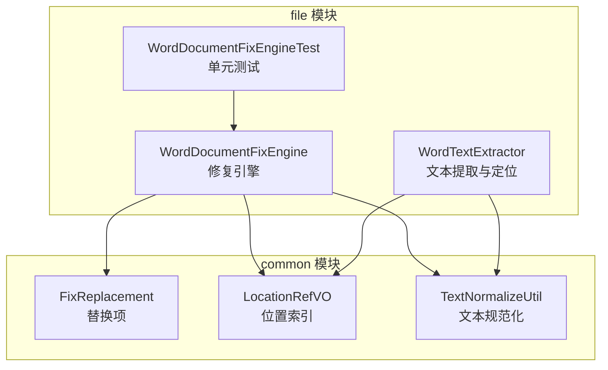
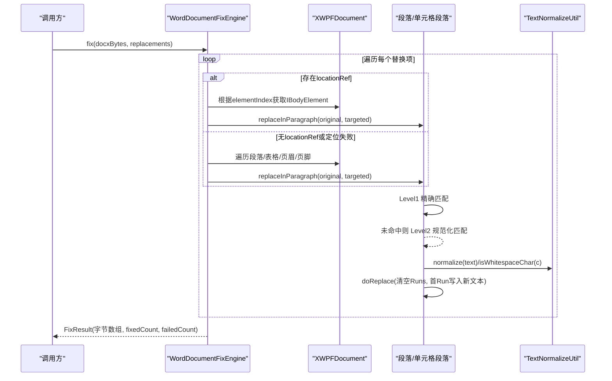
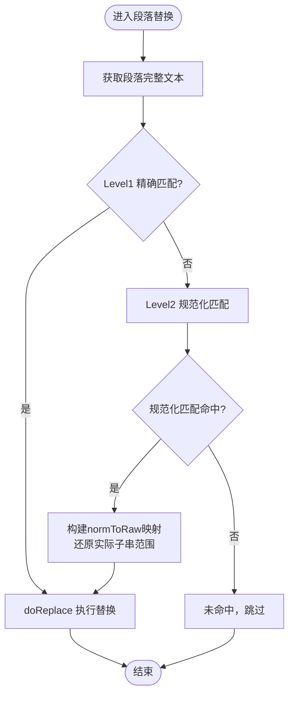
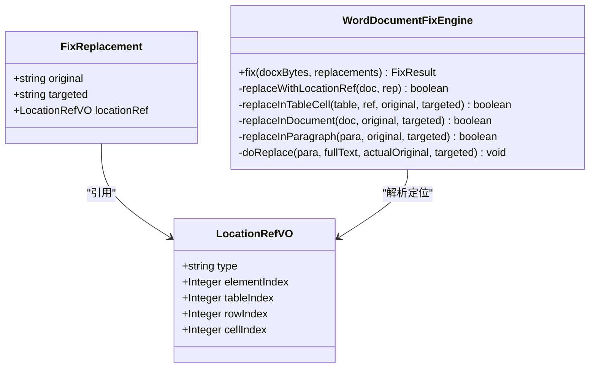
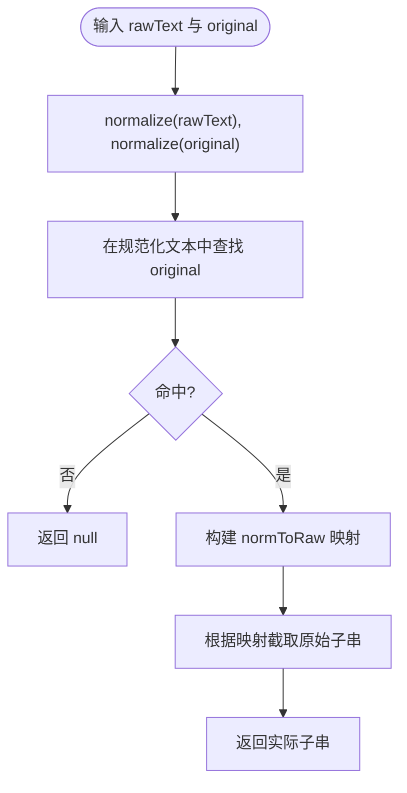
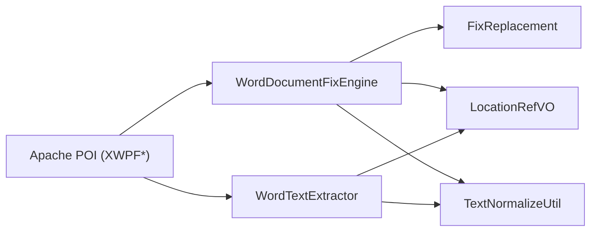

# Word文档修复引擎

<cite>
**本文引用的文件**
- [WordDocumentFixEngine.java](file://ele-ai-tender-system/ele-ai-tender-file/src/main/java/com/jy/eleaitender/file/engine/WordDocumentFixEngine.java)
- [WordTextExtractor.java](file://ele-ai-tender-system/ele-ai-tender-file/src/main/java/com/jy/eleaitender/file/engine/WordTextExtractor.java)
- [LocationRefVO.java](file://ele-ai-tender-system/ele-ai-tender-common/src/main/java/com/jy/eleaitender/common/dto/LocationRefVO.java)
- [FixReplacement.java](file://ele-ai-tender-system/ele-ai-tender-common/src/main/java/com/jy/eleaitender/common/dto/FixReplacement.java)
- [TextNormalizeUtil.java](file://ele-ai-tender-system/ele-ai-tender-common/src/main/java/com/jy/eleaitender/common/util/TextNormalizeUtil.java)
- [WordDocumentFixEngineTest.java](file://ele-ai-tender-system/ele-ai-tender-file/src/test/java/com/jy/eleaitender/file/engine/WordDocumentFixEngineTest.java)
</cite>

## 目录
1. [简介](#简介)
2. [项目结构](#项目结构)
3. [核心组件](#核心组件)
4. [架构总览](#架构总览)
5. [详细组件分析](#详细组件分析)
6. [依赖关系分析](#依赖关系分析)
7. [性能与内存优化](#性能与内存优化)
8. [故障排查指南](#故障排查指南)
9. [结论](#结论)

## 简介
本技术文档围绕基于 Apache POI 的 Word 文档修复引擎，系统化阐述文本查找替换能力。重点覆盖：
- 两级匹配算法：Level 1 精确匹配、Level 2 规范化匹配（移除空白字符后匹配）
- locationRef 定位机制：支持段落、表格单元格等元素的精确定位替换
- 文本规范化处理、位置映射还原、Run 对象操作等技术细节
- 大文档处理的性能优化策略与内存管理方案

该引擎用于智能检测修复场景，在保留原文格式的前提下，精准替换目标文本。

## 项目结构
与修复引擎直接相关的代码位于 file 模块与 common 模块中：
- 引擎实现：WordDocumentFixEngine
- 文本提取与定位：WordTextExtractor
- 数据模型：FixReplacement、LocationRefVO
- 文本规范化工具：TextNormalizeUtil
- 单元测试：WordDocumentFixEngineTest

图表来源
- [WordDocumentFixEngine.java:1-252](file://ele-ai-tender-system/ele-ai-tender-file/src/main/java/com/jy/eleaitender/file/engine/WordDocumentFixEngine.java#L1-L252)
- [WordTextExtractor.java:1-202](file://ele-ai-tender-system/ele-ai-tender-file/src/main/java/com/jy/eleaitender/file/engine/WordTextExtractor.java#L1-L202)
- [FixReplacement.java:1-20](file://ele-ai-tender-system/ele-ai-tender-common/src/main/java/com/jy/eleaitender/common/dto/FixReplacement.java#L1-L20)
- [LocationRefVO.java:1-27](file://ele-ai-tender-system/ele-ai-tender-common/src/main/java/com/jy/eleaitender/common/dto/LocationRefVO.java#L1-L27)
- [TextNormalizeUtil.java:1-27](file://ele-ai-tender-system/ele-ai-tender-common/src/main/java/com/jy/eleaitender/common/util/TextNormalizeUtil.java#L1-L27)
- [WordDocumentFixEngineTest.java:1-378](file://ele-ai-tender-system/ele-ai-tender-file/src/test/java/com/jy/eleaitender/file/engine/WordDocumentFixEngineTest.java#L1-L378)

章节来源
- [WordDocumentFixEngine.java:1-252](file://ele-ai-tender-system/ele-ai-tender-file/src/main/java/com/jy/eleaitender/file/engine/WordDocumentFixEngine.java#L1-L252)
- [WordTextExtractor.java:1-202](file://ele-ai-tender-system/ele-ai-tender-file/src/main/java/com/jy/eleaitender/file/engine/WordTextExtractor.java#L1-L202)
- [FixReplacement.java:1-20](file://ele-ai-tender-system/ele-ai-tender-common/src/main/java/com/jy/eleaitender/common/dto/FixReplacement.java#L1-L20)
- [LocationRefVO.java:1-27](file://ele-ai-tender-system/ele-ai-tender-common/src/main/java/com/jy/eleaitender/common/dto/LocationRefVO.java#L1-L27)
- [TextNormalizeUtil.java:1-27](file://ele-ai-tender-system/ele-ai-tender-common/src/main/java/com/jy/eleaitender/common/util/TextNormalizeUtil.java#L1-L27)
- [WordDocumentFixEngineTest.java:1-378](file://ele-ai-tender-system/ele-ai-tender-file/src/test/java/com/jy/eleaitender/file/engine/WordDocumentFixEngineTest.java#L1-L378)

## 核心组件
- WordDocumentFixEngine：提供 fix 入口，按优先级执行 locationRef 定位替换或全文档匹配替换；内部实现两级匹配与 Run 级替换。
- WordTextExtractor：从 XWPFDocument 提取段落与表格单元格的文本片段及位置信息，并支持两级匹配定位返回 LocationRefVO。
- FixReplacement：描述一次替换任务，包含 original、targeted 以及可选的 locationRef。
- LocationRefVO：描述元素类型与索引，支持段落与表格单元格精确定位。
- TextNormalizeUtil：提供 normalize 与 isWhitespaceChar，统一空白字符处理规则。

章节来源
- [WordDocumentFixEngine.java:25-66](file://ele-ai-tender-system/ele-ai-tender-file/src/main/java/com/jy/eleaitender/file/engine/WordDocumentFixEngine.java#L25-L66)
- [WordTextExtractor.java:34-95](file://ele-ai-tender-system/ele-ai-tender-file/src/main/java/com/jy/eleaitender/file/engine/WordTextExtractor.java#L34-L95)
- [FixReplacement.java:8-19](file://ele-ai-tender-system/ele-ai-tender-common/src/main/java/com/jy/eleaitender/common/dto/FixReplacement.java#L8-L19)
- [LocationRefVO.java:9-26](file://ele-ai-tender-system/ele-ai-tender-common/src/main/java/com/jy/eleaitender/common/dto/LocationRefVO.java#L9-L26)
- [TextNormalizeUtil.java:11-26](file://ele-ai-tender-system/ele-ai-tender-common/src/main/java/com/jy/eleaitender/common/util/TextNormalizeUtil.java#L11-L26)

## 架构总览
整体流程分为“定位”和“替换”两个阶段：
- 定位阶段：优先使用 locationRef 进行精确定位；若无或失败，则回退到全文档扫描。
- 替换阶段：对段落与表格单元格中的文本执行两级匹配，并在找到实际子串后通过清空所有 Run 并将结果写入首个 Run 的方式完成替换。

图表来源
- [WordDocumentFixEngine.java:32-66](file://ele-ai-tender-system/ele-ai-tender-file/src/main/java/com/jy/eleaitender/file/engine/WordDocumentFixEngine.java#L32-L66)
- [WordDocumentFixEngine.java:111-148](file://ele-ai-tender-system/ele-ai-tender-file/src/main/java/com/jy/eleaitender/file/engine/WordDocumentFixEngine.java#L111-L148)
- [WordDocumentFixEngine.java:156-192](file://ele-ai-tender-system/ele-ai-tender-file/src/main/java/com/jy/eleaitender/file/engine/WordDocumentFixEngine.java#L156-L192)
- [TextNormalizeUtil.java:11-26](file://ele-ai-tender-system/ele-ai-tender-common/src/main/java/com/jy/eleaitender/common/util/TextNormalizeUtil.java#L11-L26)

## 详细组件分析

### 两级匹配算法（Level 1 精确匹配 / Level 2 规范化匹配）
- Level 1：在段落完整文本中直接查找 original，命中即替换。
- Level 2：当 Level 1 未命中时，将原始文本与 original 分别规范化（移除空白），在规范化文本上查找；若命中，再通过位置映射还原出文档中的实际子串范围，确保保留原文中的空白差异。

图表来源
- [WordDocumentFixEngine.java:156-176](file://ele-ai-tender-system/ele-ai-tender-file/src/main/java/com/jy/eleaitender/file/engine/WordDocumentFixEngine.java#L156-L176)
- [WordDocumentFixEngine.java:209-234](file://ele-ai-tender-system/ele-ai-tender-file/src/main/java/com/jy/eleaitender/file/engine/WordDocumentFixEngine.java#L209-L234)
- [TextNormalizeUtil.java:11-26](file://ele-ai-tender-system/ele-ai-tender-common/src/main/java/com/jy/eleaitender/common/util/TextNormalizeUtil.java#L11-L26)

章节来源
- [WordDocumentFixEngine.java:156-192](file://ele-ai-tender-system/ele-ai-tender-file/src/main/java/com/jy/eleaitender/file/engine/WordDocumentFixEngine.java#L156-L192)
- [WordDocumentFixEngine.java:209-234](file://ele-ai-tender-system/ele-ai-tender-file/src/main/java/com/jy/eleaitender/file/engine/WordDocumentFixEngine.java#L209-L234)
- [TextNormalizeUtil.java:11-26](file://ele-ai-tender-system/ele-ai-tender-common/src/main/java/com/jy/eleaitender/common/util/TextNormalizeUtil.java#L11-L26)

### locationRef 定位机制
- 数据结构：LocationRefVO 支持 type=paragraph/table，并提供 elementIndex、tableIndex、rowIndex、cellIndex 等字段。
- 定位流程：
  - 若 replacement 携带 locationRef，则根据 elementIndex 从 IBodyElements 中取出对应段落或表格。
  - 对于表格，进一步依据 rowIndex 与 cellIndex 定位具体单元格，再对其内段落执行替换。
  - 若定位失败或无 locationRef，则回退为全文档扫描（段落、表格、页眉、页脚）。

图表来源
- [LocationRefVO.java:9-26](file://ele-ai-tender-system/ele-ai-tender-common/src/main/java/com/jy/eleaitender/common/dto/LocationRefVO.java#L9-L26)
- [FixReplacement.java:8-19](file://ele-ai-tender-system/ele-ai-tender-common/src/main/java/com/jy/eleaitender/common/dto/FixReplacement.java#L8-L19)
- [WordDocumentFixEngine.java:71-109](file://ele-ai-tender-system/ele-ai-tender-file/src/main/java/com/jy/eleaitender/file/engine/WordDocumentFixEngine.java#L71-L109)

章节来源
- [WordDocumentFixEngine.java:71-109](file://ele-ai-tender-system/ele-ai-tender-file/src/main/java/com/jy/eleaitender/file/engine/WordDocumentFixEngine.java#L71-L109)
- [LocationRefVO.java:9-26](file://ele-ai-tender-system/ele-ai-tender-common/src/main/java/com/jy/eleaitender/common/dto/LocationRefVO.java#L9-L26)
- [FixReplacement.java:8-19](file://ele-ai-tender-system/ele-ai-tender-common/src/main/java/com/jy/eleaitender/common/dto/FixReplacement.java#L8-L19)

### 文本规范化与位置映射还原
- 规范化：移除所有空白字符，包括普通空格、换行、制表符、全角空格、不间断空格等。
- 位置映射：构建 normToRaw 映射数组，记录规范化文本第 i 个字符在原始文本中的起始位置，从而在规范化匹配命中后，准确还原文档中的实际子串范围，保留原文空白差异。

图表来源
- [WordDocumentFixEngine.java:197-234](file://ele-ai-tender-system/ele-ai-tender-file/src/main/java/com/jy/eleaitender/file/engine/WordDocumentFixEngine.java#L197-L234)
- [TextNormalizeUtil.java:11-26](file://ele-ai-tender-system/ele-ai-tender-common/src/main/java/com/jy/eleaitender/common/util/TextNormalizeUtil.java#L11-L26)

章节来源
- [WordDocumentFixEngine.java:197-234](file://ele-ai-tender-system/ele-ai-tender-file/src/main/java/com/jy/eleaitender/file/engine/WordDocumentFixEngine.java#L197-L234)
- [TextNormalizeUtil.java:11-26](file://ele-ai-tender-system/ele-ai-tender-common/src/main/java/com/jy/eleaitender/common/util/TextNormalizeUtil.java#L11-L26)

### Run 对象操作与替换策略
- 段落替换策略：清空段落中所有 Run 的文本，再将替换后的完整文本写入第一个 Run。
- 优点：保持段落结构不变，避免插入额外 Run 导致样式或布局异常。
- 注意：此策略会合并原有多个 Run 的文本内容，适用于以“整段文本”为单位进行替换的场景。

章节来源
- [WordDocumentFixEngine.java:181-192](file://ele-ai-tender-system/ele-ai-tender-file/src/main/java/com/jy/eleaitender/file/engine/WordDocumentFixEngine.java#L181-L192)

### 文本提取与定位（辅助能力）
- WordTextExtractor 负责从文档中提取段落与表格单元格的文本片段，并维护 segments 列表与 fullText 拼接文本。
- locate 方法同样采用两级匹配策略，先精确匹配，再规范化匹配，最后通过二分查找根据偏移量定位到对应 segment，并构造 LocationRefVO。

章节来源
- [WordTextExtractor.java:34-95](file://ele-ai-tender-system/ele-ai-tender-file/src/main/java/com/jy/eleaitender/file/engine/WordTextExtractor.java#L34-L95)
- [WordTextExtractor.java:105-140](file://ele-ai-tender-system/ele-ai-tender-file/src/main/java/com/jy/eleaitender/file/engine/WordTextExtractor.java#L105-L140)
- [WordTextExtractor.java:145-176](file://ele-ai-tender-system/ele-ai-tender-file/src/main/java/com/jy/eleaitender/file/engine/WordTextExtractor.java#L145-L176)
- [WordTextExtractor.java:181-200](file://ele-ai-tender-system/ele-ai-tender-file/src/main/java/com/jy/eleaitender/file/engine/WordTextExtractor.java#L181-L200)

## 依赖关系分析
- 外部依赖：Apache POI（XWPFDocument、XWPFParagraph、XWPFTable、XWPFRun 等）
- 内部依赖：
  - WordDocumentFixEngine 依赖 FixReplacement、LocationRefVO、TextNormalizeUtil
  - WordTextExtractor 依赖 LocationRefVO、TextNormalizeUtil
  - 测试用例依赖上述组件进行断言与验证

图表来源
- [WordDocumentFixEngine.java:1-20](file://ele-ai-tender-system/ele-ai-tender-file/src/main/java/com/jy/eleaitender/file/engine/WordDocumentFixEngine.java#L1-L20)
- [WordTextExtractor.java:1-10](file://ele-ai-tender-system/ele-ai-tender-file/src/main/java/com/jy/eleaitender/file/engine/WordTextExtractor.java#L1-L10)
- [FixReplacement.java:1-20](file://ele-ai-tender-system/ele-ai-tender-common/src/main/java/com/jy/eleaitender/common/dto/FixReplacement.java#L1-L20)
- [LocationRefVO.java:1-27](file://ele-ai-tender-system/ele-ai-tender-common/src/main/java/com/jy/eleaitender/common/dto/LocationRefVO.java#L1-L27)
- [TextNormalizeUtil.java:1-27](file://ele-ai-tender-system/ele-ai-tender-common/src/main/java/com/jy/eleaitender/common/util/TextNormalizeUtil.java#L1-L27)

章节来源
- [WordDocumentFixEngine.java:1-20](file://ele-ai-tender-system/ele-ai-tender-file/src/main/java/com/jy/eleaitender/file/engine/WordDocumentFixEngine.java#L1-L20)
- [WordTextExtractor.java:1-10](file://ele-ai-tender-system/ele-ai-tender-file/src/main/java/com/jy/eleaitender/file/engine/WordTextExtractor.java#L1-L10)
- [FixReplacement.java:1-20](file://ele-ai-tender-system/ele-ai-tender-common/src/main/java/com/jy/eleaitender/common/dto/FixReplacement.java#L1-L20)
- [LocationRefVO.java:1-27](file://ele-ai-tender-system/ele-ai-tender-common/src/main/java/com/jy/eleaitender/common/dto/LocationRefVO.java#L1-L27)
- [TextNormalizeUtil.java:1-27](file://ele-ai-tender-system/ele-ai-tender-common/src/main/java/com/jy/eleaitender/common/util/TextNormalizeUtil.java#L1-L27)

## 性能与内存优化
针对大文档处理，建议如下优化策略：
- 流式处理与分块扫描
  - 避免一次性加载整个文档到内存，可考虑分块读取段落与表格，逐段处理并增量写出。
  - 对 header/footer 等大区域按需处理，减少不必要的遍历。
- 匹配优化
  - 在 Level 2 规范化匹配前，先做快速预检（如长度比较、首尾字符校验），降低正则与字符串复制开销。
  - 复用规范化结果缓存，避免重复 normalize 计算。
- 内存管理
  - 使用 try-with-resources 及时释放 XWPFDocument 与 IO 流，避免内存泄漏。
  - 控制中间字符串对象数量，必要时使用 StringBuilder 累积输出，减少临时对象。
- 并发与批处理
  - 对多替换项并行处理需保证线程安全与顺序一致性；谨慎评估并发带来的锁竞争与上下文切换成本。
- 运行期监控
  - 统计 fixedCount 与 failedCount，结合日志输出定位低命中率场景，持续优化匹配策略与定位精度。

[本节为通用指导，不直接分析具体文件]

## 故障排查指南
- 常见错误与现象
  - 未找到原文：当 original 无法在文档中精确或规范化匹配时，替换失败并记录警告日志。
  - locationRef 越界：elementIndex、rowIndex、cellIndex 超出范围会导致定位失败，自动回退全文档匹配。
- 排查步骤
  - 检查 locationRef 的 type 与索引是否与实际文档结构一致。
  - 确认 original 是否存在空白差异（换行、全角空格、不间断空格），必要时启用 Level 2 匹配。
  - 查看替换计数与失败计数，定位问题替换项。
- 参考测试用例
  - 单元测试覆盖了精确匹配、规范化匹配、locationRef 定位与回退等多种场景，可作为行为对照与回归保障。

章节来源
- [WordDocumentFixEngine.java:52-66](file://ele-ai-tender-system/ele-ai-tender-file/src/main/java/com/jy/eleaitender/file/engine/WordDocumentFixEngine.java#L52-L66)
- [WordDocumentFixEngineTest.java:310-363](file://ele-ai-tender-system/ele-ai-tender-file/src/test/java/com/jy/eleaitender/file/engine/WordDocumentFixEngineTest.java#L310-L363)

## 结论
Word 文档修复引擎通过两级匹配与 locationRef 精确定位，实现了高鲁棒性的文本替换能力。其设计兼顾了准确性与易用性，并通过 Run 对象操作保障了段落结构的稳定性。在大文档场景下，结合流式处理、缓存与内存管理策略，可进一步提升性能与稳定性。