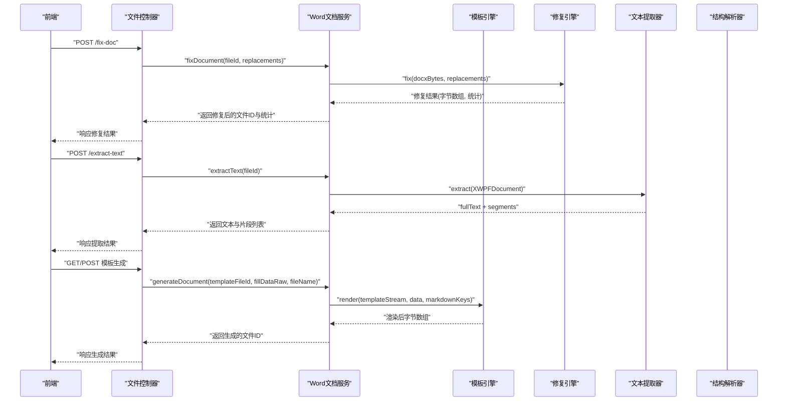
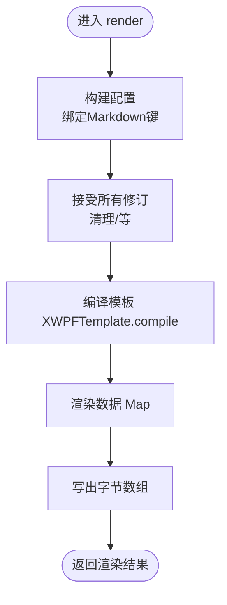
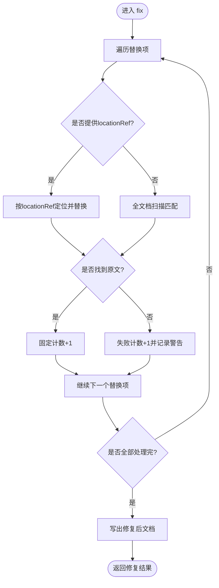
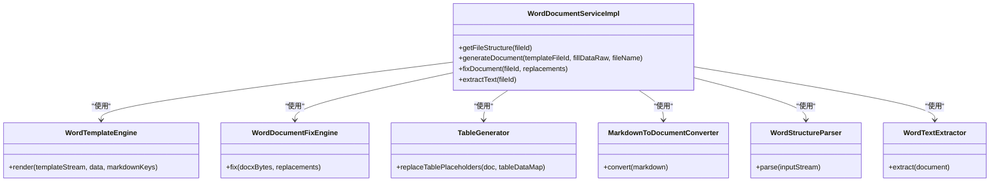

# Word文档处理

<cite>
**本文引用的文件**   
- [IWordDocumentService.java](file://ele-ai-tender-system/ele-ai-tender-file/src/main/java/com/jy/eleaitender/file/service/IWordDocumentService.java)
- [WordDocumentServiceImpl.java](file://ele-ai-tender-system/ele-ai-tender-file/src/main/java/com/jy/eleaitender/file/service/impl/WordDocumentServiceImpl.java)
- [WordTemplateEngine.java](file://ele-ai-tender-system/ele-ai-tender-file/src/main/java/com/jy/eleaitender/file/engine/WordTemplateEngine.java)
- [WordDocumentFixEngine.java](file://ele-ai-tender-system/ele-ai-tender-file/src/main/java/com/jy/eleaitender/file/engine/WordDocumentFixEngine.java)
- [TableGenerator.java](file://ele-ai-tender-system/ele-ai-tender-file/src/main/java/com/jy/eleaitender/file/engine/TableGenerator.java)
- [MarkdownToDocumentConverter.java](file://ele-ai-tender-system/ele-ai-tender-file/src/main/java/com/jy/eleaitender/file/engine/MarkdownToDocumentConverter.java)
- [WordStructureParser.java](file://ele-ai-tender-system/ele-ai-tender-file/src/main/java/com/jy/eleaitender/file/engine/WordStructureParser.java)
- [WordTextExtractor.java](file://ele-ai-tender-system/ele-ai-tender-file/src/main/java/com/jy/eleaitender/file/engine/WordTextExtractor.java)
- [FileController.java](file://ele-ai-tender-system/ele-ai-tender-file/src/main/java/com/jy/eleaitender/file/controller/FileController.java)
- [WordDocumentGenerator.java](file://ele-ai-tender-system/ele-ai-tender-core/src/main/java/com/jy/eleaitender/core/engine/WordDocumentGenerator.java)
- [FILE_SERVICE_SPEC.md](file://docs/rules/FILE_SERVICE_SPEC.md)
- [file.ts](file://ele-ai-tender-frontend/src/api/file.ts)
</cite>

## 目录
1. [简介](#简介)
2. [项目结构](#项目结构)
3. [核心组件](#核心组件)
4. [架构总览](#架构总览)
5. [详细组件分析](#详细组件分析)
6. [依赖关系分析](#依赖关系分析)
7. [性能与内存优化](#性能与内存优化)
8. [并发访问控制策略](#并发访问控制策略)
9. [故障排查指南](#故障排查指南)
10. [结论](#结论)
11. [附录：API规范](#附录api规范)

## 简介
本技术文档聚焦于Word文档处理模块，覆盖以下关键能力：
- 文档修复引擎：格式校正、样式统一、内容验证与自动修复（基于位置定位与规范化匹配）
- 模板引擎：数据绑定、条件渲染、循环处理及Markdown渲染
- 文档对象模型(DOM)操作接口与API规范：结构解析、文本提取、段落/表格级定位
- 大文档处理优化、内存管理与并发访问控制策略
- 文档完整性检查与自动修复机制的实现细节

## 项目结构
该模块位于后端“文件服务”子系统中，围绕Word文档的生成、修复、结构与文本提取提供统一服务。前端通过REST API调用后端能力进行预览、检测与修复。

```mermaid
graph TB
FE["前端<br/>file.ts"] --> FC["文件控制器<br/>FileController"]
FC --> Svc["Word文档服务<br/>WordDocumentServiceImpl"]
Svc --> Tpl["模板引擎<br/>WordTemplateEngine"]
Svc --> Fix["修复引擎<br/>WordDocumentFixEngine"]
Svc --> TxtExt["文本提取器<br/>WordTextExtractor"]
Svc --> Struct["结构解析器<br/>WordStructureParser"]
Svc --> TableGen["表格生成器<br/>TableGenerator"]
Svc --> MdConv["Markdown转换器<br/>MarkdownToDocumentConverter"]
CoreGen["HTML转Word生成器<br/>WordDocumentGenerator"] -. 独立使用 .->|可选| Svc
```

图表来源
- [FileController.java:137-176](file://ele-ai-tender-system/ele-ai-tender-file/src/main/java/com/jy/eleaitender/file/controller/FileController.java#L137-L176)
- [WordDocumentServiceImpl.java:31-118](file://ele-ai-tender-system/ele-ai-tender-file/src/main/java/com/jy/eleaitender/file/service/impl/WordDocumentServiceImpl.java#L31-L118)
- [WordTemplateEngine.java:42-63](file://ele-ai-tender-system/ele-ai-tender-file/src/main/java/com/jy/eleaitender/file/engine/WordTemplateEngine.java#L42-L63)
- [WordDocumentFixEngine.java:32-66](file://ele-ai-tender-system/ele-ai-tender-file/src/main/java/com/jy/eleaitender/file/engine/WordDocumentFixEngine.java#L32-L66)
- [WordTextExtractor.java:37-44](file://ele-ai-tender-system/ele-ai-tender-file/src/main/java/com/jy/eleaitender/file/engine/WordTextExtractor.java#L37-L44)
- [WordStructureParser.java:37-42](file://ele-ai-tender-system/ele-ai-tender-file/src/main/java/com/jy/eleaitender/file/engine/WordStructureParser.java#L37-L42)
- [TableGenerator.java:67-108](file://ele-ai-tender-system/ele-ai-tender-file/src/main/java/com/jy/eleaitender/file/engine/TableGenerator.java#L67-L108)
- [MarkdownToDocumentConverter.java:75-88](file://ele-ai-tender-system/ele-ai-tender-file/src/main/java/com/jy/eleaitender/file/engine/MarkdownToDocumentConverter.java#L75-L88)
- [WordDocumentGenerator.java:31-93](file://ele-ai-tender-system/ele-ai-tender-core/src/main/java/com/jy/eleaitender/core/engine/WordDocumentGenerator.java#L31-L93)

章节来源
- [FileController.java:137-176](file://ele-ai-tender-system/ele-ai-tender-file/src/main/java/com/jy/eleaitender/file/controller/FileController.java#L137-L176)
- [WordDocumentServiceImpl.java:31-118](file://ele-ai-tender-system/ele-ai-tender-file/src/main/java/com/jy/eleaitender/file/service/impl/WordDocumentServiceImpl.java#L31-L118)

## 核心组件
- IWordDocumentService：对外暴露获取文档结构、基于模板生成文档、修复文档、提取文本+位置索引等能力
- WordDocumentServiceImpl：编排各引擎完成两阶段渲染（poi-tl + POI编程）、修复流程与文本提取
- WordTemplateEngine：基于poi-tl渲染模板，支持文本、图片、Markdown；内置修订标记清理
- WordDocumentFixEngine：基于Apache POI实现文本查找替换，支持locationRef精确定位与规范化模糊匹配
- TableGenerator：将占位符段落替换为真实表格，负责列定义、表头与数据行生成
- MarkdownToDocumentConverter：将Markdown转换为poi-tl可渲染的DocumentRenderData
- WordStructureParser：解析章节、占位符与书签，输出结构化信息
- WordTextExtractor：提取段落/表格级文本与位置索引，供检测与修复定位使用
- FileController：HTTP接口层，接收请求并调用服务层
- WordDocumentGenerator：独立HTML到Word渲染器（非模板路径），用于直接由HTML生成格式化文档

章节来源
- [IWordDocumentService.java:1-49](file://ele-ai-tender-system/ele-ai-tender-file/src/main/java/com/jy/eleaitender/file/service/IWordDocumentService.java#L1-49)
- [WordDocumentServiceImpl.java:31-118](file://ele-ai-tender-system/ele-ai-tender-file/src/main/java/com/jy/eleaitender/file/service/impl/WordDocumentServiceImpl.java#L31-L118)
- [WordTemplateEngine.java:42-63](file://ele-ai-tender-system/ele-ai-tender-file/src/main/java/com/jy/eleaitender/file/engine/WordTemplateEngine.java#L42-L63)
- [WordDocumentFixEngine.java:32-66](file://ele-ai-tender-system/ele-ai-tender-file/src/main/java/com/jy/eleaitender/file/engine/WordDocumentFixEngine.java#L32-L66)
- [TableGenerator.java:67-108](file://ele-ai-tender-system/ele-ai-tender-file/src/main/java/com/jy/eleaitender/file/engine/TableGenerator.java#L67-L108)
- [MarkdownToDocumentConverter.java:75-88](file://ele-ai-tender-system/ele-ai-tender-file/src/main/java/com/jy/eleaitender/file/engine/MarkdownToDocumentConverter.java#L75-L88)
- [WordStructureParser.java:37-42](file://ele-ai-tender-system/ele-ai-tender-file/src/main/java/com/jy/eleaitender/file/engine/WordStructureParser.java#L37-L42)
- [WordTextExtractor.java:37-44](file://ele-ai-tender-system/ele-ai-tender-file/src/main/java/com/jy/eleaitender/file/engine/WordTextExtractor.java#L37-L44)
- [FileController.java:137-176](file://ele-ai-tender-system/ele-ai-tender-file/src/main/java/com/jy/eleaitender/file/controller/FileController.java#L137-L176)
- [WordDocumentGenerator.java:31-93](file://ele-ai-tender-system/ele-ai-tender-core/src/main/java/com/jy/eleaitender/core/engine/WordDocumentGenerator.java#L31-L93)

## 架构总览
系统采用分层架构：前端通过REST API调用文件服务控制器，控制器委派至Word文档服务，再由服务编排模板引擎、修复引擎、表格生成器、Markdown转换器、结构解析器与文本提取器等组件协同工作。



图表来源
- [FileController.java:137-176](file://ele-ai-tender-system/ele-ai-tender-file/src/main/java/com/jy/eleaitender/file/controller/FileController.java#L137-L176)
- [WordDocumentServiceImpl.java:67-118](file://ele-ai-tender-system/ele-ai-tender-file/src/main/java/com/jy/eleaitender/file/service/impl/WordDocumentServiceImpl.java#L67-L118)
- [WordTemplateEngine.java:42-63](file://ele-ai-tender-system/ele-ai-tender-file/src/main/java/com/jy/eleaitender/file/engine/WordTemplateEngine.java#L42-L63)
- [WordDocumentFixEngine.java:32-66](file://ele-ai-tender-system/ele-ai-tender-file/src/main/java/com/jy/eleaitender/file/engine/WordDocumentFixEngine.java#L32-L66)
- [WordTextExtractor.java:37-44](file://ele-ai-tender-system/ele-ai-tender-file/src/main/java/com/jy/eleaitender/file/engine/WordTextExtractor.java#L37-L44)
- [WordStructureParser.java:37-42](file://ele-ai-tender-system/ele-ai-tender-file/src/main/java/com/jy/eleaitender/file/engine/WordStructureParser.java#L37-L42)

## 详细组件分析

### 模板引擎（WordTemplateEngine）
- 功能要点
  - 使用poi-tl原生引擎渲染模板，避免SpringEL对Map数据的反射限制
  - 支持文本、图片、Markdown三类占位符；Markdown通过DocumentRenderPolicy渲染为格式化段落
  - 在渲染前执行“接受所有修订”，消除<w:ins>/<w:del>等修订标记导致的运行时异常
- 数据绑定与语法
  - 占位符语法：{{变量名}}，支持中英文变量名
  - 循环标签：{{?items}}...{{/items}}
  - 条件标签：同名变量包裹开始/结束
  - 图片标签：{{@var}}
  - 包含标签：{{+var}}
- 约束与注意事项
  - 禁止useSpringEL()，必须使用Configure.builder().build()
  - 相邻标签合并行为可能导致Mismatched start/end tags，需遵循模板编写规范
  - 版本要求：poi-tl ≥ 1.12.2



图表来源
- [WordTemplateEngine.java:42-63](file://ele-ai-tender-system/ele-ai-tender-file/src/main/java/com/jy/eleaitender/file/engine/WordTemplateEngine.java#L42-L63)
- [FILE_SERVICE_SPEC.md:33-71](file://docs/rules/FILE_SERVICE_SPEC.md#L33-L71)

章节来源
- [WordTemplateEngine.java:42-63](file://ele-ai-tender-system/ele-ai-tender-file/src/main/java/com/jy/eleaitender/file/engine/WordTemplateEngine.java#L42-L63)
- [FILE_SERVICE_SPEC.md:33-71](file://docs/rules/FILE_SERVICE_SPEC.md#L33-L71)

### 文档修复引擎（WordDocumentFixEngine）
- 功能要点
  - 支持两种定位策略：
    - locationRef精确定位（段落/表格单元格）
    - 全文档匹配（正文、表格、页眉、页脚）
  - 两级匹配：
    - Level 1：精确包含
    - Level 2：规范化匹配（移除空白后匹配，还原实际子串范围）
  - 替换策略：清空段落所有Run，将替换后文本写入第一个Run，保持样式一致性
- 算法流程



图表来源
- [WordDocumentFixEngine.java:32-66](file://ele-ai-tender-system/ele-ai-tender-file/src/main/java/com/jy/eleaitender/file/engine/WordDocumentFixEngine.java#L32-L66)
- [WordDocumentFixEngine.java:156-192](file://ele-ai-tender-system/ele-ai-tender-file/src/main/java/com/jy/eleaitender/file/engine/WordDocumentFixEngine.java#L156-L192)
- [WordDocumentFixEngine.java:209-234](file://ele-ai-tender-system/ele-ai-tender-file/src/main/java/com/jy/eleaitender/file/engine/WordDocumentFixEngine.java#L209-L234)

章节来源
- [WordDocumentFixEngine.java:32-66](file://ele-ai-tender-system/ele-ai-tender-file/src/main/java/com/jy/eleaitender/file/engine/WordDocumentFixEngine.java#L32-L66)
- [WordDocumentFixEngine.java:156-192](file://ele-ai-tender-system/ele-ai-tender-file/src/main/java/com/jy/eleaitender/file/engine/WordDocumentFixEngine.java#L156-L192)
- [WordDocumentFixEngine.java:209-234](file://ele-ai-tender-system/ele-ai-tender-file/src/main/java/com/jy/eleaitender/file/engine/WordDocumentFixEngine.java#L209-L234)

### 表格生成器（TableGenerator）
- 功能要点
  - 将占位符段落替换为真实表格
  - 根据列定义创建表头与数据行
  - 使用XmlCursor在占位段落前插入新表格，确保布局稳定
- 关键点
  - 默认无边框，需显式设置边框样式
  - 支持带前导空格的占位符识别与替换

章节来源
- [TableGenerator.java:67-108](file://ele-ai-tender-system/ele-ai-tender-file/src/main/java/com/jy/eleaitender/file/engine/TableGenerator.java#L67-L108)
- [FILE_SERVICE_SPEC.md:64-66](file://docs/rules/FILE_SERVICE_SPEC.md#L64-L66)

### Markdown转换器（MarkdownToDocumentConverter）
- 功能要点
  - 将Markdown AST转换为poi-tl DocumentRenderData
  - 支持标题、段落、列表、代码块、引用、表格等
  - 与模板引擎配合，通过DocumentRenderPolicy渲染为格式化段落

章节来源
- [MarkdownToDocumentConverter.java:75-88](file://ele-ai-tender-system/ele-ai-tender-file/src/main/java/com/jy/eleaitender/file/engine/MarkdownToDocumentConverter.java#L75-L88)

### 结构解析器（WordStructureParser）
- 功能要点
  - 解析章节（标题级别与文本）、占位符（{{变量名}}）、书签
  - 输出WordStructureVO，便于前端展示与编辑

章节来源
- [WordStructureParser.java:37-42](file://ele-ai-tender-system/ele-ai-tender-file/src/main/java/com/jy/eleaitender/file/engine/WordStructureParser.java#L37-L42)
- [WordStructureVO.java:1-40](file://ele-ai-tender-system/ele-ai-tender-common/src/main/java/com/jy/eleaitender/common/dto/response/WordStructureVO.java#L1-40)

### 文本提取器（WordTextExtractor）
- 功能要点
  - 提取段落/表格级文本与位置索引（elementIndex、tableIndex、rowIndex、cellIndex）
  - 输出fullText与segments，供检测与修复精确定位

章节来源
- [WordTextExtractor.java:37-44](file://ele-ai-tender-system/ele-ai-tender-file/src/main/java/com/jy/eleaitender/file/engine/WordTextExtractor.java#L37-L44)

### HTML转Word生成器（WordDocumentGenerator）
- 功能要点
  - 使用Jsoup解析HTML，递归渲染为XWPFDocument
  - 支持标题、段落、表格、列表、引用、分隔线等元素映射

章节来源
- [WordDocumentGenerator.java:31-93](file://ele-ai-tender-system/ele-ai-tender-core/src/main/java/com/jy/eleaitender/core/engine/WordDocumentGenerator.java#L31-L93)

## 依赖关系分析
- 组件耦合
  - WordDocumentServiceImpl作为编排中心，依赖模板引擎、修复引擎、表格生成器、Markdown转换器、结构解析器与文本提取器
  - 模板引擎依赖poi-tl与XML DOM操作以清理修订标记
  - 修复引擎依赖Apache POI与文本规范化工具
  - 表格生成器依赖POI的XmlCursor与表格API
- 外部依赖
  - Apache POI（XWPFDocument、段落/表格/页眉页脚操作）
  - poi-tl（模板编译与渲染）
  - Jsoup（HTML解析）
  - flexmark（Markdown AST）



图表来源
- [WordDocumentServiceImpl.java:31-118](file://ele-ai-tender-system/ele-ai-tender-file/src/main/java/com/jy/eleaitender/file/service/impl/WordDocumentServiceImpl.java#L31-L118)
- [WordTemplateEngine.java:42-63](file://ele-ai-tender-system/ele-ai-tender-file/src/main/java/com/jy/eleaitender/file/engine/WordTemplateEngine.java#L42-L63)
- [WordDocumentFixEngine.java:32-66](file://ele-ai-tender-system/ele-ai-tender-file/src/main/java/com/jy/eleaitender/file/engine/WordDocumentFixEngine.java#L32-L66)
- [TableGenerator.java:67-108](file://ele-ai-tender-system/ele-ai-tender-file/src/main/java/com/jy/eleaitender/file/engine/TableGenerator.java#L67-L108)
- [MarkdownToDocumentConverter.java:75-88](file://ele-ai-tender-system/ele-ai-tender-file/src/main/java/com/jy/eleaitender/file/engine/MarkdownToDocumentConverter.java#L75-L88)
- [WordStructureParser.java:37-42](file://ele-ai-tender-system/ele-ai-tender-file/src/main/java/com/jy/eleaitender/file/engine/WordStructureParser.java#L37-L42)
- [WordTextExtractor.java:37-44](file://ele-ai-tender-system/ele-ai-tender-file/src/main/java/com/jy/eleaitender/file/engine/WordTextExtractor.java#L37-L44)

章节来源
- [WordDocumentServiceImpl.java:31-118](file://ele-ai-tender-system/ele-ai-tender-file/src/main/java/com/jy/eleaitender/file/service/impl/WordDocumentServiceImpl.java#L31-L118)

## 性能与内存优化
- 流式处理与字节缓冲
  - 模板渲染与修复均使用ByteArrayOutputStream减少中间文件IO
  - 大文档建议分块处理或限制单次渲染的数据量
- 表格生成优化
  - 使用XmlCursor在占位段落前插入表格，避免多次重排
  - 预分配列数，减少动态扩容开销
- 文本匹配优化
  - 两级匹配优先精确匹配，其次规范化匹配，降低正则与全量扫描成本
  - 利用locationRef跳过全文扫描，提升定位效率
- 资源释放
  - 使用try-with-resources确保XWPFDocument与流及时关闭，避免内存泄漏

[本节为通用指导，不直接分析具体文件]

## 并发访问控制策略
- 单进程内并发
  - 每个请求独立加载XWPFDocument实例，避免共享状态
  - 模板编译与渲染尽量无状态化，避免全局缓存导致锁竞争
- 线程池与队列
  - 对于批量修复/生成任务，建议使用有界队列与固定大小线程池，防止OOM
- 存储层并发
  - 文件上传/下载使用独立连接与流，避免阻塞主线程

[本节为通用指导，不直接分析具体文件]

## 故障排查指南
- 模板填充失败
  - 现象：抛出IndexOutOfBoundsException或SpelEvaluationException
  - 原因：修订标记未清理或使用SpringEL
  - 解决：确保调用acceptAllRevisions()并使用原生引擎Configure.builder()
- 表格生成异常
  - 现象：表格无边框或占位符未被替换
  - 原因：未设置边框或未正确识别占位符
  - 解决：显式设置CTTblBorders；确认占位符前缀与名称一致
- 修复未命中
  - 现象：failedCount增加
  - 原因：原文存在空白差异或定位错误
  - 解决：启用规范化匹配；校验locationRef参数准确性
- 文本提取为空
  - 现象：segments为空或fullText为空
  - 原因：文档为空或读取失败
  - 解决：检查文件路径与权限；确认XWPFDocument成功加载

章节来源
- [WordTemplateEngine.java:42-63](file://ele-ai-tender-system/ele-ai-tender-file/src/main/java/com/jy/eleaitender/file/engine/WordTemplateEngine.java#L42-L63)
- [FILE_SERVICE_SPEC.md:33-71](file://docs/rules/FILE_SERVICE_SPEC.md#L33-L71)
- [TableGenerator.java:67-108](file://ele-ai-tender-system/ele-ai-tender-file/src/main/java/com/jy/eleaitender/file/engine/TableGenerator.java#L67-L108)
- [WordDocumentFixEngine.java:32-66](file://ele-ai-tender-system/ele-ai-tender-file/src/main/java/com/jy/eleaitender/file/engine/WordDocumentFixEngine.java#L32-L66)

## 结论
本模块通过模板引擎与修复引擎的协同，实现了从模板生成到智能修复的完整链路。借助结构化解析与文本提取，系统能够精准定位问题并进行自动化修复。同时，通过两阶段渲染与严格的模板约束，保证了生成文档的一致性与稳定性。后续可在大数据量场景下进一步优化内存占用与并发吞吐。

[本节为总结性内容，不直接分析具体文件]

## 附录：API规范
- 接口清单
  - 修复Word文档（替换文本）
    - 方法：POST /file-api/file/fix-doc
    - 请求体：{ fileId, replacements[] }
      - replacements[i]: { original, targeted, locationRef? }
      - locationRef: { type, elementIndex, tableIndex?, rowIndex?, cellIndex? }
    - 响应：{ fileId, fixedCount, failedCount }
  - 提取Word文档文本+位置索引
    - 方法：POST /file-api/file/extract-text
    - 请求体：{ fileId }
    - 响应：{ fullText, segments[] }
      - segments[i]: { type, elementIndex, text, fullTextOffset, tableIndex?, rowIndex?, cellIndex? }
  - 基于模板生成文档
    - 方法：POST /file-api/file/generate-document
    - 请求体：{ templateFileId, fillDataRaw[], fileName }
      - fillDataRaw[i]: { key, type, value }
      - type: TEXT | IMAGE | MARKDOWN | TABLE
    - 响应：{ fileId }
- 前端类型对齐
  - TextSegmentVO与ExtractTextVO与后端WordTextExtractor输出保持一致

章节来源
- [FileController.java:137-176](file://ele-ai-tender-system/ele-ai-tender-file/src/main/java/com/jy/eleaitender/file/controller/FileController.java#L137-L176)
- [file.ts:1-45](file://ele-ai-tender-frontend/src/api/file.ts#L1-45)
- [IWordDocumentService.java:1-49](file://ele-ai-tender-system/ele-ai-tender-file/src/main/java/com/jy/eleaitender/file/service/IWordDocumentService.java#L1-49)