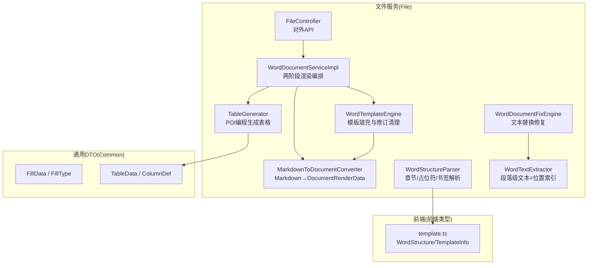
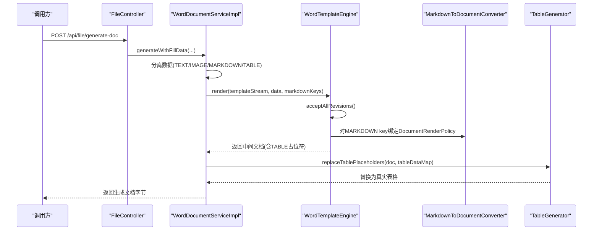
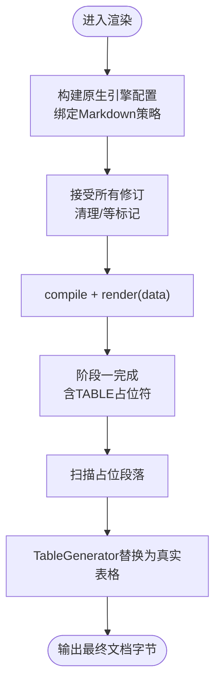
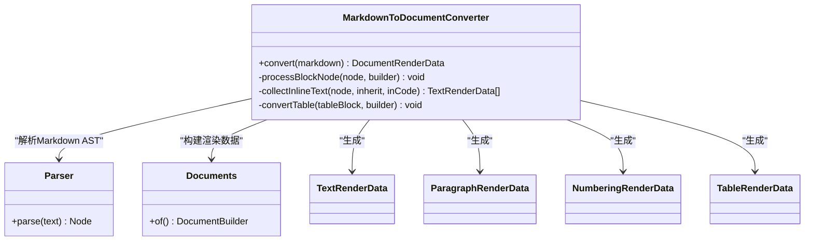
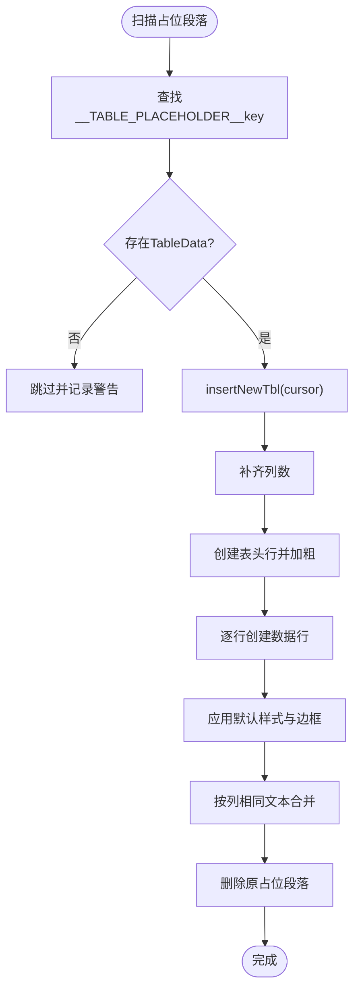
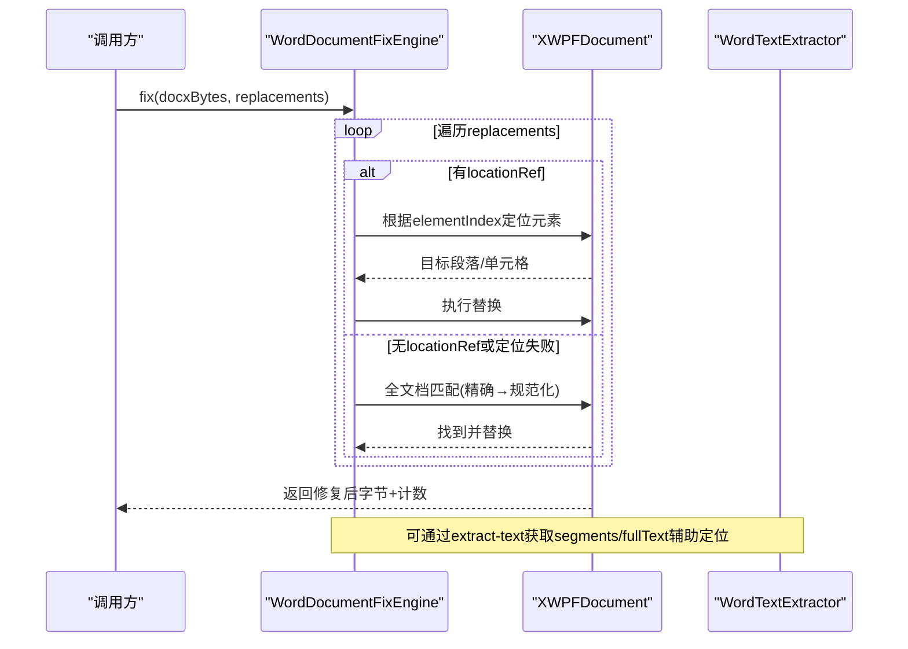
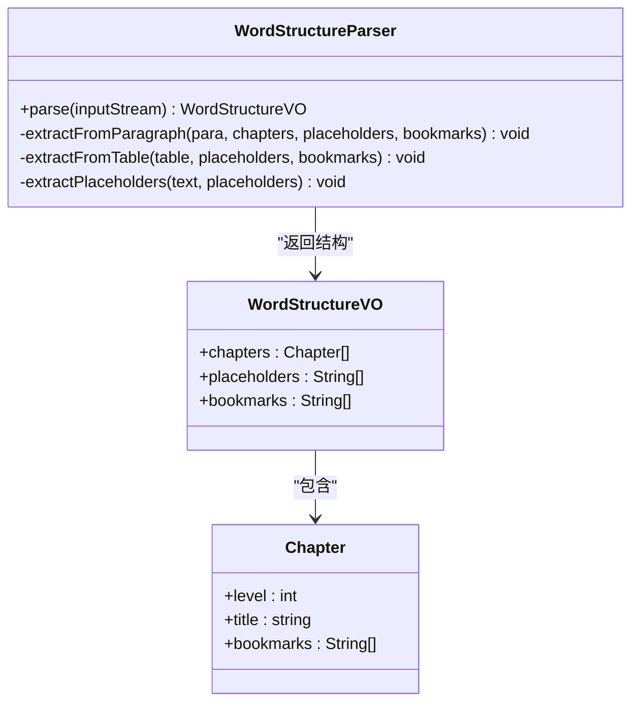
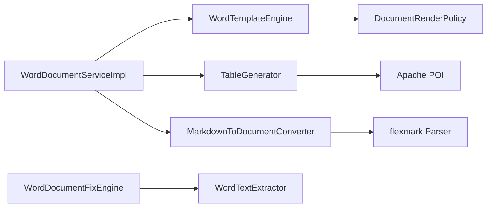

# Word模板引擎

<cite>
**本文引用的文件**   
- [WordTemplateEngine.java](file://ele-ai-tender-system/ele-ai-tender-file/src/main/java/com/jy/eleaitender/file/engine/WordTemplateEngine.java)
- [TableGenerator.java](file://ele-ai-tender-system/ele-ai-tender-file/src/main/java/com/jy/eleaitender/file/engine/TableGenerator.java)
- [MarkdownToDocumentConverter.java](file://ele-ai-tender-system/ele-ai-tender-file/src/main/java/com/jy/eleaitender/file/engine/MarkdownToDocumentConverter.java)
- [WordStructureParser.java](file://ele-ai-tender-system/ele-ai-tender-file/src/main/java/com/jy/eleaitender/file/engine/WordStructureParser.java)
- [WordDocumentFixEngine.java](file://ele-ai-tender-system/ele-ai-tender-file/src/main/java/com/jy/eleaitender/file/engine/WordDocumentFixEngine.java)
- [WordTextExtractor.java](file://ele-ai-tender-system/ele-ai-tender-file/src/main/java/com/jy/eleaitender/file/engine/WordTextExtractor.java)
- [WordDocumentServiceImpl.java](file://ele-ai-tender-system/ele-ai-tender-file/src/main/java/com/jy/eleaitender/file/service/impl/WordDocumentServiceImpl.java)
- [FileController.java](file://ele-ai-tender-system/ele-ai-tender-file/src/main/java/com/jy/eleaitender/file/controller/FileController.java)
- [FillData.java](file://ele-ai-tender-system/ele-ai-tender-common/src/main/java/com/jy/eleaitender/common/dto/FillData.java)
- [FillType.java](file://ele-ai-tender-system/ele-ai-tender-common/src/main/java/com/jy/eleaitender/common/dto/FillType.java)
- [TableData.java](file://ele-ai-tender-system/ele-ai-tender-common/src/main/java/com/jy/eleaitender/common/dto/TableData.java)
- [ColumnDef.java](file://ele-ai-tender-system/ele-ai-tender-common/src/main/java/com/jy/eleaitender/common/dto/ColumnDef.java)
- [FILE_SERVICE_SPEC.md](file://docs/rules/FILE_SERVICE_SPEC.md)
- [template.ts](file://ele-ai-tender-frontend/src/types/template.ts)
</cite>

## 目录
1. [简介](#简介)
2. [项目结构](#项目结构)
3. [核心组件](#核心组件)
4. [架构总览](#架构总览)
5. [详细组件分析](#详细组件分析)
6. [依赖关系分析](#依赖关系分析)
7. [性能与优化](#性能与优化)
8. [调试与排障](#调试与排障)
9. [结论](#结论)
10. [附录：语法与数据模型](#附录：语法与数据模型)

## 简介
本技术文档围绕仓库中的“Word模板引擎”进行系统化说明，覆盖模板解析、执行机制、数据绑定语法、条件渲染与循环处理、表格生成、动态内容插入、样式继承等高级特性；并给出模板编译过程、AST构建与优化策略、调试工具、错误处理与性能监控方案。该引擎基于 poi-tl 原生引擎实现文本/图片/Markdown渲染，通过 POI 编程生成复杂表格，并提供文档修复与文本定位能力，形成两阶段渲染流水线。

## 项目结构
- 模板渲染入口位于 File 服务模块的 engine 包中，包含模板填充、表格生成、Markdown转换、结构解析、文档修复与文本提取等核心类。
- 公共DTO定义在 common 模块，用于统一描述填充数据类型与表格数据结构。
- 前端类型定义提供模板结构与章节信息的接口契约。

图表来源
- [WordTemplateEngine.java:1-121](file://ele-ai-tender-system/ele-ai-tender-file/src/main/java/com/jy/eleaitender/file/engine/WordTemplateEngine.java#L1-L121)
- [TableGenerator.java:1-287](file://ele-ai-tender-system/ele-ai-tender-file/src/main/java/com/jy/eleaitender/file/engine/TableGenerator.java#L1-L287)
- [MarkdownToDocumentConverter.java:1-481](file://ele-ai-tender-system/ele-ai-tender-file/src/main/java/com/jy/eleaitender/file/engine/MarkdownToDocumentConverter.java#L1-L481)
- [WordStructureParser.java:1-132](file://ele-ai-tender-system/ele-ai-tender-file/src/main/java/com/jy/eleaitender/file/engine/WordStructureParser.java#L1-L132)
- [WordDocumentFixEngine.java:1-75](file://ele-ai-tender-system/ele-ai-tender-file/src/main/java/com/jy/eleaitender/file/engine/WordDocumentFixEngine.java#L1-L75)
- [WordTextExtractor.java:1-111](file://ele-ai-tender-system/ele-ai-tender-file/src/main/java/com/jy/eleaitender/file/engine/WordTextExtractor.java#L1-L111)
- [WordDocumentServiceImpl.java:71-98](file://ele-ai-tender-system/ele-ai-tender-file/src/main/java/com/jy/eleaitender/file/service/impl/WordDocumentServiceImpl.java#L71-L98)
- [FileController.java:137-176](file://ele-ai-tender-system/ele-ai-tender-file/src/main/java/com/jy/eleaitender/file/controller/FileController.java#L137-L176)
- [FillData.java:1-60](file://ele-ai-tender-system/ele-ai-tender-common/src/main/java/com/jy/eleaitender/common/dto/FillData.java#L1-L60)
- [TableData.java:11-22](file://ele-ai-tender-system/ele-ai-tender-common/src/main/java/com/jy/eleaitender/common/dto/TableData.java#L11-L22)
- [ColumnDef.java:8-32](file://ele-ai-tender-system/ele-ai-tender-common/src/main/java/com/jy/eleaitender/common/dto/ColumnDef.java#L8-L32)
- [template.ts:1-29](file://ele-ai-tender-frontend/src/types/template.ts#L1-L29)

章节来源
- [FILE_SERVICE_SPEC.md:1-153](file://docs/rules/FILE_SERVICE_SPEC.md#L1-L153)

## 核心组件
- WordTemplateEngine：负责使用 poi-tl 原生引擎进行模板编译与渲染，并在渲染前清除修订标记，避免 poi-tl 内部合并 Run 导致的异常。支持为 Markdown 占位符绑定 DocumentRenderPolicy。
- TableGenerator：绕过 poi-tl 循环标签限制，直接通过 Apache POI API 创建表格，支持表头加粗、默认边框、单元格合并（按列相同文本合并）等。
- MarkdownToDocumentConverter：将 Markdown AST 转换为 poi-tl 的 DocumentRenderData，支持标题、段落、列表、引用、代码块、表格等，保留行内格式（加粗/斜体/代码）。
- WordStructureParser：解析 Word 文档结构，提取章节（Heading）、占位符集合与书签集合，供前端展示或AI辅助匹配。
- WordDocumentFixEngine：接收 .docx 字节与替换列表，优先使用 locationRef 精准定位替换，否则回退到全文档两级匹配（精确→规范化），返回修复结果统计。
- WordTextExtractor：从 XWPFDocument 提取段落级文本与位置索引，输出 segments 与 fullText，供检测定位与修复流程使用。
- WordDocumentServiceImpl：编排两阶段渲染流程，第一阶段由 poi-tl 渲染文本/图片/Markdown（TABLE 以占位符形式注入），第二阶段扫描占位段落并用 TableGenerator 替换为真实表格。

章节来源
- [WordTemplateEngine.java:1-121](file://ele-ai-tender-system/ele-ai-tender-file/src/main/java/com/jy/eleaitender/file/engine/WordTemplateEngine.java#L1-L121)
- [TableGenerator.java:1-287](file://ele-ai-tender-system/ele-ai-tender-file/src/main/java/com/jy/eleaitender/file/engine/TableGenerator.java#L1-L287)
- [MarkdownToDocumentConverter.java:1-481](file://ele-ai-tender-system/ele-ai-tender-file/src/main/java/com/jy/eleaitender/file/engine/MarkdownToDocumentConverter.java#L1-L481)
- [WordStructureParser.java:1-132](file://ele-ai-tender-system/ele-ai-tender-file/src/main/java/com/jy/eleaitender/file/engine/WordStructureParser.java#L1-L132)
- [WordDocumentFixEngine.java:1-75](file://ele-ai-tender-system/ele-ai-tender-file/src/main/java/com/jy/eleaitender/file/engine/WordDocumentFixEngine.java#L1-L75)
- [WordTextExtractor.java:1-111](file://ele-ai-tender-system/ele-ai-tender-file/src/main/java/com/jy/eleaitender/file/engine/WordTextExtractor.java#L1-L111)
- [WordDocumentServiceImpl.java:71-98](file://ele-ai-tender-system/ele-ai-tender-file/src/main/java/com/jy/eleaitender/file/service/impl/WordDocumentServiceImpl.java#L71-L98)

## 架构总览
整体采用“两阶段渲染”架构：
- 阶段一：分离数据 → poi-tl 渲染文本/图片/Markdown，表格以占位符文本注入。
- 阶段二：POI 扫描占位段落，用 TableGenerator 替换为真实表格，完成最终文档生成。

图表来源
- [FileController.java:137-176](file://ele-ai-tender-system/ele-ai-tender-file/src/main/java/com/jy/eleaitender/file/controller/FileController.java#L137-L176)
- [WordDocumentServiceImpl.java:71-98](file://ele-ai-tender-system/ele-ai-tender-file/src/main/java/com/jy/eleaitender/file/service/impl/WordDocumentServiceImpl.java#L71-L98)
- [WordTemplateEngine.java:42-63](file://ele-ai-tender-system/ele-ai-tender-file/src/main/java/com/jy/eleaitender/file/engine/WordTemplateEngine.java#L42-L63)
- [MarkdownToDocumentConverter.java:75-88](file://ele-ai-tender-system/ele-ai-tender-file/src/main/java/com/jy/eleaitender/file/engine/MarkdownToDocumentConverter.java#L75-L88)
- [TableGenerator.java:31-53](file://ele-ai-tender-system/ele-ai-tender-file/src/main/java/com/jy/eleaitender/file/engine/TableGenerator.java#L31-L53)

## 详细组件分析

### 模板语言与数据绑定
- 占位符语法：{{变量名}}，支持中英文变量名。
- 完整标签语法：
  - 文本：{{var}}
  - 循环（区块对）：{{?items}}...{{/items}}
  - 图片：{{@var}}
  - 包含（子模板）：{{+var}}
  - 条件（区块对）：{{var}}...{{var}}
- 数据类型：
  - TEXT → String
  - IMAGE → PictureRenderData（通过 ImageData 转换）
  - MARKDOWN → DocumentRenderData（由 MarkdownToDocumentConverter 生成）
  - TABLE → 占位文本 __TABLE_PLACEHOLDER__key，后续由 TableGenerator 替换
- 条件渲染与循环：
  - 条件：同名变量包裹的区块对，值为布尔型时生效。
  - 循环：以 ? 标识开始标签，结束标签需与开始标签同名。
- 注意事项：
  - 必须使用 poi-tl 原生引擎（禁止 useSpringEL），缺失字段返回空字符串，天然容错。
  - 相邻标签合并行为可能导致 Mismatched start/end tags，复杂表格已绕开循环标签。

章节来源
- [FILE_SERVICE_SPEC.md:33-71](file://docs/rules/FILE_SERVICE_SPEC.md#L33-L71)
- [FillData.java:1-60](file://ele-ai-tender-system/ele-ai-tender-common/src/main/java/com/jy/eleaitender/common/dto/FillData.java#L1-L60)
- [FillType.java:1-19](file://ele-ai-tender-system/ele-ai-tender-common/src/main/java/com/jy/eleaitender/common/dto/FillType.java#L1-L19)

### 模板编译与执行流程
- 编译配置：Configure.builder().build() 原生引擎，按需绑定 Markdown 占位符的 DocumentRenderPolicy。
- 修订标记预处理：acceptAllRevisions() 解包 <w:ins>/<w:moveTo>，删除 <w:del>/<w:moveFrom> 及属性变更标记，避免 poi-tl refactorRun 索引错乱。
- 渲染执行：XWPFTemplate.compile(...).render(data)，写入字节数组。
- 两阶段渲染：
  - 阶段一：poi-tl 渲染文本/图片/Markdown，TABLE 以占位符注入。
  - 阶段二：扫描占位段落，TableGenerator 替换为真实表格。

图表来源
- [WordTemplateEngine.java:42-63](file://ele-ai-tender-system/ele-ai-tender-file/src/main/java/com/jy/eleaitender/file/engine/WordTemplateEngine.java#L42-L63)
- [WordTemplateEngine.java:71-89](file://ele-ai-tender-system/ele-ai-tender-file/src/main/java/com/jy/eleaitender/file/engine/WordTemplateEngine.java#L71-L89)
- [WordDocumentServiceImpl.java:71-98](file://ele-ai-tender-system/ele-ai-tender-file/src/main/java/com/jy/eleaitender/file/service/impl/WordDocumentServiceImpl.java#L71-L98)
- [TableGenerator.java:31-53](file://ele-ai-tender-system/ele-ai-tender-file/src/main/java/com/jy/eleaitender/file/engine/TableGenerator.java#L31-L53)

章节来源
- [WordTemplateEngine.java:1-121](file://ele-ai-tender-system/ele-ai-tender-file/src/main/java/com/jy/eleaitender/file/engine/WordTemplateEngine.java#L1-L121)
- [WordDocumentServiceImpl.java:71-98](file://ele-ai-tender-system/ele-ai-tender-file/src/main/java/com/jy/eleaitender/file/service/impl/WordDocumentServiceImpl.java#L71-L98)

### Markdown渲染与AST构建
- 解析器：flexmark Parser，启用 TablesExtension 以识别 Markdown 表格语法。
- AST遍历：
  - 块级节点：Heading、Paragraph、BulletList、OrderedList、FencedCodeBlock、BlockQuote、TableBlock。
  - 行内节点：Text、StrongEmphasis、Emphasis、Code、SoftLineBreak、HardLineBreak。
- 映射规则：
  - Heading → ParagraphRenderData（大号加粗字体）
  - Paragraph → ParagraphRenderData（含行内格式）
  - BulletList/OrderedList → NumberingRenderData
  - BlockQuote → ParagraphRenderData（带 "> " 前缀）
  - FencedCodeBlock → ParagraphRenderData（等宽字体）
  - TableBlock → TableRenderData（表头加粗，单元格保留行内格式）
- 样式继承：Style 合并与复制，确保默认字体与字号，代码环境使用等宽字体。

图表来源
- [MarkdownToDocumentConverter.java:75-88](file://ele-ai-tender-system/ele-ai-tender-file/src/main/java/com/jy/eleaitender/file/engine/MarkdownToDocumentConverter.java#L75-L88)
- [MarkdownToDocumentConverter.java:92-116](file://ele-ai-tender-system/ele-ai-tender-file/src/main/java/com/jy/eleaitender/file/engine/MarkdownToDocumentConverter.java#L92-L116)
- [MarkdownToDocumentConverter.java:186-234](file://ele-ai-tender-system/ele-ai-tender-file/src/main/java/com/jy/eleaitender/file/engine/MarkdownToDocumentConverter.java#L186-L234)
- [MarkdownToDocumentConverter.java:401-446](file://ele-ai-tender-system/ele-ai-tender-file/src/main/java/com/jy/eleaitender/file/engine/MarkdownToDocumentConverter.java#L401-L446)

章节来源
- [MarkdownToDocumentConverter.java:1-481](file://ele-ai-tender-system/ele-ai-tender-file/src/main/java/com/jy/eleaitender/file/engine/MarkdownToDocumentConverter.java#L1-L481)

### 表格生成与样式继承
- 占位符：__TABLE_PLACEHOLDER__key，由 TableGenerator 扫描并替换。
- 表格结构：
  - 列定义：ColumnDef(key, header, width)
  - 行数据：List<Map<String, String>>，key 对应 ColumnDef.key
  - 合并规则：MergeRule(strategy=BY_SAME_TEXT, columnIndex)
- 默认样式：
  - 表格宽度100%，设置六边边框（top/bottom/left/right/insideH/insideV）
  - 单元格垂直居中，段落左对齐，字号10pt，字体宋体
  - 表头行居中对齐
- 合并逻辑：按列相同文本连续合并，首格 RESTART，中间 CONTINUE，并清空重复单元格文本。

图表来源
- [TableGenerator.java:31-53](file://ele-ai-tender-system/ele-ai-tender-file/src/main/java/com/jy/eleaitender/file/engine/TableGenerator.java#L31-L53)
- [TableGenerator.java:75-117](file://ele-ai-tender-system/ele-ai-tender-file/src/main/java/com/jy/eleaitender/file/engine/TableGenerator.java#L75-L117)
- [TableGenerator.java:119-143](file://ele-ai-tender-system/ele-ai-tender-file/src/main/java/com/jy/eleaitender/file/engine/TableGenerator.java#L119-L143)
- [TableGenerator.java:147-184](file://ele-ai-tender-system/ele-ai-tender-file/src/main/java/com/jy/eleaitender/file/engine/TableGenerator.java#L147-L184)
- [TableGenerator.java:234-285](file://ele-ai-tender-system/ele-ai-tender-file/src/main/java/com/jy/eleaitender/file/engine/TableGenerator.java#L234-L285)

章节来源
- [TableGenerator.java:1-287](file://ele-ai-tender-system/ele-ai-tender-file/src/main/java/com/jy/eleaitender/file/engine/TableGenerator.java#L1-L287)
- [TableData.java:11-22](file://ele-ai-tender-system/ele-ai-tender-common/src/main/java/com/jy/eleaitender/common/dto/TableData.java#L11-L22)
- [ColumnDef.java:8-32](file://ele-ai-tender-system/ele-ai-tender-common/src/main/java/com/jy/eleaitender/common/dto/ColumnDef.java#L8-L32)

### 文档修复与文本定位
- 修复引擎：
  - 输入：.docx 字节 + FixReplacement 列表
  - 定位策略：优先 locationRef（elementIndex/tableIndex/rowIndex/cellIndex），失败则全文档匹配
  - 匹配策略：精确匹配优先，规范化匹配兜底（移除空白后匹配，还原实际子串范围）
  - 多 Run 替换：合并段落全文 → 替换 → 清空所有 Run → 写入第一个 Run（会丢失跨 Run 局部格式）
- 文本提取：
  - 输出 ExtractResult{segments, fullText}
  - segment 包含 type、elementIndex、tableIndex、rowIndex、cellIndex、text、fullTextOffset
  - locate(result, original) 返回 LocationRefVO，供修复引擎精准定位

图表来源
- [WordDocumentFixEngine.java:32-66](file://ele-ai-tender-system/ele-ai-tender-file/src/main/java/com/jy/eleaitender/file/engine/WordDocumentFixEngine.java#L32-L66)
- [WordTextExtractor.java:37-95](file://ele-ai-tender-system/ele-ai-tender-file/src/main/java/com/jy/eleaitender/file/engine/WordTextExtractor.java#L37-L95)
- [WordTextExtractor.java:105-130](file://ele-ai-tender-system/ele-ai-tender-file/src/main/java/com/jy/eleaitender/file/engine/WordTextExtractor.java#L105-L130)

章节来源
- [WordDocumentFixEngine.java:1-75](file://ele-ai-tender-system/ele-ai-tender-file/src/main/java/com/jy/eleaitender/file/engine/WordDocumentFixEngine.java#L1-L75)
- [WordTextExtractor.java:1-111](file://ele-ai-tender-system/ele-ai-tender-file/src/main/java/com/jy/eleaitender/file/engine/WordTextExtractor.java#L1-111)
- [FILE_SERVICE_SPEC.md:73-84](file://docs/rules/FILE_SERVICE_SPEC.md#L73-L84)

### 模板结构解析与前端集成
- 解析器：WordStructureParser 遍历 BodyElements，提取：
  - 章节：Heading 样式级别与标题文本
  - 占位符：正则 {{[\w\u4e00-\u9fa5]+}}
  - 书签：CTBookmark 名称（过滤下划线前缀）
- 前端类型：
  - WordChapter{level, title, bookmarks[]}
  - WordStructure{chapters, placeholders, bookmarks}
  - TemplateInfo{structureDefinition: WordStructure}

图表来源
- [WordStructureParser.java:37-59](file://ele-ai-tender-system/ele-ai-tender-file/src/main/java/com/jy/eleaitender/file/engine/WordStructureParser.java#L37-L59)
- [WordStructureParser.java:61-91](file://ele-ai-tender-system/ele-ai-tender-file/src/main/java/com/jy/eleaitender/file/engine/WordStructureParser.java#L61-L91)
- [WordStructureParser.java:93-109](file://ele-ai-tender-system/ele-ai-tender-file/src/main/java/com/jy/eleaitender/file/engine/WordStructureParser.java#L93-L109)
- [WordStructureParser.java:111-119](file://ele-ai-tender-system/ele-ai-tender-file/src/main/java/com/jy/eleaitender/file/engine/WordStructureParser.java#L111-L119)
- [template.ts:1-29](file://ele-ai-tender-frontend/src/types/template.ts#L1-L29)

章节来源
- [WordStructureParser.java:1-132](file://ele-ai-tender-system/ele-ai-tender-file/src/main/java/com/jy/eleaitender/file/engine/WordStructureParser.java#L1-L132)
- [template.ts:1-29](file://ele-ai-tender-frontend/src/types/template.ts#L1-L29)

## 依赖关系分析
- 组件耦合：
  - WordDocumentServiceImpl 编排 WordTemplateEngine、TableGenerator、MarkdownToDocumentConverter。
  - WordTemplateEngine 依赖 poi-tl 原生引擎与 DocumentRenderPolicy。
  - TableGenerator 依赖 Apache POI 底层 API 与 TableData/ColumnDef。
  - MarkdownToDocumentConverter 依赖 flexmark Parser 与 poi-tl RenderData。
  - WordDocumentFixEngine 与 WordTextExtractor 协作，提供修复与定位能力。
- 外部依赖：
  - poi-tl ≥ 1.12.2（修复 removeRun Bug）
  - flexmark（Markdown AST 解析）
  - Apache POI（XWPFDocument、XmlCursor、CT* 对象）

图表来源
- [WordDocumentServiceImpl.java:71-98](file://ele-ai-tender-system/ele-ai-tender-file/src/main/java/com/jy/eleaitender/file/service/impl/WordDocumentServiceImpl.java#L71-L98)
- [WordTemplateEngine.java:42-63](file://ele-ai-tender-system/ele-ai-tender-file/src/main/java/com/jy/eleaitender/file/engine/WordTemplateEngine.java#L42-L63)
- [TableGenerator.java:1-287](file://ele-ai-tender-system/ele-ai-tender-file/src/main/java/com/jy/eleaitender/file/engine/TableGenerator.java#L1-L287)
- [MarkdownToDocumentConverter.java:62-67](file://ele-ai-tender-system/ele-ai-tender-file/src/main/java/com/jy/eleaitender/file/engine/MarkdownToDocumentConverter.java#L62-L67)
- [WordDocumentFixEngine.java:32-66](file://ele-ai-tender-system/ele-ai-tender-file/src/main/java/com/jy/eleaitender/file/engine/WordDocumentFixEngine.java#L32-L66)
- [WordTextExtractor.java:37-95](file://ele-ai-tender-system/ele-ai-tender-file/src/main/java/com/jy/eleaitender/file/engine/WordTextExtractor.java#L37-L95)

章节来源
- [FILE_SERVICE_SPEC.md:33-71](file://docs/rules/FILE_SERVICE_SPEC.md#L33-L71)

## 性能与优化
- 渲染路径优化：
  - 两阶段渲染减少一次性处理复杂度，表格生成独立于 poi-tl 循环标签，避免相邻标签合并问题。
  - Markdown 转换仅在需要时绑定 DocumentRenderPolicy，降低无关开销。
- 内存与IO：
  - 使用 ByteArrayInputStream/ByteArrayOutputStream 避免临时文件落盘。
  - 表格生成时按列补齐与批量样式应用，减少多次 DOM 操作。
- 版本约束：
  - poi-tl ≥ 1.12.2，规避 removeRun 已知 Bug。
- 建议：
  - 大文档场景可考虑分页生成与流式写入。
  - 表格合并规则尽量精简，减少深层嵌套与频繁合并。

[本节为通用指导，不直接分析具体文件]

## 调试与排障
- 常见问题：
  - 模板修订标记导致 IndexOutOfBoundsException：确保在渲染前执行 acceptAllRevisions()。
  - 相邻标签合并导致 Mismatched start/end tags：复杂表格使用 TableGenerator 绕过循环标签。
  - 表格无边框：确保 applyTableBorders 设置六边边框。
  - 修复替换位置错误：检查 locationRef 的 elementIndex 是否越界，确认 type 与实际元素一致。
- 日志与追踪：
  - 关键步骤记录日志（如表格占位符替换、未找到表格数据、未找到原文等）。
  - 遵循全局日志规范，透传 X-Trace-Id，不记录二进制内容。
- 测试用例：
  - TableGeneratorTest：验证占位符替换与表格生成正确性。
  - MarkdownToDocumentConverterTest：验证混合内容与表格转换。
  - WordTextExtractorTest：验证段落/表格提取与定位。
  - WordDocumentFixEngineTest：验证修复流程与计数。

章节来源
- [FILE_SERVICE_SPEC.md:65-71](file://docs/rules/FILE_SERVICE_SPEC.md#L65-L71)
- [TableGeneratorTest.java:1-47](file://ele-ai-tender-system/ele-ai-tender-file/src/test/java/com/jy/eleaitender/file/engine/TableGeneratorTest.java#L1-L47)
- [MarkdownToDocumentConverterTest.java:363-540](file://ele-ai-tender-system/ele-ai-tender-file/src/test/java/com/jy/eleaitender/file/engine/MarkdownToDocumentConverterTest.java#L363-L540)
- [WordTextExtractorTest.java:1-130](file://ele-ai-tender-system/ele-ai-tender-file/src/test/java/com/jy/eleaitender/file/engine/WordTextExtractorTest.java#L1-L130)
- [WordDocumentFixEngineTest.java:1-38](file://ele-ai-tender-system/ele-ai-tender-file/src/test/java/com/jy/eleaitender/file/engine/WordDocumentFixEngineTest.java#L1-L38)

## 结论
本 Word 模板引擎通过“两阶段渲染”有效解耦文本/图片/Markdown 渲染与复杂表格生成，结合修订标记清理、Markdown AST 转换、精准定位与修复能力，满足招标文档生成的复杂需求。遵循规范与最佳实践可显著提升稳定性与可维护性。

[本节为总结，不直接分析具体文件]

## 附录：语法与数据模型
- 模板语法要点：
  - 占位符：{{变量名}}
  - 循环：{{?items}}...{{/items}}
  - 条件：{{var}}...{{var}}
  - 图片：{{@var}}
  - 包含：{{+var}}
- 数据类型与键值约定：
  - FillData.type ∈ {TEXT, TABLE, IMAGE, MARKDOWN}
  - FillData.key 对应模板占位符名
  - TableData.columns/key/header/width；rows 为 Map<String,String>；mergeRules 支持 BY_SAME_TEXT
- 前端结构契约：
  - WordStructure.chapters/placeholders/bookmarks
  - TemplateInfo.structureDefinition

章节来源
- [FILE_SERVICE_SPEC.md:33-71](file://docs/rules/FILE_SERVICE_SPEC.md#L33-L71)
- [FillData.java:1-60](file://ele-ai-tender-system/ele-ai-tender-common/src/main/java/com/jy/eleaitender/common/dto/FillData.java#L1-L60)
- [FillType.java:1-19](file://ele-ai-tender-system/ele-ai-tender-common/src/main/java/com/jy/eleaitender/common/dto/FillType.java#L1-L19)
- [TableData.java:11-22](file://ele-ai-tender-system/ele-ai-tender-common/src/main/java/com/jy/eleaitender/common/dto/TableData.java#L11-L22)
- [ColumnDef.java:8-32](file://ele-ai-tender-system/ele-ai-tender-common/src/main/java/com/jy/eleaitender/common/dto/ColumnDef.java#L8-L32)
- [template.ts:1-29](file://ele-ai-tender-frontend/src/types/template.ts#L1-L29)