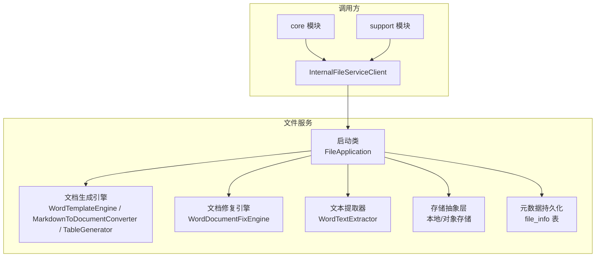
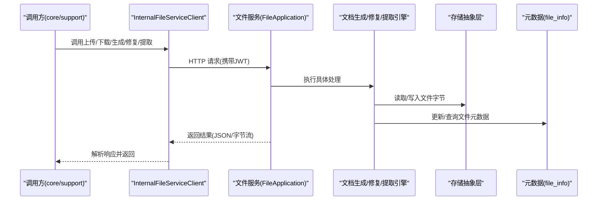
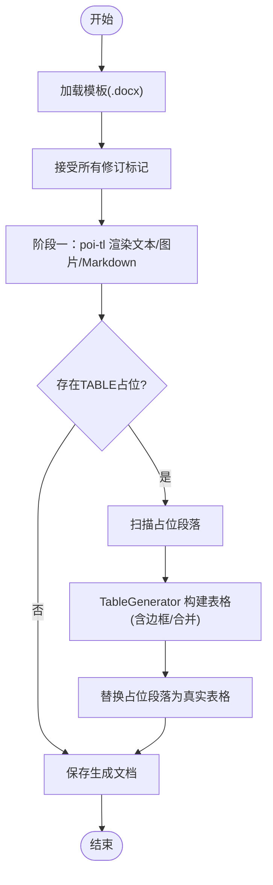
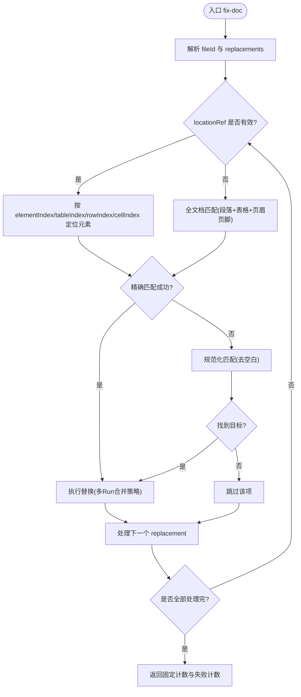
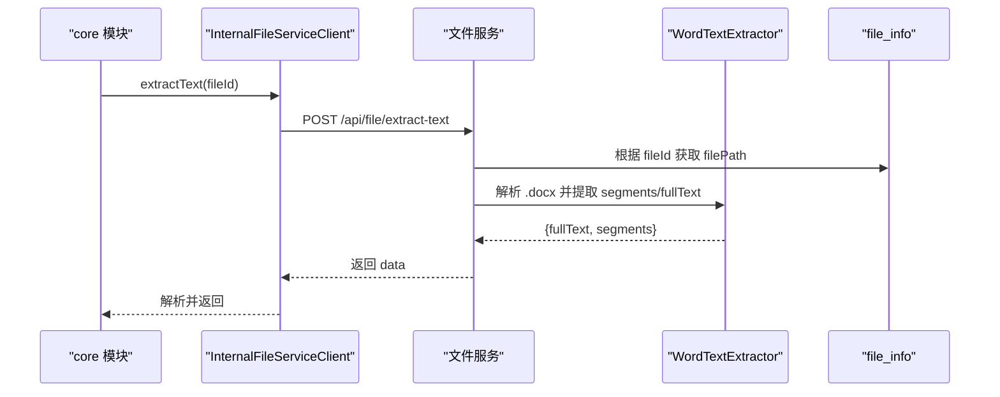
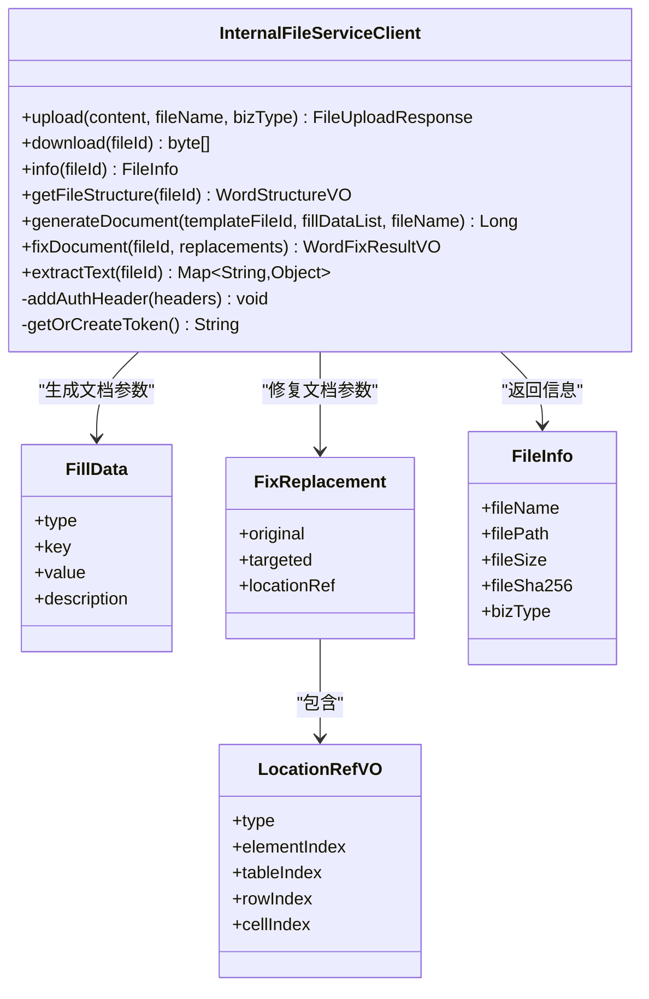
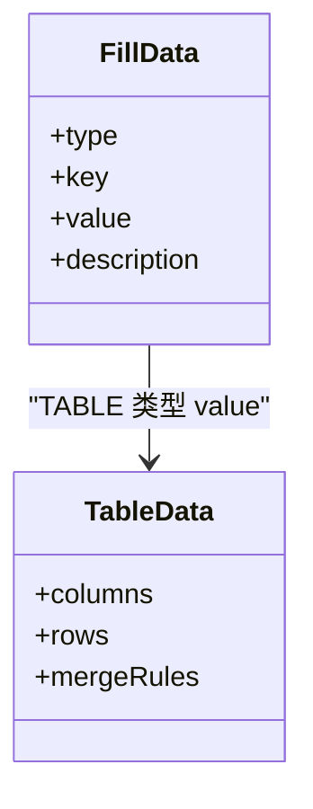
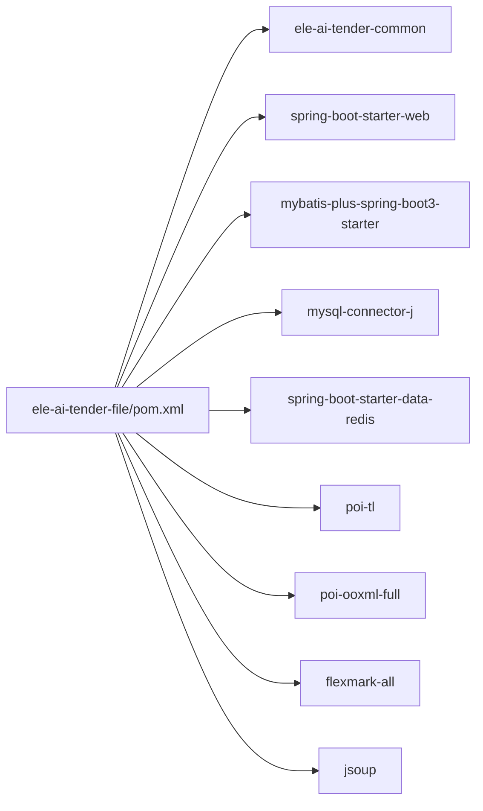

# 文件处理服务 (ele-ai-tender-file)

<cite>
**本文引用的文件**   
- [FileApplication.java](file://ele-ai-tender-system/ele-ai-tender-file/src/main/java/com/jy/eleaitender/file/FileApplication.java)
- [FILE_SERVICE_SPEC.md](file://docs/rules/FILE_SERVICE_SPEC.md)
- [InternalFileServiceClient.java](file://ele-ai-tender-system/ele-ai-tender-common/src/main/java/com/jy/eleaitender/common/client/InternalFileServiceClient.java)
- [FixReplacement.java](file://ele-ai-tender-system/ele-ai-tender-common/src/main/java/com/jy/eleaitender/common/dto/FixReplacement.java)
- [LocationRefVO.java](file://ele-ai-tender-system/ele-ai-tender-common/src/main/java/com/jy/eleaitender/common/dto/LocationRefVO.java)
- [TableData.java](file://ele-ai-tender-system/ele-ai-tender-common/src/main/java/com/jy/eleaitender/common/dto/TableData.java)
- [FillData.java](file://ele-ai-tender-system/ele-ai-tender-common/src/main/java/com/jy/eleaitender/common/dto/FillData.java)
- [FileInfo.java](file://ele-ai-tender-system/ele-ai-tender-common/src/main/java/com/jy/eleaitender/common/entity/file/FileInfo.java)
- [pom.xml](file://ele-ai-tender-system/ele-ai-tender-file/pom.xml)
</cite>

## 目录
1. [简介](#简介)
2. [项目结构](#项目结构)
3. [核心组件](#核心组件)
4. [架构总览](#架构总览)
5. [详细组件分析](#详细组件分析)
6. [依赖分析](#依赖分析)
7. [性能考虑](#性能考虑)
8. [故障排查指南](#故障排查指南)
9. [结论](#结论)
10. [附录](#附录)

## 简介
本技术文档围绕 ele-ai-tender-file 文件处理服务，系统阐述多格式文档处理能力（Word 解析、Markdown 转换、PDF 生成等）、文档结构分析与表格提取、文本处理算法、文件存储抽象层与上传下载、文档预览与版本对比、批量处理、性能优化与存储策略选择、以及故障恢复方案。文档同时覆盖内部服务调用契约、接口规范与排障原则，帮助读者快速理解并高效使用文件服务。

## 项目结构
ele-ai-tender-file 作为独立 Spring Boot 应用提供统一文件能力，包括：
- 文件上传、下载、查询、删除
- 文档生成引擎（Markdown→Word、Word 模板→Word）
- Word 文档修复与文本提取
- 通过 InternalFileServiceClient 被 core/support 模块调用

图表来源
- [FileApplication.java:1-18](file://ele-ai-tender-system/ele-ai-tender-file/src/main/java/com/jy/eleaitender/file/FileApplication.java#L1-L18)
- [FILE_SERVICE_SPEC.md:1-153](file://docs/rules/FILE_SERVICE_SPEC.md#L1-L153)

章节来源
- [FileApplication.java:1-18](file://ele-ai-tender-system/ele-ai-tender-file/src/main/java/com/jy/eleaitender/file/FileApplication.java#L1-L18)
- [FILE_SERVICE_SPEC.md:1-153](file://docs/rules/FILE_SERVICE_SPEC.md#L1-L153)

## 核心组件
- 启动与扫描
  - 启动类负责初始化 Spring Boot 应用并扫描 Mapper 包，确保 MyBatis Plus 映射生效。
- 文档生成引擎
  - Word 模板填充与渲染（poi-tl），支持 Markdown 绑定 DocumentRenderPolicy。
  - Word 模板结构解析，提取占位符和结构定义。
  - Markdown AST → DocumentRenderData 转换器（flexmark），支持标题、加粗、斜体、列表、引用、代码、表格。
  - POI 编程生成表格（含单元格合并+边框），绕过 poi-tl 循环标签限制。
- 文档修复引擎
  - 基于 Apache POI XWPFDocument 的文本替换，支持 locationRef 精准定位段落或表格单元格。
  - 两级匹配：精确匹配优先，规范化匹配兜底。
- 文本提取器
  - 从 XWPFDocument 提取段落级文本与位置索引（segments + fullText），供检测位置匹配使用。
- 内部服务客户端
  - 封装上传、下载、获取信息、获取 Word 结构、生成文档、修复文档、提取文本等接口，并提供服务间 JWT 认证与响应解析。

章节来源
- [FILE_SERVICE_SPEC.md:18-93](file://docs/rules/FILE_SERVICE_SPEC.md#L18-L93)
- [InternalFileServiceClient.java:26-247](file://ele-ai-tender-system/ele-ai-tender-common/src/main/java/com/jy/eleaitender/common/client/InternalFileServiceClient.java#L26-L247)

## 架构总览
文件服务采用“Web 控制器 + 引擎 + 存储抽象 + 元数据持久化”的分层设计。调用方通过 InternalFileServiceClient 访问 REST 接口，服务内部由引擎完成复杂文档处理逻辑，并通过存储抽象层将文件落盘，元数据写入数据库。

图表来源
- [InternalFileServiceClient.java:52-247](file://ele-ai-tender-system/ele-ai-tender-common/src/main/java/com/jy/eleaitender/common/client/InternalFileServiceClient.java#L52-L247)
- [FILE_SERVICE_SPEC.md:18-93](file://docs/rules/FILE_SERVICE_SPEC.md#L18-L93)

## 详细组件分析

### 组件A：文档生成与渲染流水线
- 两阶段渲染
  - 阶段一：poi-tl 渲染文本/图片/Markdown，表格以占位文本标记。
  - 阶段二：POI 扫描占位段落，用 TableGenerator 替换为真实表格。
- Markdown 渲染
  - FillData.markdown() → flexmark AST → DocumentRenderData → poi-tl DocumentRenderPolicy 渲染为格式化段落。
- 表格生成约束
  - insertNewTbl 创建的表格默认无边框，需显式设置 6 种边框。
- 模板修订标记预处理
  - 在传给 poi-tl 前接受所有修订，避免 refactorRun 合并 Run 时索引错乱。

图表来源
- [FILE_SERVICE_SPEC.md:61-71](file://docs/rules/FILE_SERVICE_SPEC.md#L61-L71)

章节来源
- [FILE_SERVICE_SPEC.md:61-71](file://docs/rules/FILE_SERVICE_SPEC.md#L61-L71)

### 组件B：Word 文档修复引擎（精准定位与两级匹配）
- 精准定位
  - 通过 LocationRefVO 指定 elementIndex（段落/表格共享索引空间），对段落直接替换；对表格定位到 tableIndex/rowIndex/cellIndex 后替换。
- 降级策略
  - 若 locationRef 为空或定位失败，则遍历全文档（段落、表格、页眉页脚）进行匹配替换。
- 两级匹配
  - 精确匹配优先；规范化匹配兜底（移除空白后匹配，还原实际子串范围保留原文空白）。
- 多 Run 替换策略
  - 同一段落内同一词组可能被拆分到多个 Run，先合并段落全文 → 执行替换 → 清空所有 Run → 将替换后文本写入第一个 Run。

图表来源
- [FILE_SERVICE_SPEC.md:73-85](file://docs/rules/FILE_SERVICE_SPEC.md#L73-L85)
- [FixReplacement.java:1-20](file://ele-ai-tender-system/ele-ai-tender-common/src/main/java/com/jy/eleaitender/common/dto/FixReplacement.java#L1-L20)
- [LocationRefVO.java:1-27](file://ele-ai-tender-system/ele-ai-tender-common/src/main/java/com/jy/eleaitender/common/dto/LocationRefVO.java#L1-L27)

章节来源
- [FILE_SERVICE_SPEC.md:73-85](file://docs/rules/FILE_SERVICE_SPEC.md#L73-L85)
- [FixReplacement.java:1-20](file://ele-ai-tender-system/ele-ai-tender-common/src/main/java/com/jy/eleaitender/common/dto/FixReplacement.java#L1-L20)
- [LocationRefVO.java:1-27](file://ele-ai-tender-system/ele-ai-tender-common/src/main/java/com/jy/eleaitender/common/dto/LocationRefVO.java#L1-L27)

### 组件C：文本提取器（段落级文本与位置索引）
- 输出结构
  - segments：每个 segment 包含 type、elementIndex、fullTextOffset、text；表格类型额外含 tableIndex、rowIndex、cellIndex。
  - fullText：整篇文档拼接文本。
- 用途
  - core 模块在检测完成后调用此接口获取文本+位置索引，供 DetectionResultParser.fillLocationRefs() 为每个 issue 填充 locationRef。

图表来源
- [InternalFileServiceClient.java:219-247](file://ele-ai-tender-system/ele-ai-tender-common/src/main/java/com/jy/eleaitender/common/client/InternalFileServiceClient.java#L219-L247)
- [FILE_SERVICE_SPEC.md:86-93](file://docs/rules/FILE_SERVICE_SPEC.md#L86-L93)

章节来源
- [FILE_SERVICE_SPEC.md:86-93](file://docs/rules/FILE_SERVICE_SPEC.md#L86-L93)
- [InternalFileServiceClient.java:219-247](file://ele-ai-tender-system/ele-ai-tender-common/src/main/java/com/jy/eleaitender/common/client/InternalFileServiceClient.java#L219-L247)

### 组件D：内部服务客户端（认证与响应解析）
- 服务间认证
  - 使用 TOKEN_TYPE_SERVICE 类型的 JWT，密钥复用 APP_JWT_SECRET，服务间调用视为管理员权限。
- 关键方法
  - upload：multipart/form-data 上传，返回 FileUploadResponse。
  - download：GET 下载文件字节。
  - info：GET 获取 FileInfo。
  - getFileStructure：GET 获取 Word 文档结构。
  - generateDocument：POST 基于模板与 FillData 列表生成文档。
  - fixDocument：POST 修复文档，接收 replacements。
  - extractText：POST 提取文本与位置索引。
- 响应解析
  - 必须检查 code 字段，code != 200 时抛出具体错误；ObjectMapper 复用 static final 常量。

图表来源
- [InternalFileServiceClient.java:26-247](file://ele-ai-tender-system/ele-ai-tender-common/src/main/java/com/jy/eleaitender/common/client/InternalFileServiceClient.java#L26-L247)
- [FillData.java:1-61](file://ele-ai-tender-system/ele-ai-tender-common/src/main/java/com/jy/eleaitender/common/dto/FillData.java#L1-L61)
- [FixReplacement.java:1-20](file://ele-ai-tender-system/ele-ai-tender-common/src/main/java/com/jy/eleaitender/common/dto/FixReplacement.java#L1-L20)
- [LocationRefVO.java:1-27](file://ele-ai-tender-system/ele-ai-tender-common/src/main/java/com/jy/eleaitender/common/dto/LocationRefVO.java#L1-L27)
- [FileInfo.java:1-35](file://ele-ai-tender-system/ele-ai-tender-common/src/main/java/com/jy/eleaitender/common/entity/file/FileInfo.java#L1-L35)

章节来源
- [InternalFileServiceClient.java:26-247](file://ele-ai-tender-system/ele-ai-tender-common/src/main/java/com/jy/eleaitender/common/client/InternalFileServiceClient.java#L26-L247)
- [FillData.java:1-61](file://ele-ai-tender-system/ele-ai-tender-common/src/main/java/com/jy/eleaitender/common/dto/FillData.java#L1-L61)
- [FixReplacement.java:1-20](file://ele-ai-tender-system/ele-ai-tender-common/src/main/java/com/jy/eleaitender/common/dto/FixReplacement.java#L1-L20)
- [LocationRefVO.java:1-27](file://ele-ai-tender-system/ele-ai-tender-common/src/main/java/com/jy/eleaitender/common/dto/LocationRefVO.java#L1-L27)
- [FileInfo.java:1-35](file://ele-ai-tender-system/ele-ai-tender-common/src/main/java/com/jy/eleaitender/common/entity/file/FileInfo.java#L1-L35)

### 组件E：表格数据结构与列定义
- TableData
  - columns：列定义列表。
  - rows：行数据，key 为 ColumnDef.key。
  - mergeRules：合并规则列表。
- 与 FillData 的关系
  - FillData.table(key, TableData, description) 用于表格类型填充。

图表来源
- [FillData.java:1-61](file://ele-ai-tender-system/ele-ai-tender-common/src/main/java/com/jy/eleaitender/common/dto/FillData.java#L1-L61)
- [TableData.java:1-23](file://ele-ai-tender-system/ele-ai-tender-common/src/main/java/com/jy/eleaitender/common/dto/TableData.java#L1-L23)

章节来源
- [FillData.java:1-61](file://ele-ai-tender-system/ele-ai-tender-common/src/main/java/com/jy/eleaitender/common/dto/FillData.java#L1-L61)
- [TableData.java:1-23](file://ele-ai-tender-system/ele-ai-tender-common/src/main/java/com/jy/eleaitender/common/dto/TableData.java#L1-L23)

## 依赖分析
- 外部依赖
  - Spring Boot Web、Actuator、AOP
  - MyBatis Plus、MySQL 驱动、Redis
  - Lombok、SpringDoc OpenAPI
  - Commons IO
  - Word 生成：poi-tl、poi-ooxml-full
  - Markdown 处理：flexmark-all
  - HTML 解析：jsoup
- 模块依赖
  - 依赖 ele-ai-tender-common（DTO、实体、客户端等）

图表来源
- [pom.xml:1-131](file://ele-ai-tender-system/ele-ai-tender-file/pom.xml#L1-L131)

章节来源
- [pom.xml:1-131](file://ele-ai-tender-system/ele-ai-tender-file/pom.xml#L1-L131)

## 性能考虑
- 模板渲染优化
  - 使用原生引擎（禁止 useSpringEL），避免反射开销与缺失字段异常。
  - 两阶段渲染减少一次性内存压力，表格通过 POI 编程生成规避循环标签问题。
- 大文件处理
  - 建议启用分片上传与断点续传（结合对象存储），服务端侧实现分片合并与校验。
  - 下载时使用流式传输，避免一次性加载到内存。
- 并发与线程池
  - 针对文档生成与修复任务，配置专用线程池，限制并发度，防止 OOM。
- 缓存策略
  - 对频繁访问的模板与静态资源进行缓存（如 Redis），降低重复解析成本。
- 存储策略
  - 小文件使用本地磁盘，大文件使用对象存储（S3/OSS），按 bizType 分桶/目录组织。
- 日志与追踪
  - 遵循全局日志约束，不记录二进制内容，透传 X-Trace-Id，便于链路追踪与性能分析。

[本节为通用指导，无需特定文件来源]

## 故障排查指南
- 文件上传失败
  - 检查扩展名是否在白名单、文件大小是否超过 500MB、base-path 目录是否有写权限。
- 下载 404
  - 确认 file_info.file_path 对应文件在磁盘上实际存在，检查 base-path 配置是否正确。
- fileSha256 校验失败
  - 确认调用方与服务端计算方式一致（SHA-256 十六进制字符串，UTF-8 编码）。
- locationRef 定位失败
  - 检查 elementIndex 是否越界（段落/表格共享索引空间）、WordTextExtractor 是否已执行、fillLocationRefs 日志是否报匹配失败。
- 检测修复替换了错误位置
  - 检查 FixReplacement.locationRef 是否为空（为空走全文档替换会替换所有匹配项）、elementIndex 对应的 IBodyElement 类型是否与 type 字段一致。
- 服务间调用错误
  - 客户端必须检查响应 code 字段，code != 200 时提取 message 抛出具体错误；ObjectMapper 必须复用 static final 常量；fix-doc 的 replacements 反序列化必须用 Map<String, Object>。

章节来源
- [FILE_SERVICE_SPEC.md:139-147](file://docs/rules/FILE_SERVICE_SPEC.md#L139-L147)
- [InternalFileServiceClient.java:268-343](file://ele-ai-tender-system/ele-ai-tender-common/src/main/java/com/jy/eleaitender/common/client/InternalFileServiceClient.java#L268-L343)

## 结论
ele-ai-tender-file 提供了完善的文件处理与文档生成能力，涵盖上传下载、模板渲染、Markdown 转换、表格生成、文档修复与文本提取等核心功能。通过 InternalFileServiceClient 实现稳定的服务间调用契约，配合严格的排障原则与性能优化建议，可支撑高并发与大文件场景下的稳定运行。建议在后续迭代中完善分片上传、对象存储集成与批量处理流水线，进一步提升吞吐与可靠性。

[本节为总结性内容，无需特定文件来源]

## 附录
- 接口清单（节选）
  - POST /api/file/upload
  - GET /api/file/download/{fileId}
  - GET /api/file/info/{fileId}
  - DELETE /api/file/delete/{fileId}
  - POST /api/file/extract-text
  - GET /api/file/structure/{fileId}
  - POST /api/file/generate-doc
  - POST /api/file/fix-doc
- 元数据表关键字段
  - id、file_name、file_path、file_size、file_type、file_sha256、biz_type
- 上传白名单
  - .doc、.docx、.pdf、.txt、.md、.jar、.war、.zip、.tar.gz

章节来源
- [FILE_SERVICE_SPEC.md:7-17](file://docs/rules/FILE_SERVICE_SPEC.md#L7-L17)
- [FILE_SERVICE_SPEC.md:94-121](file://docs/rules/FILE_SERVICE_SPEC.md#L94-L121)