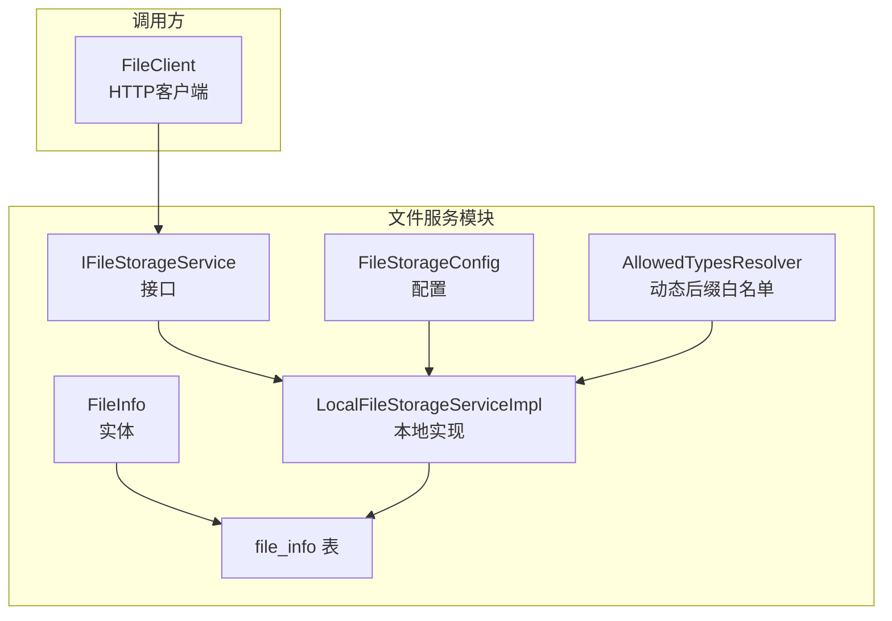
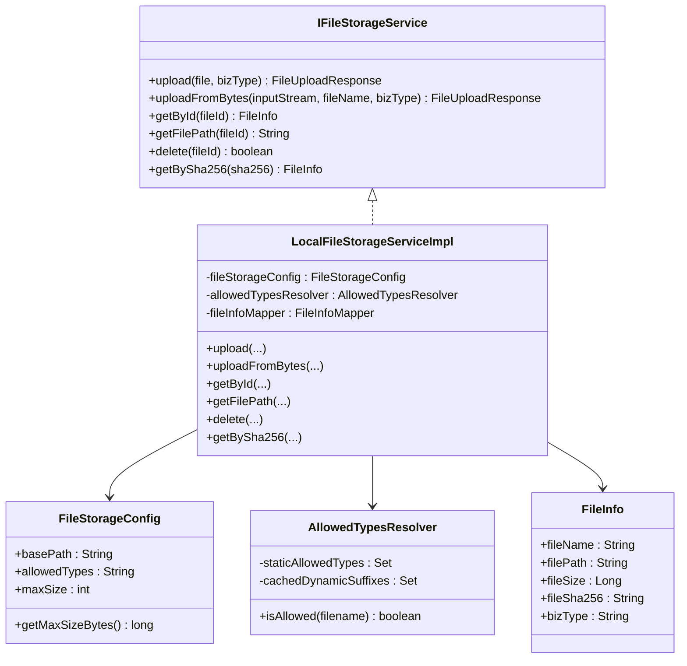
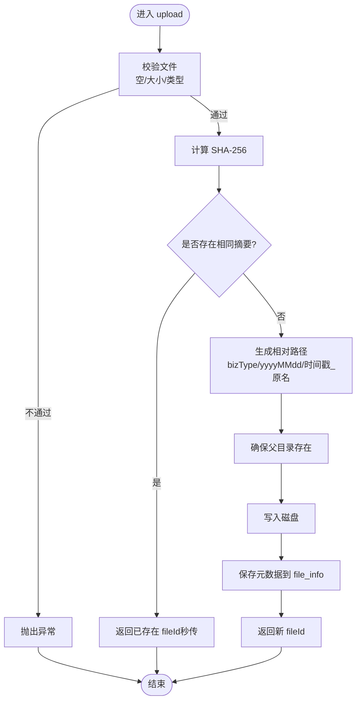
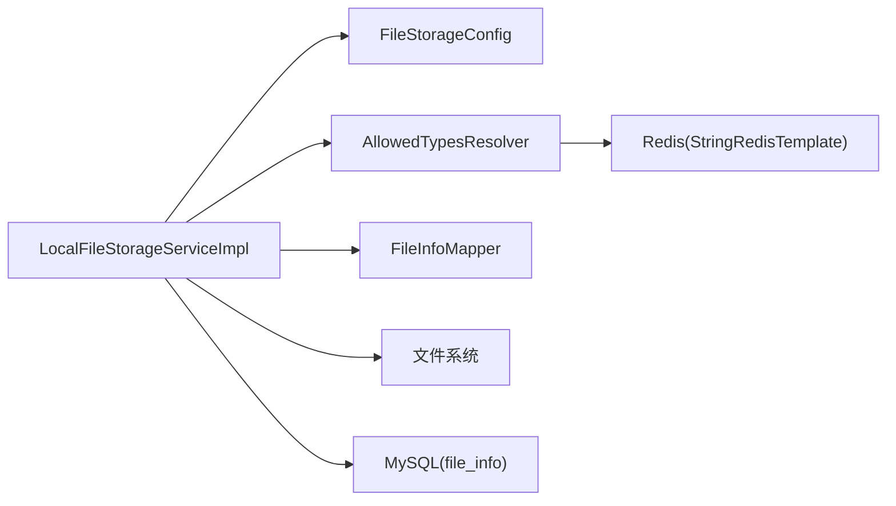

# 文件存储服务

<cite>
**本文引用的文件**
- [FILE_SERVICE_SPEC.md](file://docs/rules/FILE_SERVICE_SPEC.md)
- [IFileStorageService.java](file://ele-ai-tender-system/ele-ai-tender-file/src/main/java/com/jy/eleaitender/file/service/IFileStorageService.java)
- [LocalFileStorageServiceImpl.java](file://ele-ai-tender-system/ele-ai-tender-file/src/main/java/com/jy/eleaitender/file/service/impl/LocalFileStorageServiceImpl.java)
- [FileStorageConfig.java](file://ele-ai-tender-system/ele-ai-tender-file/src/main/java/com/jy/eleaitender/file/config/FileStorageConfig.java)
- [AllowedTypesResolver.java](file://ele-ai-tender-system/ele-ai-tender-file/src/main/java/com/jy/eleaitender/file/config/AllowedTypesResolver.java)
- [FileInfo.java](file://ele-ai-tender-system/ele-ai-tender-common/src/main/java/com/jy/eleaitender/common/entity/file/FileInfo.java)
- [init.sql](file://ele-ai-tender-system/ele-ai-tender-file/sql/init.sql)
- [FileClient.java](file://ele-ai-tender-system/ele-ai-tender-interaction/ele-ai-tender-interaction-core/src/main/java/com/jy/eleaitender/interaction/core/client/FileClient.java)
</cite>

## 目录
1. [简介](#简介)
2. [项目结构](#项目结构)
3. [核心组件](#核心组件)
4. [架构总览](#架构总览)
5. [详细组件分析](#详细组件分析)
6. [依赖关系分析](#依赖关系分析)
7. [性能与容量规划](#性能与容量规划)
8. [故障恢复与排障指南](#故障恢复与排障指南)
9. [扩展与自定义存储后端指南](#扩展与自定义存储后端指南)
10. [结论](#结论)

## 简介
本文件为“文件存储服务”的完整技术文档，聚焦于文件存储抽象层设计、本地存储实现细节、上传流程优化（含秒传）、元数据管理、版本关联与生命周期治理，以及性能调优、容量规划与故障恢复策略。同时提供扩展接口与自定义存储后端的开发指南，帮助读者快速理解并安全地扩展系统能力。

## 项目结构
文件服务位于 ele-ai-tender-file 模块，对外暴露统一文件能力（上传、下载、查询、删除），并通过内部客户端被其他模块调用。核心代码集中在 service 层与 config 层：
- 抽象接口 IFileStorageService：定义上传、按ID获取、路径解析、删除、按摘要查询等能力
- 本地实现 LocalFileStorageServiceImpl：基于磁盘文件系统落地，包含校验、路径生成、秒传逻辑
- 配置类 FileStorageConfig：集中管理存储根路径、允许类型、大小限制等
- 动态后缀白名单 AllowedTypesResolver：结合静态配置与 Redis 动态注册的后缀集合
- 实体 FileInfo 与数据库表 file_info：持久化文件元信息
- 外部调用方 FileClient：封装对文件服务的 HTTP 访问

图表来源
- [IFileStorageService.java:12-64](file://ele-ai-tender-system/ele-ai-tender-file/src/main/java/com/jy/eleaitender/file/service/IFileStorageService.java#L12-L64)
- [LocalFileStorageServiceImpl.java:31-95](file://ele-ai-tender-system/ele-ai-tender-file/src/main/java/com/jy/eleaitender/file/service/impl/LocalFileStorageServiceImpl.java#L31-L95)
- [FileStorageConfig.java:15-46](file://ele-ai-tender-system/ele-ai-tender-file/src/main/java/com/jy/eleaitender/file/config/FileStorageConfig.java#L15-L46)
- [AllowedTypesResolver.java:15-53](file://ele-ai-tender-system/ele-ai-tender-file/src/main/java/com/jy/eleaitender/file/config/AllowedTypesResolver.java#L15-L53)
- [FileInfo.java:12-34](file://ele-ai-tender-system/ele-ai-tender-common/src/main/java/com/jy/eleaitender/common/entity/file/FileInfo.java#L12-L34)
- [init.sql:27-35](file://ele-ai-tender-system/ele-ai-tender-file/sql/init.sql#L27-L35)
- [FileClient.java:55-81](file://ele-ai-tender-system/ele-ai-tender-interaction/ele-ai-tender-interaction-core/src/main/java/com/jy/eleaitender/interaction/core/client/FileClient.java#L55-L81)

章节来源
- [FILE_SERVICE_SPEC.md:1-18](file://docs/rules/FILE_SERVICE_SPEC.md#L1-L18)
- [FILE_SERVICE_SPEC.md:94-122](file://docs/rules/FILE_SERVICE_SPEC.md#L94-L122)

## 核心组件
- 抽象接口 IFileStorageService
  - 职责：定义上传（MultipartFile/字节流）、按ID获取、绝对路径解析、删除、按 SHA-256 查询（用于秒传）
  - 复杂度：O(1) 方法入口；具体实现中 IO 与哈希计算主导整体耗时
- 本地实现 LocalFileStorageServiceImpl
  - 职责：文件校验、SHA-256 计算、秒传判断、相对路径生成、落盘、元数据入库、删除（逻辑删除）
  - 关键优化：先算摘要再查库，命中则直接返回 fileId（秒传）
- 配置与白名单
  - FileStorageConfig：basePath、allowedTypes、maxSize
  - AllowedTypesResolver：静态白名单 + Redis 动态后缀缓存（TTL 5分钟）
- 元数据模型 FileInfo 与表 file_info
  - 字段：fileName、filePath、fileSize、fileSha256、bizType，继承基础审计字段
  - 索引：file_sha256、biz_type、create_time

章节来源
- [IFileStorageService.java:12-64](file://ele-ai-tender-system/ele-ai-tender-file/src/main/java/com/jy/eleaitender/file/service/IFileStorageService.java#L12-L64)
- [LocalFileStorageServiceImpl.java:45-95](file://ele-ai-tender-system/ele-ai-tender-file/src/main/java/com/jy/eleaitender/file/service/impl/LocalFileStorageServiceImpl.java#L45-L95)
- [FileStorageConfig.java:15-46](file://ele-ai-tender-system/ele-ai-tender-file/src/main/java/com/jy/eleaitender/file/config/FileStorageConfig.java#L15-L46)
- [AllowedTypesResolver.java:15-53](file://ele-ai-tender-system/ele-ai-tender-file/src/main/java/com/jy/eleaitender/file/config/AllowedTypesResolver.java#L15-L53)
- [FileInfo.java:12-34](file://ele-ai-tender-system/ele-ai-tender-common/src/main/java/com/jy/eleaitender/common/entity/file/FileInfo.java#L12-L34)
- [init.sql:27-35](file://ele-ai-tender-system/ele-ai-tender-file/sql/init.sql#L27-L35)

## 架构总览
文件服务采用“接口抽象 + 本地实现”的分层设计，便于后续接入对象存储或其他后端。当前默认使用本地磁盘存储，通过配置项 basePath 指定根目录，按 bizType 与日期分片组织文件。

图表来源
- [IFileStorageService.java:12-64](file://ele-ai-tender-system/ele-ai-tender-file/src/main/java/com/jy/eleaitender/file/service/IFileStorageService.java#L12-L64)
- [LocalFileStorageServiceImpl.java:31-95](file://ele-ai-tender-system/ele-ai-tender-file/src/main/java/com/jy/eleaitender/file/service/impl/LocalFileStorageServiceImpl.java#L31-L95)
- [FileStorageConfig.java:15-46](file://ele-ai-tender-system/ele-ai-tender-file/src/main/java/com/jy/eleaitender/file/config/FileStorageConfig.java#L15-L46)
- [AllowedTypesResolver.java:15-53](file://ele-ai-tender-system/ele-ai-tender-file/src/main/java/com/jy/eleaitender/file/config/AllowedTypesResolver.java#L15-L53)
- [FileInfo.java:12-34](file://ele-ai-tender-system/ele-ai-tender-common/src/main/java/com/jy/eleaitender/common/entity/file/FileInfo.java#L12-L34)

## 详细组件分析

### 本地文件存储实现（LocalFileStorageServiceImpl）
- 上传流程
  - 校验：空文件、空文件名、大小超限、类型不在白名单
  - 计算 SHA-256：优先在内存流上计算，避免二次 IO
  - 秒传：根据 sha256 查询已有记录，命中直接返回 fileId
  - 路径生成：bizType/yyyyMMdd/时间戳_原始文件名
  - 落盘与入库：确保父目录存在，写入文件，插入元数据
- 删除流程
  - 逻辑删除数据库记录（is_delete=1）
  - 物理文件删除可选（示例注释保留）
- 路径解析
  - 根据 fileId 查元数据，拼接 basePath 得到绝对路径
- 复杂度与瓶颈
  - 主要开销：SHA-256 计算（线性 O(n)）、磁盘 IO、数据库写入
  - 秒传可显著降低重复大文件的 IO 成本

图表来源
- [LocalFileStorageServiceImpl.java:45-95](file://ele-ai-tender-system/ele-ai-tender-file/src/main/java/com/jy/eleaitender/file/service/impl/LocalFileStorageServiceImpl.java#L45-L95)
- [LocalFileStorageServiceImpl.java:169-184](file://ele-ai-tender-system/ele-ai-tender-file/src/main/java/com/jy/eleaitender/file/service/impl/LocalFileStorageServiceImpl.java#L169-L184)
- [LocalFileStorageServiceImpl.java:159-166](file://ele-ai-tender-system/ele-ai-tender-file/src/main/java/com/jy/eleaitender/file/service/impl/LocalFileStorageServiceImpl.java#L159-L166)
- [LocalFileStorageServiceImpl.java:226-230](file://ele-ai-tender-system/ele-ai-tender-file/src/main/java/com/jy/eleaitender/file/service/impl/LocalFileStorageServiceImpl.java#L226-L230)

章节来源
- [LocalFileStorageServiceImpl.java:45-95](file://ele-ai-tender-system/ele-ai-tender-file/src/main/java/com/jy/eleaitender/file/service/impl/LocalFileStorageServiceImpl.java#L45-L95)
- [LocalFileStorageServiceImpl.java:169-184](file://ele-ai-tender-system/ele-ai-tender-file/src/main/java/com/jy/eleaitender/file/service/impl/LocalFileStorageServiceImpl.java#L169-L184)
- [LocalFileStorageServiceImpl.java:159-166](file://ele-ai-tender-system/ele-ai-tender-file/src/main/java/com/jy/eleaitender/file/service/impl/LocalFileStorageServiceImpl.java#L159-L166)
- [LocalFileStorageServiceImpl.java:226-230](file://ele-ai-tender-system/ele-ai-tender-file/src/main/java/com/jy/eleaitender/file/service/impl/LocalFileStorageServiceImpl.java#L226-L230)

### 配置与白名单机制
- FileStorageConfig
  - basePath：本地存储根目录
  - allowedTypes：逗号分隔的静态白名单
  - maxSize：最大文件大小（MB），并提供字节转换
- AllowedTypesResolver
  - 静态白名单匹配：以 .xxx 结尾判定
  - 动态后缀：从 Redis 集合读取，带 5 分钟 TTL 本地缓存
  - 降级策略：Redis 不可用时回退本地缓存

章节来源
- [FileStorageConfig.java:15-46](file://ele-ai-tender-system/ele-ai-tender-file/src/main/java/com/jy/eleaitender/file/config/FileStorageConfig.java#L15-L46)
- [AllowedTypesResolver.java:15-53](file://ele-ai-tender-system/ele-ai-tender-file/src/main/java/com/jy/eleaitender/file/config/AllowedTypesResolver.java#L15-L53)
- [AllowedTypesResolver.java:55-70](file://ele-ai-tender-system/ele-ai-tender-file/src/main/java/com/jy/eleaitender/file/config/AllowedTypesResolver.java#L55-L70)

### 元数据管理与索引
- 实体 FileInfo 映射 file_info 表
- 关键字段：fileName、filePath、fileSize、fileSha256、bizType
- 索引：file_sha256（秒传查询）、biz_type（业务分类）、create_time（时间范围查询）

章节来源
- [FileInfo.java:12-34](file://ele-ai-tender-system/ele-ai-tender-common/src/main/java/com/jy/eleaitender/common/entity/file/FileInfo.java#L12-L34)
- [init.sql:27-35](file://ele-ai-tender-system/ele-ai-tender-file/sql/init.sql#L27-L35)

### 外部调用与下载
- FileClient 封装了 /api/file/info/{fileId} 与 /api/file/download/{fileId} 的调用
- 下载时设置 Accept: application/octet-stream，返回二进制流

章节来源
- [FileClient.java:55-81](file://ele-ai-tender-system/ele-ai-tender-interaction/ele-ai-tender-interaction-core/src/main/java/com/jy/eleaitender/interaction/core/client/FileClient.java#L55-L81)

## 依赖关系分析
- 耦合度
  - LocalFileStorageServiceImpl 依赖 FileStorageConfig、AllowedTypesResolver、FileInfoMapper
  - AllowedTypesResolver 依赖 Redis（StringRedisTemplate）
- 外部依赖
  - 文件系统 IO、Hutool 工具集、Apache Commons Lang
  - MyBatis-Plus 进行元数据持久化
- 潜在循环依赖
  - 当前无循环依赖迹象

图表来源
- [LocalFileStorageServiceImpl.java:31-42](file://ele-ai-tender-system/ele-ai-tender-file/src/main/java/com/jy/eleaitender/file/service/impl/LocalFileStorageServiceImpl.java#L31-L42)
- [AllowedTypesResolver.java:15-31](file://ele-ai-tender-system/ele-ai-tender-file/src/main/java/com/jy/eleaitender/file/config/AllowedTypesResolver.java#L15-L31)

章节来源
- [LocalFileStorageServiceImpl.java:31-42](file://ele-ai-tender-system/ele-ai-tender-file/src/main/java/com/jy/eleaitender/file/service/impl/LocalFileStorageServiceImpl.java#L31-L42)
- [AllowedTypesResolver.java:15-31](file://ele-ai-tender-system/ele-ai-tender-file/src/main/java/com/jy/eleaitender/file/config/AllowedTypesResolver.java#L15-L31)

## 性能与容量规划
- 上传性能
  - 建议开启异步或线程池处理大文件上传，避免阻塞主线程
  - 利用秒传减少重复 IO 与哈希计算
- 哈希计算
  - 当前在内存流上计算 SHA-256，适合中小文件；超大文件建议分块计算以降低内存峰值
- 目录结构与扩容
  - 按 bizType + yyyyMMdd 分片，单目录文件数可控
  - 当单目录文件过多时，可增加二级子目录（如按 hash 前缀）提升文件系统遍历效率
- 容量规划
  - 评估日均上传量、平均文件大小、保留周期
  - 预留 30%~50% 冗余空间，监控磁盘使用率告警阈值（如 80%）
- 并发与队列
  - 结合系统全局线程池参数控制任务并发与排队上限，避免资源争用

[本节为通用指导，无需特定源码引用]

## 故障恢复与排障指南
- 上传失败
  - 检查文件扩展名是否在白名单内、是否超过 maxSize、basePath 目录是否有写权限
- 下载 404
  - 确认 file_info.file_path 对应文件在磁盘实际存在，检查 basePath 配置
- SHA-256 校验不一致
  - 确认调用方与服务端计算方式一致（十六进制字符串、UTF-8 编码）
- 删除与清理
  - 删除为逻辑删除，如需回收磁盘空间需额外清理物理文件
  - 参考清理脚本中对孤立文件的识别与清理思路（跨表外键为空且未被任何业务引用）

章节来源
- [FILE_SERVICE_SPEC.md:139-147](file://docs/rules/FILE_SERVICE_SPEC.md#L139-L147)
- [cleanup-test-data-mysql.sql:148-167](file://docs/guides/cleanup-test-data-mysql.sql#L148-L167)

## 扩展与自定义存储后端指南
- 新增存储后端步骤
  - 实现 IFileStorageService 接口，提供 upload、uploadFromBytes、getById、getFilePath、delete、getBySha256 等方法
  - 将实现类注册为 Spring Bean，并通过条件装配选择启用（例如基于配置开关）
  - 若使用对象存储，注意：
    - 路径生成策略与本地保持一致（bizType/yyyyMMdd/时间戳_原名）
    - 支持断点续传与大文件分片上传（服务端侧可通过 Redis 记录分片状态，客户端分片上传）
    - 下载直链或签名 URL 策略
- 断点续传与分片上传（建议方案）
  - 初始化分片：POST /api/file/init-chunked?fileId=...&totalChunks=...
  - 上传分片：POST /api/file/upload-chunk?fileId=...&chunkIndex=...
  - 合并分片：POST /api/file/merge-chunks?fileId=...
  - 状态查询：GET /api/file/chunk-status?fileId=...
  - 失败重试：客户端根据 chunk-status 仅重传缺失分片
- 大文件处理优化
  - 服务端侧：分块接收、边收边写、流式哈希、失败自动重试
  - 客户端侧：并发分片上传、限速与退避、进度上报
- 版本控制与生命周期
  - 版本控制：可在上层业务表（如 main_version/plugin_version）关联 fileId，形成版本快照
  - 生命周期：结合定时任务清理长期未引用的文件（参考清理脚本中的外键为空判断）

[本节为概念性扩展指南，无需特定源码引用]

## 结论
当前文件服务以本地磁盘为默认存储，具备完善的元数据管理、秒传能力与灵活的白名单机制。通过接口抽象，未来可平滑切换至对象存储并扩展分片上传、断点续传、版本控制与生命周期管理等高级特性。配合合理的容量规划与排障策略，可保障高可用与高性能的文件服务能力。