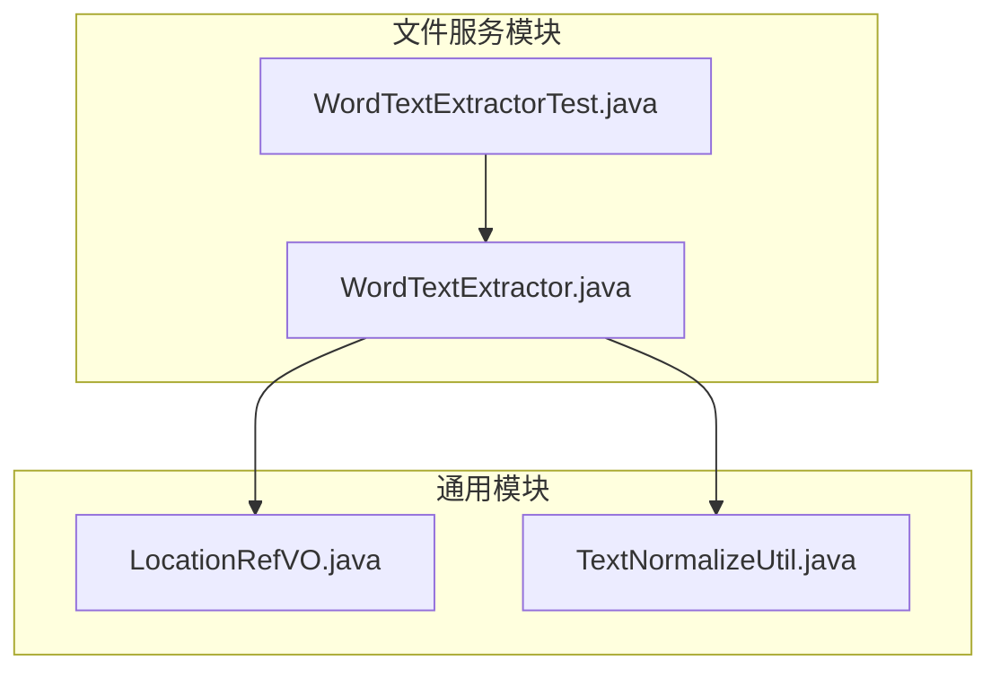
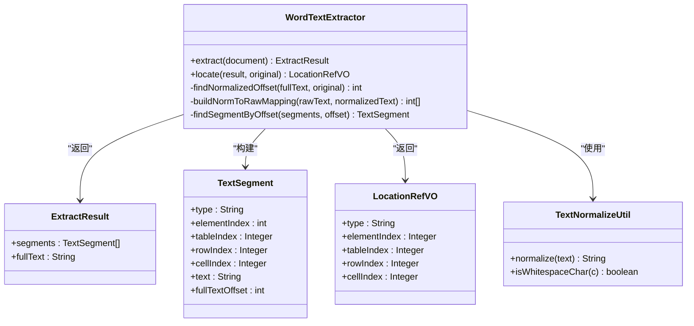
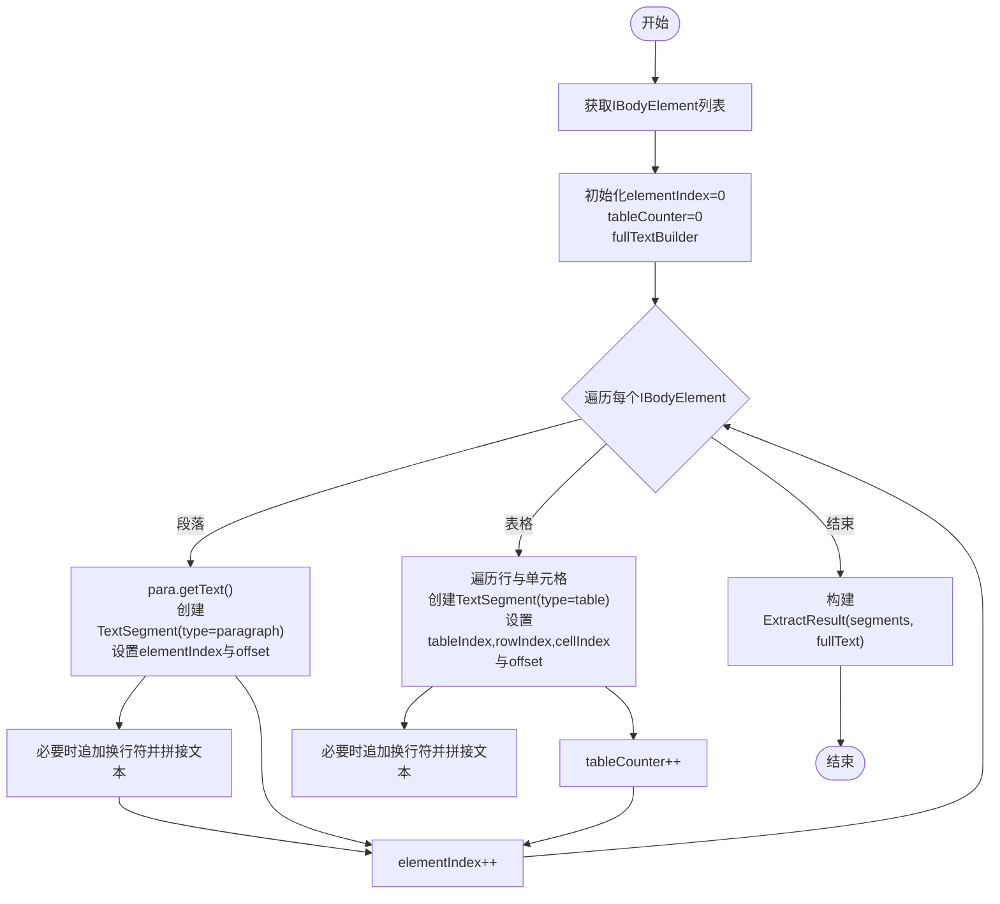
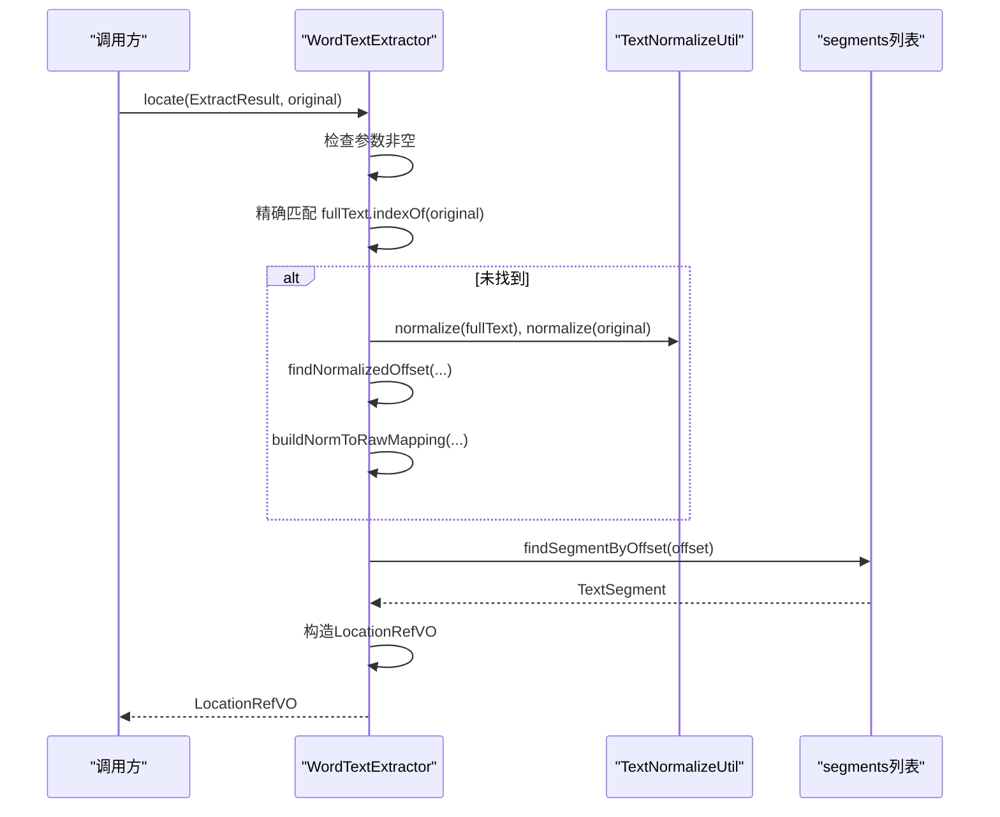
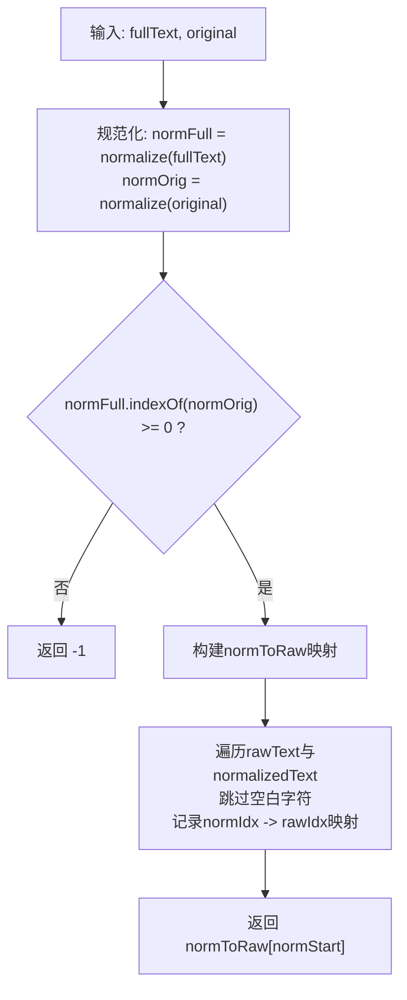
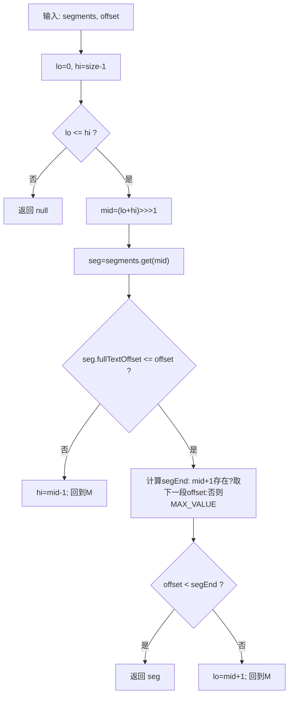
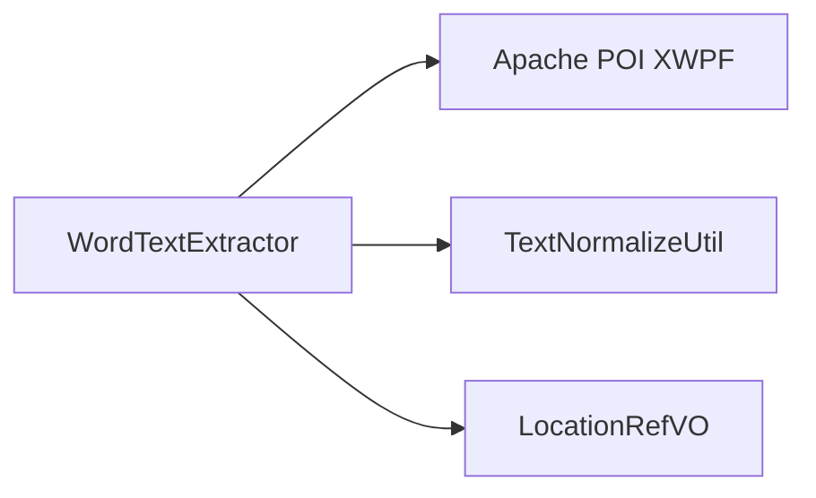

# Word文本提取器

<cite>
**本文引用的文件**
- [WordTextExtractor.java](file://ele-ai-tender-system/ele-ai-tender-file/src/main/java/com/jy/eleaitender/file/engine/WordTextExtractor.java)
- [LocationRefVO.java](file://ele-ai-tender-system/ele-ai-tender-common/src/main/java/com/jy/eleaitender/common/dto/LocationRefVO.java)
- [TextNormalizeUtil.java](file://ele-ai-tender-system/ele-ai-tender-common/src/main/java/com/jy/eleaitender/common/util/TextNormalizeUtil.java)
- [WordTextExtractorTest.java](file://ele-ai-tender-system/ele-ai-tender-file/src/test/java/com/jy/eleaitender/file/engine/WordTextExtractorTest.java)
</cite>

## 目录
1. [简介](#简介)
2. [项目结构](#项目结构)
3. [核心组件](#核心组件)
4. [架构总览](#架构总览)
5. [详细组件分析](#详细组件分析)
6. [依赖关系分析](#依赖关系分析)
7. [性能考量](#性能考量)
8. [故障排查指南](#故障排查指南)
9. [结论](#结论)
10. [附录](#附录)

## 简介
本技术文档聚焦于Word文本提取器的实现与使用，围绕段落和表格的文本提取算法、IBodyElement遍历机制、XWPFParagraph与XWPFTable处理逻辑、全文构建策略与偏移量计算、定位算法（精确匹配与规范化匹配）、位置映射构建与二分查找优化等关键主题进行深入说明。同时提供异常处理建议与性能优化指导，帮助读者快速理解并高效使用该模块。

## 项目结构
该功能位于文件服务模块中，核心类为WordTextExtractor，配套的数据对象LocationRefVO与文本规范化工具TextNormalizeUtil位于通用模块。测试用例覆盖基本提取与定位场景。

图表来源
- [WordTextExtractor.java:1-202](file://ele-ai-tender-system/ele-ai-tender-file/src/main/java/com/jy/eleaitender/file/engine/WordTextExtractor.java#L1-L202)
- [LocationRefVO.java:1-27](file://ele-ai-tender-system/ele-ai-tender-common/src/main/java/com/jy/eleaitender/common/dto/LocationRefVO.java#L1-L27)
- [TextNormalizeUtil.java:1-27](file://ele-ai-tender-system/ele-ai-tender-common/src/main/java/com/jy/eleaitender/common/util/TextNormalizeUtil.java#L1-L27)
- [WordTextExtractorTest.java:1-131](file://ele-ai-tender-system/ele-ai-tender-file/src/test/java/com/jy/eleaitender/file/engine/WordTextExtractorTest.java#L1-L131)

章节来源
- [WordTextExtractor.java:1-202](file://ele-ai-tender-system/ele-ai-tender-file/src/main/java/com/jy/eleaitender/file/engine/WordTextExtractor.java#L1-L202)
- [LocationRefVO.java:1-27](file://ele-ai-tender-system/ele-ai-tender-common/src/main/java/com/jy/eleaitender/common/dto/LocationRefVO.java#L1-L27)
- [TextNormalizeUtil.java:1-27](file://ele-ai-tender-system/ele-ai-tender-common/src/main/java/com/jy/eleaitender/common/util/TextNormalizeUtil.java#L1-L27)
- [WordTextExtractorTest.java:1-131](file://ele-ai-tender-system/ele-ai-tender-file/src/test/java/com/jy/eleaitender/file/engine/WordTextExtractorTest.java#L1-L131)

## 核心组件
- WordTextExtractor：负责从XWPFDocument中提取段落与表格文本，构建全文与分段索引，并提供基于偏移量的定位能力。
- TextSegment：内部数据结构，描述一个文本片段及其在全文中的偏移量，以及所属元素类型与行列信息。
- ExtractResult：提取结果封装，包含分段列表与完整文本。
- LocationRefVO：对外输出的位置引用对象，用于前端或上层系统精确定位到段落或表格单元格。
- TextNormalizeUtil：文本规范化工具，提供空白字符移除与判断方法，支撑规范化匹配。

章节来源
- [WordTextExtractor.java:17-32](file://ele-ai-tender-system/ele-ai-tender-file/src/main/java/com/jy/eleaitender/file/engine/WordTextExtractor.java#L17-L32)
- [WordTextExtractor.java:37-95](file://ele-ai-tender-system/ele-ai-tender-file/src/main/java/com/jy/eleaitender/file/engine/WordTextExtractor.java#L37-L95)
- [LocationRefVO.java:1-27](file://ele-ai-tender-system/ele-ai-tender-common/src/main/java/com/jy/eleaitender/common/dto/LocationRefVO.java#L1-L27)
- [TextNormalizeUtil.java:1-27](file://ele-ai-tender-system/ele-ai-tender-common/src/main/java/com/jy/eleaitender/common/util/TextNormalizeUtil.java#L1-L27)

## 架构总览
WordTextExtractor作为独立工具类，不依赖外部业务服务，仅通过Apache POI提供的XWPFDocument接口访问Word文档结构，并通过通用工具进行文本规范化处理。其输出供检测引擎或前端高亮使用。

图表来源
- [WordTextExtractor.java:17-32](file://ele-ai-tender-system/ele-ai-tender-file/src/main/java/com/jy/eleaitender/file/engine/WordTextExtractor.java#L17-L32)
- [WordTextExtractor.java:37-95](file://ele-ai-tender-system/ele-ai-tender-file/src/main/java/com/jy/eleaitender/file/engine/WordTextExtractor.java#L37-L95)
- [WordTextExtractor.java:105-140](file://ele-ai-tender-system/ele-ai-tender-file/src/main/java/com/jy/eleaitender/file/engine/WordTextExtractor.java#L105-L140)
- [WordTextExtractor.java:145-176](file://ele-ai-tender-system/ele-ai-tender-file/src/main/java/com/jy/eleaitender/file/engine/WordTextExtractor.java#L145-L176)
- [WordTextExtractor.java:181-200](file://ele-ai-tender-system/ele-ai-tender-file/src/main/java/com/jy/eleaitender/file/engine/WordTextExtractor.java#L181-L200)
- [LocationRefVO.java:1-27](file://ele-ai-tender-system/ele-ai-tender-common/src/main/java/com/jy/eleaitender/common/dto/LocationRefVO.java#L1-L27)
- [TextNormalizeUtil.java:1-27](file://ele-ai-tender-system/ele-ai-tender-common/src/main/java/com/jy/eleaitender/common/util/TextNormalizeUtil.java#L1-L27)

## 详细组件分析

### IBodyElement遍历与全文构建策略
- 遍历机制：通过document.getBodyElements()获取所有顶层元素，按顺序迭代，维护elementIndex以标识每个IBodyElement的序号。
- 段落处理：当元素为XWPFParagraph时，直接获取段落文本，构造TextSegment，记录类型为“paragraph”，设置elementIndex与当前fullTextBuilder长度作为fullTextOffset；随后根据是否需要分隔符追加换行符，再拼接段落文本至fullTextBuilder。
- 表格处理：当元素为XWPFTable时，逐行逐单元格遍历，对每个单元格文本构造TextSegment，类型为“table”，并记录tableIndex、rowIndex、cellIndex；同样维护fullTextOffset并在必要时追加换行符后拼接单元格文本。
- 表格计数：每遇到一个表格，tableCounter自增，确保不同表格的序号唯一。
- 全文构建：全篇文本由段落与表格单元格的文本按遍历顺序拼接而成，段间与单元格间以换行符分隔，保证后续偏移量可逆映射。

章节来源
- [WordTextExtractor.java:42-95](file://ele-ai-tender-system/ele-ai-tender-file/src/main/java/com/jy/eleaitender/file/engine/WordTextExtractor.java#L42-L95)

#### 流程图：提取与全文构建

图表来源
- [WordTextExtractor.java:42-95](file://ele-ai-tender-system/ele-ai-tender-file/src/main/java/com/jy/eleaitender/file/engine/WordTextExtractor.java#L42-L95)

### 文本定位算法与分级匹配策略
- 入口方法locate接收ExtractResult与待定位原文original，首先进行空值校验。
- 第一级：精确匹配。直接在fullText中使用indexOf(original)寻找首次出现位置，若找到则进入偏移转段落的步骤。
- 第二级：规范化匹配。若精确匹配失败，调用findNormalizedOffset进行规范化匹配：
  - 使用TextNormalizeUtil.normalize分别对fullText与original去除空白字符（包括普通空白、不间断空格U+00A0、全角空格U+3000）。
  - 在规范化后的字符串中查找子串起始位置normStart。
  - 构建normToRaw映射数组，将规范化文本的索引映射回原始文本的起始位置，从而得到原始文本中的实际偏移量。
- 偏移转段落：通过二分查找findSegmentByOffset在segments列表中定位包含该偏移量的TextSegment。
- 结果构造：根据目标TextSegment的类型填充LocationRefVO字段，段落类型仅含type与elementIndex；表格类型额外包含tableIndex、rowIndex、cellIndex。

章节来源
- [WordTextExtractor.java:105-140](file://ele-ai-tender-system/ele-ai-tender-file/src/main/java/com/jy/eleaitender/file/engine/WordTextExtractor.java#L105-L140)
- [WordTextExtractor.java:145-176](file://ele-ai-tender-system/ele-ai-tender-file/src/main/java/com/jy/eleaitender/file/engine/WordTextExtractor.java#L145-L176)
- [WordTextExtractor.java:181-200](file://ele-ai-tender-system/ele-ai-tender-file/src/main/java/com/jy/eleaitender/file/engine/WordTextExtractor.java#L181-L200)
- [LocationRefVO.java:1-27](file://ele-ai-tender-system/ele-ai-tender-common/src/main/java/com/jy/eleaitender/common/dto/LocationRefVO.java#L1-L27)
- [TextNormalizeUtil.java:1-27](file://ele-ai-tender-system/ele-ai-tender-common/src/main/java/com/jy/eleaitender/common/util/TextNormalizeUtil.java#L1-L27)

#### 序列图：定位流程

图表来源
- [WordTextExtractor.java:105-140](file://ele-ai-tender-system/ele-ai-tender-file/src/main/java/com/jy/eleaitender/file/engine/WordTextExtractor.java#L105-L140)
- [WordTextExtractor.java:145-176](file://ele-ai-tender-system/ele-ai-tender-file/src/main/java/com/jy/eleaitender/file/engine/WordTextExtractor.java#L145-L176)
- [WordTextExtractor.java:181-200](file://ele-ai-tender-system/ele-ai-tender-file/src/main/java/com/jy/eleaitender/file/engine/WordTextExtractor.java#L181-L200)

#### 流程图：规范化匹配与映射构建

图表来源
- [WordTextExtractor.java:145-176](file://ele-ai-tender-system/ele-ai-tender-file/src/main/java/com/jy/eleaitender/file/engine/WordTextExtractor.java#L145-L176)
- [TextNormalizeUtil.java:15-27](file://ele-ai-tender-system/ele-ai-tender-common/src/main/java/com/jy/eleaitender/common/util/TextNormalizeUtil.java#L15-L27)

#### 流程图：二分查找定位段落

图表来源
- [WordTextExtractor.java:181-200](file://ele-ai-tender-system/ele-ai-tender-file/src/main/java/com/jy/eleaitender/file/engine/WordTextExtractor.java#L181-L200)

### 数据模型与字段语义
- TextSegment字段：
  - type：元素类型，“paragraph”或“table”。
  - elementIndex：IBodyElement在文档顶层的序号，段落与表格共享。
  - tableIndex：表格在文档中的序号（仅table类型有效）。
  - rowIndex：表格内行号（仅table类型有效）。
  - cellIndex：表格内列号（仅table类型有效）。
  - text：该段或单元格的文本内容。
  - fullTextOffset：该段或单元格文本在fullText中的起始偏移量。
- LocationRefVO字段：
  - type：位置类型，“paragraph”或“table”。
  - elementIndex：对应IBodyElement序号。
  - tableIndex、rowIndex、cellIndex：仅在table类型时有效。

章节来源
- [WordTextExtractor.java:23-32](file://ele-ai-tender-system/ele-ai-tender-file/src/main/java/com/jy/eleaitender/file/engine/WordTextExtractor.java#L23-L32)
- [LocationRefVO.java:1-27](file://ele-ai-tender-system/ele-ai-tender-common/src/main/java/com/jy/eleaitender/common/dto/LocationRefVO.java#L1-L27)

### 单元测试与行为验证
- 单段落与多段落提取：验证segments数量、类型、elementIndex与fullText拼接是否正确。
- 含表格提取：验证段落与表格单元格的混合顺序、表格序号与行列定位字段是否准确。
- 空文档提取：验证结果为空segments与空fullText。
- 精确匹配定位：验证能正确返回目标段落的LocationRefVO。
- 规范化匹配定位：验证在存在多余空白字符的情况下仍能定位到目标段落。
- 匹配失败：验证返回null。

章节来源
- [WordTextExtractorTest.java:27-90](file://ele-ai-tender-system/ele-ai-tender-file/src/test/java/com/jy/eleaitender/file/engine/WordTextExtractorTest.java#L27-L90)
- [WordTextExtractorTest.java:96-129](file://ele-ai-tender-system/ele-ai-tender-file/src/test/java/com/jy/eleaitender/file/engine/WordTextExtractorTest.java#L96-L129)

## 依赖关系分析
- Apache POI XWPF：通过XWPFDocument、IBodyElement、XWPFParagraph、XWPFTable、XWPFTableRow、XWPFTableCell访问文档结构与文本。
- 通用工具TextNormalizeUtil：提供文本规范化与空白字符判断，避免正则重复定义，提升复用性与一致性。
- 通用DTO LocationRefVO：统一位置引用结构，便于跨模块传递与序列化。

图表来源
- [WordTextExtractor.java:1-202](file://ele-ai-tender-system/ele-ai-tender-file/src/main/java/com/jy/eleaitender/file/engine/WordTextExtractor.java#L1-L202)
- [TextNormalizeUtil.java:1-27](file://ele-ai-tender-system/ele-ai-tender-common/src/main/java/com/jy/eleaitender/common/util/TextNormalizeUtil.java#L1-L27)
- [LocationRefVO.java:1-27](file://ele-ai-tender-system/ele-ai-tender-common/src/main/java/com/jy/eleaitender/common/dto/LocationRefVO.java#L1-L27)

章节来源
- [WordTextExtractor.java:1-202](file://ele-ai-tender-system/ele-ai-tender-file/src/main/java/com/jy/eleaitender/file/engine/WordTextExtractor.java#L1-L202)
- [TextNormalizeUtil.java:1-27](file://ele-ai-tender-system/ele-ai-tender-common/src/main/java/com/jy/eleaitender/common/util/TextNormalizeUtil.java#L1-L27)
- [LocationRefVO.java:1-27](file://ele-ai-tender-system/ele-ai-tender-common/src/main/java/com/jy/eleaitender/common/dto/LocationRefVO.java#L1-L27)

## 性能考量
- 时间复杂度：
  - extract：O(N + M)，N为IBodyElement数量，M为表格单元格总数；每次插入TextSegment与拼接StringBuilder近似线性。
  - locate：
    - 精确匹配：O(F)，F为fullText长度。
    - 规范化匹配：O(F + O)，O为original长度；构建normToRaw映射为O(F)。
    - 二分查找：O(log S)，S为segments数量。
- 空间复杂度：
  - ExtractResult：O(S + F)，S为segments数量，F为fullText长度。
  - 规范化映射：O(F)。
- 优化建议：
  - 大文档分块处理：若文档极大，可考虑流式读取并按页或按区域分批构建segments，降低内存峰值。
  - 缓存规范化结果：对频繁查询的original进行规范化缓存，减少重复计算。
  - 预分配容量：StringBuilder初始容量可按预估全文大小设置，减少扩容开销。
  - 避免不必要的换行符：对于空文本段落或单元格，可跳过换行符拼接，减少fullText膨胀。
  - 二分查找边界条件：确保segments按fullTextOffset严格递增，避免越界与死循环。

[本节为通用性能讨论，无需特定文件来源]

## 故障排查指南
- 常见错误与处理：
  - 空输入：locate对null或空original直接返回null，避免异常。
  - 无匹配：精确与规范化均失败时返回null，调用方需做好空值分支处理。
  - 表格为空：表格行或单元格为空文本时，仍会生成TextSegment，但text为空，fullTextOffset连续递增，不影响定位。
  - 空白字符差异：规范化匹配忽略普通空白、不间断空格与全角空格，若仍有匹配问题，检查源文本是否包含其他不可见字符。
- 调试建议：
  - 打印fullText与segments的offset分布，确认拼接顺序与换行符插入是否符合预期。
  - 在规范化匹配路径增加日志，记录normStart与normToRaw映射的关键点，辅助定位映射偏差。
  - 针对大文档，抽样检查segments数量与fullText长度，评估内存占用。

章节来源
- [WordTextExtractor.java:105-140](file://ele-ai-tender-system/ele-ai-tender-file/src/main/java/com/jy/eleaitender/file/engine/WordTextExtractor.java#L105-L140)
- [WordTextExtractor.java:145-176](file://ele-ai-tender-system/ele-ai-tender-file/src/main/java/com/jy/eleaitender/file/engine/WordTextExtractor.java#L145-L176)
- [WordTextExtractor.java:181-200](file://ele-ai-tender-system/ele-ai-tender-file/src/main/java/com/jy/eleaitender/file/engine/WordTextExtractor.java#L181-L200)

## 结论
WordTextExtractor以简洁清晰的遍历与构建策略实现了段落与表格的文本提取与定位能力。通过两级匹配策略与二分查找优化，在保证准确率的同时兼顾了性能。配合通用工具与数据对象，模块具备良好的可复用性与扩展性。建议在大规模文档场景下结合分块与缓存策略进一步优化资源消耗。

[本节为总结性内容，无需特定文件来源]

## 附录
- 术语说明：
  - IBodyElement：Word文档顶层元素的抽象接口，段落与表格均实现该接口。
  - XWPFParagraph：段落对象，提供getText方法获取文本。
  - XWPFTable/XWPFTableRow/XWPFTableCell：表格、行、单元格对象，支持逐行逐单元格遍历与文本获取。
  - 规范化匹配：在忽略空白字符的前提下进行子串匹配，提高鲁棒性。
  - 二分查找：在有序列表中快速定位包含指定偏移量的分段。

[本节为概念性说明，无需特定文件来源]