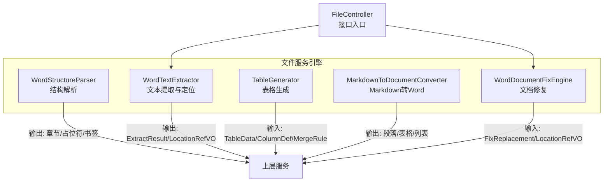
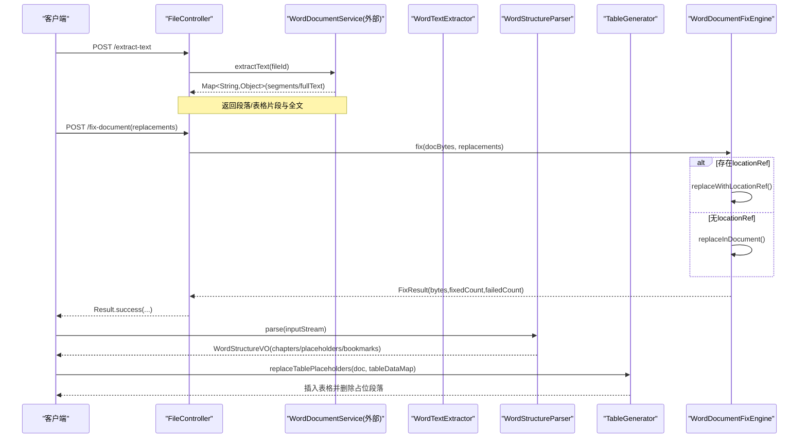
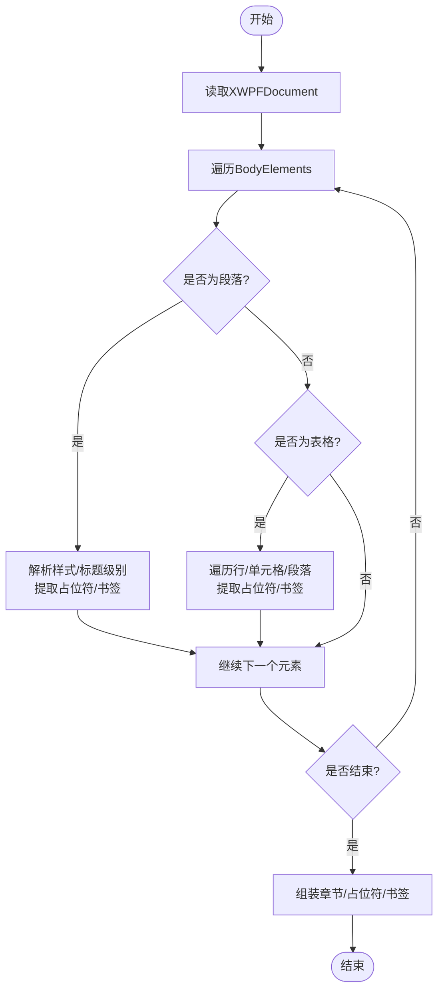
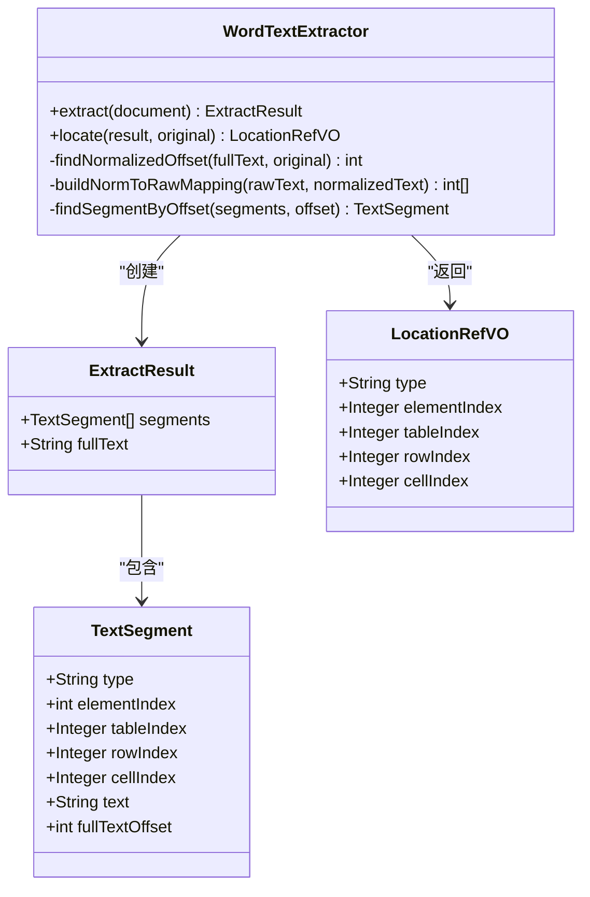
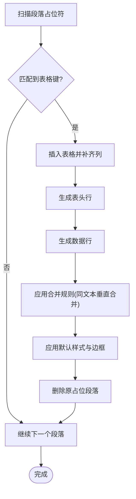
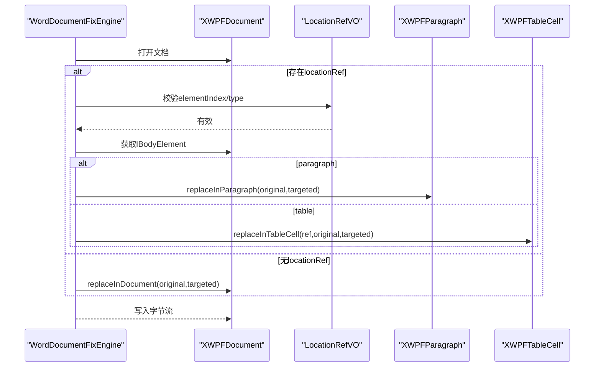
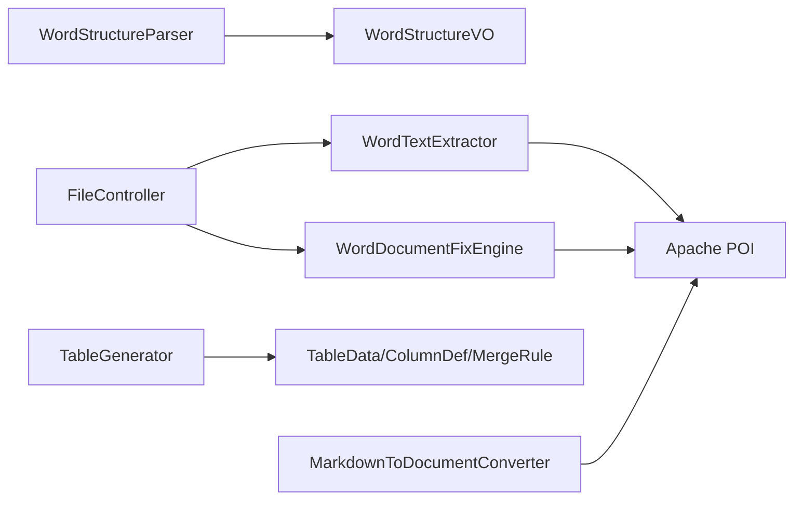

# Word结构解析器

<cite>
**本文引用的文件**   
- [WordStructureParser.java](file://ele-ai-tender-system/ele-ai-tender-file/src/main/java/com/jy/eleaitender/file/engine/WordStructureParser.java)
- [WordTextExtractor.java](file://ele-ai-tender-system/ele-ai-tender-file/src/main/java/com/jy/eleaitender/file/engine/WordTextExtractor.java)
- [TableGenerator.java](file://ele-ai-tender-system/ele-ai-tender-file/src/main/java/com/jy/eleaitender/file/engine/TableGenerator.java)
- [MarkdownToDocumentConverter.java](file://ele-ai-tender-system/ele-ai-tender-file/src/main/java/com/jy/eleaitender/file/engine/MarkdownToDocumentConverter.java)
- [WordDocumentFixEngine.java](file://ele-ai-tender-system/ele-ai-tender-file/src/main/java/com/jy/eleaitender/file/engine/WordDocumentFixEngine.java)
- [FileController.java](file://ele-ai-tender-system/ele-ai-tender-file/src/main/java/com/jy/eleaitender/file/controller/FileController.java)
- [WordTextExtractorTest.java](file://ele-ai-tender-system/ele-ai-tender-file/src/test/java/com/jy/eleaitender/file/engine/WordTextExtractorTest.java)
- [WordDocumentFixEngineTest.java](file://ele-ai-tender-system/ele-ai-tender-file/src/test/java/com/jy/eleaitender/file/engine/WordDocumentFixEngineTest.java)
</cite>

## 目录
1. [简介](#简介)
2. [项目结构](#项目结构)
3. [核心组件](#核心组件)
4. [架构总览](#架构总览)
5. [详细组件分析](#详细组件分析)
6. [依赖关系分析](#依赖关系分析)
7. [性能考量](#性能考量)
8. [故障排查指南](#故障排查指南)
9. [结论](#结论)
10. [附录](#附录)

## 简介
本技术文档围绕“Word结构解析器”展开，聚焦以下目标：
- 文档层次结构分析算法：文档树遍历、节点关系识别与样式信息提取。
- 段落层级结构构建：标题级别识别、列表项检测与嵌套处理（在生成侧）。
- 表格结构解析与生成：表头识别、合并单元格处理与跨行数据关联。
- 图片与其他嵌入对象的定位机制说明与现状评估。
- 结构数据的标准化输出格式与验证规则。
- 复杂文档场景的处理方案与错误恢复策略。

## 项目结构
本项目中，Word结构解析相关能力集中在文件服务模块的引擎层，主要包含：
- 结构解析：章节、占位符、书签等元信息的抽取。
- 文本提取与定位：段落级文本与位置索引，支持规范化匹配定位。
- 表格生成：基于占位符替换生成表格，支持列定义、表头、合并与默认样式。
- 文档修复：基于位置引用或全文匹配的文本替换。
- Markdown到Word转换：列表、表格等结构的渲染与对齐。

图表来源
- [WordStructureParser.java:1-131](file://ele-ai-tender-system/ele-ai-tender-file/src/main/java/com/jy/eleaitender/file/engine/WordStructureParser.java#L1-L131)
- [WordTextExtractor.java:1-202](file://ele-ai-tender-system/ele-ai-tender-file/src/main/java/com/jy/eleaitender/file/engine/WordTextExtractor.java#L1-L202)
- [TableGenerator.java:1-287](file://ele-ai-tender-system/ele-ai-tender-file/src/main/java/com/jy/eleaitender/file/engine/TableGenerator.java#L1-L287)
- [MarkdownToDocumentConverter.java:270-304](file://ele-ai-tender-system/ele-ai-tender-file/src/main/java/com/jy/eleaitender/file/engine/MarkdownToDocumentConverter.java#L270-L304)
- [MarkdownToDocumentConverter.java:392-411](file://ele-ai-tender-system/ele-ai-tender-file/src/main/java/com/jy/eleaitender/file/engine/MarkdownToDocumentConverter.java#L392-L411)
- [WordDocumentFixEngine.java:1-252](file://ele-ai-tender-system/ele-ai-tender-file/src/main/java/com/jy/eleaitender/file/engine/WordDocumentFixEngine.java#L1-L252)
- [FileController.java:157-176](file://ele-ai-tender-system/ele-ai-tender-file/src/main/java/com/jy/eleaitender/file/controller/FileController.java#L157-L176)

章节来源
- [WordStructureParser.java:1-131](file://ele-ai-tender-system/ele-ai-tender-file/src/main/java/com/jy/eleaitender/file/engine/WordStructureParser.java#L1-L131)
- [WordTextExtractor.java:1-202](file://ele-ai-tender-system/ele-ai-tender-file/src/main/java/com/jy/eleaitender/file/engine/WordTextExtractor.java#L1-L202)
- [TableGenerator.java:1-287](file://ele-ai-tender-system/ele-ai-tender-file/src/main/java/com/jy/eleaitender/file/engine/TableGenerator.java#L1-L287)
- [MarkdownToDocumentConverter.java:270-304](file://ele-ai-tender-system/ele-ai-tender-file/src/main/java/com/jy/eleaitender/file/engine/MarkdownToDocumentConverter.java#L270-L304)
- [MarkdownToDocumentConverter.java:392-411](file://ele-ai-tender-system/ele-ai-tender-file/src/main/java/com/jy/eleaitender/file/engine/MarkdownToDocumentConverter.java#L392-L411)
- [WordDocumentFixEngine.java:1-252](file://ele-ai-tender-system/ele-ai-tender-file/src/main/java/com/jy/eleaitender/file/engine/WordDocumentFixEngine.java#L1-L252)
- [FileController.java:157-176](file://ele-ai-tender-system/ele-ai-tender-file/src/main/java/com/jy/eleaitender/file/controller/FileController.java#L157-L176)

## 核心组件
- 结构解析器：负责遍历文档体元素，识别标题样式、提取占位符与书签，并聚合为结构化结果。
- 文本提取器：将段落与表格内容扁平化为片段序列，维护全局文本偏移量，提供精确与规范化匹配的定位能力。
- 表格生成器：扫描占位符段落，按列定义生成表头与数据行，支持按相同文本进行垂直合并，应用默认样式与边框。
- Markdown转换器：将Markdown中的列表与表格转换为Word结构，保证列数对齐与分隔行跳过。
- 文档修复引擎：优先使用位置引用定位替换，否则回退到全文档匹配；支持规范化匹配以容忍空白差异。

章节来源
- [WordStructureParser.java:37-59](file://ele-ai-tender-system/ele-ai-tender-file/src/main/java/com/jy/eleaitender/file/engine/WordStructureParser.java#L37-L59)
- [WordTextExtractor.java:37-95](file://ele-ai-tender-system/ele-ai-tender-file/src/main/java/com/jy/eleaitender/file/engine/WordTextExtractor.java#L37-L95)
- [TableGenerator.java:31-53](file://ele-ai-tender-system/ele-ai-tender-file/src/main/java/com/jy/eleaitender/file/engine/TableGenerator.java#L31-L53)
- [MarkdownToDocumentConverter.java:392-411](file://ele-ai-tender-system/ele-ai-tender-file/src/main/java/com/jy/eleaitender/file/engine/MarkdownToDocumentConverter.java#L392-L411)
- [WordDocumentFixEngine.java:32-66](file://ele-ai-tender-system/ele-ai-tender-file/src/main/java/com/jy/eleaitender/file/engine/WordDocumentFixEngine.java#L32-L66)

## 架构总览
下图展示了从接口到引擎的关键调用链与数据流，体现了解析、提取、生成与修复的整体协作。

图表来源
- [FileController.java:157-176](file://ele-ai-tender-system/ele-ai-tender-file/src/main/java/com/jy/eleaitender/file/controller/FileController.java#L157-L176)
- [WordTextExtractor.java:37-95](file://ele-ai-tender-system/ele-ai-tender-file/src/main/java/com/jy/eleaitender/file/engine/WordTextExtractor.java#L37-L95)
- [WordStructureParser.java:37-59](file://ele-ai-tender-system/ele-ai-tender-file/src/main/java/com/jy/eleaitender/file/engine/WordStructureParser.java#L37-L59)
- [TableGenerator.java:31-53](file://ele-ai-tender-system/ele-ai-tender-file/src/main/java/com/jy/eleaitender/file/engine/TableGenerator.java#L31-L53)
- [WordDocumentFixEngine.java:32-66](file://ele-ai-tender-system/ele-ai-tender-file/src/main/java/com/jy/eleaitender/file/engine/WordDocumentFixEngine.java#L32-L66)

## 详细组件分析

### 结构解析器（WordStructureParser）
- 文档树遍历：对BodyElements进行顺序遍历，区分段落与表格两类元素。
- 标题级别识别：通过段落样式名前缀“Heading”及后续数字解析级别，构造章节对象并收集书签。
- 占位符提取：使用正则表达式匹配双花括号包裹的标识符，去重后汇总。
- 书签提取：遍历段落CTBookmarkStart集合，过滤内部书签（以下划线开头），保留公开书签。

图表来源
- [WordStructureParser.java:37-59](file://ele-ai-tender-system/ele-ai-tender-file/src/main/java/com/jy/eleaitender/file/engine/WordStructureParser.java#L37-L59)
- [WordStructureParser.java:61-91](file://ele-ai-tender-system/ele-ai-tender-file/src/main/java/com/jy/eleaitender/file/engine/WordStructureParser.java#L61-L91)
- [WordStructureParser.java:93-109](file://ele-ai-tender-system/ele-ai-tender-file/src/main/java/com/jy/eleaitender/file/engine/WordStructureParser.java#L93-L109)
- [WordStructureParser.java:111-130](file://ele-ai-tender-system/ele-ai-tender-file/src/main/java/com/jy/eleaitender/file/engine/WordStructureParser.java#L111-L130)

章节来源
- [WordStructureParser.java:37-59](file://ele-ai-tender-system/ele-ai-tender-file/src/main/java/com/jy/eleaitender/file/engine/WordStructureParser.java#L37-L59)
- [WordStructureParser.java:61-91](file://ele-ai-tender-system/ele-ai-tender-file/src/main/java/com/jy/eleaitender/file/engine/WordStructureParser.java#L61-L91)
- [WordStructureParser.java:93-109](file://ele-ai-tender-system/ele-ai-tender-file/src/main/java/com/jy/eleaitender/file/engine/WordStructureParser.java#L93-L109)
- [WordStructureParser.java:111-130](file://ele-ai-tender-system/ele-ai-tender-file/src/main/java/com/jy/eleaitender/file/engine/WordStructureParser.java#L111-L130)

### 文本提取器（WordTextExtractor）
- 扁平化提取：顺序遍历BodyElements，段落与表格分别生成片段，记录类型、元素序号、表格行列号、文本内容与全局偏移。
- 定位算法：先尝试精确匹配，失败则进行规范化匹配（去除空白字符），再根据偏移量二分查找对应片段，返回位置引用。
- 规范化映射：构建规范化文本到原始文本的位置映射，确保在规范化匹配成功后能还原实际子串范围。

图表来源
- [WordTextExtractor.java:15-32](file://ele-ai-tender-system/ele-ai-tender-file/src/main/java/com/jy/eleaitender/file/engine/WordTextExtractor.java#L15-L32)
- [WordTextExtractor.java:37-95](file://ele-ai-tender-system/ele-ai-tender-file/src/main/java/com/jy/eleaitender/file/engine/WordTextExtractor.java#L37-L95)
- [WordTextExtractor.java:105-140](file://ele-ai-tender-system/ele-ai-tender-file/src/main/java/com/jy/eleaitender/file/engine/WordTextExtractor.java#L105-L140)
- [WordTextExtractor.java:145-176](file://ele-ai-tender-system/ele-ai-tender-file/src/main/java/com/jy/eleaitender/file/engine/WordTextExtractor.java#L145-L176)
- [WordTextExtractor.java:181-200](file://ele-ai-tender-system/ele-ai-tender-file/src/main/java/com/jy/eleaitender/file/engine/WordTextExtractor.java#L181-L200)

章节来源
- [WordTextExtractor.java:37-95](file://ele-ai-tender-system/ele-ai-tender-file/src/main/java/com/jy/eleaitender/file/engine/WordTextExtractor.java#L37-L95)
- [WordTextExtractor.java:105-140](file://ele-ai-tender-system/ele-ai-tender-file/src/main/java/com/jy/eleaitender/file/engine/WordTextExtractor.java#L105-L140)
- [WordTextExtractor.java:145-176](file://ele-ai-tender-system/ele-ai-tender-file/src/main/java/com/jy/eleaitender/file/engine/WordTextExtractor.java#L145-L176)
- [WordTextExtractor.java:181-200](file://ele-ai-tender-system/ele-ai-tender-file/src/main/java/com/jy/eleaitender/file/engine/WordTextExtractor.java#L181-L200)

### 表格生成器（TableGenerator）
- 占位符扫描：从后向前遍历BodyElements，识别包含表格占位符前缀的段落，定位键值并获取TableData。
- 表格插入：使用XmlCursor在占位段落前插入新表格，补齐列数，生成表头与数据行。
- 合并策略：支持按列相同文本进行垂直合并，设置VMerge标记并清空被合并单元格的重复文本。
- 默认样式：统一宽度、边框、垂直居中、段落间距、字体字号与表头居中等。

图表来源
- [TableGenerator.java:31-53](file://ele-ai-tender-system/ele-ai-tender-file/src/main/java/com/jy/eleaitender/file/engine/TableGenerator.java#L31-L53)
- [TableGenerator.java:75-117](file://ele-ai-tender-system/ele-ai-tender-file/src/main/java/com/jy/eleaitender/file/engine/TableGenerator.java#L75-L117)
- [TableGenerator.java:147-184](file://ele-ai-tender-system/ele-ai-tender-file/src/main/java/com/jy/eleaitender/file/engine/TableGenerator.java#L147-L184)
- [TableGenerator.java:234-264](file://ele-ai-tender-system/ele-ai-tender-file/src/main/java/com/jy/eleaitender/file/engine/TableGenerator.java#L234-L264)

章节来源
- [TableGenerator.java:31-53](file://ele-ai-tender-system/ele-ai-tender-file/src/main/java/com/jy/eleaitender/file/engine/TableGenerator.java#L31-L53)
- [TableGenerator.java:75-117](file://ele-ai-tender-system/ele-ai-tender-file/src/main/java/com/jy/eleaitender/file/engine/TableGenerator.java#L75-L117)
- [TableGenerator.java:147-184](file://ele-ai-tender-system/ele-ai-tender-file/src/main/java/com/jy/eleaitender/file/engine/TableGenerator.java#L147-L184)
- [TableGenerator.java:234-264](file://ele-ai-tender-system/ele-ai-tender-file/src/main/java/com/jy/eleaitender/file/engine/TableGenerator.java#L234-L264)

### Markdown到Word转换（MarkdownToDocumentConverter）
- 列表处理：将无序/有序列表转换为编号渲染数据，保持项目数量正确。
- 表格处理：仅取直接子行，显式跳过分隔行；按最大列数补齐空单元格，避免poi-tl异常导致整篇生成失败。
- 表头识别：表头行加粗，单元格内行内格式保留。

章节来源
- [MarkdownToDocumentConverter.java:270-304](file://ele-ai-tender-system/ele-ai-tender-file/src/main/java/com/jy/eleaitender/file/engine/MarkdownToDocumentConverter.java#L270-L304)
- [MarkdownToDocumentConverter.java:392-411](file://ele-ai-tender-system/ele-ai-tender-file/src/main/java/com/jy/eleaitender/file/engine/MarkdownToDocumentConverter.java#L392-L411)

### 文档修复引擎（WordDocumentFixEngine）
- 定位优先：若提供locationRef，则直接定位到段落或表格单元格进行替换。
- 全文回退：未提供或定位失败时，遍历正文、表格、页眉页脚进行匹配替换。
- 两级匹配：先精确匹配，失败则规范化匹配（忽略空白差异），并通过位置映射还原实际子串范围执行替换。

图表来源
- [WordDocumentFixEngine.java:32-66](file://ele-ai-tender-system/ele-ai-tender-file/src/main/java/com/jy/eleaitender/file/engine/WordDocumentFixEngine.java#L32-L66)
- [WordDocumentFixEngine.java:71-89](file://ele-ai-tender-system/ele-ai-tender-file/src/main/java/com/jy/eleaitender/file/engine/WordDocumentFixEngine.java#L71-L89)
- [WordDocumentFixEngine.java:94-109](file://ele-ai-tender-system/ele-ai-tender-file/src/main/java/com/jy/eleaitender/file/engine/WordDocumentFixEngine.java#L94-L109)
- [WordDocumentFixEngine.java:111-148](file://ele-ai-tender-system/ele-ai-tender-file/src/main/java/com/jy/eleaitender/file/engine/WordDocumentFixEngine.java#L111-L148)
- [WordDocumentFixEngine.java:156-176](file://ele-ai-tender-system/ele-ai-tender-file/src/main/java/com/jy/eleaitender/file/engine/WordDocumentFixEngine.java#L156-L176)

章节来源
- [WordDocumentFixEngine.java:32-66](file://ele-ai-tender-system/ele-ai-tender-file/src/main/java/com/jy/eleaitender/file/engine/WordDocumentFixEngine.java#L32-L66)
- [WordDocumentFixEngine.java:71-89](file://ele-ai-tender-system/ele-ai-tender-file/src/main/java/com/jy/eleaitender/file/engine/WordDocumentFixEngine.java#L71-L89)
- [WordDocumentFixEngine.java:94-109](file://ele-ai-tender-system/ele-ai-tender-file/src/main/java/com/jy/eleaitender/file/engine/WordDocumentFixEngine.java#L94-L109)
- [WordDocumentFixEngine.java:111-148](file://ele-ai-tender-system/ele-ai-tender-file/src/main/java/com/jy/eleaitender/file/engine/WordDocumentFixEngine.java#L111-L148)
- [WordDocumentFixEngine.java:156-176](file://ele-ai-tender-system/ele-ai-tender-file/src/main/java/com/jy/eleaitender/file/engine/WordDocumentFixEngine.java#L156-L176)

## 依赖关系分析
- 组件耦合：
  - FileController作为入口，依赖WordTextExtractor与WordDocumentFixEngine。
  - WordStructureParser独立提供结构元数据。
  - TableGenerator依赖TableData/ColumnDef/MergeRule等DTO。
  - MarkdownToDocumentConverter依赖flexmark模型与poi-tl渲染。
- 外部依赖：Apache POI用于读写Word；XMLBeans用于底层CT属性操作；正则表达式用于占位符匹配。

图表来源
- [FileController.java:157-176](file://ele-ai-tender-system/ele-ai-tender-file/src/main/java/com/jy/eleaitender/file/controller/FileController.java#L157-L176)
- [WordStructureParser.java:1-20](file://ele-ai-tender-system/ele-ai-tender-file/src/main/java/com/jy/eleaitender/file/engine/WordStructureParser.java#L1-L20)
- [TableGenerator.java:1-17](file://ele-ai-tender-system/ele-ai-tender-file/src/main/java/com/jy/eleaitender/file/engine/TableGenerator.java#L1-L17)
- [MarkdownToDocumentConverter.java:392-411](file://ele-ai-tender-system/ele-ai-tender-file/src/main/java/com/jy/eleaitender/file/engine/MarkdownToDocumentConverter.java#L392-L411)
- [WordTextExtractor.java:1-10](file://ele-ai-tender-system/ele-ai-tender-file/src/main/java/com/jy/eleaitender/file/engine/WordTextExtractor.java#L1-L10)
- [WordDocumentFixEngine.java:1-12](file://ele-ai-tender-system/ele-ai-tender-file/src/main/java/com/jy/eleaitender/file/engine/WordDocumentFixEngine.java#L1-L12)

章节来源
- [FileController.java:157-176](file://ele-ai-tender-system/ele-ai-tender-file/src/main/java/com/jy/eleaitender/file/controller/FileController.java#L157-L176)
- [WordStructureParser.java:1-20](file://ele-ai-tender-system/ele-ai-tender-file/src/main/java/com/jy/eleaitender/file/engine/WordStructureParser.java#L1-L20)
- [TableGenerator.java:1-17](file://ele-ai-tender-system/ele-ai-tender-file/src/main/java/com/jy/eleaitender/file/engine/TableGenerator.java#L1-L17)
- [MarkdownToDocumentConverter.java:392-411](file://ele-ai-tender-system/ele-ai-tender-file/src/main/java/com/jy/eleaitender/file/engine/MarkdownToDocumentConverter.java#L392-L411)
- [WordTextExtractor.java:1-10](file://ele-ai-tender-system/ele-ai-tender-file/src/main/java/com/jy/eleaitender/file/engine/WordTextExtractor.java#L1-L10)
- [WordDocumentFixEngine.java:1-12](file://ele-ai-tender-system/ele-ai-tender-file/src/main/java/com/jy/eleaitender/file/engine/WordDocumentFixEngine.java#L1-L12)

## 性能考量
- 文本提取与定位：
  - 提取阶段线性遍历BodyElements，时间复杂度O(N)。
  - 定位阶段先精确匹配O(M)，失败后进行规范化匹配与映射构建O(M+N)，随后二分查找O(log N)。
- 表格生成：
  - 占位符扫描从后向前避免索引偏移问题，插入与合并操作与表格规模线性相关。
- 文档修复：
  - 优先locationRef定位，避免全表扫描；回退模式需遍历段落、表格、页眉页脚，注意大文档的性能开销。

[本节为通用指导，不直接分析具体文件]

## 故障排查指南
- 常见错误与恢复：
  - 结构解析失败：捕获异常并抛出运行时异常，建议在上层记录原始异常堆栈与输入源信息。
  - 未找到原文：修复引擎记录警告日志并跳过该条替换，统计成功/失败计数以便审计。
  - 表格列数不一致：Markdown转换阶段按最大列数补齐空单元格，避免poi-tl抛异常导致整篇生成失败。
- 测试用例参考：
  - 文本提取与定位：单段落、混合段落与表格、空文档、精确与规范化匹配、匹配失败返回null。
  - 文档修复：段落与表格单元格替换、locationRef有效性校验。

章节来源
- [WordStructureParser.java:56-58](file://ele-ai-tender-system/ele-ai-tender-file/src/main/java/com/jy/eleaitender/file/engine/WordStructureParser.java#L56-L58)
- [WordDocumentFixEngine.java:54-58](file://ele-ai-tender-system/ele-ai-tender-file/src/main/java/com/jy/eleaitender/file/engine/WordDocumentFixEngine.java#L54-L58)
- [MarkdownToDocumentConverter.java:392-411](file://ele-ai-tender-system/ele-ai-tender-file/src/main/java/com/jy/eleaitender/file/engine/MarkdownToDocumentConverter.java#L392-L411)
- [WordTextExtractorTest.java:28-38](file://ele-ai-tender-system/ele-ai-tender-file/src/test/java/com/jy/eleaitender/file/engine/WordTextExtractorTest.java#L28-L38)
- [WordTextExtractorTest.java:82-89](file://ele-ai-tender-system/ele-ai-tender-file/src/test/java/com/jy/eleaitender/file/engine/WordTextExtractorTest.java#L82-L89)
- [WordTextExtractorTest.java:97-128](file://ele-ai-tender-system/ele-ai-tender-file/src/test/java/com/jy/eleaitender/file/engine/WordTextExtractorTest.java#L97-L128)
- [WordDocumentFixEngineTest.java:22-33](file://ele-ai-tender-system/ele-ai-tender-file/src/test/java/com/jy/eleaitender/file/engine/WordDocumentFixEngineTest.java#L22-L33)

## 结论
本解析体系围绕“结构提取—文本定位—表格生成—文档修复”的主线，提供了稳健的Word文档处理能力。通过样式识别、占位符与书签解析、规范化匹配与位置引用，系统能够在复杂文档场景下实现高鲁棒性的解析与修复。未来可考虑扩展图片与嵌入对象的定位与替换能力，进一步完善结构数据的标准化与校验流程。

[本节为总结性内容，不直接分析具体文件]

## 附录

### 标准化输出格式与验证规则
- 结构数据（WordStructureVO）：
  - chapters：章节列表，每个包含level、title、bookmarks。
  - placeholders：占位符集合（去重）。
  - bookmarks：书签集合（去重，排除内部书签）。
- 文本提取（ExtractResult）：
  - segments：片段列表，包含type、elementIndex、tableIndex、rowIndex、cellIndex、text、fullTextOffset。
  - fullText：拼接后的全文本。
- 位置引用（LocationRefVO）：
  - type：paragraph或table。
  - elementIndex：BodyElement序号。
  - tableIndex/rowIndex/cellIndex：当type为table时必填。
- 验证规则：
  - 章节级别为正整数，标题非空。
  - 占位符符合命名规范（字母、数字、中文组合）。
  - 片段offset单调递增，表格片段具备行列索引。
  - locationRef的索引需在文档范围内且类型一致。

章节来源
- [WordStructureParser.java:37-59](file://ele-ai-tender-system/ele-ai-tender-file/src/main/java/com/jy/eleaitender/file/engine/WordStructureParser.java#L37-L59)
- [WordTextExtractor.java:17-32](file://ele-ai-tender-system/ele-ai-tender-file/src/main/java/com/jy/eleaitender/file/engine/WordTextExtractor.java#L17-L32)
- [WordTextExtractor.java:105-140](file://ele-ai-tender-system/ele-ai-tender-file/src/main/java/com/jy/eleaitender/file/engine/WordTextExtractor.java#L105-L140)

### 复杂文档场景处理方案
- 标题样式不规范：解析时捕获NumberFormatException并记录警告，跳过无效级别。
- 表格列数不一致：Markdown转换阶段补齐空单元格，避免生成异常。
- 空白差异导致的匹配失败：采用规范化匹配与位置映射还原实际子串范围。
- 大文档性能优化：优先使用locationRef定位，减少全表扫描；批量处理时复用已构建的映射。

章节来源
- [WordStructureParser.java:76-78](file://ele-ai-tender-system/ele-ai-tender-file/src/main/java/com/jy/eleaitender/file/engine/WordStructureParser.java#L76-L78)
- [MarkdownToDocumentConverter.java:392-411](file://ele-ai-tender-system/ele-ai-tender-file/src/main/java/com/jy/eleaitender/file/engine/MarkdownToDocumentConverter.java#L392-L411)
- [WordDocumentFixEngine.java:156-176](file://ele-ai-tender-system/ele-ai-tender-file/src/main/java/com/jy/eleaitender/file/engine/WordDocumentFixEngine.java#L156-L176)

### 图片与其他嵌入对象定位机制
- 当前实现未包含图片或其他嵌入对象的定位与替换逻辑。
- 建议在现有框架基础上扩展：
  - 在结构解析阶段增加对Drawing/Inline元素的枚举与书签/占位符关联。
  - 在文本提取阶段增加“image/table”等类型片段，记录其在全局偏移中的占位。
  - 在修复引擎中增加针对图片占位的替换策略（如替换为新的图片资源或调整布局）。

[本节为概念性扩展建议，不直接分析具体文件]