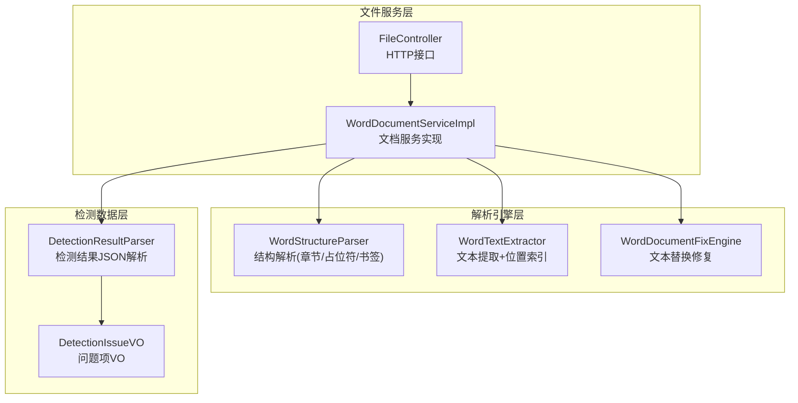
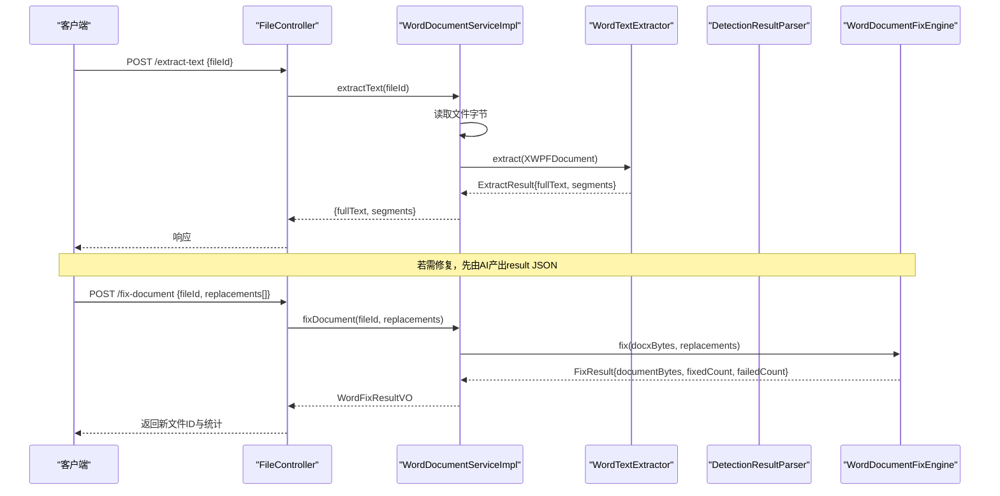
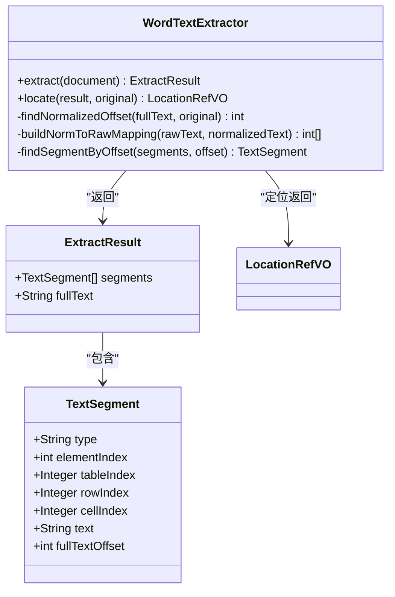
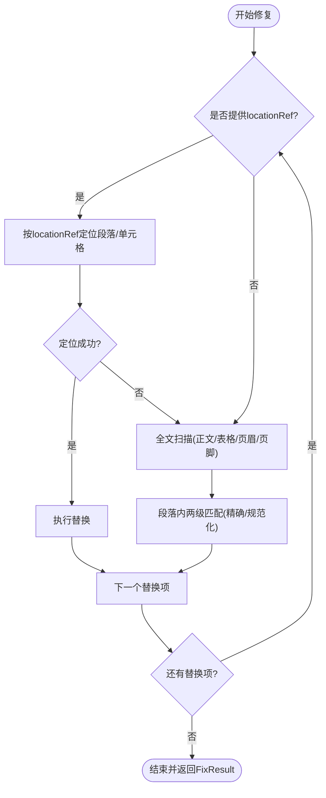
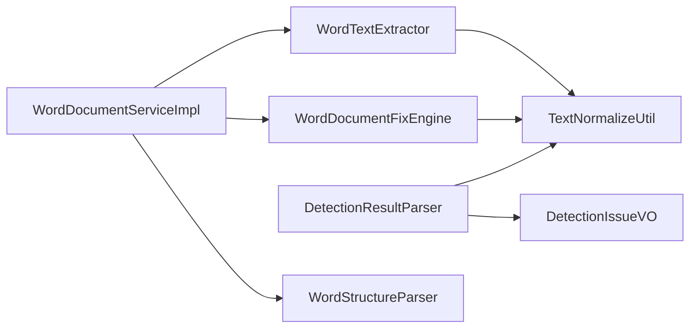

# 文档解析引擎

<cite>
**本文引用的文件**
- [WordTextExtractor.java](file://ele-ai-tender-system/ele-ai-tender-file/src/main/java/com/jy/eleaitender/file/engine/WordTextExtractor.java)
- [WordDocumentFixEngine.java](file://ele-ai-tender-system/ele-ai-tender-file/src/main/java/com/jy/eleaitender/file/engine/WordDocumentFixEngine.java)
- [WordStructureParser.java](file://ele-ai-tender-system/ele-ai-tender-file/src/main/java/com/jy/eleaitender/file/engine/WordStructureParser.java)
- [WordDocumentServiceImpl.java](file://ele-ai-tender-system/ele-ai-tender-file/src/main/java/com/jy/eleaitender/file/service/impl/WordDocumentServiceImpl.java)
- [FileController.java](file://ele-ai-tender-system/ele-ai-tender-file/src/main/java/com/jy/eleaitender/file/controller/FileController.java)
- [DetectionResultParser.java](file://ele-ai-tender-system/ele-ai-tender-core/src/main/java/com/jy/eleaitender/core/util/DetectionResultParser.java)
- [DetectionIssueVO.java](file://ele-ai-tender-system/ele-ai-tender-core/src/main/java/com/jy/eleaitender/core/dto/response/DetectionIssueVO.java)
- [WordTextExtractorTest.java](file://ele-ai-tender-system/ele-ai-tender-file/src/test/java/com/jy/eleaitender/file/engine/WordTextExtractorTest.java)
</cite>

## 目录
1. [简介](#简介)
2. [项目结构](#项目结构)
3. [核心组件](#核心组件)
4. [架构总览](#架构总览)
5. [详细组件分析](#详细组件分析)
6. [依赖关系分析](#依赖关系分析)
7. [性能与复杂度](#性能与复杂度)
8. [错误处理与异常恢复](#错误处理与异常恢复)
9. [结论](#结论)
10. [附录：数据结构与格式规范](#附录数据结构与格式规范)

## 简介
本技术文档聚焦于“文档解析引擎”的 Word 文档结构分析与文本定位能力，覆盖段落提取、表格识别、图片占位与定位策略、文本提取准确性优化（含特殊字符与编码）、解析结果的数据结构与格式规范，以及复杂场景处理方案、性能优化技巧与错误处理机制。该引擎以 Apache POI 为基础，结合规范化匹配与位置映射算法，提供从文档到结构化索引再到可修复替换的完整链路。

## 项目结构
围绕文档解析的核心代码位于 file 模块的 engine 包与 service 实现中，并与 core 模块的检测结果解析器协作，形成“提取—定位—修复”的闭环。

图表来源
- [FileController.java:166-176](file://ele-ai-tender-system/ele-ai-tender-file/src/main/java/com/jy/eleaitender/file/controller/FileController.java#L166-L176)
- [WordDocumentServiceImpl.java:195-228](file://ele-ai-tender-system/ele-ai-tender-file/src/main/java/com/jy/eleaitender/file/service/impl/WordDocumentServiceImpl.java#L195-L228)
- [WordStructureParser.java:37-59](file://ele-ai-tender-system/ele-ai-tender-file/src/main/java/com/jy/eleaitender/file/engine/WordStructureParser.java#L37-L59)
- [WordTextExtractor.java:37-95](file://ele-ai-tender-system/ele-ai-tender-file/src/main/java/com/jy/eleaitender/file/engine/WordTextExtractor.java#L37-L95)
- [WordDocumentFixEngine.java:32-66](file://ele-ai-tender-system/ele-ai-tender-file/src/main/java/com/jy/eleaitender/file/engine/WordDocumentFixEngine.java#L32-L66)
- [DetectionResultParser.java:38-89](file://ele-ai-tender-system/ele-ai-tender-core/src/main/java/com/jy/eleaitender/core/util/DetectionResultParser.java#L38-L89)

章节来源
- [FileController.java:166-176](file://ele-ai-tender-system/ele-ai-tender-file/src/main/java/com/jy/eleaitender/file/controller/FileController.java#L166-L176)
- [WordDocumentServiceImpl.java:195-228](file://ele-ai-tender-system/ele-ai-tender-file/src/main/java/com/jy/eleaitender/file/service/impl/WordDocumentServiceImpl.java#L195-L228)
- [WordStructureParser.java:37-59](file://ele-ai-tender-system/ele-ai-tender-file/src/main/java/com/jy/eleaitender/file/engine/WordStructureParser.java#L37-L59)
- [WordTextExtractor.java:37-95](file://ele-ai-tender-system/ele-ai-tender-file/src/main/java/com/jy/eleaitender/file/engine/WordTextExtractor.java#L37-L95)
- [WordDocumentFixEngine.java:32-66](file://ele-ai-tender-system/ele-ai-tender-file/src/main/java/com/jy/eleaitender/file/engine/WordDocumentFixEngine.java#L32-L66)
- [DetectionResultParser.java:38-89](file://ele-ai-tender-system/ele-ai-tender-core/src/main/java/com/jy/eleaitender/core/util/DetectionResultParser.java#L38-L89)

## 核心组件
- 文本提取与定位：WordTextExtractor
  - 遍历 IBodyElement，提取段落与表格单元格文本，构建 segments 列表与 fullText，并记录每个 segment 在全文中的偏移量，支持按 original 文本进行精确或规范化匹配定位，返回 LocationRefVO。
- 文档修复替换：WordDocumentFixEngine
  - 基于 locationRef 优先定位，失败则回退为全文扫描；段落内两级匹配（精确/规范化），还原实际子串范围后执行替换，输出修复后的字节流及统计信息。
- 结构解析：WordStructureParser
  - 解析章节（Heading 样式）、占位符（{{key}}）与书签（Bookmark），用于模板渲染与预览。
- 服务编排：WordDocumentServiceImpl
  - 组合上述引擎，提供获取文档结构、生成文档、修复文档、提取文本等能力，并将内部对象转换为对外 Map 结构。
- 检测结果解析：DetectionResultParser
  - 解析 AI 输出的 result JSON，填充/读取 locationRef，批量接受建议，提取替换对，供后续修复流程使用。

章节来源
- [WordTextExtractor.java:15-201](file://ele-ai-tender-system/ele-ai-tender-file/src/main/java/com/jy/eleaitender/file/engine/WordTextExtractor.java#L15-L201)
- [WordDocumentFixEngine.java:21-251](file://ele-ai-tender-system/ele-ai-tender-file/src/main/java/com/jy/eleaitender/file/engine/WordDocumentFixEngine.java#L21-L251)
- [WordStructureParser.java:25-131](file://ele-ai-tender-system/ele-ai-tender-file/src/main/java/com/jy/eleaitender/file/engine/WordStructureParser.java#L25-L131)
- [WordDocumentServiceImpl.java:32-228](file://ele-ai-tender-system/ele-ai-tender-file/src/main/java/com/jy/eleaitender/file/service/impl/WordDocumentServiceImpl.java#L32-L228)
- [DetectionResultParser.java:27-445](file://ele-ai-tender-system/ele-ai-tender-core/src/main/java/com/jy/eleaitender/core/util/DetectionResultParser.java#L27-L445)

## 架构总览
下图展示从 HTTP 请求到文档解析、定位与修复的关键调用链。

图表来源
- [FileController.java:166-176](file://ele-ai-tender-system/ele-ai-tender-file/src/main/java/com/jy/eleaitender/file/controller/FileController.java#L166-L176)
- [WordDocumentServiceImpl.java:195-228](file://ele-ai-tender-system/ele-ai-tender-file/src/main/java/com/jy/eleaitender/file/service/impl/WordDocumentServiceImpl.java#L195-L228)
- [WordTextExtractor.java:37-95](file://ele-ai-tender-system/ele-ai-tender-file/src/main/java/com/jy/eleaitender/file/engine/WordTextExtractor.java#L37-L95)
- [WordDocumentFixEngine.java:32-66](file://ele-ai-tender-system/ele-ai-tender-file/src/main/java/com/jy/eleaitender/file/engine/WordDocumentFixEngine.java#L32-L66)
- [DetectionResultParser.java:232-274](file://ele-ai-tender-system/ele-ai-tender-core/src/main/java/com/jy/eleaitender/core/util/DetectionResultParser.java#L232-L274)

## 详细组件分析

### 文本提取与定位（WordTextExtractor）
- 功能要点
  - 遍历 IBodyElement，区分段落与表格；段落直接取文本，表格逐行逐单元格取文本。
  - 维护 segments 列表与 fullText，并为每个 segment 记录 elementIndex、tableIndex、rowIndex、cellIndex 与 fullTextOffset。
  - locate 方法采用“精确匹配优先 → 规范化匹配兜底”，通过规范化映射将 normalized 偏移映射回原始偏移，再二分查找对应 segment，返回 LocationRefVO。
- 关键数据结构
  - ExtractResult：包含 segments 与 fullText。
  - TextSegment：type、elementIndex、tableIndex、rowIndex、cellIndex、text、fullTextOffset。
- 算法复杂度
  - 提取：O(N + M)，N 为 body 元素数，M 为表格单元格总数。
  - 定位：字符串匹配 O(L1 + L2)，规范化映射 O(L)，二分查找 O(log S)。
- 测试覆盖
  - 单段落、多段落、空文档、混合段落与表格等场景均有断言验证。

图表来源
- [WordTextExtractor.java:15-201](file://ele-ai-tender-system/ele-ai-tender-file/src/main/java/com/jy/eleaitender/file/engine/WordTextExtractor.java#L15-L201)

章节来源
- [WordTextExtractor.java:37-95](file://ele-ai-tender-system/ele-ai-tender-file/src/main/java/com/jy/eleaitender/file/engine/WordTextExtractor.java#L37-L95)
- [WordTextExtractor.java:105-140](file://ele-ai-tender-system/ele-ai-tender-file/src/main/java/com/jy/eleaitender/file/engine/WordTextExtractor.java#L105-L140)
- [WordTextExtractorTest.java:28-90](file://ele-ai-tender-system/ele-ai-tender-file/src/test/java/com/jy/eleaitender/file/engine/WordTextExtractorTest.java#L28-L90)

### 文档修复替换（WordDocumentFixEngine）
- 功能要点
  - 优先使用 locationRef 精准定位段落或表格单元格，失败则回退为全文扫描（正文、表格、页眉、页脚）。
  - 段落内两级匹配：Level 1 精确包含；Level 2 规范化匹配并通过位置映射还原实际子串范围，确保保留原文空白差异。
  - 替换策略：清空段落所有 Run，将替换后文本写入第一个 Run，保证内容一致性。
- 关键数据结构
  - FixReplacement：original、targeted、locationRef。
  - FixResult：documentBytes、fixedCount、failedCount。
- 异常与日志
  - 未找到原文时记录警告日志；整体异常包装为运行时异常抛出。

图表来源
- [WordDocumentFixEngine.java:32-66](file://ele-ai-tender-system/ele-ai-tender-file/src/main/java/com/jy/eleaitender/file/engine/WordDocumentFixEngine.java#L32-L66)
- [WordDocumentFixEngine.java:156-192](file://ele-ai-tender-system/ele-ai-tender-file/src/main/java/com/jy/eleaitender/file/engine/WordDocumentFixEngine.java#L156-L192)

章节来源
- [WordDocumentFixEngine.java:32-66](file://ele-ai-tender-system/ele-ai-tender-file/src/main/java/com/jy/eleaitender/file/engine/WordDocumentFixEngine.java#L32-L66)
- [WordDocumentFixEngine.java:156-192](file://ele-ai-tender-system/ele-ai-tender-file/src/main/java/com/jy/eleaitender/file/engine/WordDocumentFixEngine.java#L156-L192)

### 结构解析（WordStructureParser）
- 功能要点
  - 章节：基于段落样式 HeadingX 解析级别与标题文本。
  - 占位符：正则匹配 {{key}}，收集唯一键集合。
  - 书签：遍历段落 CTBookmarkStart，过滤系统书签（以下划线开头）。
- 适用场景
  - 模板渲染前检查缺失占位符、导航目录生成、书签跳转等。

章节来源
- [WordStructureParser.java:37-59](file://ele-ai-tender-system/ele-ai-tender-file/src/main/java/com/jy/eleaitender/file/engine/WordStructureParser.java#L37-L59)
- [WordStructureParser.java:61-91](file://ele-ai-tender-system/ele-ai-tender-file/src/main/java/com/jy/eleaitender/file/engine/WordStructureParser.java#L61-L91)
- [WordStructureParser.java:93-109](file://ele-ai-tender-system/ele-ai-tender-file/src/main/java/com/jy/eleaitender/file/engine/WordStructureParser.java#L93-L109)
- [WordStructureParser.java:111-130](file://ele-ai-tender-system/ele-ai-tender-file/src/main/java/com/jy/eleaitender/file/engine/WordStructureParser.java#L111-L130)

### 服务编排与API（WordDocumentServiceImpl & FileController）
- 服务编排
  - getFileStructure：调用结构解析器返回章节、占位符、书签。
  - generateDocument：两阶段渲染（poi-tl 渲染文本/图片/Markdown，POI 编程生成表格）。
  - fixDocument：读取文件字节，调用修复引擎，上传新文件并返回结果。
  - extractText：调用文本提取器，返回 fullText 与 segments 列表。
- API 暴露
  - /extract-text：接收 fileId，返回 fullText 与 segments。
  - /fix-document：接收 fileId 与 replacements，返回修复后的文件 ID 与统计。

章节来源
- [WordDocumentServiceImpl.java:55-62](file://ele-ai-tender-system/ele-ai-tender-file/src/main/java/com/jy/eleaitender/file/service/impl/WordDocumentServiceImpl.java#L55-L62)
- [WordDocumentServiceImpl.java:76-118](file://ele-ai-tender-system/ele-ai-tender-file/src/main/java/com/jy/eleaitender/file/service/impl/WordDocumentServiceImpl.java#L76-L118)
- [WordDocumentServiceImpl.java:172-193](file://ele-ai-tender-system/ele-ai-tender-file/src/main/java/com/jy/eleaitender/file/service/impl/WordDocumentServiceImpl.java#L172-L193)
- [WordDocumentServiceImpl.java:195-228](file://ele-ai-tender-system/ele-ai-tender-file/src/main/java/com/jy/eleaitender/file/service/impl/WordDocumentServiceImpl.java#L195-L228)
- [FileController.java:166-176](file://ele-ai-tender-system/ele-ai-tender-file/src/main/java/com/jy/eleaitender/file/controller/FileController.java#L166-L176)

### 检测结果解析与回填（DetectionResultParser）
- 功能要点
  - parseIssues：从 result JSON 解析 issues 列表，构造 DetectionIssueVO，并解析 locationRef。
  - fillLocationRefs：根据 fullText 与 segments 为每个 issue 回填 locationRef（精确/规范化匹配 + 二分查找）。
  - parseAcceptedReplacements：提取已接受的替换对，携带 locationRef 供修复引擎使用。
- 数据结构
  - DetectionIssueVO：包含 recordId、detectionType、typeName、description、location、original、targeted、suggestion、severity、handleStatus、issueIndex、policyReference、ruleViolated、locationRef。

章节来源
- [DetectionResultParser.java:38-89](file://ele-ai-tender-system/ele-ai-tender-core/src/main/java/com/jy/eleaitender/core/util/DetectionResultParser.java#L38-L89)
- [DetectionResultParser.java:310-372](file://ele-ai-tender-system/ele-ai-tender-core/src/main/java/com/jy/eleaitender/core/util/DetectionResultParser.java#L310-L372)
- [DetectionResultParser.java:232-274](file://ele-ai-tender-system/ele-ai-tender-core/src/main/java/com/jy/eleaitender/core/util/DetectionResultParser.java#L232-L274)
- [DetectionIssueVO.java:1-55](file://ele-ai-tender-system/ele-ai-tender-core/src/main/java/com/jy/eleaitender/core/dto/response/DetectionIssueVO.java#L1-L55)

## 依赖关系分析
- 外部依赖
  - Apache POI：XWPFDocument、IBodyElement、XWPFParagraph、XWPFTable、XWPFTableRow、XWPFTableCell、CTBookmark 等。
  - Jackson：JSON 读写与节点操作。
- 内部依赖
  - TextNormalizeUtil：规范化与空白字符判断（跨模块复用）。
  - LocationRefVO：统一的位置引用结构。
  - FixReplacement：替换项定义。
  - DetectionIssueVO：检测结果问题项 VO。

图表来源
- [WordTextExtractor.java:15-201](file://ele-ai-tender-system/ele-ai-tender-file/src/main/java/com/jy/eleaitender/file/engine/WordTextExtractor.java#L15-L201)
- [WordDocumentFixEngine.java:21-251](file://ele-ai-tender-system/ele-ai-tender-file/src/main/java/com/jy/eleaitender/file/engine/WordDocumentFixEngine.java#L21-L251)
- [DetectionResultParser.java:27-445](file://ele-ai-tender-system/ele-ai-tender-core/src/main/java/com/jy/eleaitender/core/util/DetectionResultParser.java#L27-L445)
- [WordDocumentServiceImpl.java:32-228](file://ele-ai-tender-system/ele-ai-tender-file/src/main/java/com/jy/eleaitender/file/service/impl/WordDocumentServiceImpl.java#L32-L228)

章节来源
- [WordTextExtractor.java:15-201](file://ele-ai-tender-system/ele-ai-tender-file/src/main/java/com/jy/eleaitender/file/engine/WordTextExtractor.java#L15-L201)
- [WordDocumentFixEngine.java:21-251](file://ele-ai-tender-system/ele-ai-tender-file/src/main/java/com/jy/eleaitender/file/engine/WordDocumentFixEngine.java#L21-L251)
- [DetectionResultParser.java:27-445](file://ele-ai-tender-system/ele-ai-tender-core/src/main/java/com/jy/eleaitender/core/util/DetectionResultParser.java#L27-L445)
- [WordDocumentServiceImpl.java:32-228](file://ele-ai-tender-system/ele-ai-tender-file/src/main/java/com/jy/eleaitender/file/service/impl/WordDocumentServiceImpl.java#L32-L228)

## 性能与复杂度
- 时间复杂度
  - 文本提取：线性遍历 body 元素与表格单元格，总体 O(N + M)。
  - 定位与回填：字符串匹配 O(L1 + L2)，规范化映射 O(L)，二分查找 O(log S)。
  - 修复替换：按替换项数量 K 循环，每次可能全表扫描，最坏 O(K × (P + C + H + F))，其中 P/C/H/F 分别为段落/表格/页眉/页脚段落数。
- 空间复杂度
  - 提取：segments 列表与 fullText 占用 O(S + L)。
  - 修复：内存中持有 XWPFDocument 与 ByteArrayOutputStream。
- 优化建议
  - 大文档场景下，优先使用 locationRef 定位，避免全表扫描。
  - 合并多次替换为一次遍历，减少重复扫描。
  - 对频繁调用的规范化函数与映射构建进行缓存（如按段落粒度缓存 normToRaw）。
  - 控制 fullText 长度与 segments 规模，必要时分页或分块处理。

[本节为通用性能讨论，不直接分析具体文件]

## 错误处理与异常恢复
- 提取与修复
  - 提取失败：捕获异常并包装为运行时异常抛出，便于上层统一处理。
  - 修复失败：同样包装为运行时异常；单个替换项未命中时记录警告日志并跳过，继续处理后续项。
- 检测结果解析
  - JSON 解析异常：记录错误日志并返回空集合或原 JSON，保障流程健壮性。
  - 越界访问：更新 handleStatus 等方法在越界时返回 null，由上层决定是否写入。
- 建议
  - 增加重试与降级策略（例如网络或 IO 异常）。
  - 对超大文档进行分块处理与进度上报。
  - 对规范化匹配失败的场景提供人工确认入口。

章节来源
- [WordDocumentServiceImpl.java:224-227](file://ele-ai-tender-system/ele-ai-tender-file/src/main/java/com/jy/eleaitender/file/service/impl/WordDocumentServiceImpl.java#L224-L227)
- [WordDocumentFixEngine.java:63-65](file://ele-ai-tender-system/ele-ai-tender-file/src/main/java/com/jy/eleaitender/file/engine/WordDocumentFixEngine.java#L63-L65)
- [DetectionResultParser.java:85-88](file://ele-ai-tender-system/ele-ai-tender-core/src/main/java/com/jy/eleaitender/core/util/DetectionResultParser.java#L85-L88)
- [DetectionResultParser.java:145-148](file://ele-ai-tender-system/ele-ai-tender-core/src/main/java/com/jy/eleaitender/core/util/DetectionResultParser.java#L145-L148)

## 结论
本解析引擎以 POI 为基础，结合规范化匹配与位置映射，实现了高鲁棒性的段落与表格文本提取、精确定位与修复替换。通过服务编排与检测结果解析器的协同，形成了从“文档→结构化索引→检测结果→修复”的完整链路。针对复杂文档场景，提供了两级匹配与 fallback 策略，并在错误处理上具备较好的容错性与可观测性。未来可在性能优化（缓存、批处理）与扩展性（更多元素类型、图片定位增强）方面持续演进。

[本节为总结性内容，不直接分析具体文件]

## 附录：数据结构与格式规范

### 文本提取结果（Map 结构）
- 字段
  - fullText：拼接后的全文，段落与表格单元格之间以换行分隔。
  - segments：数组，每项包含：
    - type："paragraph" | "table"
    - elementIndex：IBodyElement 序号
    - tableIndex：表格序号（仅 table 类型）
    - rowIndex：行序号（仅 table 类型）
    - cellIndex：列序号（仅 table 类型）
    - text：片段文本
    - fullTextOffset：在 fullText 中的起始偏移量

章节来源
- [WordDocumentServiceImpl.java:204-221](file://ele-ai-tender-system/ele-ai-tender-file/src/main/java/com/jy/eleaitender/file/service/impl/WordDocumentServiceImpl.java#L204-L221)

### 检测结果问题项（DetectionIssueVO）
- 关键字段
  - recordId、detectionType、typeName、description、location、original、targeted、suggestion、severity、handleStatus、issueIndex、policyReference、ruleViolated、locationRef
- locationRef 结构
  - type、elementIndex、tableIndex、rowIndex、cellIndex

章节来源
- [DetectionIssueVO.java:1-55](file://ele-ai-tender-system/ele-ai-tender-core/src/main/java/com/jy/eleaitender/core/dto/response/DetectionIssueVO.java#L1-L55)
- [DetectionResultParser.java:68-81](file://ele-ai-tender-system/ele-ai-tender-core/src/main/java/com/jy/eleaitender/core/util/DetectionResultParser.java#L68-L81)

### 替换项（FixReplacement）
- 字段
  - original：待替换原文
  - targeted：替换目标文本
  - locationRef：可选的精确定位信息

章节来源
- [DetectionResultParser.java:247-264](file://ele-ai-tender-system/ele-ai-tender-core/src/main/java/com/jy/eleaitender/core/util/DetectionResultParser.java#L247-L264)

### 修复结果（WordFixResultVO）
- 字段
  - fileId：修复后文件ID
  - fixedCount：成功替换数
  - failedCount：失败替换数

章节来源
- [WordDocumentServiceImpl.java:185-189](file://ele-ai-tender-system/ele-ai-tender-file/src/main/java/com/jy/eleaitender/file/service/impl/WordDocumentServiceImpl.java#L185-L189)