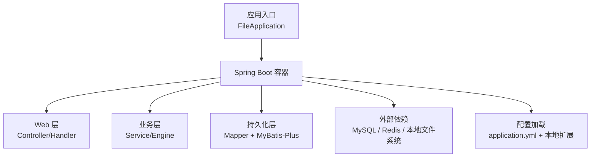
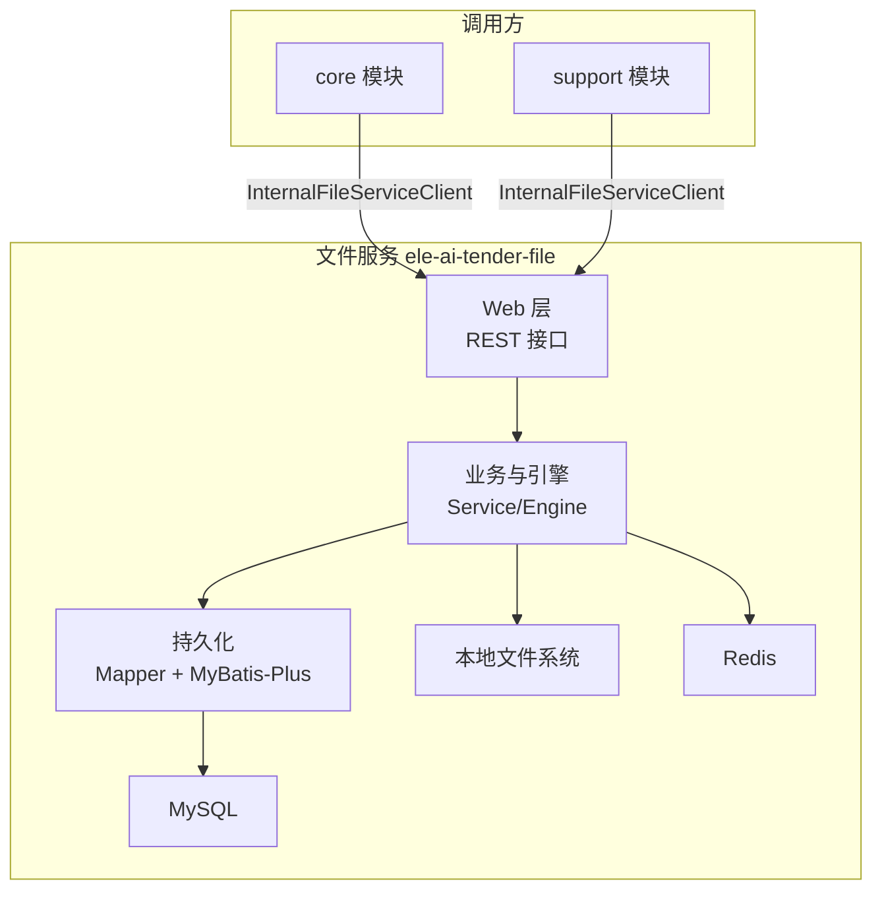
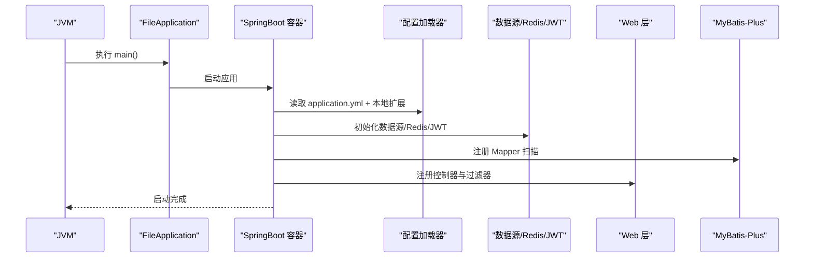
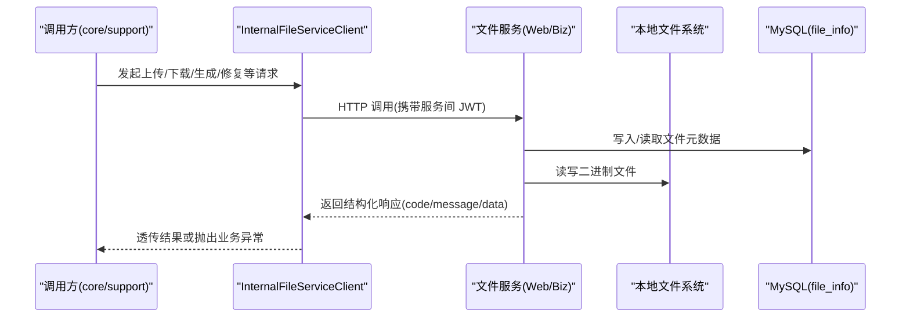
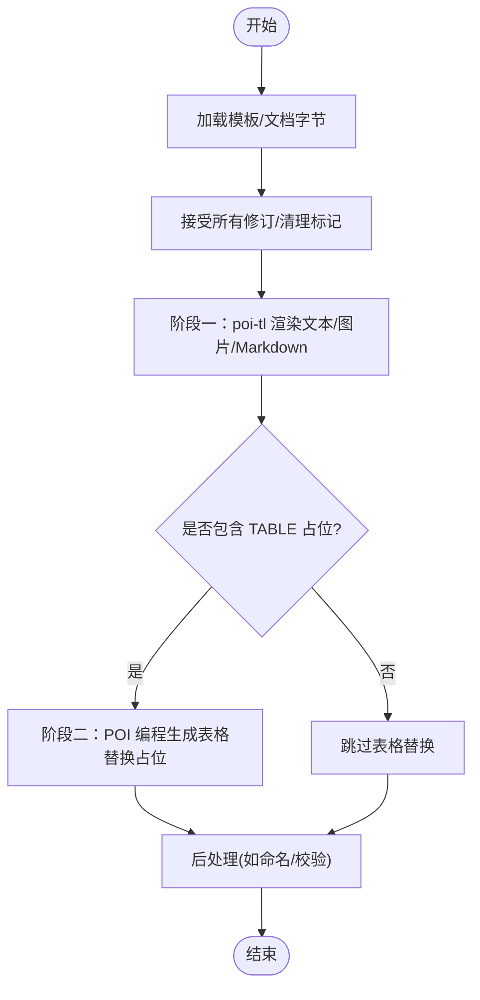
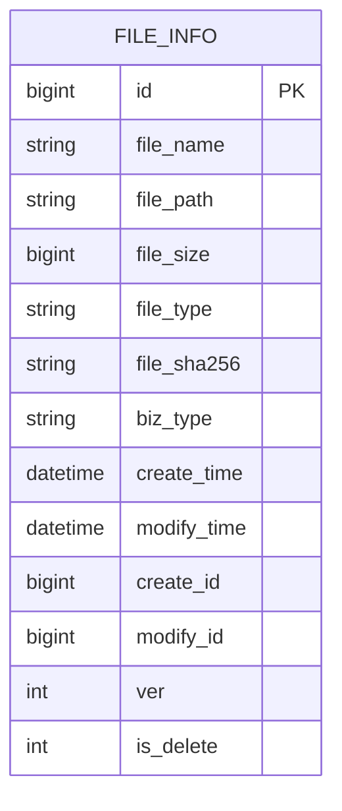
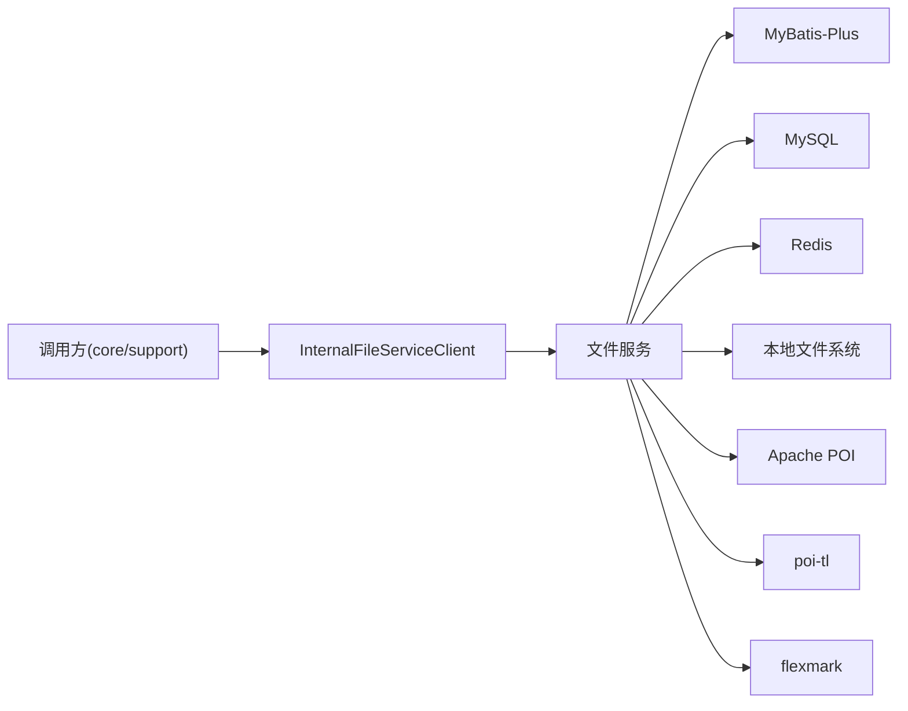

# 服务概述与架构

<cite>
**本文引用的文件**   
- [FileApplication.java](file://ele-ai-tender-system/ele-ai-tender-file/src/main/java/com/jy/eleaitender/file/FileApplication.java)
- [application.yml](file://ele-ai-tender-system/ele-ai-tender-file/src/main/resources/application.yml)
- [FILE_SERVICE_SPEC.md](file://docs/rules/FILE_SERVICE_SPEC.md)
</cite>

## 目录
1. [引言](#引言)
2. [项目结构](#项目结构)
3. [核心组件](#核心组件)
4. [架构总览](#架构总览)
5. [详细组件分析](#详细组件分析)
6. [依赖分析](#依赖分析)
7. [性能考虑](#性能考虑)
8. [故障排查指南](#故障排查指南)
9. [结论](#结论)
10. [附录](#附录)

## 引言
本文件为“文件处理服务”（ele-ai-tender-file）的架构概述文档，面向微服务中的文件能力提供方。该服务提供统一的文件上传、下载、查询、删除以及文档生成与修复等能力，并通过内部客户端被 core/support 模块调用。文档将覆盖设计目标、核心功能、技术选型、启动流程、配置管理、依赖注入、部署拓扑、性能指标与监控方案，并给出开发环境搭建与基础使用示例。

## 项目结构
- 服务入口：Spring Boot 应用类负责启动与 Mapper 扫描。
- 配置中心：application.yml 集中定义端口、编码、多部分上传大小、数据源、Redis、JWT、MyBatis-Plus、文件存储策略与日志级别。
- 规范文档：FILE_SERVICE_SPEC.md 明确接口、引擎约束、表结构与排障原则。

图表来源
- [FileApplication.java:1-18](file://ele-ai-tender-system/ele-ai-tender-file/src/main/java/com/jy/eleaitender/file/FileApplication.java#L1-L18)
- [application.yml:1-63](file://ele-ai-tender-system/ele-ai-tender-file/src/main/resources/application.yml#L1-L63)

章节来源
- [FileApplication.java:1-18](file://ele-ai-tender-system/ele-ai-tender-file/src/main/java/com/jy/eleaitender/file/FileApplication.java#L1-L18)
- [application.yml:1-63](file://ele-ai-tender-system/ele-ai-tender-file/src/main/resources/application.yml#L1-L63)

## 核心组件
- 统一文件能力
  - 上传、下载、信息获取、删除、文本提取等 REST 接口。
  - 文件元数据持久化于 file_info 表，继承 BaseEntity 基础字段。
- 文档生成与修复引擎
  - Word 模板填充与渲染（poi-tl）、Word 结构解析、Markdown→Word 转换、表格编程生成、检测问题修复（基于 Apache POI）。
- 内部服务调用
  - core/support 通过 InternalFileServiceClient 调用 File 服务，遵循服务间认证与错误响应处理约定。

章节来源
- [FILE_SERVICE_SPEC.md:1-153](file://docs/rules/FILE_SERVICE_SPEC.md#L1-L153)

## 架构总览
文件服务在微服务中的定位：
- 作为“文件与文档能力”的中台服务，对外暴露标准 API，对内提供文档生成与修复能力。
- 与 core/support 通过内部客户端交互，遵循 JWT 服务间认证与统一错误码约定。
- 依赖 MySQL 存储文件元数据，Redis 用于缓存或会话（按实际配置），本地文件系统承载二进制文件。

图表来源
- [FILE_SERVICE_SPEC.md:1-153](file://docs/rules/FILE_SERVICE_SPEC.md#L1-L153)
- [application.yml:1-63](file://ele-ai-tender-system/ele-ai-tender-file/src/main/resources/application.yml#L1-L63)

## 详细组件分析

### 启动流程与依赖注入
- 启动入口
  - Spring Boot 应用类启用自动装配与 Mapper 扫描，指定包路径以发现 Mapper 接口。
- 配置加载
  - application.yml 定义默认配置，支持从用户目录导入本地扩展配置文件，便于环境隔离。
- 关键依赖
  - Web 容器、Servlet 编码、Multipart 上传大小限制、数据源、Redis、JWT、MyBatis-Plus、文件存储策略。

图表来源
- [FileApplication.java:1-18](file://ele-ai-tender-system/ele-ai-tender-file/src/main/java/com/jy/eleaitender/file/FileApplication.java#L1-L18)
- [application.yml:1-63](file://ele-ai-tender-system/ele-ai-tender-file/src/main/resources/application.yml#L1-L63)

章节来源
- [FileApplication.java:1-18](file://ele-ai-tender-system/ele-ai-tender-file/src/main/java/com/jy/eleaitender/file/FileApplication.java#L1-L18)
- [application.yml:1-63](file://ele-ai-tender-system/ele-ai-tender-file/src/main/resources/application.yml#L1-L63)

### 配置管理与环境变量
- 服务器与编码
  - 端口、UTF-8 强制编码。
- 上传限制
  - 单文件与请求体最大 500MB。
- 数据源与缓存
  - MySQL 连接参数、Redis 主机/端口/库号/密码。
- JWT
  - 密钥、过期时间、外部过期时间。
- MyBatis-Plus
  - Mapper XML 扫描、类型别名、逻辑删除、下划线转驼峰。
- 文件存储
  - 本地基路径、允许的后缀白名单、最大尺寸。
- 日志
  - 包级日志级别。

章节来源
- [application.yml:1-63](file://ele-ai-tender-system/ele-ai-tender-file/src/main/resources/application.yml#L1-L63)

### 接口与数据流
- 公开接口
  - 上传、下载、信息、删除、文本提取等。
- 内部接口
  - 结构解析、文档生成、文档修复、文本提取等，供 core/support 通过 InternalFileServiceClient 调用。
- 数据流转
  - 调用方 → Web 层 → 业务/引擎 → 持久化/存储 → 返回结果。

图表来源
- [FILE_SERVICE_SPEC.md:1-153](file://docs/rules/FILE_SERVICE_SPEC.md#L1-L153)

章节来源
- [FILE_SERVICE_SPEC.md:1-153](file://docs/rules/FILE_SERVICE_SPEC.md#L1-L153)

### 文档生成与修复引擎
- 引擎职责
  - Word 模板填充与渲染、结构解析、Markdown→Word 转换、表格编程生成、检测问题修复。
- 关键约束
  - 必须使用原生 poi-tl 引擎；占位符语法与标签规则严格；两阶段渲染；表格边框设置；修订标记预处理；poi-tl 版本要求。
- 修复策略
  - 多 Run 替换策略、遍历范围、命名规则、locationRef 精准定位与两级匹配。

图表来源
- [FILE_SERVICE_SPEC.md:1-153](file://docs/rules/FILE_SERVICE_SPEC.md#L1-L153)

章节来源
- [FILE_SERVICE_SPEC.md:1-153](file://docs/rules/FILE_SERVICE_SPEC.md#L1-L153)

### 数据库模型与存储
- 表结构
  - file_info 主键 id、文件名、路径、大小、类型、SHA-256、业务类型等，继承 BaseEntity 审计字段。
- 存储策略
  - 二进制文件落盘至本地文件系统，路径由 base-path 配置；元数据入 MySQL。

图表来源
- [FILE_SERVICE_SPEC.md:1-153](file://docs/rules/FILE_SERVICE_SPEC.md#L1-L153)

章节来源
- [FILE_SERVICE_SPEC.md:1-153](file://docs/rules/FILE_SERVICE_SPEC.md#L1-L153)

## 依赖分析
- 直接依赖
  - Spring Boot、MyBatis-Plus、MySQL、Redis、JWT、Apache POI、poi-tl、flexmark。
- 间接依赖
  - 调用方通过 InternalFileServiceClient 访问，需遵循服务间认证与错误处理约定。
- 耦合与内聚
  - Web 层与业务/引擎解耦清晰；引擎对 POI/poi-tl/flexmark 有强依赖；持久化通过 Mapper 抽象。

图表来源
- [FILE_SERVICE_SPEC.md:1-153](file://docs/rules/FILE_SERVICE_SPEC.md#L1-L153)
- [application.yml:1-63](file://ele-ai-tender-system/ele-ai-tender-file/src/main/resources/application.yml#L1-L63)

章节来源
- [FILE_SERVICE_SPEC.md:1-153](file://docs/rules/FILE_SERVICE_SPEC.md#L1-L153)
- [application.yml:1-63](file://ele-ai-tender-system/ele-ai-tender-file/src/main/resources/application.yml#L1-L63)

## 性能考虑
- 上传与存储
  - 合理设置 multipart 大小限制与磁盘配额；大文件建议分片或异步处理。
- 文档生成
  - 避免频繁创建 ObjectMapper/引擎实例；复用对象与线程池；控制模板复杂度与表格规模。
- 数据库
  - 合理使用索引与分页；避免一次性加载超大结果集。
- 缓存
  - 对热点元数据或结构解析结果进行缓存，注意失效策略。
- 日志
  - 控制日志级别，避免记录二进制内容；使用链路追踪 ID 提升可观测性。

[本节为通用指导，不直接分析具体文件]

## 故障排查指南
- 上传失败
  - 检查后缀白名单、文件大小上限、存储目录写权限。
- 下载 404
  - 确认 file_info.file_path 对应文件存在且 base-path 配置正确。
- SHA-256 校验失败
  - 核对计算方式与服务端一致（十六进制字符串、UTF-8 字节序列）。
- locationRef 定位失败
  - 检查 elementIndex 越界、WordTextExtractor 是否执行、fillLocationRefs 日志。
- 修复替换位置错误
  - 检查 FixReplacement.locationRef 是否为空、elementIndex 与 type 是否一致。

章节来源
- [FILE_SERVICE_SPEC.md:1-153](file://docs/rules/FILE_SERVICE_SPEC.md#L1-L153)

## 结论
文件服务围绕“统一文件能力 + 文档生成/修复引擎”构建，采用 Spring Boot + MyBatis-Plus + 本地文件系统 + MySQL/Redis 的技术栈，通过内部客户端与 core/support 协作。其清晰的配置管理、严格的引擎约束与完善的排障原则，有助于在高并发与复杂文档场景下保持稳定与高效。

[本节为总结性内容，不直接分析具体文件]

## 附录

### 部署拓扑建议
- 单机/小团队
  - 文件服务与 MySQL/Redis 同机部署，本地文件系统挂载到持久卷。
- 生产集群
  - 文件服务无状态多副本，共享 NFS/对象存储；MySQL/Redis 独立高可用集群；网关/负载均衡接入。

[本节为概念性说明，不直接分析具体文件]

### 开发环境搭建
- 前置条件
  - JDK、Maven、MySQL、Redis、本地文件目录。
- 步骤
  - 初始化数据库与表结构；配置 application.yml 中数据源、Redis、文件存储路径；启动 FileApplication。
- 验证
  - 调用上传/下载接口，确认文件落盘与元数据入库。

章节来源
- [application.yml:1-63](file://ele-ai-tender-system/ele-ai-tender-file/src/main/resources/application.yml#L1-L63)
- [FILE_SERVICE_SPEC.md:1-153](file://docs/rules/FILE_SERVICE_SPEC.md#L1-L153)

### 基础使用示例
- 上传
  - 调用上传接口，传入文件与 bizType，返回 fileId。
- 下载
  - 根据 fileId 调用下载接口获取文件流。
- 信息
  - 根据 fileId 获取文件元数据。
- 删除
  - 根据 fileId 删除文件与元数据。
- 文本提取
  - 提交 fileId，返回全文与段落级片段及位置索引。

章节来源
- [FILE_SERVICE_SPEC.md:1-153](file://docs/rules/FILE_SERVICE_SPEC.md#L1-L153)