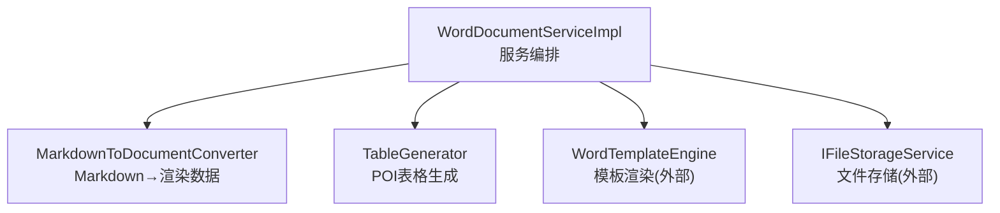
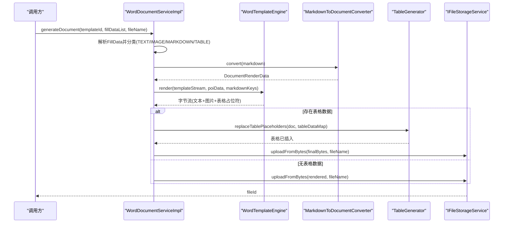
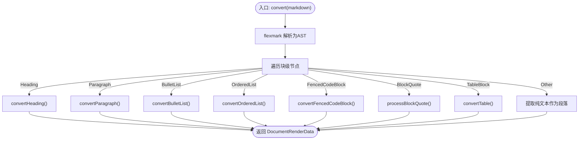
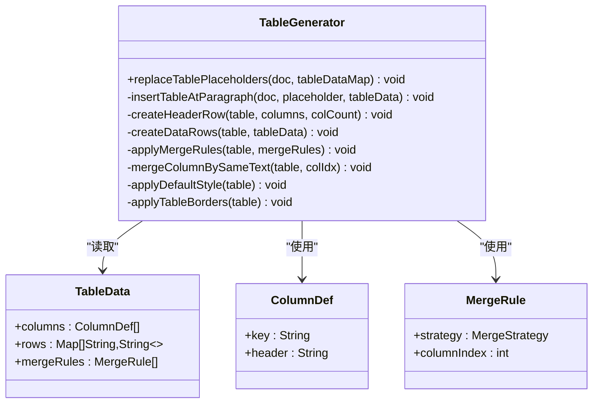
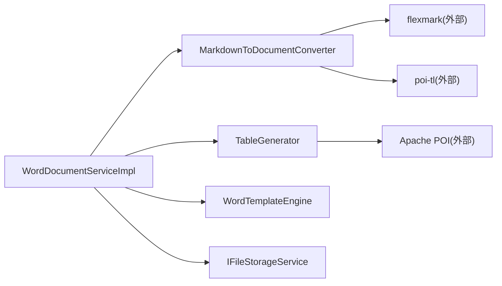

# 格式转换引擎

<cite>
**本文引用的文件**
- [MarkdownToDocumentConverter.java](file://ele-ai-tender-system/ele-ai-tender-file/src/main/java/com/jy/eleaitender/file/engine/MarkdownToDocumentConverter.java)
- [TableGenerator.java](file://ele-ai-tender-system/ele-ai-tender-file/src/main/java/com/jy/eleaitender/file/engine/TableGenerator.java)
- [WordDocumentServiceImpl.java](file://ele-ai-tender-system/ele-ai-tender-file/src/main/java/com/jy/eleaitender/file/service/impl/WordDocumentServiceImpl.java)
- [IWordDocumentService.java](file://ele-ai-tender-system/ele-ai-tender-file/src/main/java/com/jy/eleaitender/file/service/IWordDocumentService.java)
- [MarkdownToDocumentConverterTest.java](file://ele-ai-tender-system/ele-ai-tender-file/src/test/java/com/jy/eleaitender/file/engine/MarkdownToDocumentConverterTest.java)
- [TableGeneratorTest.java](file://ele-ai-tender-system/ele-ai-tender-file/src/test/java/com/jy/eleaitender/file/engine/TableGeneratorTest.java)
</cite>

## 目录
1. [简介](#简介)
2. [项目结构](#项目结构)
3. [核心组件](#核心组件)
4. [架构总览](#架构总览)
5. [详细组件分析](#详细组件分析)
6. [依赖关系分析](#依赖关系分析)
7. [性能与批量优化](#性能与批量优化)
8. [故障诊断与调试](#故障诊断与调试)
9. [结论](#结论)
10. [附录](#附录)

## 简介
本技术文档聚焦于“格式转换引擎”，围绕 Markdown 到 Word 文档的转换算法、样式映射、表格生成、列表处理、模板渲染机制与扩展点，以及转换质量评估、兼容性处理与批量优化方案进行系统化说明。同时提供错误诊断与调试方法，帮助开发者快速定位问题并提升输出质量。

## 项目结构
与格式转换相关的核心代码位于 ele-ai-tender-file 模块中，主要包含：
- 转换器：Markdown → poi-tl 渲染数据（段落、列表、表格等）
- 表格生成器：基于 POI 直接创建表格，支持占位符替换与单元格合并
- 服务编排：两阶段渲染（poi-tl 文本/图片 + POI 表格），统一入口与上传

图表来源
- [WordDocumentServiceImpl.java:76-118](file://ele-ai-tender-system/ele-ai-tender-file/src/main/java/com/jy/eleaitender/file/service/impl/WordDocumentServiceImpl.java#L76-L118)
- [MarkdownToDocumentConverter.java:75-88](file://ele-ai-tender-system/ele-ai-tender-file/src/main/java/com/jy/eleaitender/file/engine/MarkdownToDocumentConverter.java#L75-L88)
- [TableGenerator.java:31-53](file://ele-ai-tender-system/ele-ai-tender-file/src/main/java/com/jy/eleaitender/file/engine/TableGenerator.java#L31-L53)

章节来源
- [WordDocumentServiceImpl.java:1-229](file://ele-ai-tender-system/ele-ai-tender-file/src/main/java/com/jy/eleaitender/file/service/impl/WordDocumentServiceImpl.java#L1-L229)
- [IWordDocumentService.java:13-49](file://ele-ai-tender-system/ele-ai-tender-file/src/main/java/com/jy/eleaitender/file/service/IWordDocumentService.java#L13-L49)

## 核心组件
- MarkdownToDocumentConverter：将 Markdown AST 转换为 poi-tl 的 DocumentRenderData，覆盖标题、段落、行内样式、列表、引用、代码块、表格等。
- TableGenerator：扫描模板中的表格占位符，使用 Apache POI 直接生成表格，支持列定义、表头加粗、默认样式、垂直合并等。
- WordDocumentServiceImpl：编排两阶段渲染流程，分离文本/图片与表格数据，先由模板引擎渲染文本，再对表格进行二次替换生成。

章节来源
- [MarkdownToDocumentConverter.java:34-88](file://ele-ai-tender-system/ele-ai-tender-file/src/main/java/com/jy/eleaitender/file/engine/MarkdownToDocumentConverter.java#L34-L88)
- [TableGenerator.java:22-53](file://ele-ai-tender-system/ele-ai-tender-file/src/main/java/com/jy/eleaitender/file/engine/TableGenerator.java#L22-L53)
- [WordDocumentServiceImpl.java:76-118](file://ele-ai-tender-system/ele-ai-tender-file/src/main/java/com/jy/eleaitender/file/service/impl/WordDocumentServiceImpl.java#L76-L118)

## 架构总览
整体采用“两阶段渲染”策略：
- 阶段一：解析 FillData，按类型拆分 TEXT/IMAGE/MARKDOWN/TABLE；MARKDOWN 通过 MarkdownToDocumentConverter 转为渲染数据；TABLE 以占位符形式注入；调用模板引擎完成文本与图片渲染。
- 阶段二：加载已渲染的 Word 文档，扫描占位符段落，使用 TableGenerator 插入真实表格，应用默认样式与合并规则，最终写出并上传。

图表来源
- [WordDocumentServiceImpl.java:76-118](file://ele-ai-tender-system/ele-ai-tender-file/src/main/java/com/jy/eleaitender/file/service/impl/WordDocumentServiceImpl.java#L76-L118)
- [MarkdownToDocumentConverter.java:75-88](file://ele-ai-tender-system/ele-ai-tender-file/src/main/java/com/jy/eleaitender/file/engine/MarkdownToDocumentConverter.java#L75-L88)
- [TableGenerator.java:31-53](file://ele-ai-tender-system/ele-ai-tender-file/src/main/java/com/jy/eleaitender/file/engine/TableGenerator.java#L31-L53)

## 详细组件分析

### Markdown 到 Word 转换算法
- 解析层：使用 flexmark 解析 Markdown 为 AST，启用 Tables 扩展以识别表格语法。
- 遍历层：自上而下遍历块级节点，分别处理标题、段落、列表、引用、代码块、表格等。
- 行内样式：递归收集行内片段，维护继承样式（加粗/斜体/字体/字号），代码环境切换等宽字体。
- 列表：无序列表映射为项目符号编号，有序列表映射为十进制编号，嵌套项在块级处理。
- 引用：为段落或标题前追加固定前缀，保持层级与样式一致。
- 代码块：去除围栏标记行，保留原始换行，使用等宽字体。
- 表格：跳过分隔行，构建最大列数对齐的空单元格，表头行加粗，单元格内保留行内格式。

图表来源
- [MarkdownToDocumentConverter.java:75-116](file://ele-ai-tender-system/ele-ai-tender-file/src/main/java/com/jy/eleaitender/file/engine/MarkdownToDocumentConverter.java#L75-L116)

章节来源
- [MarkdownToDocumentConverter.java:118-152](file://ele-ai-tender-system/ele-ai-tender-file/src/main/java/com/jy/eleaitender/file/engine/MarkdownToDocumentConverter.java#L118-L152)
- [MarkdownToDocumentConverter.java:154-278](file://ele-ai-tender-system/ele-ai-tender-file/src/main/java/com/jy/eleaitender/file/engine/MarkdownToDocumentConverter.java#L154-L278)
- [MarkdownToDocumentConverter.java:280-354](file://ele-ai-tender-system/ele-ai-tender-file/src/main/java/com/jy/eleaitender/file/engine/MarkdownToDocumentConverter.java#L280-L354)
- [MarkdownToDocumentConverter.java:356-386](file://ele-ai-tender-system/ele-ai-tender-file/src/main/java/com/jy/eleaitender/file/engine/MarkdownToDocumentConverter.java#L356-L386)
- [MarkdownToDocumentConverter.java:388-462](file://ele-ai-tender-system/ele-ai-tender-file/src/main/java/com/jy/eleaitender/file/engine/MarkdownToDocumentConverter.java#L388-L462)

#### 样式映射与行内格式
- 默认字体与字号：正文使用宋体与固定字号；标题逐级递减字号并加粗。
- 行内样式：加粗、斜体、行内代码（等宽字体）通过 Style 对象传递与合并。
- 换行处理：软/硬换行均转换为段落内换行，避免多级编号挤在同一行。

章节来源
- [MarkdownToDocumentConverter.java:38-58](file://ele-ai-tender-system/ele-ai-tender-file/src/main/java/com/jy/eleaitender/file/engine/MarkdownToDocumentConverter.java#L38-L58)
- [MarkdownToDocumentConverter.java:141-152](file://ele-ai-tender-system/ele-ai-tender-file/src/main/java/com/jy/eleaitender/file/engine/MarkdownToDocumentConverter.java#L141-L152)
- [MarkdownToDocumentConverter.java:186-270](file://ele-ai-tender-system/ele-ai-tender-file/src/main/java/com/jy/eleaitender/file/engine/MarkdownToDocumentConverter.java#L186-L270)

#### 表格生成器实现原理
- 占位符匹配：扫描段落文本，查找特定前缀的键值，定位待替换位置。
- 表格构建：根据 ColumnDef 定义创建表头行，逐行填充数据，确保列数一致。
- 样式与边框：设置全宽、居中表头、统一字体字号、内外边框。
- 单元格合并：支持按相同文本纵向合并，使用底层 XML 属性控制合并状态。

图表来源
- [TableGenerator.java:22-117](file://ele-ai-tender-system/ele-ai-tender-file/src/main/java/com/jy/eleaitender/file/engine/TableGenerator.java#L22-L117)
- [TableGenerator.java:145-198](file://ele-ai-tender-system/ele-ai-tender-file/src/main/java/com/jy/eleaitender/file/engine/TableGenerator.java#L145-L198)
- [TableGenerator.java:232-285](file://ele-ai-tender-system/ele-ai-tender-file/src/main/java/com/jy/eleaitender/file/engine/TableGenerator.java#L232-L285)

章节来源
- [TableGenerator.java:31-117](file://ele-ai-tender-system/ele-ai-tender-file/src/main/java/com/jy/eleaitender/file/engine/TableGenerator.java#L31-L117)
- [TableGenerator.java:145-198](file://ele-ai-tender-system/ele-ai-tender-file/src/main/java/com/jy/eleaitender/file/engine/TableGenerator.java#L145-L198)
- [TableGenerator.java:232-285](file://ele-ai-tender-system/ele-ai-tender-file/src/main/java/com/jy/eleaitender/file/engine/TableGenerator.java#L232-L285)

#### 模板引擎工作机制与自定义扩展
- 工作模式：模板引擎负责文本与图片渲染，接收 MARKDOWN 对应的渲染数据与 TABLE 占位符文本。
- 扩展点：
  - 新增数据类型：在 FillData 类型分支中添加新类型处理逻辑，并在模板引擎侧注册对应渲染策略。
  - 表格扩展：在 TableGenerator 中增加新的 MergeStrategy 或列格式化策略。
  - 样式扩展：在 MarkdownToDocumentConverter 中调整默认字体、字号、颜色等常量或策略。

章节来源
- [WordDocumentServiceImpl.java:86-102](file://ele-ai-tender-system/ele-ai-tender-file/src/main/java/com/jy/eleaitender/file/service/impl/WordDocumentServiceImpl.java#L86-L102)
- [TableGenerator.java:147-158](file://ele-ai-tender-system/ele-ai-tender-file/src/main/java/com/jy/eleaitender/file/engine/TableGenerator.java#L147-L158)
- [MarkdownToDocumentConverter.java:38-58](file://ele-ai-tender-system/ele-ai-tender-file/src/main/java/com/jy/eleaitender/file/engine/MarkdownToDocumentConverter.java#L38-L58)

#### 转换质量评估与格式兼容性
- 质量评估建议：
  - 结构一致性：对比源 Markdown 的标题层级、列表深度与目标 Word 的段落/编号结构。
  - 表格完整性：校验列数对齐、表头加粗、合并区域是否按预期。
  - 样式稳定性：检查字体、字号、加粗/斜体是否符合规范。
- 兼容性处理：
  - 空段落兜底：确保空段落至少包含一个空文本片段，避免丢失。
  - 列数补齐：不规则表格按最大列数补齐空单元格，防止渲染异常。
  - 换行语义：软/硬换行统一为段落内换行，适配中文条款排版。

章节来源
- [MarkdownToDocumentConverter.java:228-234](file://ele-ai-tender-system/ele-ai-tender-file/src/main/java/com/jy/eleaitender/file/engine/MarkdownToDocumentConverter.java#L228-L234)
- [MarkdownToDocumentConverter.java:429-446](file://ele-ai-tender-system/ele-ai-tender-file/src/main/java/com/jy/eleaitender/file/engine/MarkdownToDocumentConverter.java#L429-L446)
- [MarkdownToDocumentConverter.java:211-217](file://ele-ai-tender-system/ele-ai-tender-file/src/main/java/com/jy/eleaitender/file/engine/MarkdownToDocumentConverter.java#L211-L217)

#### 批量转换优化方案
- 数据预处理：在调用端预聚合相同模板的 FillData，减少重复解析与 IO。
- 并行渲染：对独立模板/文档任务使用线程池并发执行，注意限制并发度以避免内存峰值。
- 资源复用：复用 Parser、ObjectMapper 等重型对象，避免频繁构造。
- 流式写入：大文档场景优先使用流式写入与分块处理，降低内存占用。

[本节为通用指导，不直接分析具体文件]

## 依赖关系分析
- 内部依赖：
  - WordDocumentServiceImpl 依赖 MarkdownToDocumentConverter、TableGenerator、WordTemplateEngine、IFileStorageService。
  - MarkdownToDocumentConverter 依赖 flexmark 解析与 poi-tl 渲染数据结构。
  - TableGenerator 依赖 Apache POI 与 OpenXML Schema。
- 外部依赖：
  - 模板引擎（WordTemplateEngine）负责模板渲染。
  - 存储服务（IFileStorageService）负责生成文件的持久化。

图表来源
- [WordDocumentServiceImpl.java:32-52](file://ele-ai-tender-system/ele-ai-tender-file/src/main/java/com/jy/eleaitender/file/service/impl/WordDocumentServiceImpl.java#L32-L52)
- [MarkdownToDocumentConverter.java:1-12](file://ele-ai-tender-system/ele-ai-tender-file/src/main/java/com/jy/eleaitender/file/engine/MarkdownToDocumentConverter.java#L1-L12)
- [TableGenerator.java:1-16](file://ele-ai-tender-system/ele-ai-tender-file/src/main/java/com/jy/eleaitender/file/engine/TableGenerator.java#L1-L16)

章节来源
- [WordDocumentServiceImpl.java:32-52](file://ele-ai-tender-system/ele-ai-tender-file/src/main/java/com/jy/eleaitender/file/service/impl/WordDocumentServiceImpl.java#L32-L52)

## 性能与批量优化
- 解析与渲染分离：将 Markdown 解析与表格生成解耦，避免一次性构建大型对象树。
- 最小化拷贝：在表格生成时尽量就地操作，减少中间集合复制。
- 并发控制：批量任务使用有界线程池，结合任务队列与背压策略。
- 内存管理：及时释放 XWPFDocument 等资源，避免长时间持有大对象。

[本节为通用指导，不直接分析具体文件]

## 故障诊断与调试
- 常见问题定位：
  - 表格未生成：检查占位符键是否存在、TableData 是否为空、列定义是否完整。
  - 表格列数不一致：确认 Markdown 表格或 TableData 的列数对齐逻辑。
  - 样式异常：核对默认字体、字号、加粗/斜体配置是否正确。
- 日志与断点：
  - 关键路径添加日志：如占位符替换、表格行数、合并规则应用结果。
  - 单元测试辅助：利用现有测试类验证转换与生成逻辑。
- 调试步骤：
  - 输入最小可复现 Markdown 与 TableData。
  - 逐步打印中间结构（AST、渲染数据、表格行）。
  - 导出中间 Word 文件进行人工比对。

章节来源
- [TableGenerator.java:46-50](file://ele-ai-tender-system/ele-ai-tender-file/src/main/java/com/jy/eleaitender/file/engine/TableGenerator.java#L46-L50)
- [MarkdownToDocumentConverterTest.java:18-21](file://ele-ai-tender-system/ele-ai-tender-file/src/test/java/com/jy/eleaitender/file/engine/MarkdownToDocumentConverterTest.java#L18-L21)
- [TableGeneratorTest.java:15-18](file://ele-ai-tender-system/ele-ai-tender-file/src/test/java/com/jy/eleaitender/file/engine/TableGeneratorTest.java#L15-L18)

## 结论
该格式转换引擎通过“两阶段渲染”有效分离了文本/图片与表格的处理，既保证了模板渲染的灵活性，又实现了复杂表格的高保真生成。Markdown 到 Word 的转换覆盖了常用元素与行内样式，表格生成器提供了占位符替换、默认样式与合并能力。配合合理的批量优化与诊断手段，可在保证质量的同时提升吞吐与稳定性。

## 附录
- 接口概览：
  - IWordDocumentService：提供获取文档结构、生成文档、修复文档、提取文本等能力。
- 关键常量与策略：
  - 表格占位符前缀、合并策略枚举、列定义结构等。

章节来源
- [IWordDocumentService.java:13-49](file://ele-ai-tender-system/ele-ai-tender-file/src/main/java/com/jy/eleaitender/file/service/IWordDocumentService.java#L13-L49)
- [TableGenerator.java:26](file://ele-ai-tender-system/ele-ai-tender-file/src/main/java/com/jy/eleaitender/file/engine/TableGenerator.java#L26-L26)