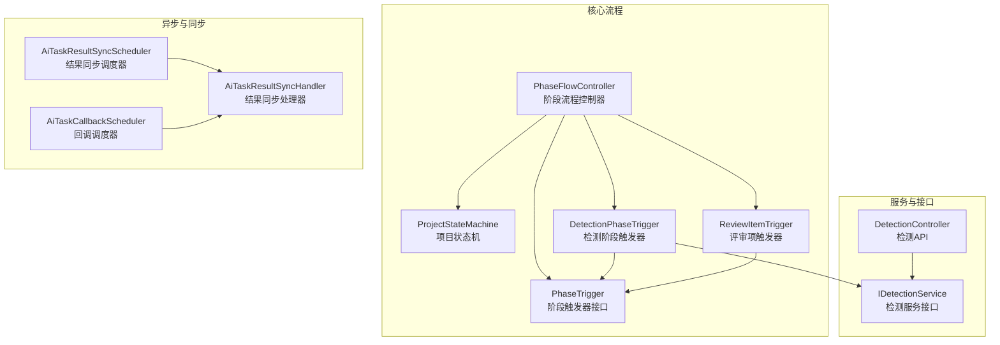
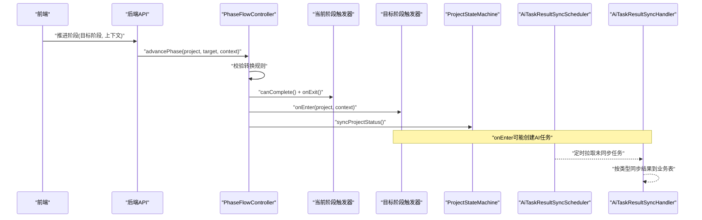
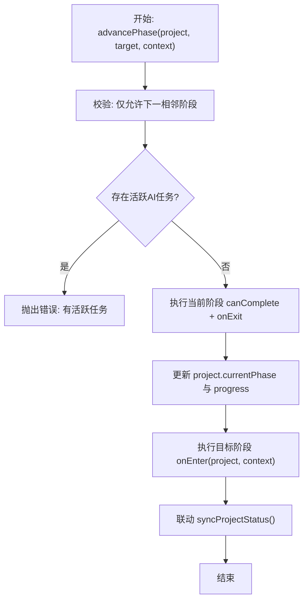
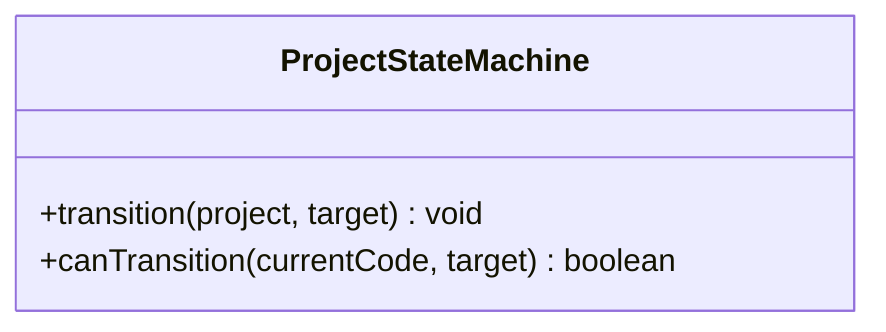
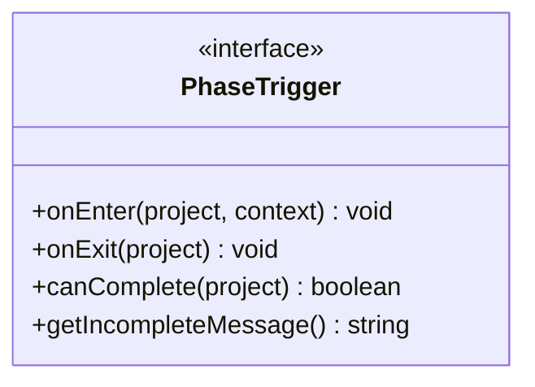
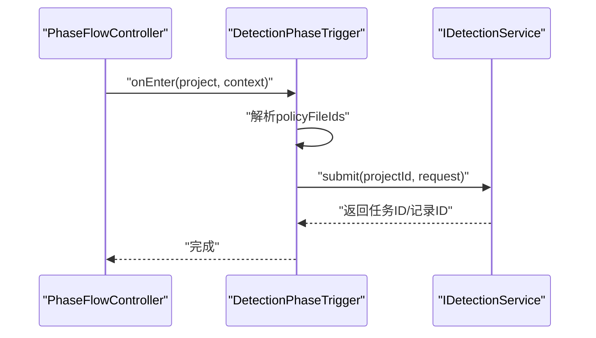
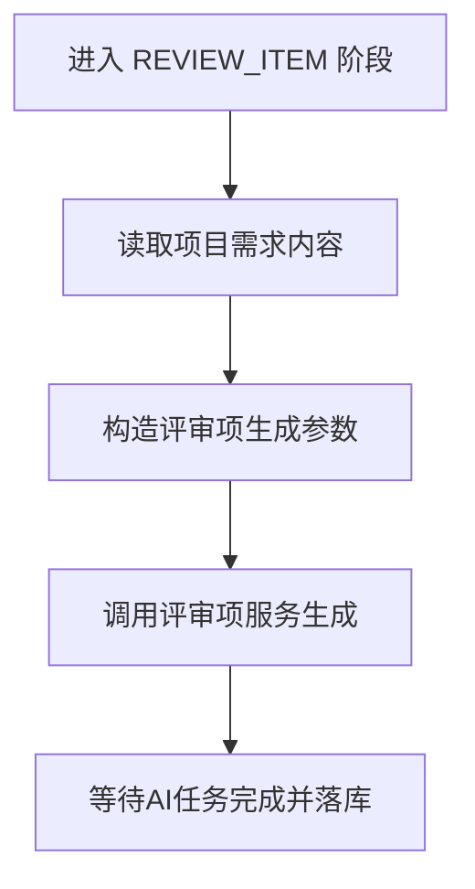
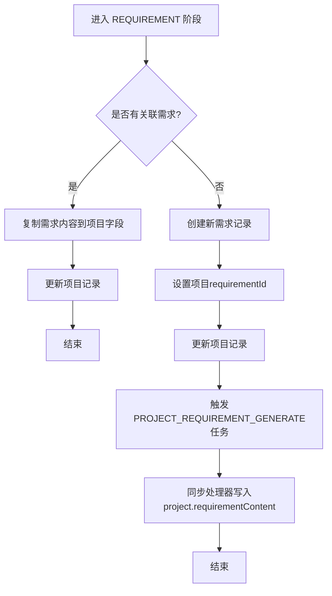
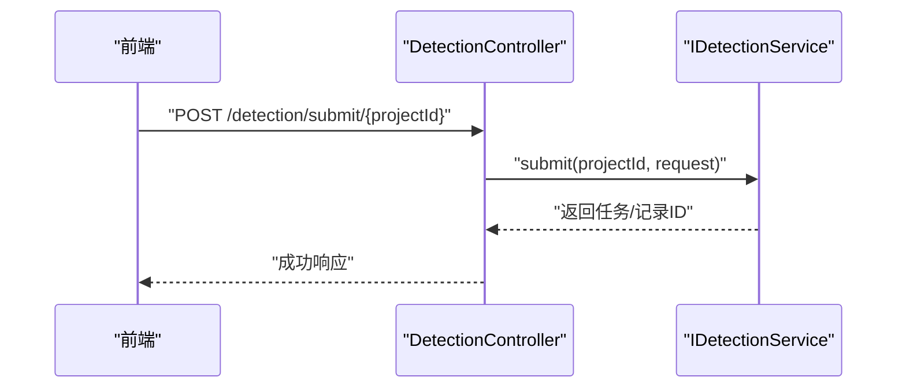
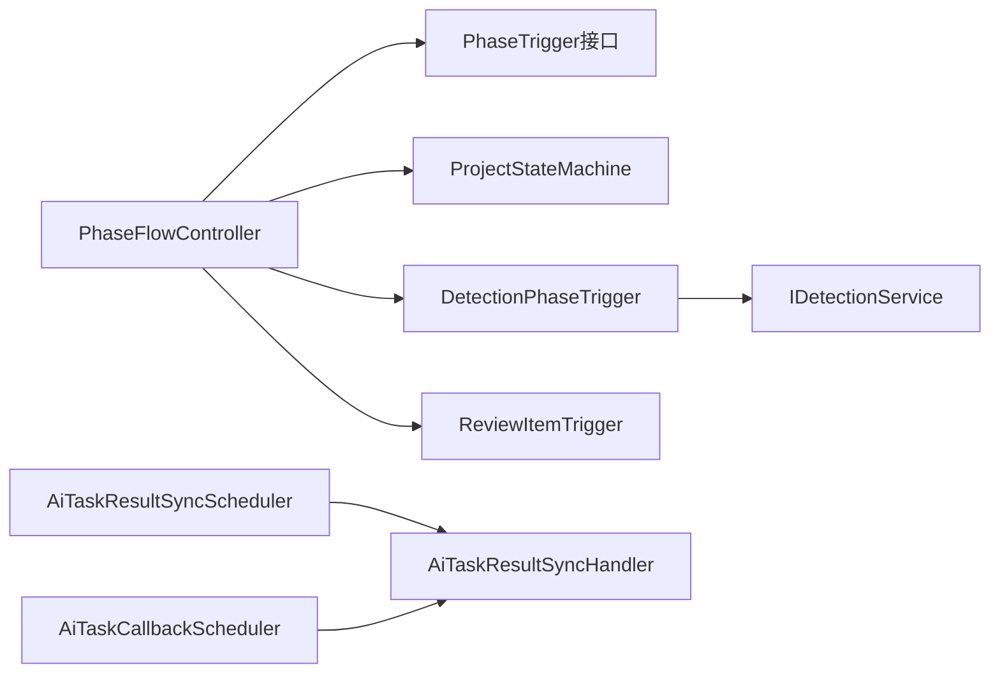

# 业务流程编排

<cite>
**本文引用的文件**   
- [PhaseFlowController.java](file://ele-ai-tender-system/ele-ai-tender-core/src/main/java/com/jy/eleaitender/core/statemachine/PhaseFlowController.java)
- [ProjectStateMachine.java](file://ele-ai-tender-system/ele-ai-tender-core/src/main/java/com/jy/eleaitender/core/statemachine/ProjectStateMachine.java)
- [PhaseTrigger.java](file://ele-ai-tender-system/ele-ai-tender-core/src/main/java/com/jy/eleaitender/core/statemachine/PhaseTrigger.java)
- [DetectionPhaseTrigger.java](file://ele-ai-tender-system/ele-ai-tender-core/src/main/java/com/jy/eleaitender/core/statemachine/trigger/DetectionPhaseTrigger.java)
- [ReviewItemTrigger.java](file://ele-ai-tender-system/ele-ai-tender-core/src/main/java/com/jy/eleaitender/core/statemachine/trigger/ReviewItemTrigger.java)
- [AiTaskResultSyncHandler.java](file://ele-ai-tender-system/ele-ai-tender-core/src/main/java/com/jy/eleaitender/core/scheduler/AiTaskResultSyncHandler.java)
- [AiTaskResultSyncScheduler.java](file://ele-ai-tender-system/ele-ai-tender-core/src/main/java/com/jy/eleaitender/core/scheduler/AiTaskResultSyncScheduler.java)
- [AiTaskCallbackScheduler.java](file://ele-ai-tender-system/ele-ai-tender-core/src/main/java/com/jy/eleaitender/core/scheduler/AiTaskCallbackScheduler.java)
- [IDetectionService.java](file://ele-ai-tender-system/ele-ai-tender-core/src/main/java/com/jy/eleaitender/core/service/IDetectionService.java)
- [DetectionController.java](file://ele-ai-tender-system/ele-ai-tender-core/src/main/java/com/jy/eleaitender/core/controller/DetectionController.java)
- [PHASE_FLOW_SPEC.md](file://docs/rules/PHASE_FLOW_SPEC.md)
- [CORE_MODULE_SPEC.md](file://docs/rules/CORE_MODULE_SPEC.md)
</cite>

## 目录
1. [简介](#简介)
2. [项目结构](#项目结构)
3. [核心组件](#核心组件)
4. [架构总览](#架构总览)
5. [详细组件分析](#详细组件分析)
6. [依赖关系分析](#依赖关系分析)
7. [性能与可靠性](#性能与可靠性)
8. [故障排查指南](#故障排查指南)
9. [结论](#结论)
10. [附录](#附录)

## 简介
本技术文档围绕“业务流程编排”主题，聚焦于状态机模式在项目生命周期管理中的应用。内容涵盖：
- 项目阶段定义、状态转换规则、触发器机制
- PhaseFlowController 的流程控制实现（推进、回退、跳转等复杂场景）
- 关键触发器（BasicInfoTrigger、DetectionPhaseTrigger、RequirementTrigger、ReviewItemTrigger 等）的作用与执行时机
- 异步任务调度与结果同步机制（定时任务、失败重试、异常处理）

## 项目结构
本项目采用模块化分层设计，核心流程编排位于 core 模块的 statemachine 包中，配合 scheduler 中的定时任务完成 AI 任务结果的最终落库与业务联动。

图表来源
- [PhaseFlowController.java:1-176](file://ele-ai-tender-system/ele-ai-tender-core/src/main/java/com/jy/eleaitender/core/statemachine/PhaseFlowController.java#L1-L176)
- [ProjectStateMachine.java:1-60](file://ele-ai-tender-system/ele-ai-tender-core/src/main/java/com/jy/eleaitender/core/statemachine/ProjectStateMachine.java#L1-L60)
- [PhaseTrigger.java:1-39](file://ele-ai-tender-system/ele-ai-tender-core/src/main/java/com/jy/eleaitender/core/statemachine/PhaseTrigger.java#L1-L39)
- [DetectionPhaseTrigger.java:1-71](file://ele-ai-tender-system/ele-ai-tender-core/src/main/java/com/jy/eleaitender/core/statemachine/trigger/DetectionPhaseTrigger.java#L1-L71)
- [ReviewItemTrigger.java:1-40](file://ele-ai-tender-system/ele-ai-tender-core/src/main/java/com/jy/eleaitender/core/statemachine/trigger/ReviewItemTrigger.java#L1-L40)
- [AiTaskResultSyncScheduler.java:1-47](file://ele-ai-tender-system/ele-ai-tender-core/src/main/java/com/jy/eleaitender/core/scheduler/AiTaskResultSyncScheduler.java#L1-L47)
- [AiTaskResultSyncHandler.java:1-766](file://ele-ai-tender-system/ele-ai-tender-core/src/main/java/com/jy/eleaitender/core/scheduler/AiTaskResultSyncHandler.java#L1-L766)
- [AiTaskCallbackScheduler.java:1-35](file://ele-ai-tender-system/ele-ai-tender-core/src/main/java/com/jy/eleaitender/core/scheduler/AiTaskCallbackScheduler.java#L1-L35)
- [IDetectionService.java:1-58](file://ele-ai-tender-system/ele-ai-tender-core/src/main/java/com/jy/eleaitender/core/service/IDetectionService.java#L1-L58)
- [DetectionController.java:1-37](file://ele-ai-tender-system/ele-ai-tender-core/src/main/java/com/jy/eleaitender/core/controller/DetectionController.java#L1-L37)

章节来源
- [PHASE_FLOW_SPEC.md:1-206](file://docs/rules/PHASE_FLOW_SPEC.md#L1-L206)
- [CORE_MODULE_SPEC.md:155-195](file://docs/rules/CORE_MODULE_SPEC.md#L155-L195)

## 核心组件
- 阶段流程控制器（PhaseFlowController）
  - 负责注册各阶段触发器、校验阶段转换、执行 onExit/onEnter、联动 ProjectStatus
- 项目状态机（ProjectStateMachine）
  - 定义合法的状态转换集合，提供 transition/canTransition 能力
- 阶段触发器接口（PhaseTrigger）
  - 统一入口：onEnter/onExit/canComplete/getIncompleteMessage
- 具体触发器
  - DetectionPhaseTrigger：进入检测阶段自动提交检测
  - ReviewItemTrigger：进入评审项阶段自动触发评审项生成
  - BasicInfoTrigger / RequirementTrigger / DocumentTrigger：分别对应基础信息、需求、文档集成阶段的自动化逻辑
- 异步任务与结果同步
  - AiTaskResultSyncScheduler：定时扫描未同步的终态任务
  - AiTaskResultSyncHandler：按任务类型分发到不同业务表并做幂等与容错处理
  - AiTaskCallbackScheduler：外部回调推送的定时调度

章节来源
- [PhaseFlowController.java:1-176](file://ele-ai-tender-system/ele-ai-tender-core/src/main/java/com/jy/eleaitender/core/statemachine/PhaseFlowController.java#L1-L176)
- [ProjectStateMachine.java:1-60](file://ele-ai-tender-system/ele-ai-tender-core/src/main/java/com/jy/eleaitender/core/statemachine/ProjectStateMachine.java#L1-L60)
- [PhaseTrigger.java:1-39](file://ele-ai-tender-system/ele-ai-tender-core/src/main/java/com/jy/eleaitender/core/statemachine/PhaseTrigger.java#L1-L39)
- [DetectionPhaseTrigger.java:1-71](file://ele-ai-tender-system/ele-ai-tender-core/src/main/java/com/jy/eleaitender/core/statemachine/trigger/DetectionPhaseTrigger.java#L1-L71)
- [ReviewItemTrigger.java:1-40](file://ele-ai-tender-system/ele-ai-tender-core/src/main/java/com/jy/eleaitender/core/statemachine/trigger/ReviewItemTrigger.java#L1-L40)
- [AiTaskResultSyncScheduler.java:1-47](file://ele-ai-tender-system/ele-ai-tender-core/src/main/java/com/jy/eleaitender/core/scheduler/AiTaskResultSyncScheduler.java#L1-L47)
- [AiTaskResultSyncHandler.java:1-766](file://ele-ai-tender-system/ele-ai-tender-core/src/main/java/com/jy/eleaitender/core/scheduler/AiTaskResultSyncHandler.java#L1-L766)
- [AiTaskCallbackScheduler.java:1-35](file://ele-ai-tender-system/ele-ai-tender-core/src/main/java/com/jy/eleaitender/core/scheduler/AiTaskCallbackScheduler.java#L1-L35)

## 架构总览
整体流程以“阶段推进”为驱动，结合“状态机约束”和“触发器扩展点”，并通过“异步任务+定时同步”保障最终一致性。

图表来源
- [PhaseFlowController.java:57-96](file://ele-ai-tender-system/ele-ai-tender-core/src/main/java/com/jy/eleaitender/core/statemachine/PhaseFlowController.java#L57-L96)
- [ProjectStateMachine.java:37-45](file://ele-ai-tender-system/ele-ai-tender-core/src/main/java/com/jy/eleaitender/core/statemachine/ProjectStateMachine.java#L37-L45)
- [AiTaskResultSyncScheduler.java:29-47](file://ele-ai-tender-system/ele-ai-tender-core/src/main/java/com/jy/eleaitender/core/scheduler/AiTaskResultSyncScheduler.java#L29-L47)
- [AiTaskResultSyncHandler.java:75-104](file://ele-ai-tender-system/ele-ai-tender-core/src/main/java/com/jy/eleaitender/core/scheduler/AiTaskResultSyncHandler.java#L75-L104)

## 详细组件分析

### 阶段流程控制器（PhaseFlowController）
职责与要点
- 维护各阶段触发器映射，提供 advancePhase/canAdvance 等能力
- 严格限制阶段只能顺序推进到下一阶段，禁止跳跃或倒退
- 在推进前检查是否存在活跃AI任务，避免并发冲突
- 执行当前阶段 onExit 校验与清理，再执行目标阶段 onEnter 自动化
- 联动更新项目状态，确保 Phase 与 Status 一致

图表来源
- [PhaseFlowController.java:57-96](file://ele-ai-tender-system/ele-ai-tender-core/src/main/java/com/jy/eleaitender/core/statemachine/PhaseFlowController.java#L57-L96)
- [PhaseFlowController.java:113-126](file://ele-ai-tender-system/ele-ai-tender-core/src/main/java/com/jy/eleaitender/core/statemachine/PhaseFlowController.java#L113-L126)
- [PhaseFlowController.java:134-167](file://ele-ai-tender-system/ele-ai-tender-core/src/main/java/com/jy/eleaitender/core/statemachine/PhaseFlowController.java#L134-L167)

章节来源
- [PhaseFlowController.java:1-176](file://ele-ai-tender-system/ele-ai-tender-core/src/main/java/com/jy/eleaitender/core/statemachine/PhaseFlowController.java#L1-L176)

### 项目状态机（ProjectStateMachine）
职责与要点
- 集中定义所有合法状态转换集合
- 对外暴露 transition/canTransition，供控制器与服务层调用
- 非法转换直接抛出业务异常，保证状态流转强约束

图表来源
- [ProjectStateMachine.java:19-59](file://ele-ai-tender-system/ele-ai-tender-core/src/main/java/com/jy/eleaitender/core/statemachine/ProjectStateMachine.java#L19-L59)

章节来源
- [ProjectStateMachine.java:1-60](file://ele-ai-tender-system/ele-ai-tender-core/src/main/java/com/jy/eleaitender/core/statemachine/ProjectStateMachine.java#L1-L60)

### 阶段触发器接口（PhaseTrigger）
职责与要点
- 统一抽象：onEnter/onExit/canComplete/getIncompleteMessage
- 默认实现为空方法，便于按需覆盖
- 作为扩展点，各阶段通过实现类注入业务逻辑

图表来源
- [PhaseTrigger.java:11-39](file://ele-ai-tender-system/ele-ai-tender-core/src/main/java/com/jy/eleaitender/core/statemachine/PhaseTrigger.java#L11-L39)

章节来源
- [PhaseTrigger.java:1-39](file://ele-ai-tender-system/ele-ai-tender-core/src/main/java/com/jy/eleaitender/core/statemachine/PhaseTrigger.java#L1-L39)

### 智能检测阶段触发器（DetectionPhaseTrigger）
职责与要点
- 进入检测阶段时从 context 提取 policyFileIds
- 构建 DetectionSubmitRequest 并调用 IDetectionService.submit
- canComplete 要求项目状态为 DETECTION_PASSED 或 DETECTION_SKIPPED

图表来源
- [DetectionPhaseTrigger.java:27-57](file://ele-ai-tender-system/ele-ai-tender-core/src/main/java/com/jy/eleaitender/core/statemachine/trigger/DetectionPhaseTrigger.java#L27-L57)
- [IDetectionService.java:17-17](file://ele-ai-tender-system/ele-ai-tender-core/src/main/java/com/jy/eleaitender/core/service/IDetectionService.java#L17-L17)

章节来源
- [DetectionPhaseTrigger.java:1-71](file://ele-ai-tender-system/ele-ai-tender-core/src/main/java/com/jy/eleaitender/core/statemachine/trigger/DetectionPhaseTrigger.java#L1-L71)
- [IDetectionService.java:1-58](file://ele-ai-tender-system/ele-ai-tender-core/src/main/java/com/jy/eleaitender/core/service/IDetectionService.java#L1-L58)

### 评审项阶段触发器（ReviewItemTrigger）
职责与要点
- 进入评审项阶段时，基于项目需求内容触发评审项生成
- 可读取需求内容并构造参数，交由评审项服务处理

图表来源
- [ReviewItemTrigger.java:36-40](file://ele-ai-tender-system/ele-ai-tender-core/src/main/java/com/jy/eleaitender/core/statemachine/trigger/ReviewItemTrigger.java#L36-L40)

章节来源
- [ReviewItemTrigger.java:1-40](file://ele-ai-tender-system/ele-ai-tender-core/src/main/java/com/jy/eleaitender/core/statemachine/trigger/ReviewItemTrigger.java#L1-L40)

### 需求阶段触发器（RequirementTrigger）
职责与要点
- 进入需求阶段时：若已有关联需求则复制内容到项目字段；若无关联则创建需求并触发 PROJECT_REQUIREMENT_GENERATE
- canComplete 校验 requirementId 或 requirementContent 非空
- AI 结果由同步处理器写入 project.requirementContent

图表来源
- [PHASE_FLOW_SPEC.md:93-106](file://docs/rules/PHASE_FLOW_SPEC.md#L93-L106)
- [PHASE_FLOW_SPEC.md:115-131](file://docs/rules/PHASE_FLOW_SPEC.md#L115-L131)
- [AiTaskResultSyncHandler.java:134-157](file://ele-ai-tender-system/ele-ai-tender-core/src/main/java/com/jy/eleaitender/core/scheduler/AiTaskResultSyncHandler.java#L134-L157)

章节来源
- [PHASE_FLOW_SPEC.md:87-132](file://docs/rules/PHASE_FLOW_SPEC.md#L87-L132)
- [AiTaskResultSyncHandler.java:134-157](file://ele-ai-tender-system/ele-ai-tender-core/src/main/java/com/jy/eleaitender/core/scheduler/AiTaskResultSyncHandler.java#L134-L157)

### 基础信息与文档集成触发器（BasicInfoTrigger / DocumentTrigger）
职责与要点
- BasicInfoTrigger：基础信息录入阶段的完成校验（如项目名称、类别、类型非空）
- DocumentTrigger：进入文档集成阶段时创建 DOCUMENT_INTEGRATION 任务，完成后由同步处理器回填 generatedFileId

章节来源
- [PHASE_FLOW_SPEC.md:29-35](file://docs/rules/PHASE_FLOW_SPEC.md#L29-L35)
- [AiTaskResultSyncHandler.java:534-583](file://ele-ai-tender-system/ele-ai-tender-core/src/main/java/com/jy/eleaitender/core/scheduler/AiTaskResultSyncHandler.java#L534-L583)

### 检测流程与API
职责与要点
- DetectionController 暴露检测相关API（提交、进度、报告、接受/拒绝建议、跳过、重试）
- IDetectionService 定义检测领域能力边界，submit 负责创建检测记录、提交AI任务、更新状态为 DETECTING

图表来源
- [DetectionController.java:27-33](file://ele-ai-tender-system/ele-ai-tender-core/src/main/java/com/jy/eleaitender/core/controller/DetectionController.java#L27-L33)
- [IDetectionService.java:17-17](file://ele-ai-tender-system/ele-ai-tender-core/src/main/java/com/jy/eleaitender/core/service/IDetectionService.java#L17-L17)

章节来源
- [DetectionController.java:1-37](file://ele-ai-tender-system/ele-ai-tender-core/src/main/java/com/jy/eleaitender/core/controller/DetectionController.java#L1-L37)
- [IDetectionService.java:1-58](file://ele-ai-tender-system/ele-ai-tender-core/src/main/java/com/jy/eleaitender/core/service/IDetectionService.java#L1-L58)

## 依赖关系分析
- PhaseFlowController 依赖 PhaseTrigger 接口与各具体触发器实现
- PhaseFlowController 使用 ProjectStateMachine 进行状态转换
- DetectionPhaseTrigger 依赖 IDetectionService 提交检测
- 异步任务由 AiTaskResultSyncScheduler 定时拉取，并由 AiTaskResultSyncHandler 分发处理
- 外部回调由 AiTaskCallbackScheduler 定期处理

图表来源
- [PhaseFlowController.java:24-27](file://ele-ai-tender-system/ele-ai-tender-core/src/main/java/com/jy/eleaitender/core/statemachine/PhaseFlowController.java#L24-L27)
- [DetectionPhaseTrigger.java:24-25](file://ele-ai-tender-system/ele-ai-tender-core/src/main/java/com/jy/eleaitender/core/statemachine/trigger/DetectionPhaseTrigger.java#L24-L25)
- [AiTaskResultSyncScheduler.java:20-24](file://ele-ai-tender-system/ele-ai-tender-core/src/main/java/com/jy/eleaitender/core/scheduler/AiTaskResultSyncScheduler.java#L20-L24)
- [AiTaskCallbackScheduler.java:18-19](file://ele-ai-tender-system/ele-ai-tender-core/src/main/java/com/jy/eleaitender/core/scheduler/AiTaskCallbackScheduler.java#L18-L19)

章节来源
- [PhaseFlowController.java:1-176](file://ele-ai-tender-system/ele-ai-tender-core/src/main/java/com/jy/eleaitender/core/statemachine/PhaseFlowController.java#L1-L176)
- [DetectionPhaseTrigger.java:1-71](file://ele-ai-tender-system/ele-ai-tender-core/src/main/java/com/jy/eleaitender/core/statemachine/trigger/DetectionPhaseTrigger.java#L1-L71)
- [AiTaskResultSyncScheduler.java:1-47](file://ele-ai-tender-system/ele-ai-tender-core/src/main/java/com/jy/eleaitender/core/scheduler/AiTaskResultSyncScheduler.java#L1-L47)
- [AiTaskCallbackScheduler.java:1-35](file://ele-ai-tender-system/ele-ai-tender-core/src/main/java/com/jy/eleaitender/core/scheduler/AiTaskCallbackScheduler.java#L1-L35)

## 性能与可靠性
- 阶段推进前检查活跃AI任务，避免并发冲突与重复推进
- 触发器 onEnter 中调用外部服务需 try-catch 包裹，失败不阻塞阶段推进，前端轮询任务状态
- 定时任务采用固定延迟策略，批量拉取未同步任务并进行幂等标记（markSyncing/markSynced）
- 同步处理器对未知任务类型、空结果、非终态等情况做防护，避免阻塞主流程
- 检测失败后的重试必须走状态机，不允许直接设值，保证状态一致性

章节来源
- [PhaseFlowController.java:66-69](file://ele-ai-tender-system/ele-ai-tender-core/src/main/java/com/jy/eleaitender/core/statemachine/PhaseFlowController.java#L66-L69)
- [PHASE_FLOW_SPEC.md:173-183](file://docs/rules/PHASE_FLOW_SPEC.md#L173-L183)
- [AiTaskResultSyncScheduler.java:29-47](file://ele-ai-tender-system/ele-ai-tender-core/src/main/java/com/jy/eleaitender/core/scheduler/AiTaskResultSyncScheduler.java#L29-L47)
- [AiTaskResultSyncHandler.java:75-104](file://ele-ai-tender-system/ele-ai-tender-core/src/main/java/com/jy/eleaitender/core/scheduler/AiTaskResultSyncHandler.java#L75-L104)
- [PHASE_FLOW_SPEC.md:185-191](file://docs/rules/PHASE_FLOW_SPEC.md#L185-L191)

## 故障排查指南
- 阶段推进失败“不允许跳转”：检查 currentPhase 与 targetPhase 是否为相邻阶段
- 阶段推进失败“当前阶段尚未完成”：核对对应触发器的 canComplete 条件
- 需求阶段内容为空：确认 requirementId 是否存在且 content 非空，或检查 PROJECT_REQUIREMENT_GENERATE 任务状态
- 需求阶段后内容丢失：确认 project.requirementContent 是否被写入
- 评审项生成缺少需求内容：检查 project.requirement_content 是否为空
- AI任务未自动触发：查看触发器 onEnter 日志，检查 Service 是否异常
- Status 与 Phase 不一致：查 PhaseFlowController.syncProjectStatus 日志
- 循环依赖报错：检查 @Lazy 注解是否遗漏
- 检测重试后状态不对：检查 retry() 是否走了状态机而非直接设值

章节来源
- [PHASE_FLOW_SPEC.md:193-206](file://docs/rules/PHASE_FLOW_SPEC.md#L193-L206)

## 结论
本项目通过“阶段控制器 + 状态机 + 触发器 + 异步任务同步”的组合，实现了高内聚、低耦合的业务流程编排。阶段推进具备强约束与可扩展性，异步任务与定时同步保障了最终一致性，整体架构清晰、可维护性强。

## 附录
- 阶段与状态联动参考规范
  - 阶段定义与触发器行为见 PHASE_FLOW_SPEC.md
  - 项目状态流转与核心约束见 CORE_MODULE_SPEC.md

章节来源
- [PHASE_FLOW_SPEC.md:1-206](file://docs/rules/PHASE_FLOW_SPEC.md#L1-L206)
- [CORE_MODULE_SPEC.md:155-195](file://docs/rules/CORE_MODULE_SPEC.md#L155-L195)