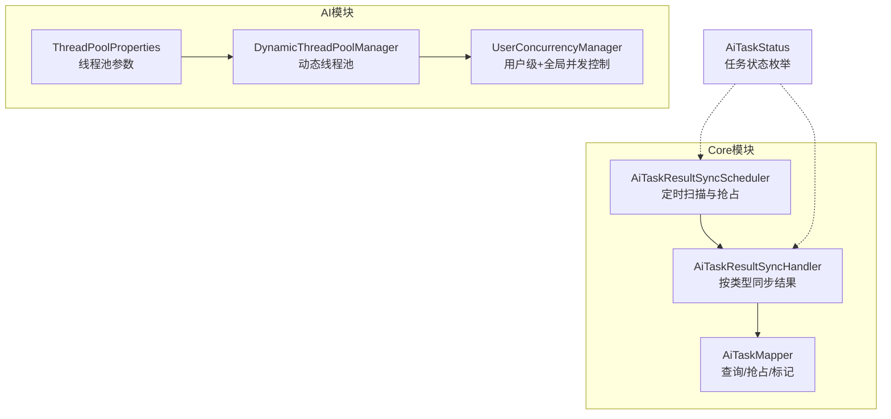
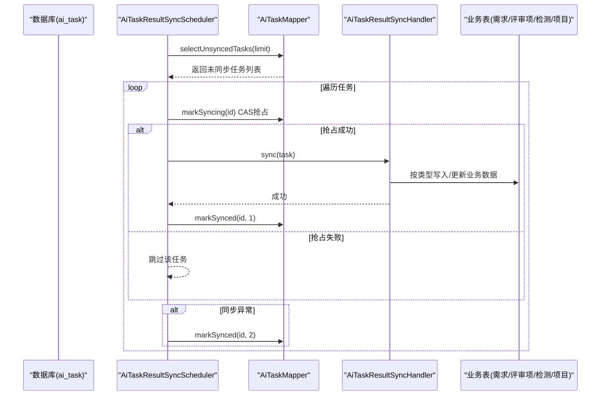
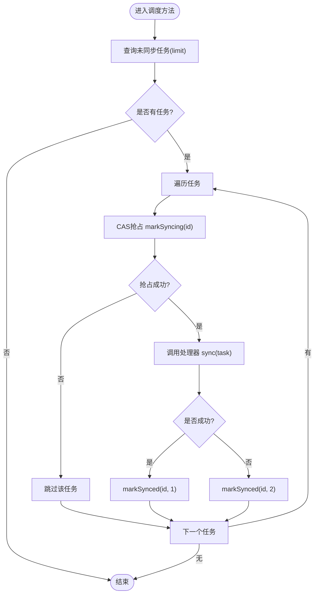
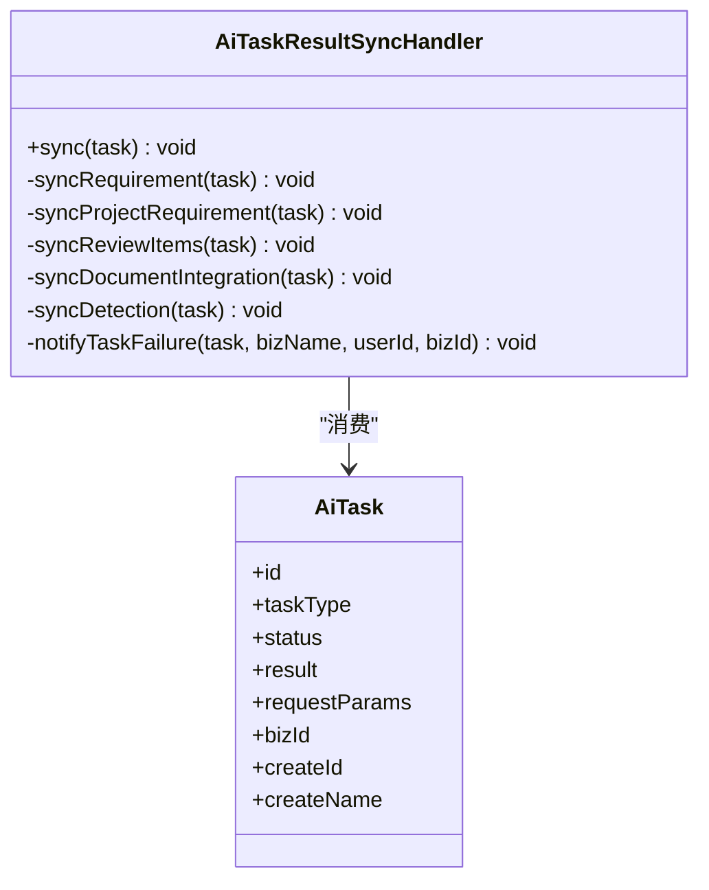
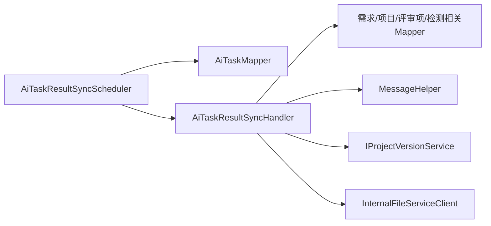

# 任务调度器

<cite>
**本文引用的文件**   
- [AiTaskResultSyncScheduler.java](file://ele-ai-tender-system/ele-ai-tender-core/src/main/java/com/jy/eleaitender/core/scheduler/AiTaskResultSyncScheduler.java)
- [AiTaskResultSyncHandler.java](file://ele-ai-tender-system/ele-ai-tender-core/src/main/java/com/jy/eleaitender/core/scheduler/AiTaskResultSyncHandler.java)
- [AiTaskMapper.java](file://ele-ai-tender-system/ele-ai-tender-core/src/main/java/com/jy/eleaitender/core/mapper/AiTaskMapper.java)
- [ThreadPoolProperties.java](file://ele-ai-tender-system/ele-ai-tender-ai/src/main/java/com/jy/eleaitender/ai/config/ThreadPoolProperties.java)
- [DynamicThreadPoolManager.java](file://ele-ai-tender-system/ele-ai-tender-ai/src/main/java/com/jy/eleaitender/ai/threadpool/DynamicThreadPoolManager.java)
- [UserConcurrencyManager.java](file://ele-ai-tender-system/ele-ai-tender-ai/src/main/java/com/jy/eleaitender/ai/threadpool/UserConcurrencyManager.java)
- [AiTaskStatus.java](file://ele-ai-tender-system/ele-ai-tender-common/src/main/java/com/jy/eleaitender/common/enums/AiTaskStatus.java)
- [AiTaskResultSyncSchedulerTest.java](file://ele-ai-tender-system/ele-ai-tender-core/src/test/java/com/jy/eleaitender/core/scheduler/AiTaskResultSyncSchedulerTest.java)
- [AiTaskResultSyncHandlerTest.java](file://ele-ai-tender-system/ele-ai-tender-core/src/test/java/com/jy/eleaitender/core/scheduler/AiTaskResultSyncHandlerTest.java)
</cite>

## 目录
1. [简介](#简介)
2. [项目结构](#项目结构)
3. [核心组件](#核心组件)
4. [架构总览](#架构总览)
5. [详细组件分析](#详细组件分析)
6. [依赖关系分析](#依赖关系分析)
7. [性能与配置](#性能与配置)
8. [故障排查指南](#故障排查指南)
9. [结论](#结论)

## 简介
本技术文档围绕AI任务调度器的异步任务调度与结果同步机制展开，重点说明定时扫描、任务分发、结果回调、失败重试、分布式抢占与冲突解决等关键能力。文档深入解析 AiTaskResultSyncScheduler 的调度策略与 AiTaskResultSyncHandler 的处理逻辑，并给出任务状态管理、生命周期流转、分布式协调、线程池与限流配置以及排障建议，帮助开发者理解与维护该任务调度系统。

## 项目结构
与任务调度相关的核心代码位于 core 模块的 scheduler 包与 mapper 包，以及 ai 模块的动态线程池与并发控制组件。整体职责划分如下：
- 调度层：定时扫描终态未同步任务，进行分布式抢占与分发处理
- 处理层：按任务类型将 AI 任务结果同步到业务表（需求、评审项、检测记录、文档集成）
- 数据访问层：提供查询未同步任务、CAS抢占、标记同步状态的SQL接口
- 执行资源层：动态线程池与用户级/全局并发控制，支撑AI任务的执行与限流

图表来源
- [AiTaskResultSyncScheduler.java:1-64](file://ele-ai-tender-system/ele-ai-tender-core/src/main/java/com/jy/eleaitender/core/scheduler/AiTaskResultSyncScheduler.java#L1-L64)
- [AiTaskResultSyncHandler.java:1-766](file://ele-ai-tender-system/ele-ai-tender-core/src/main/java/com/jy/eleaitender/core/scheduler/AiTaskResultSyncHandler.java#L1-L766)
- [AiTaskMapper.java:1-104](file://ele-ai-tender-system/ele-ai-tender-core/src/main/java/com/jy/eleaitender/core/mapper/AiTaskMapper.java#L1-L104)
- [ThreadPoolProperties.java:1-39](file://ele-ai-tender-system/ele-ai-tender-ai/src/main/java/com/jy/eleaitender/ai/config/ThreadPoolProperties.java#L1-L39)
- [DynamicThreadPoolManager.java:1-175](file://ele-ai-tender-system/ele-ai-tender-ai/src/main/java/com/jy/eleaitender/ai/threadpool/DynamicThreadPoolManager.java#L1-L175)
- [UserConcurrencyManager.java:1-130](file://ele-ai-tender-system/ele-ai-tender-ai/src/main/java/com/jy/eleaitender/ai/threadpool/UserConcurrencyManager.java#L1-L130)
- [AiTaskStatus.java:1-46](file://ele-ai-tender-system/ele-ai-tender-common/src/main/java/com/jy/eleaitender/common/enums/AiTaskStatus.java#L1-L46)

章节来源
- [AiTaskResultSyncScheduler.java:1-64](file://ele-ai-tender-system/ele-ai-tender-core/src/main/java/com/jy/eleaitender/core/scheduler/AiTaskResultSyncScheduler.java#L1-L64)
- [AiTaskResultSyncHandler.java:1-766](file://ele-ai-tender-system/ele-ai-tender-core/src/main/java/com/jy/eleaitender/core/scheduler/AiTaskResultSyncHandler.java#L1-L766)
- [AiTaskMapper.java:1-104](file://ele-ai-tender-system/ele-ai-tender-core/src/main/java/com/jy/eleaitender/core/mapper/AiTaskMapper.java#L1-L104)
- [ThreadPoolProperties.java:1-39](file://ele-ai-tender-system/ele-ai-tender-ai/src/main/java/com/jy/eleaitender/ai/config/ThreadPoolProperties.java#L1-L39)
- [DynamicThreadPoolManager.java:1-175](file://ele-ai-tender-system/ele-ai-tender-ai/src/main/java/com/jy/eleaitender/ai/threadpool/DynamicThreadPoolManager.java#L1-L175)
- [UserConcurrencyManager.java:1-130](file://ele-ai-tender-system/ele-ai-tender-ai/src/main/java/com/jy/eleaitender/ai/threadpool/UserConcurrencyManager.java#L1-L130)
- [AiTaskStatus.java:1-46](file://ele-ai-tender-system/ele-ai-tender-common/src/main/java/com/jy/eleaitender/common/enums/AiTaskStatus.java#L1-L46)

## 核心组件
- AiTaskResultSyncScheduler：每固定间隔扫描“已完成但未同步”的任务，使用数据库CAS抢占避免多实例重复处理；成功则调用处理器同步，失败则标记同步失败状态。
- AiTaskResultSyncHandler：根据任务类型分发到具体同步逻辑（需求生成、项目需求生成、评审项生成、文档集成、检测任务），并在事务内更新业务表、发送通知、联动阶段推进等。
- AiTaskMapper：提供查询未同步任务、CAS抢占、标记同步状态等底层SQL接口，支持跳过数据隔离以适配后台调度场景。
- ThreadPoolProperties / DynamicThreadPoolManager / UserConcurrencyManager：提供可热更新的线程池与并发控制能力，用于AI任务执行阶段的资源管理与限流。
- AiTaskStatus：定义任务状态及是否终态、是否可重试等语义，贯穿调度与处理流程。

章节来源
- [AiTaskResultSyncScheduler.java:1-64](file://ele-ai-tender-system/ele-ai-tender-core/src/main/java/com/jy/eleaitender/core/scheduler/AiTaskResultSyncScheduler.java#L1-L64)
- [AiTaskResultSyncHandler.java:1-766](file://ele-ai-tender-system/ele-ai-tender-core/src/main/java/com/jy/eleaitender/core/scheduler/AiTaskResultSyncHandler.java#L1-L766)
- [AiTaskMapper.java:1-104](file://ele-ai-tender-system/ele-ai-tender-core/src/main/java/com/jy/eleaitender/core/mapper/AiTaskMapper.java#L1-L104)
- [ThreadPoolProperties.java:1-39](file://ele-ai-tender-system/ele-ai-tender-ai/src/main/java/com/jy/eleaitender/ai/config/ThreadPoolProperties.java#L1-L39)
- [DynamicThreadPoolManager.java:1-175](file://ele-ai-tender-system/ele-ai-tender-ai/src/main/java/com/jy/eleaitender/ai/threadpool/DynamicThreadPoolManager.java#L1-L175)
- [UserConcurrencyManager.java:1-130](file://ele-ai-tender-system/ele-ai-tender-ai/src/main/java/com/jy/eleaitender/ai/threadpool/UserConcurrencyManager.java#L1-L130)
- [AiTaskStatus.java:1-46](file://ele-ai-tender-system/ele-ai-tender-common/src/main/java/com/jy/eleaitender/common/enums/AiTaskStatus.java#L1-L46)

## 架构总览
下图展示了从定时扫描到结果同步的端到端流程，包括分布式抢占、事务性同步、失败标记与通知联动。

图表来源
- [AiTaskResultSyncScheduler.java:29-62](file://ele-ai-tender-system/ele-ai-tender-core/src/main/java/com/jy/eleaitender/core/scheduler/AiTaskResultSyncScheduler.java#L29-L62)
- [AiTaskResultSyncHandler.java:75-104](file://ele-ai-tender-system/ele-ai-tender-core/src/main/java/com/jy/eleaitender/core/scheduler/AiTaskResultSyncHandler.java#L75-L104)
- [AiTaskMapper.java:75-101](file://ele-ai-tender-system/ele-ai-tender-core/src/main/java/com/jy/eleaitender/core/mapper/AiTaskMapper.java#L75-L101)

## 详细组件分析

### 调度器：AiTaskResultSyncScheduler
- 调度策略
  - 固定延迟扫描：每固定时间间隔触发一次，批量拉取未同步的终态任务。
  - 批量限制：每次最多拉取固定数量任务，避免单次扫描压力过大。
  - 分布式抢占：通过CAS更新 result_synced 字段实现多实例互斥，抢占失败的实例直接跳过。
  - 失败回退：若同步过程中抛出异常，标记同步失败状态，便于后续人工或自动重试。
- 错误处理
  - 查询异常：捕获并记录日志，当次扫描结束。
  - 同步异常：记录错误日志并标记同步失败状态，确保不阻塞后续任务。
- 幂等性与一致性
  - 通过 result_synced 的状态机（0=未同步，3=抢占中，1=已同步，2=同步失败）保证幂等与可观测性。
  - 对每个任务独立try-catch，单个任务失败不影响其他任务。

图表来源
- [AiTaskResultSyncScheduler.java:29-62](file://ele-ai-tender-system/ele-ai-tender-core/src/main/java/com/jy/eleaitender/core/scheduler/AiTaskResultSyncScheduler.java#L29-L62)
- [AiTaskMapper.java:84-101](file://ele-ai-tender-system/ele-ai-tender-core/src/main/java/com/jy/eleaitender/core/mapper/AiTaskMapper.java#L84-L101)

章节来源
- [AiTaskResultSyncScheduler.java:1-64](file://ele-ai-tender-system/ele-ai-tender-core/src/main/java/com/jy/eleaitender/core/scheduler/AiTaskResultSyncScheduler.java#L1-L64)
- [AiTaskMapper.java:75-101](file://ele-ai-tender-system/ele-ai-tender-core/src/main/java/com/jy/eleaitender/core/mapper/AiTaskMapper.java#L75-L101)
- [AiTaskResultSyncSchedulerTest.java:30-44](file://ele-ai-tender-system/ele-ai-tender-core/src/test/java/com/jy/eleaitender/core/scheduler/AiTaskResultSyncSchedulerTest.java#L30-L44)

### 处理器：AiTaskResultSyncHandler
- 分发逻辑
  - 入口方法在事务边界上，按任务类型路由至对应同步方法。
  - 未知任务类型与SKIPPED状态会快速返回，不阻塞主流程。
- 各类型同步要点
  - 需求生成：校验任务成功状态，解析结果JSON中的内容字段，更新需求内容与进度。
  - 项目需求生成：类似需求生成，但目标为项目实体。
  - 评审项生成：全量覆盖模式，先删除旧评审项，再解析AI返回的树形结构，结合配置插入占位节点、归一化分值、设置创建人上下文，最后按层级顺序入库。
  - 文档集成：解析生成的文件ID，更新项目关联，发送完成通知，并自动创建版本备份。
  - 检测任务：同步状态与结果，注入recordId，尝试填充locationRef，完成后汇总项目级检测状态并驱动项目状态机流转与阶段推进。
- 失败通知
  - 非成功状态时，向业务发起者发送告警通知，包含任务类型、状态与错误原因。
- 事务与一致性
  - 同步入口加事务注解，确保同一任务类型的多次写操作原子性。
  - 对可能的外部依赖（如文件服务）采用容错处理，异常不影响主流程。

图表来源
- [AiTaskResultSyncHandler.java:75-104](file://ele-ai-tender-system/ele-ai-tender-core/src/main/java/com/jy/eleaitender/core/scheduler/AiTaskResultSyncHandler.java#L75-L104)
- [AiTaskResultSyncHandler.java:108-171](file://ele-ai-tender-system/ele-ai-tender-core/src/main/java/com/jy/eleaitender/core/scheduler/AiTaskResultSyncHandler.java#L108-L171)
- [AiTaskResultSyncHandler.java:180-299](file://ele-ai-tender-system/ele-ai-tender-core/src/main/java/com/jy/eleaitender/core/scheduler/AiTaskResultSyncHandler.java#L180-L299)
- [AiTaskResultSyncHandler.java:534-583](file://ele-ai-tender-system/ele-ai-tender-core/src/main/java/com/jy/eleaitender/core/scheduler/AiTaskResultSyncHandler.java#L534-L583)
- [AiTaskResultSyncHandler.java:587-728](file://ele-ai-tender-system/ele-ai-tender-core/src/main/java/com/jy/eleaitender/core/scheduler/AiTaskResultSyncHandler.java#L587-L728)

章节来源
- [AiTaskResultSyncHandler.java:1-766](file://ele-ai-tender-system/ele-ai-tender-core/src/main/java/com/jy/eleaitender/core/scheduler/AiTaskResultSyncHandler.java#L1-L766)
- [AiTaskResultSyncHandlerTest.java:24-45](file://ele-ai-tender-system/ele-ai-tender-core/src/test/java/com/jy/eleaitender/core/scheduler/AiTaskResultSyncHandlerTest.java#L24-L45)
- [AiTaskResultSyncHandlerTest.java:47-102](file://ele-ai-tender-system/ele-ai-tender-core/src/test/java/com/jy/eleaitender/core/scheduler/AiTaskResultSyncHandlerTest.java#L47-L102)
- [AiTaskResultSyncHandlerTest.java:104-163](file://ele-ai-tender-system/ele-ai-tender-core/src/test/java/com/jy/eleaitender/core/scheduler/AiTaskResultSyncHandlerTest.java#L104-L163)

### 数据访问：AiTaskMapper
- 关键接口
  - 查询未同步任务：筛选终态且未同步的任务，按完成时间排序，限制批次大小。
  - 抢占未同步任务：CAS更新 result_synced 为“抢占中”，防止多实例重复处理。
  - 标记同步状态：成功标记为“已同步”，失败标记为“同步失败”。
- 数据隔离
  - 所有接口均跳过数据隔离，适配后台调度无用户上下文的场景。

章节来源
- [AiTaskMapper.java:75-101](file://ele-ai-tender-system/ele-ai-tender-core/src/main/java/com/jy/eleaitender/core/mapper/AiTaskMapper.java#L75-L101)

### 任务状态管理
- 状态定义
  - 待处理、处理中、已完成、失败、AI服务不可用、已跳过。
  - 终态判定与可重试判定由状态枚举提供。
- 生命周期
  - 创建：上游业务创建任务，初始为待处理。
  - 执行：AI侧执行后更新为处理中/已完成/失败/不可用/跳过。
  - 监控：调度器定期扫描终态未同步任务。
  - 结果收集：处理器按类型同步结果到业务表。
  - 状态更新：标记同步状态，前端可据此展示进度与结果。

章节来源
- [AiTaskStatus.java:1-46](file://ele-ai-tender-system/ele-ai-tender-common/src/main/java/com/jy/eleaitender/common/enums/AiTaskStatus.java#L1-L46)

## 依赖关系分析
- 组件耦合
  - Scheduler 依赖 Mapper 与 Handler，职责清晰，低耦合。
  - Handler 依赖多个业务Mapper与服务，体现“按类型聚合”的高内聚设计。
- 外部依赖
  - 文件服务客户端：检测任务完成后尝试填充位置索引。
  - 消息助手：发送文档集成与检测完成通知。
  - 项目版本服务：文档集成成功后自动创建版本快照。
- 潜在循环依赖
  - 当前未发现循环依赖；Handler 仅单向依赖业务服务与Mapper。

图表来源
- [AiTaskResultSyncScheduler.java:1-64](file://ele-ai-tender-system/ele-ai-tender-core/src/main/java/com/jy/eleaitender/core/scheduler/AiTaskResultSyncScheduler.java#L1-L64)
- [AiTaskResultSyncHandler.java:1-766](file://ele-ai-tender-system/ele-ai-tender-core/src/main/java/com/jy/eleaitender/core/scheduler/AiTaskResultSyncHandler.java#L1-L766)
- [AiTaskMapper.java:1-104](file://ele-ai-tender-system/ele-ai-tender-core/src/main/java/com/jy/eleaitender/core/mapper/AiTaskMapper.java#L1-L104)

章节来源
- [AiTaskResultSyncScheduler.java:1-64](file://ele-ai-tender-system/ele-ai-tender-core/src/main/java/com/jy/eleaitender/core/scheduler/AiTaskResultSyncScheduler.java#L1-L64)
- [AiTaskResultSyncHandler.java:1-766](file://ele-ai-tender-system/ele-ai-tender-core/src/main/java/com/jy/eleaitender/core/scheduler/AiTaskResultSyncHandler.java#L1-L766)
- [AiTaskMapper.java:1-104](file://ele-ai-tender-system/ele-ai-tender-core/src/main/java/com/jy/eleaitender/core/mapper/AiTaskMapper.java#L1-L104)

## 性能与配置
- 线程池与并发控制
  - 动态线程池：支持从系统参数表加载核心参数，运行时热更新，队列容量变更重建线程池，其余参数动态调整。
  - 用户级与全局并发：基于信号量控制用户维度与全局维度的并发上限，支持热刷新。
  - 超时控制：任务超时分钟数作为参数之一，配合状态机与定时任务进行超时处理。
- 调度批处理
  - 批量拉取与单任务独立异常处理，避免长尾任务影响整体吞吐。
- 建议配置项（示例）
  - 线程池核心参数：corePoolSize、maxPoolSize、queueCapacity、keepAliveSeconds、taskTimeoutMinutes
  - 并发控制参数：userMaxPendingTasks、userMaxConcurrentTasks、globalMaxPendingTasks、globalMaxConcurrentTasks
  - 注意：上述参数来源于系统参数表，修改后由动态管理器轮询生效。

章节来源
- [ThreadPoolProperties.java:1-39](file://ele-ai-tender-system/ele-ai-tender-ai/src/main/java/com/jy/eleaitender/ai/config/ThreadPoolProperties.java#L1-L39)
- [DynamicThreadPoolManager.java:65-145](file://ele-ai-tender-system/ele-ai-tender-ai/src/main/java/com/jy/eleaitender/ai/threadpool/DynamicThreadPoolManager.java#L65-L145)
- [UserConcurrencyManager.java:57-116](file://ele-ai-tender-system/ele-ai-tender-ai/src/main/java/com/jy/eleaitender/ai/threadpool/UserConcurrencyManager.java#L57-L116)

## 故障排查指南
- 常见问题定位
  - 未同步任务堆积：检查调度器日志与数据库 result_synced 分布，确认是否存在大量“同步失败”状态。
  - 多实例重复处理：确认 CAS 抢占是否生效，查看 markSyncing 返回值是否为0。
  - 同步异常导致失败：查看处理器日志，定位具体类型同步失败原因（如JSON解析、外部服务异常）。
  - 通知未送达：检查消息助手与版本服务的可用性。
- 调试建议
  - 开启详细日志，关注“发现未同步任务”“抢占失败”“同步失败”等关键字。
  - 针对评审项生成，核对请求参数中的 reviewConfig 与AI返回结构是否匹配。
  - 针对检测任务，验证文件服务提取文本与segments是否正确，以便填充locationRef。
- 恢复策略
  - 对于“同步失败”的任务，可人工修正业务数据后重新触发扫描，或增加重试机制（当前通过下次扫描再次尝试）。
  - 若存在死锁或长时间占用，检查数据库连接与事务范围，必要时重启实例清理残留状态。

章节来源
- [AiTaskResultSyncScheduler.java:45-62](file://ele-ai-tender-system/ele-ai-tender-core/src/main/java/com/jy/eleaitender/core/scheduler/AiTaskResultSyncScheduler.java#L45-L62)
- [AiTaskResultSyncHandler.java:732-743](file://ele-ai-tender-system/ele-ai-tender-core/src/main/java/com/jy/eleaitender/core/scheduler/AiTaskResultSyncHandler.java#L732-L743)
- [AiTaskResultSyncHandler.java:603-627](file://ele-ai-tender-system/ele-ai-tender-core/src/main/java/com/jy/eleaitender/core/scheduler/AiTaskResultSyncHandler.java#L603-L627)

## 结论
本任务调度系统通过“定时扫描+CAS抢占+事务性同步”的组合，实现了高可靠的结果同步与分布式协调。处理器按任务类型精细化落地业务数据，并结合通知与状态机推动业务流程。配合动态线程池与并发控制，系统在可扩展性与稳定性方面具备良好表现。建议在上线前完善监控指标与告警规则，并对关键路径进行压测与回归测试，以确保在高负载下的稳定运行。