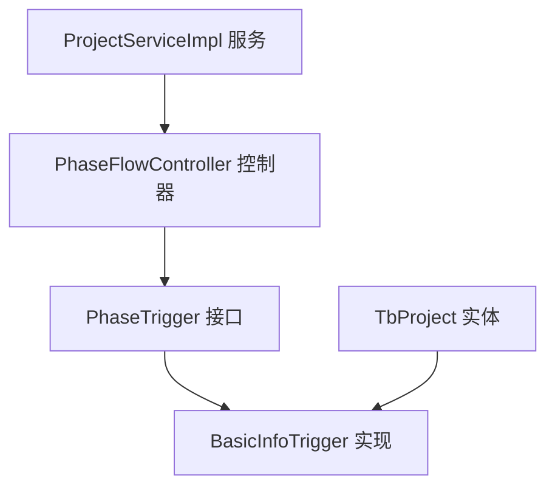
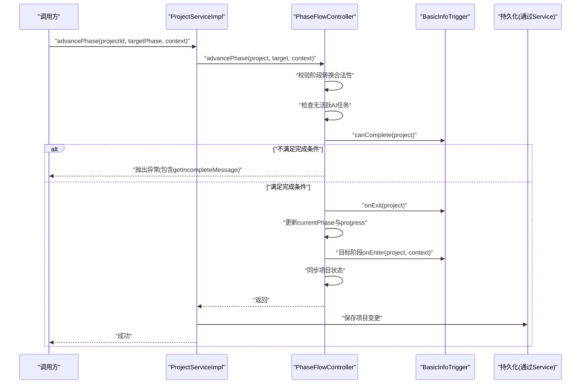
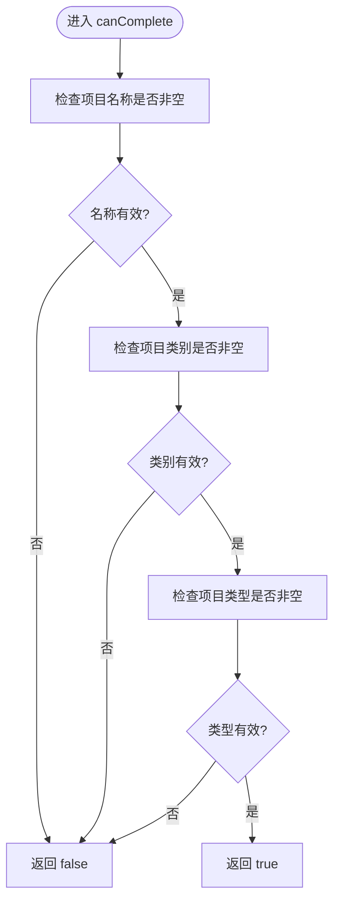
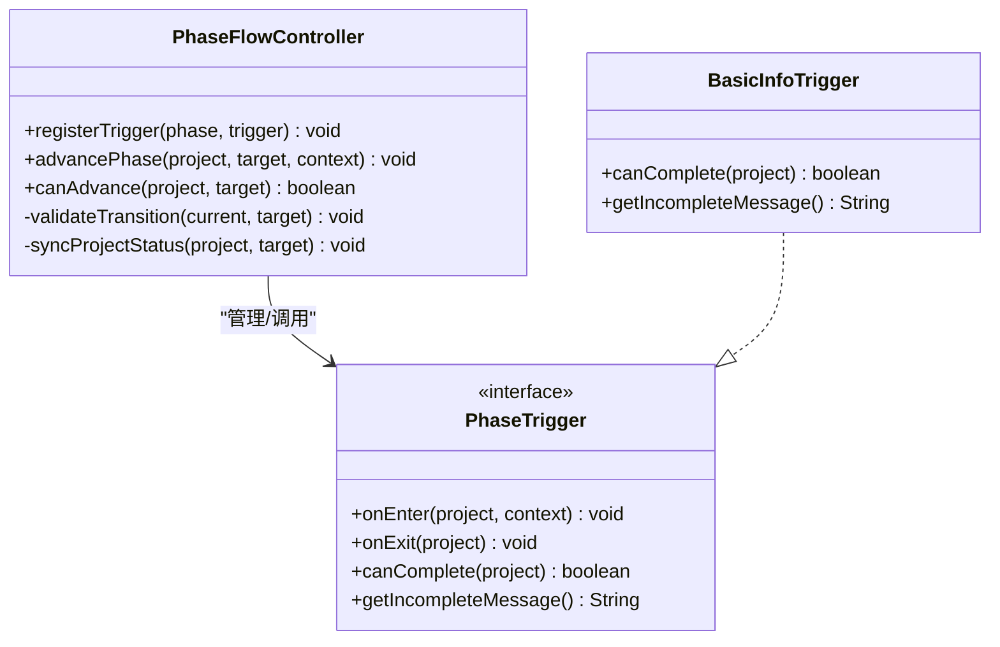
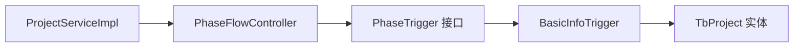

# 基本信息阶段触发器

<cite>
**本文引用的文件**   
- [BasicInfoTrigger.java](file://ele-ai-tender-system/ele-ai-tender-core/src/main/java/com/jy/eleaitender/core/statemachine/trigger/BasicInfoTrigger.java)
- [PhaseTrigger.java](file://ele-ai-tender-system/ele-ai-tender-core/src/main/java/com/jy/eleaitender/core/statemachine/PhaseTrigger.java)
- [PhaseFlowController.java](file://ele-ai-tender-system/ele-ai-tender-core/src/main/java/com/jy/eleaitender/core/statemachine/PhaseFlowController.java)
- [ProjectServiceImpl.java](file://ele-ai-tender-system/ele-ai-tender-core/src/main/java/com/jy/eleaitender/core/service/impl/ProjectServiceImpl.java)
- [TbProject.java](file://ele-ai-tender-system/ele-ai-tender-common/src/main/java/com/jy/eleaitender/common/entity/core/TbProject.java)
</cite>

## 目录
1. [简介](#简介)
2. [项目结构](#项目结构)
3. [核心组件](#核心组件)
4. [架构总览](#架构总览)
5. [详细组件分析](#详细组件分析)
6. [依赖关系分析](#依赖关系分析)
7. [性能与扩展性](#性能与扩展性)
8. [故障排查指南](#故障排查指南)
9. [结论](#结论)
10. [附录：使用示例与最佳实践](#附录使用示例与最佳实践)

## 简介
本文件聚焦“基本信息阶段触发器”的技术实现，围绕 BasicInfoTrigger 的完成条件校验、onEnter/onExit 生命周期钩子、以及其在阶段推进流程中的协作机制进行系统化说明。文档同时给出如何扩展验证规则、新增必填字段、错误处理与用户反馈的实现要点，帮助开发者快速理解并安全地扩展该阶段的业务逻辑。

## 项目结构
- 触发器接口定义位于 statemachine 包中，提供 onEnter/onExit/canComplete/getIncompleteMessage 等生命周期方法。
- 具体阶段触发器（如 BasicInfoTrigger）在 trigger 子包下实现。
- 阶段流程控制器 PhaseFlowController 负责注册触发器、执行阶段推进、调用触发器的 onExit/onEnter 并与项目状态联动。
- 服务层 ProjectServiceImpl 在启动时注册各阶段触发器，并提供 advancePhase 入口以驱动阶段流转。
- 实体 TbProject 承载项目基础信息字段，是触发器校验的核心数据载体。

图表来源
- [PhaseTrigger.java:11-39](file://ele-ai-tender-system/ele-ai-tender-core/src/main/java/com/jy/eleaitender/core/statemachine/PhaseTrigger.java#L11-L39)
- [BasicInfoTrigger.java:13-27](file://ele-ai-tender-system/ele-ai-tender-core/src/main/java/com/jy/eleaitender/core/statemachine/trigger/BasicInfoTrigger.java#L13-L27)
- [PhaseFlowController.java:44-96](file://ele-ai-tender-system/ele-ai-tender-core/src/main/java/com/jy/eleaitender/core/statemachine/PhaseFlowController.java#L44-L96)
- [ProjectServiceImpl.java:75-82](file://ele-ai-tender-system/ele-ai-tender-core/src/main/java/com/jy/eleaitender/core/service/impl/ProjectServiceImpl.java#L75-L82)
- [TbProject.java:22-32](file://ele-ai-tender-system/ele-ai-tender-common/src/main/java/com/jy/eleaitender/common/entity/core/TbProject.java#L22-L32)

章节来源
- [PhaseTrigger.java:11-39](file://ele-ai-tender-system/ele-ai-tender-core/src/main/java/com/jy/eleaitender/core/statemachine/PhaseTrigger.java#L11-L39)
- [BasicInfoTrigger.java:13-27](file://ele-ai-tender-system/ele-ai-tender-core/src/main/java/com/jy/eleaitender/core/statemachine/trigger/BasicInfoTrigger.java#L13-L27)
- [PhaseFlowController.java:44-96](file://ele-ai-tender-system/ele-ai-tender-core/src/main/java/com/jy/eleaitender/core/statemachine/PhaseFlowController.java#L44-L96)
- [ProjectServiceImpl.java:75-82](file://ele-ai-tender-system/ele-ai-tender-core/src/main/java/com/jy/eleaitender/core/service/impl/ProjectServiceImpl.java#L75-L82)
- [TbProject.java:22-32](file://ele-ai-tender-system/ele-ai-tender-common/src/main/java/com/jy/eleaitender/common/entity/core/TbProject.java#L22-L32)

## 核心组件
- PhaseTrigger 接口：定义阶段进入/离开/完成校验的统一契约，默认空实现便于按需覆盖。
- BasicInfoTrigger：实现“基本信息阶段”的完成条件校验，当前要求项目名称、项目类别、项目类型非空。
- PhaseFlowController：编排阶段推进流程，包括转换合法性校验、活跃任务检查、触发器 onExit/onEnter 调用、进度与状态同步。
- ProjectServiceImpl：在服务初始化时注册所有阶段触发器；提供 advancePhase 作为外部推进入口。
- TbProject：承载项目基础信息字段，供触发器读取与校验。

章节来源
- [PhaseTrigger.java:11-39](file://ele-ai-tender-system/ele-ai-tender-core/src/main/java/com/jy/eleaitender/core/statemachine/PhaseTrigger.java#L11-L39)
- [BasicInfoTrigger.java:13-27](file://ele-ai-tender-system/ele-ai-tender-core/src/main/java/com/jy/eleaitender/core/statemachine/trigger/BasicInfoTrigger.java#L13-L27)
- [PhaseFlowController.java:44-96](file://ele-ai-tender-system/ele-ai-tender-core/src/main/java/com/jy/eleaitender/core/statemachine/PhaseFlowController.java#L44-L96)
- [ProjectServiceImpl.java:75-82](file://ele-ai-tender-system/ele-ai-tender-core/src/main/java/com/jy/eleaitender/core/service/impl/ProjectServiceImpl.java#L75-L82)
- [TbProject.java:22-32](file://ele-ai-tender-system/ele-ai-tender-common/src/main/java/com/jy/eleaitender/common/entity/core/TbProject.java#L22-L32)

## 架构总览
下图展示了从服务层到触发器的完整调用链，以及触发器在项目阶段推进中的作用点。

图表来源
- [ProjectServiceImpl.java:232-239](file://ele-ai-tender-system/ele-ai-tender-core/src/main/java/com/jy/eleaitender/core/service/impl/ProjectServiceImpl.java#L232-L239)
- [PhaseFlowController.java:57-96](file://ele-ai-tender-system/ele-ai-tender-core/src/main/java/com/jy/eleaitender/core/statemachine/PhaseFlowController.java#L57-L96)
- [BasicInfoTrigger.java:13-27](file://ele-ai-tender-system/ele-ai-tender-core/src/main/java/com/jy/eleaitender/core/statemachine/trigger/BasicInfoTrigger.java#L13-L27)

## 详细组件分析

### BasicInfoTrigger 实现要点
- 完成条件 canComplete：
  - 校验项目名称、项目类别、项目类型均非空且非空白字符。
  - 任一为空则返回 false，阻止阶段推进。
- 未完成提示 getIncompleteMessage：
  - 返回明确的用户提示，告知需完善的基础信息项。
- onEnter/onExit：
  - 当前未覆写，采用接口默认空实现。若后续需要在此阶段做初始化或收尾动作（如设置默认值、写入审计日志），可在此扩展。

图表来源
- [BasicInfoTrigger.java:13-27](file://ele-ai-tender-system/ele-ai-tender-core/src/main/java/com/jy/eleaitender/core/statemachine/trigger/BasicInfoTrigger.java#L13-L27)

章节来源
- [BasicInfoTrigger.java:13-27](file://ele-ai-tender-system/ele-ai-tender-core/src/main/java/com/jy/eleaitender/core/statemachine/trigger/BasicInfoTrigger.java#L13-L27)

### PhaseTrigger 接口约定
- onEnter(TbProject, Map<String,Object>)：进入阶段时的初始化钩子，可用于自动发起任务、加载配置、设置默认值等。
- onExit(TbProject)：离开阶段时的收尾钩子，可用于保存中间结果、清理资源、记录审计信息等。
- canComplete(TbProject)：必须实现，用于判定当前阶段是否可以推进。
- getIncompleteMessage()：可选覆写，用于向调用方返回友好的提示信息。

章节来源
- [PhaseTrigger.java:11-39](file://ele-ai-tender-system/ele-ai-tender-core/src/main/java/com/jy/eleaitender/core/statemachine/PhaseTrigger.java#L11-L39)

### PhaseFlowController 推进流程
- 注册触发器：服务启动时将各阶段触发器注册到控制器。
- 推进顺序：
  1) 校验阶段转换合法性（仅允许顺序推进）。
  2) 检查项目下无活跃 AI 任务。
  3) 执行当前阶段触发器的 canComplete，失败则抛出异常并携带 getIncompleteMessage。
  4) 执行当前阶段触发器的 onExit。
  5) 更新 currentPhase 与 progress。
  6) 执行目标阶段触发器的 onEnter。
  7) 同步项目状态（DRAFT→IN_PROGRESS、检测阶段特殊处理等）。
- 查询能力：canAdvance 用于前端展示是否可推进。

图表来源
- [PhaseFlowController.java:44-96](file://ele-ai-tender-system/ele-ai-tender-core/src/main/java/com/jy/eleaitender/core/statemachine/PhaseFlowController.java#L44-L96)
- [PhaseTrigger.java:11-39](file://ele-ai-tender-system/ele-ai-tender-core/src/main/java/com/jy/eleaitender/core/statemachine/PhaseTrigger.java#L11-L39)
- [BasicInfoTrigger.java:13-27](file://ele-ai-tender-system/ele-ai-tender-core/src/main/java/com/jy/eleaitender/core/statemachine/trigger/BasicInfoTrigger.java#L13-L27)

章节来源
- [PhaseFlowController.java:44-96](file://ele-ai-tender-system/ele-ai-tender-core/src/main/java/com/jy/eleaitender/core/statemachine/PhaseFlowController.java#L44-L96)

### ProjectServiceImpl 集成点
- 启动注册：initPhaseTriggers 将 BasicInfoTrigger 注册到 BASIC_INFO 阶段。
- 推进入口：advancePhase 委托给 PhaseFlowController 执行统一流程，并在成功后持久化项目变更。

章节来源
- [ProjectServiceImpl.java:75-82](file://ele-ai-tender-system/ele-ai-tender-core/src/main/java/com/jy/eleaitender/core/service/impl/ProjectServiceImpl.java#L75-L82)
- [ProjectServiceImpl.java:232-239](file://ele-ai-tender-system/ele-ai-tender-core/src/main/java/com/jy/eleaitender/core/service/impl/ProjectServiceImpl.java#L232-L239)

### 数据模型关联（TbProject）
- 关键字段：projectName、projectCategory、projectType 为 BasicInfoTrigger 的校验依据。
- 其他相关字段：reviewType、status、currentPhase、progress 等在创建与推进过程中被初始化或更新。

章节来源
- [TbProject.java:22-32](file://ele-ai-tender-system/ele-ai-tender-common/src/main/java/com/jy/eleaitender/common/entity/core/TbProject.java#L22-L32)
- [TbProject.java:61-71](file://ele-ai-tender-system/ele-ai-tender-common/src/main/java/com/jy/eleaitender/common/entity/core/TbProject.java#L61-L71)

## 依赖关系分析
- BasicInfoTrigger 仅依赖 TbProject 实体进行字段校验，无外部服务耦合，具备高内聚低耦合特性。
- PhaseFlowController 依赖 IAiTaskService 检查活跃任务，避免并发冲突。
- ProjectServiceImpl 通过 @Lazy 注入触发器，避免循环依赖，并在 @PostConstruct 中完成注册。

图表来源
- [ProjectServiceImpl.java:75-82](file://ele-ai-tender-system/ele-ai-tender-core/src/main/java/com/jy/eleaitender/core/service/impl/ProjectServiceImpl.java#L75-L82)
- [PhaseFlowController.java:44-96](file://ele-ai-tender-system/ele-ai-tender-core/src/main/java/com/jy/eleaitender/core/statemachine/PhaseFlowController.java#L44-L96)
- [BasicInfoTrigger.java:13-27](file://ele-ai-tender-system/ele-ai-tender-core/src/main/java/com/jy/eleaitender/core/statemachine/trigger/BasicInfoTrigger.java#L13-L27)
- [TbProject.java:22-32](file://ele-ai-tender-system/ele-ai-tender-common/src/main/java/com/jy/eleaitender/common/entity/core/TbProject.java#L22-L32)

章节来源
- [ProjectServiceImpl.java:75-82](file://ele-ai-tender-system/ele-ai-tender-core/src/main/java/com/jy/eleaitender/core/service/impl/ProjectServiceImpl.java#L75-L82)
- [PhaseFlowController.java:44-96](file://ele-ai-tender-system/ele-ai-tender-core/src/main/java/com/jy/eleaitender/core/statemachine/PhaseFlowController.java#L44-L96)
- [BasicInfoTrigger.java:13-27](file://ele-ai-tender-system/ele-ai-tender-core/src/main/java/com/jy/eleaitender/core/statemachine/trigger/BasicInfoTrigger.java#L13-L27)
- [TbProject.java:22-32](file://ele-ai-tender-system/ele-ai-tender-common/src/main/java/com/jy/eleaitender/common/entity/core/TbProject.java#L22-L32)

## 性能与扩展性
- 触发器实现轻量，仅做内存对象字段判空，时间复杂度 O(1)，对整体性能影响可忽略。
- 如需引入复杂校验（如枚举白名单、跨表一致性检查），建议在 BasicInfoTrigger 中封装校验器，保持 onEnter/onExit 的职责单一。
- 可通过上下文参数 context 在 onEnter 中传入额外配置，避免硬编码。

[本节为通用指导，无需源码引用]

## 故障排查指南
- 无法推进至下一阶段：
  - 检查 BasicInfoTrigger.canComplete 返回是否为 false，确认项目名称、类别、类型是否均已填写。
  - 查看 getIncompleteMessage 返回的提示内容，定位缺失字段。
- 阶段推进抛错：
  - 若提示“不允许跳转”，说明目标阶段不是当前阶段的下一相邻阶段。
  - 若提示存在活跃任务，需等待或取消相关 AI 任务后再推进。
- 状态不一致：
  - 关注 syncProjectStatus 的状态映射逻辑，确保阶段与状态符合预期。

章节来源
- [PhaseFlowController.java:57-96](file://ele-ai-tender-system/ele-ai-tender-core/src/main/java/com/jy/eleaitender/core/statemachine/PhaseFlowController.java#L57-L96)
- [BasicInfoTrigger.java:13-27](file://ele-ai-tender-system/ele-ai-tender-core/src/main/java/com/jy/eleaitender/core/statemachine/trigger/BasicInfoTrigger.java#L13-L27)

## 结论
BasicInfoTrigger 以最小实现提供了“基本信息阶段”的完成条件校验，配合 PhaseFlowController 的生命周期编排，形成清晰、可扩展的阶段推进机制。通过覆写 onEnter/onExit 和 canComplete，可在不侵入主流程的前提下灵活扩展校验与初始化逻辑，并通过 getIncompleteMessage 提供友好的用户反馈。

[本节为总结，无需源码引用]

## 附录：使用示例与最佳实践

### 扩展基本信息验证规则
- 新增必填字段：
  - 在 BasicInfoTrigger.canComplete 中增加对应字段的非空判断。
  - 在 getIncompleteMessage 中补充缺失字段提示，提升用户体验。
- 引入枚举白名单校验：
  - 在 canComplete 中增加枚举值匹配逻辑，非法值直接返回 false。
- 跨表一致性校验：
  - 在 canComplete 中通过 Mapper 或服务查询相关数据，确保一致性。

章节来源
- [BasicInfoTrigger.java:13-27](file://ele-ai-tender-system/ele-ai-tender-core/src/main/java/com/jy/eleaitender/core/statemachine/trigger/BasicInfoTrigger.java#L13-L27)

### 在 onEnter 中设置默认值与加载配置
- 设置默认值：
  - 在 BasicInfoTrigger.onEnter 中根据上下文或系统配置填充默认字段（如默认联系人、地点等）。
- 加载基础配置：
  - 从 context 中读取 policyFileIds 或其他配置，结合服务层能力完成初始化。
- 注意幂等：
  - onEnter 可能被多次调用，应保证重复执行不会产生副作用。

章节来源
- [PhaseTrigger.java:11-39](file://ele-ai-tender-system/ele-ai-tender-core/src/main/java/com/jy/eleaitender/core/statemachine/PhaseTrigger.java#L11-L39)

### 在 onExit 中保存数据与收尾
- 保存中间结果：
  - 在 BasicInfoTrigger.onExit 中将临时数据落库，确保推进后仍可追溯。
- 审计与日志：
  - 记录关键操作日志，便于问题追踪。
- 资源清理：
  - 释放临时文件或缓存，避免资源泄漏。

章节来源
- [PhaseTrigger.java:11-39](file://ele-ai-tender-system/ele-ai-tender-core/src/main/java/com/jy/eleaitender/core/statemachine/PhaseTrigger.java#L11-39)

### 错误处理与用户反馈
- 统一异常消息：
  - 通过 getIncompleteMessage 返回明确的中文提示，便于前端展示。
- 前端交互建议：
  - 在 canAdvance 返回 false 时禁用“下一步”按钮，并显示提示信息。
- 服务端健壮性：
  - 在触发器内部捕获异常并转换为业务异常，避免传播底层异常细节。

章节来源
- [PhaseFlowController.java:57-96](file://ele-ai-tender-system/ele-ai-tender-core/src/main/java/com/jy/eleaitender/core/statemachine/PhaseFlowController.java#L57-L96)
- [BasicInfoTrigger.java:13-27](file://ele-ai-tender-system/ele-ai-tender-core/src/main/java/com/jy/eleaitender/core/statemachine/trigger/BasicInfoTrigger.java#L13-L27)