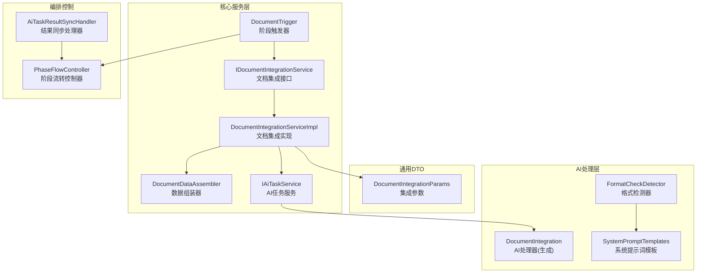
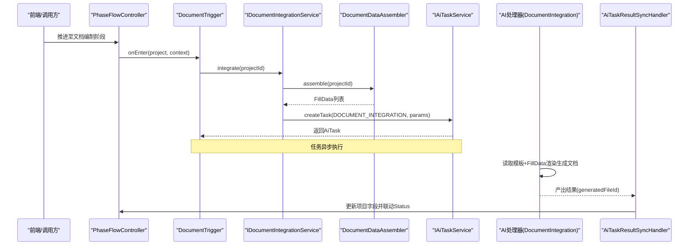
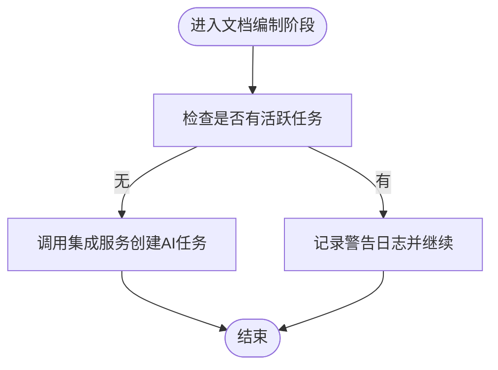
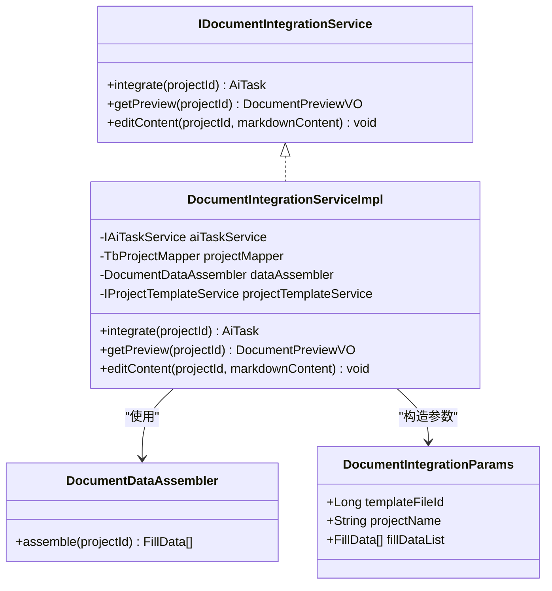
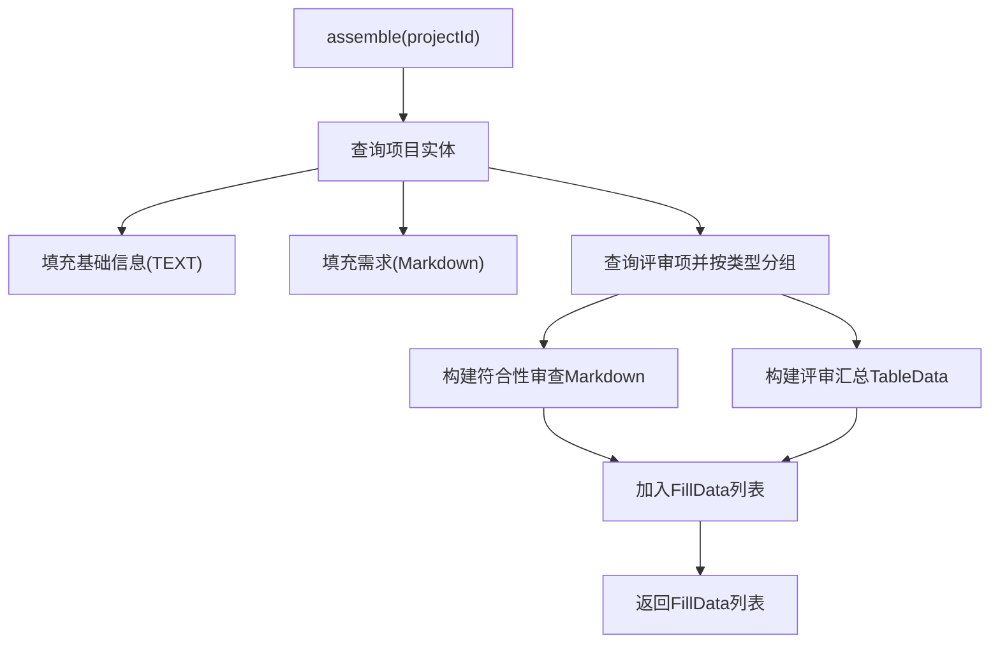
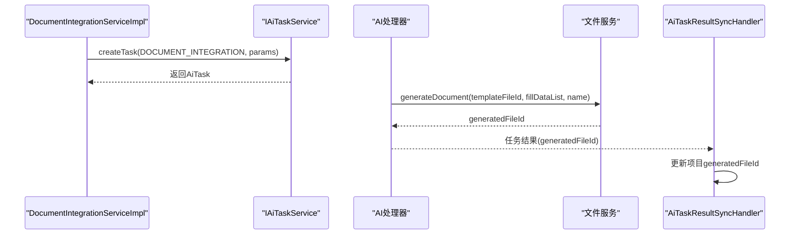
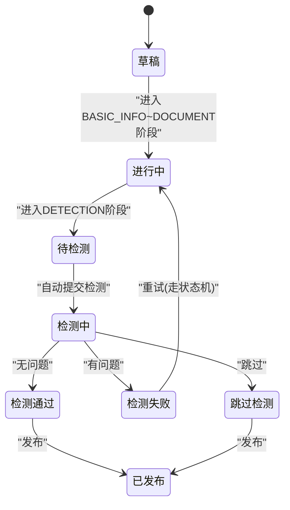
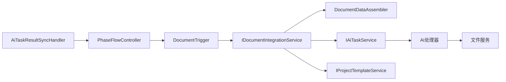

# 文档编制阶段触发器

<cite>
**本文引用的文件**   
- [DocumentTrigger.java](file://ele-ai-tender-system/ele-ai-tender-core/src/main/java/com/jy/eleaitender/core/statemachine/trigger/DocumentTrigger.java)
- [IDocumentIntegrationService.java](file://ele-ai-tender-system/ele-ai-tender-core/src/main/java/com/jy/eleaitender/core/service/IDocumentIntegrationService.java)
- [DocumentIntegrationServiceImpl.java](file://ele-ai-tender-system/ele-ai-tender-core/src/main/java/com/jy/eleaitender/core/service/impl/DocumentIntegrationServiceImpl.java)
- [DocumentDataAssembler.java](file://ele-ai-tender-system/ele-ai-tender-core/src/main/java/com/jy/eleaitender/core/engine/DocumentDataAssembler.java)
- [DocumentIntegrationParams.java](file://ele-ai-tender-system/ele-ai-tender-common/src/main/java/com/jy/eleaitender/common/dto/ai/DocumentIntegrationParams.java)
- [PhaseFlowController.java](file://ele-ai-tender-system/ele-ai-tender-core/src/main/java/com/jy/eleaitender/core/statemachine/PhaseFlowController.java)
- [AiTaskResultSyncHandler.java](file://ele-ai-tender-system/ele-ai-tender-core/src/main/java/com/jy/eleaitender/core/scheduler/AiTaskResultSyncHandler.java)
- [PHASE_FLOW_SPEC.md](file://docs/rules/PHASE_FLOW_SPEC.md)
- [DETECTION_FLOW_SPEC.md](file://docs/rules/DETECTION_FLOW_SPEC.md)
- [SystemPromptTemplates.java](file://ele-ai-tender-system/ele-ai-tender-ai/src/main/java/com/jy/eleaitender/ai/processor/prompt/SystemPromptTemplates.java)
- [FormatCheckDetector.java](file://ele-ai-tender-system/ele-ai-tender-ai/src/main/java/com/jy/eleaitender/ai/processor/checker/FormatCheckDetector.java)
</cite>

## 目录
1. [简介](#简介)
2. [项目结构](#项目结构)
3. [核心组件](#核心组件)
4. [架构总览](#架构总览)
5. [详细组件分析](#详细组件分析)
6. [依赖关系分析](#依赖关系分析)
7. [性能与扩展性](#性能与扩展性)
8. [故障排查指南](#故障排查指南)
9. [结论](#结论)
10. [附录：模板扩展与新格式集成示例](#附录模板扩展与新格式集成示例)

## 简介
本技术文档聚焦“文档编制阶段触发器”的实现与使用，围绕 DocumentTrigger 的业务逻辑展开，涵盖以下要点：
- 进入阶段时自动启动文档集成任务（onEnter）
- 完成条件判断（canComplete）与未完成提示（getIncompleteMessage）
- 文档生成与数据整合流程（AI任务、模板渲染、内容填充、格式转换）
- 版本管理与协作编辑状态同步机制
- 如何扩展文档模板与新增文档格式支持

## 项目结构
与文档编制阶段相关的核心代码分布在 core 模块的 statemachine、service、engine 以及 common 的 DTO 中，同时 AI 模块提供检测能力与提示词模板。

图表来源
- [DocumentTrigger.java:1-47](file://ele-ai-tender-system/ele-ai-tender-core/src/main/java/com/jy/eleaitender/core/statemachine/trigger/DocumentTrigger.java#L1-L47)
- [IDocumentIntegrationService.java:1-25](file://ele-ai-tender-system/ele-ai-tender-core/src/main/java/com/jy/eleaitender/core/service/IDocumentIntegrationService.java#L1-L25)
- [DocumentIntegrationServiceImpl.java:1-112](file://ele-ai-tender-system/ele-ai-tender-core/src/main/java/com/jy/eleaitender/core/service/impl/DocumentIntegrationServiceImpl.java#L1-L112)
- [DocumentDataAssembler.java:1-267](file://ele-ai-tender-system/ele-ai-tender-core/src/main/java/com/jy/eleaitender/core/engine/DocumentDataAssembler.java#L1-L267)
- [DocumentIntegrationParams.java:1-19](file://ele-ai-tender-system/ele-ai-tender-common/src/main/java/com/jy/eleaitender/common/dto/ai/DocumentIntegrationParams.java#L1-L19)
- [PhaseFlowController.java:41-69](file://ele-ai-tender-system/ele-ai-tender-core/src/main/java/com/jy/eleaitender/core/statemachine/PhaseFlowController.java#L41-L69)
- [AiTaskResultSyncHandler.java:406-440](file://ele-ai-tender-system/ele-ai-tender-core/src/main/java/com/jy/eleaitender/core/scheduler/AiTaskResultSyncHandler.java#L406-L440)
- [SystemPromptTemplates.java:438-467](file://ele-ai-tender-system/ele-ai-tender-ai/src/main/java/com/jy/eleaitender/ai/processor/prompt/SystemPromptTemplates.java#L438-L467)
- [FormatCheckDetector.java:1-37](file://ele-ai-tender-system/ele-ai-tender-ai/src/main/java/com/jy/eleaitender/ai/processor/checker/FormatCheckDetector.java#L1-L37)

章节来源
- [DocumentTrigger.java:1-47](file://ele-ai-tender-system/ele-ai-tender-core/src/main/java/com/jy/eleaitender/core/statemachine/trigger/DocumentTrigger.java#L1-L47)
- [IDocumentIntegrationService.java:1-25](file://ele-ai-tender-system/ele-ai-tender-core/src/main/java/com/jy/eleaitender/core/service/IDocumentIntegrationService.java#L1-L25)
- [DocumentIntegrationServiceImpl.java:1-112](file://ele-ai-tender-system/ele-ai-tender-core/src/main/java/com/jy/eleaitender/core/service/impl/DocumentIntegrationServiceImpl.java#L1-L112)
- [DocumentDataAssembler.java:1-267](file://ele-ai-tender-system/ele-ai-tender-core/src/main/java/com/jy/eleaitender/core/engine/DocumentDataAssembler.java#L1-L267)
- [DocumentIntegrationParams.java:1-19](file://ele-ai-tender-system/ele-ai-tender-common/src/main/java/com/jy/eleaitender/common/dto/ai/DocumentIntegrationParams.java#L1-L19)
- [PhaseFlowController.java:41-69](file://ele-ai-tender-system/ele-ai-tender-core/src/main/java/com/jy/eleaitender/core/statemachine/PhaseFlowController.java#L41-L69)
- [AiTaskResultSyncHandler.java:406-440](file://ele-ai-tender-system/ele-ai-tender-core/src/main/java/com/jy/eleaitender/core/scheduler/AiTaskResultSyncHandler.java#L406-L440)
- [SystemPromptTemplates.java:438-467](file://ele-ai-tender-system/ele-ai-tender-ai/src/main/java/com/jy/eleaitender/ai/processor/prompt/SystemPromptTemplates.java#L438-L467)
- [FormatCheckDetector.java:1-37](file://ele-ai-tender-system/ele-ai-tender-ai/src/main/java/com/jy/eleaitender/ai/processor/checker/FormatCheckDetector.java#L1-L37)

## 核心组件
- 阶段触发器：DocumentTrigger
  - onEnter：进入文档编制阶段时，自动调用文档集成服务创建 AI 任务
  - canComplete：以“已生成文件ID”作为完成条件
  - getIncompleteMessage：未满足完成条件时的提示信息
- 文档集成服务：IDocumentIntegrationService 及其实现
  - integrate：校验活跃任务、加载模板、组装数据、创建 AI 任务
  - getPreview/editContent：预览与编辑（当前编辑暂不支持）
- 数据组装器：DocumentDataAssembler
  - assemble：从项目、评审项等聚合为结构化 FillData 列表（文本、Markdown、表格）
- AI任务与处理器
  - AiTaskType.DOCUMENT_INTEGRATION：文档集成任务类型
  - 处理器负责将 FillData 写入模板并生成最终文档（Word）
- 阶段流转控制：PhaseFlowController
  - advancePhase：校验转换规则、检查活跃任务、执行 onExit/onEnter、联动 Status
- 结果同步：AiTaskResultSyncHandler
  - 根据任务结果更新项目字段（如 generatedFileId），驱动阶段推进

章节来源
- [DocumentTrigger.java:1-47](file://ele-ai-tender-system/ele-ai-tender-core/src/main/java/com/jy/eleaitender/core/statemachine/trigger/DocumentTrigger.java#L1-L47)
- [IDocumentIntegrationService.java:1-25](file://ele-ai-tender-system/ele-ai-tender-core/src/main/java/com/jy/eleaitender/core/service/IDocumentIntegrationService.java#L1-L25)
- [DocumentIntegrationServiceImpl.java:1-112](file://ele-ai-tender-system/ele-ai-tender-core/src/main/java/com/jy/eleaitender/core/service/impl/DocumentIntegrationServiceImpl.java#L1-L112)
- [DocumentDataAssembler.java:1-267](file://ele-ai-tender-system/ele-ai-tender-core/src/main/java/com/jy/eleaitender/core/engine/DocumentDataAssembler.java#L1-L267)
- [PhaseFlowController.java:41-69](file://ele-ai-tender-system/ele-ai-tender-core/src/main/java/com/jy/eleaitender/core/statemachine/PhaseFlowController.java#L41-L69)
- [AiTaskResultSyncHandler.java:406-440](file://ele-ai-tender-system/ele-ai-tender-core/src/main/java/com/jy/eleaitender/core/scheduler/AiTaskResultSyncHandler.java#L406-L440)

## 架构总览
下图展示从阶段推进到文档生成的端到端流程，包括触发器、服务、数据组装、AI任务与结果同步。

图表来源
- [PhaseFlowController.java:41-69](file://ele-ai-tender-system/ele-ai-tender-core/src/main/java/com/jy/eleaitender/core/statemachine/PhaseFlowController.java#L41-L69)
- [DocumentTrigger.java:1-47](file://ele-ai-tender-system/ele-ai-tender-core/src/main/java/com/jy/eleaitender/core/statemachine/trigger/DocumentTrigger.java#L1-L47)
- [IDocumentIntegrationService.java:1-25](file://ele-ai-tender-system/ele-ai-tender-core/src/main/java/com/jy/eleaitender/core/service/IDocumentIntegrationService.java#L1-L25)
- [DocumentIntegrationServiceImpl.java:1-112](file://ele-ai-tender-system/ele-ai-tender-core/src/main/java/com/jy/eleaitender/core/service/impl/DocumentIntegrationServiceImpl.java#L1-L112)
- [DocumentDataAssembler.java:1-267](file://ele-ai-tender-system/ele-ai-tender-core/src/main/java/com/jy/eleaitender/core/engine/DocumentDataAssembler.java#L1-L267)
- [AiTaskResultSyncHandler.java:406-440](file://ele-ai-tender-system/ele-ai-tender-core/src/main/java/com/jy/eleaitender/core/scheduler/AiTaskResultSyncHandler.java#L406-L440)

## 详细组件分析

### DocumentTrigger 业务逻辑
- onEnter
  - 调用 IDocumentIntegrationService.integrate(projectId) 启动文档集成
  - 捕获异常仅记录警告日志，不阻塞阶段推进（遵循规范中的容错策略）
- canComplete
  - 当 project.generatedFileId 非空时认为阶段可完成
- getIncompleteMessage
  - 未满足完成条件时返回提示：“请先生成招标文档”

图表来源
- [DocumentTrigger.java:1-47](file://ele-ai-tender-system/ele-ai-tender-core/src/main/java/com/jy/eleaitender/core/statemachine/trigger/DocumentTrigger.java#L1-L47)
- [PHASE_FLOW_SPEC.md:173-177](file://docs/rules/PHASE_FLOW_SPEC.md#L173-L177)

章节来源
- [DocumentTrigger.java:1-47](file://ele-ai-tender-system/ele-ai-tender-core/src/main/java/com/jy/eleaitender/core/statemachine/trigger/DocumentTrigger.java#L1-L47)
- [PHASE_FLOW_SPEC.md:173-177](file://docs/rules/PHASE_FLOW_SPEC.md#L173-L177)

### 文档集成服务（IDocumentIntegrationService 与实现）
- integrate 流程
  - 校验是否存在活跃的 DOCUMENT_INTEGRATION 任务，避免重复提交
  - 获取项目模板（TbProjectTemplate），若不存在或无文件则抛出业务异常
  - 通过 DocumentDataAssembler.assemble 组装 FillData 列表
  - 构造 DocumentIntegrationParams（包含模板文件ID、项目名称、填充数据）
  - 调用 IAiTaskService.createTask 创建 AI 任务
- getPreview
  - 返回项目基本信息及是否已集成的状态
- editContent
  - 当前在线编辑功能暂不支持，抛出操作不支持异常

图表来源
- [IDocumentIntegrationService.java:1-25](file://ele-ai-tender-system/ele-ai-tender-core/src/main/java/com/jy/eleaitender/core/service/IDocumentIntegrationService.java#L1-L25)
- [DocumentIntegrationServiceImpl.java:1-112](file://ele-ai-tender-system/ele-ai-tender-core/src/main/java/com/jy/eleaitender/core/service/impl/DocumentIntegrationServiceImpl.java#L1-L112)
- [DocumentDataAssembler.java:1-267](file://ele-ai-tender-system/ele-ai-tender-core/src/main/java/com/jy/eleaitender/core/engine/DocumentDataAssembler.java#L1-L267)
- [DocumentIntegrationParams.java:1-19](file://ele-ai-tender-system/ele-ai-tender-common/src/main/java/com/jy/eleaitender/common/dto/ai/DocumentIntegrationParams.java#L1-L19)

章节来源
- [IDocumentIntegrationService.java:1-25](file://ele-ai-tender-system/ele-ai-tender-core/src/main/java/com/jy/eleaitender/core/service/IDocumentIntegrationService.java#L1-L25)
- [DocumentIntegrationServiceImpl.java:1-112](file://ele-ai-tender-system/ele-ai-tender-core/src/main/java/com/jy/eleaitender/core/service/impl/DocumentIntegrationServiceImpl.java#L1-L112)
- [DocumentDataAssembler.java:1-267](file://ele-ai-tender-system/ele-ai-tender-core/src/main/java/com/jy/eleaitender/core/engine/DocumentDataAssembler.java#L1-L267)
- [DocumentIntegrationParams.java:1-19](file://ele-ai-tender-system/ele-ai-tender-common/src/main/java/com/jy/eleaitender/common/dto/ai/DocumentIntegrationParams.java#L1-L19)

### 数据组装器（DocumentDataAssembler）
- 职责
  - 收集项目基础信息（文本）、需求内容（Markdown）、评审项（表格与Markdown）
  - 按评审类型分组，构建汇总表（含合并规则）与符合性审查 Markdown
- 关键数据结构
  - FillData：统一的数据载体，支持 TEXT/MARKDOWN/TABLE 等类型
  - TableData：列定义、行数据、合并规则
  - ReviewConfig：模板配置（权重模式、主客观区分）
- 复杂度
  - 时间复杂度 O(n)（n 为评审项数量），空间复杂度 O(n)
  - 主要开销在流式分组与递归扁平化遍历

图表来源
- [DocumentDataAssembler.java:1-267](file://ele-ai-tender-system/ele-ai-tender-core/src/main/java/com/jy/eleaitender/core/engine/DocumentDataAssembler.java#L1-L267)

章节来源
- [DocumentDataAssembler.java:1-267](file://ele-ai-tender-system/ele-ai-tender-core/src/main/java/com/jy/eleaitender/core/engine/DocumentDataAssembler.java#L1-L267)

### AI任务与文档生成
- 任务类型：DOCUMENT_INTEGRATION
- 参数：DocumentIntegrationParams（模板文件ID、项目名称、FillData列表）
- 处理器行为
  - 反序列化 FillData 列表，按 type 转换为具体类型（TABLE/IMAGE/TEXT/MARKDOWN）
  - 调用文件服务生成 Word 文档，返回 generatedFileId
- 结果同步
  - AiTaskResultSyncHandler 解析任务结果，更新项目字段（如 generatedFileId），驱动阶段推进

图表来源
- [DocumentIntegrationServiceImpl.java:1-112](file://ele-ai-tender-system/ele-ai-tender-core/src/main/java/com/jy/eleaitender/core/service/impl/DocumentIntegrationServiceImpl.java#L1-L112)
- [DocumentIntegrationParams.java:1-19](file://ele-ai-tender-system/ele-ai-tender-common/src/main/java/com/jy/eleaitender/common/dto/ai/DocumentIntegrationParams.java#L1-L19)
- [AiTaskResultSyncHandler.java:406-440](file://ele-ai-tender-system/ele-ai-tender-core/src/main/java/com/jy/eleaitender/core/scheduler/AiTaskResultSyncHandler.java#L406-L440)

章节来源
- [DocumentIntegrationServiceImpl.java:1-112](file://ele-ai-tender-system/ele-ai-tender-core/src/main/java/com/jy/eleaitender/core/service/impl/DocumentIntegrationServiceImpl.java#L1-L112)
- [DocumentIntegrationParams.java:1-19](file://ele-ai-tender-system/ele-ai-tender-common/src/main/java/com/jy/eleaitender/common/dto/ai/DocumentIntegrationParams.java#L1-L19)
- [AiTaskResultSyncHandler.java:406-440](file://ele-ai-tender-system/ele-ai-tender-core/src/main/java/com/jy/eleaitender/core/scheduler/AiTaskResultSyncHandler.java#L406-L440)

### 阶段流转与完成条件
- PhaseFlowController.advancePhase
  - 校验阶段转换规则（只能顺序推进）
  - 检查项目下是否存在活跃 AI 任务（存在则禁止推进）
  - 执行目标阶段的 onEnter；后续由结果同步处理器更新状态
- DocumentTrigger.canComplete
  - 以 project.generatedFileId 是否为空作为完成条件
- 规范约束
  - 触发器 onEnter 中调用 Service 提交 AI 任务需 try-catch 包裹，失败仅 warn 日志
  - 阶段推进由 PhaseFlowController 统一管理，submit() 不再自行推进阶段

图表来源
- [PHASE_FLOW_SPEC.md:37-51](file://docs/rules/PHASE_FLOW_SPEC.md#L37-L51)
- [PHASE_FLOW_SPEC.md:173-183](file://docs/rules/PHASE_FLOW_SPEC.md#L173-L183)
- [DETECTION_FLOW_SPEC.md:159-196](file://docs/rules/DETECTION_FLOW_SPEC.md#L159-L196)

章节来源
- [PhaseFlowController.java:41-69](file://ele-ai-tender-system/ele-ai-tender-core/src/main/java/com/jy/eleaitender/core/statemachine/PhaseFlowController.java#L41-L69)
- [DocumentTrigger.java:1-47](file://ele-ai-tender-system/ele-ai-tender-core/src/main/java/com/jy/eleaitender/core/statemachine/trigger/DocumentTrigger.java#L1-L47)
- [PHASE_FLOW_SPEC.md:173-183](file://docs/rules/PHASE_FLOW_SPEC.md#L173-L183)
- [DETECTION_FLOW_SPEC.md:159-196](file://docs/rules/DETECTION_FLOW_SPEC.md#L159-L196)

### 文档模板验证与内容完整性检查
- 模板绑定校验
  - 集成前检查 TbProjectTemplate 是否存在且包含 fileId，否则抛出业务异常
- 内容完整性
  - 通过 FillData 列表确保必要字段（项目基础信息、需求内容、评审项）齐全
  - 表格与 Markdown 的结构化输出保证模板渲染所需数据完整
- 格式检测（辅助）
  - FormatCheckDetector 基于 SystemPromptTemplates.DETECTION_FORMAT_CHECK 进行格式规范性检查（标题层级、编号、章节完整性、表格格式、附件引用）

章节来源
- [DocumentIntegrationServiceImpl.java:61-68](file://ele-ai-tender-system/ele-ai-tender-core/src/main/java/com/jy/eleaitender/core/service/impl/DocumentIntegrationServiceImpl.java#L61-L68)
- [DocumentDataAssembler.java:47-99](file://ele-ai-tender-system/ele-ai-tender-core/src/main/java/com/jy/eleaitender/core/engine/DocumentDataAssembler.java#L47-L99)
- [FormatCheckDetector.java:1-37](file://ele-ai-tender-system/ele-ai-tender-ai/src/main/java/com/jy/eleaitender/ai/processor/checker/FormatCheckDetector.java#L1-L37)
- [SystemPromptTemplates.java:438-467](file://ele-ai-tender-system/ele-ai-tender-ai/src/main/java/com/jy/eleaitender/ai/processor/prompt/SystemPromptTemplates.java#L438-L467)

### 版本管理与协作编辑的状态同步
- 版本快照
  - 检测完成（通过/失败）时自动创建 tb_project_version 快照，contentSnapshot 存储 {generatedFileId, status}
- 状态同步
  - AiTaskResultSyncHandler 解析任务结果并更新项目字段（如 generatedFileId），从而驱动阶段推进
- 协作编辑
  - 当前在线编辑暂不支持（editContent 抛出操作不支持异常），建议通过模板修改后重新生成

章节来源
- [DETECTION_FLOW_SPEC.md:194-196](file://docs/rules/DETECTION_FLOW_SPEC.md#L194-L196)
- [AiTaskResultSyncHandler.java:406-440](file://ele-ai-tender-system/ele-ai-tender-core/src/main/java/com/jy/eleaitender/core/scheduler/AiTaskResultSyncHandler.java#L406-L440)
- [DocumentIntegrationServiceImpl.java:99-102](file://ele-ai-tender-system/ele-ai-tender-core/src/main/java/com/jy/eleaitender/core/service/impl/DocumentIntegrationServiceImpl.java#L99-L102)

## 依赖关系分析
- 低耦合高内聚
  - DocumentTrigger 仅依赖 IDocumentIntegrationService，屏蔽内部细节
  - DocumentIntegrationServiceImpl 组合 DocumentDataAssembler、IAiTaskService、IProjectTemplateService
- 外部依赖
  - AI 处理器与文件服务用于最终文档生成
  - 阶段流转控制器管理生命周期与状态同步
- 潜在循环依赖
  - 规范说明：触发器注入的业务 Service 可能依赖 IProjectService，采用 @Lazy 解决

图表来源
- [DocumentTrigger.java:1-47](file://ele-ai-tender-system/ele-ai-tender-core/src/main/java/com/jy/eleaitender/core/statemachine/trigger/DocumentTrigger.java#L1-L47)
- [IDocumentIntegrationService.java:1-25](file://ele-ai-tender-system/ele-ai-tender-core/src/main/java/com/jy/eleaitender/core/service/IDocumentIntegrationService.java#L1-L25)
- [DocumentIntegrationServiceImpl.java:1-112](file://ele-ai-tender-system/ele-ai-tender-core/src/main/java/com/jy/eleaitender/core/service/impl/DocumentIntegrationServiceImpl.java#L1-L112)
- [PhaseFlowController.java:41-69](file://ele-ai-tender-system/ele-ai-tender-core/src/main/java/com/jy/eleaitender/core/statemachine/PhaseFlowController.java#L41-L69)
- [AiTaskResultSyncHandler.java:406-440](file://ele-ai-tender-system/ele-ai-tender-core/src/main/java/com/jy/eleaitender/core/scheduler/AiTaskResultSyncHandler.java#L406-L440)

章节来源
- [PHASE_FLOW_SPEC.md:165-171](file://docs/rules/PHASE_FLOW_SPEC.md#L165-L171)

## 性能与扩展性
- 性能考量
  - 数据组装为线性复杂度，适合中等规模评审项
  - AI 任务异步执行，避免阻塞阶段推进
- 扩展点
  - 新增 FillData 类型：在 DocumentDataAssembler 中增加对应构建逻辑
  - 新模板字段：在 assemble 中添加新的 FillData.text/markdown/table
  - 新文档格式：在 AI 处理器中扩展渲染引擎（当前为 Word），并在 File 服务暴露相应接口

[本节为通用指导，无需源码引用]

## 故障排查指南
- 常见错误
  - 模板未绑定或无文件：集成前会抛出业务异常，需检查 TbProjectTemplate.fileId
  - 重复提交：若存在活跃任务，会抛出重复集成异常，需等待任务完成或取消
  - 在线编辑不支持：editContent 抛出操作不支持异常，应通过模板修改后重新生成
- 定位方法
  - 查看触发器日志（warn 级别）确认是否因已有活跃任务导致失败
  - 检查 AI 任务状态与结果，确认 generatedFileId 是否正确回写
  - 核对 FillData 结构与模板占位符匹配情况

章节来源
- [DocumentIntegrationServiceImpl.java:54-68](file://ele-ai-tender-system/ele-ai-tender-core/src/main/java/com/jy/eleaitender/core/service/impl/DocumentIntegrationServiceImpl.java#L54-L68)
- [DocumentIntegrationServiceImpl.java:99-102](file://ele-ai-tender-system/ele-ai-tender-core/src/main/java/com/jy/eleaitender/core/service/impl/DocumentIntegrationServiceImpl.java#L99-L102)
- [DocumentTrigger.java:25-35](file://ele-ai-tender-system/ele-ai-tender-core/src/main/java/com/jy/eleaitender/core/statemachine/trigger/DocumentTrigger.java#L25-L35)

## 结论
DocumentTrigger 通过简洁的 onEnter/canComplete/getIncompleteMessage 实现了文档编制阶段的自动化与完成条件控制。结合 DocumentIntegrationServiceImpl 与 DocumentDataAssembler，系统能够稳定地组装数据、创建 AI 任务并生成文档。结果同步与版本快照机制保障了状态一致性与可追溯性。未来可通过扩展 FillData 类型与渲染引擎进一步丰富文档格式支持。

[本节为总结，无需源码引用]

## 附录：模板扩展与新格式集成示例

### 扩展文档模板字段
- 步骤
  - 在 DocumentDataAssembler.assemble 中新增 FillData（text/markdown/table）
  - 在模板文件中添加对应占位符
  - 重新运行集成任务以验证渲染效果
- 参考路径
  - [DocumentDataAssembler.java:47-99](file://ele-ai-tender-system/ele-ai-tender-core/src/main/java/com/jy/eleaitender/core/engine/DocumentDataAssembler.java#L47-L99)

### 集成新的文档格式（例如 PDF）
- 步骤
  - 在 AI 处理器中新增渲染分支，将 FillData 转换为目标格式
  - 在文件服务中暴露新格式的生成接口
  - 更新 DocumentIntegrationParams 与相关 DTO（如需）
- 参考路径
  - [DocumentIntegrationParams.java:1-19](file://ele-ai-tender-system/ele-ai-tender-common/src/main/java/com/jy/eleaitender/common/dto/ai/DocumentIntegrationParams.java#L1-L19)
  - [DocumentIntegrationServiceImpl.java:61-78](file://ele-ai-tender-system/ele-ai-tender-core/src/main/java/com/jy/eleaitender/core/service/impl/DocumentIntegrationServiceImpl.java#L61-L78)

### 新增格式检测规则
- 步骤
  - 在 SystemPromptTemplates 中新增检测提示词
  - 新建 Detector 继承 BaseDetector，指定 DetectionType 与提示词
- 参考路径
  - [SystemPromptTemplates.java:438-467](file://ele-ai-tender-system/ele-ai-tender-ai/src/main/java/com/jy/eleaitender/ai/processor/prompt/SystemPromptTemplates.java#L438-L467)
  - [FormatCheckDetector.java:1-37](file://ele-ai-tender-system/ele-ai-tender-ai/src/main/java/com/jy/eleaitender/ai/processor/checker/FormatCheckDetector.java#L1-L37)