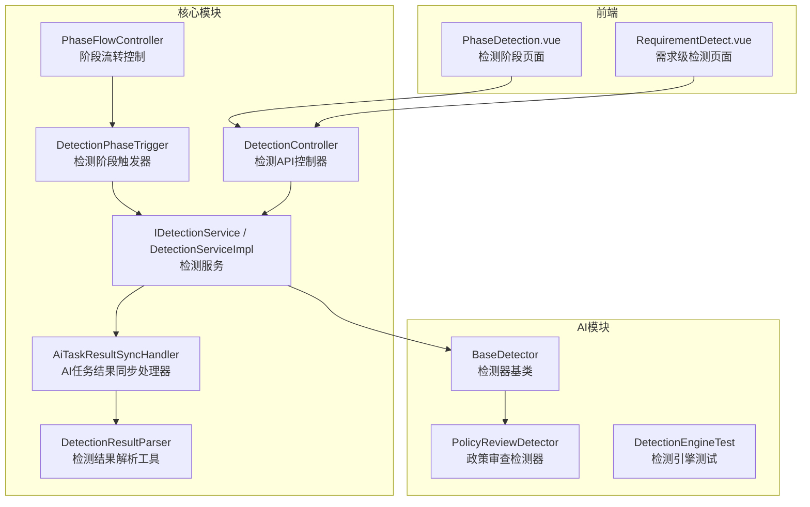
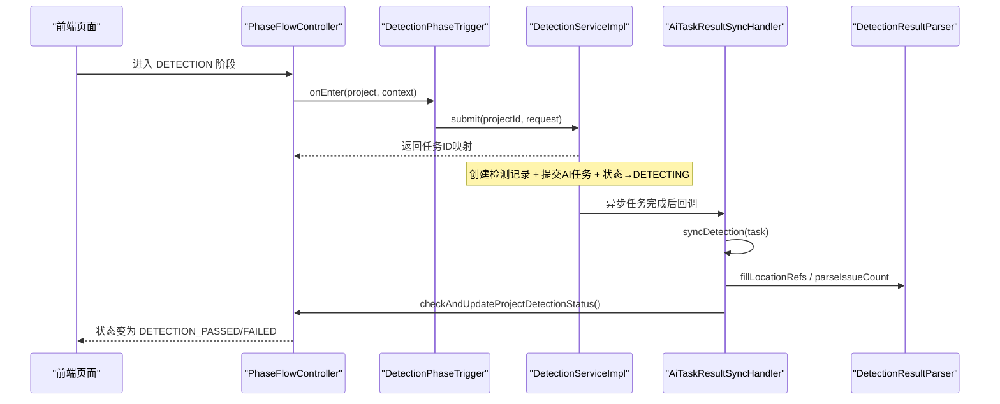
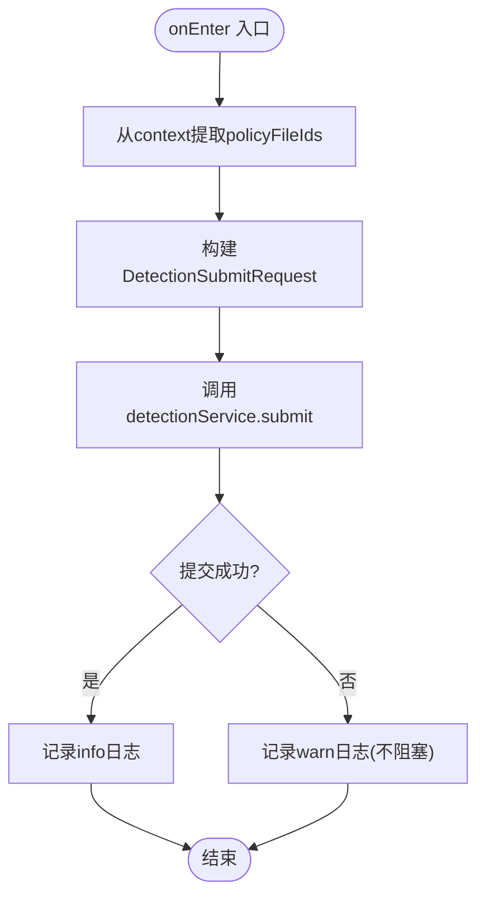
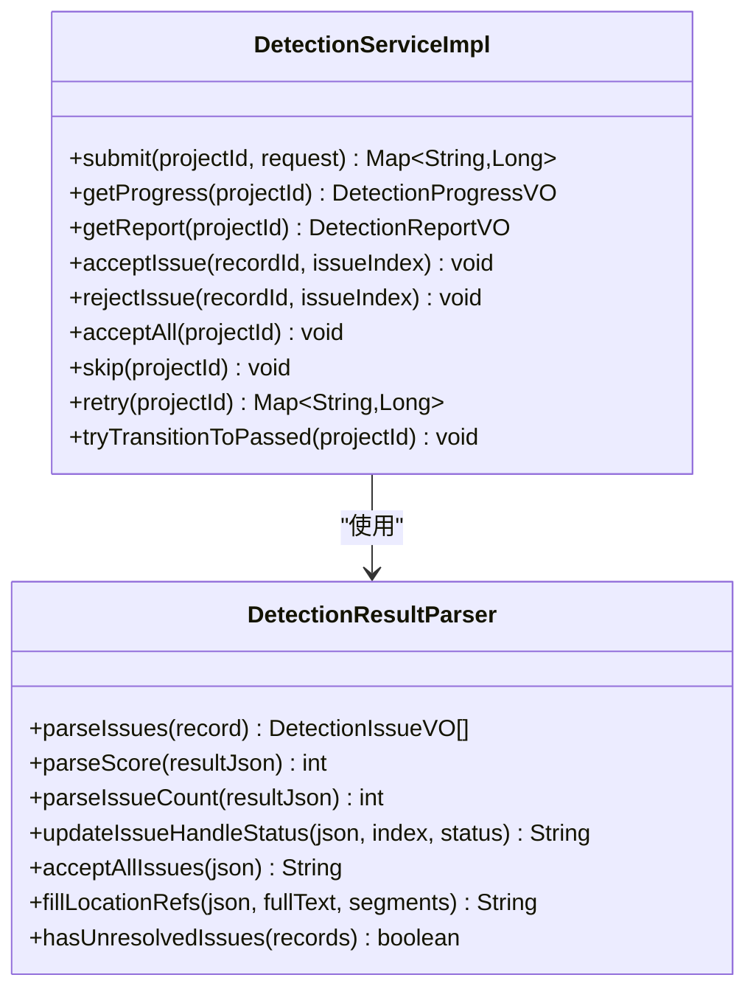
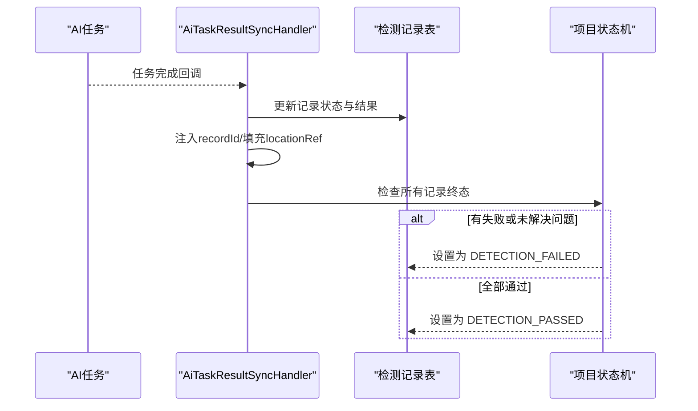
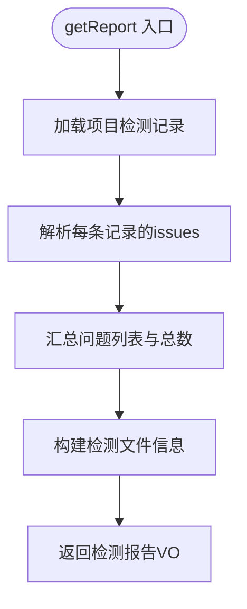
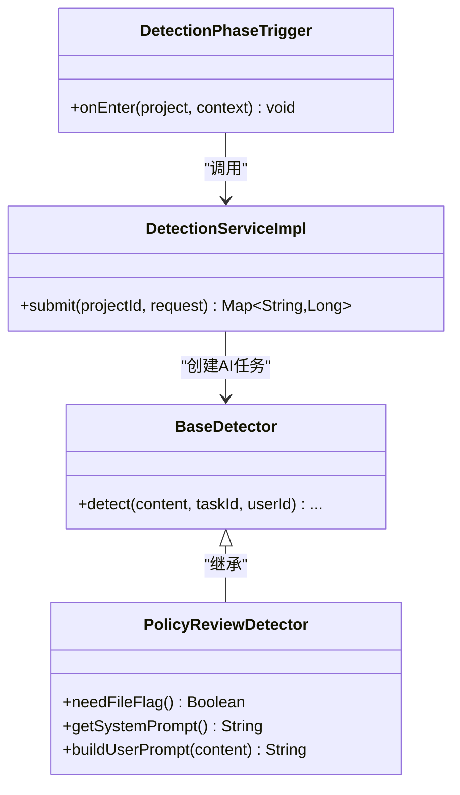
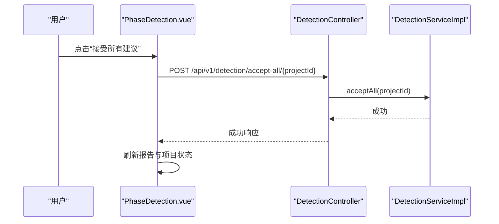
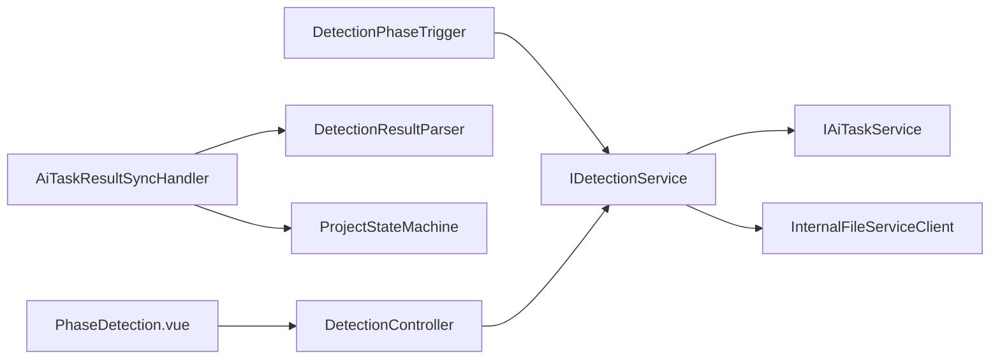

# 检测阶段触发器

<cite>
**本文引用的文件**   
- [DetectionPhaseTrigger.java](file://ele-ai-tender-system/ele-ai-tender-core/src/main/java/com/jy/eleaitender/core/statemachine/trigger/DetectionPhaseTrigger.java)
- [PhaseTrigger.java](file://ele-ai-tender-system/ele-ai-tender-core/src/main/java/com/jy/eleaitender/core/statemachine/PhaseTrigger.java)
- [PhaseFlowController.java](file://ele-ai-tender-system/ele-ai-tender-core/src/main/java/com/jy/eleaitender/core/statemachine/PhaseFlowController.java)
- [IDetectionService.java](file://ele-ai-tender-system/ele-ai-tender-core/src/main/java/com/jy/eleaitender/core/service/IDetectionService.java)
- [DetectionServiceImpl.java](file://ele-ai-tender-system/ele-ai-tender-core/src/main/java/com/jy/eleaitender/core/service/impl/DetectionServiceImpl.java)
- [AiTaskResultSyncHandler.java](file://ele-ai-tender-system/ele-ai-tender-core/src/main/java/com/jy/eleaitender/core/scheduler/AiTaskResultSyncHandler.java)
- [DetectionResultParser.java](file://ele-ai-tender-system/ele-ai-tender-core/src/main/java/com/jy/eleaitender/core/util/DetectionResultParser.java)
- [DetectionController.java](file://ele-ai-tender-system/ele-ai-tender-core/src/main/java/com/jy/eleaitender/core/controller/DetectionController.java)
- [AiTaskType.java](file://ele-ai-tender-system/ele-ai-tender-common/src/main/java/com/jy/eleaitender/common/enums/AiTaskType.java)
- [BaseDetector.java](file://ele-ai-tender-system/ele-ai-tender-ai/src/main/java/com/jy/eleaitender/ai/processor/checker/BaseDetector.java)
- [PolicyReviewDetector.java](file://ele-ai-tender-system/ele-ai-tender-ai/src/main/java/com/jy/eleaitender/ai/processor/checker/PolicyReviewDetector.java)
- [DetectionEngineTest.java](file://ele-ai-tender-system/ele-ai-tender-ai/src/test/java/com/jy/eleaitender/ai/processor/checker/DetectionEngineTest.java)
- [PHASE_FLOW_SPEC.md](file://docs/rules/PHASE_FLOW_SPEC.md)
- [PhaseDetection.vue](file://ele-ai-tender-frontend/src/views/project/phases/PhaseDetection.vue)
- [RequirementDetect.vue](file://ele-ai-tender-frontend/src/views/requirement/RequirementDetect.vue)
</cite>

## 目录
1. [简介](#简介)
2. [项目结构](#项目结构)
3. [核心组件](#核心组件)
4. [架构总览](#架构总览)
5. [详细组件分析](#详细组件分析)
6. [依赖关系分析](#依赖关系分析)
7. [性能与扩展性](#性能与扩展性)
8. [故障排查指南](#故障排查指南)
9. [结论](#结论)
10. [附录：扩展与集成示例](#附录扩展与集成示例)

## 简介
本技术文档聚焦“检测阶段触发器”在招标文档智能检测流程中的业务实现，围绕以下目标展开：
- 深入说明 DetectionPhaseTrigger 的业务逻辑：进入阶段的自动提交、完成条件判断（canComplete）、以及离开阶段时的结果汇总与报告生成。
- 详解 onEnter 中如何启动智能检测相关的 AI 任务（合规性检查、相似度分析、风险评估等检测流程）。
- 解释 onExit 的检测结果汇总和报告生成逻辑（若未实现则明确说明现状与替代路径）。
- 提供扩展检测规则与集成新检测算法的具体方式与代码片段路径。
- 展示检测结果的可视化呈现与用户反馈收集机制。

## 项目结构
检测阶段触发器位于核心模块的状态机触发器层，配合检测服务、AI 任务调度与前端页面共同构成端到端能力。

图表来源
- [PhaseFlowController.java:158-175](file://ele-ai-tender-system/ele-ai-tender-core/src/main/java/com/jy/eleaitender/core/statemachine/PhaseFlowController.java#L158-L175)
- [DetectionPhaseTrigger.java:27-70](file://ele-ai-tender-system/ele-ai-tender-core/src/main/java/com/jy/eleaitender/core/statemachine/trigger/DetectionPhaseTrigger.java#L27-L70)
- [DetectionServiceImpl.java:86-143](file://ele-ai-tender-system/ele-ai-tender-core/src/main/java/com/jy/eleaitender/core/service/impl/DetectionServiceImpl.java#L86-L143)
- [AiTaskResultSyncHandler.java:587-728](file://ele-ai-tender-system/ele-ai-tender-core/src/main/java/com/jy/eleaitender/core/scheduler/AiTaskResultSyncHandler.java#L587-L728)
- [DetectionResultParser.java:38-89](file://ele-ai-tender-system/ele-ai-tender-core/src/main/java/com/jy/eleaitender/core/util/DetectionResultParser.java#L38-L89)
- [DetectionController.java:27-47](file://ele-ai-tender-system/ele-ai-tender-core/src/main/java/com/jy/eleaitender/core/controller/DetectionController.java#L27-L47)
- [BaseDetector.java:24-43](file://ele-ai-tender-system/ele-ai-tender-ai/src/main/java/com/jy/eleaitender/ai/processor/checker/BaseDetector.java#L24-L43)
- [PolicyReviewDetector.java:15-37](file://ele-ai-tender-system/ele-ai-tender-ai/src/main/java/com/jy/eleaitender/ai/processor/checker/PolicyReviewDetector.java#L15-L37)
- [PhaseDetection.vue:238-293](file://ele-ai-tender-frontend/src/views/project/phases/PhaseDetection.vue#L238-L293)
- [RequirementDetect.vue:380-429](file://ele-ai-tender-frontend/src/views/requirement/RequirementDetect.vue#L380-L429)

章节来源
- [PHASE_FLOW_SPEC.md:37-51](file://docs/rules/PHASE_FLOW_SPEC.md#L37-L51)
- [PHASE_FLOW_SPEC.md:153-191](file://docs/rules/PHASE_FLOW_SPEC.md#L153-L191)

## 核心组件
- 阶段触发器接口 PhaseTrigger：定义 onEnter/onExit/canComplete/incompleteMessage 生命周期钩子。
- 检测阶段触发器 DetectionPhaseTrigger：实现进入阶段时自动提交检测、完成条件判定。
- 检测服务 IDetectionService/DetectionServiceImpl：编排检测任务创建、进度聚合、报告生成、建议处理与重试。
- AI 任务结果同步处理器 AiTaskResultSyncHandler：将 AI 任务结果同步到检测记录，并驱动项目状态流转。
- 检测结果解析工具 DetectionResultParser：解析 JSON 结果、统计问题数与评分、填充位置信息、批量接受替换。
- 检测 API 控制器 DetectionController：暴露提交、进度、报告、接受/拒绝建议、跳过、重试等接口。
- AI 检测器 BaseDetector/PolicyReviewDetector：封装模型调用、提示词构建、结果解析等通用逻辑。
- 前端页面 PhaseDetection.vue/RequirementDetect.vue：展示检测进度、报告、交互操作（接受/拒绝/重试/一键接受）。

章节来源
- [PhaseTrigger.java:11-39](file://ele-ai-tender-system/ele-ai-tender-core/src/main/java/com/jy/eleaitender/core/statemachine/PhaseTrigger.java#L11-L39)
- [DetectionPhaseTrigger.java:27-70](file://ele-ai-tender-system/ele-ai-tender-core/src/main/java/com/jy/eleaitender/core/statemachine/trigger/DetectionPhaseTrigger.java#L27-L70)
- [IDetectionService.java:12-58](file://ele-ai-tender-system/ele-ai-tender-core/src/main/java/com/jy/eleaitender/core/service/IDetectionService.java#L12-L58)
- [DetectionServiceImpl.java:86-143](file://ele-ai-tender-system/ele-ai-tender-core/src/main/java/com/jy/eleaitender/core/service/impl/DetectionServiceImpl.java#L86-L143)
- [AiTaskResultSyncHandler.java:587-728](file://ele-ai-tender-system/ele-ai-tender-core/src/main/java/com/jy/eleaitender/core/scheduler/AiTaskResultSyncHandler.java#L587-L728)
- [DetectionResultParser.java:38-89](file://ele-ai-tender-system/ele-ai-tender-core/src/main/java/com/jy/eleaitender/core/util/DetectionResultParser.java#L38-L89)
- [DetectionController.java:27-47](file://ele-ai-tender-system/ele-ai-tender-core/src/main/java/com/jy/eleaitender/core/controller/DetectionController.java#L27-L47)
- [BaseDetector.java:24-43](file://ele-ai-tender-system/ele-ai-tender-ai/src/main/java/com/jy/eleaitender/ai/processor/checker/BaseDetector.java#L24-L43)
- [PolicyReviewDetector.java:15-37](file://ele-ai-tender-system/ele-ai-tender-ai/src/main/java/com/jy/eleaitender/ai/processor/checker/PolicyReviewDetector.java#L15-L37)
- [PhaseDetection.vue:238-293](file://ele-ai-tender-frontend/src/views/project/phases/PhaseDetection.vue#L238-L293)
- [RequirementDetect.vue:380-429](file://ele-ai-tender-frontend/src/views/requirement/RequirementDetect.vue#L380-L429)

## 架构总览
检测阶段触发器处于“阶段流转控制”与“检测服务”之间，负责在进入 DETECTION 阶段时自动提交检测任务；检测完成后由 AI 任务结果同步处理器更新检测记录并驱动项目状态流转；前端通过 API 获取进度与报告并进行交互。

图表来源
- [PhaseFlowController.java:158-175](file://ele-ai-tender-system/ele-ai-tender-core/src/main/java/com/jy/eleaitender/core/statemachine/PhaseFlowController.java#L158-L175)
- [DetectionPhaseTrigger.java:27-57](file://ele-ai-tender-system/ele-ai-tender-core/src/main/java/com/jy/eleaitender/core/statemachine/trigger/DetectionPhaseTrigger.java#L27-L57)
- [DetectionServiceImpl.java:86-143](file://ele-ai-tender-system/ele-ai-tender-core/src/main/java/com/jy/eleaitender/core/service/impl/DetectionServiceImpl.java#L86-L143)
- [AiTaskResultSyncHandler.java:587-728](file://ele-ai-tender-system/ele-ai-tender-core/src/main/java/com/jy/eleaitender/core/scheduler/AiTaskResultSyncHandler.java#L587-L728)
- [DetectionResultParser.java:310-372](file://ele-ai-tender-system/ele-ai-tender-core/src/main/java/com/jy/eleaitender/core/util/DetectionResultParser.java#L310-L372)

## 详细组件分析

### DetectionPhaseTrigger 分析
- onEnter 职责：
  - 从上下文 context 提取 policyFileIds（支持 Number/String 类型），构建 DetectionSubmitRequest。
  - 调用 detectionService.submit 自动提交检测，异常仅记录 warn 日志，不阻塞阶段推进。
- canComplete 职责：
  - 当项目状态为 DETECTION_PASSED 或 DETECTION_SKIPPED 时允许完成当前阶段。
- getIncompleteMessage：
  - 未完成时提示“请等待智能检测完成或跳过检测”。

图表来源
- [DetectionPhaseTrigger.java:27-57](file://ele-ai-tender-system/ele-ai-tender-core/src/main/java/com/jy/eleaitender/core/statemachine/trigger/DetectionPhaseTrigger.java#L27-L57)

章节来源
- [DetectionPhaseTrigger.java:27-70](file://ele-ai-tender-system/ele-ai-tender-core/src/main/java/com/jy/eleaitender/core/statemachine/trigger/DetectionPhaseTrigger.java#L27-L70)
- [PHASE_FLOW_SPEC.md:173-183](file://docs/rules/PHASE_FLOW_SPEC.md#L173-L183)

### 检测服务 DetectionServiceImpl 分析
- submit：
  - 校验项目存在与数据权限。
  - 状态转换 PENDING_DETECTION → DETECTING。
  - 根据是否选择政策文件决定是否创建 POLICY_REVIEW 任务。
  - 为每种检测类型创建 TbDetectionRecord 与 AI 任务，并回填 taskId。
- getProgress：
  - 聚合各检测项的任务状态、问题数与评分，计算总体状态（PENDING/DETECTING/FAILED/PASSED/AI_UNAVAILABLE）。
- getReport：
  - 汇总所有检测记录的 issues，计算 totalIssueCount 与 overallStatus，并填充检测文件信息（主招标文件与政策文件）。
- acceptIssue/rejectIssue/acceptAll：
  - 更新 issue 的 handleStatus，必要时调用文件服务修复文档，并在所有问题已处理后尝试转为 DETECTION_PASSED。
- skip：
  - 直接设置 DETECTION_SKIPPED 并发送通知。
- retry：
  - 走状态机回到 IN_PROGRESS → PENDING_DETECTION → DETECTING，重置记录并重新创建任务。
- tryTransitionToPassed：
  - 若所有问题已处理且当前为 DETECTION_FAILED，则转为 DETECTION_PASSED，并创建版本备份。

图表来源
- [DetectionServiceImpl.java:86-143](file://ele-ai-tender-system/ele-ai-tender-core/src/main/java/com/jy/eleaitender/core/service/impl/DetectionServiceImpl.java#L86-L143)
- [DetectionResultParser.java:38-89](file://ele-ai-tender-system/ele-ai-tender-core/src/main/java/com/jy/eleaitender/core/util/DetectionResultParser.java#L38-L89)

章节来源
- [DetectionServiceImpl.java:86-143](file://ele-ai-tender-system/ele-ai-tender-core/src/main/java/com/jy/eleaitender/core/service/impl/DetectionServiceImpl.java#L86-L143)
- [DetectionServiceImpl.java:204-230](file://ele-ai-tender-system/ele-ai-tender-core/src/main/java/com/jy/eleaitender/core/service/impl/DetectionServiceImpl.java#L204-L230)
- [DetectionServiceImpl.java:289-394](file://ele-ai-tender-system/ele-ai-tender-core/src/main/java/com/jy/eleaitender/core/service/impl/DetectionServiceImpl.java#L289-L394)
- [DetectionServiceImpl.java:396-468](file://ele-ai-tender-system/ele-ai-tender-core/src/main/java/com/jy/eleaitender/core/service/impl/DetectionServiceImpl.java#L396-L468)
- [DetectionServiceImpl.java:527-552](file://ele-ai-tender-system/ele-ai-tender-core/src/main/java/com/jy/eleaitender/core/service/impl/DetectionServiceImpl.java#L527-L552)

### AI 任务结果同步与状态流转
- syncDetection：
  - 同步任务状态至检测记录，COMPLETED 时注入 recordId 并填充 locationRef。
  - 当所有检测记录到达终态时，依据是否有失败或未解决问题决定 DETECTION_FAILED 或 DETECTION_PASSED。
  - 联动阶段推进：通过/跳过时将检测阶段标记为完成。
- enrichResultWithRecordId：
  - 在结果 JSON 中注入 recordId，便于前端逐条处理。
- checkAndUpdateProjectDetectionStatus：
  - 汇总所有记录状态与问题数量，进行项目状态转换与通知。

图表来源
- [AiTaskResultSyncHandler.java:587-728](file://ele-ai-tender-system/ele-ai-tender-core/src/main/java/com/jy/eleaitender/core/scheduler/AiTaskResultSyncHandler.java#L587-L728)
- [AiTaskResultSyncHandler.java:637-659](file://ele-ai-tender-system/ele-ai-tender-core/src/main/java/com/jy/eleaitender/core/scheduler/AiTaskResultSyncHandler.java#L637-L659)

章节来源
- [AiTaskResultSyncHandler.java:587-728](file://ele-ai-tender-system/ele-ai-tender-core/src/main/java/com/jy/eleaitender/core/scheduler/AiTaskResultSyncHandler.java#L587-L728)

### 检测结果解析与报告生成
- DetectionResultParser.parseIssues：
  - 解析 result JSON 中的 issues 数组，构造 DetectionIssueVO，包含位置、原文、建议、严重级别、处理状态等。
- DetectionResultParser.fillLocationRefs：
  - 基于全文与分段索引，为每个 issue 填充 locationRef，支持表格单元格定位。
- DetectionServiceImpl.getReport：
  - 汇总所有检测记录的 issues，计算总数与整体状态，并填充检测文件信息（主招标文件与政策文件名称）。

图表来源
- [DetectionServiceImpl.java:204-230](file://ele-ai-tender-system/ele-ai-tender-core/src/main/java/com/jy/eleaitender/core/service/impl/DetectionServiceImpl.java#L204-L230)
- [DetectionResultParser.java:38-89](file://ele-ai-tender-system/ele-ai-tender-core/src/main/java/com/jy/eleaitender/core/util/DetectionResultParser.java#L38-L89)
- [DetectionResultParser.java:310-372](file://ele-ai-tender-system/ele-ai-tender-core/src/main/java/com/jy/eleaitender/core/util/DetectionResultParser.java#L310-L372)

章节来源
- [DetectionServiceImpl.java:204-230](file://ele-ai-tender-system/ele-ai-tender-core/src/main/java/com/jy/eleaitender/core/service/impl/DetectionServiceImpl.java#L204-L230)
- [DetectionResultParser.java:38-89](file://ele-ai-tender-system/ele-ai-tender-core/src/main/java/com/jy/eleaitender/core/util/DetectionResultParser.java#L38-L89)

### onExit 方法现状与替代路径
- PhaseTrigger 接口定义了 onExit 默认空实现，DetectionPhaseTrigger 未覆盖该方法。
- 实际“检测结果汇总与报告生成”由 DetectionServiceImpl.getReport 提供，并通过 AiTaskResultSyncHandler 在任务完成后驱动状态流转。
- 因此，onExit 并非用于报告生成的入口；如需在阶段退出时执行额外动作，可在 DetectionPhaseTrigger 中覆写 onExit 并调用相应服务。

章节来源
- [PhaseTrigger.java:24-26](file://ele-ai-tender-system/ele-ai-tender-core/src/main/java/com/jy/eleaitender/core/statemachine/PhaseTrigger.java#L24-L26)
- [DetectionPhaseTrigger.java:27-70](file://ele-ai-tender-system/ele-ai-tender-core/src/main/java/com/jy/eleaitender/core/statemachine/trigger/DetectionPhaseTrigger.java#L27-L70)
- [DetectionServiceImpl.java:204-230](file://ele-ai-tender-system/ele-ai-tender-core/src/main/java/com/jy/eleaitender/core/service/impl/DetectionServiceImpl.java#L204-L230)

### onEnter 中启动智能检测的 AI 任务
- DetectionPhaseTrigger.onEnter 从上下文提取 policyFileIds，构建请求并提交检测。
- DetectionServiceImpl.submit 根据检测类型枚举创建对应 AI 任务：
  - 敏感词检测、错别字检测、格式检查、政策审查（若无政策文件则跳过）。
- AI 检测器通过 BaseDetector 统一封装模型路由与结果解析，PolicyReviewDetector 实现政策审查场景。

图表来源
- [DetectionPhaseTrigger.java:27-57](file://ele-ai-tender-system/ele-ai-tender-core/src/main/java/com/jy/eleaitender/core/statemachine/trigger/DetectionPhaseTrigger.java#L27-L57)
- [DetectionServiceImpl.java:86-143](file://ele-ai-tender-system/ele-ai-tender-core/src/main/java/com/jy/eleaitender/core/service/impl/DetectionServiceImpl.java#L86-L143)
- [BaseDetector.java:24-43](file://ele-ai-tender-system/ele-ai-tender-ai/src/main/java/com/jy/eleaitender/ai/processor/checker/BaseDetector.java#L24-L43)
- [PolicyReviewDetector.java:15-37](file://ele-ai-tender-system/ele-ai-tender-ai/src/main/java/com/jy/eleaitender/ai/processor/checker/PolicyReviewDetector.java#L15-L37)

章节来源
- [DetectionPhaseTrigger.java:27-57](file://ele-ai-tender-system/ele-ai-tender-core/src/main/java/com/jy/eleaitender/core/statemachine/trigger/DetectionPhaseTrigger.java#L27-L57)
- [DetectionServiceImpl.java:86-143](file://ele-ai-tender-system/ele-ai-tender-core/src/main/java/com/jy/eleaitender/core/service/impl/DetectionServiceImpl.java#L86-L143)
- [AiTaskType.java:31-51](file://ele-ai-tender-system/ele-ai-tender-common/src/main/java/com/jy/eleaitender/common/enums/AiTaskType.java#L31-L51)
- [DetectionEngineTest.java:54-75](file://ele-ai-tender-system/ele-ai-tender-ai/src/test/java/com/jy/eleaitender/ai/processor/checker/DetectionEngineTest.java#L54-L75)

### 前端可视化与用户反馈
- PhaseDetection.vue：
  - 显示检测进度卡片、报告面板，支持接受所有建议、重试等操作。
  - 监听检测完成事件，刷新项目状态。
- RequirementDetect.vue：
  - 轮询任务状态，根据 resultSynced 字段区分结果是否已同步，更新卡片状态与百分比。

图表来源
- [PhaseDetection.vue:238-293](file://ele-ai-tender-frontend/src/views/project/phases/PhaseDetection.vue#L238-L293)
- [DetectionController.java:67-73](file://ele-ai-tender-system/ele-ai-tender-core/src/main/java/com/jy/eleaitender/core/controller/DetectionController.java#L67-L73)
- [DetectionServiceImpl.java:360-394](file://ele-ai-tender-system/ele-ai-tender-core/src/main/java/com/jy/eleaitender/core/service/impl/DetectionServiceImpl.java#L360-L394)

章节来源
- [PhaseDetection.vue:238-293](file://ele-ai-tender-frontend/src/views/project/phases/PhaseDetection.vue#L238-L293)
- [RequirementDetect.vue:380-429](file://ele-ai-tender-frontend/src/views/requirement/RequirementDetect.vue#L380-L429)

## 依赖关系分析
- 触发器与服务耦合：
  - DetectionPhaseTrigger 依赖 IDetectionService，避免循环依赖通过 @Lazy 注入。
- 服务与外部系统：
  - DetectionServiceImpl 依赖 IAiTaskService 创建任务，依赖 InternalFileServiceClient 进行文档修复与信息获取。
- 结果同步与状态机：
  - AiTaskResultSyncHandler 依赖 ProjectStateMachine 进行项目状态转换，依赖 DetectionResultParser 解析结果。
- 前端与后端：
  - 前端通过 DetectionController 提供的 REST 接口与后端交互，展示进度与报告。

图表来源
- [DetectionPhaseTrigger.java:27-57](file://ele-ai-tender-system/ele-ai-tender-core/src/main/java/com/jy/eleaitender/core/statemachine/trigger/DetectionPhaseTrigger.java#L27-L57)
- [DetectionServiceImpl.java:86-143](file://ele-ai-tender-system/ele-ai-tender-core/src/main/java/com/jy/eleaitender/core/service/impl/DetectionServiceImpl.java#L86-L143)
- [AiTaskResultSyncHandler.java:587-728](file://ele-ai-tender-system/ele-ai-tender-core/src/main/java/com/jy/eleaitender/core/scheduler/AiTaskResultSyncHandler.java#L587-L728)
- [DetectionController.java:27-47](file://ele-ai-tender-system/ele-ai-tender-core/src/main/java/com/jy/eleaitender/core/controller/DetectionController.java#L27-L47)
- [PhaseDetection.vue:238-293](file://ele-ai-tender-frontend/src/views/project/phases/PhaseDetection.vue#L238-L293)

章节来源
- [DetectionPhaseTrigger.java:27-57](file://ele-ai-tender-system/ele-ai-tender-core/src/main/java/com/jy/eleaitender/core/statemachine/trigger/DetectionPhaseTrigger.java#L27-L57)
- [DetectionServiceImpl.java:86-143](file://ele-ai-tender-system/ele-ai-tender-core/src/main/java/com/jy/eleaitender/core/service/impl/DetectionServiceImpl.java#L86-L143)
- [AiTaskResultSyncHandler.java:587-728](file://ele-ai-tender-system/ele-ai-tender-core/src/main/java/com/jy/eleaitender/core/scheduler/AiTaskResultSyncHandler.java#L587-L728)
- [DetectionController.java:27-47](file://ele-ai-tender-system/ele-ai-tender-core/src/main/java/com/jy/eleaitender/core/controller/DetectionController.java#L27-L47)
- [PhaseDetection.vue:238-293](file://ele-ai-tender-frontend/src/views/project/phases/PhaseDetection.vue#L238-L293)

## 性能与扩展性
- 并发与容错：
  - onEnter 中提交检测采用 try-catch，失败仅记录 warn 日志，不阻塞阶段推进，前端可轮询任务状态。
- 任务并行：
  - 四种检测类型并行创建 AI 任务，提升整体效率。
- 可扩展点：
  - 新增检测类型：在 DetectionType 枚举中添加新类型，并在 DetectionServiceImpl.ALL_DETECTION_TYPES 中注册；在 AiTaskType 中映射到具体任务类型；在 AI 模块实现对应 Detector。
  - 扩展检测规则：在 PolicyReviewDetector 或其他 Detector 中调整提示词与结果解析逻辑。
- 结果增强：
  - 通过 fillLocationRefs 为问题提供精准位置，便于文档修复与可视化高亮。

[本节为通用指导，无需特定文件引用]

## 故障排查指南
- 提交检测失败：
  - 检查 DetectionPhaseTrigger.onEnter 的日志输出，确认 policyFileIds 是否正确传递。
  - 查看 DetectionServiceImpl.submit 的事务与状态转换是否成功。
- 任务未同步：
  - 检查 AiTaskResultSyncHandler.syncDetection 是否被调用，确认任务状态是否为 COMPLETED。
  - 查看 enrichResultWithRecordId 与 fillLocationRefs 的异常日志。
- 前端无法获取报告：
  - 确认 DetectionController.getReport 返回的数据结构与前端期望一致。
  - 检查 DetectionResultParser.parseIssues 是否能正确解析 result JSON。

章节来源
- [DetectionPhaseTrigger.java:27-57](file://ele-ai-tender-system/ele-ai-tender-core/src/main/java/com/jy/eleaitender/core/statemachine/trigger/DetectionPhaseTrigger.java#L27-L57)
- [DetectionServiceImpl.java:86-143](file://ele-ai-tender-system/ele-ai-tender-core/src/main/java/com/jy/eleaitender/core/service/impl/DetectionServiceImpl.java#L86-L143)
- [AiTaskResultSyncHandler.java:587-728](file://ele-ai-tender-system/ele-ai-tender-core/src/main/java/com/jy/eleaitender/core/scheduler/AiTaskResultSyncHandler.java#L587-L728)
- [DetectionResultParser.java:38-89](file://ele-ai-tender-system/ele-ai-tender-core/src/main/java/com/jy/eleaitender/core/util/DetectionResultParser.java#L38-L89)
- [DetectionController.java:42-47](file://ele-ai-tender-system/ele-ai-tender-core/src/main/java/com/jy/eleaitender/core/controller/DetectionController.java#L42-L47)

## 结论
DetectionPhaseTrigger 作为检测阶段的入口，负责从上下文提取政策文件并自动提交检测；检测服务的编排与结果同步处理器共同完成检测任务的创建、执行、结果解析与状态流转；前端提供完善的可视化与交互能力。当前 onExit 未实现报告生成逻辑，相关功能集中在 DetectionServiceImpl.getReport 与 AiTaskResultSyncHandler 中。系统具备良好的扩展性与容错设计，便于新增检测规则与算法。

[本节为总结，无需特定文件引用]

## 附录：扩展与集成示例
- 新增检测类型与任务映射：
  - 在 DetectionType 枚举添加新类型。
  - 在 AiTaskType.mapToTaskType 中增加映射。
  - 在 DetectionServiceImpl.ALL_DETECTION_TYPES 中注册新类型。
  - 在 AI 模块实现对应 Detector（继承 BaseDetector），并在 DetectionEngine 中注册。
- 集成新的检测算法：
  - 参考 PolicyReviewDetector 的实现模式，自定义提示词与结果解析。
  - 在 DetectionResultParser 中扩展解析逻辑以适配新结果结构。
- 前端集成：
  - 在 PhaseDetection.vue 中接入新的检测项展示与交互。
  - 在 RequirementDetect.vue 中轮询新任务状态并更新 UI。

章节来源
- [AiTaskType.java:31-51](file://ele-ai-tender-system/ele-ai-tender-common/src/main/java/com/jy/eleaitender/common/enums/AiTaskType.java#L31-L51)
- [DetectionServiceImpl.java:76-81](file://ele-ai-tender-system/ele-ai-tender-core/src/main/java/com/jy/eleaitender/core/service/impl/DetectionServiceImpl.java#L76-L81)
- [PolicyReviewDetector.java:15-37](file://ele-ai-tender-system/ele-ai-tender-ai/src/main/java/com/jy/eleaitender/ai/processor/checker/PolicyReviewDetector.java#L15-L37)
- [BaseDetector.java:24-43](file://ele-ai-tender-system/ele-ai-tender-ai/src/main/java/com/jy/eleaitender/ai/processor/checker/BaseDetector.java#L24-L43)
- [PhaseDetection.vue:238-293](file://ele-ai-tender-frontend/src/views/project/phases/PhaseDetection.vue#L238-L293)
- [RequirementDetect.vue:380-429](file://ele-ai-tender-frontend/src/views/requirement/RequirementDetect.vue#L380-L429)