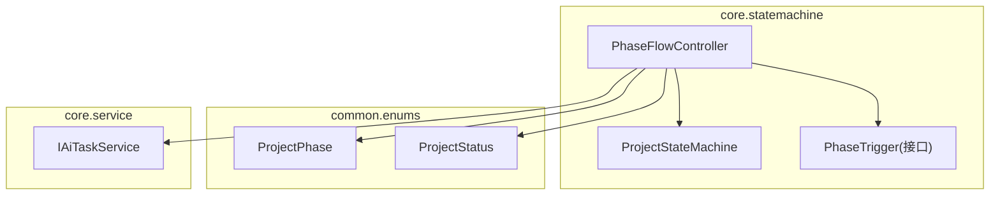
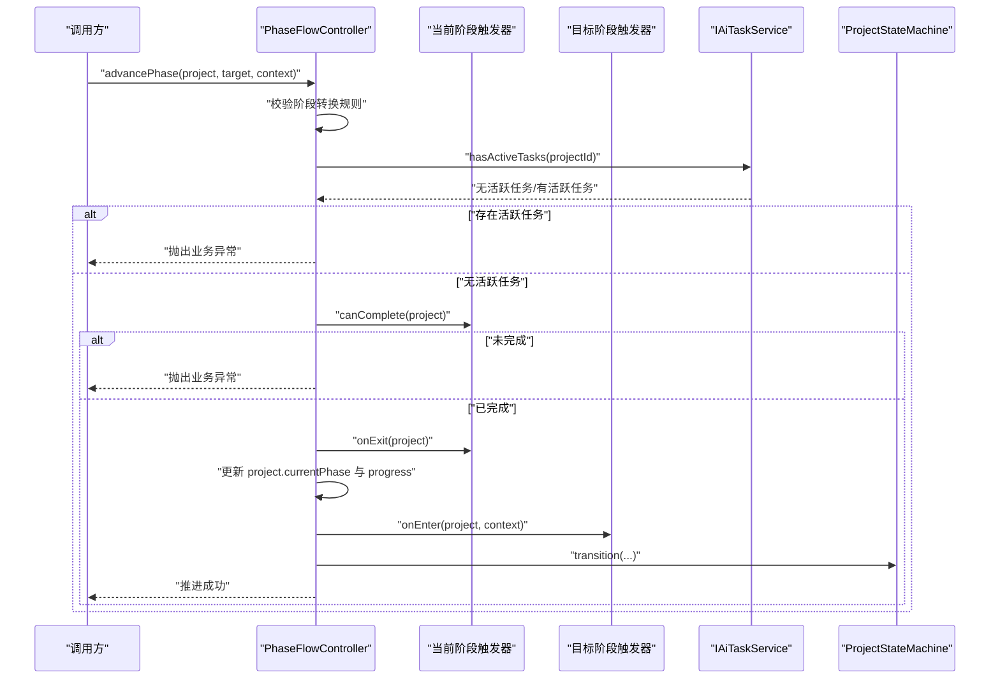
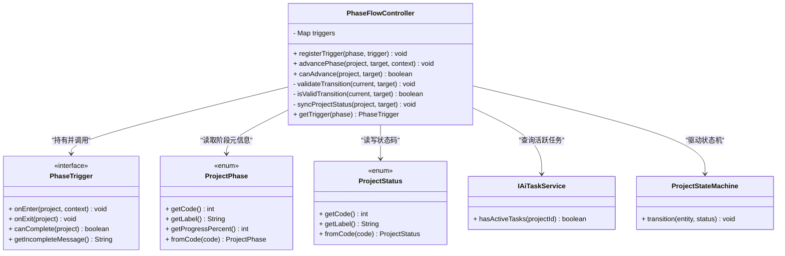
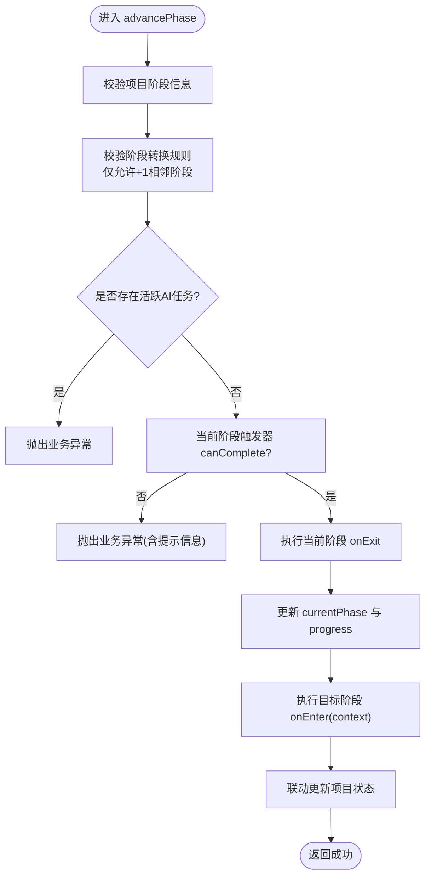
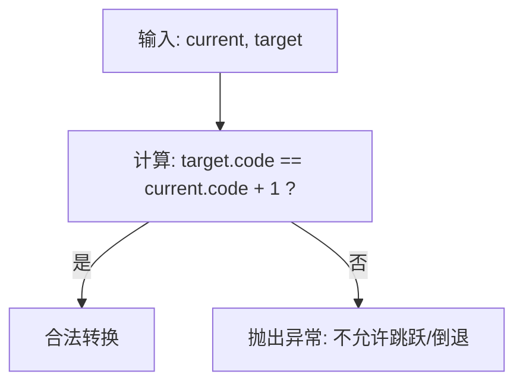
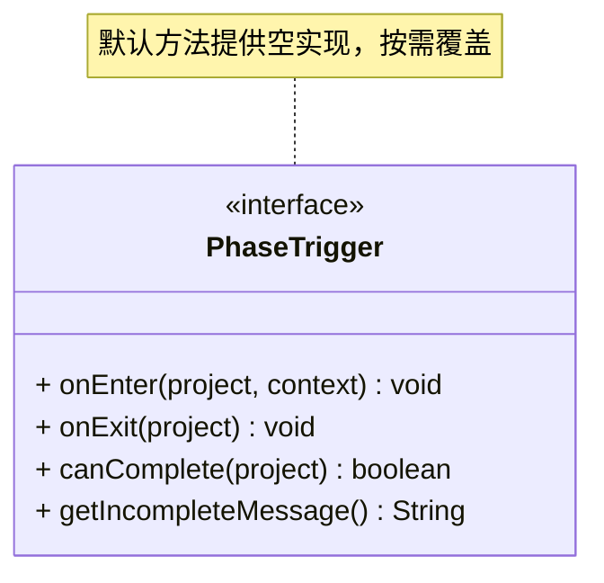
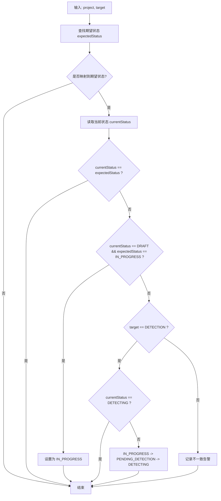
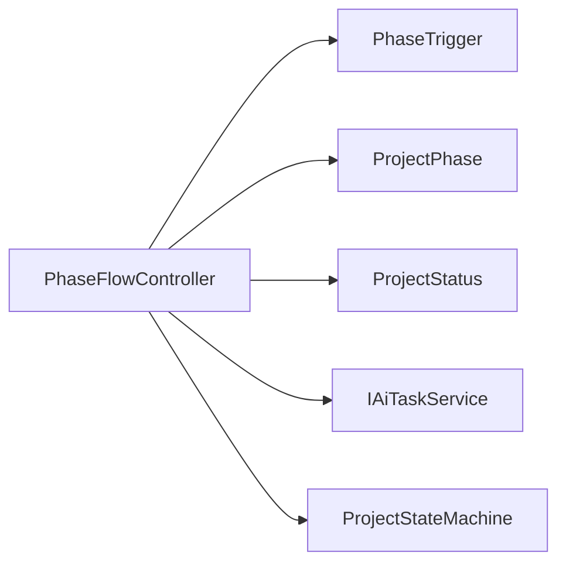
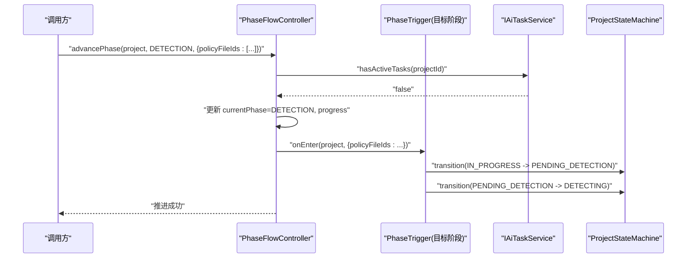

# 流程控制器

<cite>
**本文引用的文件**   
- [PhaseFlowController.java](file://ele-ai-tender-system/ele-ai-tender-core/src/main/java/com/jy/eleaitender/core/statemachine/PhaseFlowController.java)
- [PhaseTrigger.java](file://ele-ai-tender-system/ele-ai-tender-core/src/main/java/com/jy/eleaitender/core/statemachine/PhaseTrigger.java)
- [ProjectPhase.java](file://ele-ai-tender-system/ele-ai-tender-common/src/main/java/com/jy/eleaitender/common/enums/ProjectPhase.java)
- [ProjectStatus.java](file://ele-ai-tender-system/ele-ai-tender-common/src/main/java/com/jy/eleaitender/common/enums/ProjectStatus.java)
- [IAiTaskService.java](file://ele-ai-tender-system/ele-ai-tender-core/src/main/java/com/jy/eleaitender/core/service/IAiTaskService.java)
- [ProjectStateMachine.java](file://ele-ai-tender-system/ele-ai-tender-core/src/main/java/com/jy/eleaitender/core/statemachine/ProjectStateMachine.java)
</cite>

## 目录
1. [简介](#简介)
2. [项目结构](#项目结构)
3. [核心组件](#核心组件)
4. [架构总览](#架构总览)
5. [详细组件分析](#详细组件分析)
6. [依赖关系分析](#依赖关系分析)
7. [性能与事务考量](#性能与事务考量)
8. [故障排查指南](#故障排查指南)
9. [结论](#结论)
10. [附录：使用示例与扩展指南](#附录使用示例与扩展指南)

## 简介
本技术文档聚焦于“阶段流程控制器”的设计与实现，围绕 PhaseFlowController 的流程控制能力展开，涵盖阶段推进、回退与跳转策略、阶段触发器接口 PhaseTrigger 的扩展机制、关键方法执行流程（advancePhase、canAdvance、validateTransition/isValidTransition、syncProjectStatus）、阶段间依赖与数据传递、异常处理与事务管理策略，并提供自定义触发器的集成示例与图示说明。

## 项目结构
与流程控制器相关的代码主要位于 core 模块的 statemachine 包中，配合 common 模块中的枚举定义以及 core 模块的服务接口完成跨层协作。

图表来源
- [PhaseFlowController.java:1-176](file://ele-ai-tender-system/ele-ai-tender-core/src/main/java/com/jy/eleaitender/core/statemachine/PhaseFlowController.java#L1-L176)
- [PhaseTrigger.java:1-40](file://ele-ai-tender-system/ele-ai-tender-core/src/main/java/com/jy/eleaitender/core/statemachine/PhaseTrigger.java#L1-L40)
- [ProjectPhase.java](file://ele-ai-tender-system/ele-ai-tender-common/src/main/java/com/jy/eleaitender/common/enums/ProjectPhase.java)
- [ProjectStatus.java](file://ele-ai-tender-system/ele-ai-tender-common/src/main/java/com/jy/eleaitender/common/enums/ProjectStatus.java)
- [IAiTaskService.java](file://ele-ai-tender-system/ele-ai-tender-core/src/main/java/com/jy/eleaitender/core/service/IAiTaskService.java)
- [ProjectStateMachine.java](file://ele-ai-tender-system/ele-ai-tender-core/src/main/java/com/jy/eleaitender/core/statemachine/ProjectStateMachine.java)

章节来源
- [PhaseFlowController.java:1-176](file://ele-ai-tender-system/ele-ai-tender-core/src/main/java/com/jy/eleaitender/core/statemachine/PhaseFlowController.java#L1-L176)
- [PhaseTrigger.java:1-40](file://ele-ai-tender-system/ele-ai-tender-core/src/main/java/com/jy/eleaitender/core/statemachine/PhaseTrigger.java#L1-L40)
- [ProjectPhase.java](file://ele-ai-tender-system/ele-ai-tender-common/src/main/java/com/jy/eleaitender/common/enums/ProjectPhase.java)
- [ProjectStatus.java](file://ele-ai-tender-system/ele-ai-tender-common/src/main/java/com/jy/eleaitender/common/enums/ProjectStatus.java)
- [IAiTaskService.java](file://ele-ai-tender-system/ele-ai-tender-core/src/main/java/com/jy/eleaitender/core/service/IAiTaskService.java)
- [ProjectStateMachine.java](file://ele-ai-tender-system/ele-ai-tender-core/src/main/java/com/jy/eleaitender/core/statemachine/ProjectStateMachine.java)

## 核心组件
- 阶段流程控制器 PhaseFlowController
  - 职责：维护阶段到触发器的映射；校验阶段转换规则；在推进前检查活跃任务；执行当前阶段的 onExit 与目标阶段的 onEnter；联动更新项目状态。
  - 关键能力：
    - 注册触发器 registerTrigger(phase, trigger)
    - 推进阶段 advancePhase(project, target, context)
    - 可推进性判断 canAdvance(project, target)
    - 阶段转换校验 validateTransition / isValidTransition
    - 状态同步 syncProjectStatus
- 阶段触发器接口 PhaseTrigger
  - 职责：定义进入/离开阶段钩子与完成条件判定，支持默认空实现以便按需覆盖。
- 辅助类型与服务
  - ProjectPhase：阶段枚举，提供 code、label、progressPercent 等元信息。
  - ProjectStatus：项目状态枚举，用于与阶段联动。
  - IAiTaskService：查询是否存在活跃 AI 任务，作为推进前置条件。
  - ProjectStateMachine：封装项目状态的顺序流转操作。

章节来源
- [PhaseFlowController.java:20-176](file://ele-ai-tender-system/ele-ai-tender-core/src/main/java/com/jy/eleaitender/core/statemachine/PhaseFlowController.java#L20-L176)
- [PhaseTrigger.java:11-39](file://ele-ai-tender-system/ele-ai-tender-core/src/main/java/com/jy/eleaitender/core/statemachine/PhaseTrigger.java#L11-L39)
- [ProjectPhase.java](file://ele-ai-tender-system/ele-ai-tender-common/src/main/java/com/jy/eleaitender/common/enums/ProjectPhase.java)
- [ProjectStatus.java](file://ele-ai-tender-system/ele-ai-tender-common/src/main/java/com/jy/eleaitender/common/enums/ProjectStatus.java)
- [IAiTaskService.java](file://ele-ai-tender-system/ele-ai-tender-core/src/main/java/com/jy/eleaitender/core/service/IAiTaskService.java)
- [ProjectStateMachine.java](file://ele-ai-tender-system/ele-ai-tender-core/src/main/java/com/jy/eleaitender/core/statemachine/ProjectStateMachine.java)

## 架构总览
下图展示了 PhaseFlowController 在阶段推进过程中的整体交互：从调用入口到触发器执行、再到状态联动的完整链路。

图表来源
- [PhaseFlowController.java:57-96](file://ele-ai-tender-system/ele-ai-tender-core/src/main/java/com/jy/eleaitender/core/statemachine/PhaseFlowController.java#L57-L96)
- [IAiTaskService.java](file://ele-ai-tender-system/ele-ai-tender-core/src/main/java/com/jy/eleaitender/core/service/IAiTaskService.java)
- [ProjectStateMachine.java](file://ele-ai-tender-system/ele-ai-tender-core/src/main/java/com/jy/eleaitender/core/statemachine/ProjectStateMachine.java)

## 详细组件分析

### PhaseFlowController 类图

图表来源
- [PhaseFlowController.java:20-176](file://ele-ai-tender-system/ele-ai-tender-core/src/main/java/com/jy/eleaitender/core/statemachine/PhaseFlowController.java#L20-L176)
- [PhaseTrigger.java:11-39](file://ele-ai-tender-system/ele-ai-tender-core/src/main/java/com/jy/eleaitender/core/statemachine/PhaseTrigger.java#L11-L39)
- [ProjectPhase.java](file://ele-ai-tender-system/ele-ai-tender-common/src/main/java/com/jy/eleaitender/common/enums/ProjectPhase.java)
- [ProjectStatus.java](file://ele-ai-tender-system/ele-ai-tender-common/src/main/java/com/jy/eleaitender/common/enums/ProjectStatus.java)
- [IAiTaskService.java](file://ele-ai-tender-system/ele-ai-tender-core/src/main/java/com/jy/eleaitender/core/service/IAiTaskService.java)
- [ProjectStateMachine.java](file://ele-ai-tender-system/ele-ai-tender-core/src/main/java/com/jy/eleaitender/core/statemachine/ProjectStateMachine.java)

章节来源
- [PhaseFlowController.java:20-176](file://ele-ai-tender-system/ele-ai-tender-core/src/main/java/com/jy/eleaitender/core/statemachine/PhaseFlowController.java#L20-L176)
- [PhaseTrigger.java:11-39](file://ele-ai-tender-system/ele-ai-tender-core/src/main/java/com/jy/eleaitender/core/statemachine/PhaseTrigger.java#L11-L39)

### 阶段推进主流程（advancePhase）时序与要点
- 前置校验
  - 项目阶段信息完整性校验
  - 仅允许顺序推进到下一阶段（禁止跳跃或倒退）
  - 无活跃 AI 任务限制
- 阶段生命周期钩子
  - 当前阶段 onExit：完成性校验与收尾逻辑
  - 目标阶段 onEnter：自动发起任务、初始化上下文等
- 进度与状态联动
  - 更新 currentPhase 与 progress
  - 根据目标阶段映射到预期状态，必要时通过状态机进行多步过渡

图表来源
- [PhaseFlowController.java:57-96](file://ele-ai-tender-system/ele-ai-tender-core/src/main/java/com/jy/eleaitender/core/statemachine/PhaseFlowController.java#L57-L96)
- [PhaseFlowController.java:113-126](file://ele-ai-tender-system/ele-ai-tender-core/src/main/java/com/jy/eleaitender/core/statemachine/PhaseFlowController.java#L113-L126)
- [PhaseFlowController.java:134-167](file://ele-ai-tender-system/ele-ai-tender-core/src/main/java/com/jy/eleaitender/core/statemachine/PhaseFlowController.java#L134-L167)

章节来源
- [PhaseFlowController.java:57-96](file://ele-ai-tender-system/ele-ai-tender-core/src/main/java/com/jy/eleaitender/core/statemachine/PhaseFlowController.java#L57-L96)
- [PhaseFlowController.java:113-126](file://ele-ai-tender-system/ele-ai-tender-core/src/main/java/com/jy/eleaitender/core/statemachine/PhaseFlowController.java#L113-L126)
- [PhaseFlowController.java:134-167](file://ele-ai-tender-system/ele-ai-tender-core/src/main/java/com/jy/eleaitender/core/statemachine/PhaseFlowController.java#L134-L167)

### 阶段依赖验证（isValidTransition / validateTransition）
- 规则：仅允许从当前阶段推进到下一个相邻阶段（target.code == current.code + 1）。
- 行为：不合法时抛出业务异常，阻止后续流程。

图表来源
- [PhaseFlowController.java:113-126](file://ele-ai-tender-system/ele-ai-tender-core/src/main/java/com/jy/eleaitender/core/statemachine/PhaseFlowController.java#L113-L126)

章节来源
- [PhaseFlowController.java:113-126](file://ele-ai-tender-system/ele-ai-tender-core/src/main/java/com/jy/eleaitender/core/statemachine/PhaseFlowController.java#L113-L126)

### 触发器执行机制（PhaseTrigger）
- 设计模式：策略/钩子模式。每个阶段可注册一个触发器，分别负责：
  - onEnter：进入阶段时的副作用（如异步提交检测任务、准备上下文）
  - onExit：离开阶段时的收尾（如持久化结果、清理临时数据）
  - canComplete：推进前置条件校验（如必填项、前置任务完成）
  - getIncompleteMessage：未满足条件时的用户提示
- 扩展点：新增阶段只需实现 PhaseTrigger 并通过 registerTrigger 注册即可接入流程。

图表来源
- [PhaseTrigger.java:11-39](file://ele-ai-tender-system/ele-ai-tender-core/src/main/java/com/jy/eleaitender/core/statemachine/PhaseTrigger.java#L11-L39)

章节来源
- [PhaseTrigger.java:11-39](file://ele-ai-tender-system/ele-ai-tender-core/src/main/java/com/jy/eleaitender/core/statemachine/PhaseTrigger.java#L11-L39)

### 状态联动（syncProjectStatus）
- 目标：确保“阶段-状态”一致性。
- 规则摘要：
  - 首次进入编制阶段：DRAFT → IN_PROGRESS
  - 进入 DETECTION 阶段：若已是 DETECTING 则跳过；否则由 IN_PROGRESS 经中间态过渡至 DETECTING
  - 其他阶段：按映射表设置对应状态
- 工具：借助 ProjectStateMachine.transition 进行有序状态迁移。

图表来源
- [PhaseFlowController.java:134-167](file://ele-ai-tender-system/ele-ai-tender-core/src/main/java/com/jy/eleaitender/core/statemachine/PhaseFlowController.java#L134-L167)
- [ProjectStateMachine.java](file://ele-ai-tender-system/ele-ai-tender-core/src/main/java/com/jy/eleaitender/core/statemachine/ProjectStateMachine.java)

章节来源
- [PhaseFlowController.java:134-167](file://ele-ai-tender-system/ele-ai-tender-core/src/main/java/com/jy/eleaitender/core/statemachine/PhaseFlowController.java#L134-L167)
- [ProjectStateMachine.java](file://ele-ai-tender-system/ele-ai-tender-core/src/main/java/com/jy/eleaitender/core/statemachine/ProjectStateMachine.java)

## 依赖关系分析
- 内部耦合
  - PhaseFlowController 对 PhaseTrigger 为松耦合组合，通过 Map 动态装配，便于扩展。
  - 对 ProjectPhase/ProjectStatus 的依赖集中在枚举值与常量映射，变更影响面可控。
  - 对 IAiTaskService 的调用作为推进前置条件，避免并发冲突。
  - 对 ProjectStateMachine 的调用仅在状态联动时使用，职责清晰。
- 外部依赖
  - 枚举定义位于 common 模块，保证跨服务一致。
  - 任务服务位于 core 模块，体现领域内聚。

图表来源
- [PhaseFlowController.java:20-176](file://ele-ai-tender-system/ele-ai-tender-core/src/main/java/com/jy/eleaitender/core/statemachine/PhaseFlowController.java#L20-L176)
- [PhaseTrigger.java:11-39](file://ele-ai-tender-system/ele-ai-tender-core/src/main/java/com/jy/eleaitender/core/statemachine/PhaseTrigger.java#L11-L39)
- [ProjectPhase.java](file://ele-ai-tender-system/ele-ai-tender-common/src/main/java/com/jy/eleaitender/common/enums/ProjectPhase.java)
- [ProjectStatus.java](file://ele-ai-tender-system/ele-ai-tender-common/src/main/java/com/jy/eleaitender/common/enums/ProjectStatus.java)
- [IAiTaskService.java](file://ele-ai-tender-system/ele-ai-tender-core/src/main/java/com/jy/eleaitender/core/service/IAiTaskService.java)
- [ProjectStateMachine.java](file://ele-ai-tender-system/ele-ai-tender-core/src/main/java/com/jy/eleaitender/core/statemachine/ProjectStateMachine.java)

章节来源
- [PhaseFlowController.java:20-176](file://ele-ai-tender-system/ele-ai-tender-core/src/main/java/com/jy/eleaitender/core/statemachine/PhaseFlowController.java#L20-L176)

## 性能与事务考量
- 性能
  - 阶段推进路径短且分支明确，时间复杂度 O(1)。
  - 触发器 onEnter/onExit 可能包含 I/O 或异步任务提交，建议将耗时操作异步化，避免阻塞主流程。
- 事务
  - 当前实现未显式声明事务边界。建议在调用方（如 Service 层）包裹 @Transactional，确保“阶段更新 + 状态联动 + 触发器副作用”的一致性。
  - 若触发器内涉及数据库写操作，需与外层事务保持一致的传播级别与隔离级别。
- 并发
  - 通过“无活跃任务”的前置检查降低并发推进风险；如需更强一致性，可在数据库层增加乐观锁或分布式锁保护。

[本节为通用指导，不直接分析具体文件]

## 故障排查指南
- 常见错误
  - 阶段信息缺失：推进前会校验项目阶段是否为空，为空则抛错。
  - 非法跳转：非相邻阶段推进会被拒绝。
  - 活跃任务拦截：存在活跃 AI 任务时禁止推进。
  - 阶段未完成：当前阶段触发器 canComplete 返回 false 时拒绝推进，并返回提示信息。
- 定位建议
  - 关注日志输出：阶段推进成功/失败、阶段-状态不一致告警。
  - 检查触发器实现：确认 canComplete 的条件与 getIncompleteMessage 的提示语义。
  - 核对状态机流转：进入 DETECTION 阶段的状态过渡是否符合预期。

章节来源
- [PhaseFlowController.java:57-96](file://ele-ai-tender-system/ele-ai-tender-core/src/main/java/com/jy/eleaitender/core/statemachine/PhaseFlowController.java#L57-L96)
- [PhaseFlowController.java:113-126](file://ele-ai-tender-system/ele-ai-tender-core/src/main/java/com/jy/eleaitender/core/statemachine/PhaseFlowController.java#L113-L126)
- [PhaseFlowController.java:134-167](file://ele-ai-tender-system/ele-ai-tender-core/src/main/java/com/jy/eleaitender/core/statemachine/PhaseFlowController.java#L134-L167)

## 结论
PhaseFlowController 以“阶段-触发器-状态”三位一体的方式实现了稳健的阶段推进控制。其优势在于：
- 清晰的阶段转换约束与前置条件校验
- 可扩展的触发器机制，便于注入各阶段特有逻辑
- 与状态机的解耦联动，保障“阶段-状态”一致性
在实际使用中，建议结合事务与异步策略，确保高可用与强一致性的平衡。

[本节为总结性内容，不直接分析具体文件]

## 附录：使用示例与扩展指南

### 自定义阶段触发器
- 步骤
  1) 实现 PhaseTrigger 接口，按需覆盖 onEnter/onExit/canComplete/getIncompleteMessage。
  2) 在应用启动或配置阶段，通过 PhaseFlowController.registerTrigger 将触发器注册到指定阶段。
  3) 在业务 Service 中调用 PhaseFlowController.advancePhase 推进阶段，传入必要的 context 参数供 onEnter 使用。
- 注意事项
  - onEnter 中可发起异步任务（如检测），但需确保后续状态联动正确。
  - canComplete 应尽可能幂等且快速，避免长耗时。
  - getIncompleteMessage 应给出对用户友好的提示。

章节来源
- [PhaseTrigger.java:11-39](file://ele-ai-tender-system/ele-ai-tender-core/src/main/java/com/jy/eleaitender/core/statemachine/PhaseTrigger.java#L11-L39)
- [PhaseFlowController.java:44-47](file://ele-ai-tender-system/ele-ai-tender-core/src/main/java/com/jy/eleaitender/core/statemachine/PhaseFlowController.java#L44-L47)
- [PhaseFlowController.java:57-96](file://ele-ai-tender-system/ele-ai-tender-core/src/main/java/com/jy/eleaitender/core/statemachine/PhaseFlowController.java#L57-L96)

### 典型业务流程时序（含上下文传递）

图表来源
- [PhaseFlowController.java:57-96](file://ele-ai-tender-system/ele-ai-tender-core/src/main/java/com/jy/eleaitender/core/statemachine/PhaseFlowController.java#L57-L96)
- [PhaseFlowController.java:134-167](file://ele-ai-tender-system/ele-ai-tender-core/src/main/java/com/jy/eleaitender/core/statemachine/PhaseFlowController.java#L134-L167)
- [IAiTaskService.java](file://ele-ai-tender-system/ele-ai-tender-core/src/main/java/com/jy/eleaitender/core/service/IAiTaskService.java)
- [ProjectStateMachine.java](file://ele-ai-tender-system/ele-ai-tender-core/src/main/java/com/jy/eleaitender/core/statemachine/ProjectStateMachine.java)