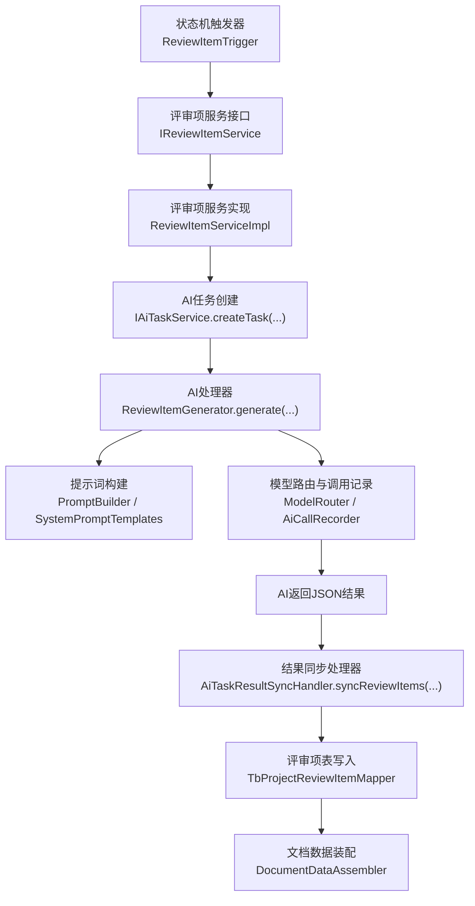
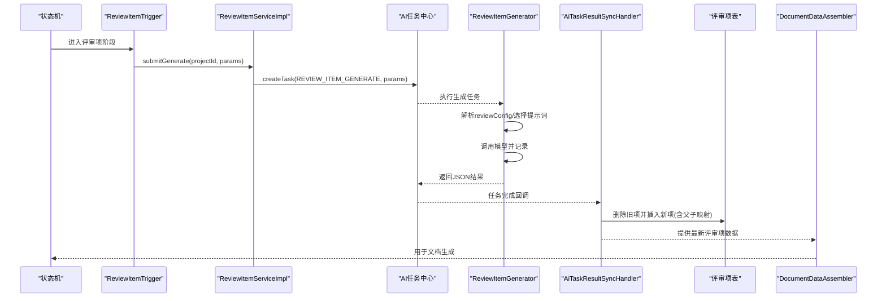
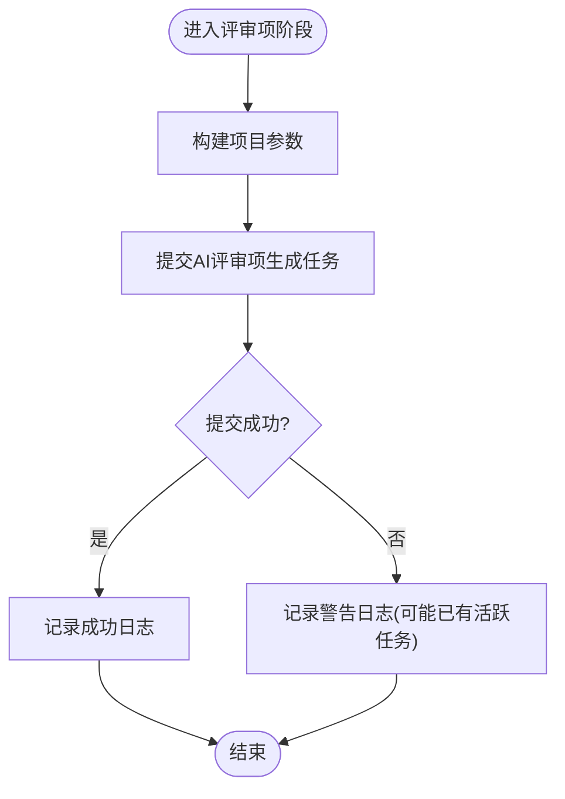
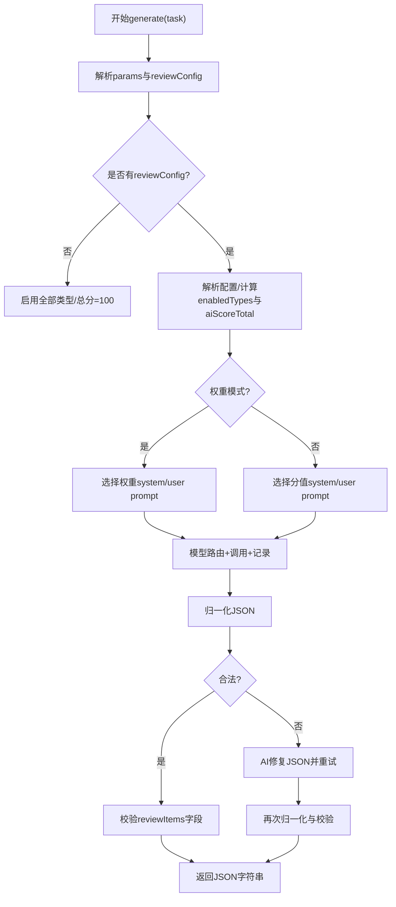
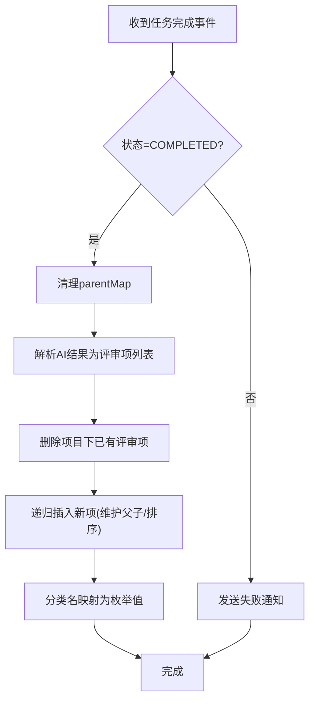
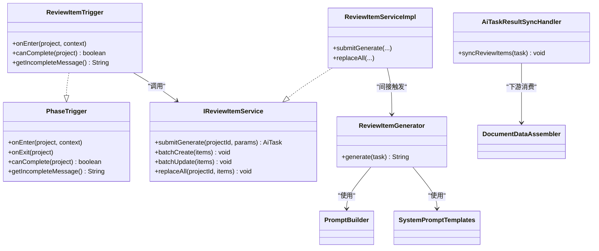

# 评审项阶段触发器

<cite>
**本文引用的文件**
- [ReviewItemTrigger.java](file://ele-ai-tender-system/ele-ai-tender-core/src/main/java/com/jy/eleaitender/core/statemachine/trigger/ReviewItemTrigger.java)
- [PhaseTrigger.java](file://ele-ai-tender-system/ele-ai-tender-core/src/main/java/com/jy/eleaitender/core/statemachine/PhaseTrigger.java)
- [IReviewItemService.java](file://ele-ai-tender-system/ele-ai-tender-core/src/main/java/com/jy/eleaitender/core/service/IReviewItemService.java)
- [ReviewItemServiceImpl.java](file://ele-ai-tender-system/ele-ai-tender-core/src/main/java/com/jy/eleaitender/core/service/impl/ReviewItemServiceImpl.java)
- [AiTaskResultSyncHandler.java](file://ele-ai-tender-system/ele-ai-tender-core/src/main/java/com/jy/eleaitender/core/scheduler/AiTaskResultSyncHandler.java)
- [ReviewItemGenerator.java](file://ele-ai-tender-system/ele-ai-tender-ai/src/main/java/com/jy/eleaitender/ai/processor/generator/ReviewItemGenerator.java)
- [PromptBuilder.java](file://ele-ai-tender-system/ele-ai-tender-ai/src/main/java/com/jy/eleaitender/ai/processor/prompt/PromptBuilder.java)
- [SystemPromptTemplates.java](file://ele-ai-tender-system/ele-ai-tender-ai/src/main/java/com/jy/eleaitender/ai/processor/prompt/SystemPromptTemplates.java)
- [DocumentDataAssembler.java](file://ele-ai-tender-system/ele-ai-tender-core/src/main/java/com/jy/eleaitender/core/engine/DocumentDataAssembler.java)
- [ReviewConfig.java](file://ele-ai-tender-system/ele-ai-tender-common/src/main/java/com/jy/eleaitender/common/dto/ReviewConfig.java)
</cite>

## 目录
1. [简介](#简介)
2. [项目结构](#项目结构)
3. [核心组件](#核心组件)
4. [架构总览](#架构总览)
5. [详细组件分析](#详细组件分析)
6. [依赖关系分析](#依赖关系分析)
7. [性能与扩展性](#性能与扩展性)
8. [故障排查指南](#故障排查指南)
9. [结论](#结论)
10. [附录：扩展与集成示例](#附录扩展与集成示例)

## 简介
本技术文档聚焦“评审项设置阶段”的触发器实现，围绕 ReviewItemTrigger 的业务逻辑展开，包括：
- 进入阶段时自动生成评审项相关 AI 任务（onEnter）
- 离开阶段时的完成条件判断（canComplete）
- 评审结果同步与数据落库（AI 任务完成后）
- 评分标准与配置校验、权重/分值模式差异
- 评审结果计算与后续文档组装
并提供可扩展的评审规则与评分算法集成方式。

## 项目结构
评审项阶段触发器位于核心模块的状态机触发层，负责在项目进入“评审项设置”阶段时自动发起 AI 评审项生成任务；AI 侧生成评审项 JSON，再由调度器将结果同步回数据库，最终在文档生成阶段被装配为表格或 Markdown 内容。

图表来源
- [ReviewItemTrigger.java:37-55](file://ele-ai-tender-system/ele-ai-tender-core/src/main/java/com/jy/eleaitender/core/statemachine/trigger/ReviewItemTrigger.java#L37-L55)
- [IReviewItemService.java:34-37](file://ele-ai-tender-system/ele-ai-tender-core/src/main/java/com/jy/eleaitender/core/service/IReviewItemService.java#L34-L37)
- [ReviewItemServiceImpl.java:138-170](file://ele-ai-tender-system/ele-ai-tender-core/src/main/java/com/jy/eleaitender/core/service/impl/ReviewItemServiceImpl.java#L138-L170)
- [ReviewItemGenerator.java:74-146](file://ele-ai-tender-system/ele-ai-tender-ai/src/main/java/com/jy/eleaitender/ai/processor/generator/ReviewItemGenerator.java#L74-L146)
- [PromptBuilder.java:95-113](file://ele-ai-tender-system/ele-ai-tender-ai/src/main/java/com/jy/eleaitender/ai/processor/prompt/PromptBuilder.java#L95-L113)
- [SystemPromptTemplates.java:274-306](file://ele-ai-tender-system/ele-ai-tender-ai/src/main/java/com/jy/eleaitender/ai/processor/prompt/SystemPromptTemplates.java#L274-L306)
- [AiTaskResultSyncHandler.java:180-197](file://ele-ai-tender-system/ele-ai-tender-core/src/main/java/com/jy/eleaitender/core/scheduler/AiTaskResultSyncHandler.java#L180-L197)
- [DocumentDataAssembler.java:80-98](file://ele-ai-tender-system/ele-ai-tender-core/src/main/java/com/jy/eleaitender/core/engine/DocumentDataAssembler.java#L80-L98)

章节来源
- [ReviewItemTrigger.java:37-66](file://ele-ai-tender-system/ele-ai-tender-core/src/main/java/com/jy/eleaitender/core/statemachine/trigger/ReviewItemTrigger.java#L37-L66)
- [IReviewItemService.java:12-53](file://ele-ai-tender-system/ele-ai-tender-core/src/main/java/com/jy/eleaitender/core/service/IReviewItemService.java#L12-L53)
- [ReviewItemServiceImpl.java:138-170](file://ele-ai-tender-system/ele-ai-tender-core/src/main/java/com/jy/eleaitender/core/service/impl/ReviewItemServiceImpl.java#L138-L170)
- [ReviewItemGenerator.java:74-146](file://ele-ai-tender-system/ele-ai-tender-ai/src/main/java/com/jy/eleaitender/ai/processor/generator/ReviewItemGenerator.java#L74-L146)
- [AiTaskResultSyncHandler.java:180-197](file://ele-ai-tender-system/ele-ai-tender-core/src/main/java/com/jy/eleaitender/core/scheduler/AiTaskResultSyncHandler.java#L180-L197)
- [DocumentDataAssembler.java:80-98](file://ele-ai-tender-system/ele-ai-tender-core/src/main/java/com/jy/eleaitender/core/engine/DocumentDataAssembler.java#L80-L98)

## 核心组件
- 阶段触发器：ReviewItemTrigger
  - onEnter：进入阶段时自动提交评审项生成任务
  - canComplete：检查是否已有评审项，作为阶段推进条件
- 评审项服务：IReviewItemService / ReviewItemServiceImpl
  - submitGenerate：封装项目信息、模板配置，创建 AI 任务
  - replaceAll/batchCreate/batchUpdate：批量维护评审项树
- AI 生成器：ReviewItemGenerator
  - generate：解析参数、选择系统/用户提示词、调用模型、修复并归一化 JSON
- 结果同步：AiTaskResultSyncHandler
  - syncReviewItems：解析 AI 输出、映射分类、写入评审项表
- 文档装配：DocumentDataAssembler
  - 按类型分组、构建汇总表格与符合性审查 Markdown

章节来源
- [ReviewItemTrigger.java:37-66](file://ele-ai-tender-system/ele-ai-tender-core/src/main/java/com/jy/eleaitender/core/statemachine/trigger/ReviewItemTrigger.java#L37-L66)
- [IReviewItemService.java:12-53](file://ele-ai-tender-system/ele-ai-tender-core/src/main/java/com/jy/eleaitender/core/service/IReviewItemService.java#L12-L53)
- [ReviewItemServiceImpl.java:138-170](file://ele-ai-tender-system/ele-ai-tender-core/src/main/java/com/jy/eleaitender/core/service/impl/ReviewItemServiceImpl.java#L138-L170)
- [ReviewItemGenerator.java:74-146](file://ele-ai-tender-system/ele-ai-tender-ai/src/main/java/com/jy/eleaitender/ai/processor/generator/ReviewItemGenerator.java#L74-L146)
- [AiTaskResultSyncHandler.java:180-197](file://ele-ai-tender-system/ele-ai-tender-core/src/main/java/com/jy/eleaitender/core/scheduler/AiTaskResultSyncHandler.java#L180-L197)
- [DocumentDataAssembler.java:80-98](file://ele-ai-tender-system/ele-ai-tender-core/src/main/java/com/jy/eleaitender/core/engine/DocumentDataAssembler.java#L80-L98)

## 架构总览
评审项阶段触发器的端到端流程如下：

图表来源
- [ReviewItemTrigger.java:37-55](file://ele-ai-tender-system/ele-ai-tender-core/src/main/java/com/jy/eleaitender/core/statemachine/trigger/ReviewItemTrigger.java#L37-L55)
- [ReviewItemServiceImpl.java:138-170](file://ele-ai-tender-system/ele-ai-tender-core/src/main/java/com/jy/eleaitender/core/service/impl/ReviewItemServiceImpl.java#L138-L170)
- [ReviewItemGenerator.java:74-146](file://ele-ai-tender-system/ele-ai-tender-ai/src/main/java/com/jy/eleaitender/ai/processor/generator/ReviewItemGenerator.java#L74-L146)
- [AiTaskResultSyncHandler.java:180-197](file://ele-ai-tender-system/ele-ai-tender-core/src/main/java/com/jy/eleaitender/core/scheduler/AiTaskResultSyncHandler.java#L180-L197)
- [DocumentDataAssembler.java:80-98](file://ele-ai-tender-system/ele-ai-tender-core/src/main/java/com/jy/eleaitender/core/engine/DocumentDataAssembler.java#L80-L98)

## 详细组件分析

### 评审项阶段触发器 ReviewItemTrigger
- onEnter
  - 组装项目上下文参数（项目名称、类型、类别、预算、评审方法、需求内容等）
  - 调用评审项服务提交生成任务
  - 异常捕获并记录日志，避免阻塞阶段流转
- canComplete
  - 查询该项目下是否存在评审项，存在则允许推进
- getIncompleteMessage
  - 未满足完成条件时的提示信息

图表来源
- [ReviewItemTrigger.java:37-55](file://ele-ai-tender-system/ele-ai-tender-core/src/main/java/com/jy/eleaitender/core/statemachine/trigger/ReviewItemTrigger.java#L37-L55)

章节来源
- [ReviewItemTrigger.java:37-66](file://ele-ai-tender-system/ele-ai-tender-core/src/main/java/com/jy/eleaitender/core/statemachine/trigger/ReviewItemTrigger.java#L37-L66)
- [PhaseTrigger.java:11-39](file://ele-ai-tender-system/ele-ai-tender-core/src/main/java/com/jy/eleaitender/core/statemachine/PhaseTrigger.java#L11-L39)

### 评审项服务 ReviewItemServiceImpl
- submitGenerate
  - 读取项目信息与模板配置（包含 reviewConfig）
  - 构造 ReviewItemGenerateParams
  - 通过 IAiTaskService 创建 REVIEW_ITEM_GENERATE 任务
- 其他能力
  - 级联删除、层级校验（最大深度）、排序号默认值
  - 批量创建/更新/替换（replaceAll），支持客户端父子映射回填

章节来源
- [ReviewItemServiceImpl.java:138-170](file://ele-ai-tender-system/ele-ai-tender-core/src/main/java/com/jy/eleaitender/core/service/impl/ReviewItemServiceImpl.java#L138-L170)
- [ReviewItemServiceImpl.java:58-91](file://ele-ai-tender-system/ele-ai-tender-core/src/main/java/com/jy/eleaitender/core/service/impl/ReviewItemServiceImpl.java#L58-L91)
- [ReviewItemServiceImpl.java:212-274](file://ele-ai-tender-system/ele-ai-tender-core/src/main/java/com/jy/eleaitender/core/service/impl/ReviewItemServiceImpl.java#L212-L274)

### AI 评审项生成 ReviewItemGenerator
- 参数解析与配置加载
  - 从任务请求参数中解析 reviewConfig
  - 根据评分模式（SCORE/WEIGHT）决定启用类型集合与总分目标
- 提示词构建
  - 分值模式：使用带“叶子节点合计=100分”的系统提示词与用户提示词
  - 权重模式：使用权重版系统提示词与用户提示词
- 模型调用与容错
  - 模型路由选择
  - 调用记录
  - JSON 归一化与失败重试（AI 修复）
- 结果校验
  - 确保根节点包含 reviewItems 数组

图表来源
- [ReviewItemGenerator.java:74-146](file://ele-ai-tender-system/ele-ai-tender-ai/src/main/java/com/jy/eleaitender/ai/processor/generator/ReviewItemGenerator.java#L74-L146)
- [PromptBuilder.java:95-113](file://ele-ai-tender-system/ele-ai-tender-ai/src/main/java/com/jy/eleaitender/ai/processor/prompt/PromptBuilder.java#L95-L113)
- [SystemPromptTemplates.java:274-306](file://ele-ai-tender-system/ele-ai-tender-ai/src/main/java/com/jy/eleaitender/ai/processor/prompt/SystemPromptTemplates.java#L274-L306)

章节来源
- [ReviewItemGenerator.java:74-146](file://ele-ai-tender-system/ele-ai-tender-ai/src/main/java/com/jy/eleaitender/ai/processor/generator/ReviewItemGenerator.java#L74-L146)
- [PromptBuilder.java:95-113](file://ele-ai-tender-system/ele-ai-tender-ai/src/main/java/com/jy/eleaitender/ai/processor/prompt/PromptBuilder.java#L95-L113)
- [SystemPromptTemplates.java:274-306](file://ele-ai-tender-system/ele-ai-tender-ai/src/main/java/com/jy/eleaitender/ai/processor/prompt/SystemPromptTemplates.java#L274-L306)

### 评审结果同步 AiTaskResultSyncHandler
- 非成功状态：发送失败通知
- 成功状态：
  - 清空父→子映射缓存
  - 解析 AI 结果为评审项列表
  - 先删除该项目下已有评审项（全量覆盖）
  - 递归写入，维护父子关系与排序
  - 一级分类名称到枚举值的映射（如“符合性/资信/技术/商务”）

图表来源
- [AiTaskResultSyncHandler.java:180-197](file://ele-ai-tender-system/ele-ai-tender-core/src/main/java/com/jy/eleaitender/core/scheduler/AiTaskResultSyncHandler.java#L180-L197)
- [AiTaskResultSyncHandler.java:494-522](file://ele-ai-tender-system/ele-ai-tender-core/src/main/java/com/jy/eleaitender/core/scheduler/AiTaskResultSyncHandler.java#L494-L522)

章节来源
- [AiTaskResultSyncHandler.java:180-197](file://ele-ai-tender-system/ele-ai-tender-core/src/main/java/com/jy/eleaitender/core/scheduler/AiTaskResultSyncHandler.java#L180-L197)
- [AiTaskResultSyncHandler.java:494-522](file://ele-ai-tender-system/ele-ai-tender-core/src/main/java/com/jy/eleaitender/core/scheduler/AiTaskResultSyncHandler.java#L494-L522)

### 文档数据装配 DocumentDataAssembler
- 按评审类型分组（含默认“符合性审查”）
- 构建符合性审查 Markdown（二级+三级列表）
- 构建评审汇总表（合并同类项列）

章节来源
- [DocumentDataAssembler.java:80-98](file://ele-ai-tender-system/ele-ai-tender-core/src/main/java/com/jy/eleaitender/core/engine/DocumentDataAssembler.java#L80-L98)
- [DocumentDataAssembler.java:106-121](file://ele-ai-tender-system/ele-ai-tender-core/src/main/java/com/jy/eleaitender/core/engine/DocumentDataAssembler.java#L106-L121)
- [DocumentDataAssembler.java:123-132](file://ele-ai-tender-system/ele-ai-tender-core/src/main/java/com/jy/eleaitender/core/engine/DocumentDataAssembler.java#L123-L132)

## 依赖关系分析
- 触发器与服务的耦合
  - ReviewItemTrigger 仅依赖 PhaseTrigger 接口约定与 IReviewItemService，低耦合、易替换
- 服务与 AI 任务的解耦
  - ReviewItemServiceImpl 通过 IAiTaskService 创建任务，不关心具体执行细节
- AI 生成器与提示词/路由
  - ReviewItemGenerator 依赖 PromptBuilder 与 SystemPromptTemplates 控制提示词策略，依赖 ModelRouter 与 AiCallRecorder 进行模型选择与记录
- 结果同步与持久化
  - AiTaskResultSyncHandler 直接操作评审项 Mapper，保证幂等（先删后插）

图表来源
- [PhaseTrigger.java:11-39](file://ele-ai-tender-system/ele-ai-tender-core/src/main/java/com/jy/eleaitender/core/statemachine/PhaseTrigger.java#L11-L39)
- [ReviewItemTrigger.java:23-67](file://ele-ai-tender-system/ele-ai-tender-core/src/main/java/com/jy/eleaitender/core/statemachine/trigger/ReviewItemTrigger.java#L23-L67)
- [IReviewItemService.java:12-53](file://ele-ai-tender-system/ele-ai-tender-core/src/main/java/com/jy/eleaitender/core/service/IReviewItemService.java#L12-L53)
- [ReviewItemServiceImpl.java:33-170](file://ele-ai-tender-system/ele-ai-tender-core/src/main/java/com/jy/eleaitender/core/service/impl/ReviewItemServiceImpl.java#L33-L170)
- [ReviewItemGenerator.java:74-146](file://ele-ai-tender-system/ele-ai-tender-ai/src/main/java/com/jy/eleaitender/ai/processor/generator/ReviewItemGenerator.java#L74-L146)
- [PromptBuilder.java:95-113](file://ele-ai-tender-system/ele-ai-tender-ai/src/main/java/com/jy/eleaitender/ai/processor/prompt/PromptBuilder.java#L95-L113)
- [SystemPromptTemplates.java:274-306](file://ele-ai-tender-system/ele-ai-tender-ai/src/main/java/com/jy/eleaitender/ai/processor/prompt/SystemPromptTemplates.java#L274-L306)
- [AiTaskResultSyncHandler.java:180-197](file://ele-ai-tender-system/ele-ai-tender-core/src/main/java/com/jy/eleaitender/core/scheduler/AiTaskResultSyncHandler.java#L180-L197)

章节来源
- [ReviewItemTrigger.java:23-67](file://ele-ai-tender-system/ele-ai-tender-core/src/main/java/com/jy/eleaitender/core/statemachine/trigger/ReviewItemTrigger.java#L23-L67)
- [IReviewItemService.java:12-53](file://ele-ai-tender-system/ele-ai-tender-core/src/main/java/com/jy/eleaitender/core/service/IReviewItemService.java#L12-L53)
- [ReviewItemServiceImpl.java:33-170](file://ele-ai-tender-system/ele-ai-tender-core/src/main/java/com/jy/eleaitender/core/service/impl/ReviewItemServiceImpl.java#L33-L170)
- [ReviewItemGenerator.java:74-146](file://ele-ai-tender-system/ele-ai-tender-ai/src/main/java/com/jy/eleaitender/ai/processor/generator/ReviewItemGenerator.java#L74-L146)
- [AiTaskResultSyncHandler.java:180-197](file://ele-ai-tender-system/ele-ai-tender-core/src/main/java/com/jy/eleaitender/core/scheduler/AiTaskResultSyncHandler.java#L180-L197)

## 性能与扩展性
- 异步任务与幂等写入
  - 评审项生成以异步任务形式执行，避免阻塞主流程
  - 结果同步采用“先删后插”，保证幂等与一致性
- 提示词与模型路由
  - 通过 PromptBuilder 与 SystemPromptTemplates 集中管理提示词策略，便于 A/B 测试与灰度
  - 模型路由可独立演进，不影响上层业务
- 可扩展点
  - 新增评审类型：在枚举与映射处扩展
  - 新增评分算法：在生成器与同步处理中扩展校验与计算逻辑
  - 自定义提示词：在提示词模板中扩展约束与示例

[本节为通用指导，无需代码引用]

## 故障排查指南
- 进入阶段未触发生成
  - 检查 ReviewItemTrigger.onEnter 是否被调用
  - 查看日志中“自动触发评审项生成”的成功/警告信息
- 生成失败或无结果
  - 关注 AiTaskResultSyncHandler 的非成功状态分支与失败通知
  - 检查 ReviewItemGenerator 的 JSON 归一化与修复流程
- 评审项为空导致无法推进
  - 确认 canComplete 查询结果是否为空
  - 检查同步处理器是否正确写入评审项
- 评分/权重不一致
  - 核对 ReviewConfig 的 scoreMode 与 enabledTypes
  - 检查分值模式下“手动评分合计”与“AI剩余总分”的计算

章节来源
- [ReviewItemTrigger.java:37-55](file://ele-ai-tender-system/ele-ai-tender-core/src/main/java/com/jy/eleaitender/core/statemachine/trigger/ReviewItemTrigger.java#L37-L55)
- [AiTaskResultSyncHandler.java:180-197](file://ele-ai-tender-system/ele-ai-tender-core/src/main/java/com/jy/eleaitender/core/scheduler/AiTaskResultSyncHandler.java#L180-L197)
- [ReviewItemGenerator.java:138-146](file://ele-ai-tender-system/ele-ai-tender-ai/src/main/java/com/jy/eleaitender/ai/processor/generator/ReviewItemGenerator.java#L138-L146)

## 结论
ReviewItemTrigger 将“评审项设置”阶段的自动化与完整性校验有机结合：进入阶段即自动发起 AI 评审项生成，离开阶段基于是否存在评审项进行推进控制。配合 ReviewItemGenerator 的提示词策略与容错机制、AiTaskResultSyncHandler 的幂等写入以及 DocumentDataAssembler 的数据装配，形成完整的评审项生命周期闭环。该设计具备良好的扩展性与可观测性，便于持续优化评分规则与模型策略。

[本节为总结，无需代码引用]

## 附录：扩展与集成示例
- 扩展评审规则（新增类型/约束）
  - 在评审类型枚举与映射处增加新类型
  - 在 ReviewItemGenerator 的类型过滤与提示词中纳入新类型
  - 在 AiTaskResultSyncHandler 的分类映射中补充中文到枚举的映射
- 集成新的评分算法
  - 在 ReviewItemGenerator 中扩展评分校验逻辑（例如新增“客观/主观”比例约束）
  - 在同步处理器中增加对应字段写入与校验
- 自定义提示词
  - 在 SystemPromptTemplates 与 UserPromptTemplates 中新增模板
  - 在 PromptBuilder 中暴露构建方法供生成器选择
- 参考路径
  - 评审项触发与服务：[ReviewItemTrigger.java](file://ele-ai-tender-system/ele-ai-tender-core/src/main/java/com/jy/eleaitender/core/statemachine/trigger/ReviewItemTrigger.java)、[ReviewItemServiceImpl.java](file://ele-ai-tender-system/ele-ai-tender-core/src/main/java/com/jy/eleaitender/core/service/impl/ReviewItemServiceImpl.java)
  - AI 生成与提示词：[ReviewItemGenerator.java](file://ele-ai-tender-system/ele-ai-tender-ai/src/main/java/com/jy/eleaitender/ai/processor/generator/ReviewItemGenerator.java)、[PromptBuilder.java](file://ele-ai-tender-system/ele-ai-tender-ai/src/main/java/com/jy/eleaitender/ai/processor/prompt/PromptBuilder.java)、[SystemPromptTemplates.java](file://ele-ai-tender-system/ele-ai-tender-ai/src/main/java/com/jy/eleaitender/ai/processor/prompt/SystemPromptTemplates.java)
  - 结果同步与装配：[AiTaskResultSyncHandler.java](file://ele-ai-tender-system/ele-ai-tender-core/src/main/java/com/jy/eleaitender/core/scheduler/AiTaskResultSyncHandler.java)、[DocumentDataAssembler.java](file://ele-ai-tender-system/ele-ai-tender-core/src/main/java/com/jy/eleaitender/core/engine/DocumentDataAssembler.java)
  - 评审配置模型：[ReviewConfig.java](file://ele-ai-tender-system/ele-ai-tender-common/src/main/java/com/jy/eleaitender/common/dto/ReviewConfig.java)