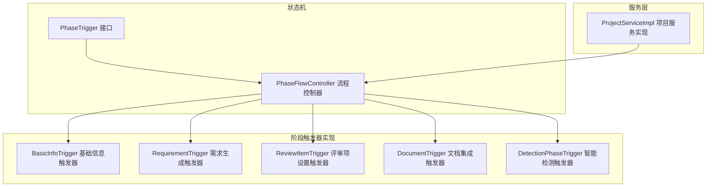
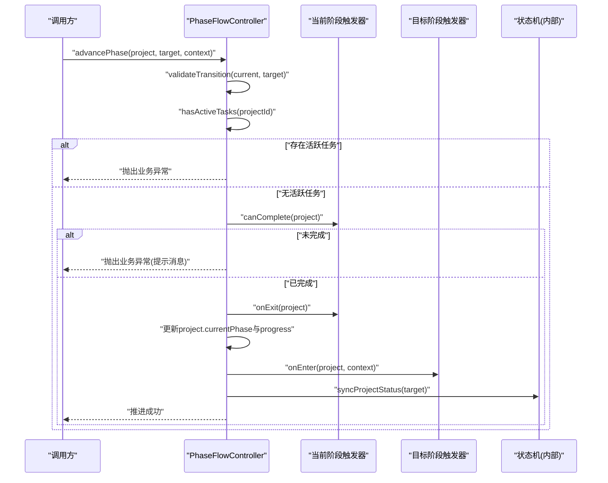
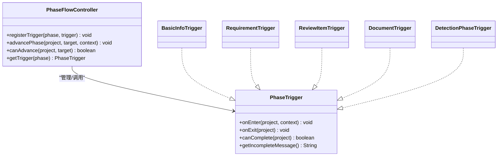
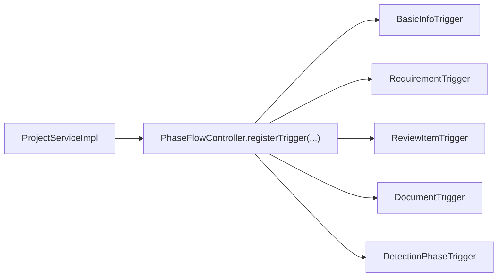
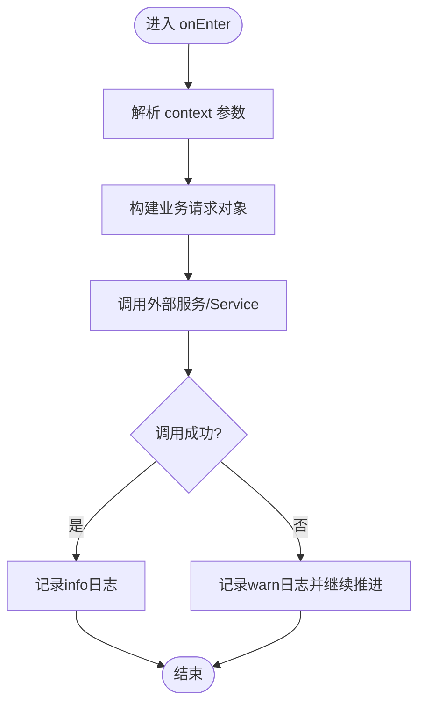

# 阶段触发器接口

<cite>
**本文引用的文件**   
- [PhaseTrigger.java](file://ele-ai-tender-system/ele-ai-tender-core/src/main/java/com/jy/eleaitender/core/statemachine/PhaseTrigger.java)
- [PhaseFlowController.java](file://ele-ai-tender-system/ele-ai-tender-core/src/main/java/com/jy/eleaitender/core/statemachine/PhaseFlowController.java)
- [BasicInfoTrigger.java](file://ele-ai-tender-system/ele-ai-tender-core/src/main/java/com/jy/eleaitender/core/statemachine/trigger/BasicInfoTrigger.java)
- [RequirementTrigger.java](file://ele-ai-tender-system/ele-ai-tender-core/src/main/java/com/jy/eleaitender/core/statemachine/trigger/RequirementTrigger.java)
- [ReviewItemTrigger.java](file://ele-ai-tender-system/ele-ai-tender-core/src/main/java/com/jy/eleaitender/core/statemachine/trigger/ReviewItemTrigger.java)
- [DocumentTrigger.java](file://ele-ai-tender-system/ele-ai-tender-core/src/main/java/com/jy/eleaitender/core/statemachine/trigger/DocumentTrigger.java)
- [DetectionPhaseTrigger.java](file://ele-ai-tender-system/ele-ai-tender-core/src/main/java/com/jy/eleaitender/core/statemachine/trigger/DetectionPhaseTrigger.java)
- [ProjectServiceImpl.java](file://ele-ai-tender-system/ele-ai-tender-core/src/main/java/com/jy/eleaitender/core/service/impl/ProjectServiceImpl.java)
- [PHASE_FLOW_SPEC.md](file://docs/rules/PHASE_FLOW_SPEC.md)
</cite>

## 目录
1. [简介](#简介)
2. [项目结构](#项目结构)
3. [核心组件](#核心组件)
4. [架构总览](#架构总览)
5. [详细组件分析](#详细组件分析)
6. [依赖关系分析](#依赖关系分析)
7. [性能与可靠性考虑](#性能与可靠性考虑)
8. [故障排查指南](#故障排查指南)
9. [结论](#结论)
10. [附录：自定义触发器实现指南](#附录自定义触发器实现指南)

## 简介
本技术文档围绕“阶段触发器接口 PhaseTrigger”的设计模式、核心方法定义、生命周期管理以及扩展机制进行深入说明。重点覆盖以下方面：
- canComplete 的完成条件验证逻辑
- onExit 的离开前处理机制
- onEnter 的进入后自动执行逻辑
- 触发器的注册与发现机制
- 在项目状态流转中的作用与生命周期
- 自定义触发器的最佳实践（参数传递、异常处理、日志记录）

## 项目结构
阶段触发器相关代码集中在 core 模块的状态机包中，包含接口定义、流程控制器与各阶段的触发器实现。

图表来源
- [PhaseTrigger.java:1-40](file://ele-ai-tender-system/ele-ai-tender-core/src/main/java/com/jy/eleaitender/core/statemachine/PhaseTrigger.java#L1-L40)
- [PhaseFlowController.java:1-176](file://ele-ai-tender-system/ele-ai-tender-core/src/main/java/com/jy/eleaitender/core/statemachine/PhaseFlowController.java#L1-L176)
- [BasicInfoTrigger.java:1-28](file://ele-ai-tender-system/ele-ai-tender-core/src/main/java/com/jy/eleaitender/core/statemachine/trigger/BasicInfoTrigger.java#L1-L28)
- [RequirementTrigger.java:1-70](file://ele-ai-tender-system/ele-ai-tender-core/src/main/java/com/jy/eleaitender/core/statemachine/trigger/RequirementTrigger.java#L1-L70)
- [ReviewItemTrigger.java:1-68](file://ele-ai-tender-system/ele-ai-tender-core/src/main/java/com/jy/eleaitender/core/statemachine/trigger/ReviewItemTrigger.java#L1-L68)
- [DocumentTrigger.java:1-47](file://ele-ai-tender-system/ele-ai-tender-core/src/main/java/com/jy/eleaitender/core/statemachine/trigger/DocumentTrigger.java#L1-L47)
- [DetectionPhaseTrigger.java:1-71](file://ele-ai-tender-system/ele-ai-tender-core/src/main/java/com/jy/eleaitender/core/statemachine/trigger/DetectionPhaseTrigger.java#L1-L71)
- [ProjectServiceImpl.java:76-82](file://ele-ai-tender-system/ele-ai-tender-core/src/main/java/com/jy/eleaitender/core/service/impl/ProjectServiceImpl.java#L76-L82)

章节来源
- [PhaseTrigger.java:1-40](file://ele-ai-tender-system/ele-ai-tender-core/src/main/java/com/jy/eleaitender/core/statemachine/PhaseTrigger.java#L1-L40)
- [PhaseFlowController.java:1-176](file://ele-ai-tender-system/ele-ai-tender-core/src/main/java/com/jy/eleaitender/core/statemachine/PhaseFlowController.java#L1-L176)
- [ProjectServiceImpl.java:76-82](file://ele-ai-tender-system/ele-ai-tender-core/src/main/java/com/jy/eleaitender/core/service/impl/ProjectServiceImpl.java#L76-L82)

## 核心组件
- PhaseTrigger 接口：定义阶段生命周期钩子与完成校验能力。
- PhaseFlowController：负责阶段推进流程编排、触发器注册与调用、阶段与状态联动。
- 各阶段触发器实现：针对具体业务阶段提供完成条件与自动化行为。

章节来源
- [PhaseTrigger.java:11-39](file://ele-ai-tender-system/ele-ai-tender-core/src/main/java/com/jy/eleaitender/core/statemachine/PhaseTrigger.java#L11-L39)
- [PhaseFlowController.java:41-96](file://ele-ai-tender-system/ele-ai-tender-core/src/main/java/com/jy/eleaitender/core/statemachine/PhaseFlowController.java#L41-L96)

## 架构总览
阶段推进的整体时序如下：
- 校验转换规则（仅允许顺序推进到下一阶段）
- 检查是否存在活跃 AI 任务（有则禁止推进）
- 执行当前阶段触发器的 onExit（含 canComplete 校验）
- 更新目标阶段与进度
- 执行目标阶段触发器的 onEnter（可自动发起异步任务）
- 同步项目状态（Phase → Status 联动）

图表来源
- [PhaseFlowController.java:57-96](file://ele-ai-tender-system/ele-ai-tender-core/src/main/java/com/jy/eleaitender/core/statemachine/PhaseFlowController.java#L57-L96)
- [PhaseFlowController.java:134-167](file://ele-ai-tender-system/ele-ai-tender-core/src/main/java/com/jy/eleaitender/core/statemachine/PhaseFlowController.java#L134-L167)

## 详细组件分析

### PhaseTrigger 接口设计
- onEnter(TbProject project, Map<String, Object> context)
  - 默认空实现，用于进入阶段后的自动执行逻辑（如提交AI任务）。
  - context 支持运行时数据透传，例如 DETECTION 阶段使用 policyFileIds。
- onExit(TbProject project)
  - 默认空实现，用于离开阶段前的收尾处理。
- canComplete(TbProject project)
  - 必须实现，返回当前阶段是否满足推进条件。
- getIncompleteMessage()
  - 默认提示信息，可在不满足条件时返回更友好的用户提示。

章节来源
- [PhaseTrigger.java:11-39](file://ele-ai-tender-system/ele-ai-tender-core/src/main/java/com/jy/eleaitender/core/statemachine/PhaseTrigger.java#L11-L39)

### PhaseFlowController 流程控制
- registerTrigger(ProjectPhase phase, PhaseTrigger trigger)
  - 将阶段与触发器建立映射，供后续推进流程调用。
- advancePhase(...)
  - 统一编排阶段推进流程，包括前置校验、触发器回调、状态联动。
- canAdvance(...)
  - 非阻塞式判断是否可推进（常用于前端按钮可用性控制）。
- syncProjectStatus(...)
  - 根据目标阶段映射到预期状态，必要时通过状态机进行多步转换。

章节来源
- [PhaseFlowController.java:41-96](file://ele-ai-tender-system/ele-ai-tender-core/src/main/java/com/jy/eleaitender/core/statemachine/PhaseFlowController.java#L41-L96)
- [PhaseFlowController.java:98-126](file://ele-ai-tender-system/ele-ai-tender-core/src/main/java/com/jy/eleaitender/core/statemachine/PhaseFlowController.java#L98-L126)
- [PhaseFlowController.java:134-167](file://ele-ai-tender-system/ele-ai-tender-core/src/main/java/com/jy/eleaitender/core/statemachine/PhaseFlowController.java#L134-L167)

### 触发器实现详解

#### BasicInfoTrigger（基础信息阶段）
- canComplete：校验项目名称、类别、类型是否为空。
- getIncompleteMessage：给出完善必填信息的提示。

章节来源
- [BasicInfoTrigger.java:16-26](file://ele-ai-tender-system/ele-ai-tender-core/src/main/java/com/jy/eleaitender/core/statemachine/trigger/BasicInfoTrigger.java#L16-L26)

#### RequirementTrigger（需求生成阶段）
- onEnter：若项目已关联需求则回填内容；否则自动触发AI需求生成任务。
- canComplete：存在需求ID或需求内容即视为完成。
- 异常处理：捕获异常并记录警告日志，不阻塞阶段推进。

章节来源
- [RequirementTrigger.java:39-56](file://ele-ai-tender-system/ele-ai-tender-core/src/main/java/com/jy/eleaitender/core/statemachine/trigger/RequirementTrigger.java#L39-L56)
- [RequirementTrigger.java:59-67](file://ele-ai-tender-system/ele-ai-tender-core/src/main/java/com/jy/eleaitender/core/statemachine/trigger/RequirementTrigger.java#L59-L67)

#### ReviewItemTrigger（评审项设置阶段）
- onEnter：组装项目上下文参数，自动触发评审项生成任务。
- canComplete：查询评审项列表非空即视为完成。
- 异常处理：捕获异常并记录警告日志，不阻塞阶段推进。

章节来源
- [ReviewItemTrigger.java:37-55](file://ele-ai-tender-system/ele-ai-tender-core/src/main/java/com/jy/eleaitender/core/statemachine/trigger/ReviewItemTrigger.java#L37-L55)
- [ReviewItemTrigger.java:58-66](file://ele-ai-tender-system/ele-ai-tender-core/src/main/java/com/jy/eleaitender/core/statemachine/trigger/ReviewItemTrigger.java#L58-L66)

#### DocumentTrigger（文档集成阶段）
- onEnter：自动执行文档集成任务。
- canComplete：存在生成的文件ID即视为完成。
- 异常处理：捕获异常并记录警告日志，不阻塞阶段推进。

章节来源
- [DocumentTrigger.java:25-35](file://ele-ai-tender-system/ele-ai-tender-core/src/main/java/com/jy/eleaitender/core/statemachine/trigger/DocumentTrigger.java#L25-L35)
- [DocumentTrigger.java:38-45](file://ele-ai-tender-system/ele-ai-tender-core/src/main/java/com/jy/eleaitender/core/statemachine/trigger/DocumentTrigger.java#L38-L45)

#### DetectionPhaseTrigger（智能检测阶段）
- onEnter：从 context 提取 policyFileIds，构建请求并提交检测任务。
- canComplete：检测通过或跳过即视为完成。
- 异常处理：捕获异常并记录警告日志，不阻塞阶段推进。

章节来源
- [DetectionPhaseTrigger.java:28-57](file://ele-ai-tender-system/ele-ai-tender-core/src/main/java/com/jy/eleaitender/core/statemachine/trigger/DetectionPhaseTrigger.java#L28-L57)
- [DetectionPhaseTrigger.java:60-69](file://ele-ai-tender-system/ele-ai-tender-core/src/main/java/com/jy/eleaitender/core/statemachine/trigger/DetectionPhaseTrigger.java#L60-L69)

### 类图（触发器与控制器关系）

图表来源
- [PhaseTrigger.java:11-39](file://ele-ai-tender-system/ele-ai-tender-core/src/main/java/com/jy/eleaitender/core/statemachine/PhaseTrigger.java#L11-L39)
- [PhaseFlowController.java:41-96](file://ele-ai-tender-system/ele-ai-tender-core/src/main/java/com/jy/eleaitender/core/statemachine/PhaseFlowController.java#L41-L96)
- [BasicInfoTrigger.java:13-27](file://ele-ai-tender-system/ele-ai-tender-core/src/main/java/com/jy/eleaitender/core/statemachine/trigger/BasicInfoTrigger.java#L13-L27)
- [RequirementTrigger.java:25-67](file://ele-ai-tender-system/ele-ai-tender-core/src/main/java/com/jy/eleaitender/core/statemachine/trigger/RequirementTrigger.java#L25-L67)
- [ReviewItemTrigger.java:24-66](file://ele-ai-tender-system/ele-ai-tender-core/src/main/java/com/jy/eleaitender/core/statemachine/trigger/ReviewItemTrigger.java#L24-L66)
- [DocumentTrigger.java:18-45](file://ele-ai-tender-system/ele-ai-tender-core/src/main/java/com/jy/eleaitender/core/statemachine/trigger/DocumentTrigger.java#L18-L45)
- [DetectionPhaseTrigger.java:20-69](file://ele-ai-tender-system/ele-ai-tender-core/src/main/java/com/jy/eleaitender/core/statemachine/trigger/DetectionPhaseTrigger.java#L20-L69)

## 依赖关系分析
- 触发器与服务层的耦合
  - 各触发器通过注入 Service/Mapper 访问业务数据与外部能力（如AI任务、文档集成、检测服务）。
  - 为避免循环依赖，规范建议在 ProjectServiceImpl 中对触发器注入使用 @Lazy（详见规范文档）。
- 触发器注册与发现
  - 在 ProjectServiceImpl 初始化阶段集中注册所有阶段触发器，形成“阶段→触发器”的映射表。
  - PhaseFlowController 提供 getTrigger 以按阶段获取对应触发器实例。

图表来源
- [ProjectServiceImpl.java:76-82](file://ele-ai-tender-system/ele-ai-tender-core/src/main/java/com/jy/eleaitender/core/service/impl/ProjectServiceImpl.java#L76-L82)
- [PhaseFlowController.java:41-47](file://ele-ai-tender-system/ele-ai-tender-core/src/main/java/com/jy/eleaitender/core/statemachine/PhaseFlowController.java#L41-L47)

章节来源
- [PHASE_FLOW_SPEC.md:165-171](file://docs/rules/PHASE_FLOW_SPEC.md#L165-L171)
- [ProjectServiceImpl.java:76-82](file://ele-ai-tender-system/ele-ai-tender-core/src/main/java/com/jy/eleaitender/core/service/impl/ProjectServiceImpl.java#L76-L82)

## 性能与可靠性考虑
- 异步任务容错
  - 触发器 onEnter 中调用外部服务（如AI任务、文档集成、检测）应包裹 try-catch，失败仅记录 warn 日志，不阻塞阶段推进。
- 阶段推进前置校验
  - 存在活跃AI任务时禁止推进，避免并发冲突与资源竞争。
- 状态一致性
  - 进入检测阶段时，可能由 onEnter 触发器先行更新状态为 DETECTING，随后状态同步逻辑需兼容该情况，避免重复转换。

章节来源
- [PHASE_FLOW_SPEC.md:173-183](file://docs/rules/PHASE_FLOW_SPEC.md#L173-L183)
- [PhaseFlowController.java:66-69](file://ele-ai-tender-system/ele-ai-tender-core/src/main/java/com/jy/eleaitender/core/statemachine/PhaseFlowController.java#L66-L69)
- [PhaseFlowController.java:153-163](file://ele-ai-tender-system/ele-ai-tender-core/src/main/java/com/jy/eleaitender/core/statemachine/PhaseFlowController.java#L153-L163)

## 故障排查指南
- 无法推进阶段
  - 检查当前阶段触发器的 canComplete 返回值与 getIncompleteMessage 提示。
  - 确认是否存在活跃AI任务导致被拒绝推进。
- 自动任务未触发
  - 检查 onEnter 中的异常日志（warn），确认是否因外部服务不可用或已有活跃任务导致失败。
- 状态不一致
  - 核对 PHASE_STATUS_MAPPING 与实际状态机转换路径，确保进入检测阶段时的状态流转符合预期。

章节来源
- [PhaseFlowController.java:71-79](file://ele-ai-tender-system/ele-ai-tender-core/src/main/java/com/jy/eleaitender/core/statemachine/PhaseFlowController.java#L71-L79)
- [DetectionPhaseTrigger.java:50-56](file://ele-ai-tender-system/ele-ai-tender-core/src/main/java/com/jy/eleaitender/core/statemachine/trigger/DetectionPhaseTrigger.java#L50-L56)
- [DocumentTrigger.java:27-34](file://ele-ai-tender-system/ele-ai-tender-core/src/main/java/com/jy/eleaitender/core/statemachine/trigger/DocumentTrigger.java#L27-L34)
- [RequirementTrigger.java:48-55](file://ele-ai-tender-system/ele-ai-tender-core/src/main/java/com/jy/eleaitender/core/statemachine/trigger/RequirementTrigger.java#L48-L55)
- [ReviewItemTrigger.java:48-54](file://ele-ai-tender-system/ele-ai-tender-core/src/main/java/com/jy/eleaitender/core/statemachine/trigger/ReviewItemTrigger.java#L48-L54)

## 结论
PhaseTrigger 通过简洁的接口抽象，将阶段的生命周期与业务自动化行为解耦，配合 PhaseFlowController 的流程编排，实现了稳定、可扩展的阶段推进机制。各阶段触发器遵循统一的异常处理与日志记录策略，既保证了用户体验，又提升了系统的健壮性。

## 附录：自定义触发器实现指南

### 设计要点
- 实现 canComplete：明确阶段完成的判定条件（字段非空、子记录存在、外部任务完成等）。
- 可选实现 onEnter/onExit：在合适时机执行自动化逻辑或清理工作。
- 提供 getIncompleteMessage：面向用户的友好提示。

### 参数传递与上下文
- 通过 advancePhase 的 context 参数向 onEnter 传递运行时数据。
- 示例约定：DETECTION 阶段使用 key "policyFileIds" 传递政策文件ID列表。

章节来源
- [PHASE_FLOW_SPEC.md:153-156](file://docs/rules/PHASE_FLOW_SPEC.md#L153-L156)
- [DetectionPhaseTrigger.java:28-43](file://ele-ai-tender-system/ele-ai-tender-core/src/main/java/com/jy/eleaitender/core/statemachine/trigger/DetectionPhaseTrigger.java#L28-L43)

### 异常处理与日志记录
- 在 onEnter 中调用外部服务时，使用 try-catch 包裹，失败记录 warn 日志且不阻塞阶段推进。
- 对关键步骤输出 info 日志，便于追踪自动化任务的触发与结果。

章节来源
- [PHASE_FLOW_SPEC.md:173-177](file://docs/rules/PHASE_FLOW_SPEC.md#L173-L177)
- [DetectionPhaseTrigger.java:50-56](file://ele-ai-tender-system/ele-ai-tender-core/src/main/java/com/jy/eleaitender/core/statemachine/trigger/DetectionPhaseTrigger.java#L50-L56)

### 触发器注册与发现
- 在 ProjectServiceImpl 初始化阶段，调用 PhaseFlowController.registerTrigger 将各阶段触发器注册到控制器。
- 通过 PhaseFlowController.getTrigger(phase) 可按阶段获取触发器实例。

章节来源
- [ProjectServiceImpl.java:76-82](file://ele-ai-tender-system/ele-ai-tender-core/src/main/java/com/jy/eleaitender/core/service/impl/ProjectServiceImpl.java#L76-L82)
- [PhaseFlowController.java:41-47](file://ele-ai-tender-system/ele-ai-tender-core/src/main/java/com/jy/eleaitender/core/statemachine/PhaseFlowController.java#L41-L47)
- [PhaseFlowController.java:170-174](file://ele-ai-tender-system/ele-ai-tender-core/src/main/java/com/jy/eleaitender/core/statemachine/PhaseFlowController.java#L170-L174)

### 流程图：自定义触发器典型流程

图表来源
- [DetectionPhaseTrigger.java:28-57](file://ele-ai-tender-system/ele-ai-tender-core/src/main/java/com/jy/eleaitender/core/statemachine/trigger/DetectionPhaseTrigger.java#L28-L57)
- [DocumentTrigger.java:25-35](file://ele-ai-tender-system/ele-ai-tender-core/src/main/java/com/jy/eleaitender/core/statemachine/trigger/DocumentTrigger.java#L25-L35)
- [RequirementTrigger.java:48-55](file://ele-ai-tender-system/ele-ai-tender-core/src/main/java/com/jy/eleaitender/core/statemachine/trigger/RequirementTrigger.java#L48-L55)
- [ReviewItemTrigger.java:48-54](file://ele-ai-tender-system/ele-ai-tender-core/src/main/java/com/jy/eleaitender/core/statemachine/trigger/ReviewItemTrigger.java#L48-L54)