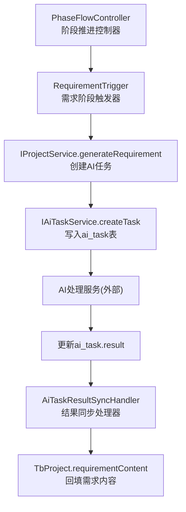
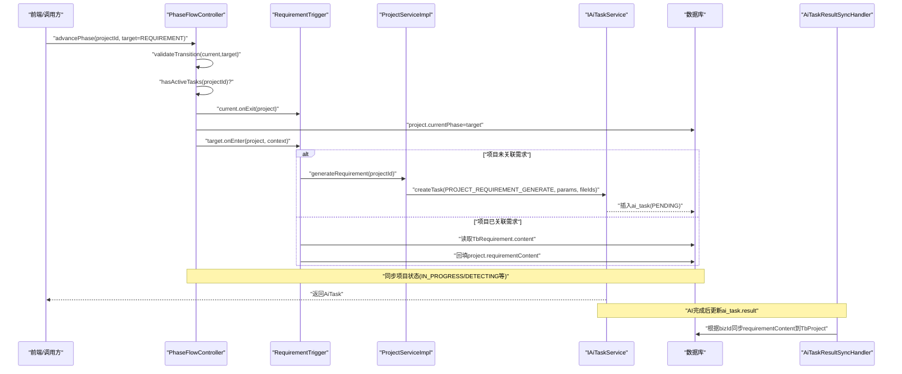
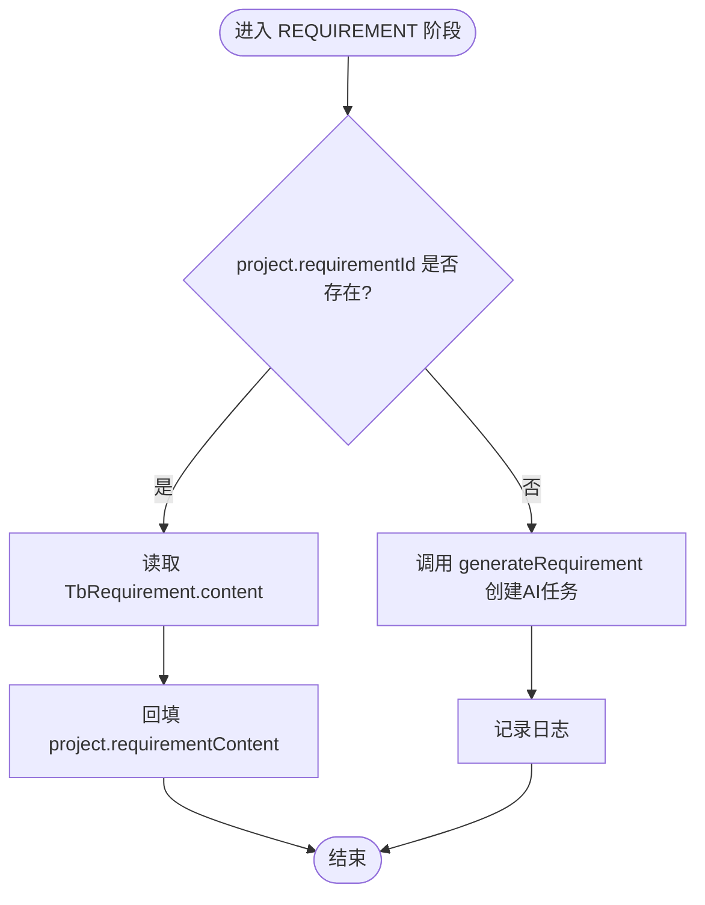
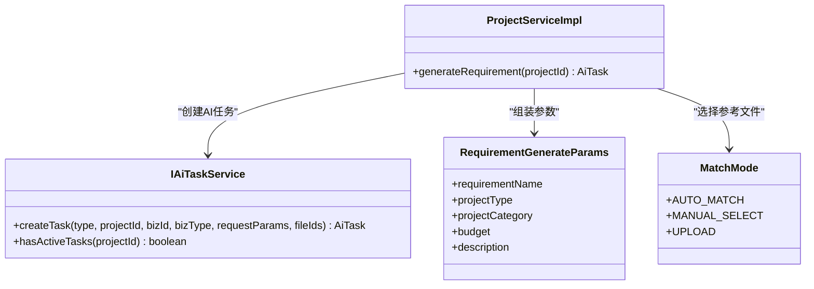
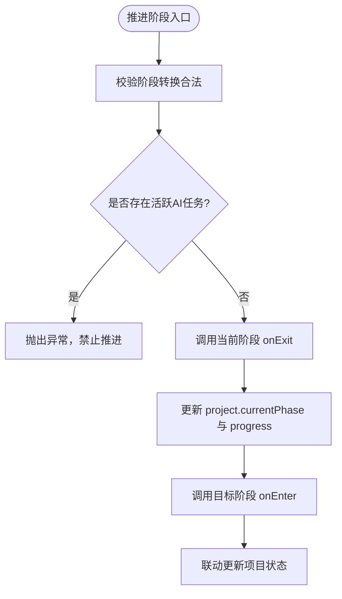
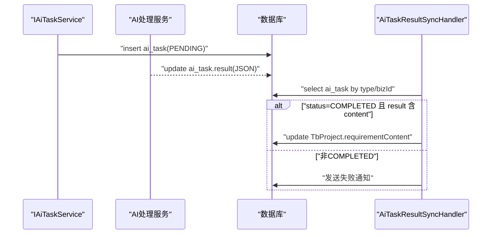
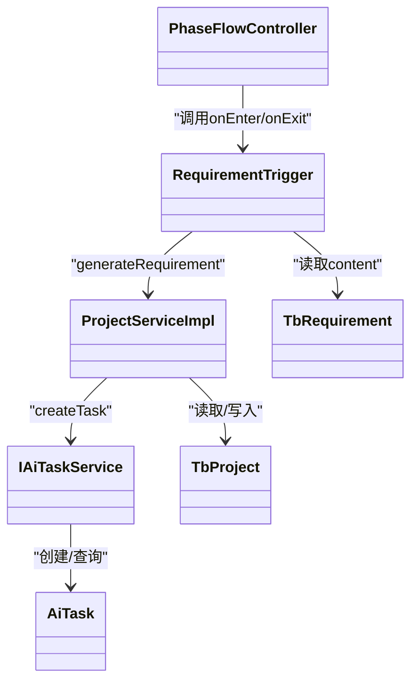

# 需求分析阶段触发器

<cite>
**本文引用的文件**   
- [RequirementTrigger.java](file://ele-ai-tender-system/ele-ai-tender-core/src/main/java/com/jy/eleaitender/core/statemachine/trigger/RequirementTrigger.java)
- [PhaseTrigger.java](file://ele-ai-tender-system/ele-ai-tender-core/src/main/java/com/jy/eleaitender/core/statemachine/PhaseTrigger.java)
- [PhaseFlowController.java](file://ele-ai-tender-system/ele-ai-tender-core/src/main/java/com/jy/eleaitender/core/statemachine/PhaseFlowController.java)
- [ProjectServiceImpl.java](file://ele-ai-tender-system/ele-ai-tender-core/src/main/java/com/jy/eleaitender/core/service/impl/ProjectServiceImpl.java)
- [IProjectService.java](file://ele-ai-tender-system/ele-ai-tender-core/src/main/java/com/jy/eleaitender/core/service/IProjectService.java)
- [AiTaskResultSyncHandler.java](file://ele-ai-tender-system/ele-ai-tender-core/src/main/java/com/jy/eleaitender/core/scheduler/AiTaskResultSyncHandler.java)
- [TbProject.java](file://ele-ai-tender-system/ele-ai-tender-common/src/main/java/com/jy/eleaitender/common/entity/core/TbProject.java)
- [TbRequirement.java](file://ele-ai-tender-system/ele-ai-tender-common/src/main/java/com/jy/eleaitender/common/entity/core/TbRequirement.java)
- [AiTask.java](file://ele-ai-tender-system/ele-ai-tender-common/src/main/java/com/jy/eleaitender/common/entity/ai/AiTask.java)
- [RequirementGenerateParams.java](file://ele-ai-tender-system/ele-ai-tender-common/src/main/java/com/jy/eleaitender/common/dto/ai/RequirementGenerateParams.java)
- [MatchMode.java](file://ele-ai-tender-system/ele-ai-tender-common/src/main/java/com/jy/eleaitender/common/enums/MatchMode.java)
- [PHASE_FLOW_SPEC.md](file://docs/rules/PHASE_FLOW_SPEC.md)
</cite>

## 目录
1. [简介](#简介)
2. [项目结构](#项目结构)
3. [核心组件](#核心组件)
4. [架构总览](#架构总览)
5. [详细组件分析](#详细组件分析)
6. [依赖关系分析](#依赖关系分析)
7. [性能与并发特性](#性能与并发特性)
8. [故障排查指南](#故障排查指南)
9. [结论](#结论)
10. [附录：扩展与集成示例](#附录扩展与集成示例)

## 简介
本技术文档聚焦于“需求分析阶段触发器”的实现与运行机制，围绕 RequirementTrigger 的业务逻辑展开，包括：
- 进入阶段时自动发起需求分析相关 AI 任务的流程与参数配置
- 离开阶段时的数据持久化与前置校验（完成条件）
- 任务状态同步与错误重试机制
- 可扩展的规则与新的 AI 处理能力集成方式

## 项目结构
该功能位于核心模块的“阶段触发器”体系中，通过 PhaseFlowController 统一编排阶段推进、触发器执行与状态联动。需求阶段的触发器为 RequirementTrigger，其职责是：
- onEnter：若项目未关联需求则自动创建并触发 AI 生成任务；若已关联则回填需求内容到项目
- canComplete：校验当前阶段是否可推进（存在需求或已有需求内容）
- getIncompleteMessage：提供不可推进时的用户提示

图表来源
- [PhaseFlowController.java:57-96](file://ele-ai-tender-system/ele-ai-tender-core/src/main/java/com/jy/eleaitender/core/statemachine/PhaseFlowController.java#L57-L96)
- [RequirementTrigger.java:38-56](file://ele-ai-tender-system/ele-ai-tender-core/src/main/java/com/jy/eleaitender/core/statemachine/trigger/RequirementTrigger.java#L38-L56)
- [ProjectServiceImpl.java:242-269](file://ele-ai-tender-system/ele-ai-tender-core/src/main/java/com/jy/eleaitender/core/service/impl/ProjectServiceImpl.java#L242-L269)
- [AiTaskResultSyncHandler.java:134-157](file://ele-ai-tender-system/ele-ai-tender-core/src/main/java/com/jy/eleaitender/core/scheduler/AiTaskResultSyncHandler.java#L134-L157)

章节来源
- [PHASE_FLOW_SPEC.md:72-106](file://docs/rules/PHASE_FLOW_SPEC.md#L72-L106)

## 核心组件
- RequirementTrigger：实现 PhaseTrigger 接口，负责需求阶段的进入/完成校验逻辑
- PhaseFlowController：管理阶段转换、触发器注册、onExit/onEnter 调用顺序与状态联动
- ProjectServiceImpl：封装 generateRequirement 方法，组装任务参数并创建 AI 任务
- AiTaskResultSyncHandler：按任务类型将 ai_task.result 同步回业务实体（如 TbProject.requirementContent）

章节来源
- [RequirementTrigger.java:25-69](file://ele-ai-tender-system/ele-ai-tender-core/src/main/java/com/jy/eleaitender/core/statemachine/trigger/RequirementTrigger.java#L25-L69)
- [PhaseTrigger.java:11-39](file://ele-ai-tender-system/ele-ai-tender-core/src/main/java/com/jy/eleaitender/core/statemachine/PhaseTrigger.java#L11-L39)
- [PhaseFlowController.java:22-96](file://ele-ai-tender-system/ele-ai-tender-core/src/main/java/com/jy/eleaitender/core/statemachine/PhaseFlowController.java#L22-L96)
- [ProjectServiceImpl.java:242-269](file://ele-ai-tender-system/ele-ai-tender-core/src/main/java/com/jy/eleaitender/core/service/impl/ProjectServiceImpl.java#L242-L269)
- [AiTaskResultSyncHandler.java:134-157](file://ele-ai-tender-system/ele-ai-tender-core/src/main/java/com/jy/eleaitender/core/scheduler/AiTaskResultSyncHandler.java#L134-L157)

## 架构总览
下图展示了从“推进阶段”到“AI任务创建与结果同步”的完整链路。

图表来源
- [PhaseFlowController.java:57-96](file://ele-ai-tender-system/ele-ai-tender-core/src/main/java/com/jy/eleaitender/core/statemachine/PhaseFlowController.java#L57-L96)
- [RequirementTrigger.java:38-56](file://ele-ai-tender-system/ele-ai-tender-core/src/main/java/com/jy/eleaitender/core/statemachine/trigger/RequirementTrigger.java#L38-L56)
- [ProjectServiceImpl.java:242-269](file://ele-ai-tender-system/ele-ai-tender-core/src/main/java/com/jy/eleaitender/core/service/impl/ProjectServiceImpl.java#L242-L269)
- [AiTaskResultSyncHandler.java:134-157](file://ele-ai-tender-system/ele-ai-tender-core/src/main/java/com/jy/eleaitender/core/scheduler/AiTaskResultSyncHandler.java#L134-L157)

## 详细组件分析

### RequirementTrigger 业务逻辑
- onEnter
  - 若项目已关联需求（requirementId 非空），则读取 TbRequirement.content 并回填至 TbProject.requirementContent，随后直接返回
  - 若未关联需求，则调用 IProjectService.generateRequirement 创建 PROJECT_REQUIREMENT_GENERATE 类型的 AI 任务
- canComplete
  - 满足以下任一条件即认为可推进：
    - project.requirementId 非空
    - project.requirementContent 非空且非空白
- getIncompleteMessage
  - 返回面向用户的提示信息，引导先完成需求生成或手动填写

图表来源
- [RequirementTrigger.java:38-56](file://ele-ai-tender-system/ele-ai-tender-core/src/main/java/com/jy/eleaitender/core/statemachine/trigger/RequirementTrigger.java#L38-L56)

章节来源
- [RequirementTrigger.java:38-67](file://ele-ai-tender-system/ele-ai-tender-core/src/main/java/com/jy/eleaitender/core/statemachine/trigger/RequirementTrigger.java#L38-L67)

### onEnter 中的自动任务发起与参数装配
- 触发时机：当目标阶段为 REQUIREMENT 时，由 PhaseFlowController 在更新阶段后调用 targetTrigger.onEnter
- 参数装配（ProjectServiceImpl.generateRequirement）
  - 基础信息：项目名称、项目类型、项目类别、预算、描述
  - 参考文档：依据 MatchMode 选择 matchedFileId 或 uploadedFileId，拼接为逗号分隔的文件ID列表
  - 任务类型：PROJECT_REQUIREMENT_GENERATE
  - bizType：REQUIREMENT；bizId：projectId
- 防重提交：IAiTaskService.createTask 会检查同一业务同一类型是否存在活跃任务，避免重复创建

图表来源
- [ProjectServiceImpl.java:242-269](file://ele-ai-tender-system/ele-ai-tender-core/src/main/java/com/jy/eleaitender/core/service/impl/ProjectServiceImpl.java#L242-L269)
- [RequirementGenerateParams.java:8-21](file://ele-ai-tender-system/ele-ai-tender-common/src/main/java/com/jy/eleaitender/common/dto/ai/RequirementGenerateParams.java#L8-L21)
- [MatchMode.java:9-28](file://ele-ai-tender-system/ele-ai-tender-common/src/main/java/com/jy/eleaitender/common/enums/MatchMode.java#L9-L28)
- [IProjectService.java:60-63](file://ele-ai-tender-system/ele-ai-tender-core/src/main/java/com/jy/eleaitender/core/service/IProjectService.java#L60-L63)

章节来源
- [ProjectServiceImpl.java:242-269](file://ele-ai-tender-system/ele-ai-tender-core/src/main/java/com/jy/eleaitender/core/service/impl/ProjectServiceImpl.java#L242-L269)
- [IProjectService.java:60-63](file://ele-ai-tender-system/ele-ai-tender-core/src/main/java/com/jy/eleaitender/core/service/IProjectService.java#L60-L63)

### onExit 与完成条件判断
- 当前阶段完成条件：canComplete 要求存在需求或已有需求内容
- 离开阶段前：PhaseFlowController 会先调用 currentTrigger.canComplete，不满足则抛出异常并阻止推进
- 注意：RequirementTrigger 未实现 onExit 自定义逻辑，默认空实现；如需在离开阶段进行额外持久化（例如快照、审计），可在该处扩展

图表来源
- [PhaseFlowController.java:57-96](file://ele-ai-tender-system/ele-ai-tender-core/src/main/java/com/jy/eleaitender/core/statemachine/PhaseFlowController.java#L57-L96)
- [RequirementTrigger.java:58-67](file://ele-ai-tender-system/ele-ai-tender-core/src/main/java/com/jy/eleaitender/core/statemachine/trigger/RequirementTrigger.java#L58-L67)

章节来源
- [PhaseFlowController.java:57-96](file://ele-ai-tender-system/ele-ai-tender-core/src/main/java/com/jy/eleaitender/core/statemachine/PhaseFlowController.java#L57-L96)
- [RequirementTrigger.java:58-67](file://ele-ai-tender-system/ele-ai-tender-core/src/main/java/com/jy/eleaitender/core/statemachine/trigger/RequirementTrigger.java#L58-L67)

### 任务状态同步与错误处理
- 同步入口：AiTaskResultSyncHandler.sync 根据任务类型分发到对应同步方法
- 项目级需求同步：syncProjectRequirement
  - 仅当任务状态为 COMPLETED 且 result 包含 content 字段时，才将内容回填至 TbProject.requirementContent
  - 非成功状态会触发失败通知
- 错误重试机制
  - 任务创建时设置 maxRetry 与 timeoutMinutes
  - 定时任务可将超时任务标记为 AI_UNAVAILABLE，从而允许后续重试或降级处理
- 幂等与防护
  - createTask 对同一业务同一类型存在活跃任务时拒绝重复创建
  - 同步逻辑对缺失实体或空结果进行保护性跳过

图表来源
- [AiTaskResultSyncHandler.java:134-157](file://ele-ai-tender-system/ele-ai-tender-core/src/main/java/com/jy/eleaitender/core/scheduler/AiTaskResultSyncHandler.java#L134-L157)
- [AiTask.java:42-67](file://ele-ai-tender-system/ele-ai-tender-common/src/main/java/com/jy/eleaitender/common/entity/ai/AiTask.java#L42-L67)

章节来源
- [AiTaskResultSyncHandler.java:134-157](file://ele-ai-tender-system/ele-ai-tender-core/src/main/java/com/jy/eleaitender/core/scheduler/AiTaskResultSyncHandler.java#L134-L157)
- [AiTask.java:42-67](file://ele-ai-tender-system/ele-ai-tender-common/src/main/java/com/jy/eleaitender/common/entity/ai/AiTask.java#L42-L67)

## 依赖关系分析
- RequirementTrigger 依赖：
  - TbRequirementMapper / TbProjectMapper：读写需求与项目实体
  - IProjectService：触发 AI 任务生成
- PhaseFlowController 依赖：
  - IAiTaskService：检查活跃任务，防止阶段推进冲突
  - 各阶段触发器：动态注册与调用
- ProjectServiceImpl 依赖：
  - IAiTaskService：创建 AI 任务
  - MatchMode：决定参考文件来源
- 数据模型：
  - TbProject：存储 requirementId、requirementContent、matchMode、matchedFileId、uploadedFileId 等
  - TbRequirement：存储需求内容与进度
  - AiTask：存储任务类型、状态、结果、重试次数、超时时间等

图表来源
- [PhaseFlowController.java:22-96](file://ele-ai-tender-system/ele-ai-tender-core/src/main/java/com/jy/eleaitender/core/statemachine/PhaseFlowController.java#L22-L96)
- [RequirementTrigger.java:25-69](file://ele-ai-tender-system/ele-ai-tender-core/src/main/java/com/jy/eleaitender/core/statemachine/trigger/RequirementTrigger.java#L25-L69)
- [ProjectServiceImpl.java:242-269](file://ele-ai-tender-system/ele-ai-tender-core/src/main/java/com/jy/eleaitender/core/service/impl/ProjectServiceImpl.java#L242-L269)
- [TbProject.java:76-99](file://ele-ai-tender-system/ele-ai-tender-common/src/main/java/com/jy/eleaitender/common/entity/core/TbProject.java#L76-L99)
- [TbRequirement.java:52-66](file://ele-ai-tender-system/ele-ai-tender-common/src/main/java/com/jy/eleaitender/common/entity/core/TbRequirement.java#L52-L66)
- [AiTask.java:18-76](file://ele-ai-tender-system/ele-ai-tender-common/src/main/java/com/jy/eleaitender/common/entity/ai/AiTask.java#L18-L76)

章节来源
- [PhaseFlowController.java:22-96](file://ele-ai-tender-system/ele-ai-tender-core/src/main/java/com/jy/eleaitender/core/statemachine/PhaseFlowController.java#L22-L96)
- [RequirementTrigger.java:25-69](file://ele-ai-tender-system/ele-ai-tender-core/src/main/java/com/jy/eleaitender/core/statemachine/trigger/RequirementTrigger.java#L25-L69)
- [ProjectServiceImpl.java:242-269](file://ele-ai-tender-system/ele-ai-tender-core/src/main/java/com/jy/eleaitender/core/service/impl/ProjectServiceImpl.java#L242-L269)
- [TbProject.java:76-99](file://ele-ai-tender-system/ele-ai-tender-common/src/main/java/com/jy/eleaitender/common/entity/core/TbProject.java#L76-L99)
- [TbRequirement.java:52-66](file://ele-ai-tender-system/ele-ai-tender-common/src/main/java/com/jy/eleaitender/common/entity/core/TbRequirement.java#L52-L66)
- [AiTask.java:18-76](file://ele-ai-tender-system/ele-ai-tender-common/src/main/java/com/jy/eleaitender/common/entity/ai/AiTask.java#L18-L76)

## 性能与并发特性
- 防重复提交：同一业务同一类型不允许同时存在活跃任务，避免并发重复创建
- 阶段推进互斥：推进前检查项目下是否存在活跃任务，确保一致性
- 异步处理：AI 任务以 PENDING 入队，实际处理由 AI 服务异步执行，核心流程不阻塞
- 超时与重试：任务具备超时时间与最大重试次数，支持将超时任务标记为不可用以便重试或降级

[本节为通用指导，无需具体文件引用]

## 故障排查指南
- 无法推进到下一阶段
  - 检查 canComplete 条件：是否存在需求或需求内容
  - 检查是否有活跃任务阻止推进
- 自动触发失败
  - 查看日志中“自动触发项目需求生成失败”的警告信息，可能因已有活跃任务导致
- 结果未回填
  - 确认 ai_task.status 是否为 COMPLETED
  - 确认 result JSON 是否包含 content 字段
- 重试与恢复
  - 检查任务是否被标记为 AI_UNAVAILABLE
  - 评估是否需要人工干预或重新触发

章节来源
- [RequirementTrigger.java:52-55](file://ele-ai-tender-system/ele-ai-tender-core/src/main/java/com/jy/eleaitender/core/statemachine/trigger/RequirementTrigger.java#L52-L55)
- [PhaseFlowController.java:66-78](file://ele-ai-tender-system/ele-ai-tender-core/src/main/java/com/jy/eleaitender/core/statemachine/PhaseFlowController.java#L66-L78)
- [AiTaskResultSyncHandler.java:134-157](file://ele-ai-tender-system/ele-ai-tender-core/src/main/java/com/jy/eleaitender/core/scheduler/AiTaskResultSyncHandler.java#L134-L157)

## 结论
RequirementTrigger 通过简洁的条件判断与最小化的副作用，实现了需求阶段的自动化与可控推进。结合 PhaseFlowController 的阶段编排与 AiTaskResultSyncHandler 的结果同步，形成了“进入阶段→自动触发→异步处理→结果回填”的闭环。通过 canComplete 与活跃任务检查，保证了流程的一致性与健壮性。

[本节为总结性内容，无需具体文件引用]

## 附录：扩展与集成示例
- 扩展需求分析规则
  - 在 RequirementTrigger.canComplete 中增加更多完整性校验（例如：必须存在匹配文件、预算大于阈值等）
  - 在 RequirementTrigger.onExit 中增加离开阶段的数据持久化（如需求快照、审计日志）
- 集成新的 AI 处理能力
  - 在 ProjectServiceImpl.generateRequirement 中扩展参数装配逻辑，支持新的参考文件或上下文
  - 新增任务类型并在 AiTaskResultSyncHandler 中增加对应的同步分支，将 AI 输出落库到相应业务实体
- 任务状态同步与错误重试
  - 利用 AiTask.maxRetry 与 timeoutMinutes 控制重试策略
  - 使用定时任务将超时任务标记为 AI_UNAVAILABLE，配合前端或后台操作进行重试或降级

章节来源
- [RequirementTrigger.java:58-67](file://ele-ai-tender-system/ele-ai-tender-core/src/main/java/com/jy/eleaitender/core/statemachine/trigger/RequirementTrigger.java#L58-L67)
- [ProjectServiceImpl.java:242-269](file://ele-ai-tender-system/ele-ai-tender-core/src/main/java/com/jy/eleaitender/core/service/impl/ProjectServiceImpl.java#L242-L269)
- [AiTaskResultSyncHandler.java:134-157](file://ele-ai-tender-system/ele-ai-tender-core/src/main/java/com/jy/eleaitender/core/scheduler/AiTaskResultSyncHandler.java#L134-L157)
- [AiTask.java:51-67](file://ele-ai-tender-system/ele-ai-tender-common/src/main/java/com/jy/eleaitender/common/entity/ai/AiTask.java#L51-L67)