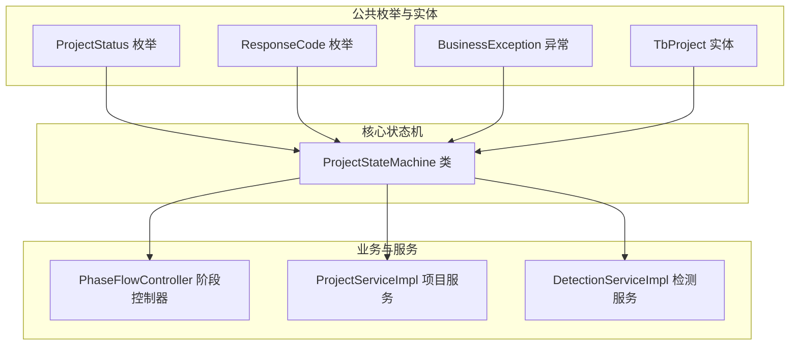
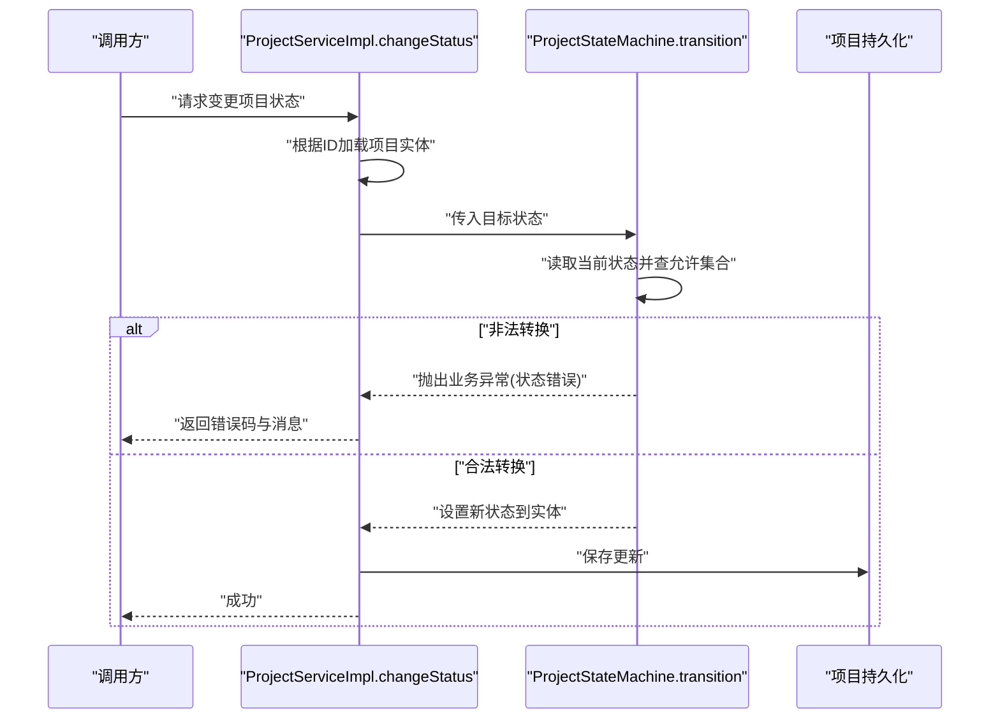
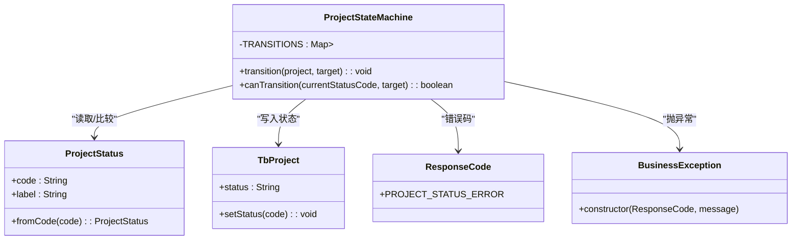
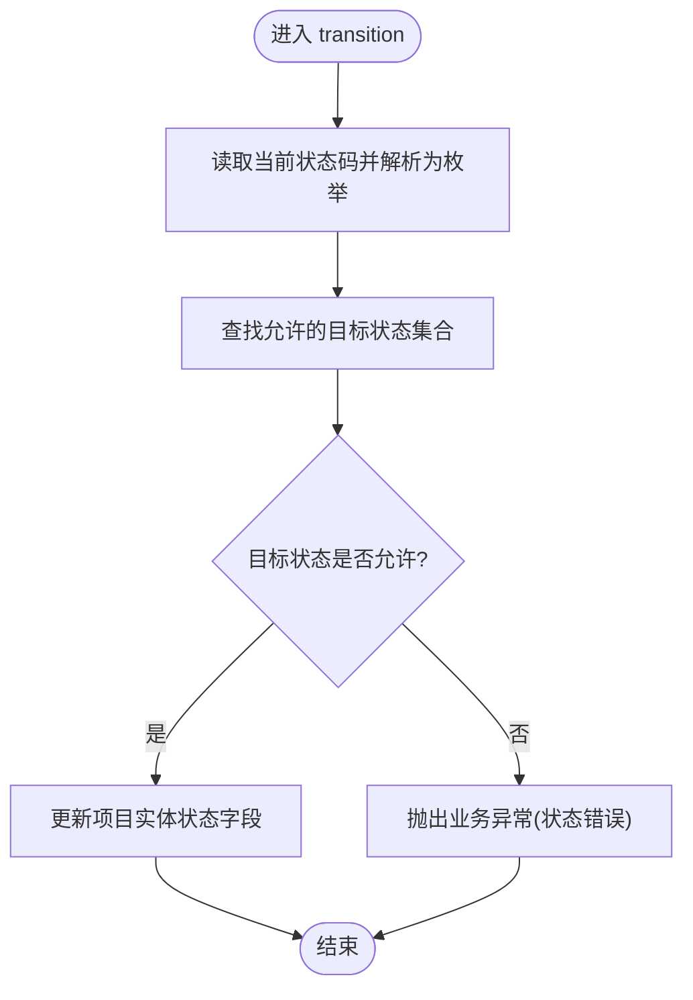
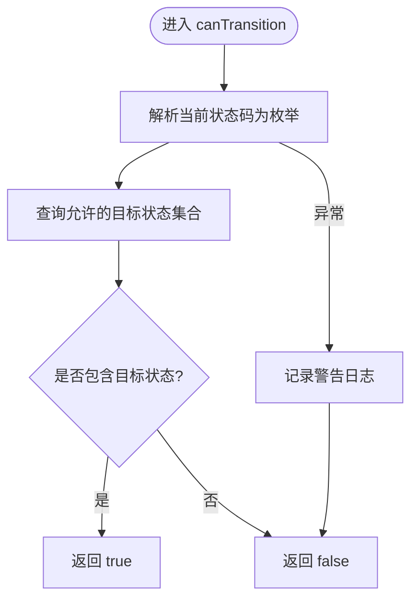
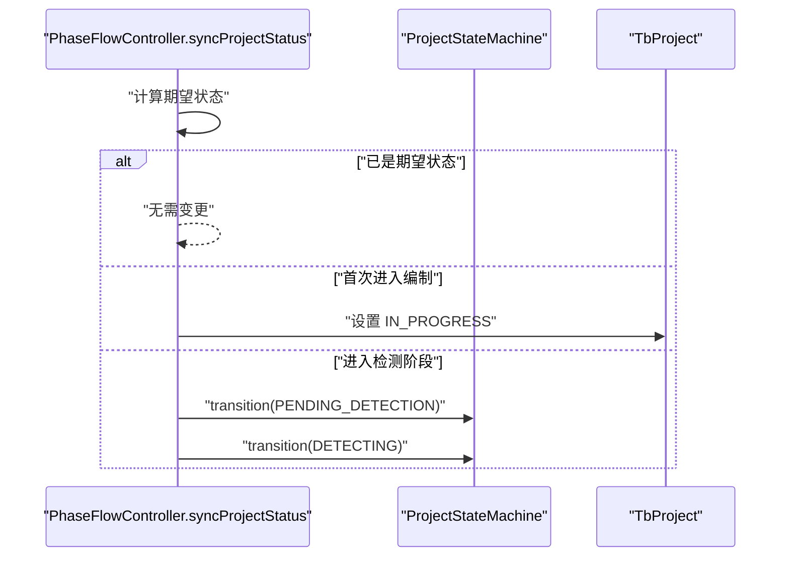
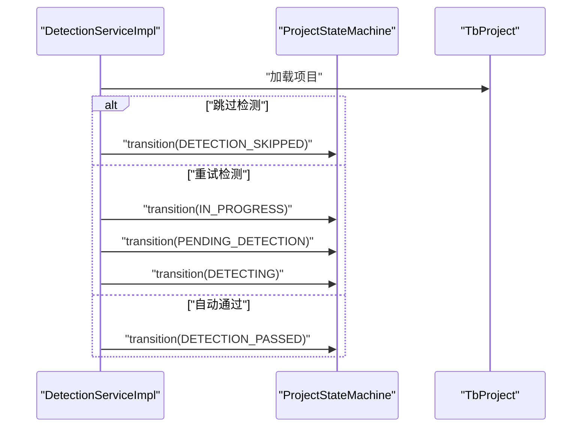
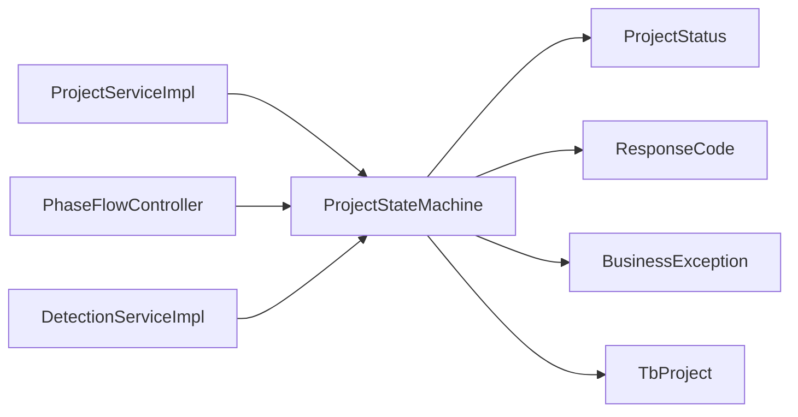

# 状态机核心

<cite>
**本文引用的文件**
- [ProjectStateMachine.java](file://ele-ai-tender-system/ele-ai-tender-core/src/main/java/com/jy/eleaitender/core/statemachine/ProjectStateMachine.java)
- [ProjectStatus.java](file://ele-ai-tender-system/ele-ai-tender-common/src/main/java/com/jy/eleaitender/common/enums/ProjectStatus.java)
- [ResponseCode.java](file://ele-ai-tender-system/ele-ai-tender-common/src/main/java/com/jy/eleaitender/common/enums/ResponseCode.java)
- [BusinessException.java](file://ele-ai-tender-system/ele-ai-tender-common/src/main/java/com/jy/eleaitender/common/exception/BusinessException.java)
- [TbProject.java](file://ele-ai-tender-system/ele-ai-tender-common/src/main/java/com/jy/eleaitender/common/entity/core/TbProject.java)
- [ProjectServiceImpl.java](file://ele-ai-tender-system/ele-ai-tender-core/src/main/java/com/jy/eleaitender/core/service/impl/ProjectServiceImpl.java)
- [PhaseFlowController.java](file://ele-ai-tender-system/ele-ai-tender-core/src/main/java/com/jy/eleaitender/core/statemachine/PhaseFlowController.java)
- [DetectionServiceImpl.java](file://ele-ai-tender-system/ele-ai-tender-core/src/main/java/com/jy/eleaitender/core/service/impl/DetectionServiceImpl.java)
</cite>

## 目录
1. [简介](#简介)
2. [项目结构](#项目结构)
3. [核心组件](#核心组件)
4. [架构总览](#架构总览)
5. [详细组件分析](#详细组件分析)
6. [依赖关系分析](#依赖关系分析)
7. [性能考量](#性能考量)
8. [故障排查指南](#故障排查指南)
9. [结论](#结论)
10. [附录](#附录)

## 简介
本文件聚焦于“项目状态机”这一核心组件，系统性阐述其设计原理与实现机制。内容覆盖：
- 状态定义与语义（如 DRAFT、IN_PROGRESS、PENDING_DETECTION、DETECTING、DETECTION_PASSED、DETECTION_FAILED、DETECTION_SKIPPED、PUBLISHED、ARCHIVED、CANCELLED）
- 转换规则配置与合法性验证
- ProjectStateMachine 类的关键方法：TRANSITIONS 映射表、transition 执行流程、canTransition 校验逻辑
- 异常处理机制与错误码定义
- 结合服务层与阶段控制器的典型使用示例路径，展示如何在项目中管理生命周期

## 项目结构
围绕状态机的相关代码主要分布在 core 模块的 statemachine 包以及 common 模块的 enums 和 entity 中，并与 service 层紧密协作。

图表来源
- [ProjectStateMachine.java:1-60](file://ele-ai-tender-system/ele-ai-tender-core/src/main/java/com/jy/eleaitender/core/statemachine/ProjectStateMachine.java#L1-L60)
- [ProjectStatus.java:1-36](file://ele-ai-tender-system/ele-ai-tender-common/src/main/java/com/jy/eleaitender/common/enums/ProjectStatus.java#L1-L36)
- [ResponseCode.java:1-168](file://ele-ai-tender-system/ele-ai-tender-common/src/main/java/com/jy/eleaitender/common/enums/ResponseCode.java#L1-L168)
- [BusinessException.java:36-49](file://ele-ai-tender-system/ele-ai-tender-common/src/main/java/com/jy/eleaitender/common/exception/BusinessException.java#L36-L49)
- [TbProject.java:16-99](file://ele-ai-tender-system/ele-ai-tender-common/src/main/java/com/jy/eleaitender/common/entity/core/TbProject.java#L16-L99)
- [PhaseFlowController.java:134-167](file://ele-ai-tender-system/ele-ai-tender-core/src/main/java/com/jy/eleaitender/core/statemachine/PhaseFlowController.java#L134-L167)
- [ProjectServiceImpl.java:271-278](file://ele-ai-tender-system/ele-ai-tender-core/src/main/java/com/jy/eleaitender/core/service/impl/ProjectServiceImpl.java#L271-L278)
- [DetectionServiceImpl.java:396-412](file://ele-ai-tender-system/ele-ai-tender-core/src/main/java/com/jy/eleaitender/core/service/impl/DetectionServiceImpl.java#L396-L412)

章节来源
- [ProjectStateMachine.java:1-60](file://ele-ai-tender-system/ele-ai-tender-core/src/main/java/com/jy/eleaitender/core/statemachine/ProjectStateMachine.java#L1-L60)
- [ProjectStatus.java:1-36](file://ele-ai-tender-system/ele-ai-tender-common/src/main/java/com/jy/eleaitender/common/enums/ProjectStatus.java#L1-L36)
- [ResponseCode.java:1-168](file://ele-ai-tender-system/ele-ai-tender-common/src/main/java/com/jy/eleaitender/common/enums/ResponseCode.java#L1-L168)
- [BusinessException.java:36-49](file://ele-ai-tender-system/ele-ai-tender-common/src/main/java/com/jy/eleaitender/common/exception/BusinessException.java#L36-L49)
- [TbProject.java:16-99](file://ele-ai-tender-system/ele-ai-tender-common/src/main/java/com/jy/eleaitender/common/entity/core/TbProject.java#L16-L99)
- [PhaseFlowController.java:134-167](file://ele-ai-tender-system/ele-ai-tender-core/src/main/java/com/jy/eleaitender/core/statemachine/PhaseFlowController.java#L134-L167)
- [ProjectServiceImpl.java:271-278](file://ele-ai-tender-system/ele-ai-tender-core/src/main/java/com/jy/eleaitender/core/service/impl/ProjectServiceImpl.java#L271-L278)
- [DetectionServiceImpl.java:396-412](file://ele-ai-tender-system/ele-ai-tender-core/src/main/java/com/jy/eleaitender/core/service/impl/DetectionServiceImpl.java#L396-L412)

## 核心组件
- 项目状态枚举 ProjectStatus：集中定义所有合法状态及其显示标签，并提供 fromCode 解析方法。
- 响应码 ResponseCode：统一错误码定义，其中包含项目状态错误码 PROJECT_STATUS_ERROR。
- 业务异常 BusinessException：封装错误码与消息，便于上层统一捕获与返回。
- 项目实体 TbProject：包含 status 字段用于持久化当前状态。
- 状态机 ProjectStateMachine：提供 TRANSITIONS 映射表、transition 转换方法与 canTransition 校验方法。

章节来源
- [ProjectStatus.java:1-36](file://ele-ai-tender-system/ele-ai-tender-common/src/main/java/com/jy/eleaitender/common/enums/ProjectStatus.java#L1-L36)
- [ResponseCode.java:75-82](file://ele-ai-tender-system/ele-ai-tender-common/src/main/java/com/jy/eleaitender/common/enums/ResponseCode.java#L75-L82)
- [BusinessException.java:36-49](file://ele-ai-tender-system/ele-ai-tender-common/src/main/java/com/jy/eleaitender/common/exception/BusinessException.java#L36-L49)
- [TbProject.java:64-66](file://ele-ai-tender-system/ele-ai-tender-common/src/main/java/com/jy/eleaitender/common/entity/core/TbProject.java#L64-L66)
- [ProjectStateMachine.java:19-58](file://ele-ai-tender-system/ele-ai-tender-core/src/main/java/com/jy/eleaitender/core/statemachine/ProjectStateMachine.java#L19-L58)

## 架构总览
状态机作为“规则中心”，被多个业务场景调用：
- 项目服务在变更状态时通过状态机进行合法性校验并更新实体。
- 阶段控制器在进入特定阶段时，按策略驱动状态机完成多步转换。
- 检测服务在跳过检测、重试检测、自动通过等场景中，借助状态机推进项目状态。

图表来源
- [ProjectServiceImpl.java:271-278](file://ele-ai-tender-system/ele-ai-tender-core/src/main/java/com/jy/eleaitender/core/service/impl/ProjectServiceImpl.java#L271-L278)
- [ProjectStateMachine.java:37-45](file://ele-ai-tender-system/ele-ai-tender-core/src/main/java/com/jy/eleaitender/core/statemachine/ProjectStateMachine.java#L37-L45)

## 详细组件分析

### ProjectStateMachine 类分析
- 职责：维护项目状态转换规则，提供转换执行与合法性检查能力。
- 数据结构：
  - TRANSITIONS：以当前状态为键、允许的目标状态集合为值的映射表，集中声明所有合法转换。
- 关键方法：
  - transition(project, target)：校验当前状态到目标状态的合法性；若非法则抛出业务异常；合法则更新项目实体的状态字段。
  - canTransition(currentStatusCode, target)：仅做合法性判断，不修改数据；对异常进行日志记录并返回 false。

图表来源
- [ProjectStateMachine.java:19-58](file://ele-ai-tender-system/ele-ai-tender-core/src/main/java/com/jy/eleaitender/core/statemachine/ProjectStateMachine.java#L19-L58)
- [ProjectStatus.java:11-35](file://ele-ai-tender-system/ele-ai-tender-common/src/main/java/com/jy/eleaitender/common/enums/ProjectStatus.java#L11-L35)
- [TbProject.java:64-66](file://ele-ai-tender-system/ele-ai-tender-common/src/main/java/com/jy/eleaitender/common/entity/core/TbProject.java#L64-L66)
- [ResponseCode.java:75-82](file://ele-ai-tender-system/ele-ai-tender-common/src/main/java/com/jy/eleaitender/common/enums/ResponseCode.java#L75-L82)
- [BusinessException.java:36-49](file://ele-ai-tender-system/ele-ai-tender-common/src/main/java/com/jy/eleaitender/common/exception/BusinessException.java#L36-L49)

#### transition 方法执行流程
- 从项目实体读取当前状态码，解析为枚举。
- 查询允许的目标状态集合。
- 若目标不在集合内，抛出业务异常（携带状态错误码）。
- 否则将目标状态码写回项目实体。

图表来源
- [ProjectStateMachine.java:37-45](file://ele-ai-tender-system/ele-ai-tender-core/src/main/java/com/jy/eleaitender/core/statemachine/ProjectStateMachine.java#L37-L45)

#### canTransition 方法校验逻辑
- 输入：当前状态码字符串与目标状态枚举。
- 解析当前状态码为枚举，查询允许集合并判断是否包含目标。
- 捕获异常并记录警告日志，返回 false。

图表来源
- [ProjectStateMachine.java:50-58](file://ele-ai-tender-system/ele-ai-tender-core/src/main/java/com/jy/eleaitender/core/statemachine/ProjectStateMachine.java#L50-L58)

### 状态定义与语义
- DRAFT（草稿）：项目初始态，可进入编制或取消。
- IN_PROGRESS（编制中）：正在编辑或准备进入检测。
- PENDING_DETECTION（待检测）：已提交检测任务，等待调度。
- DETECTING（检测中）：检测任务执行中。
- DETECTION_PASSED（检测通过）：检测无未解决问题，可发布或回到编制。
- DETECTION_FAILED（检测未通过）：存在未解决问题，可回到编制或转为通过。
- DETECTION_SKIPPED（已跳过检测）：用户选择跳过检测，可直接发布。
- PUBLISHED（已发布）：文档已发布，可归档。
- ARCHIVED（已归档）：终态，不可再流转。
- CANCELLED（已取消）：终态，不可再流转。

章节来源
- [ProjectStatus.java:11-22](file://ele-ai-tender-system/ele-ai-tender-common/src/main/java/com/jy/eleaitender/common/enums/ProjectStatus.java#L11-L22)

### 转换规则配置（TRANSITIONS 映射表）
- 映射表以当前状态为键，值为允许的目标状态集合。
- 典型规则举例：
  - DRAFT → IN_PROGRESS / CANCELLED
  - IN_PROGRESS → PENDING_DETECTION / CANCELLED
  - PENDING_DETECTION → DETECTING / IN_PROGRESS / CANCELLED
  - DETECTING → DETECTION_PASSED / DETECTION_FAILED / DETECTION_SKIPPED
  - DETECTION_PASSED → PUBLISHED / IN_PROGRESS
  - DETECTION_FAILED → IN_PROGRESS / DETECTION_PASSED
  - DETECTION_SKIPPED → PUBLISHED / IN_PROGRESS
  - PUBLISHED → ARCHIVED
  - ARCHIVED / CANCELLED → 无后续状态（终态）

章节来源
- [ProjectStateMachine.java:19-30](file://ele-ai-tender-system/ele-ai-tender-core/src/main/java/com/jy/eleaitender/core/statemachine/ProjectStateMachine.java#L19-L30)

### 与阶段控制器的协同
- PhaseFlowController 在进入检测阶段时，会根据当前状态决定是否需要先转入 PENDING_DETECTION 再进入 DETECTING。
- 当处于 DETECTING 且目标阶段仍为检测时，直接复用已有状态，避免重复转换。

图表来源
- [PhaseFlowController.java:134-167](file://ele-ai-tender-system/ele-ai-tender-core/src/main/java/com/jy/eleaitender/core/statemachine/PhaseFlowController.java#L134-L167)
- [ProjectStateMachine.java:37-45](file://ele-ai-tender-system/ele-ai-tender-core/src/main/java/com/jy/eleaitender/core/statemachine/ProjectStateMachine.java#L37-L45)

### 与检测服务的协同
- 跳过检测：直接调用状态机转换为 DETECTION_SKIPPED。
- 重试检测：先将状态转回 IN_PROGRESS，再依次转入 PENDING_DETECTION 与 DETECTING。
- 自动通过：当所有问题已处理时，可将 DETECTION_FAILED 转为 DETECTION_PASSED。

图表来源
- [DetectionServiceImpl.java:396-412](file://ele-ai-tender-system/ele-ai-tender-core/src/main/java/com/jy/eleaitender/core/service/impl/DetectionServiceImpl.java#L396-L412)
- [DetectionServiceImpl.java:414-468](file://ele-ai-tender-system/ele-ai-tender-core/src/main/java/com/jy/eleaitender/core/service/impl/DetectionServiceImpl.java#L414-L468)
- [DetectionServiceImpl.java:527-552](file://ele-ai-tender-system/ele-ai-tender-core/src/main/java/com/jy/eleaitender/core/service/impl/DetectionServiceImpl.java#L527-L552)
- [ProjectStateMachine.java:37-45](file://ele-ai-tender-system/ele-ai-tender-core/src/main/java/com/jy/eleaitender/core/statemachine/ProjectStateMachine.java#L37-L45)

### 异常处理机制与错误码
- 非法转换：抛出 BusinessException，错误码为 PROJECT_STATUS_ERROR，附带可读消息（包含当前与目标状态标签）。
- 未知状态码：ProjectStatus.fromCode 会抛出参数异常，canTransition 捕获后记录警告并返回 false。
- 统一响应：上层可通过 Result.fail 等方法将错误码与消息返回给调用方。

章节来源
- [ProjectStateMachine.java:40-43](file://ele-ai-tender-system/ele-ai-tender-core/src/main/java/com/jy/eleaitender/core/statemachine/ProjectStateMachine.java#L40-L43)
- [ResponseCode.java:75-82](file://ele-ai-tender-system/ele-ai-tender-common/src/main/java/com/jy/eleaitender/common/enums/ResponseCode.java#L75-L82)
- [ProjectStatus.java:27-34](file://ele-ai-tender-system/ele-ai-tender-common/src/main/java/com/jy/eleaitender/common/enums/ProjectStatus.java#L27-L34)

### 使用示例（路径引用）
- 直接变更状态：
  - 参考路径：[ProjectServiceImpl.changeStatus:271-278](file://ele-ai-tender-system/ele-ai-tender-core/src/main/java/com/jy/eleaitender/core/service/impl/ProjectServiceImpl.java#L271-L278)
- 阶段进入时的多步转换：
  - 参考路径：[PhaseFlowController.syncProjectStatus:134-167](file://ele-ai-tender-system/ele-ai-tender-core/src/main/java/com/jy/eleaitender/core/statemachine/PhaseFlowController.java#L134-L167)
- 检测相关转换：
  - 跳过检测：[DetectionServiceImpl.skip:396-412](file://ele-ai-tender-system/ele-ai-tender-core/src/main/java/com/jy/eleaitender/core/service/impl/DetectionServiceImpl.java#L396-L412)
  - 重试检测：[DetectionServiceImpl.retry:414-468](file://ele-ai-tender-system/ele-ai-tender-core/src/main/java/com/jy/eleaitender/core/service/impl/DetectionServiceImpl.java#L414-L468)
  - 自动通过：[DetectionServiceImpl.tryTransitionToPassed:527-552](file://ele-ai-tender-system/ele-ai-tender-core/src/main/java/com/jy/eleaitender/core/service/impl/DetectionServiceImpl.java#L527-L552)

## 依赖关系分析
- 低耦合高内聚：状态机仅依赖枚举、实体与异常类型，不感知具体业务细节。
- 外部依赖点：
  - ProjectStatus：状态定义与解析。
  - ResponseCode：错误码。
  - BusinessException：异常封装。
  - TbProject：状态字段的读写。
- 调用方：
  - ProjectServiceImpl：通用状态变更入口。
  - PhaseFlowController：阶段驱动的状态同步。
  - DetectionServiceImpl：检测流程中的状态推进。

图表来源
- [ProjectStateMachine.java:1-60](file://ele-ai-tender-system/ele-ai-tender-core/src/main/java/com/jy/eleaitender/core/statemachine/ProjectStateMachine.java#L1-L60)
- [ProjectServiceImpl.java:271-278](file://ele-ai-tender-system/ele-ai-tender-core/src/main/java/com/jy/eleaitender/core/service/impl/ProjectServiceImpl.java#L271-L278)
- [PhaseFlowController.java:134-167](file://ele-ai-tender-system/ele-ai-tender-core/src/main/java/com/jy/eleaitender/core/statemachine/PhaseFlowController.java#L134-L167)
- [DetectionServiceImpl.java:396-412](file://ele-ai-tender-system/ele-ai-tender-core/src/main/java/com/jy/eleaitender/core/service/impl/DetectionServiceImpl.java#L396-L412)

## 性能考量
- 时间复杂度：
  - transition/canTransition：O(1)，基于 Map 查找与 Set 包含判断。
- 空间复杂度：
  - TRANSITIONS 为静态常量，内存占用固定。
- 并发安全：
  - 状态机本身无共享可变状态，线程安全；但实际状态落库由调用方事务保证一致性。
- 建议：
  - 批量操作时尽量合并状态转换，减少数据库往返。
  - 对高频校验可使用 canTransition 在前端或网关层提前拦截。

## 故障排查指南
- 现象：调用状态变更接口返回“项目状态错误”。
  - 可能原因：当前状态不允许转换为目标状态。
  - 排查步骤：
    - 确认当前状态码与目标状态是否在 TRANSITIONS 映射表中存在合法边。
    - 检查调用链路是否正确传递了目标状态。
    - 查看日志中是否有“检查项目状态转换失败”的警告（来自 canTransition）。
- 现象：未知状态码导致解析异常。
  - 可能原因：数据库中存储了非枚举定义的状态码。
  - 排查步骤：
    - 核对 ProjectStatus 枚举是否完整覆盖现有状态。
    - 修复脏数据或扩展枚举定义。
- 常见错误码：
  - PROJECT_STATUS_ERROR：项目状态错误（非法转换）。

章节来源
- [ProjectStateMachine.java:40-43](file://ele-ai-tender-system/ele-ai-tender-core/src/main/java/com/jy/eleaitender/core/statemachine/ProjectStateMachine.java#L40-L43)
- [ProjectStateMachine.java:54-57](file://ele-ai-tender-system/ele-ai-tender-core/src/main/java/com/jy/eleaitender/core/statemachine/ProjectStateMachine.java#L54-L57)
- [ResponseCode.java:75-82](file://ele-ai-tender-system/ele-ai-tender-common/src/main/java/com/jy/eleaitender/common/enums/ResponseCode.java#L75-L82)

## 结论
本项目状态机采用“枚举+映射表”的简洁模式，清晰表达项目生命周期与转换约束。通过统一的异常与错误码体系，确保状态流转的可控性与可观测性。配合阶段控制器与检测服务，形成稳定的端到端流程闭环。建议在新增状态或转换时，优先更新 TRANSITIONS 映射表，并在服务层补充相应用例与测试，以保证系统演进的安全性与一致性。

## 附录
- 术语说明：
  - 状态：项目在某时刻的业务状态。
  - 转换：从当前状态到目标状态的有向边。
  - 终态：不可继续流转的状态（如 ARCHIVED、CANCELLED）。
- 最佳实践：
  - 所有状态变更必须经过状态机校验。
  - 前端按钮与后端校验保持一致，避免无效请求。
  - 对关键转换增加审计日志与版本快照。