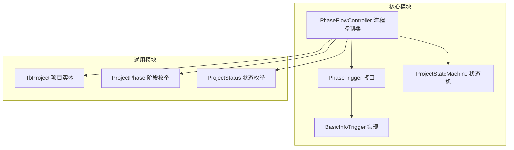
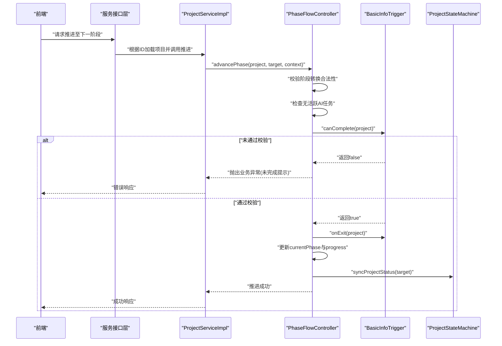
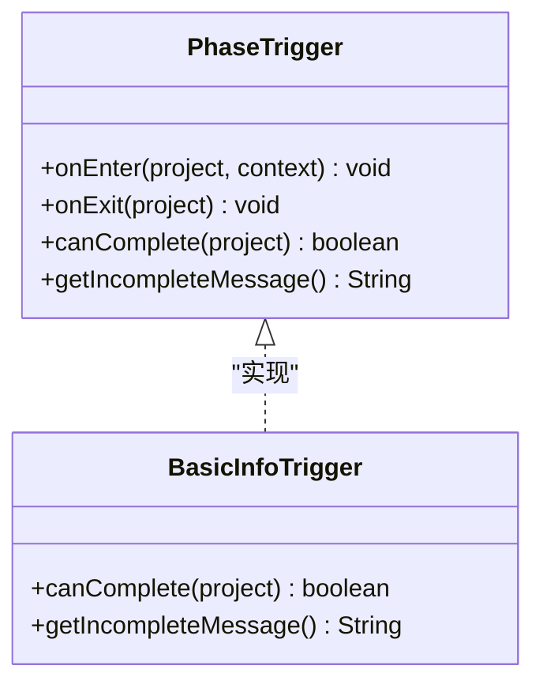
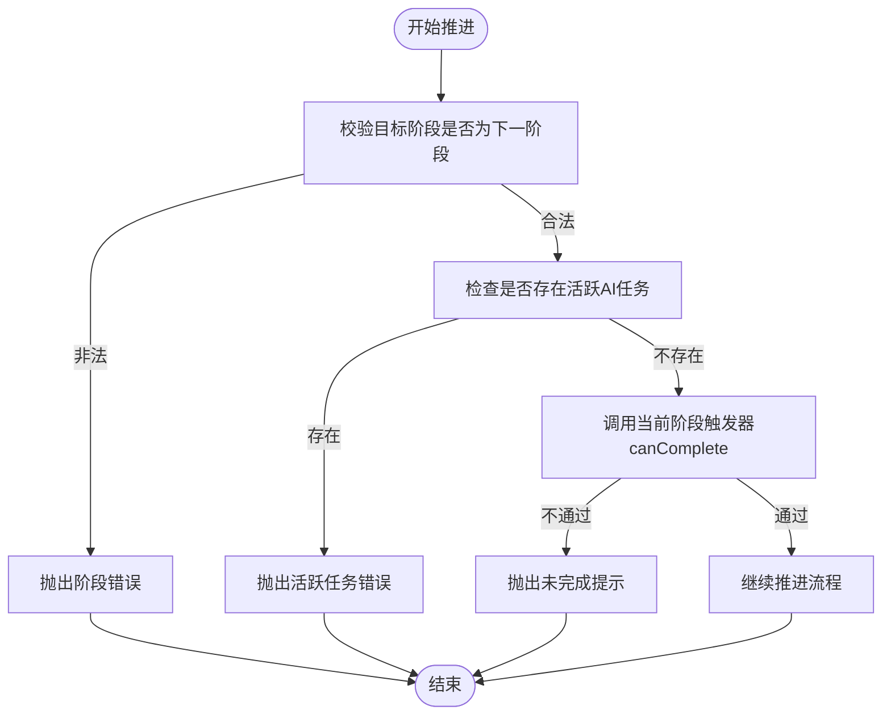
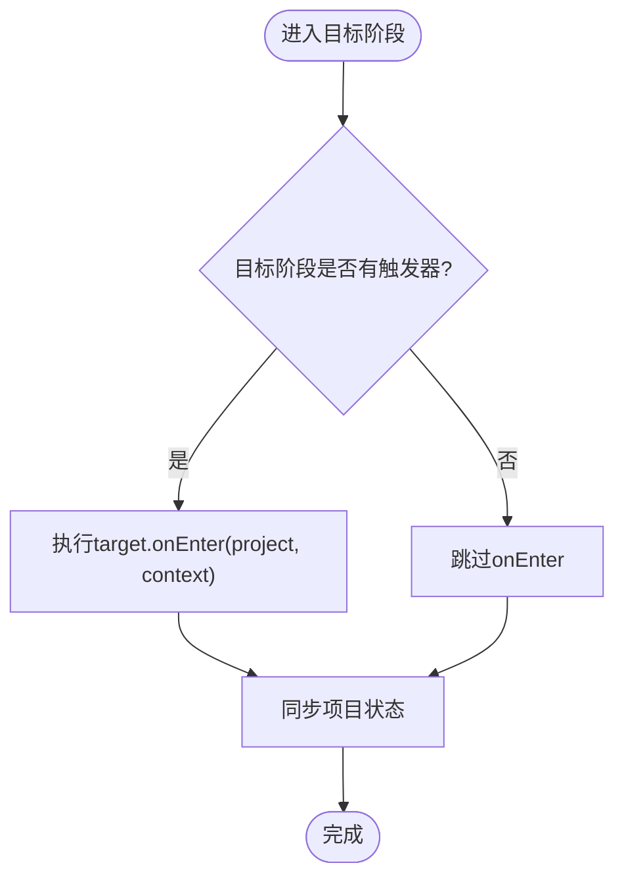
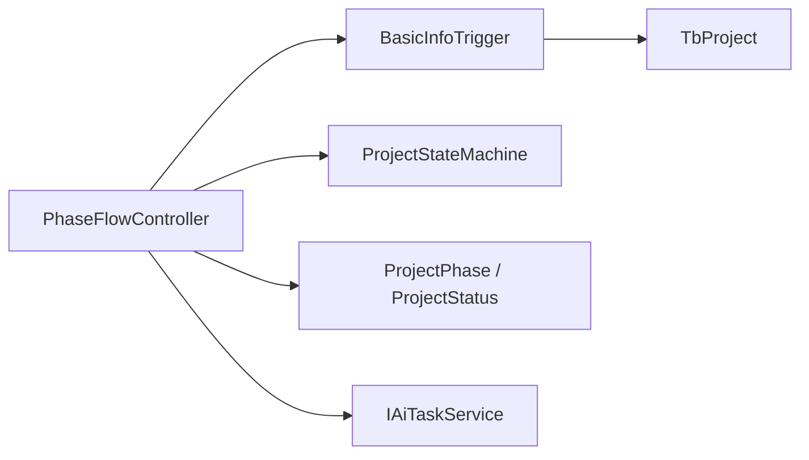

# 基础信息阶段触发器

<cite>
**本文引用的文件**
- [BasicInfoTrigger.java](file://ele-ai-tender-system/ele-ai-tender-core/src/main/java/com/jy/eleaitender/core/statemachine/trigger/BasicInfoTrigger.java)
- [PhaseTrigger.java](file://ele-ai-tender-system/ele-ai-tender-core/src/main/java/com/jy/eleaitender/core/statemachine/PhaseTrigger.java)
- [PhaseFlowController.java](file://ele-ai-tender-system/ele-ai-tender-core/src/main/java/com/jy/eleaitender/core/statemachine/PhaseFlowController.java)
- [ProjectStateMachine.java](file://ele-ai-tender-system/ele-ai-tender-core/src/main/java/com/jy/eleaitender/core/statemachine/ProjectStateMachine.java)
- [TbProject.java](file://ele-ai-tender-system/ele-ai-tender-common/src/main/java/com/jy/eleaitender/common/entity/core/TbProject.java)
- [ProjectPhase.java](file://ele-ai-tender-system/ele-ai-tender-common/src/main/java/com/jy/eleaitender/common/enums/ProjectPhase.java)
- [ProjectStatus.java](file://ele-ai-tender-system/ele-ai-tender-common/src/main/java/com/jy/eleaitender/common/enums/ProjectStatus.java)
- [PHASE_FLOW_SPEC.md](file://docs/rules/PHASE_FLOW_SPEC.md)
</cite>

## 目录
1. [简介](#简介)
2. [项目结构](#项目结构)
3. [核心组件](#核心组件)
4. [架构总览](#架构总览)
5. [详细组件分析](#详细组件分析)
6. [依赖关系分析](#依赖关系分析)
7. [性能与扩展性考虑](#性能与扩展性考虑)
8. [故障排查指南](#故障排查指南)
9. [结论](#结论)
10. [附录](#附录)

## 简介
本技术文档聚焦“基础信息阶段触发器”的实现与使用，围绕 BasicInfoTrigger 的业务规则、前置条件检查机制、后置处理逻辑、配置与扩展点展开。该触发器用于确保项目在离开“基础信息录入”阶段前，满足关键必填字段要求；同时结合阶段流程控制器与状态机，保障阶段推进的有序性与一致性。

## 项目结构
与基础信息阶段触发器相关的代码主要位于 core 模块的状态机与触发器包中，配合 common 模块中的实体与枚举定义，形成清晰的职责分层：
- 触发器实现：BasicInfoTrigger
- 触发器接口：PhaseTrigger
- 流程控制：PhaseFlowController（注册触发器、校验转换、执行 onEnter/onExit、联动状态）
- 状态机：ProjectStateMachine（定义合法状态转换）
- 数据模型：TbProject（项目实体）
- 阶段与状态枚举：ProjectPhase、ProjectStatus
- 规范说明：PHASE_FLOW_SPEC.md（阶段推进流程与关键类职责）

图表来源
- [PhaseTrigger.java:1-40](file://ele-ai-tender-system/ele-ai-tender-core/src/main/java/com/jy/eleaitender/core/statemachine/PhaseTrigger.java#L1-L40)
- [BasicInfoTrigger.java:1-28](file://ele-ai-tender-system/ele-ai-tender-core/src/main/java/com/jy/eleaitender/core/statemachine/trigger/BasicInfoTrigger.java#L1-L28)
- [PhaseFlowController.java:1-176](file://ele-ai-tender-system/ele-ai-tender-core/src/main/java/com/jy/eleaitender/core/statemachine/PhaseFlowController.java#L1-L176)
- [ProjectStateMachine.java:1-60](file://ele-ai-tender-system/ele-ai-tender-core/src/main/java/com/jy/eleaitender/core/statemachine/ProjectStateMachine.java#L1-L60)
- [TbProject.java:1-100](file://ele-ai-tender-system/ele-ai-tender-common/src/main/java/com/jy/eleaitender/common/entity/core/TbProject.java#L1-L100)
- [ProjectPhase.java:1-41](file://ele-ai-tender-system/ele-ai-tender-common/src/main/java/com/jy/eleaitender/common/enums/ProjectPhase.java#L1-L41)
- [ProjectStatus.java:1-36](file://ele-ai-tender-system/ele-ai-tender-common/src/main/java/com/jy/eleaitender/common/enums/ProjectStatus.java#L1-L36)

章节来源
- [PHASE_FLOW_SPEC.md:58-106](file://docs/rules/PHASE_FLOW_SPEC.md#L58-L106)

## 核心组件
- PhaseTrigger 接口：定义阶段进入/离开钩子与完成校验能力，提供默认空实现，便于按需覆盖。
- BasicInfoTrigger：实现 canComplete 与 getIncompleteMessage，负责基础信息阶段的完成性校验。
- PhaseFlowController：集中管理阶段推进流程，包括转换合法性校验、活跃任务检查、触发器调用、阶段与进度更新、状态同步。
- ProjectStateMachine：维护项目状态转换表，保证状态流转合法。
- TbProject：承载项目基本信息与阶段、状态等元数据。
- ProjectPhase / ProjectStatus：阶段与状态的枚举定义，提供 code/label 与辅助方法。

章节来源
- [PhaseTrigger.java:1-40](file://ele-ai-tender-system/ele-ai-tender-core/src/main/java/com/jy/eleaitender/core/statemachine/PhaseTrigger.java#L1-L40)
- [BasicInfoTrigger.java:1-28](file://ele-ai-tender-system/ele-ai-tender-core/src/main/java/com/jy/eleaitender/core/statemachine/trigger/BasicInfoTrigger.java#L1-L28)
- [PhaseFlowController.java:1-176](file://ele-ai-tender-system/ele-ai-tender-core/src/main/java/com/jy/eleaitender/core/statemachine/PhaseFlowController.java#L1-L176)
- [ProjectStateMachine.java:1-60](file://ele-ai-tender-system/ele-ai-tender-core/src/main/java/com/jy/eleaitender/core/statemachine/ProjectStateMachine.java#L1-L60)
- [TbProject.java:1-100](file://ele-ai-tender-system/ele-ai-tender-common/src/main/java/com/jy/eleaitender/common/entity/core/TbProject.java#L1-L100)
- [ProjectPhase.java:1-41](file://ele-ai-tender-system/ele-ai-tender-common/src/main/java/com/jy/eleaitender/common/enums/ProjectPhase.java#L1-L41)
- [ProjectStatus.java:1-36](file://ele-ai-tender-system/ele-ai-tender-common/src/main/java/com/jy/eleaitender/common/enums/ProjectStatus.java#L1-L36)

## 架构总览
下图展示了从前端发起阶段推进到后端触发器执行的完整时序，以及 BasicInfoTrigger 在其中的作用位置。

图表来源
- [PhaseFlowController.java:57-96](file://ele-ai-tender-system/ele-ai-tender-core/src/main/java/com/jy/eleaitender/core/statemachine/PhaseFlowController.java#L57-L96)
- [BasicInfoTrigger.java:17-26](file://ele-ai-tender-system/ele-ai-tender-core/src/main/java/com/jy/eleaitender/core/statemachine/trigger/BasicInfoTrigger.java#L17-L26)
- [ProjectStateMachine.java:37-45](file://ele-ai-tender-system/ele-ai-tender-core/src/main/java/com/jy/eleaitender/core/statemachine/ProjectStateMachine.java#L37-L45)

章节来源
- [PHASE_FLOW_SPEC.md:72-85](file://docs/rules/PHASE_FLOW_SPEC.md#L72-L85)

## 详细组件分析

### BasicInfoTrigger 实现要点
- 完成性校验：仅校验项目名称、项目类别、项目类型三个关键字段非空且非空白。
- 提示信息：当校验失败时，返回明确的中文提示，便于前端展示。
- 钩子方法：未覆盖 onEnter/onExit，表示基础信息阶段无需在进入或离开时执行额外逻辑。

图表来源
- [PhaseTrigger.java:11-39](file://ele-ai-tender-system/ele-ai-tender-core/src/main/java/com/jy/eleaitender/core/statemachine/PhaseTrigger.java#L11-L39)
- [BasicInfoTrigger.java:13-27](file://ele-ai-tender-system/ele-ai-tender-core/src/main/java/com/jy/eleaitender/core/statemachine/trigger/BasicInfoTrigger.java#L13-L27)

章节来源
- [BasicInfoTrigger.java:17-26](file://ele-ai-tender-system/ele-ai-tender-core/src/main/java/com/jy/eleaitender/core/statemachine/trigger/BasicInfoTrigger.java#L17-L26)

### 前置条件检查机制
- 阶段转换合法性：只能顺序推进到下一阶段，禁止跳跃或回退。
- 活跃任务检查：若项目下存在活跃的AI任务，则禁止推进，避免并发冲突。
- 当前阶段完成性：由当前阶段触发器的 canComplete 决定是否可以离开当前阶段。

图表来源
- [PhaseFlowController.java:57-96](file://ele-ai-tender-system/ele-ai-tender-core/src/main/java/com/jy/eleaitender/core/statemachine/PhaseFlowController.java#L57-L96)
- [PhaseFlowController.java:113-126](file://ele-ai-tender-system/ele-ai-tender-core/src/main/java/com/jy/eleaitender/core/statemachine/PhaseFlowController.java#L113-L126)

章节来源
- [PhaseFlowController.java:57-96](file://ele-ai-tender-system/ele-ai-tender-core/src/main/java/com/jy/eleaitender/core/statemachine/PhaseFlowController.java#L57-L96)

### 后置处理逻辑
- 阶段与进度更新：将 currentPhase 设置为目标阶段，progress 设置为对应百分比。
- 目标阶段 onEnter：若目标阶段有触发器，则在进入时执行（例如自动发起AI任务）。
- 状态同步：根据目标阶段映射预期状态，必要时通过状态机进行合法转换。

图表来源
- [PhaseFlowController.java:85-92](file://ele-ai-tender-system/ele-ai-tender-core/src/main/java/com/jy/eleaitender/core/statemachine/PhaseFlowController.java#L85-L92)
- [PhaseFlowController.java:134-167](file://ele-ai-tender-system/ele-ai-tender-core/src/main/java/com/jy/eleaitender/core/statemachine/PhaseFlowController.java#L134-L167)
- [ProjectStateMachine.java:37-45](file://ele-ai-tender-system/ele-ai-tender-core/src/main/java/com/jy/eleaitender/core/statemachine/ProjectStateMachine.java#L37-L45)

章节来源
- [PhaseFlowController.java:85-92](file://ele-ai-tender-system/ele-ai-tender-core/src/main/java/com/jy/eleaitender/core/statemachine/PhaseFlowController.java#L85-L92)
- [PhaseFlowController.java:134-167](file://ele-ai-tender-system/ele-ai-tender-core/src/main/java/com/jy/eleaitender/core/statemachine/PhaseFlowController.java#L134-L167)

### 数据模型与校验字段
- 项目实体包含基础信息字段：项目名称、项目类别、项目类型等。
- 触发器仅对这三个字段进行非空与非空白校验，其他字段不在基础信息阶段强制约束。

章节来源
- [TbProject.java:25-32](file://ele-ai-tender-system/ele-ai-tender-common/src/main/java/com/jy/eleaitender/common/entity/core/TbProject.java#L25-L32)
- [BasicInfoTrigger.java:17-21](file://ele-ai-tender-system/ele-ai-tender-core/src/main/java/com/jy/eleaitender/core/statemachine/trigger/BasicInfoTrigger.java#L17-L21)

### 配置选项与自定义扩展点
- 触发器注册：通过 PhaseFlowController.registerTrigger 为指定阶段注册触发器。
- 扩展点：
  - 覆盖 PhaseTrigger.onEnter：在目标阶段进入时执行自动化逻辑（如创建需求、提交AI任务）。
  - 覆盖 PhaseTrigger.onExit：在离开当前阶段时执行收尾逻辑（如快照、清理临时数据）。
  - 自定义 canComplete：按业务需要增加更多校验规则（如预算范围、联系人格式等）。
  - 自定义 getIncompleteMessage：提供更友好的错误提示。
- 状态机扩展：如需新增状态或转换路径，可在状态机中维护合法转换集合。

章节来源
- [PhaseFlowController.java:44-47](file://ele-ai-tender-system/ele-ai-tender-core/src/main/java/com/jy/eleaitender/core/statemachine/PhaseFlowController.java#L44-L47)
- [PhaseTrigger.java:11-39](file://ele-ai-tender-system/ele-ai-tender-core/src/main/java/com/jy/eleaitender/core/statemachine/PhaseTrigger.java#L11-L39)
- [ProjectStateMachine.java:19-30](file://ele-ai-tender-system/ele-ai-tender-core/src/main/java/com/jy/eleaitender/core/statemachine/ProjectStateMachine.java#L19-L30)

### 复杂数据验证与业务规则示例（以路径引用代替代码）
- 基础信息必填校验：参考触发器实现路径。
- 阶段推进前置校验：参考流程控制器推进方法与转换校验。
- 状态同步与转换：参考状态机转换方法与阶段-状态映射。

章节来源
- [BasicInfoTrigger.java:17-26](file://ele-ai-tender-system/ele-ai-tender-core/src/main/java/com/jy/eleaitender/core/statemachine/trigger/BasicInfoTrigger.java#L17-L26)
- [PhaseFlowController.java:57-96](file://ele-ai-tender-system/ele-ai-tender-core/src/main/java/com/jy/eleaitender/core/statemachine/PhaseFlowController.java#L57-L96)
- [ProjectStateMachine.java:37-45](file://ele-ai-tender-system/ele-ai-tender-core/src/main/java/com/jy/eleaitender/core/statemachine/ProjectStateMachine.java#L37-L45)

## 依赖关系分析
- 低耦合：触发器仅依赖项目实体与接口约定，不直接访问持久化层。
- 高内聚：PhaseFlowController 聚合了阶段推进的核心逻辑，统一对外暴露。
- 外部依赖：IAiTaskService 用于活跃任务检查，避免并发冲突。
- 状态机：ProjectStateMachine 作为纯规则引擎，保证状态转换安全。

图表来源
- [BasicInfoTrigger.java:1-28](file://ele-ai-tender-system/ele-ai-tender-core/src/main/java/com/jy/eleaitender/core/statemachine/trigger/BasicInfoTrigger.java#L1-L28)
- [PhaseFlowController.java:1-176](file://ele-ai-tender-system/ele-ai-tender-core/src/main/java/com/jy/eleaitender/core/statemachine/PhaseFlowController.java#L1-L176)
- [ProjectStateMachine.java:1-60](file://ele-ai-tender-system/ele-ai-tender-core/src/main/java/com/jy/eleaitender/core/statemachine/ProjectStateMachine.java#L1-L60)
- [TbProject.java:1-100](file://ele-ai-tender-system/ele-ai-tender-common/src/main/java/com/jy/eleaitender/common/entity/core/TbProject.java#L1-L100)
- [ProjectPhase.java:1-41](file://ele-ai-tender-system/ele-ai-tender-common/src/main/java/com/jy/eleaitender/common/enums/ProjectPhase.java#L1-L41)
- [ProjectStatus.java:1-36](file://ele-ai-tender-system/ele-ai-tender-common/src/main/java/com/jy/eleaitender/common/enums/ProjectStatus.java#L1-L36)

章节来源
- [PhaseFlowController.java:24-27](file://ele-ai-tender-system/ele-ai-tender-core/src/main/java/com/jy/eleaitender/core/statemachine/PhaseFlowController.java#L24-L27)

## 性能与扩展性考虑
- 触发器轻量：BasicInfoTrigger 仅做内存级字段校验，开销极低。
- 并发保护：通过活跃任务检查避免重复推进导致的竞争条件。
- 可扩展性：新增阶段或校验规则只需实现 PhaseTrigger 并注册，不影响既有流程。
- 状态机可维护：状态转换规则集中管理，便于审计与变更。

[本节为通用指导，不涉及具体文件分析]

## 故障排查指南
- 无法推进到下一阶段：
  - 检查是否满足 canComplete 条件（基础信息三字段非空）。
  - 确认当前阶段触发器是否返回 false 并提供不完整提示。
- 阶段跳转被拒绝：
  - 确认目标阶段是否为当前阶段的下一相邻阶段。
- 活跃任务阻止推进：
  - 等待AI任务完成或取消相关任务后再尝试推进。
- 状态不一致告警：
  - 关注日志中“阶段-状态不一致”的警告，核对阶段-状态映射与状态机转换规则。

章节来源
- [PhaseFlowController.java:71-79](file://ele-ai-tender-system/ele-ai-tender-core/src/main/java/com/jy/eleaitender/core/statemachine/PhaseFlowController.java#L71-L79)
- [PhaseFlowController.java:113-126](file://ele-ai-tender-system/ele-ai-tender-core/src/main/java/com/jy/eleaitender/core/statemachine/PhaseFlowController.java#L113-L126)
- [PhaseFlowController.java:165-167](file://ele-ai-tender-system/ele-ai-tender-core/src/main/java/com/jy/eleaitender/core/statemachine/PhaseFlowController.java#L165-L167)

## 结论
BasicInfoTrigger 以最小侵入的方式实现了基础信息阶段的完成性校验，配合 PhaseFlowController 的流程编排与 ProjectStateMachine 的状态约束，确保了项目从“基础信息录入”阶段向后续阶段推进时的数据完整性与流程正确性。通过接口化的触发器设计与集中式的流程控制，系统具备良好的扩展性与可维护性。

[本节为总结性内容，不涉及具体文件分析]

## 附录
- 阶段推进流程规范：详见 PHASE_FLOW_SPEC.md 中对关键类与推进流程的说明。

章节来源
- [PHASE_FLOW_SPEC.md:58-106](file://docs/rules/PHASE_FLOW_SPEC.md#L58-L106)