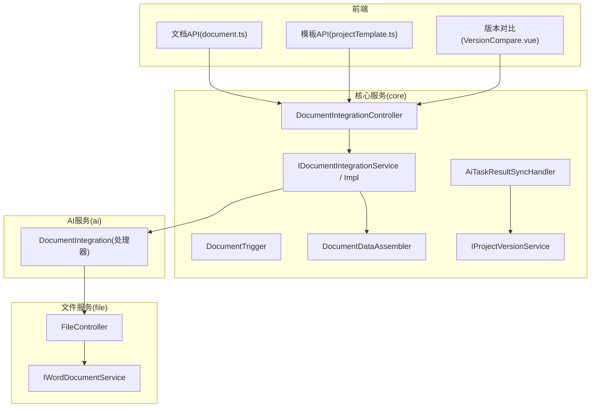
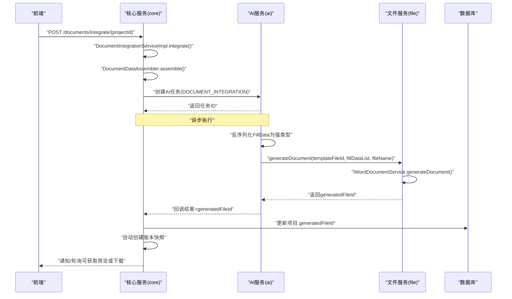
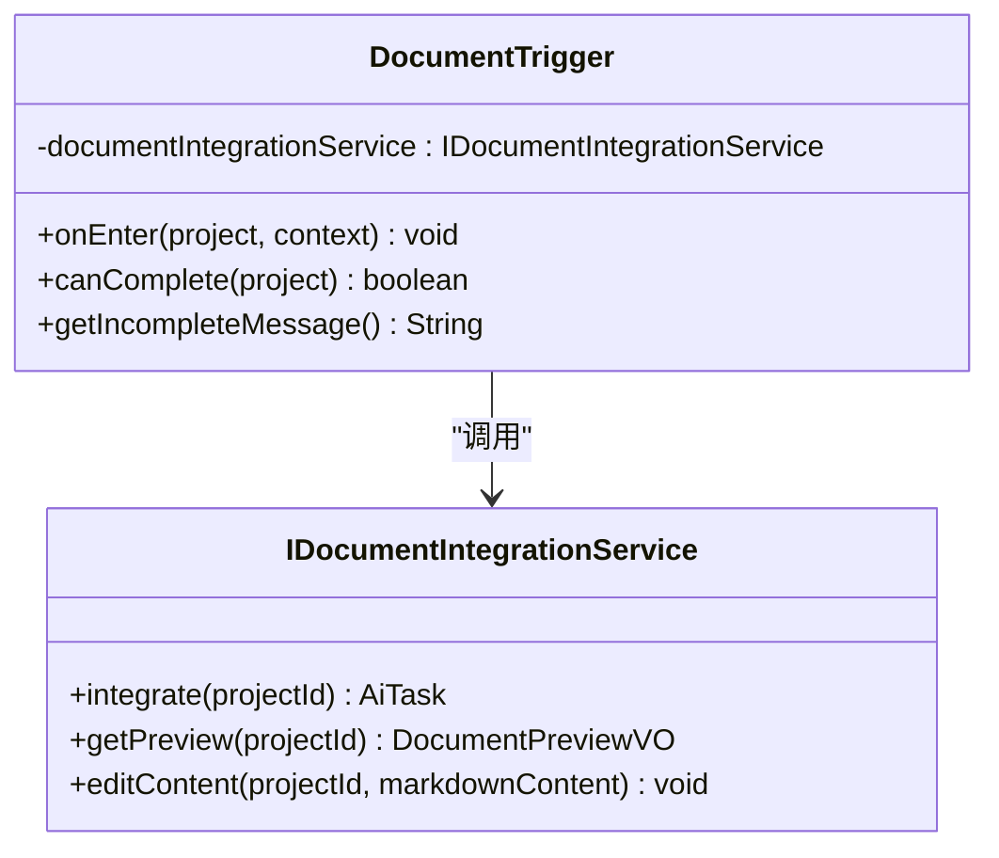
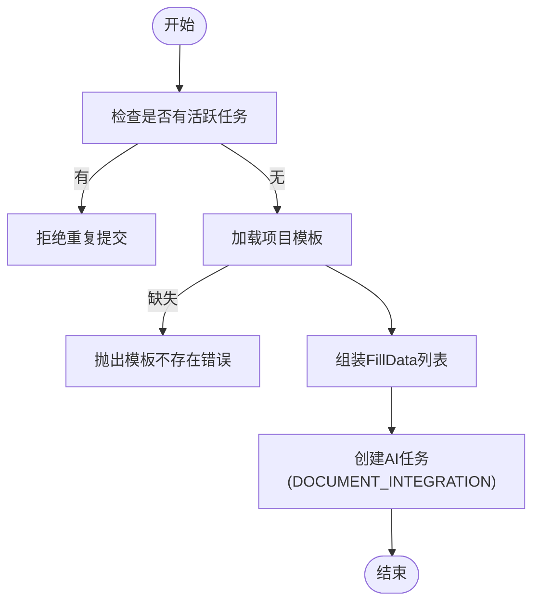
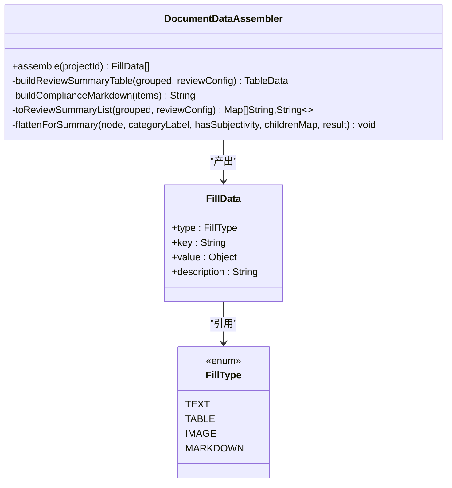
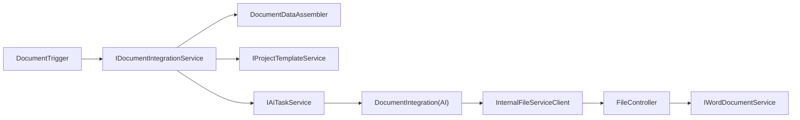

# 文档阶段触发器

<cite>
**本文引用的文件**   
- [DocumentTrigger.java](file://ele-ai-tender-system/ele-ai-tender-core/src/main/java/com/jy/eleaitender/core/statemachine/trigger/DocumentTrigger.java)
- [IDocumentIntegrationService.java](file://ele-ai-tender-system/ele-ai-tender-core/src/main/java/com/jy/eleaitender/core/service/IDocumentIntegrationService.java)
- [DocumentIntegrationServiceImpl.java](file://ele-ai-tender-system/ele-ai-tender-core/src/main/java/com/jy/eleaitender/core/service/impl/DocumentIntegrationServiceImpl.java)
- [DocumentDataAssembler.java](file://ele-ai-tender-system/ele-ai-tender-core/src/main/java/com/jy/eleaitender/core/engine/DocumentDataAssembler.java)
- [MarkdownTemplateEngine.java](file://ele-ai-tender-system/ele-ai-tender-core/src/main/java/com/jy/eleaitender/core/engine/MarkdownTemplateEngine.java)
- [IProjectTemplateService.java](file://ele-ai-tender-system/ele-ai-tender-core/src/main/java/com/jy/eleaitender/core/service/IProjectTemplateService.java)
- [DocumentIntegrationController.java](file://ele-ai-tender-system/ele-ai-tender-core/src/main/java/com/jy/eleaitender/core/controller/DocumentIntegrationController.java)
- [AiTaskResultSyncHandler.java](file://ele-ai-tender-system/ele-ai-tender-core/src/main/java/com/jy/eleaitender/core/scheduler/AiTaskResultSyncHandler.java)
- [InternalFileServiceClient.java](file://ele-ai-tender-system/ele-ai-tender-common/src/main/java/com/jy/eleaitender/common/client/InternalFileServiceClient.java)
- [FileController.java](file://ele-ai-tender-system/ele-ai-tender-file/src/main/java/com/jy/eleaitender/file/controller/FileController.java)
- [IWordDocumentService.java](file://ele-ai-tender-system/ele-ai-tender-file/src/main/java/com/jy/eleaitender/file/service/IWordDocumentService.java)
- [DocumentIntegration.java](file://ele-ai-tender-system/ele-ai-tender-ai/src/main/java/com/jy/eleaitender/ai/processor/generator/DocumentIntegration.java)
- [FillData.java](file://ele-ai-tender-system/ele-ai-tender-common/src/main/java/com/jy/eleaitender/common/dto/FillData.java)
- [FillType.java](file://ele-ai-tender-system/ele-ai-tender-common/src/main/java/com/jy/eleaitender/common/dto/FillType.java)
- [projectTemplate.ts](file://ele-ai-tender-frontend/src/api/projectTemplate.ts)
- [document.ts](file://ele-ai-tender-frontend/src/api/document.ts)
- [template.ts](file://ele-ai-tender-frontend/src/types/template.ts)
- [VersionCompare.vue](file://ele-ai-tender-frontend/src/components/project/VersionCompare.vue)
- [IProjectVersionService.java](file://ele-ai-tender-system/ele-ai-tender-core/src/main/java/com/jy/eleaitender/core/service/IProjectVersionService.java)
</cite>

## 目录
1. [简介](#简介)
2. [项目结构](#项目结构)
3. [核心组件](#核心组件)
4. [架构总览](#架构总览)
5. [详细组件分析](#详细组件分析)
6. [依赖关系分析](#依赖关系分析)
7. [性能与扩展性](#性能与扩展性)
8. [故障排查指南](#故障排查指南)
9. [结论](#结论)
10. [附录：前端集成要点](#附录前端集成要点)

## 简介
本技术文档围绕“文档阶段触发器”展开，系统性说明 DocumentTrigger 的实现逻辑、文档整合与格式化流程、模板引擎使用方式、与文件服务的集成（上传、下载、预览、转换）、以及版本控制与对比合并能力。文档面向具备不同技术背景的读者，提供从高层架构到代码级细节的渐进式解读，并给出可视化图示与排障建议。

## 项目结构
本项目采用前后端分离与多模块后端架构：
- 前端：Vue + TypeScript，提供文档生成、预览、版本对比等交互
- 核心服务（core）：状态机触发器、文档集成服务、数据组装器、任务调度同步
- AI 服务（ai）：AI 任务处理器，负责模板占位符语义匹配与调用文件服务生成文档
- 文件服务（file）：文件存储、Word 文档结构与生成、修复、文本提取
- 通用模块（common）：跨模块共享 DTO、枚举、客户端封装等

图表来源
- [DocumentTrigger.java:1-46](file://ele-ai-tender-system/ele-ai-tender-core/src/main/java/com/jy/eleaitender/core/statemachine/trigger/DocumentTrigger.java#L1-L46)
- [DocumentIntegrationController.java:1-49](file://ele-ai-tender-system/ele-ai-tender-core/src/main/java/com/jy/eleaitender/core/controller/DocumentIntegrationController.java#L1-L49)
- [DocumentIntegrationServiceImpl.java:1-112](file://ele-ai-tender-system/ele-ai-tender-core/src/main/java/com/jy/eleaitender/core/service/impl/DocumentIntegrationServiceImpl.java#L1-L112)
- [DocumentDataAssembler.java:1-267](file://ele-ai-tender-system/ele-ai-tender-core/src/main/java/com/jy/eleaitender/core/engine/DocumentDataAssembler.java#L1-L267)
- [DocumentIntegration.java:66-118](file://ele-ai-tender-system/ele-ai-tender-ai/src/main/java/com/jy/eleaitender/ai/processor/generator/DocumentIntegration.java#L66-L118)
- [FileController.java:1-135](file://ele-ai-tender-system/ele-ai-tender-file/src/main/java/com/jy/eleaitender/file/controller/FileController.java#L1-L135)
- [IWordDocumentService.java:1-49](file://ele-ai-tender-system/ele-ai-tender-file/src/main/java/com/jy/eleaitender/file/service/IWordDocumentService.java#L1-L49)
- [AiTaskResultSyncHandler.java:551-586](file://ele-ai-tender-system/ele-ai-tender-core/src/main/java/com/jy/eleaitender/core/scheduler/AiTaskResultSyncHandler.java#L551-L586)

章节来源
- [DocumentTrigger.java:1-46](file://ele-ai-tender-system/ele-ai-tender-core/src/main/java/com/jy/eleaitender/core/statemachine/trigger/DocumentTrigger.java#L1-L46)
- [DocumentIntegrationController.java:1-49](file://ele-ai-tender-system/ele-ai-tender-core/src/main/java/com/jy/eleaitender/core/controller/DocumentIntegrationController.java#L1-L49)
- [DocumentIntegrationServiceImpl.java:1-112](file://ele-ai-tender-system/ele-ai-tender-core/src/main/java/com/jy/eleaitender/core/service/impl/DocumentIntegrationServiceImpl.java#L1-L112)
- [DocumentDataAssembler.java:1-267](file://ele-ai-tender-system/ele-ai-tender-core/src/main/java/com/jy/eleaitender/core/engine/DocumentDataAssembler.java#L1-L267)
- [FileController.java:1-135](file://ele-ai-tender-system/ele-ai-tender-file/src/main/java/com/jy/eleaitender/file/controller/FileController.java#L1-L135)
- [IWordDocumentService.java:1-49](file://ele-ai-tender-system/ele-ai-tender-file/src/main/java/com/jy/eleaitender/file/service/IWordDocumentService.java#L1-L49)
- [AiTaskResultSyncHandler.java:551-586](file://ele-ai-tender-system/ele-ai-tender-core/src/main/java/com/jy/eleaitender/core/scheduler/AiTaskResultSyncHandler.java#L551-L586)

## 核心组件
- 文档阶段触发器 DocumentTrigger：在状态机进入“文档阶段”时自动触发文档集成；同时定义完成条件（已生成文件）。
- 文档集成服务 IDocumentIntegrationService/Impl：校验重复任务、获取项目模板、组装结构化数据、创建异步 AI 任务、提供预览与编辑接口（当前编辑暂不支持）。
- 文档数据组装器 DocumentDataAssembler：聚合项目基础信息、需求内容、评审项数据，输出 FillData 列表（支持 TEXT/TABLE/MARKDOWN/IMAGE）。
- Markdown 模板引擎 MarkdownTemplateEngine：变量替换与 Markdown→HTML 渲染（兼容历史接口）。
- AI 文档集成处理器 DocumentIntegration：将 FillData 转换为强类型，调用文件服务生成 Word 文档。
- 文件服务 FileController/IWordDocumentService：提供上传、下载、结构解析、基于模板生成文档、修复与文本提取等能力。
- 任务结果同步 AiTaskResultSyncHandler：同步文档集成结果，更新项目文件标识，发送通知，自动创建版本快照。
- 版本服务 IProjectVersionService：提供版本列表与创建版本快照的能力。

章节来源
- [DocumentTrigger.java:1-46](file://ele-ai-tender-system/ele-ai-tender-core/src/main/java/com/jy/eleaitender/core/statemachine/trigger/DocumentTrigger.java#L1-L46)
- [IDocumentIntegrationService.java:1-25](file://ele-ai-tender-system/ele-ai-tender-core/src/main/java/com/jy/eleaitender/core/service/IDocumentIntegrationService.java#L1-L25)
- [DocumentIntegrationServiceImpl.java:1-112](file://ele-ai-tender-system/ele-ai-tender-core/src/main/java/com/jy/eleaitender/core/service/impl/DocumentIntegrationServiceImpl.java#L1-L112)
- [DocumentDataAssembler.java:1-267](file://ele-ai-tender-system/ele-ai-tender-core/src/main/java/com/jy/eleaitender/core/engine/DocumentDataAssembler.java#L1-L267)
- [MarkdownTemplateEngine.java:1-82](file://ele-ai-tender-system/ele-ai-tender-core/src/main/java/com/jy/eleaitender/core/engine/MarkdownTemplateEngine.java#L1-L82)
- [DocumentIntegration.java:66-118](file://ele-ai-tender-system/ele-ai-tender-ai/src/main/java/com/jy/eleaitender/ai/processor/generator/DocumentIntegration.java#L66-L118)
- [FileController.java:1-135](file://ele-ai-tender-system/ele-ai-tender-file/src/main/java/com/jy/eleaitender/file/controller/FileController.java#L1-L135)
- [IWordDocumentService.java:1-49](file://ele-ai-tender-system/ele-ai-tender-file/src/main/java/com/jy/eleaitender/file/service/IWordDocumentService.java#L1-L49)
- [AiTaskResultSyncHandler.java:551-586](file://ele-ai-tender-system/ele-ai-tender-core/src/main/java/com/jy/eleaitender/core/scheduler/AiTaskResultSyncHandler.java#L551-L586)
- [IProjectVersionService.java:1-23](file://ele-ai-tender-system/ele-ai-tender-core/src/main/java/com/jy/eleaitender/core/service/IProjectVersionService.java#L1-L23)

## 架构总览
下图展示了从前端发起文档集成到最终生成 Word 文档并落库的完整链路，包括状态机触发、数据组装、AI 处理、文件服务生成与结果同步。

图表来源
- [DocumentIntegrationController.java:26-31](file://ele-ai-tender-system/ele-ai-tender-core/src/main/java/com/jy/eleaitender/core/controller/DocumentIntegrationController.java#L26-L31)
- [DocumentIntegrationServiceImpl.java:49-78](file://ele-ai-tender-system/ele-ai-tender-core/src/main/java/com/jy/eleaitender/core/service/impl/DocumentIntegrationServiceImpl.java#L49-L78)
- [DocumentDataAssembler.java:47-99](file://ele-ai-tender-system/ele-ai-tender-core/src/main/java/com/jy/eleaitender/core/engine/DocumentDataAssembler.java#L47-L99)
- [DocumentIntegration.java:66-75](file://ele-ai-tender-system/ele-ai-tender-ai/src/main/java/com/jy/eleaitender/ai/processor/generator/DocumentIntegration.java#L66-L75)
- [FileController.java:121-135](file://ele-ai-tender-system/ele-ai-tender-file/src/main/java/com/jy/eleaitender/file/controller/FileController.java#L121-L135)
- [AiTaskResultSyncHandler.java:551-586](file://ele-ai-tender-system/ele-ai-tender-core/src/main/java/com/jy/eleaitender/core/scheduler/AiTaskResultSyncHandler.java#L551-L586)

## 详细组件分析

### 文档阶段触发器 DocumentTrigger
- 职责：在状态机进入“文档阶段”时自动触发文档集成；定义阶段完成条件（已生成文件），并提供未完成提示。
- 关键行为：
  - onEnter：调用文档集成服务创建任务，记录日志；异常情况下容错继续推进。
  - canComplete：当项目存在生成的文件标识时允许完成。
  - getIncompleteMessage：未生成文档时的提示信息。

图表来源
- [DocumentTrigger.java:1-46](file://ele-ai-tender-system/ele-ai-tender-core/src/main/java/com/jy/eleaitender/core/statemachine/trigger/DocumentTrigger.java#L1-L46)
- [IDocumentIntegrationService.java:1-25](file://ele-ai-tender-system/ele-ai-tender-core/src/main/java/com/jy/eleaitender/core/service/IDocumentIntegrationService.java#L1-L25)

章节来源
- [DocumentTrigger.java:1-46](file://ele-ai-tender-system/ele-ai-tender-core/src/main/java/com/jy/eleaitender/core/statemachine/trigger/DocumentTrigger.java#L1-L46)

### 文档集成服务 DocumentIntegrationServiceImpl
- 职责：编排文档集成的主流程，包含去重检查、模板绑定校验、数据组装、AI 任务创建、预览与编辑接口。
- 关键点：
  - integrate：若存在活跃任务则拒绝重复提交；必须绑定有效模板；组装 FillData 列表后创建 AI 任务。
  - getPreview：返回项目基本信息与是否已集成。
  - editContent：当前实现抛出“暂不支持在线编辑”，需通过模板修改后重新生成。

图表来源
- [DocumentIntegrationServiceImpl.java:49-78](file://ele-ai-tender-system/ele-ai-tender-core/src/main/java/com/jy/eleaitender/core/service/impl/DocumentIntegrationServiceImpl.java#L49-L78)
- [DocumentIntegrationServiceImpl.java:86-102](file://ele-ai-tender-system/ele-ai-tender-core/src/main/java/com/jy/eleaitender/core/service/impl/DocumentIntegrationServiceImpl.java#L86-L102)

章节来源
- [DocumentIntegrationServiceImpl.java:1-112](file://ele-ai-tender-system/ele-ai-tender-core/src/main/java/com/jy/eleaitender/core/service/impl/DocumentIntegrationServiceImpl.java#L1-L112)

### 文档数据组装器 DocumentDataAssembler
- 职责：收集项目基础信息、需求内容、评审项数据，按类型构建 FillData 列表，供模板填充。
- 数据结构：
  - FillData：统一的数据项模型，支持 TEXT/TABLE/MARKDOWN/IMAGE 四种类型。
  - FillType：数据类型枚举。
- 主要逻辑：
  - assemble：读取项目实体，构造基础字段（TEXT），需求内容（MARKDOWN），评审项汇总（TABLE），符合性审查项（MARKDOWN）。
  - buildReviewSummaryTable：构建评审汇总表，含列定义、行数据与合并规则（按类别合并）。
  - buildComplianceMarkdown：将评审树形结构转为 Markdown 列表（忽略一级节点，展示二级+三级）。
  - toReviewSummaryList/flattenForSummary：递归扁平化评审树，计算类别总分与满分值，支持主观/客观属性显示。

图表来源
- [DocumentDataAssembler.java:47-99](file://ele-ai-tender-system/ele-ai-tender-core/src/main/java/com/jy/eleaitender/core/engine/DocumentDataAssembler.java#L47-L99)
- [DocumentDataAssembler.java:106-121](file://ele-ai-tender-system/ele-ai-tender-core/src/main/java/com/jy/eleaitender/core/engine/DocumentDataAssembler.java#L106-L121)
- [DocumentDataAssembler.java:132-166](file://ele-ai-tender-system/ele-ai-tender-core/src/main/java/com/jy/eleaitender/core/engine/DocumentDataAssembler.java#L132-L166)
- [DocumentDataAssembler.java:170-214](file://ele-ai-tender-system/ele-ai-tender-core/src/main/java/com/jy/eleaitender/core/engine/DocumentDataAssembler.java#L170-L214)
- [FillData.java:1-60](file://ele-ai-tender-system/ele-ai-tender-common/src/main/java/com/jy/eleaitender/common/dto/FillData.java#L1-L60)
- [FillType.java:1-19](file://ele-ai-tender-system/ele-ai-tender-common/src/main/java/com/jy/eleaitender/common/dto/FillType.java#L1-L19)

章节来源
- [DocumentDataAssembler.java:1-267](file://ele-ai-tender-system/ele-ai-tender-core/src/main/java/com/jy/eleaitender/core/engine/DocumentDataAssembler.java#L1-L267)
- [FillData.java:1-60](file://ele-ai-tender-system/ele-ai-tender-common/src/main/java/com/jy/eleaitender/common/dto/FillData.java#L1-L60)
- [FillType.java:1-19](file://ele-ai-tender-system/ele-ai-tender-common/src/main/java/com/jy/eleaitender/common/dto/FillType.java#L1-L19)

### Markdown 模板引擎 MarkdownTemplateEngine
- 职责：提供变量占位符替换与 Markdown→HTML 渲染能力，保留 generateWord 接口以兼容旧流程。
- 关键点：
  - renderTemplate：将 {{key}} 占位符替换为上下文值。
  - markdownToHtml：使用 flexmark-java 将 Markdown 解析为 HTML。
  - generateHtml：先替换占位符，再转 HTML。
  - generateWord：兼容旧接口，内部委托 generateHtml。

章节来源
- [MarkdownTemplateEngine.java:1-82](file://ele-ai-tender-system/ele-ai-tender-core/src/main/java/com/jy/eleaitender/core/engine/MarkdownTemplateEngine.java#L1-L82)

### AI 文档集成处理器 DocumentIntegration
- 职责：接收 AI 任务参数，反序列化为强类型 FillData，调用文件服务生成 Word 文档，并返回生成文件 ID。
- 关键点：
  - deserializeFillDataList：根据 FillType 将 value 转换为具体类型（TableData/ImageData/String）。
  - matchPlaceholders：可选的 AI 语义匹配，用于将模板占位符名与数据 key 对齐（解决命名不一致问题）。
  - 调用文件服务：generateDocument(templateFileId, fillDataList, fileName)。

章节来源
- [DocumentIntegration.java:66-118](file://ele-ai-tender-system/ele-ai-tender-ai/src/main/java/com/jy/eleaitender/ai/processor/generator/DocumentIntegration.java#L66-L118)

### 文件服务集成 FileController/IWordDocumentService
- 职责：提供文件上传、下载、删除、结构解析、基于模板生成文档、修复与文本提取等能力。
- 关键点：
  - upload/download/delete：标准文件操作。
  - structure：获取 Word 文档结构（章节、占位符、书签）。
  - generate-doc：基于模板与填充数据生成新文档，返回生成文件 ID。
  - IWordDocumentService：定义文档结构、生成、修复、文本提取接口。

章节来源
- [FileController.java:1-135](file://ele-ai-tender-system/ele-ai-tender-file/src/main/java/com/jy/eleaitender/file/controller/FileController.java#L1-L135)
- [IWordDocumentService.java:1-49](file://ele-ai-tender-system/ele-ai-tender-file/src/main/java/com/jy/eleaitender/file/service/IWordDocumentService.java#L1-L49)

### 任务结果同步与版本控制 AiTaskResultSyncHandler/IProjectVersionService
- 职责：同步文档集成结果，更新项目文件标识，发送通知，自动创建版本快照。
- 关键点：
  - 解析生成文件 ID，更新项目表字段。
  - 发送文档集成完成通知给项目创建者。
  - 自动创建版本备份，便于后续对比与回溯。
  - IProjectVersionService：提供版本列表与创建版本快照接口。

章节来源
- [AiTaskResultSyncHandler.java:551-586](file://ele-ai-tender-system/ele-ai-tender-core/src/main/java/com/jy/eleaitender/core/scheduler/AiTaskResultSyncHandler.java#L551-L586)
- [IProjectVersionService.java:1-23](file://ele-ai-tender-system/ele-ai-tender-core/src/main/java/com/jy/eleaitender/core/service/IProjectVersionService.java#L1-L23)

### 前端集成与版本对比
- 文档 API：
  - document.ts：提供 integrate/getPreview/editContent 三个接口调用。
  - projectTemplate.ts：提供模板绑定与查询接口。
  - template.ts：定义模板结构（章节、占位符、书签）类型。
- 版本对比：
  - VersionCompare.vue：选择两个版本进行对比，展示新增/修改/删除差异。

章节来源
- [document.ts:1-20](file://ele-ai-tender-frontend/src/api/document.ts#L1-L20)
- [projectTemplate.ts:1-13](file://ele-ai-tender-frontend/src/api/projectTemplate.ts#L1-L13)
- [template.ts:1-29](file://ele-ai-tender-frontend/src/types/template.ts#L1-L29)
- [VersionCompare.vue:1-80](file://ele-ai-tender-frontend/src/components/project/VersionCompare.vue#L1-L80)

## 依赖关系分析
- 组件耦合：
  - DocumentTrigger 仅依赖 IDocumentIntegrationService，低耦合高内聚。
  - DocumentIntegrationServiceImpl 依赖 IAiTaskService、TbProjectMapper、DocumentDataAssembler、IProjectTemplateService。
  - AI 处理器依赖 InternalFileServiceClient 与 Jackson 对象映射。
  - 文件服务独立对外暴露 REST 接口，被 AI 处理器调用。
- 外部依赖：
  - flexmark-java：Markdown→HTML 渲染。
  - poi-tl：Word 模板填充（由文件服务内部实现）。
  - Jackson：JSON 序列化/反序列化。
- 潜在循环依赖：未发现直接循环依赖；AI 与 Core 通过任务与回调解耦。

图表来源
- [DocumentTrigger.java:1-46](file://ele-ai-tender-system/ele-ai-tender-core/src/main/java/com/jy/eleaitender/core/statemachine/trigger/DocumentTrigger.java#L1-L46)
- [DocumentIntegrationServiceImpl.java:1-112](file://ele-ai-tender-system/ele-ai-tender-core/src/main/java/com/jy/eleaitender/core/service/impl/DocumentIntegrationServiceImpl.java#L1-L112)
- [DocumentIntegration.java:66-118](file://ele-ai-tender-system/ele-ai-tender-ai/src/main/java/com/jy/eleaitender/ai/processor/generator/DocumentIntegration.java#L66-L118)
- [InternalFileServiceClient.java:96-132](file://ele-ai-tender-system/ele-ai-tender-common/src/main/java/com/jy/eleaitender/common/client/InternalFileServiceClient.java#L96-L132)
- [FileController.java:1-135](file://ele-ai-tender-system/ele-ai-tender-file/src/main/java/com/jy/eleaitender/file/controller/FileController.java#L1-L135)
- [IWordDocumentService.java:1-49](file://ele-ai-tender-system/ele-ai-tender-file/src/main/java/com/jy/eleaitender/file/service/IWordDocumentService.java#L1-L49)

章节来源
- [DocumentTrigger.java:1-46](file://ele-ai-tender-system/ele-ai-tender-core/src/main/java/com/jy/eleaitender/core/statemachine/trigger/DocumentTrigger.java#L1-L46)
- [DocumentIntegrationServiceImpl.java:1-112](file://ele-ai-tender-system/ele-ai-tender-core/src/main/java/com/jy/eleaitender/core/service/impl/DocumentIntegrationServiceImpl.java#L1-L112)
- [DocumentIntegration.java:66-118](file://ele-ai-tender-system/ele-ai-tender-ai/src/main/java/com/jy/eleaitender/ai/processor/generator/DocumentIntegration.java#L66-L118)
- [InternalFileServiceClient.java:96-132](file://ele-ai-tender-system/ele-ai-tender-common/src/main/java/com/jy/eleaitender/common/client/InternalFileServiceClient.java#L96-L132)
- [FileController.java:1-135](file://ele-ai-tender-system/ele-ai-tender-file/src/main/java/com/jy/eleaitender/file/controller/FileController.java#L1-L135)
- [IWordDocumentService.java:1-49](file://ele-ai-tender-system/ele-ai-tender-file/src/main/java/com/jy/eleaitender/file/service/IWordDocumentService.java#L1-L49)

## 性能与扩展性
- 并发与幂等：
  - 集成前检查活跃任务，避免重复生成，提升系统稳定性。
- 异步处理：
  - 文档生成为异步 AI 任务，降低请求响应时间，提高吞吐。
- 数据组装优化：
  - 评审项分组与扁平化使用流式处理，减少中间集合开销。
- 可扩展点：
  - 模板引擎可替换为其他渲染方案（如纯 poi-tl 策略）。
  - AI 语义匹配可配置开关，按需启用以提升匹配质量。
  - 文件服务可接入分布式存储与缓存层，提升大文件处理能力。

[本节为通用指导，不直接分析具体文件]

## 故障排查指南
- 常见问题与定位：
  - 重复集成报错：检查是否存在 PENDING/PROCESSING 状态的任务。
  - 模板未绑定或无文件：确认项目模板绑定与模板文件有效性。
  - 在线编辑不支持：当前 editContent 抛出“暂不支持”，需通过模板修改后重新生成。
  - 生成失败：查看 AI 任务日志与文件服务生成日志，确认 FillData 类型转换与模板占位符匹配。
  - 结果未同步：检查 AiTaskResultSyncHandler 是否成功更新 generatedFileId 与创建版本快照。
- 建议日志关键字：
  - “自动触发项目文档集成”、“文档集成结果格式异常”、“自动创建版本快照创建成功/失败”。

章节来源
- [DocumentIntegrationServiceImpl.java:86-102](file://ele-ai-tender-system/ele-ai-tender-core/src/main/java/com/jy/eleaitender/core/service/impl/DocumentIntegrationServiceImpl.java#L86-L102)
- [AiTaskResultSyncHandler.java:551-586](file://ele-ai-tender-system/ele-ai-tender-core/src/main/java/com/jy/eleaitender/core/scheduler/AiTaskResultSyncHandler.java#L551-L586)

## 结论
DocumentTrigger 作为状态机入口，驱动了完整的文档集成流水线：数据组装→AI 处理→文件服务生成→结果同步→版本快照。该设计具备良好的解耦性与扩展性，支持多人协作场景下的版本管理与对比。未来可在以下方面持续优化：
- 增强在线编辑能力（增量 diff 与合并策略）
- 引入更强大的模板渲染与样式控制
- 完善并发与重试机制，提升鲁棒性

[本节为总结性内容，不直接分析具体文件]

## 附录：前端集成要点
- 文档集成：
  - 调用 integrate 接口创建异步任务，轮询或监听通知获取结果。
  - 使用 getPreview 获取集成状态与文件标识。
  - editContent 当前不可用，需通过模板调整。
- 模板管理：
  - 使用 bind 接口绑定模板，getByProject 查询项目模板。
  - 利用 WordStructure 结构定义（章节、占位符、书签）辅助模板设计与验证。
- 版本对比：
  - 使用 VersionCompare 组件选择两个版本进行对比，直观展示变更。

章节来源
- [document.ts:1-20](file://ele-ai-tender-frontend/src/api/document.ts#L1-L20)
- [projectTemplate.ts:1-13](file://ele-ai-tender-frontend/src/api/projectTemplate.ts#L1-L13)
- [template.ts:1-29](file://ele-ai-tender-frontend/src/types/template.ts#L1-L29)
- [VersionCompare.vue:1-80](file://ele-ai-tender-frontend/src/components/project/VersionCompare.vue#L1-L80)