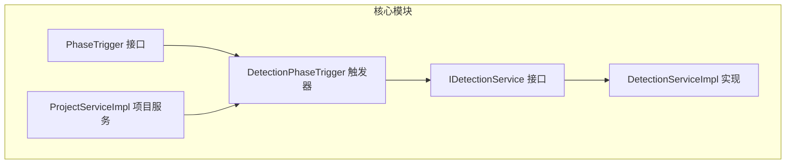
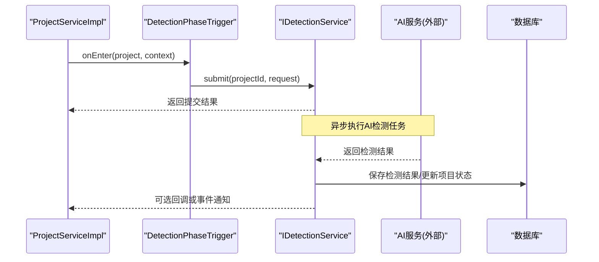
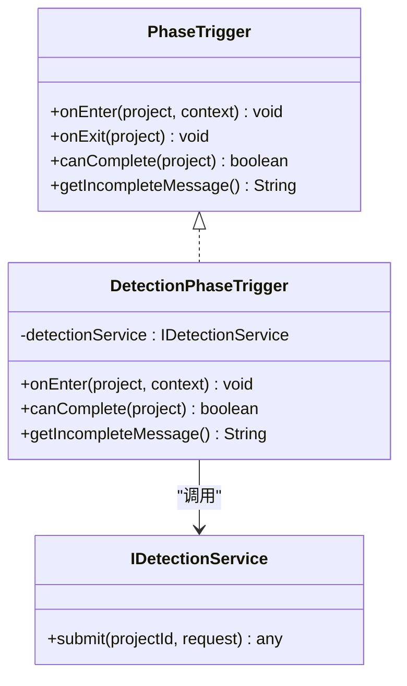
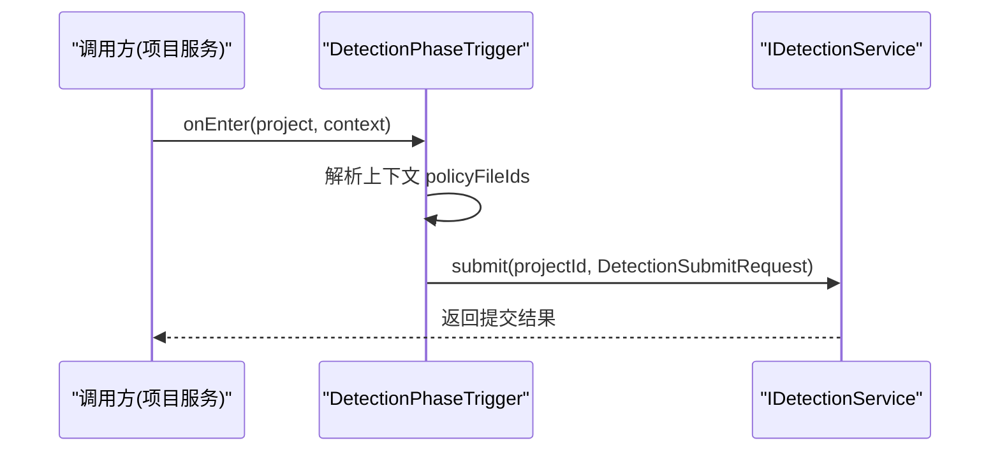
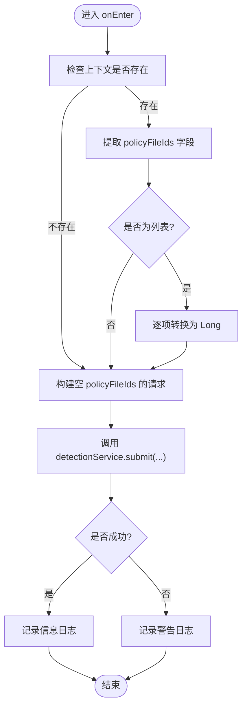

# 检测阶段触发器

<cite>
**本文引用的文件**
- [DetectionPhaseTrigger.java](file://ele-ai-tender-system/ele-ai-tender-core/src/main/java/com/jy/eleaitender/core/statemachine/trigger/DetectionPhaseTrigger.java)
- [IDetectionService.java](file://ele-ai-tender-system/ele-ai-tender-core/src/main/java/com/jy/eleaitender/core/service/IDetectionService.java)
- [DetectionServiceImpl.java](file://ele-ai-tender-system/ele-ai-tender-core/src/main/java/com/jy/eleaitender/core/service/impl/DetectionServiceImpl.java)
- [ProjectServiceImpl.java](file://ele-ai-tender-system/ele-ai-tender-core/src/main/java/com/jy/eleaitender/core/service/impl/ProjectServiceImpl.java)
- [PhaseTrigger.java](file://ele-ai-tender-system/ele-ai-tender-core/src/main/java/com/jy/eleaitender/core/statemachine/PhaseTrigger.java)
</cite>

## 目录
1. [简介](#简介)
2. [项目结构](#项目结构)
3. [核心组件](#核心组件)
4. [架构总览](#架构总览)
5. [详细组件分析](#详细组件分析)
6. [依赖关系分析](#依赖关系分析)
7. [性能与可靠性考虑](#性能与可靠性考虑)
8. [故障排查指南](#故障排查指南)
9. [结论](#结论)
10. [附录](#附录)

## 简介
本技术文档聚焦于“检测阶段触发器”的实现与使用，围绕 DetectionPhaseTrigger 的职责、智能检测任务的创建与调度、AI服务调用流程、检测结果处理与存储、任务生命周期管理以及与AI服务模块的集成方式进行深入解析。文档同时提供流程图与时序图，帮助读者快速理解从任务提交到结果回调的完整链路，并给出错误重试、超时控制等工程化建议。

## 项目结构
检测阶段触发器位于核心模块的状态机触发器层，负责在项目进入“检测阶段”时自动发起智能检测任务；其通过检测服务接口与具体实现协作，完成异步任务提交与后续状态推进。

图示来源
- [PhaseTrigger.java:11-39](file://ele-ai-tender-system/ele-ai-tender-core/src/main/java/com/jy/eleaitender/core/statemachine/PhaseTrigger.java#L11-L39)
- [DetectionPhaseTrigger.java:20-70](file://ele-ai-tender-system/ele-ai-tender-core/src/main/java/com/jy/eleaitender/core/statemachine/trigger/DetectionPhaseTrigger.java#L20-L70)
- [IDetectionService.java](file://ele-ai-tender-system/ele-ai-tender-core/src/main/java/com/jy/eleaitender/core/service/IDetectionService.java)
- [DetectionServiceImpl.java](file://ele-ai-tender-system/ele-ai-tender-core/src/main/java/com/jy/eleaitender/core/service/impl/DetectionServiceImpl.java)
- [ProjectServiceImpl.java:68-70](file://ele-ai-tender-system/ele-ai-tender-core/src/main/java/com/jy/eleaitender/core/service/impl/ProjectServiceImpl.java#L68-L70)

章节来源
- [DetectionPhaseTrigger.java:20-70](file://ele-ai-tender-system/ele-ai-tender-core/src/main/java/com/jy/eleaitender/core/statemachine/trigger/DetectionPhaseTrigger.java#L20-L70)
- [PhaseTrigger.java:11-39](file://ele-ai-tender-system/ele-ai-tender-core/src/main/java/com/jy/eleaitender/core/statemachine/PhaseTrigger.java#L11-L39)
- [ProjectServiceImpl.java:68-70](file://ele-ai-tender-system/ele-ai-tender-core/src/main/java/com/jy/eleaitender/core/service/impl/ProjectServiceImpl.java#L68-L70)

## 核心组件
- PhaseTrigger 接口：定义阶段进入/离开、完成条件与提示信息等统一契约。
- DetectionPhaseTrigger：实现 PhaseTrigger，在“检测阶段”进入时自动提交智能检测任务，并提供完成条件判断与提示文案。
- IDetectionService / DetectionServiceImpl：封装检测任务提交、查询、状态同步等能力（具体实现细节以对应文件为准）。
- ProjectServiceImpl：在合适时机注入并使用 DetectionPhaseTrigger，驱动阶段流转。

章节来源
- [PhaseTrigger.java:11-39](file://ele-ai-tender-system/ele-ai-tender-core/src/main/java/com/jy/eleaitender/core/statemachine/PhaseTrigger.java#L11-L39)
- [DetectionPhaseTrigger.java:20-70](file://ele-ai-tender-system/ele-ai-tender-core/src/main/java/com/jy/eleaitender/core/statemachine/trigger/DetectionPhaseTrigger.java#L20-L70)
- [IDetectionService.java](file://ele-ai-tender-system/ele-ai-tender-core/src/main/java/com/jy/eleaitender/core/service/IDetectionService.java)
- [DetectionServiceImpl.java](file://ele-ai-tender-system/ele-ai-tender-core/src/main/java/com/jy/eleaitender/core/service/impl/DetectionServiceImpl.java)
- [ProjectServiceImpl.java:68-70](file://ele-ai-tender-system/ele-ai-tender-core/src/main/java/com/jy/eleaitender/core/service/impl/ProjectServiceImpl.java#L68-L70)

## 架构总览
下图展示了“检测阶段触发器”在整体系统中的位置与交互：项目服务在阶段切换时调用触发器，触发器通过检测服务提交任务；检测服务内部再与AI服务进行异步交互，并将结果持久化与状态更新。

图示来源
- [ProjectServiceImpl.java:68-70](file://ele-ai-tender-system/ele-ai-tender-core/src/main/java/com/jy/eleaitender/core/service/impl/ProjectServiceImpl.java#L68-L70)
- [DetectionPhaseTrigger.java:20-70](file://ele-ai-tender-system/ele-ai-tender-core/src/main/java/com/jy/eleaitender/core/statemachine/trigger/DetectionPhaseTrigger.java#L20-L70)
- [IDetectionService.java](file://ele-ai-tender-system/ele-ai-tender-core/src/main/java/com/jy/eleaitender/core/service/IDetectionService.java)
- [DetectionServiceImpl.java](file://ele-ai-tender-system/ele-ai-tender-core/src/main/java/com/jy/eleaitender/core/service/impl/DetectionServiceImpl.java)

## 详细组件分析

### DetectionPhaseTrigger 类分析
- 职责
  - 在阶段进入时，从上下文提取政策文件ID列表，构建检测提交请求并调用检测服务提交任务。
  - 提供阶段完成条件：当项目状态为“检测通过”或“跳过检测”时允许完成。
  - 提供未完成时的用户提示文案。
- 关键行为
  - 上下文参数解析：支持多种数字类型输入，统一转换为Long列表。
  - 异常容错：提交失败仅记录警告日志，不阻断阶段进入。
  - 完成判定：基于项目状态码匹配。
- 复杂度
  - 时间复杂度：上下文解析为 O(n)，n为policyFileIds数量。
  - 空间复杂度：O(n)，用于存放转换后的ID列表。

图示来源
- [PhaseTrigger.java:11-39](file://ele-ai-tender-system/ele-ai-tender-core/src/main/java/com/jy/eleaitender/core/statemachine/PhaseTrigger.java#L11-L39)
- [DetectionPhaseTrigger.java:20-70](file://ele-ai-tender-system/ele-ai-tender-core/src/main/java/com/jy/eleaitender/core/statemachine/trigger/DetectionPhaseTrigger.java#L20-L70)
- [IDetectionService.java](file://ele-ai-tender-system/ele-ai-tender-core/src/main/java/com/jy/eleaitender/core/service/IDetectionService.java)

章节来源
- [DetectionPhaseTrigger.java:20-70](file://ele-ai-tender-system/ele-ai-tender-core/src/main/java/com/jy/eleaitender/core/statemachine/trigger/DetectionPhaseTrigger.java#L20-L70)
- [PhaseTrigger.java:11-39](file://ele-ai-tender-system/ele-ai-tender-core/src/main/java/com/jy/eleaitender/core/statemachine/PhaseTrigger.java#L11-L39)

### 检测任务提交时序
该时序展示从阶段进入触发到检测服务提交的调用链。

图示来源
- [DetectionPhaseTrigger.java:20-70](file://ele-ai-tender-system/ele-ai-tender-core/src/main/java/com/jy/eleaitender/core/statemachine/trigger/DetectionPhaseTrigger.java#L20-L70)
- [IDetectionService.java](file://ele-ai-tender-system/ele-ai-tender-core/src/main/java/com/jy/eleaitender/core/service/IDetectionService.java)

章节来源
- [DetectionPhaseTrigger.java:20-70](file://ele-ai-tender-system/ele-ai-tender-core/src/main/java/com/jy/eleaitender/core/statemachine/trigger/DetectionPhaseTrigger.java#L20-L70)

### 复杂业务逻辑流程图（上下文解析与提交）
该流程图描述触发器对上下文的解析与提交决策路径。

图示来源
- [DetectionPhaseTrigger.java:20-70](file://ele-ai-tender-system/ele-ai-tender-core/src/main/java/com/jy/eleaitender/core/statemachine/trigger/DetectionPhaseTrigger.java#L20-L70)

章节来源
- [DetectionPhaseTrigger.java:20-70](file://ele-ai-tender-system/ele-ai-tender-core/src/main/java/com/jy/eleaitender/core/statemachine/trigger/DetectionPhaseTrigger.java#L20-L70)

### 与AI服务模块的集成方式
- 异步任务处理
  - 触发器仅负责提交任务，实际AI调用由检测服务内部异步执行，避免阻塞阶段进入流程。
- 错误重试机制
  - 建议在检测服务中引入幂等任务队列与重试策略（如指数退避），确保网络抖动或服务瞬态异常不影响最终一致性。
- 超时控制
  - 对外部AI调用的HTTP客户端应配置合理的连接与读取超时，并在服务层增加任务级超时控制，防止长时间挂起。
- 结果回调与持久化
  - 检测服务应在AI返回后落库检测结果，并更新项目状态（如“检测通过”、“检测失败”等），以便触发器 canComplete 正确判定。

[本节为通用集成建议，不直接分析具体文件]

### 检测结果解析与转换
- 数据映射
  - 将AI返回的结构化结果映射至业务模型（如问题清单、风险项、合规性评分等），并进行必要的数据清洗与标准化。
- 校验与兜底
  - 对关键字段进行非空与格式校验；缺失或异常时采用默认值或标记为待人工复核。
- 版本与追溯
  - 保留AI调用原始响应与中间产物，便于审计与回溯。

[本节为通用设计建议，不直接分析具体文件]

### 检测任务生命周期管理
- 提交阶段
  - 触发器在阶段进入时提交任务，生成唯一任务标识，写入任务表并设置初始状态。
- 执行阶段
  - 检测服务消费任务，调用AI服务，记录调用日志与耗时。
- 完成阶段
  - 根据AI返回结果更新项目状态与相关实体，触发后续阶段推进。
- 失败与补偿
  - 失败任务进入重试队列；超过最大重试次数则转入人工干预流程。

[本节为通用生命周期说明，不直接分析具体文件]

## 依赖关系分析
- 耦合度
  - DetectionPhaseTrigger 仅依赖 IDetectionService 接口，符合面向接口编程原则，降低与实现的耦合。
- 内聚性
  - 触发器职责单一：上下文解析、任务提交、完成条件判断与提示文案。
- 外部依赖
  - 检测服务可能依赖消息队列、缓存、AI网关等外部系统，需关注可用性、幂等性与可观测性。

图示来源
- [DetectionPhaseTrigger.java:20-70](file://ele-ai-tender-system/ele-ai-tender-core/src/main/java/com/jy/eleaitender/core/statemachine/trigger/DetectionPhaseTrigger.java#L20-L70)
- [IDetectionService.java](file://ele-ai-tender-system/ele-ai-tender-core/src/main/java/com/jy/eleaitender/core/service/IDetectionService.java)
- [ProjectServiceImpl.java:68-70](file://ele-ai-tender-system/ele-ai-tender-core/src/main/java/com/jy/eleaitender/core/service/impl/ProjectServiceImpl.java#L68-L70)

章节来源
- [DetectionPhaseTrigger.java:20-70](file://ele-ai-tender-system/ele-ai-tender-core/src/main/java/com/jy/eleaitender/core/statemachine/trigger/DetectionPhaseTrigger.java#L20-L70)
- [ProjectServiceImpl.java:68-70](file://ele-ai-tender-system/ele-ai-tender-core/src/main/java/com/jy/eleaitender/core/service/impl/ProjectServiceImpl.java#L68-L70)

## 性能与可靠性考虑
- 并发与吞吐
  - 检测服务应采用线程池或消息队列进行削峰填谷，避免瞬时高并发导致AI服务过载。
- 幂等与去重
  - 任务提交前进行幂等键校验，防止重复提交造成资源浪费。
- 监控与告警
  - 对提交成功率、AI调用耗时、失败率、重试次数等指标进行埋点与告警。
- 降级与熔断
  - 当AI服务不可用时，触发器仍可进入阶段，但检测任务延迟执行或转人工处理。

[本节为通用性能与可靠性建议，不直接分析具体文件]

## 故障排查指南
- 常见问题
  - 上下文缺少 policyFileIds：触发器会构造空列表并提交，需确认上游传入是否正确。
  - 提交失败：触发器仅记录警告日志，不会阻断阶段进入；需检查检测服务与AI服务的连通性与鉴权配置。
  - 无法完成阶段：确认项目状态是否已更新为“检测通过”或“跳过检测”。
- 定位步骤
  - 查看触发器日志，确认提交是否被调用及入参。
  - 检查检测服务任务表与AI调用日志，确认任务是否被执行与结果是否落库。
  - 核对项目状态是否与 canComplete 的条件一致。

章节来源
- [DetectionPhaseTrigger.java:20-70](file://ele-ai-tender-system/ele-ai-tender-core/src/main/java/com/jy/eleaitender/core/statemachine/trigger/DetectionPhaseTrigger.java#L20-L70)

## 结论
DetectionPhaseTrigger 作为检测阶段的入口触发器，实现了“进入即提交”的自动化流程，并通过简洁的完成条件与提示文案保障用户体验。结合检测服务与AI服务的异步协作，可实现高可用、可扩展的智能检测流水线。建议在检测服务层完善重试、超时、幂等与监控能力，以提升整体系统的稳定性与可观测性。

## 附录
- 代码片段路径参考
  - 触发器实现：[DetectionPhaseTrigger.java:20-70](file://ele-ai-tender-system/ele-ai-tender-core/src/main/java/com/jy/eleaitender/core/statemachine/trigger/DetectionPhaseTrigger.java#L20-L70)
  - 触发器接口：[PhaseTrigger.java:11-39](file://ele-ai-tender-system/ele-ai-tender-core/src/main/java/com/jy/eleaitender/core/statemachine/PhaseTrigger.java#L11-L39)
  - 检测服务接口：[IDetectionService.java](file://ele-ai-tender-system/ele-ai-tender-core/src/main/java/com/jy/eleaitender/core/service/IDetectionService.java)
  - 检测服务实现：[DetectionServiceImpl.java](file://ele-ai-tender-system/ele-ai-tender-core/src/main/java/com/jy/eleaitender/core/service/impl/DetectionServiceImpl.java)
  - 项目服务注入触发器：[ProjectServiceImpl.java:68-70](file://ele-ai-tender-system/ele-ai-tender-core/src/main/java/com/jy/eleaitender/core/service/impl/ProjectServiceImpl.java#L68-L70)