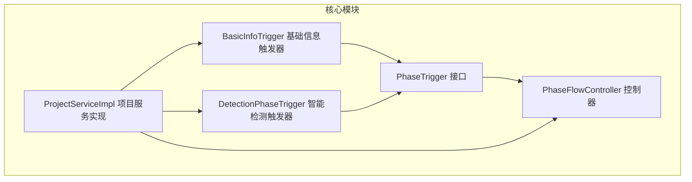
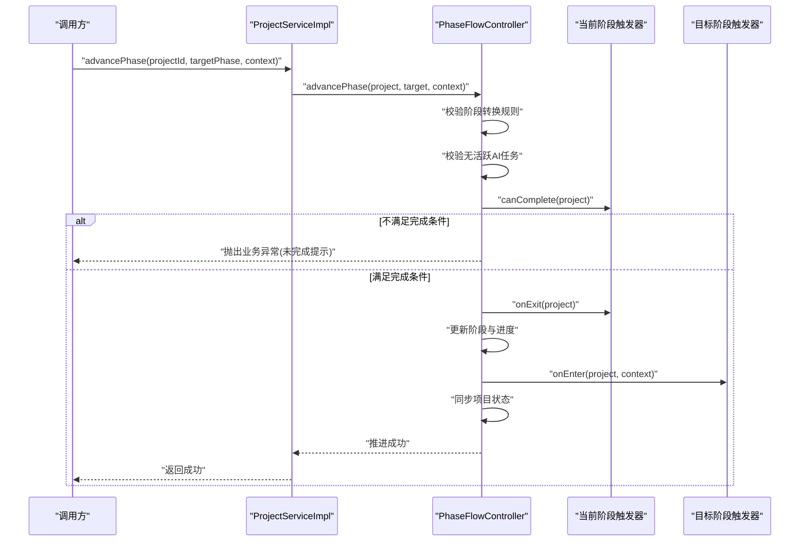
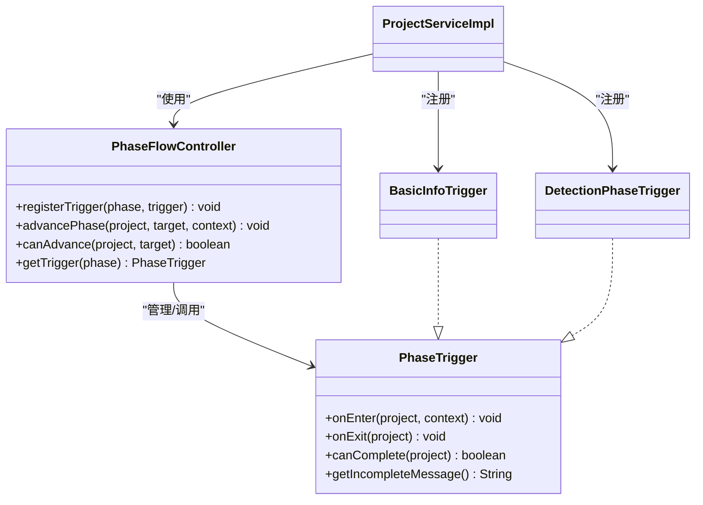

# 触发器接口规范

<cite>
**本文引用的文件列表**
- [PhaseTrigger.java](file://ele-ai-tender-system/ele-ai-tender-core/src/main/java/com/jy/eleaitender/core/statemachine/PhaseTrigger.java)
- [PhaseFlowController.java](file://ele-ai-tender-system/ele-ai-tender-core/src/main/java/com/jy/eleaitender/core/statemachine/PhaseFlowController.java)
- [BasicInfoTrigger.java](file://ele-ai-tender-system/ele-ai-tender-core/src/main/java/com/jy/eleaitender/core/statemachine/trigger/BasicInfoTrigger.java)
- [DetectionPhaseTrigger.java](file://ele-ai-tender-system/ele-ai-tender-core/src/main/java/com/jy/eleaitender/core/statemachine/trigger/DetectionPhaseTrigger.java)
- [ProjectServiceImpl.java](file://ele-ai-tender-system/ele-ai-tender-core/src/main/java/com/jy/eleaitender/core/service/impl/ProjectServiceImpl.java)
- [PHASE_FLOW_SPEC.md](file://docs/rules/PHASE_FLOW_SPEC.md)
</cite>

## 目录
1. [简介](#简介)
2. [项目结构](#项目结构)
3. [核心组件](#核心组件)
4. [架构总览](#架构总览)
5. [详细组件分析](#详细组件分析)
6. [依赖关系分析](#依赖关系分析)
7. [性能与可观测性](#性能与可观测性)
8. [故障排查指南](#故障排查指南)
9. [结论](#结论)
10. [附录：自定义触发器开发示例](#附录自定义触发器开发示例)

## 简介
本规范聚焦于“阶段触发器”机制，围绕 PhaseTrigger 接口及其执行上下文 Context，系统阐述触发器的生命周期、注册与发现机制、异常处理策略、以及与状态机联动的整体流程。文档同时提供最佳实践与实现示例路径，帮助开发者快速构建符合规范的自定义触发器。

## 项目结构
触发器相关代码位于 core 模块的 statemachine 包下，包含接口定义、控制器以及若干阶段触发器实现；触发器在业务服务启动时统一注册到控制器中。

图表来源
- [PhaseTrigger.java:1-40](file://ele-ai-tender-system/ele-ai-tender-core/src/main/java/com/jy/eleaitender/core/statemachine/PhaseTrigger.java#L1-L40)
- [PhaseFlowController.java:1-176](file://ele-ai-tender-system/ele-ai-tender-core/src/main/java/com/jy/eleaitender/core/statemachine/PhaseFlowController.java#L1-L176)
- [BasicInfoTrigger.java:1-28](file://ele-ai-tender-system/ele-ai-tender-core/src/main/java/com/jy/eleaitender/core/statemachine/trigger/BasicInfoTrigger.java#L1-L28)
- [DetectionPhaseTrigger.java:1-71](file://ele-ai-tender-system/ele-ai-tender-core/src/main/java/com/jy/eleaitender/core/statemachine/trigger/DetectionPhaseTrigger.java#L1-L71)
- [ProjectServiceImpl.java:70-82](file://ele-ai-tender-system/ele-ai-tender-core/src/main/java/com/jy/eleaitender/core/service/impl/ProjectServiceImpl.java#L70-L82)

章节来源
- [PhaseTrigger.java:1-40](file://ele-ai-tender-system/ele-ai-tender-core/src/main/java/com/jy/eleaitender/core/statemachine/PhaseTrigger.java#L1-L40)
- [PhaseFlowController.java:1-176](file://ele-ai-tender-system/ele-ai-tender-core/src/main/java/com/jy/eleaitender/core/statemachine/PhaseFlowController.java#L1-L176)
- [BasicInfoTrigger.java:1-28](file://ele-ai-tender-system/ele-ai-tender-core/src/main/java/com/jy/eleaitender/core/statemachine/trigger/BasicInfoTrigger.java#L1-L28)
- [DetectionPhaseTrigger.java:1-71](file://ele-ai-tender-system/ele-ai-tender-core/src/main/java/com/jy/eleaitender/core/statemachine/trigger/DetectionPhaseTrigger.java#L1-L71)
- [ProjectServiceImpl.java:70-82](file://ele-ai-tender-system/ele-ai-tender-core/src/main/java/com/jy/eleaitender/core/service/impl/ProjectServiceImpl.java#L70-L82)

## 核心组件
- PhaseTrigger 接口：定义进入/离开阶段与完成校验能力，并提供默认空实现以降低扩展成本。
- PhaseFlowController：负责阶段推进编排、触发器注册、转换规则校验、与项目状态联动。
- 具体触发器实现：如 BasicInfoTrigger（基础信息完整性校验）、DetectionPhaseTrigger（进入检测阶段自动提交检测任务）。
- ProjectServiceImpl：在服务初始化阶段将各阶段触发器注册至控制器，并对外暴露 advancePhase 方法驱动阶段流转。

章节来源
- [PhaseTrigger.java:1-40](file://ele-ai-tender-system/ele-ai-tender-core/src/main/java/com/jy/eleaitender/core/statemachine/PhaseTrigger.java#L1-L40)
- [PhaseFlowController.java:41-96](file://ele-ai-tender-system/ele-ai-tender-core/src/main/java/com/jy/eleaitender/core/statemachine/PhaseFlowController.java#L41-L96)
- [BasicInfoTrigger.java:1-28](file://ele-ai-tender-system/ele-ai-tender-core/src/main/java/com/jy/eleaitender/core/statemachine/trigger/BasicInfoTrigger.java#L1-L28)
- [DetectionPhaseTrigger.java:1-71](file://ele-ai-tender-system/ele-ai-tender-core/src/main/java/com/jy/eleaitender/core/statemachine/trigger/DetectionPhaseTrigger.java#L1-L71)
- [ProjectServiceImpl.java:70-82](file://ele-ai-tender-system/ele-ai-tender-core/src/main/java/com/jy/eleaitender/core/service/impl/ProjectServiceImpl.java#L70-L82)

## 架构总览
阶段推进的整体时序如下：调用方通过服务层发起推进请求，控制器进行合法性校验与前置检查，依次执行当前阶段的 onExit 和目标阶段的 onEnter，最后同步更新项目状态。

图表来源
- [PhaseFlowController.java:57-96](file://ele-ai-tender-system/ele-ai-tender-core/src/main/java/com/jy/eleaitender/core/statemachine/PhaseFlowController.java#L57-L96)
- [ProjectServiceImpl.java:234-239](file://ele-ai-tender-system/ele-ai-tender-core/src/main/java/com/jy/eleaitender/core/service/impl/ProjectServiceImpl.java#L234-L239)

章节来源
- [PhaseFlowController.java:57-96](file://ele-ai-tender-system/ele-ai-tender-core/src/main/java/com/jy/eleaitender/core/statemachine/PhaseFlowController.java#L57-L96)
- [ProjectServiceImpl.java:234-239](file://ele-ai-tender-system/ele-ai-tender-core/src/main/java/com/jy/eleaitender/core/service/impl/ProjectServiceImpl.java#L234-L239)

## 详细组件分析

### PhaseTrigger 接口
- 设计要点
  - onEnter(project, context)：进入阶段时的钩子，支持从 context 读取运行时数据（例如政策文件ID列表），可用于自动发起异步任务等。
  - onExit(project)：离开阶段时的钩子，用于收尾逻辑。
  - canComplete(project)：强制实现的完成校验，返回是否允许推进到下一阶段。
  - getIncompleteMessage()：未满足完成条件时的用户提示文案。
- 参数与返回值
  - project：项目实体，承载阶段、状态等业务主数据。
  - context：Map<String, Object>，当前仅 DETECTION 阶段使用 policyFileIds 键传递数据。
  - 返回值：boolean 表示是否可以完成；String 为提示信息。
- 异常处理
  - 接口本身不抛受检异常；建议触发器内部对可能失败的远程调用或外部依赖进行 try-catch 包裹，避免阻塞阶段推进。
- 生命周期管理
  - 由 PhaseFlowController 在 advancePhase 过程中统一调度：先 onExit 再 onEnter，随后同步状态。

章节来源
- [PhaseTrigger.java:11-39](file://ele-ai-tender-system/ele-ai-tender-core/src/main/java/com/jy/eleaitender/core/statemachine/PhaseTrigger.java#L11-L39)
- [PHASE_FLOW_SPEC.md:153-156](file://docs/rules/PHASE_FLOW_SPEC.md#L153-L156)

### PhaseFlowController 控制器
- 职责
  - 维护阶段到触发器的映射，提供 registerTrigger 注册方法。
  - 编排阶段推进流程：转换规则校验、活跃任务检查、onExit/onEnter 执行、状态同步。
  - 提供 canAdvance 预检查与 getTrigger 查询。
- 关键流程
  - validateTransition：仅允许顺序推进到下一阶段。
  - syncProjectStatus：根据目标阶段与当前状态进行联动更新，特殊处理检测阶段的状态流转。
- 错误处理
  - 非法跳转或缺失阶段信息时抛出业务异常，携带明确错误码与消息。

章节来源
- [PhaseFlowController.java:41-96](file://ele-ai-tender-system/ele-ai-tender-core/src/main/java/com/jy/eleaitender/core/statemachine/PhaseFlowController.java#L41-L96)
- [PhaseFlowController.java:113-126](file://ele-ai-tender-system/ele-ai-tender-core/src/main/java/com/jy/eleaitender/core/statemachine/PhaseFlowController.java#L113-L126)
- [PhaseFlowController.java:134-167](file://ele-ai-tender-system/ele-ai-tender-core/src/main/java/com/jy/eleaitender/core/statemachine/PhaseFlowController.java#L134-L167)

### BasicInfoTrigger 基础信息触发器
- 功能
  - 校验项目名称、类别、类型是否为非空，作为基础信息阶段完成的必要条件。
- 行为
  - canComplete 返回布尔值；getIncompleteMessage 给出明确的补全提示。

章节来源
- [BasicInfoTrigger.java:16-26](file://ele-ai-tender-system/ele-ai-tender-core/src/main/java/com/jy/eleaitender/core/statemachine/trigger/BasicInfoTrigger.java#L16-L26)

### DetectionPhaseTrigger 智能检测触发器
- 功能
  - 进入检测阶段时，从 context 提取 policyFileIds，构造提交请求并调用检测服务提交任务。
  - 完成条件：项目状态为“检测通过”或“跳过检测”。
- 容错
  - 提交失败仅记录警告日志，不阻断阶段推进；前端可通过轮询任务状态获取结果。
- 上下文约定
  - context.policyFileIds：Long 列表，元素可为 Number 或字符串数字，需做安全转换。

章节来源
- [DetectionPhaseTrigger.java:27-57](file://ele-ai-tender-system/ele-ai-tender-core/src/main/java/com/jy/eleaitender/core/statemachine/trigger/DetectionPhaseTrigger.java#L27-L57)
- [DetectionPhaseTrigger.java:59-69](file://ele-ai-tender-system/ele-ai-tender-core/src/main/java/com/jy/eleaitender/core/statemachine/trigger/DetectionPhaseTrigger.java#L59-L69)
- [PHASE_FLOW_SPEC.md:173-183](file://docs/rules/PHASE_FLOW_SPEC.md#L173-L183)

### 触发器注册与 Spring 容器集成
- 注册方式
  - 在 ProjectServiceImpl 的 @PostConstruct 初始化方法中，显式调用 phaseFlowController.registerTrigger 将各阶段触发器注册到控制器。
- 自动发现
  - 触发器类标注 @Component，交由 Spring 容器扫描装配；注册动作在服务启动后集中完成，便于统一管理。
- 循环依赖规避
  - 若触发器注入的业务 Service 反向依赖 IProjectService，需在相应注入点使用 @Lazy 延迟加载，避免启动期循环依赖。

章节来源
- [ProjectServiceImpl.java:75-82](file://ele-ai-tender-system/ele-ai-tender-core/src/main/java/com/jy/eleaitender/core/service/impl/ProjectServiceImpl.java#L75-L82)
- [PHASE_FLOW_SPEC.md:165-171](file://docs/rules/PHASE_FLOW_SPEC.md#L165-L171)

## 依赖关系分析
- 组件耦合
  - PhaseFlowController 依赖触发器集合与 AI 任务服务，用于前置检查与状态联动。
  - 触发器实现依赖各自业务服务（如 IDetectionService），并通过 Map 上下文接收外部传入数据。
- 直接依赖
  - ProjectServiceImpl 持有 PhaseFlowController 与各触发器实例，并在初始化阶段完成注册。
- 潜在风险
  - 触发器内强依赖外部服务时需注意超时与重试策略；建议在 onEnter 中采用 try-catch 隔离异常，保证阶段推进的幂等性与鲁棒性。

图表来源
- [PhaseTrigger.java:11-39](file://ele-ai-tender-system/ele-ai-tender-core/src/main/java/com/jy/eleaitender/core/statemachine/PhaseTrigger.java#L11-L39)
- [PhaseFlowController.java:41-96](file://ele-ai-tender-system/ele-ai-tender-core/src/main/java/com/jy/eleaitender/core/statemachine/PhaseFlowController.java#L41-L96)
- [BasicInfoTrigger.java:13-27](file://ele-ai-tender-system/ele-ai-tender-core/src/main/java/com/jy/eleaitender/core/statemachine/trigger/BasicInfoTrigger.java#L13-L27)
- [DetectionPhaseTrigger.java:20-70](file://ele-ai-tender-system/ele-ai-tender-core/src/main/java/com/jy/eleaitender/core/statemachine/trigger/DetectionPhaseTrigger.java#L20-L70)
- [ProjectServiceImpl.java:75-82](file://ele-ai-tender-system/ele-ai-tender-core/src/main/java/com/jy/eleaitender/core/service/impl/ProjectServiceImpl.java#L75-L82)

章节来源
- [PhaseFlowController.java:41-96](file://ele-ai-tender-system/ele-ai-tender-core/src/main/java/com/jy/eleaitender/core/statemachine/PhaseFlowController.java#L41-L96)
- [ProjectServiceImpl.java:75-82](file://ele-ai-tender-system/ele-ai-tender-core/src/main/java/com/jy/eleaitender/core/service/impl/ProjectServiceImpl.java#L75-L82)

## 性能与可观测性
- 性能考虑
  - onEnter 中的外部调用应设置合理超时与重试上限，避免阻塞阶段推进。
  - 对于批量数据处理，建议使用线程池或异步任务，减少同步等待时间。
- 可观测性
  - 在触发器关键路径添加结构化日志（包含 projectId、阶段名、关键参数摘要），便于问题定位。
  - 结合现有日志配置输出告警级别日志，区分正常信息与异常场景。

[本节为通用指导，无需源码引用]

## 故障排查指南
- 常见错误
  - 非法阶段跳转：控制器会抛出业务异常，提示不允许跳跃或倒退。
  - 存在活跃 AI 任务：控制器拒绝推进，需等待任务完成或取消。
  - 未完成当前阶段：触发器 canComplete 返回 false 时，返回对应提示信息。
- 排查步骤
  - 确认当前阶段与目标阶段是否符合顺序推进规则。
  - 检查是否存在未完成的 AI 任务。
  - 查看触发器日志，确认 onEnter/onExit 执行情况与异常堆栈。
  - 核对 context 字段是否正确传递（如 policyFileIds）。

章节来源
- [PhaseFlowController.java:57-96](file://ele-ai-tender-system/ele-ai-tender-core/src/main/java/com/jy/eleaitender/core/statemachine/PhaseFlowController.java#L57-L96)
- [PHASE_FLOW_SPEC.md:160-191](file://docs/rules/PHASE_FLOW_SPEC.md#L160-L191)

## 结论
PhaseTrigger 以最小侵入的方式为每个编制阶段提供了可扩展的生命周期钩子，配合 PhaseFlowController 的统一编排与状态联动，实现了清晰、可控的阶段推进流程。通过 Spring 容器装配与显式注册，开发者可以便捷地扩展新的阶段行为，同时遵循异常隔离与日志规范，确保系统的稳定性与可观测性。

[本节为总结性内容，无需源码引用]

## 附录：自定义触发器开发示例
以下示例展示如何创建一个符合规范的自定义触发器，包括注解、方法实现与注册方式。为避免泄露实现细节，此处仅提供路径参考。

- 创建触发器类
  - 实现 PhaseTrigger 接口，按需覆盖 onEnter/onExit/canComplete/getIncompleteMessage。
  - 使用 @Component 注解以便被 Spring 容器发现。
  - 参考路径：[DetectionPhaseTrigger.java:20-70](file://ele-ai-tender-system/ele-ai-tender-core/src/main/java/com/jy/eleaitender/core/statemachine/trigger/DetectionPhaseTrigger.java#L20-L70)

- 注册触发器
  - 在 ProjectServiceImpl 的 @PostConstruct 初始化方法中，调用 phaseFlowController.registerTrigger 将新触发器注册到对应阶段。
  - 参考路径：[ProjectServiceImpl.java:75-82](file://ele-ai-tender-system/ele-ai-tender-core/src/main/java/com/jy/eleaitender/core/service/impl/ProjectServiceImpl.java#L75-L82)

- 上下文使用
  - 如需在 onEnter 中读取外部数据，请约定 context 的键名与类型，并进行安全转换。
  - 参考路径：[DetectionPhaseTrigger.java:27-57](file://ele-ai-tender-system/ele-ai-tender-core/src/main/java/com/jy/eleaitender/core/statemachine/trigger/DetectionPhaseTrigger.java#L27-L57)

- 错误处理与日志
  - 对可能失败的外部调用进行 try-catch 包裹，记录 warn 级别日志，不阻断阶段推进。
  - 参考路径：[DetectionPhaseTrigger.java:49-57](file://ele-ai-tender-system/ele-ai-tender-core/src/main/java/com/jy/eleaitender/core/statemachine/trigger/DetectionPhaseTrigger.java#L49-L57)

章节来源
- [DetectionPhaseTrigger.java:20-70](file://ele-ai-tender-system/ele-ai-tender-core/src/main/java/com/jy/eleaitender/core/statemachine/trigger/DetectionPhaseTrigger.java#L20-L70)
- [ProjectServiceImpl.java:75-82](file://ele-ai-tender-system/ele-ai-tender-core/src/main/java/com/jy/eleaitender/core/service/impl/ProjectServiceImpl.java#L75-L82)