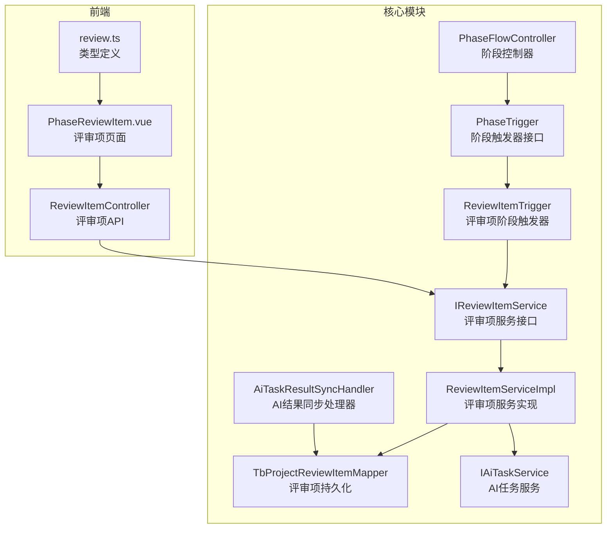
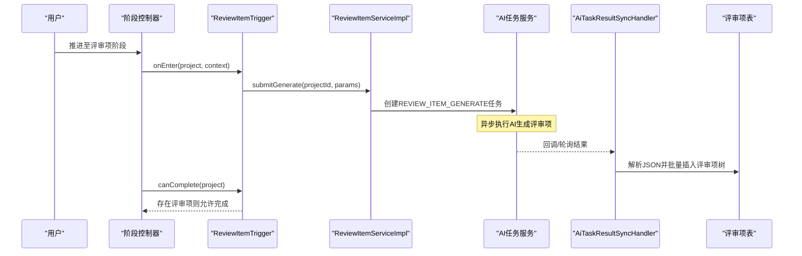
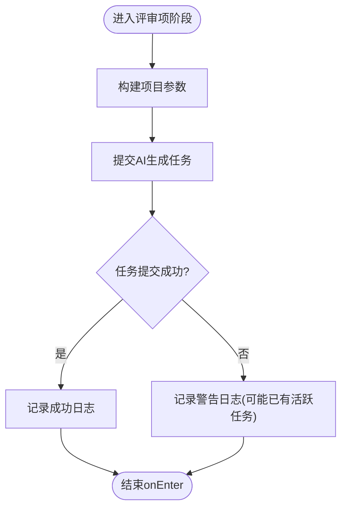
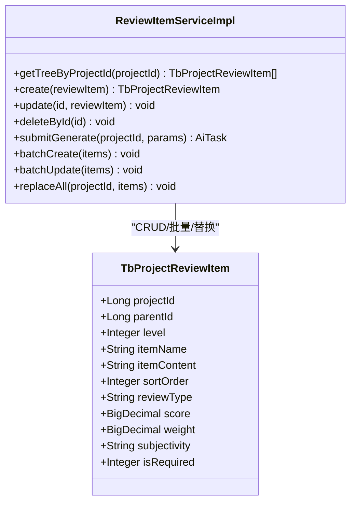
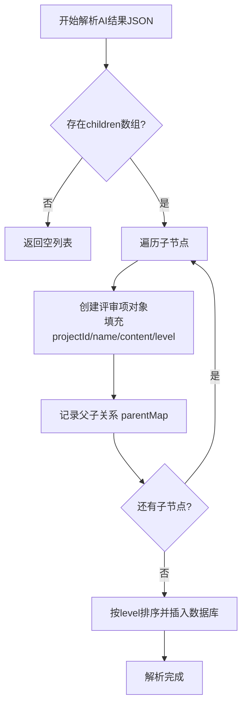
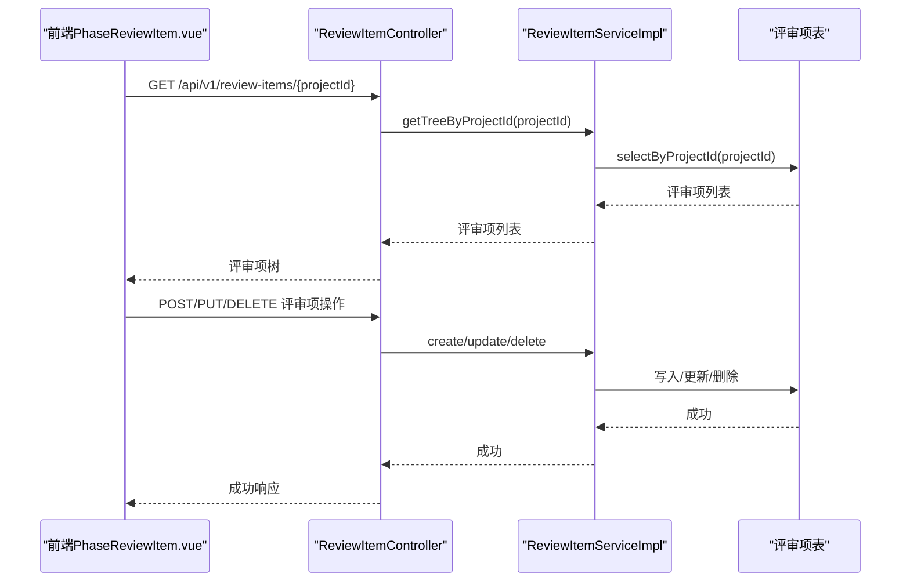
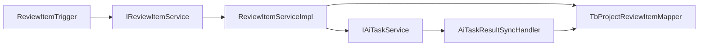

# 评审项阶段触发器

<cite>
**本文引用的文件**
- [ReviewItemTrigger.java](file://ele-ai-tender-system/ele-ai-tender-core/src/main/java/com/jy/eleaitender/core/statemachine/trigger/ReviewItemTrigger.java)
- [PhaseTrigger.java](file://ele-ai-tender-system/ele-ai-tender-core/src/main/java/com/jy/eleaitender/core/statemachine/PhaseTrigger.java)
- [IReviewItemService.java](file://ele-ai-tender-system/ele-ai-tender-core/src/main/java/com/jy/eleaitender/core/service/IReviewItemService.java)
- [ReviewItemServiceImpl.java](file://ele-ai-tender-system/ele-ai-tender-core/src/main/java/com/jy/eleaitender/core/service/impl/ReviewItemServiceImpl.java)
- [TbProjectReviewItem.java](file://ele-ai-tender-system/ele-ai-tender-common/src/main/java/com/jy/eleaitender/common/entity/core/TbProjectReviewItem.java)
- [AiTaskResultSyncHandler.java](file://ele-ai-tender-system/ele-ai-tender-core/src/main/java/com/jy/eleaitender/core/scheduler/AiTaskResultSyncHandler.java)
- [PHASE_FLOW_SPEC.md](file://docs/rules/PHASE_FLOW_SPEC.md)
- [ReviewItemController.java](file://ele-ai-tender-system/ele-ai-tender-core/src/main/java/com/jy/eleaitender/core/controller/ReviewItemController.java)
- [review.ts](file://ele-ai-tender-frontend/src/types/review.ts)
- [PhaseReviewItem.vue](file://ele-ai-tender-frontend/src/views/project/phases/PhaseReviewItem.vue)
</cite>

## 目录
1. [简介](#简介)
2. [项目结构](#项目结构)
3. [核心组件](#核心组件)
4. [架构总览](#架构总览)
5. [详细组件分析](#详细组件分析)
6. [依赖关系分析](#依赖关系分析)
7. [性能与可靠性](#性能与可靠性)
8. [故障排查指南](#故障排查指南)
9. [结论](#结论)
10. [附录：接口与数据模型](#附录接口与数据模型)

## 简介
本技术文档围绕“评审项阶段触发器”展开，聚焦 ReviewItemTrigger 的业务逻辑与状态流转。内容覆盖评审项的创建、分配、审核、归档等完整流程；详细说明评审工作流的状态管理策略，确保评审流程的正确性与完整性；解释与用户权限系统的集成方式，实现基于角色的评审权限控制；并提供评审结果的统计与分析能力（通过率、耗时、质量评估）的实现建议与落地路径。文末包含关键代码片段的路径引用，便于快速定位实现细节。

## 项目结构
评审项阶段触发器位于核心模块的核心服务层与状态机触发器层之间，向上承接阶段控制器，向下对接评审项服务与AI任务系统，最终由调度器将AI结果落库为评审项树。

图表来源
- [ReviewItemTrigger.java:1-68](file://ele-ai-tender-system/ele-ai-tender-core/src/main/java/com/jy/eleaitender/core/statemachine/trigger/ReviewItemTrigger.java#L1-L68)
- [PhaseTrigger.java:11-39](file://ele-ai-tender-system/ele-ai-tender-core/src/main/java/com/jy/eleaitender/core/statemachine/PhaseTrigger.java#L11-L39)
- [IReviewItemService.java:12-53](file://ele-ai-tender-system/ele-ai-tender-core/src/main/java/com/jy/eleaitender/core/service/IReviewItemService.java#L12-L53)
- [ReviewItemServiceImpl.java:1-276](file://ele-ai-tender-system/ele-ai-tender-core/src/main/java/com/jy/eleaitender/core/service/impl/ReviewItemServiceImpl.java#L1-L276)
- [AiTaskResultSyncHandler.java:464-495](file://ele-ai-tender-system/ele-ai-tender-core/src/main/java/com/jy/eleaitender/core/scheduler/AiTaskResultSyncHandler.java#L464-L495)
- [ReviewItemController.java:1-41](file://ele-ai-tender-system/ele-ai-tender-core/src/main/java/com/jy/eleaitender/core/controller/ReviewItemController.java#L1-L41)
- [review.ts:1-43](file://ele-ai-tender-frontend/src/types/review.ts#L1-L43)
- [PhaseReviewItem.vue:138-765](file://ele-ai-tender-frontend/src/views/project/phases/PhaseReviewItem.vue#L138-L765)

章节来源
- [PHASE_FLOW_SPEC.md:1-35](file://docs/rules/PHASE_FLOW_SPEC.md#L1-L35)

## 核心组件
- 评审项阶段触发器 ReviewItemTrigger：在评审项阶段进入时自动提交AI生成评审项任务，并校验当前阶段是否可以完成。
- 评审项服务 IReviewItemService/ReviewItemServiceImpl：提供评审项CRUD、批量操作、替换全部、以及提交AI生成任务的能力。
- AI任务与结果同步：通过AI任务异步生成评审项，再由结果同步处理器解析JSON并落库为评审项树。
- 评审项实体 TbProjectReviewItem：描述评审项的层级、名称、内容、评分、权重、主客观属性、是否必审等。
- 前端交互：评审项页面负责展示、编辑、校验与确认评审项，并通过API与服务端交互。

章节来源
- [ReviewItemTrigger.java:23-67](file://ele-ai-tender-system/ele-ai-tender-core/src/main/java/com/jy/eleaitender/core/statemachine/trigger/ReviewItemTrigger.java#L23-L67)
- [IReviewItemService.java:12-53](file://ele-ai-tender-system/ele-ai-tender-core/src/main/java/com/jy/eleaitender/core/service/IReviewItemService.java#L12-L53)
- [ReviewItemServiceImpl.java:33-170](file://ele-ai-tender-system/ele-ai-tender-core/src/main/java/com/jy/eleaitender/core/service/impl/ReviewItemServiceImpl.java#L33-L170)
- [TbProjectReviewItem.java:16-66](file://ele-ai-tender-system/ele-ai-tender-common/src/main/java/com/jy/eleaitender/common/entity/core/TbProjectReviewItem.java#L16-L66)
- [PhaseReviewItem.vue:138-765](file://ele-ai-tender-frontend/src/views/project/phases/PhaseReviewItem.vue#L138-L765)

## 架构总览
评审项阶段的整体流程如下：
- 阶段推进到“评审项设置”时，触发 ReviewItemTrigger.onEnter，构建项目上下文参数并提交AI生成任务。
- ReviewItemServiceImpl.submitGenerate 组装生成参数（项目名称、类型、类别、预算、评审方式、需求内容、模板配置），调用AI任务服务创建异步任务。
- AI完成后，AiTaskResultSyncHandler 解析评审项JSON，递归构建父子关系并按层级顺序入库。
- 前端可拉取评审项树进行编辑与确认，确认后推进下一阶段。

图表来源
- [ReviewItemTrigger.java:36-67](file://ele-ai-tender-system/ele-ai-tender-core/src/main/java/com/jy/eleaitender/core/statemachine/trigger/ReviewItemTrigger.java#L36-L67)
- [ReviewItemServiceImpl.java:138-170](file://ele-ai-tender-system/ele-ai-tender-core/src/main/java/com/jy/eleaitender/core/service/impl/ReviewItemServiceImpl.java#L138-L170)
- [AiTaskResultSyncHandler.java:464-495](file://ele-ai-tender-system/ele-ai-tender-core/src/main/java/com/jy/eleaitender/core/scheduler/AiTaskResultSyncHandler.java#L464-L495)

## 详细组件分析

### 评审项阶段触发器 ReviewItemTrigger
- 进入阶段行为 onEnter：
  - 从项目实体中抽取必要信息（项目ID、名称、类型、类别、预算、评审方式、需求内容）。
  - 调用评审项服务提交AI生成任务，记录日志；异常情况下以警告日志输出，避免阻塞阶段推进。
- 完成条件 canComplete：
  - 查询该项目下是否存在评审项记录，若存在则允许完成阶段。
- 未完成提示 getIncompleteMessage：
  - 返回“请先设置评审项”，用于前端提示。

图表来源
- [ReviewItemTrigger.java:36-67](file://ele-ai-tender-system/ele-ai-tender-core/src/main/java/com/jy/eleaitender/core/statemachine/trigger/ReviewItemTrigger.java#L36-L67)

章节来源
- [ReviewItemTrigger.java:23-67](file://ele-ai-tender-system/ele-ai-tender-core/src/main/java/com/jy/eleaitender/core/statemachine/trigger/ReviewItemTrigger.java#L23-L67)
- [PhaseTrigger.java:11-39](file://ele-ai-tender-system/ele-ai-tender-core/src/main/java/com/jy/eleaitender/core/statemachine/PhaseTrigger.java#L11-L39)
- [PHASE_FLOW_SPEC.md:27-35](file://docs/rules/PHASE_FLOW_SPEC.md#L27-L35)

### 评审项服务 ReviewItemServiceImpl
- 评审项树获取 getTreeByProjectId：
  - 校验项目归属后返回扁平列表，前端按评审类型分组显示。
- 创建评审项 create：
  - 校验项目归属；根据父项自动计算层级，限制最大层级为3；子项继承父项评审类型；未指定排序号时默认0。
- 更新/删除 update/deleteById：
  - 校验项目归属；删除时级联删除所有子项。
- 提交AI生成 submitGenerate：
  - 读取项目与模板配置，组装生成参数，创建AI任务（类型为REVIEW_ITEM_GENERATE）。
- 批量操作 batchCreate/batchUpdate/replaceAll：
  - 批量插入/更新；替换全部时先清空现有评审项，再按层级顺序插入，维护父子映射与排序号。

图表来源
- [ReviewItemServiceImpl.java:49-276](file://ele-ai-tender-system/ele-ai-tender-core/src/main/java/com/jy/eleaitender/core/service/impl/ReviewItemServiceImpl.java#L49-L276)
- [TbProjectReviewItem.java:16-66](file://ele-ai-tender-system/ele-ai-tender-common/src/main/java/com/jy/eleaitender/common/entity/core/TbProjectReviewItem.java#L16-L66)

章节来源
- [ReviewItemServiceImpl.java:49-276](file://ele-ai-tender-system/ele-ai-tender-core/src/main/java/com/jy/eleaitender/core/service/impl/ReviewItemServiceImpl.java#L49-L276)
- [TbProjectReviewItem.java:16-66](file://ele-ai-tender-system/ele-ai-tender-common/src/main/java/com/jy/eleaitender/common/entity/core/TbProjectReviewItem.java#L16-L66)

### AI结果同步与评审项树构建
- 解析评审项JSON：
  - 递归解析children节点，记录父子关系，按level排序确保父节点先入库获得ID。
- 落库策略：
  - 使用parentMap记录父子关系，插入时按level升序，保证层级正确性。

图表来源
- [AiTaskResultSyncHandler.java:464-495](file://ele-ai-tender-system/ele-ai-tender-core/src/main/java/com/jy/eleaitender/core/scheduler/AiTaskResultSyncHandler.java#L464-L495)

章节来源
- [AiTaskResultSyncHandler.java:464-495](file://ele-ai-tender-system/ele-ai-tender-core/src/main/java/com/jy/eleaitender/core/scheduler/AiTaskResultSyncHandler.java#L464-L495)

### 前端评审项交互与校验
- 评审项树展示与编辑：
  - 支持添加子项、删除项、编辑内容与分值/权重/主客观属性。
- 校验规则：
  - 层级不超过3级；权重模式下要求各类别权重合计为100%，内部分值合计也为100%。
- 确认评审项：
  - 通过后推进至下一阶段。

图表来源
- [ReviewItemController.java:1-41](file://ele-ai-tender-system/ele-ai-tender-core/src/main/java/com/jy/eleaitender/core/controller/ReviewItemController.java#L1-L41)
- [ReviewItemServiceImpl.java:49-121](file://ele-ai-tender-system/ele-ai-tender-core/src/main/java/com/jy/eleaitender/core/service/impl/ReviewItemServiceImpl.java#L49-L121)
- [PhaseReviewItem.vue:138-765](file://ele-ai-tender-frontend/src/views/project/phases/PhaseReviewItem.vue#L138-L765)

章节来源
- [ReviewItemController.java:1-41](file://ele-ai-tender-system/ele-ai-tender-core/src/main/java/com/jy/eleaitender/core/controller/ReviewItemController.java#L1-L41)
- [PhaseReviewItem.vue:138-765](file://ele-ai-tender-frontend/src/views/project/phases/PhaseReviewItem.vue#L138-L765)
- [review.ts:1-43](file://ele-ai-tender-frontend/src/types/review.ts#L1-L43)

## 依赖关系分析
- 组件耦合与内聚：
  - ReviewItemTrigger 仅依赖评审项服务与Mapper，职责单一，内聚度高。
  - ReviewItemServiceImpl 聚合了评审项业务逻辑与AI任务创建，保持高内聚。
- 直接/间接依赖：
  - 触发器 → 服务 → Mapper/AiTaskService → 调度器 → 数据库。
- 外部依赖与集成点：
  - AI任务服务（异步生成）、模板服务（读取评审项配置）、数据库（评审项表）。
- 循环依赖检查：
  - 未发现循环依赖；触发器不反向依赖服务实现，符合分层设计。

图表来源
- [ReviewItemTrigger.java:23-67](file://ele-ai-tender-system/ele-ai-tender-core/src/main/java/com/jy/eleaitender/core/statemachine/trigger/ReviewItemTrigger.java#L23-L67)
- [ReviewItemServiceImpl.java:33-170](file://ele-ai-tender-system/ele-ai-tender-core/src/main/java/com/jy/eleaitender/core/service/impl/ReviewItemServiceImpl.java#L33-L170)
- [AiTaskResultSyncHandler.java:464-495](file://ele-ai-tender-system/ele-ai-tender-core/src/main/java/com/jy/eleaitender/core/scheduler/AiTaskResultSyncHandler.java#L464-L495)

章节来源
- [ReviewItemTrigger.java:23-67](file://ele-ai-tender-system/ele-ai-tender-core/src/main/java/com/jy/eleaitender/core/statemachine/trigger/ReviewItemTrigger.java#L23-L67)
- [ReviewItemServiceImpl.java:33-170](file://ele-ai-tender-system/ele-ai-tender-core/src/main/java/com/jy/eleaitender/core/service/impl/ReviewItemServiceImpl.java#L33-L170)

## 性能与可靠性
- 异步生成与幂等性：
  - 评审项生成采用AI任务异步模式，避免阻塞阶段推进；重复触发时以警告日志提示，防止并发冲突。
- 事务与一致性：
  - 评审项CRUD与批量操作使用事务注解，确保数据一致性；替换全部时先清空再插入，保证原子性。
- 层级与排序：
  - 最大层级限制为3，避免过深树结构影响渲染与查询性能；插入前按level排序，确保父子关系正确。
- 前端校验：
  - 权重模式下的合计校验在前端提前拦截，减少无效请求。

[本节为通用性能指导，无需具体文件分析]

## 故障排查指南
- 常见问题与处理：
  - 评审项未生成：检查AI任务是否创建成功，查看AiTaskResultSyncHandler解析日志。
  - 评审项缺失或层级错误：确认AI返回JSON结构是否符合预期，检查parseChildren递归逻辑。
  - 无法完成阶段：确认canComplete查询是否有评审项记录。
  - 权限问题：确认接口是否加@RequireLogin，JWT是否有效。
- 定位方法：
  - 查看触发器onEnter日志与异常堆栈。
  - 核对评审项服务的事务回滚情况。
  - 检查前端校验失败提示信息。

章节来源
- [ReviewItemTrigger.java:48-54](file://ele-ai-tender-system/ele-ai-tender-core/src/main/java/com/jy/eleaitender/core/statemachine/trigger/ReviewItemTrigger.java#L48-L54)
- [ReviewItemServiceImpl.java:58-121](file://ele-ai-tender-system/ele-ai-tender-core/src/main/java/com/jy/eleaitender/core/service/impl/ReviewItemServiceImpl.java#L58-L121)
- [ReviewItemController.java:27-41](file://ele-ai-tender-system/ele-ai-tender-core/src/main/java/com/jy/eleaitender/core/controller/ReviewItemController.java#L27-L41)

## 结论
评审项阶段触发器通过简洁的onEnter逻辑与严格的canComplete校验，确保了评审项生成的自动化与阶段推进的完整性。配合评审项服务的健壮CRUD与AI任务异步机制，系统在易用性与可靠性方面达到良好平衡。后续可在统计分析与权限细化方面进一步增强，以提升评审质量与管控力度。

[本节为总结性内容，无需具体文件分析]

## 附录：接口与数据模型
- 评审项API（示例）：
  - 创建评审项：POST /api/v1/review-items
  - 获取评审项树：GET /api/v1/review-items/{projectId}
  - 更新评审项：PUT /api/v1/review-items/{id}
- 数据模型（关键字段）：
  - 项目ID、父级ID、层级、名称、内容、排序号、评审类型、分值、权重、主客观、是否必审。

章节来源
- [ReviewItemController.java:1-41](file://ele-ai-tender-system/ele-ai-tender-core/src/main/java/com/jy/eleaitender/core/controller/ReviewItemController.java#L1-L41)
- [TbProjectReviewItem.java:16-66](file://ele-ai-tender-system/ele-ai-tender-common/src/main/java/com/jy/eleaitender/common/entity/core/TbProjectReviewItem.java#L16-L66)