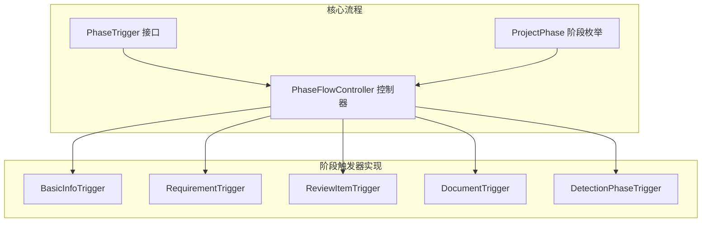
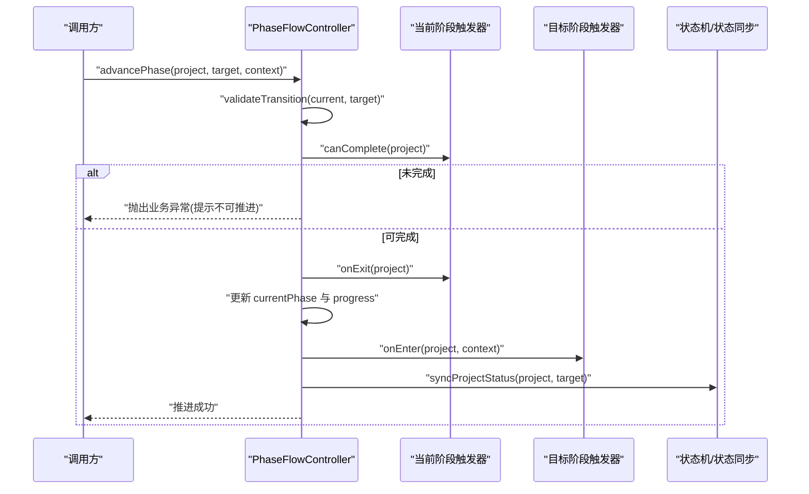
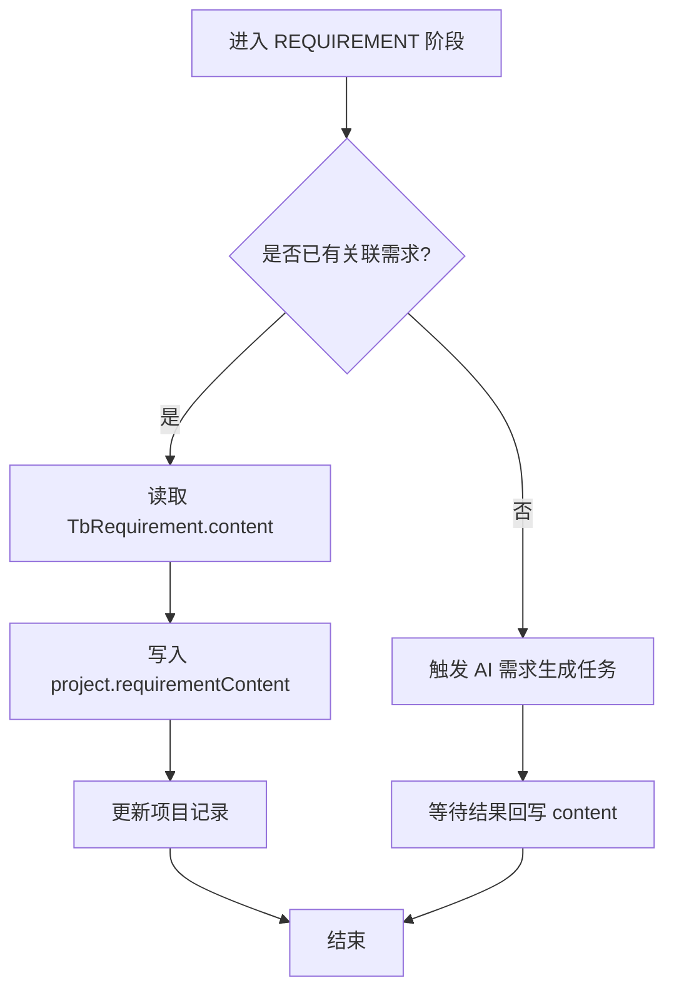
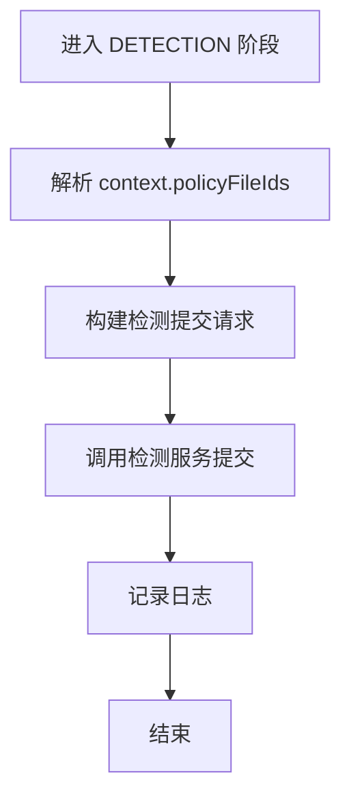
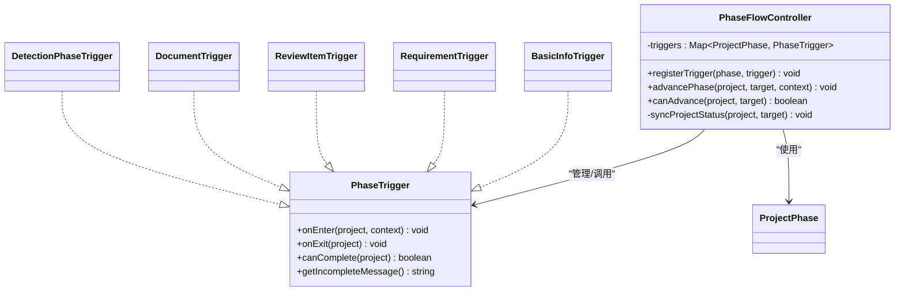

# 阶段触发器

<cite>
**本文引用的文件**   
- [PhaseTrigger.java](file://ele-ai-tender-system/ele-ai-tender-core/src/main/java/com/jy/eleaitender/core/statemachine/PhaseTrigger.java)
- [PhaseFlowController.java](file://ele-ai-tender-system/ele-ai-tender-core/src/main/java/com/jy/eleaitender/core/statemachine/PhaseFlowController.java)
- [BasicInfoTrigger.java](file://ele-ai-tender-system/ele-ai-tender-core/src/main/java/com/jy/eleaitender/core/statemachine/trigger/BasicInfoTrigger.java)
- [RequirementTrigger.java](file://ele-ai-tender-system/ele-ai-tender-core/src/main/java/com/jy/eleaitender/core/statemachine/trigger/RequirementTrigger.java)
- [ReviewItemTrigger.java](file://ele-ai-tender-system/ele-ai-tender-core/src/main/java/com/jy/eleaitender/core/statemachine/trigger/ReviewItemTrigger.java)
- [DocumentTrigger.java](file://ele-ai-tender-system/ele-ai-tender-core/src/main/java/com/jy/eleaitender/core/statemachine/trigger/DocumentTrigger.java)
- [DetectionPhaseTrigger.java](file://ele-ai-tender-system/ele-ai-tender-core/src/main/java/com/jy/eleaitender/core/statemachine/trigger/DetectionPhaseTrigger.java)
- [ProjectPhase.java](file://ele-ai-tender-system/ele-ai-tender-common/src/main/java/com/jy/eleaitender/common/enums/ProjectPhase.java)
- [PHASE_FLOW_SPEC.md](file://docs/rules/PHASE_FLOW_SPEC.md)
</cite>

## 目录
1. [引言](#引言)
2. [项目结构](#项目结构)
3. [核心组件](#核心组件)
4. [架构总览](#架构总览)
5. [详细组件分析](#详细组件分析)
6. [依赖关系分析](#依赖关系分析)
7. [性能与扩展性](#性能与扩展性)
8. [排障指南](#排障指南)
9. [结论](#结论)
10. [附录：自定义触发器开发指南](#附录自定义触发器开发指南)

## 引言
本技术文档围绕“阶段触发器系统”展开，聚焦于项目编制流程的阶段推进机制、触发器的职责边界、执行时机、异常处理与扩展方式。系统通过统一的接口定义与控制器编排，将“基础信息录入、需求生成、评审项设置、文档集成、智能检测”五个阶段的进入/离开/完成校验逻辑解耦，并以上下文参数支持跨阶段数据传递（如政策文件ID）。同时提供最佳实践与优化建议，帮助开发者快速实现新的阶段触发器并安全接入现有流程。

## 项目结构
阶段触发器相关代码位于 core 模块的 statemachine 包下，包含接口定义、流程控制器与各阶段触发器实现；阶段枚举定义在 common 模块中；规范说明见 docs/rules/PHASE_FLOW_SPEC.md。

图表来源
- [PhaseTrigger.java:1-40](file://ele-ai-tender-system/ele-ai-tender-core/src/main/java/com/jy/eleaitender/core/statemachine/PhaseTrigger.java#L1-L40)
- [PhaseFlowController.java:1-176](file://ele-ai-tender-system/ele-ai-tender-core/src/main/java/com/jy/eleaitender/core/statemachine/PhaseFlowController.java#L1-L176)
- [ProjectPhase.java:1-40](file://ele-ai-tender-system/ele-ai-tender-common/src/main/java/com/jy/eleaitender/common/enums/ProjectPhase.java#L1-L40)

章节来源
- [PHASE_FLOW_SPEC.md:58-70](file://docs/rules/PHASE_FLOW_SPEC.md#L58-L70)

## 核心组件
- PhaseTrigger 接口：定义 onEnter/onExit/canComplete 三个生命周期钩子，用于控制阶段进入、离开与完成条件。
- PhaseFlowController 控制器：管理触发器注册、阶段转换校验、onExit/onEnter 调用顺序、进度更新与状态联动。
- ProjectPhase 枚举：定义阶段编码、标签与进度百分比映射，作为阶段推进的目标与约束依据。

章节来源
- [PhaseTrigger.java:1-40](file://ele-ai-tender-system/ele-ai-tender-core/src/main/java/com/jy/eleaitender/core/statemachine/PhaseTrigger.java#L1-L40)
- [PhaseFlowController.java:24-47](file://ele-ai-tender-system/ele-ai-tender-core/src/main/java/com/jy/eleaitender/core/statemachine/PhaseFlowController.java#L24-L47)
- [ProjectPhase.java:11-40](file://ele-ai-tender-system/ele-ai-tender-common/src/main/java/com/jy/eleaitender/common/enums/ProjectPhase.java#L11-L40)

## 架构总览
阶段推进的核心流程由控制器统一编排，确保“只能顺序推进到下一阶段”，并在进入/离开阶段时执行对应触发器逻辑，最后联动项目状态。

图表来源
- [PhaseFlowController.java:57-96](file://ele-ai-tender-system/ele-ai-tender-core/src/main/java/com/jy/eleaitender/core/statemachine/PhaseFlowController.java#L57-L96)
- [PhaseFlowController.java:134-167](file://ele-ai-tender-system/ele-ai-tender-core/src/main/java/com/jy/eleaitender/core/statemachine/PhaseFlowController.java#L134-L167)

章节来源
- [PHASE_FLOW_SPEC.md:72-85](file://docs/rules/PHASE_FLOW_SPEC.md#L72-L85)

## 详细组件分析

### BasicInfoTrigger（基础信息阶段触发器）
- 职责：校验基础信息完整性（项目名称、类别、类型必填），并提供不完整时的提示信息。
- 执行时机：
  - canComplete：在离开当前阶段前被调用，决定是否可以推进到下一阶段。
  - onEnter/onExit：默认空实现，无需额外动作。
- 前置条件检查：基于项目实体字段非空判断。
- 后置处理：无。
- 异常处理：不抛异常，返回布尔值供控制器判定。

章节来源
- [BasicInfoTrigger.java:1-28](file://ele-ai-tender-system/ele-ai-tender-core/src/main/java/com/jy/eleaitender/core/statemachine/trigger/BasicInfoTrigger.java#L1-L28)

### RequirementTrigger（需求生成阶段触发器）
- 职责：进入需求阶段时，若已关联需求则读取内容快照至项目；否则自动触发 AI 需求生成任务。
- 执行时机：
  - onEnter：根据是否已有 requirementId 分支处理，必要时创建新需求并触发 AI 任务。
  - canComplete：要求存在关联需求或已填充需求内容。
- 前置条件检查：project.requirementId 是否存在。
- 业务逻辑执行：读取需求内容并写入 project.requirementContent；或调用服务提交 AI 任务。
- 后置处理：更新项目记录（如需）。
- 异常处理：对 AI 任务提交进行 try-catch 包裹，失败仅记录警告日志，不阻塞推进。

图表来源
- [RequirementTrigger.java:38-56](file://ele-ai-tender-system/ele-ai-tender-core/src/main/java/com/jy/eleaitender/core/statemachine/trigger/RequirementTrigger.java#L38-L56)
- [RequirementTrigger.java:58-67](file://ele-ai-tender-system/ele-ai-tender-core/src/main/java/com/jy/eleaitender/core/statemachine/trigger/RequirementTrigger.java#L58-L67)

章节来源
- [RequirementTrigger.java:1-70](file://ele-ai-tender-system/ele-ai-tender-core/src/main/java/com/jy/eleaitender/core/statemachine/trigger/RequirementTrigger.java#L1-L70)
- [PHASE_FLOW_SPEC.md:87-105](file://docs/rules/PHASE_FLOW_SPEC.md#L87-L105)

### ReviewItemTrigger（评审项设置阶段触发器）
- 职责：进入评审项阶段时，自动触发 AI 评审项生成任务，使用项目信息与需求内容构建参数。
- 执行时机：
  - onEnter：组装参数并提交评审项生成任务。
  - canComplete：要求项目下存在至少一条评审项记录。
- 前置条件检查：项目基本信息与需求内容。
- 业务逻辑执行：调用评审项服务提交生成任务。
- 后置处理：无直接持久化操作。
- 异常处理：对任务提交进行 try-catch 包裹，失败仅记录警告日志。

章节来源
- [ReviewItemTrigger.java:1-68](file://ele-ai-tender-system/ele-ai-tender-core/src/main/java/com/jy/eleaitender/core/statemachine/trigger/ReviewItemTrigger.java#L1-L68)

### DocumentTrigger（文档集成阶段触发器）
- 职责：进入文档集成阶段时，自动执行文档集成任务，生成招标文档。
- 执行时机：
  - onEnter：调用文档集成服务生成文档。
  - canComplete：要求生成的文件 ID 非空。
- 前置条件检查：项目具备必要输入（需求内容等）。
- 业务逻辑执行：异步生成 Word 文档，后续由同步处理器回写 generatedFileId。
- 后置处理：无直接持久化操作。
- 异常处理：对集成任务提交进行 try-catch 包裹，失败仅记录警告日志。

章节来源
- [DocumentTrigger.java:1-47](file://ele-ai-tender-system/ele-ai-tender-core/src/main/java/com/jy/eleaitender/core/statemachine/trigger/DocumentTrigger.java#L1-L47)

### DetectionPhaseTrigger（智能检测阶段触发器）
- 职责：进入检测阶段时，从上下文提取政策文件 ID 列表并自动提交智能检测。
- 执行时机：
  - onEnter：解析 context.policyFileIds，构造请求并提交检测。
  - canComplete：要求项目状态为“检测通过”或“跳过检测”。
- 前置条件检查：context 中存在 policyFileIds（可选）。
- 业务逻辑执行：调用检测服务提交检测任务。
- 后置处理：无直接持久化操作。
- 异常处理：对提交过程进行 try-catch 包裹，失败仅记录警告日志。

图表来源
- [DetectionPhaseTrigger.java:27-57](file://ele-ai-tender-system/ele-ai-tender-core/src/main/java/com/jy/eleaitender/core/statemachine/trigger/DetectionPhaseTrigger.java#L27-L57)
- [DetectionPhaseTrigger.java:59-69](file://ele-ai-tender-system/ele-ai-tender-core/src/main/java/com/jy/eleaitender/core/statemachine/trigger/DetectionPhaseTrigger.java#L59-L69)

章节来源
- [DetectionPhaseTrigger.java:1-71](file://ele-ai-tender-system/ele-ai-tender-core/src/main/java/com/jy/eleaitender/core/statemachine/trigger/DetectionPhaseTrigger.java#L1-L71)

## 依赖关系分析
- PhaseFlowController 依赖 IAiTaskService 以校验活跃任务，避免在任务进行中推进阶段。
- 各触发器依赖各自业务 Service/Mapper，形成“控制器 → 触发器 → 业务服务”的单向依赖链。
- 阶段枚举 ProjectPhase 作为键参与控制器内部映射与转换校验。

图表来源
- [PhaseTrigger.java:1-40](file://ele-ai-tender-system/ele-ai-tender-core/src/main/java/com/jy/eleaitender/core/statemachine/PhaseTrigger.java#L1-L40)
- [PhaseFlowController.java:24-47](file://ele-ai-tender-system/ele-ai-tender-core/src/main/java/com/jy/eleaitender/core/statemachine/PhaseFlowController.java#L24-L47)
- [ProjectPhase.java:11-40](file://ele-ai-tender-system/ele-ai-tender-common/src/main/java/com/jy/eleaitender/common/enums/ProjectPhase.java#L11-L40)

章节来源
- [PhaseFlowController.java:57-96](file://ele-ai-tender-system/ele-ai-tender-core/src/main/java/com/jy/eleaitender/core/statemachine/PhaseFlowController.java#L57-L96)

## 性能与扩展性
- 性能考虑
  - 触发器 onEnter 中的外部调用（AI 任务、文档集成、检测提交）采用 try-catch 包裹，失败不阻塞阶段推进，降低耦合与长尾影响。
  - 控制器在进入目标阶段后同步项目状态，避免重复计算与多次状态变更。
  - 阶段推进前校验活跃任务，防止并发冲突导致的资源竞争。
- 扩展性
  - 新增阶段：在 ProjectPhase 枚举中添加新阶段，并在控制器中补充 PHASE_STATUS_MAPPING 映射。
  - 新增触发器：实现 PhaseTrigger 接口并通过 registerTrigger 注册到控制器。
  - 上下文传递：通过 advancePhase 的 context 参数向触发器传递运行时数据（例如 policyFileIds）。
- 循环依赖处理
  - 触发器可能间接依赖 IProjectService，需遵循规范中使用 @Lazy 注入以避免循环依赖。

章节来源
- [PHASE_FLOW_SPEC.md:165-177](file://docs/rules/PHASE_FLOW_SPEC.md#L165-L177)

## 排障指南
- 常见错误与排查方向
  - “不允许跳转”：检查当前阶段与目标阶段是否为相邻阶段。
  - “当前阶段尚未完成”：检查对应触发器 canComplete 逻辑与提示消息。
  - 需求阶段内容为空：确认 requirementId 是否存在且 content 非空，或 PROJECT_REQUIREMENT_GENERATE 任务状态。
  - 评审项生成缺少需求内容：检查 project.requirementContent 是否为空。
  - AI 任务未自动触发：查看触发器 onEnter 日志与服务异常。
  - 状态与阶段不一致：查看 syncProjectStatus 日志与状态机转换规则。
  - 检测重试后状态不对：确认 retry() 是否走状态机而非直接设值。

章节来源
- [PHASE_FLOW_SPEC.md:193-204](file://docs/rules/PHASE_FLOW_SPEC.md#L193-L204)

## 结论
阶段触发器系统通过清晰的接口与控制器编排，实现了阶段推进的可控性与可扩展性。各触发器职责明确、异常容错良好，结合上下文参数与状态联动，有效支撑了从基础信息到智能检测的全流程自动化。遵循规范与最佳实践，开发者可以安全地扩展新的阶段与触发器，提升系统的灵活性与可维护性。

## 附录：自定义触发器开发指南
- 步骤概览
  - 实现 PhaseTrigger 接口，按需重写 onEnter/onExit/canComplete/getIncompleteMessage。
  - 在合适的初始化位置通过 PhaseFlowController.registerTrigger 注册触发器。
  - 如需传递上下文数据，在调用 advancePhase 时传入 context（如 policyFileIds）。
- 关键注意事项
  - 前置条件检查：在 canComplete 中严格校验推进条件，提供清晰的不完整提示。
  - 业务逻辑执行：onEnter 中尽量保持幂等与健壮性，外部调用需 try-catch 包裹。
  - 异常处理：避免在触发器中抛出未捕获异常，确保阶段推进不被阻断。
  - 循环依赖：若触发器需要访问项目服务，使用 @Lazy 注入。
- 参考路径
  - 接口定义：[PhaseTrigger.java:1-40](file://ele-ai-tender-system/ele-ai-tender-core/src/main/java/com/jy/eleaitender/core/statemachine/PhaseTrigger.java#L1-L40)
  - 控制器注册与推进：[PhaseFlowController.java:44-96](file://ele-ai-tender-system/ele-ai-tender-core/src/main/java/com/jy/eleaitender/core/statemachine/PhaseFlowController.java#L44-L96)
  - 阶段枚举与进度映射：[ProjectPhase.java:11-40](file://ele-ai-tender-system/ele-ai-tender-common/src/main/java/com/jy/eleaitender/common/enums/ProjectPhase.java#L11-L40)
  - 规范与最佳实践：[PHASE_FLOW_SPEC.md:153-191](file://docs/rules/PHASE_FLOW_SPEC.md#L153-L191)