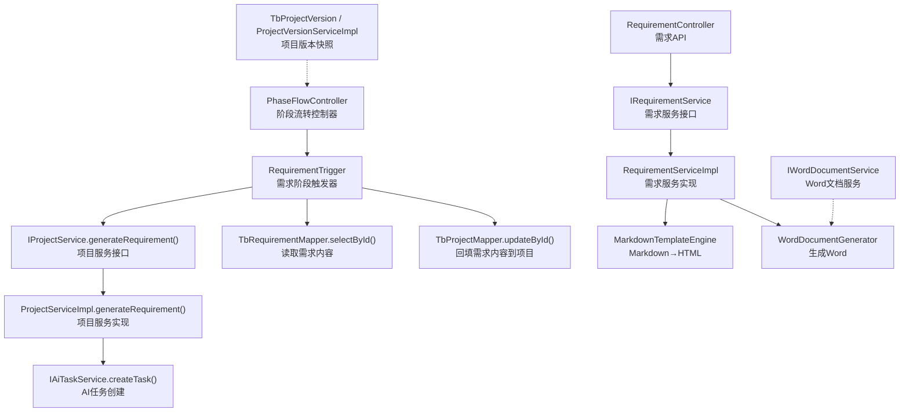
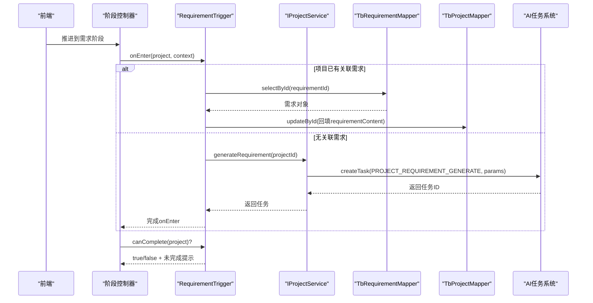
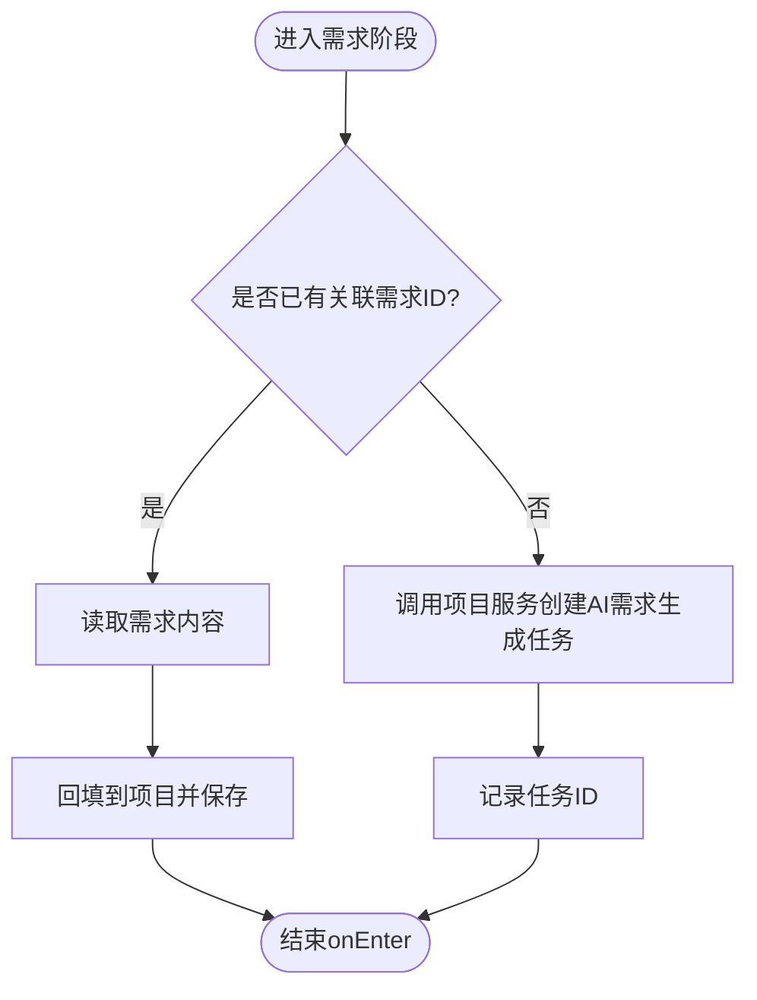
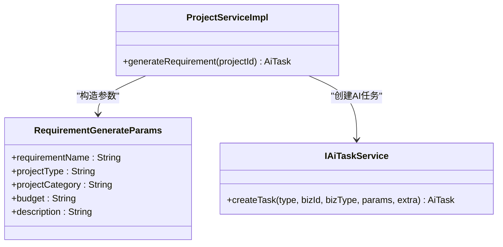
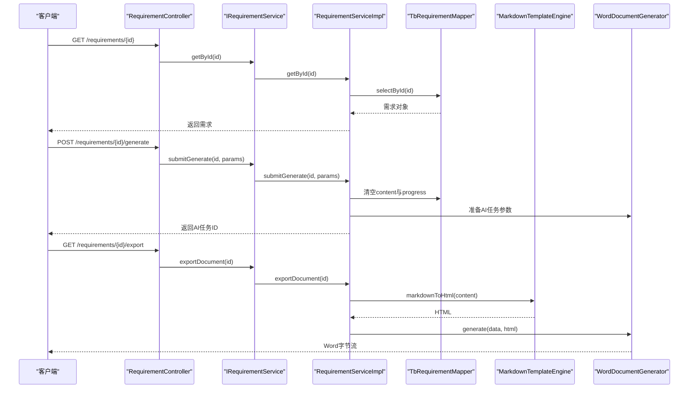
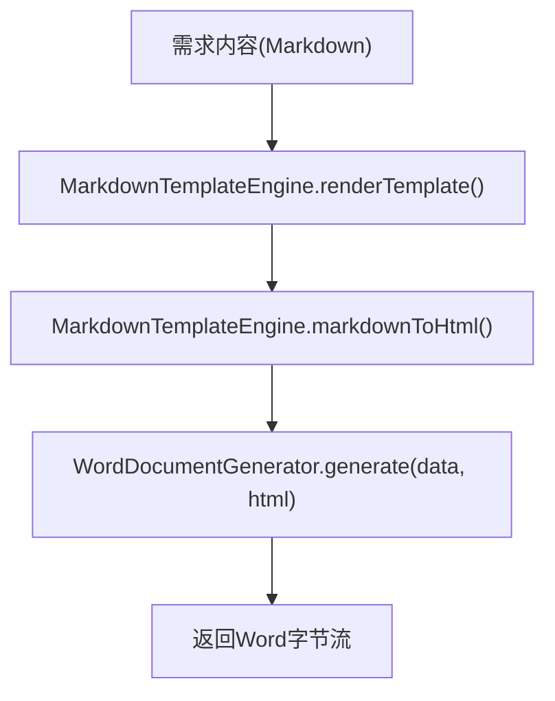
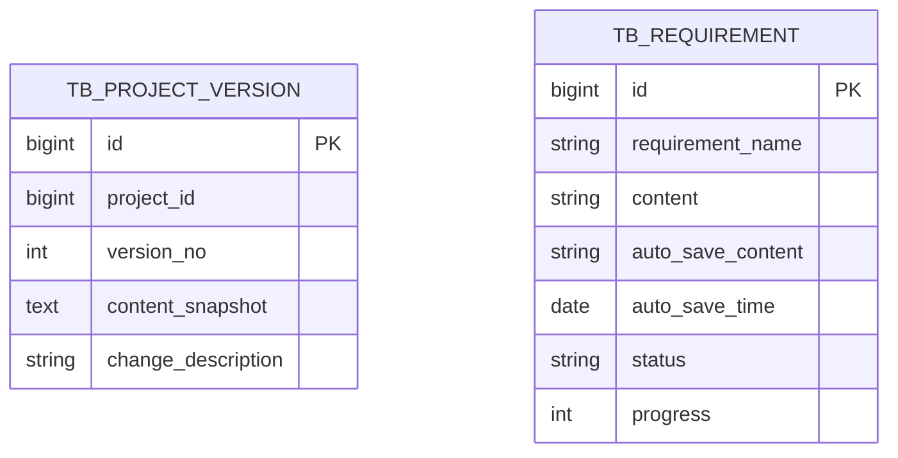
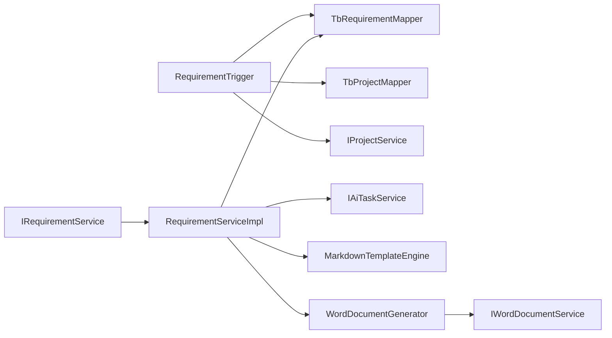

# 需求阶段触发器

<cite>
**本文引用的文件**
- [RequirementTrigger.java](file://ele-ai-tender-system/ele-ai-tender-core/src/main/java/com/jy/eleaitender/core/statemachine/trigger/RequirementTrigger.java)
- [IProjectService.java](file://ele-ai-tender-system/ele-ai-tender-core/src/main/java/com/jy/eleaitender/core/service/IProjectService.java)
- [ProjectServiceImpl.java](file://ele-ai-tender-system/ele-ai-tender-core/src/main/java/com/jy/eleaitender/core/service/impl/ProjectServiceImpl.java)
- [RequirementController.java](file://ele-ai-tender-system/ele-ai-tender-core/src/main/java/com/jy/eleaitender/core/controller/RequirementController.java)
- [IRequirementService.java](file://ele-ai-tender-system/ele-ai-tender-core/src/main/java/com/jy/eleaitender/core/service/IRequirementService.java)
- [RequirementServiceImpl.java](file://ele-ai-tender-system/ele-ai-tender-core/src/main/java/com/jy/eleaitender/core/service/impl/RequirementServiceImpl.java)
- [TbRequirement.java](file://ele-ai-tender-system/ele-ai-tender-common/src/main/java/com/jy/eleaitender/common/entity/core/TbRequirement.java)
- [MarkdownTemplateEngine.java](file://ele-ai-tender-system/ele-ai-tender-core/src/main/java/com/jy/eleaitender/core/engine/MarkdownTemplateEngine.java)
- [IWordDocumentService.java](file://ele-ai-tender-system/ele-ai-tender-file/src/main/java/com/jy/eleaitender/file/service/IWordDocumentService.java)
- [TbProjectVersion.java](file://ele-ai-tender-system/ele-ai-tender-common/src/main/java/com/jy/eleaitender/common/entity/core/TbProjectVersion.java)
- [ProjectVersionServiceImpl.java](file://ele-ai-tender-system/ele-ai-tender-core/src/main/java/com/jy/eleaitender/core/service/impl/ProjectVersionServiceImpl.java)
- [PHASE_FLOW_SPEC.md](file://docs/rules/PHASE_FLOW_SPEC.md)
- [CORE_MODULE_SPEC.md](file://docs/rules/CORE_MODULE_SPEC.md)
</cite>

## 目录
1. [简介](#简介)
2. [项目结构](#项目结构)
3. [核心组件](#核心组件)
4. [架构总览](#架构总览)
5. [详细组件分析](#详细组件分析)
6. [依赖关系分析](#依赖关系分析)
7. [性能与并发特性](#性能与并发特性)
8. [故障排查指南](#故障排查指南)
9. [结论](#结论)
10. [附录：API定义与数据模型](#附录api定义与数据模型)

## 简介
本技术文档聚焦“需求阶段触发器”（RequirementTrigger）在招标文档工具中的业务逻辑与工程实现，覆盖以下关键主题：
- 进入需求阶段时的自动行为：读取已有需求内容或自动创建AI生成任务
- 需求数据的结构化与版本管理：实体字段、草稿保存、检测记录、版本快照
- AI辅助编写：从项目上下文构建参数、提交AI任务、结果回写
- 文档处理引擎集成：Markdown模板渲染、导出为可编辑文档
- 协作编辑支持机制：基于现有能力的并发控制、冲突解决与变更追踪现状与建议

## 项目结构
围绕需求阶段的代码分布在核心服务层、状态机触发器、通用实体与文档处理模块中。下图展示与需求阶段相关的核心文件与交互关系。

图表来源
- [RequirementTrigger.java:1-70](file://ele-ai-tender-system/ele-ai-tender-core/src/main/java/com/jy/eleaitender/core/statemachine/trigger/RequirementTrigger.java#L1-L70)
- [IProjectService.java:63-63](file://ele-ai-tender-system/ele-ai-tender-core/src/main/java/com/jy/eleaitender/core/service/IProjectService.java#L63-L63)
- [ProjectServiceImpl.java:241-269](file://ele-ai-tender-system/ele-ai-tender-core/src/main/java/com/jy/eleaitender/core/service/impl/ProjectServiceImpl.java#L241-L269)
- [RequirementController.java:34-103](file://ele-ai-tender-system/ele-ai-tender-core/src/main/java/com/jy/eleaitender/core/controller/RequirementController.java#L34-L103)
- [IRequirementService.java:1-110](file://ele-ai-tender-system/ele-ai-tender-core/src/main/java/com/jy/eleaitender/core/service/IRequirementService.java#L1-L110)
- [RequirementServiceImpl.java:1-426](file://ele-ai-tender-system/ele-ai-tender-core/src/main/java/com/jy/eleaitender/core/service/impl/RequirementServiceImpl.java#L1-L426)
- [MarkdownTemplateEngine.java:44-81](file://ele-ai-tender-system/ele-ai-tender-core/src/main/java/com/jy/eleaitender/core/engine/MarkdownTemplateEngine.java#L44-L81)
- [IWordDocumentService.java:1-49](file://ele-ai-tender-system/ele-ai-tender-file/src/main/java/com/jy/eleaitender/file/service/IWordDocumentService.java#L1-L49)
- [TbProjectVersion.java:1-30](file://ele-ai-tender-system/ele-ai-tender-common/src/main/java/com/jy/eleaitender/common/entity/core/TbProjectVersion.java#L1-L30)
- [ProjectVersionServiceImpl.java:38-81](file://ele-ai-tender-system/ele-ai-tender-core/src/main/java/com/jy/eleaitender/core/service/impl/ProjectVersionServiceImpl.java#L38-L81)

章节来源
- [PHASE_FLOW_SPEC.md:1-35](file://docs/rules/PHASE_FLOW_SPEC.md#L1-L35)

## 核心组件
- RequirementTrigger：需求阶段触发器，负责进入阶段时的自动化动作与完成条件校验
- IProjectService/ProjectServiceImpl：项目服务，封装了“根据项目信息生成需求”的AI任务创建流程
- IRequirementService/RequirementServiceImpl：需求服务，提供需求的CRUD、匹配历史模板、AI生成、自动保存、检测、导出等能力
- MarkdownTemplateEngine：Markdown模板引擎，负责占位符替换与Markdown转HTML
- WordDocumentGenerator/IWordDocumentService：文档生成与Word文档处理能力
- TbRequirement/TbProjectVersion：需求实体与项目版本实体，承载数据结构与版本快照

章节来源
- [RequirementTrigger.java:1-70](file://ele-ai-tender-system/ele-ai-tender-core/src/main/java/com/jy/eleaitender/core/statemachine/trigger/RequirementTrigger.java#L1-L70)
- [IProjectService.java:29-91](file://ele-ai-tender-system/ele-ai-tender-core/src/main/java/com/jy/eleaitender/core/service/IProjectService.java#L29-L91)
- [ProjectServiceImpl.java:241-269](file://ele-ai-tender-system/ele-ai-tender-core/src/main/java/com/jy/eleaitender/core/service/impl/ProjectServiceImpl.java#L241-L269)
- [IRequirementService.java:1-110](file://ele-ai-tender-system/ele-ai-tender-core/src/main/java/com/jy/eleaitender/core/service/IRequirementService.java#L1-L110)
- [RequirementServiceImpl.java:1-426](file://ele-ai-tender-system/ele-ai-tender-core/src/main/java/com/jy/eleaitender/core/service/impl/RequirementServiceImpl.java#L1-L426)
- [MarkdownTemplateEngine.java:44-81](file://ele-ai-tender-system/ele-ai-tender-core/src/main/java/com/jy/eleaitender/core/engine/MarkdownTemplateEngine.java#L44-L81)
- [IWordDocumentService.java:1-49](file://ele-ai-tender-system/ele-ai-tender-file/src/main/java/com/jy/eleaitender/file/service/IWordDocumentService.java#L1-L49)
- [TbRequirement.java:1-67](file://ele-ai-tender-system/ele-ai-tender-common/src/main/java/com/jy/eleaitender/common/entity/core/TbRequirement.java#L1-L67)
- [TbProjectVersion.java:1-30](file://ele-ai-tender-system/ele-ai-tender-common/src/main/java/com/jy/eleaitender/common/entity/core/TbProjectVersion.java#L1-L30)

## 架构总览
需求阶段触发器在项目状态机推进时执行，其职责包括：
- 若项目已关联需求，则读取需求内容并回填至项目，便于后续阶段使用
- 若未关联需求，则调用项目服务创建AI需求生成任务，异步产出需求内容
- 提供canComplete校验，确保需求ID或需求内容非空方可进入下一阶段

图表来源
- [RequirementTrigger.java:38-67](file://ele-ai-tender-system/ele-ai-tender-core/src/main/java/com/jy/eleaitender/core/statemachine/trigger/RequirementTrigger.java#L38-L67)
- [IProjectService.java:63-63](file://ele-ai-tender-system/ele-ai-tender-core/src/main/java/com/jy/eleaitender/core/service/IProjectService.java#L63-L63)
- [ProjectServiceImpl.java:241-269](file://ele-ai-tender-system/ele-ai-tender-core/src/main/java/com/jy/eleaitender/core/service/impl/ProjectServiceImpl.java#L241-L269)

## 详细组件分析

### RequirementTrigger 业务逻辑
- 进入阶段onEnter：
  - 若project.requirementId存在：查询需求内容并写入project.requirementContent，持久化更新项目
  - 否则：调用项目服务generateRequirement，创建AI需求生成任务；异常被捕获并记录日志，避免阻塞阶段推进
- 完成校验canComplete：
  - requirementId非空 或 requirementContent非空白即视为满足
- 未完成提示getIncompleteMessage：
  - 明确提示用户需完成AI生成或手动填写

图表来源
- [RequirementTrigger.java:38-67](file://ele-ai-tender-system/ele-ai-tender-core/src/main/java/com/jy/eleaitender/core/statemachine/trigger/RequirementTrigger.java#L38-L67)

章节来源
- [RequirementTrigger.java:1-70](file://ele-ai-tender-system/ele-ai-tender-core/src/main/java/com/jy/eleaitender/core/statemachine/trigger/RequirementTrigger.java#L1-L70)

### 项目服务：AI需求生成参数构建
- 输入：项目ID
- 参数组装：
  - 需求名称：项目名称 + “ - 招标需求”
  - 项目类型、类别、预算、描述：取自项目实体
  - 参考文档来源：依据matchMode选择自动匹配/手动选择/上传的文件ID
- 输出：AI任务（类型为PROJECT_REQUIREMENT_GENERATE），由AI模块异步执行

图表来源
- [ProjectServiceImpl.java:241-269](file://ele-ai-tender-system/ele-ai-tender-core/src/main/java/com/jy/eleaitender/core/service/impl/ProjectServiceImpl.java#L241-L269)
- [IProjectService.java:63-63](file://ele-ai-tender-system/ele-ai-tender-core/src/main/java/com/jy/eleaitender/core/service/IProjectService.java#L63-L63)

章节来源
- [ProjectServiceImpl.java:241-269](file://ele-ai-tender-system/ele-ai-tender-core/src/main/java/com/jy/eleaitender/core/service/impl/ProjectServiceImpl.java#L241-L269)
- [IProjectService.java:29-91](file://ele-ai-tender-system/ele-ai-tender-core/src/main/java/com/jy/eleaitender/core/service/IProjectService.java#L29-L91)

### 需求服务：结构化数据与AI辅助编写
- CRUD：分页列表、详情、创建、更新、删除，包含名称唯一性校验与归属校验
- 匹配历史模板：设置匹配模式与匹配文件ID
- AI生成：清空旧内容、重置进度，构建任务参数并提交AI任务
- 自动保存：草稿内容与时间戳落库，正式保存后清除草稿
- 检测：敏感词+错别字两类检测，创建检测记录与对应AI任务，支持接受/拒绝建议并自动修正
- 导出：将需求内容Markdown转为HTML，再交由文档生成器输出Word字节流

图表来源
- [RequirementController.java:34-103](file://ele-ai-tender-system/ele-ai-tender-core/src/main/java/com/jy/eleaitender/core/controller/RequirementController.java#L34-L103)
- [IRequirementService.java:1-110](file://ele-ai-tender-system/ele-ai-tender-core/src/main/java/com/jy/eleaitender/core/service/IRequirementService.java#L1-L110)
- [RequirementServiceImpl.java:146-181](file://ele-ai-tender-system/ele-ai-tender-core/src/main/java/com/jy/eleaitender/core/service/impl/RequirementServiceImpl.java#L146-L181)
- [RequirementServiceImpl.java:396-401](file://ele-ai-tender-system/ele-ai-tender-core/src/main/java/com/jy/eleaitender/core/service/impl/RequirementServiceImpl.java#L396-L401)
- [MarkdownTemplateEngine.java:44-81](file://ele-ai-tender-system/ele-ai-tender-core/src/main/java/com/jy/eleaitender/core/engine/MarkdownTemplateEngine.java#L44-L81)

章节来源
- [RequirementServiceImpl.java:66-132](file://ele-ai-tender-system/ele-ai-tender-core/src/main/java/com/jy/eleaitender/core/service/impl/RequirementServiceImpl.java#L66-L132)
- [RequirementServiceImpl.java:146-181](file://ele-ai-tender-system/ele-ai-tender-core/src/main/java/com/jy/eleaitender/core/service/impl/RequirementServiceImpl.java#L146-L181)
- [RequirementServiceImpl.java:184-205](file://ele-ai-tender-system/ele-ai-tender-core/src/main/java/com/jy/eleaitender/core/service/impl/RequirementServiceImpl.java#L184-L205)
- [RequirementServiceImpl.java:208-319](file://ele-ai-tender-system/ele-ai-tender-core/src/main/java/com/jy/eleaitender/core/service/impl/RequirementServiceImpl.java#L208-L319)
- [RequirementServiceImpl.java:396-401](file://ele-ai-tender-system/ele-ai-tender-core/src/main/java/com/jy/eleaitender/core/service/impl/RequirementServiceImpl.java#L396-L401)

### 文档处理引擎集成：Markdown→Word
- MarkdownTemplateEngine：
  - renderTemplate：将{{key}}占位符替换为上下文值
  - generateHtml：先替换占位符，再将Markdown转换为HTML
- RequirementServiceImpl.exportDocument：
  - 将需求内容转为HTML，结合项目名作为数据上下文，调用WordDocumentGenerator生成Word字节流
- IWordDocumentService：
  - 提供获取文档结构、基于模板生成文档、修复文档、提取文本等能力，供上层服务扩展使用

图表来源
- [MarkdownTemplateEngine.java:44-81](file://ele-ai-tender-system/ele-ai-tender-core/src/main/java/com/jy/eleaitender/core/engine/MarkdownTemplateEngine.java#L44-L81)
- [RequirementServiceImpl.java:396-401](file://ele-ai-tender-system/ele-ai-tender-core/src/main/java/com/jy/eleaitender/core/service/impl/RequirementServiceImpl.java#L396-L401)
- [IWordDocumentService.java:1-49](file://ele-ai-tender-system/ele-ai-tender-file/src/main/java/com/jy/eleaitender/file/service/IWordDocumentService.java#L1-L49)

章节来源
- [MarkdownTemplateEngine.java:44-81](file://ele-ai-tender-system/ele-ai-tender-core/src/main/java/com/jy/eleaitender/core/engine/MarkdownTemplateEngine.java#L44-L81)
- [RequirementServiceImpl.java:396-401](file://ele-ai-tender-system/ele-ai-tender-core/src/main/java/com/jy/eleaitender/core/service/impl/RequirementServiceImpl.java#L396-L401)
- [IWordDocumentService.java:1-49](file://ele-ai-tender-system/ele-ai-tender-file/src/main/java/com/jy/eleaitender/file/service/IWordDocumentService.java#L1-L49)

### 版本管理与变更追踪
- 项目版本实体TbProjectVersion：
  - 字段：projectId、versionNo、contentSnapshot、changeDescription
- ProjectVersionServiceImpl.createVersion：
  - 序列化当前项目的关键字段（如generatedFileId、status）为JSON快照
  - 计算下一个版本号并插入版本记录
- 需求侧版本：
  - 通过自动保存字段autoSaveContent/autoSaveTime维护草稿
  - 检测记录TbDetectionRecord用于追踪检测过程与建议处理状态

图表来源
- [TbProjectVersion.java:1-30](file://ele-ai-tender-system/ele-ai-tender-common/src/main/java/com/jy/eleaitender/common/entity/core/TbProjectVersion.java#L1-L30)
- [ProjectVersionServiceImpl.java:48-81](file://ele-ai-tender-system/ele-ai-tender-core/src/main/java/com/jy/eleaitender/core/service/impl/ProjectVersionServiceImpl.java#L48-L81)
- [TbRequirement.java:1-67](file://ele-ai-tender-system/ele-ai-tender-common/src/main/java/com/jy/eleaitender/common/entity/core/TbRequirement.java#L1-L67)

章节来源
- [TbProjectVersion.java:1-30](file://ele-ai-tender-system/ele-ai-tender-common/src/main/java/com/jy/eleaitender/common/entity/core/TbProjectVersion.java#L1-L30)
- [ProjectVersionServiceImpl.java:38-81](file://ele-ai-tender-system/ele-ai-tender-core/src/main/java/com/jy/eleaitender/core/service/impl/ProjectVersionServiceImpl.java#L38-L81)
- [TbRequirement.java:1-67](file://ele-ai-tender-system/ele-ai-tender-common/src/main/java/com/jy/eleaitender/common/entity/core/TbRequirement.java#L1-L67)

### 协作编辑支持机制（现状与建议）
- 现状：
  - 自动保存：RequirementServiceImpl.autoSave/getAutoSaveContent/clearAutoSave提供草稿级保存与恢复
  - 检测记录：accept/reject建议会更新handleStatus并可自动修正内容，形成变更轨迹
  - 项目版本快照：ProjectVersionServiceImpl.createVersion对关键状态进行快照，便于回溯
- 并发控制与冲突解决：
  - 当前未见显式分布式锁或乐观锁字段用于需求内容并发写保护
  - 建议在需求内容更新处引入乐观锁（ver字段）或基于Redis的细粒度锁，避免多人同时编辑导致覆盖
- 变更追踪：
  - 可在需求实体增加diff字段或使用外部审计表记录每次变更的差异摘要
  - 结合检测记录的handleStatus与内容快照，形成更完整的协作审计链

[本节为概念性说明，不直接分析具体文件]

## 依赖关系分析
- RequirementTrigger依赖：
  - TbRequirementMapper/TbProjectMapper：读写需求与项目
  - IProjectService：触发AI需求生成
- RequirementServiceImpl依赖：
  - TbRequirementMapper：需求数据访问
  - IAiTaskService：创建AI任务
  - MarkdownTemplateEngine/WordDocumentGenerator：文档生成
  - DetectionResultParser：解析检测结果并更新处理状态
- 文档服务：
  - IWordDocumentService：提供Word文档结构、生成、修复、文本提取能力

图表来源
- [RequirementTrigger.java:1-70](file://ele-ai-tender-system/ele-ai-tender-core/src/main/java/com/jy/eleaitender/core/statemachine/trigger/RequirementTrigger.java#L1-L70)
- [IRequirementService.java:1-110](file://ele-ai-tender-system/ele-ai-tender-core/src/main/java/com/jy/eleaitender/core/service/IRequirementService.java#L1-L110)
- [RequirementServiceImpl.java:1-426](file://ele-ai-tender-system/ele-ai-tender-core/src/main/java/com/jy/eleaitender/core/service/impl/RequirementServiceImpl.java#L1-L426)
- [IWordDocumentService.java:1-49](file://ele-ai-tender-system/ele-ai-tender-file/src/main/java/com/jy/eleaitender/file/service/IWordDocumentService.java#L1-L49)

章节来源
- [RequirementTrigger.java:1-70](file://ele-ai-tender-system/ele-ai-tender-core/src/main/java/com/jy/eleaitender/core/statemachine/trigger/RequirementTrigger.java#L1-L70)
- [RequirementServiceImpl.java:1-426](file://ele-ai-tender-system/ele-ai-tender-core/src/main/java/com/jy/eleaitender/core/service/impl/RequirementServiceImpl.java#L1-L426)

## 性能与并发特性
- AI任务异步化：
  - 需求生成与检测均通过AI任务队列异步执行，避免阻塞主流程
- 数据库操作：
  - 分页查询与条件过滤在Mapper层完成，减少内存压力
- 文档生成：
  - Markdown→HTML转换与Word生成可能涉及CPU密集操作，建议在高并发场景下考虑线程池隔离与限流
- 并发写保护：
  - 建议引入乐观锁或分布式锁，防止多人同时编辑同一需求导致覆盖

[本节提供一般性指导，不直接分析具体文件]

## 故障排查指南
- 进入需求阶段失败：
  - 检查RequirementTrigger.onEnter中对已有需求内容的读取与回填逻辑
  - 确认项目服务generateRequirement是否正确组装参数并创建AI任务
- AI生成失败：
  - 查看AI任务状态与错误日志，确认AI服务可用性
- 导出文档为空或格式异常：
  - 检查需求内容是否为空，MarkdownTemplateEngine转换是否成功
  - 验证WordDocumentGenerator配置与模板适配
- 检测建议不接受：
  - 核对detect记录是否存在且属于当前需求
  - 检查原文是否仍存在于需求内容中，以便自动替换

章节来源
- [RequirementTrigger.java:38-67](file://ele-ai-tender-system/ele-ai-tender-core/src/main/java/com/jy/eleaitender/core/statemachine/trigger/RequirementTrigger.java#L38-L67)
- [RequirementServiceImpl.java:208-319](file://ele-ai-tender-system/ele-ai-tender-core/src/main/java/com/jy/eleaitender/core/service/impl/RequirementServiceImpl.java#L208-L319)
- [RequirementServiceImpl.java:396-401](file://ele-ai-tender-system/ele-ai-tender-core/src/main/java/com/jy/eleaitender/core/service/impl/RequirementServiceImpl.java#L396-L401)

## 结论
需求阶段触发器以最小侵入的方式实现了“进入阶段即自动准备需求”的能力，并通过项目服务与AI任务系统协同完成需求生成。需求服务提供了完善的CRUD、草稿保存、检测与导出能力，配合Markdown模板引擎与Word文档服务，形成了从结构化数据到可编辑文档的完整链路。版本快照与检测记录为协作编辑与变更追踪提供了基础支撑，未来可在并发控制与差异审计方面进一步增强。

[本节为总结性内容，不直接分析具体文件]

## 附录：API定义与数据模型
- 需求相关API（节选）：
  - GET /api/v1/requirements：分页查询需求列表
  - GET /api/v1/requirements/{id}：获取需求详情
  - POST /api/v1/requirements：创建需求
  - PUT /api/v1/requirements/{id}：更新需求
  - DELETE /api/v1/requirements/{id}：删除需求
  - POST /api/v1/requirements/{id}/generate：提交AI生成需求任务
  - POST /api/v1/requirements/{id}/auto-save：自动保存草稿
  - GET /api/v1/requirements/{id}/auto-save：获取自动保存内容
  - DELETE /api/v1/requirements/{id}/auto-save：清除自动保存内容
  - POST /api/v1/requirements/{id}/detect：提交需求检测
  - POST /api/v1/requirements/{id}/detect/{recordId}/accept：接受检测建议
  - POST /api/v1/requirements/{id}/detect/{recordId}/reject：拒绝检测建议
  - GET /api/v1/requirements/{id}/detect/records：获取检测记录
  - POST /api/v1/requirements/{id}/detect/finish：完成检测
  - GET /api/v1/requirements/{id}/export：导出需求文档

章节来源
- [CORE_MODULE_SPEC.md:30-50](file://docs/rules/CORE_MODULE_SPEC.md#L30-L50)
- [RequirementController.java:34-103](file://ele-ai-tender-system/ele-ai-tender-core/src/main/java/com/jy/eleaitender/core/controller/RequirementController.java#L34-L103)
- [IRequirementService.java:1-110](file://ele-ai-tender-system/ele-ai-tender-core/src/main/java/com/jy/eleaitender/core/service/IRequirementService.java#L1-L110)