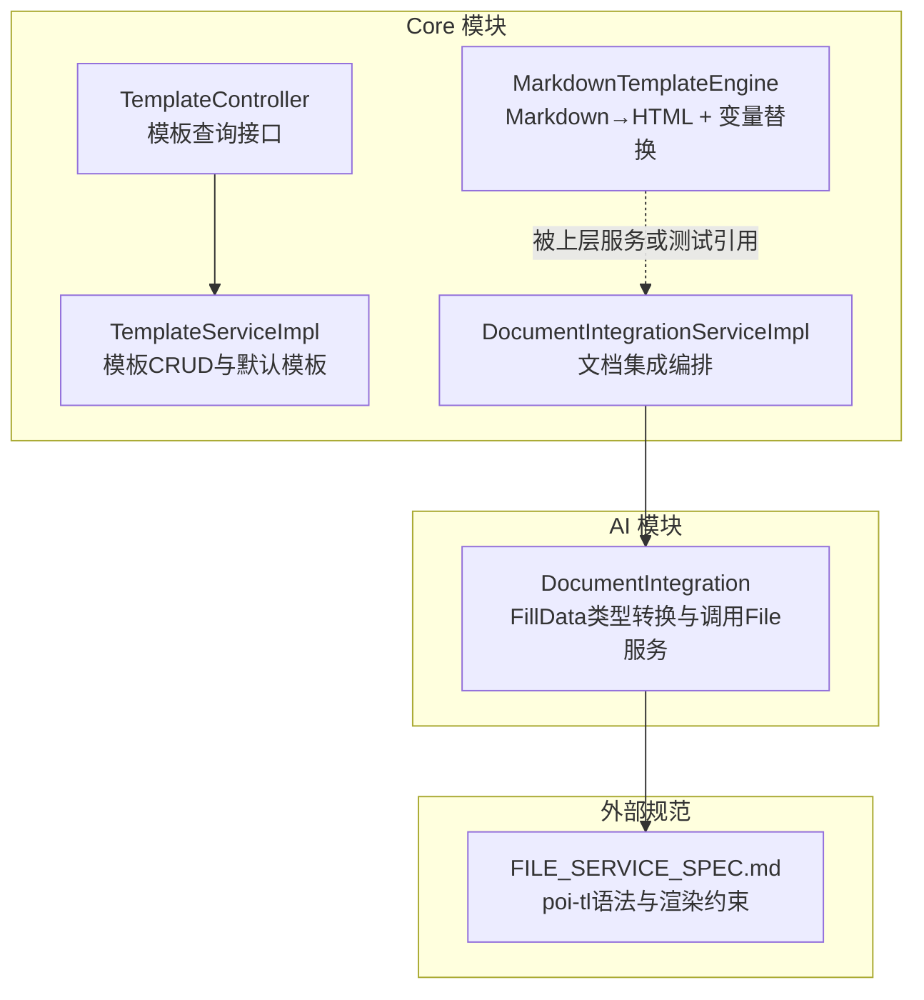
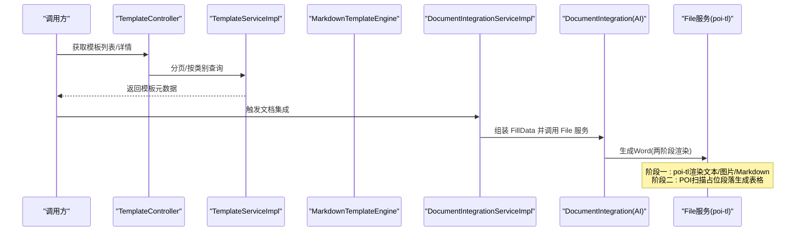
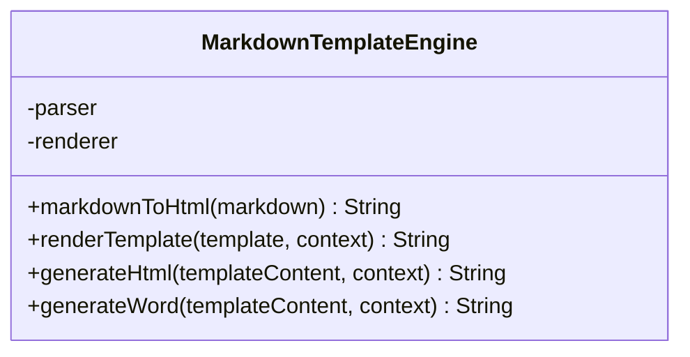
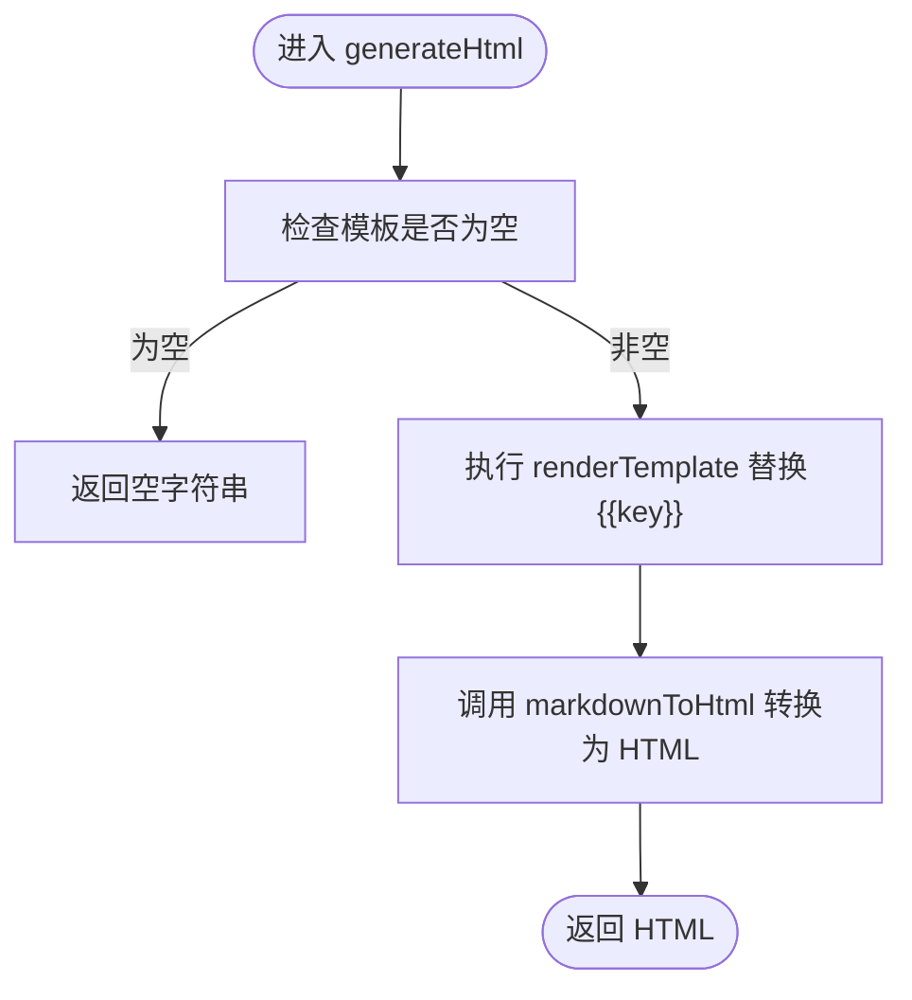
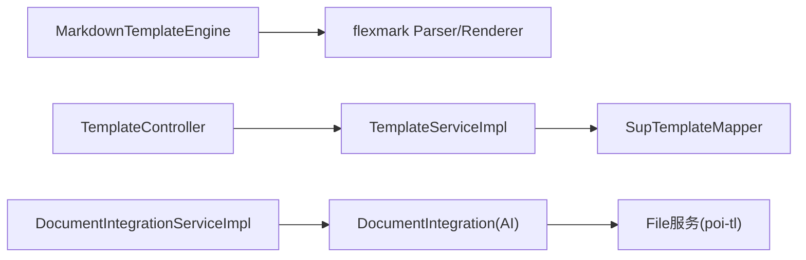

# Markdown模板引擎

<cite>
**本文引用的文件**
- [MarkdownTemplateEngine.java](file://ele-ai-tender-system/ele-ai-tender-core/src/main/java/com/jy/eleaitender/core/engine/MarkdownTemplateEngine.java)
- [TemplateController.java](file://ele-ai-tender-system/ele-ai-tender-core/src/main/java/com/jy/eleaitender/core/controller/TemplateController.java)
- [TemplateServiceImpl.java](file://ele-ai-tender-system/ele-ai-tender-core/src/main/java/com/jy/eleaitender/core/service/impl/TemplateServiceImpl.java)
- [RequirementServiceImpl.java](file://ele-ai-tender-system/ele-ai-tender-core/src/main/java/com/jy/eleaitender/core/service/impl/RequirementServiceImpl.java)
- [DocumentIntegrationServiceImpl.java](file://ele-ai-tender-system/ele-ai-tender-core/src/main/java/com/jy/eleaitender/core/service/impl/DocumentIntegrationServiceImpl.java)
- [DocumentIntegration.java](file://ele-ai-tender-system/ele-ai-tender-ai/src/main/java/com/jy/eleaitender/ai/processor/generator/DocumentIntegration.java)
- [FILE_SERVICE_SPEC.md](file://docs/rules/FILE_SERVICE_SPEC.md)
- [2026-04-23-需求导出Word文档-待确认.md](file://docs/context/2026-04-23-对话上下文-需求导出Word文档-待确认.md)
- [2026-04-28-FillData-Markdown转Word能力设计.md](file://docs/projects/2026-04-28-FillData-Markdown转Word能力设计.md)
- [2026-04-28-FillData-Markdown转Word能力实施计划.md](file://docs/plans/2026-04-28-FillData-Markdown转Word能力实施计划.md)
</cite>

## 目录
1. [简介](#简介)
2. [项目结构](#项目结构)
3. [核心组件](#核心组件)
4. [架构总览](#架构总览)
5. [详细组件分析](#详细组件分析)
6. [依赖关系分析](#依赖关系分析)
7. [性能与缓存](#性能与缓存)
8. [使用示例](#使用示例)
9. [故障排查](#故障排查)
10. [结论](#结论)

## 简介
本技术文档围绕 Markdown 模板引擎的实现与使用展开，重点说明：
- 模板语法解析与变量替换机制
- 条件渲染逻辑（在 poi-tl 层）
- 支持的 Markdown 语法扩展（表格、图片、样式等）
- 模板缓存与性能优化策略
- 在业务代码中的调用方式与典型场景

该引擎基于 flexmark-java 将 Markdown 解析为 HTML，并提供占位符替换能力；同时结合 File 服务与 poi-tl 完成 Word 文档生成。

## 项目结构
与 Markdown 模板引擎相关的核心位置如下：
- 引擎实现位于 core 模块的 engine 包中
- 模板管理接口位于 core 模块的 controller 与 service 层
- 文档集成流程涉及 AI 模块与 core 模块的服务协作
- 规则与计划文档对模板语法、两阶段渲染、表格生成等有约束说明

图表来源
- [MarkdownTemplateEngine.java:1-82](file://ele-ai-tender-system/ele-ai-tender-core/src/main/java/com/jy/eleaitender/core/engine/MarkdownTemplateEngine.java#L1-L82)
- [TemplateController.java:1-52](file://ele-ai-tender-system/ele-ai-tender-core/src/main/java/com/jy/eleaitender/core/controller/TemplateController.java#L1-L52)
- [TemplateServiceImpl.java:1-125](file://ele-ai-tender-system/ele-ai-tender-core/src/main/java/com/jy/eleaitender/core/service/impl/TemplateServiceImpl.java#L1-L125)
- [DocumentIntegrationServiceImpl.java:24-63](file://ele-ai-tender-system/ele-ai-tender-core/src/main/java/com/jy/eleaitender/core/service/impl/DocumentIntegrationServiceImpl.java#L24-L63)
- [DocumentIntegration.java:66-92](file://ele-ai-tender-system/ele-ai-tender-ai/src/main/java/com/jy/eleaitender/ai/processor/generator/DocumentIntegration.java#L66-L92)
- [FILE_SERVICE_SPEC.md:33-71](file://docs/rules/FILE_SERVICE_SPEC.md#L33-L71)

章节来源
- [MarkdownTemplateEngine.java:1-82](file://ele-ai-tender-system/ele-ai-tender-core/src/main/java/com/jy/eleaitender/core/engine/MarkdownTemplateEngine.java#L1-L82)
- [TemplateController.java:1-52](file://ele-ai-tender-system/ele-ai-tender-core/src/main/java/com/jy/eleaitender/core/controller/TemplateController.java#L1-L52)
- [TemplateServiceImpl.java:1-125](file://ele-ai-tender-system/ele-ai-tender-core/src/main/java/com/jy/eleaitender/core/service/impl/TemplateServiceImpl.java#L1-L125)
- [DocumentIntegrationServiceImpl.java:24-63](file://ele-ai-tender-system/ele-ai-tender-core/src/main/java/com/jy/eleaitender/core/service/impl/DocumentIntegrationServiceImpl.java#L24-L63)
- [DocumentIntegration.java:66-92](file://ele-ai-tender-system/ele-ai-tender-ai/src/main/java/com/jy/eleaitender/ai/processor/generator/DocumentIntegration.java#L66-L92)
- [FILE_SERVICE_SPEC.md:33-71](file://docs/rules/FILE_SERVICE_SPEC.md#L33-L71)

## 核心组件
- MarkdownTemplateEngine
  - 职责：提供 Markdown → HTML 转换、模板变量替换、以及组合生成 HTML 的统一入口
  - 关键点：
    - 使用 flexmark Parser 与 HtmlRenderer 进行解析与渲染
    - 支持 {{key}} 形式的变量占位符替换
    - 提供 generateHtml 组合方法，先替换后渲染
    - 保留 generateWord 兼容接口

章节来源
- [MarkdownTemplateEngine.java:1-82](file://ele-ai-tender-system/ele-ai-tender-core/src/main/java/com/jy/eleaitender/core/engine/MarkdownTemplateEngine.java#L1-L82)

## 架构总览
下图展示从“模板管理”到“文档生成”的整体链路，包括 Markdown 模板引擎与 poi-tl 两阶段渲染的关系。

图表来源
- [TemplateController.java:1-52](file://ele-ai-tender-system/ele-ai-tender-core/src/main/java/com/jy/eleaitender/core/controller/TemplateController.java#L1-L52)
- [TemplateServiceImpl.java:1-125](file://ele-ai-tender-system/ele-ai-tender-core/src/main/java/com/jy/eleaitender/core/service/impl/TemplateServiceImpl.java#L1-L125)
- [DocumentIntegrationServiceImpl.java:24-63](file://ele-ai-tender-system/ele-ai-tender-core/src/main/java/com/jy/eleaitender/core/service/impl/DocumentIntegrationServiceImpl.java#L24-L63)
- [DocumentIntegration.java:66-92](file://ele-ai-tender-system/ele-ai-tender-ai/src/main/java/com/jy/eleaitender/ai/processor/generator/DocumentIntegration.java#L66-L92)
- [FILE_SERVICE_SPEC.md:33-71](file://docs/rules/FILE_SERVICE_SPEC.md#L33-L71)

## 详细组件分析

### MarkdownTemplateEngine 类图

图表来源
- [MarkdownTemplateEngine.java:1-82](file://ele-ai-tender-system/ele-ai-tender-core/src/main/java/com/jy/eleaitender/core/engine/MarkdownTemplateEngine.java#L1-L82)

#### 变量替换与渲染流程

图表来源
- [MarkdownTemplateEngine.java:44-73](file://ele-ai-tender-system/ele-ai-tender-core/src/main/java/com/jy/eleaitender/core/engine/MarkdownTemplateEngine.java#L44-L73)

章节来源
- [MarkdownTemplateEngine.java:1-82](file://ele-ai-tender-system/ele-ai-tender-core/src/main/java/com/jy/eleaitender/core/engine/MarkdownTemplateEngine.java#L1-L82)

### 模板管理与集成服务
- TemplateController：对外暴露模板分页、详情、默认模板查询接口
- TemplateServiceImpl：实现模板 CRUD、默认模板设置、按类别过滤等逻辑
- DocumentIntegrationServiceImpl：作为文档集成的编排者，协调 AI 与 File 服务完成最终文档生成

章节来源
- [TemplateController.java:1-52](file://ele-ai-tender-system/ele-ai-tender-core/src/main/java/com/jy/eleaitender/core/controller/TemplateController.java#L1-L52)
- [TemplateServiceImpl.java:1-125](file://ele-ai-tender-system/ele-ai-tender-core/src/main/java/com/jy/eleaitender/core/service/impl/TemplateServiceImpl.java#L1-L125)
- [DocumentIntegrationServiceImpl.java:24-63](file://ele-ai-tender-system/ele-ai-tender-core/src/main/java/com/jy/eleaitender/core/service/impl/DocumentIntegrationServiceImpl.java#L24-L63)

### 条件渲染与复杂结构（poi-tl 层）
- 条件渲染：通过同名变量包裹的区块对实现，如 `{{showDetail}}...{{showDetail}}`
- 循环渲染：使用 `{{?items}}...{{/items}}` 语法遍历集合
- 图片插入：使用 `{{@var}}` 语法绑定图片对象
- 包含子模板：使用 `{{+var}}` 引入片段
- 注意：这些语法由 File 服务的 poi-tl 引擎处理，不在 MarkdownTemplateEngine 内实现

章节来源
- [FILE_SERVICE_SPEC.md:33-71](file://docs/rules/FILE_SERVICE_SPEC.md#L33-L71)

### Markdown 语法扩展与表格生成
- 表格生成：Flexmark 解析 Markdown 表格为 AST，再由后续转换器生成结构化表格数据
- 单元格样式：表格单元格内的行内格式（如加粗）应保留
- 合并单元格：需保证列数对齐，避免渲染异常
- 边框设置：生成的表格默认无边框，需显式设置六边边框

章节来源
- [FILE_SERVICE_SPEC.md:33-71](file://docs/rules/FILE_SERVICE_SPEC.md#L33-L71)

## 依赖关系分析
- MarkdownTemplateEngine 依赖 flexmark 的 Parser 与 HtmlRenderer
- 模板管理相关控制器与服务之间松耦合，通过接口与 Mapper 交互
- 文档集成链路中，AI 模块负责 FillData 类型转换，File 服务负责最终渲染

图表来源
- [MarkdownTemplateEngine.java:1-82](file://ele-ai-tender-system/ele-ai-tender-core/src/main/java/com/jy/eleaitender/core/engine/MarkdownTemplateEngine.java#L1-L82)
- [TemplateController.java:1-52](file://ele-ai-tender-system/ele-ai-tender-core/src/main/java/com/jy/eleaitender/core/controller/TemplateController.java#L1-L52)
- [TemplateServiceImpl.java:1-125](file://ele-ai-tender-system/ele-ai-tender-core/src/main/java/com/jy/eleaitender/core/service/impl/TemplateServiceImpl.java#L1-L125)
- [DocumentIntegrationServiceImpl.java:24-63](file://ele-ai-tender-system/ele-ai-tender-core/src/main/java/com/jy/eleaitender/core/service/impl/DocumentIntegrationServiceImpl.java#L24-L63)
- [DocumentIntegration.java:66-92](file://ele-ai-tender-system/ele-ai-tender-ai/src/main/java/com/jy/eleaitender/ai/processor/generator/DocumentIntegration.java#L66-L92)

章节来源
- [MarkdownTemplateEngine.java:1-82](file://ele-ai-tender-system/ele-ai-tender-core/src/main/java/com/jy/eleaitender/core/engine/MarkdownTemplateEngine.java#L1-L82)
- [TemplateController.java:1-52](file://ele-ai-tender-system/ele-ai-tender-core/src/main/java/com/jy/eleaitender/core/controller/TemplateController.java#L1-L52)
- [TemplateServiceImpl.java:1-125](file://ele-ai-tender-system/ele-ai-tender-core/src/main/java/com/jy/eleaitender/core/service/impl/TemplateServiceImpl.java#L1-L125)
- [DocumentIntegrationServiceImpl.java:24-63](file://ele-ai-tender-system/ele-ai-tender-core/src/main/java/com/jy/eleaitender/core/service/impl/DocumentIntegrationServiceImpl.java#L24-L63)
- [DocumentIntegration.java:66-92](file://ele-ai-tender-system/ele-ai-tender-ai/src/main/java/com/jy/eleaitender/ai/processor/generator/DocumentIntegration.java#L66-L92)

## 性能与缓存
- 当前 MarkdownTemplateEngine 未内置模板缓存；每次调用均执行变量替换与 Markdown 解析
- 建议优化方向：
  - 对常用模板内容做内存缓存（例如按模板ID或内容指纹缓存已解析的 AST 或中间结果）
  - 对高频变量替换结果进行局部缓存（如短文本片段）
  - 控制并发下的 Parser/Renderer 实例复用（当前构造时创建实例，可考虑单例化以提升性能）
- 参考文档中对两阶段渲染与表格生成的约束，有助于减少不必要的重复计算

章节来源
- [MarkdownTemplateEngine.java:1-82](file://ele-ai-tender-system/ele-ai-tender-core/src/main/java/com/jy/eleaitender/core/engine/MarkdownTemplateEngine.java#L1-L82)
- [FILE_SERVICE_SPEC.md:33-71](file://docs/rules/FILE_SERVICE_SPEC.md#L33-L71)

## 使用示例
以下示例仅描述调用路径与参数约定，不直接展示代码内容。

- 简单变量替换
  - 输入：Markdown 模板中包含 {{title}}、{{content}} 等占位符
  - 上下文：Map<String, Object>，键名与占位符一致
  - 调用：MarkdownTemplateEngine.generateHtml(template, context)
  - 输出：HTML 字符串

- 复杂嵌套结构
  - 在 poi-tl 层使用循环标签 `{{?items}}...{{/items}}` 渲染列表
  - 使用条件标签 `{{showDetail}}...{{showDetail}}` 控制区块显示
  - 使用图片标签 `{{@logo}}` 插入图片
  - 使用包含标签 `{{+header}}` 引入子模板片段

- 动态内容生成
  - 通过 DocumentIntegrationServiceImpl 编排任务，AI 模块将 FillData 列表转换为具体类型后调用 File 服务
  - File 服务根据 FillData 的类型分派渲染策略（TEXT/TABLE/IMAGE/MARKDOWN），其中 MARKDOWN 经 MarkdownTemplateEngine 转为 HTML 后再参与渲染

章节来源
- [2026-04-23-需求导出Word文档-待确认.md](file://docs/context/2026-04-23-对话上下文-需求导出Word文档-待确认.md)
- [2026-04-28-FillData-Markdown转Word能力设计.md](file://docs/projects/2026-04-28-FillData-Markdown转Word能力设计.md)
- [2026-04-28-FillData-Markdown转Word能力实施计划.md](file://docs/plans/2026-04-28-FillData-Markdown转Word能力实施计划.md)
- [DocumentIntegrationServiceImpl.java:24-63](file://ele-ai-tender-system/ele-ai-tender-core/src/main/java/com/jy/eleaitender/core/service/impl/DocumentIntegrationServiceImpl.java#L24-L63)
- [DocumentIntegration.java:66-92](file://ele-ai-tender-system/ele-ai-tender-ai/src/main/java/com/jy/eleaitender/ai/processor/generator/DocumentIntegration.java#L66-L92)
- [FILE_SERVICE_SPEC.md:33-71](file://docs/rules/FILE_SERVICE_SPEC.md#L33-L71)

## 故障排查
- 变量未替换
  - 检查占位符是否严格匹配 {{key}} 形式，且 Map 中存在对应键
  - 确认传入的 context 不为 null，且值可正确转换为字符串
- Markdown 解析异常
  - 检查模板是否为空或仅空白字符，空输入会返回空字符串
  - 确保 Markdown 语法符合 flexmark 支持范围
- 表格渲染问题
  - 若出现表格降级为纯文本或列数不对齐，检查是否存在合并单元格或非法分隔符
  - 确认表格边框设置是否完整（六边边框）
- 条件/循环标签错误
  - 遵循 FILE_SERVICE_SPEC 中的语法表，避免混用其他模板引擎语法
  - 结束标签必须与开始标签同名

章节来源
- [MarkdownTemplateEngine.java:33-55](file://ele-ai-tender-system/ele-ai-tender-core/src/main/java/com/jy/eleaitender/core/engine/MarkdownTemplateEngine.java#L33-L55)
- [FILE_SERVICE_SPEC.md:33-71](file://docs/rules/FILE_SERVICE_SPEC.md#L33-L71)

## 结论
MarkdownTemplateEngine 提供了轻量而稳定的 Markdown 解析与变量替换能力，并与 File 服务及 poi-tl 协同完成复杂的文档生成流程。通过遵循规范中的模板语法与渲染约束，可在业务场景中高效实现文档自动化生成。建议在高频使用场景下引入模板缓存与实例复用，以进一步提升性能与稳定性。