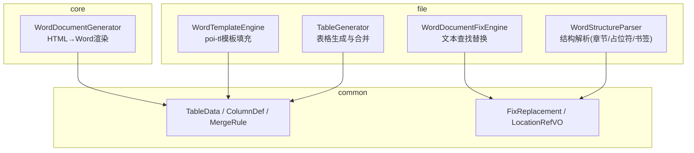
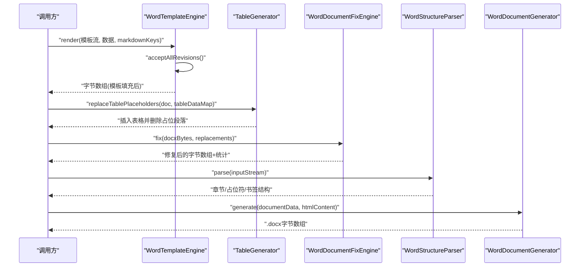
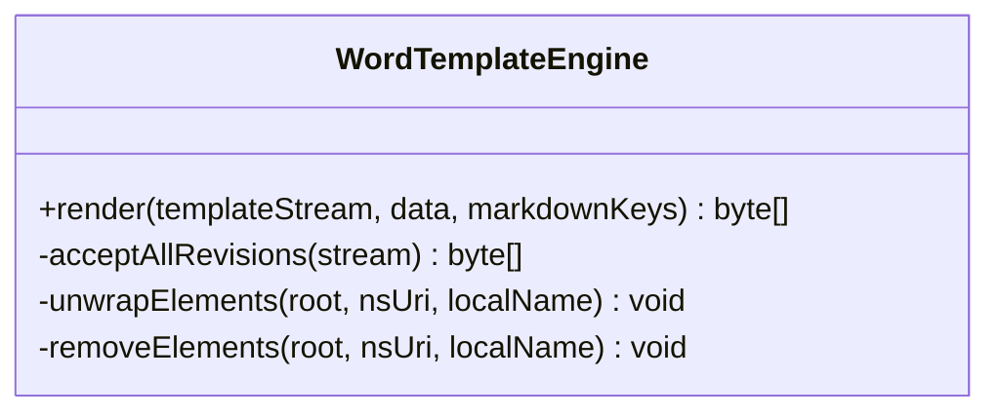
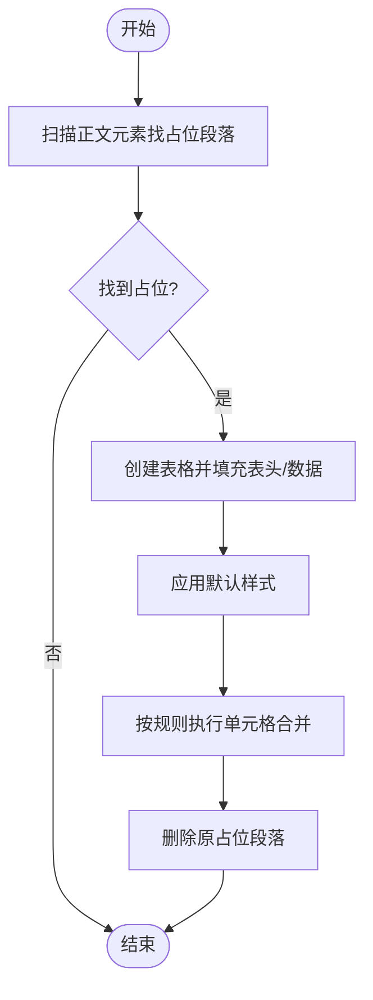
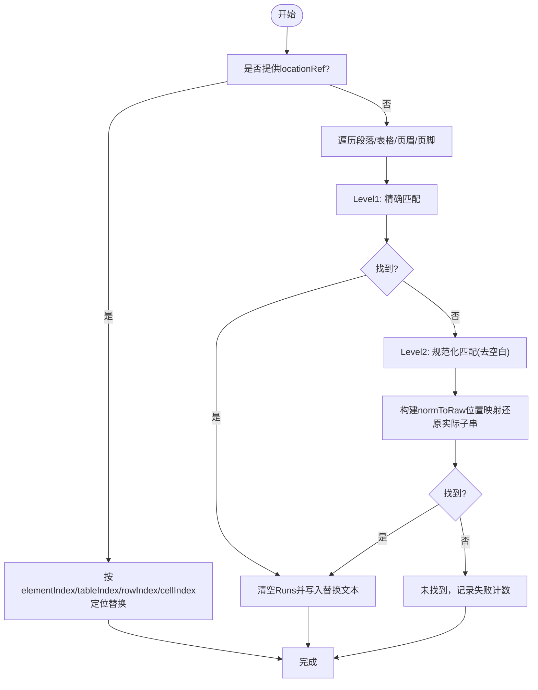
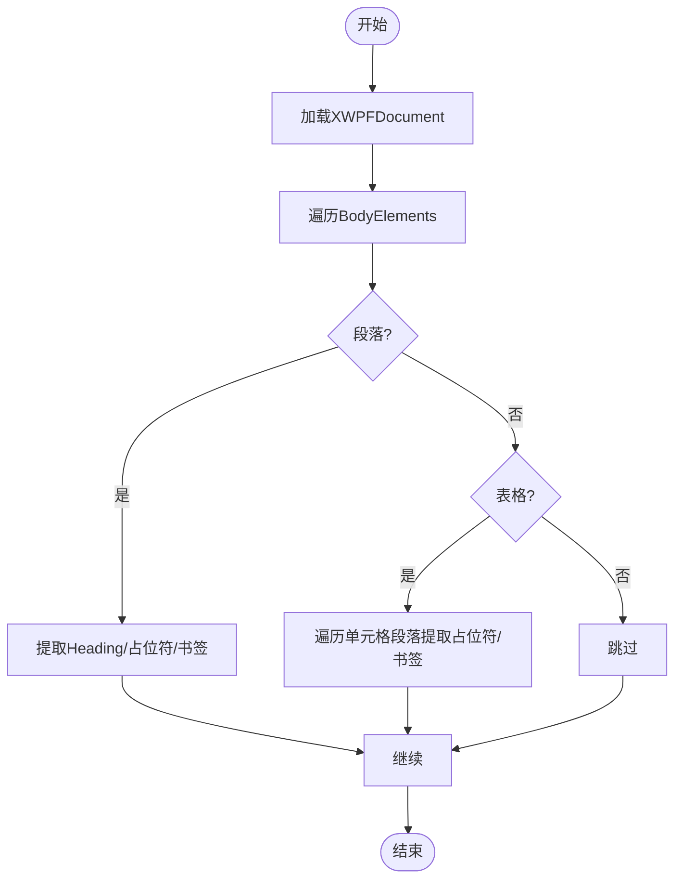
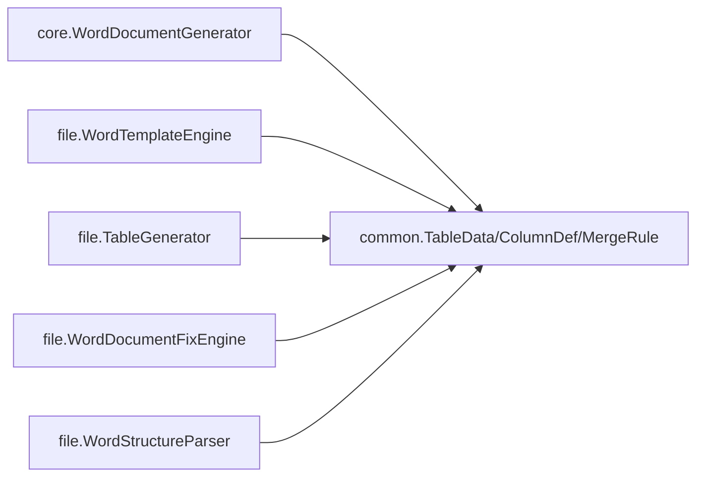

# Word文档生成器

<cite>
**本文引用的文件**
- [WordDocumentGenerator.java](file://ele-ai-tender-system/ele-ai-tender-core/src/main/java/com/jy/eleaitender/core/engine/WordDocumentGenerator.java)
- [WordTemplateEngine.java](file://ele-ai-tender-system/ele-ai-tender-file/src/main/java/com/jy/eleaitender/file/engine/WordTemplateEngine.java)
- [WordDocumentFixEngine.java](file://ele-ai-tender-system/ele-ai-tender-file/src/main/java/com/jy/eleaitender/file/engine/WordDocumentFixEngine.java)
- [WordStructureParser.java](file://ele-ai-tender-system/ele-ai-tender-file/src/main/java/com/jy/eleaitender/file/engine/WordStructureParser.java)
- [TableGenerator.java](file://ele-ai-tender-system/ele-ai-tender-file/src/main/java/com/jy/eleaitender/file/engine/TableGenerator.java)
- [FixReplacement.java](file://ele-ai-tender-system/ele-ai-tender-common/src/main/java/com/jy/eleaitender/common/dto/FixReplacement.java)
- [LocationRefVO.java](file://ele-ai-tender-system/ele-ai-tender-common/src/main/java/com/jy/eleaitender/common/dto/LocationRefVO.java)
- [TableData.java](file://ele-ai-tender-system/ele-ai-tender-common/src/main/java/com/jy/eleaitender/common/dto/TableData.java)
- [ColumnDef.java](file://ele-ai-tender-system/ele-ai-tender-common/src/main/java/com/jy/eleaitender/common/dto/ColumnDef.java)
- [MergeRule.java](file://ele-ai-tender-system/ele-ai-tender-common/src/main/java/com/jy/eleaitender/common/dto/MergeRule.java)
</cite>

## 目录
1. [简介](#简介)
2. [项目结构](#项目结构)
3. [核心组件](#核心组件)
4. [架构总览](#架构总览)
5. [详细组件分析](#详细组件分析)
6. [依赖关系分析](#依赖关系分析)
7. [性能与稳定性](#性能与稳定性)
8. [故障排查指南](#故障排查指南)
9. [结论](#结论)
10. [附录：API使用指南](#附录api使用指南)

## 简介
本技术文档围绕“Word文档生成器”展开，聚焦于基于POI-TL的模板填充方案与Apache POI编程式渲染两条路径。系统提供以下能力：
- 模板文件处理：清理修订标记、占位符解析、Markdown绑定渲染
- 数据绑定：键值映射、表格数据驱动、合并策略
- 文档渲染：HTML→Word段落/表格/列表/引用块等元素渲染；模板→最终文档
- 文档修复：定位替换（支持精确定位与全文匹配）、规范化文本匹配
- 文档结构解析：章节、占位符、书签提取
- 版本控制机制：通过结构解析与差异定位支撑对比与高亮（概念性说明）

## 项目结构
本项目采用多模块组织，与Word文档生成相关的核心代码分布在core与file两个模块中：
- core模块：提供HTML到Word的直接渲染引擎
- file模块：提供基于poi-tl的模板引擎、表格生成、文档修复与结构解析

图表来源
- [WordDocumentGenerator.java:1-289](file://ele-ai-tender-system/ele-ai-tender-core/src/main/java/com/jy/eleaitender/core/engine/WordDocumentGenerator.java#L1-L289)
- [WordTemplateEngine.java:1-121](file://ele-ai-tender-system/ele-ai-tender-file/src/main/java/com/jy/eleaitender/file/engine/WordTemplateEngine.java#L1-L121)
- [TableGenerator.java:1-287](file://ele-ai-tender-system/ele-ai-tender-file/src/main/java/com/jy/eleaitender/file/engine/TableGenerator.java#L1-L287)
- [WordDocumentFixEngine.java:1-252](file://ele-ai-tender-system/ele-ai-tender-file/src/main/java/com/jy/eleaitender/file/engine/WordDocumentFixEngine.java#L1-L252)
- [WordStructureParser.java:1-132](file://ele-ai-tender-system/ele-ai-tender-file/src/main/java/com/jy/eleaitender/file/engine/WordStructureParser.java#L1-L132)
- [TableData.java:1-23](file://ele-ai-tender-system/ele-ai-tender-common/src/main/java/com/jy/eleaitender/common/dto/TableData.java#L1-L23)
- [ColumnDef.java:1-33](file://ele-ai-tender-system/ele-ai-tender-common/src/main/java/com/jy/eleaitender/common/dto/ColumnDef.java#L1-L33)
- [MergeRule.java:1-24](file://ele-ai-tender-system/ele-ai-tender-common/src/main/java/com/jy/eleaitender/common/dto/MergeRule.java#L1-L24)
- [FixReplacement.java:1-20](file://ele-ai-tender-system/ele-ai-tender-common/src/main/java/com/jy/eleaitender/common/dto/FixReplacement.java#L1-L20)
- [LocationRefVO.java:1-27](file://ele-ai-tender-system/ele-ai-tender-common/src/main/java/com/jy/eleaitender/common/dto/LocationRefVO.java#L1-L27)

章节来源
- [WordDocumentGenerator.java:1-289](file://ele-ai-tender-system/ele-ai-tender-core/src/main/java/com/jy/eleaitender/core/engine/WordDocumentGenerator.java#L1-L289)
- [WordTemplateEngine.java:1-121](file://ele-ai-tender-system/ele-ai-tender-file/src/main/java/com/jy/eleaitender/file/engine/WordTemplateEngine.java#L1-L121)
- [TableGenerator.java:1-287](file://ele-ai-tender-system/ele-ai-tender-file/src/main/java/com/jy/eleaitender/file/engine/TableGenerator.java#L1-L287)
- [WordDocumentFixEngine.java:1-252](file://ele-ai-tender-system/ele-ai-tender-file/src/main/java/com/jy/eleaitender/file/engine/WordDocumentFixEngine.java#L1-L252)
- [WordStructureParser.java:1-132](file://ele-ai-tender-system/ele-ai-tender-file/src/main/java/com/jy/eleaitender/file/engine/WordStructureParser.java#L1-L132)

## 核心组件
- HTML→Word渲染器：将HTML内容解析为结构化段落、标题、表格、列表、引用块等，并写入XWPFDocument
- poi-tl模板引擎：对.docx模板进行占位符填充，支持Markdown渲染绑定，内置修订标记清理以规避底层索引异常
- 表格生成器：绕过poi-tl循环标签，直接通过Apache POI API创建表格行、设置样式、执行单元格合并
- 文档修复引擎：在段落/表格/页眉页脚中进行两级文本匹配（精确与规范化），支持locationRef精确定位替换
- 结构解析器：扫描章节（Heading样式）、占位符与书签，输出文档结构信息

章节来源
- [WordDocumentGenerator.java:1-289](file://ele-ai-tender-system/ele-ai-tender-core/src/main/java/com/jy/eleaitender/core/engine/WordDocumentGenerator.java#L1-L289)
- [WordTemplateEngine.java:1-121](file://ele-ai-tender-system/ele-ai-tender-file/src/main/java/com/jy/eleaitender/file/engine/WordTemplateEngine.java#L1-L121)
- [TableGenerator.java:1-287](file://ele-ai-tender-system/ele-ai-tender-file/src/main/java/com/jy/eleaitender/file/engine/TableGenerator.java#L1-L287)
- [WordDocumentFixEngine.java:1-252](file://ele-ai-tender-system/ele-ai-tender-file/src/main/java/com/jy/eleaitender/file/engine/WordDocumentFixEngine.java#L1-L252)
- [WordStructureParser.java:1-132](file://ele-ai-tender-system/ele-ai-tender-file/src/main/java/com/jy/eleaitender/file/engine/WordStructureParser.java#L1-L132)

## 架构总览
下图展示了从模板或HTML输入到最终Word输出的关键流程，以及各组件之间的协作关系。

图表来源
- [WordTemplateEngine.java:1-121](file://ele-ai-tender-system/ele-ai-tender-file/src/main/java/com/jy/eleaitender/file/engine/WordTemplateEngine.java#L1-L121)
- [TableGenerator.java:1-287](file://ele-ai-tender-system/ele-ai-tender-file/src/main/java/com/jy/eleaitender/file/engine/TableGenerator.java#L1-L287)
- [WordDocumentFixEngine.java:1-252](file://ele-ai-tender-system/ele-ai-tender-file/src/main/java/com/jy/eleaitender/file/engine/WordDocumentFixEngine.java#L1-L252)
- [WordStructureParser.java:1-132](file://ele-ai-tender-system/ele-ai-tender-file/src/main/java/com/jy/eleaitender/file/engine/WordStructureParser.java#L1-L132)
- [WordDocumentGenerator.java:1-289](file://ele-ai-tender-system/ele-ai-tender-core/src/main/java/com/jy/eleaitender/core/engine/WordDocumentGenerator.java#L1-L289)

## 详细组件分析

### HTML→Word渲染器（WordDocumentGenerator）
- 功能要点
  - 根据documentData中的项目名称添加居中加粗标题
  - 使用Jsoup解析HTML，递归遍历DOM树，按标签类型渲染为XWPFParagraph/XWPFRun
  - 支持H1-H6标题、段落、表格、有序/无序列表、引用块、水平线
  - 内联格式支持：加粗、斜体、下划线、等宽字体、换行、链接样式
  - 表格渲染：自动计算列数、设置表头背景色、统一字体字号
- 复杂度与性能
  - 时间复杂度近似O(N)，N为HTML节点数量
  - 内存占用与HTML规模线性相关，适合中等规模内容
- 错误处理
  - IO异常捕获并包装为运行时异常，便于上层统一处理

```mermaid
flowchart TD
Start(["开始"]) --> Parse["解析HTML为DOM树"]
Parse --> Traverse["递归遍历子元素"]
Traverse --> Tag{"标签类型?"}
Tag --> |标题| AddHeading["创建带样式的标题段落"]
Tag --> |段落| RichPara["创建富文本段落"]
Tag --> |表格| CreateTable["创建表格并填充单元格"]
Tag --> |列表| CreateList["创建有序/无序列表项"]
Tag --> |引用块| Blockquote["创建缩进斜体引用块"]
Tag --> |分隔线| HR["添加水平线"]
Tag --> |其他| Recurse["递归处理子元素或追加文本"]
AddHeading --> Next["继续遍历"]
RichPara --> Next
CreateTable --> Next
CreateList --> Next
Blockquote --> Next
HR --> Next
Recurse --> Next
Next --> End(["结束"])
```

图表来源
- [WordDocumentGenerator.java:67-93](file://ele-ai-tender-system/ele-ai-tender-core/src/main/java/com/jy/eleaitender/core/engine/WordDocumentGenerator.java#L67-L93)
- [WordDocumentGenerator.java:118-172](file://ele-ai-tender-system/ele-ai-tender-core/src/main/java/com/jy/eleaitender/core/engine/WordDocumentGenerator.java#L118-L172)
- [WordDocumentGenerator.java:177-223](file://ele-ai-tender-system/ele-ai-tender-core/src/main/java/com/jy/eleaitender/core/engine/WordDocumentGenerator.java#L177-L223)

章节来源
- [WordDocumentGenerator.java:1-289](file://ele-ai-tender-system/ele-ai-tender-core/src/main/java/com/jy/eleaitender/core/engine/WordDocumentGenerator.java#L1-L289)

### poi-tl模板引擎（WordTemplateEngine）
- 功能要点
  - 构建Configure并绑定Markdown渲染策略（DocumentRenderPolicy）
  - 渲染前执行“接受所有修订”，解包<w:ins>/<w:moveTo>并删除<w:del>/<w:moveFrom>及各类属性变更标记，避免poi-tl编译阶段索引越界
  - 返回填充后的字节数组
- 关键实现细节
  - acceptAllRevisions：遍历DOM节点，批量解包与删除修订标记
  - unwrapElements/removeElements：反序处理以避免位置偏移
- 适用场景
  - 需要保留复杂版式、图片、页眉页脚、样式等的模板填充

图表来源
- [WordTemplateEngine.java:42-89](file://ele-ai-tender-system/ele-ai-tender-file/src/main/java/com/jy/eleaitender/file/engine/WordTemplateEngine.java#L42-L89)
- [WordTemplateEngine.java:92-119](file://ele-ai-tender-system/ele-ai-tender-file/src/main/java/com/jy/eleaitender/file/engine/WordTemplateEngine.java#L92-L119)

章节来源
- [WordTemplateEngine.java:1-121](file://ele-ai-tender-system/ele-ai-tender-file/src/main/java/com/jy/eleaitender/file/engine/WordTemplateEngine.java#L1-L121)

### 表格生成器（TableGenerator）
- 功能要点
  - 扫描文档中的表格占位符段落，使用XmlCursor在占位处插入新表格
  - 生成表头与数据行，应用默认样式（边框、对齐、字体）
  - 支持按相同文本合并列（垂直合并），通过CTVMerge控制RESTART/CONTINUE
- 数据结构
  - TableData：包含列定义、行数据、合并规则
  - ColumnDef：列标识、表头、宽度
  - MergeRule：列索引、合并策略
- 算法流程

图表来源
- [TableGenerator.java:31-53](file://ele-ai-tender-system/ele-ai-tender-file/src/main/java/com/jy/eleaitender/file/engine/TableGenerator.java#L31-L53)
- [TableGenerator.java:75-117](file://ele-ai-tender-system/ele-ai-tender-file/src/main/java/com/jy/eleaitender/file/engine/TableGenerator.java#L75-L117)
- [TableGenerator.java:147-184](file://ele-ai-tender-system/ele-ai-tender-file/src/main/java/com/jy/eleaitender/file/engine/TableGenerator.java#L147-L184)

章节来源
- [TableGenerator.java:1-287](file://ele-ai-tender-system/ele-ai-tender-file/src/main/java/com/jy/eleaitender/file/engine/TableGenerator.java#L1-L287)
- [TableData.java:1-23](file://ele-ai-tender-system/ele-ai-tender-common/src/main/java/com/jy/eleaitender/common/dto/TableData.java#L1-L23)
- [ColumnDef.java:1-33](file://ele-ai-tender-system/ele-ai-tender-common/src/main/java/com/jy/eleaitender/common/dto/ColumnDef.java#L1-L33)
- [MergeRule.java:1-24](file://ele-ai-tender-system/ele-ai-tender-common/src/main/java/com/jy/eleaitender/common/dto/MergeRule.java#L1-L24)

### 文档修复引擎（WordDocumentFixEngine）
- 功能要点
  - 支持两种定位方式：locationRef精确定位与全文档匹配
  - 两级匹配策略：精确匹配与规范化匹配（忽略空白差异）
  - 覆盖范围：正文段落、表格单元格、页眉、页脚
- 算法流程

图表来源
- [WordDocumentFixEngine.java:32-66](file://ele-ai-tender-system/ele-ai-tender-file/src/main/java/com/jy/eleaitender/file/engine/WordDocumentFixEngine.java#L32-L66)
- [WordDocumentFixEngine.java:71-89](file://ele-ai-tender-system/ele-ai-tender-file/src/main/java/com/jy/eleaitender/file/engine/WordDocumentFixEngine.java#L71-L89)
- [WordDocumentFixEngine.java:111-148](file://ele-ai-tender-system/ele-ai-tender-file/src/main/java/com/jy/eleaitender/file/engine/WordDocumentFixEngine.java#L111-L148)
- [WordDocumentFixEngine.java:156-192](file://ele-ai-tender-system/ele-ai-tender-file/src/main/java/com/jy/eleaitender/file/engine/WordDocumentFixEngine.java#L156-L192)
- [WordDocumentFixEngine.java:209-234](file://ele-ai-tender-system/ele-ai-tender-file/src/main/java/com/jy/eleaitender/file/engine/WordDocumentFixEngine.java#L209-L234)

章节来源
- [WordDocumentFixEngine.java:1-252](file://ele-ai-tender-system/ele-ai-tender-file/src/main/java/com/jy/eleaitender/file/engine/WordDocumentFixEngine.java#L1-L252)
- [FixReplacement.java:1-20](file://ele-ai-tender-system/ele-ai-tender-common/src/main/java/com/jy/eleaitender/common/dto/FixReplacement.java#L1-L20)
- [LocationRefVO.java:1-27](file://ele-ai-tender-system/ele-ai-tender-common/src/main/java/com/jy/eleaitender/common/dto/LocationRefVO.java#L1-L27)

### 文档结构解析器（WordStructureParser）
- 功能要点
  - 章节识别：基于段落样式“HeadingX”提取级别与标题
  - 占位符提取：正则匹配{{key}}形式
  - 书签提取：读取CTBookmark名称，过滤内部书签
- 输出结构
  - 章节列表、占位符集合、书签集合

图表来源
- [WordStructureParser.java:37-59](file://ele-ai-tender-system/ele-ai-tender-file/src/main/java/com/jy/eleaitender/file/engine/WordStructureParser.java#L37-L59)
- [WordStructureParser.java:61-91](file://ele-ai-tender-system/ele-ai-tender-file/src/main/java/com/jy/eleaitender/file/engine/WordStructureParser.java#L61-L91)
- [WordStructureParser.java:93-109](file://ele-ai-tender-system/ele-ai-tender-file/src/main/java/com/jy/eleaitender/file/engine/WordStructureParser.java#L93-L109)
- [WordStructureParser.java:111-130](file://ele-ai-tender-system/ele-ai-tender-file/src/main/java/com/jy/eleaitender/file/engine/WordStructureParser.java#L111-L130)

章节来源
- [WordStructureParser.java:1-132](file://ele-ai-tender-system/ele-ai-tender-file/src/main/java/com/jy/eleaitender/file/engine/WordStructureParser.java#L1-L132)

## 依赖关系分析
- 外部依赖
  - Apache POI：XWPFDocument、段落、表格、运行单元等
  - Jsoup：HTML解析
  - poi-tl：模板编译与渲染（含自定义渲染策略）
- 模块耦合
  - core与file通过DTO共享数据结构（TableData、MergeRule等）
  - file模块内部组件职责清晰：模板、表格、修复、解析各司其职

图表来源
- [WordDocumentGenerator.java:1-289](file://ele-ai-tender-system/ele-ai-tender-core/src/main/java/com/jy/eleaitender/core/engine/WordDocumentGenerator.java#L1-L289)
- [WordTemplateEngine.java:1-121](file://ele-ai-tender-system/ele-ai-tender-file/src/main/java/com/jy/eleaitender/file/engine/WordTemplateEngine.java#L1-L121)
- [TableGenerator.java:1-287](file://ele-ai-tender-system/ele-ai-tender-file/src/main/java/com/jy/eleaitender/file/engine/TableGenerator.java#L1-L287)
- [WordDocumentFixEngine.java:1-252](file://ele-ai-tender-system/ele-ai-tender-file/src/main/java/com/jy/eleaitender/file/engine/WordDocumentFixEngine.java#L1-L252)
- [WordStructureParser.java:1-132](file://ele-ai-tender-system/ele-ai-tender-file/src/main/java/com/jy/eleaitender/file/engine/WordStructureParser.java#L1-L132)
- [TableData.java:1-23](file://ele-ai-tender-system/ele-ai-tender-common/src/main/java/com/jy/eleaitender/common/dto/TableData.java#L1-L23)
- [ColumnDef.java:1-33](file://ele-ai-tender-system/ele-ai-tender-common/src/main/java/com/jy/eleaitender/common/dto/ColumnDef.java#L1-L33)
- [MergeRule.java:1-24](file://ele-ai-tender-system/ele-ai-tender-common/src/main/java/com/jy/eleaitender/common/dto/MergeRule.java#L1-L24)

## 性能与稳定性
- 模板渲染稳定性
  - 通过“接受所有修订”预处理，规避poi-tl在compile阶段因Run被修订标记包裹导致的索引越界问题
- 表格生成效率
  - 使用XmlCursor精准插入，避免多次重建文档结构
  - 合并策略仅对相邻相同文本进行垂直合并，降低XML操作开销
- 修复引擎匹配成本
  - 两级匹配优先精确匹配，其次规范化匹配；建议尽量提供locationRef以减少全表扫描
- 资源管理
  - 使用try-with-resources确保XWPFDocument与流正确关闭，避免内存泄漏

[本节为通用指导，不直接分析具体文件]

## 故障排查指南
- 模板填充抛出索引越界
  - 现象：poi-tl在compile阶段抛IndexOutOfBoundsException
  - 原因：修订标记导致Run层级变化，refactorRun合并时索引不同步
  - 解决：在渲染前调用acceptAllRevisions清理修订标记
  - 参考实现路径
    - [WordTemplateEngine.java:51-89](file://ele-ai-tender-system/ele-ai-tender-file/src/main/java/com/jy/eleaitender/file/engine/WordTemplateEngine.java#L51-L89)
- 修复未命中原文
  - 现象：日志提示未找到原文，跳过修复
  - 可能原因：空白字符差异导致精确匹配失败
  - 解决：启用规范化匹配或提供locationRef精确定位
  - 参考实现路径
    - [WordDocumentFixEngine.java:156-192](file://ele-ai-tender-system/ele-ai-tender-file/src/main/java/com/jy/eleaitender/file/engine/WordDocumentFixEngine.java#L156-L192)
    - [WordDocumentFixEngine.java:209-234](file://ele-ai-tender-system/ele-ai-tender-file/src/main/java/com/jy/eleaitender/file/engine/WordDocumentFixEngine.java#L209-L234)
- 表格未生成或错位
  - 现象：占位符未被替换或表格样式异常
  - 排查：确认占位符格式、列定义完整性、合并规则索引有效性
  - 参考实现路径
    - [TableGenerator.java:31-53](file://ele-ai-tender-system/ele-ai-tender-file/src/main/java/com/jy/eleaitender/file/engine/TableGenerator.java#L31-L53)
    - [TableGenerator.java:75-117](file://ele-ai-tender-system/ele-ai-tender-file/src/main/java/com/jy/eleaitender/file/engine/TableGenerator.java#L75-L117)

章节来源
- [WordTemplateEngine.java:51-89](file://ele-ai-tender-system/ele-ai-tender-file/src/main/java/com/jy/eleaitender/file/engine/WordTemplateEngine.java#L51-L89)
- [WordDocumentFixEngine.java:156-192](file://ele-ai-tender-system/ele-ai-tender-file/src/main/java/com/jy/eleaitender/file/engine/WordDocumentFixEngine.java#L156-L192)
- [WordDocumentFixEngine.java:209-234](file://ele-ai-tender-system/ele-ai-tender-file/src/main/java/com/jy/eleaitender/file/engine/WordDocumentFixEngine.java#L209-L234)
- [TableGenerator.java:31-53](file://ele-ai-tender-system/ele-ai-tender-file/src/main/java/com/jy/eleaitender/file/engine/TableGenerator.java#L31-L53)
- [TableGenerator.java:75-117](file://ele-ai-tender-system/ele-ai-tender-file/src/main/java/com/jy/eleaitender/file/engine/TableGenerator.java#L75-L117)

## 结论
本系统提供了两套互补的Word生成路径：
- 模板填充：适用于复杂版式与固定结构的招标文件模板，结合修订清理保障稳定性
- HTML渲染：适用于动态内容快速生成，保证前后端预览一致性
同时配套表格生成、文档修复与结构解析工具，形成完整的文档生产流水线。

[本节为总结性内容，不直接分析具体文件]

## 附录：API使用指南

### 模板填充API（WordTemplateEngine）
- 方法签名
  - render(InputStream templateStream, Map<String, Object> data, Set<String> markdownKeys) → byte[]
- 参数说明
  - templateStream：.docx模板输入流
  - data：键值对数据，用于填充{{key}}占位符
  - markdownKeys：需按Markdown渲染的占位符集合
- 返回值
  - 生成的.docx字节数组
- 典型用法
  - 准备模板与数据
  - 指定markdownKeys（如需要）
  - 调用render获取结果
- 参考路径
  - [WordTemplateEngine.java:42-63](file://ele-ai-tender-system/ele-ai-tender-file/src/main/java/com/jy/eleaitender/file/engine/WordTemplateEngine.java#L42-L63)

### 表格生成API（TableGenerator）
- 方法签名
  - replaceTablePlaceholders(XWPFDocument doc, Map<String, TableData> tableDataMap) → void
- 参数说明
  - doc：已填充模板的XWPFDocument实例
  - tableDataMap：表格键到TableData的映射
- 行为
  - 扫描占位段落，插入表格并删除占位
- 参考路径
  - [TableGenerator.java:31-53](file://ele-ai-tender-system/ele-ai-tender-file/src/main/java/com/jy/eleaitender/file/engine/TableGenerator.java#L31-L53)

### 文档修复API（WordDocumentFixEngine）
- 方法签名
  - fix(byte[] docxBytes, List<FixReplacement> replacements) → FixResult
- 参数说明
  - docxBytes：原始文档字节
  - replacements：替换项列表，可携带locationRef
- 返回值
  - FixResult包含修复后字节数组与成功/失败计数
- 参考路径
  - [WordDocumentFixEngine.java:32-66](file://ele-ai-tender-system/ele-ai-tender-file/src/main/java/com/jy/eleaitender/file/engine/WordDocumentFixEngine.java#L32-L66)

### HTML渲染API（WordDocumentGenerator）
- 方法签名
  - generate(Map<String, Object> documentData, String htmlContent) → byte[]
- 参数说明
  - documentData：包含项目名称等元数据
  - htmlContent：待渲染的HTML字符串
- 返回值
  - .docx字节数组
- 参考路径
  - [WordDocumentGenerator.java:31-51](file://ele-ai-tender-system/ele-ai-tender-core/src/main/java/com/jy/eleaitender/core/engine/WordDocumentGenerator.java#L31-L51)

### 结构解析API（WordStructureParser）
- 方法签名
  - parse(InputStream inputStream) → WordStructureVO
- 返回值
  - 包含章节、占位符、书签的结构信息
- 参考路径
  - [WordStructureParser.java:37-59](file://ele-ai-tender-system/ele-ai-tender-file/src/main/java/com/jy/eleaitender/file/engine/WordStructureParser.java#L37-L59)

### 数据模型说明
- TableData
  - columns：列定义列表
  - rows：行数据列表，每个元素为列key到值的映射
  - mergeRules：合并规则列表
- ColumnDef
  - key：列标识
  - header：表头显示文本
  - width：列宽（EMU）
- MergeRule
  - columnIndex：目标列索引
  - strategy：合并策略（例如按相同文本合并）
- FixReplacement
  - original：原文
  - targeted：目标文本
  - locationRef：可选的精确定位信息
- LocationRefVO
  - type：paragraph或table
  - elementIndex：顶层元素序号
  - tableIndex/rowIndex/cellIndex：表格定位字段

章节来源
- [TableData.java:1-23](file://ele-ai-tender-system/ele-ai-tender-common/src/main/java/com/jy/eleaitender/common/dto/TableData.java#L1-L23)
- [ColumnDef.java:1-33](file://ele-ai-tender-system/ele-ai-tender-common/src/main/java/com/jy/eleaitender/common/dto/ColumnDef.java#L1-L33)
- [MergeRule.java:1-24](file://ele-ai-tender-system/ele-ai-tender-common/src/main/java/com/jy/eleaitender/common/dto/MergeRule.java#L1-L24)
- [FixReplacement.java:1-20](file://ele-ai-tender-system/ele-ai-tender-common/src/main/java/com/jy/eleaitender/common/dto/FixReplacement.java#L1-L20)
- [LocationRefVO.java:1-27](file://ele-ai-tender-system/ele-ai-tender-common/src/main/java/com/jy/eleaitender/common/dto/LocationRefVO.java#L1-L27)